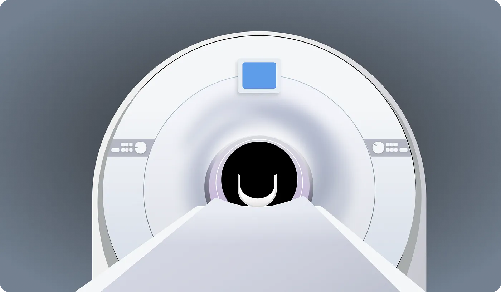
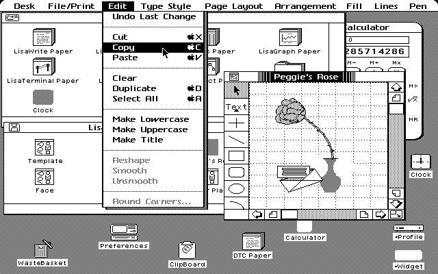
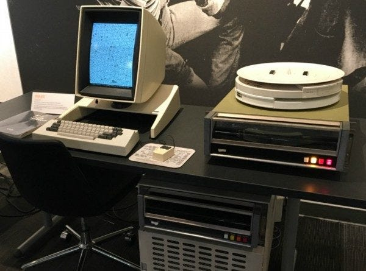
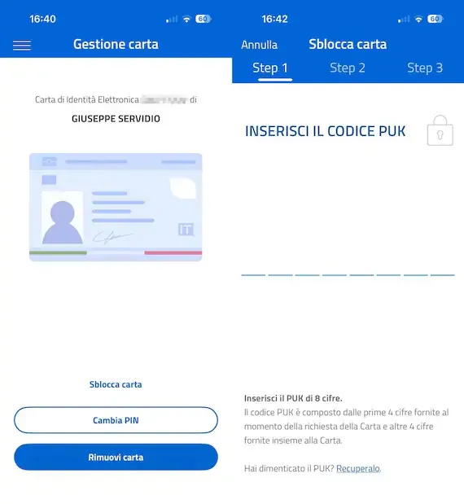
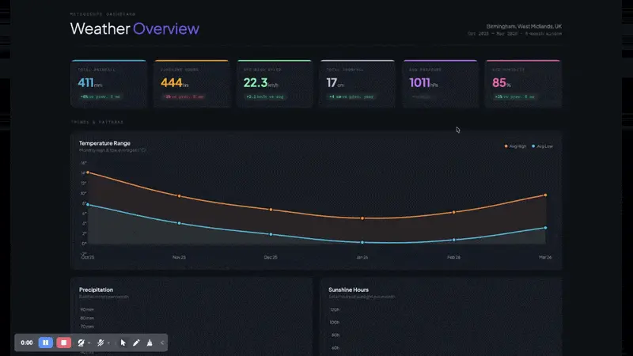
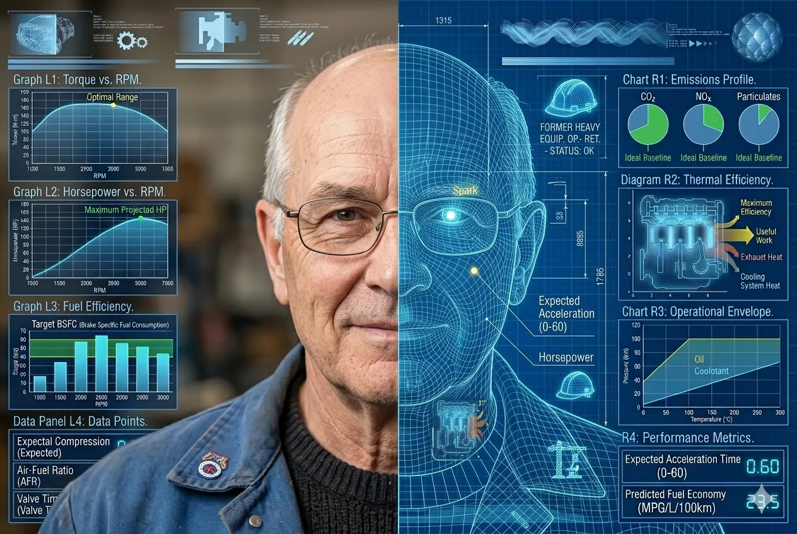
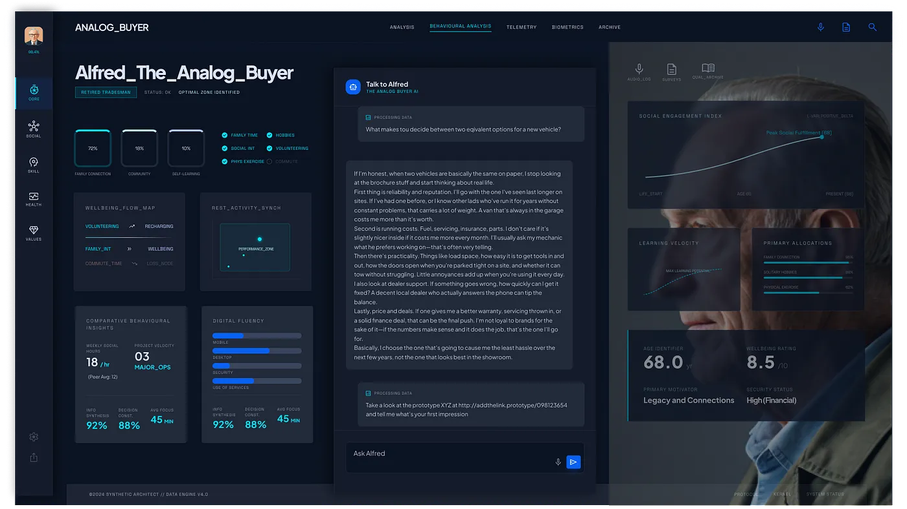
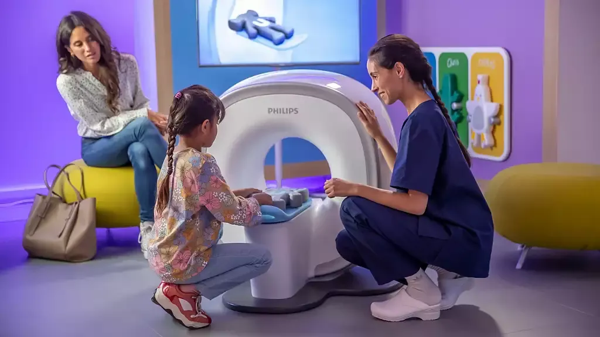

设计实践正在再次改写。流程在持续压缩，过去常由初级设计师承担的大量任务，正在被自动化替代。速度比以往任何时候都更重要，产品上线周期也随着 AI 技术演进不断缩短。

AI 让原型阶段更容易，也在一定程度上让更多人能参与设计。于是出现了一种声音：既然界面会变成“标准化商品”，设计职业可能会被消解。本文没有沿着“设计是否会消失”继续展开，而是抓住另一个同样关键的问题。

与其说设计会消失，不如说 AI 正在提供一次回归设计本质的机会：帮助用户以更高满意度达成目标。真正的工作，不是沉迷工具，而是把注意力重新放到结果上，用新工具兑现设计最核心的承诺。

## 一点背景

过去十年里，设计越来越常被等同为 UI 和视觉表达。但 UI 与视觉只是设计体系中的一层，主要承担沟通层和部分交互层的职责。

从人机交互诞生开始，核心挑战一直是“让人类能与机器顺畅互动”。在机器能力受限的年代，往往是人去适应机器。

设计当时最关键的作用之一，是把机器语言翻译成可理解的现实隐喻，例如桌面、文件夹、文件、按钮。这种做法依赖熟悉性：即使计算机内部并不真的按“桌面/文件夹”运行，人依然能借熟悉概念理解复杂系统。

设计本质上是一门复杂且整体性的学科。随着 2000 年代和 2010 年代数字产品复杂度提升，学科分工细化是必然结果：各层都出现了专门角色。但副作用也随之出现。对业务方最可见、最容易识别的 UI 与视觉，被误认为“设计的全部”。

这种 UX/UI 的张力已经被讨论多年，也长期构成设计师的挫败来源。设计从战略中心位置后撤，同样是被反复验证的趋势：UX 越来越像业务目标的副产品，而不再是驱动目标定义的核心力量。设计控制权正在从设计师向算法、自动化工具和业务方转移。

## 专业化的反面

专业化也带来了知识孤岛。例如 UX 只负责信息结构、流程与线框，UI 再去“上皮肤”。两者之间容易出现明显断层：视觉效果与交互行为更关注“是否吸睛”，而不是“是否真正承载意义”。无论是早年的拟态潮流，还是近年的玻璃质感风潮，都是同类问题。

另一重副作用是设计视野被压窄，尤其在敏捷语境下，UX 经常只盯单条路径或子路径，而非完整体验。

体验设计无法脱离视觉层、交互层、信息架构与内容层，更无法脱离研究和实验。真正的好设计需要这些要素协同，去降低复杂度，帮助人完成真实任务。关键从来都是：准确理解人真正需要什么，也就是同理心能力。

## 范式正在翻转

一个值得重视的变化是：机器正在越来越能理解人类语言，范式开始翻转。未来是否还需要继续沿用过去的人机隐喻体系，设计界需要重新评估。

当机器越来越懂人时，设计是否还要把主要精力放在“让机器看起来好懂”上？

从命令行到图形界面，再到对话式交互，这条抽象层演化链路已经非常清晰。但今天的公开 AI 产品，本质上依然在依赖旧隐喻来降低复杂度。所谓聊天界面并不天然“先进”，更像一种技术回摆：CLI（文本）到 GUI（图形）后，又回到文本，只是套上了“对话”隐喻外壳。

按钮和图标仍然不可替代，因为它们是动作指示器，像门把手一样告诉人“这里可以操作”。这种可供性并没有消失。

## 那么可以怎么做

当前至少有两条值得抓住的路径。

第一，设计师可以把重心真正上移到系统层和服务层。与其沉迷单点细节，不如围绕跨系统、跨触点的完整结果展开，也就是回到服务设计语境。用户使用产品是为了结果，不是为了产品本身；单个产品通常只是整个服务链路的一部分。

现实中存在大量“界面干净、可用性尚可、整体体验却混乱”的产品。问题不在单个页面是否精致，而在链路是否连贯。

## 一个现实例子

意大利近年在公共服务数字化上投入巨大，线上办理能力明显提升，也建设了较完整的设计系统，目标包括可访问性、易用性与流程简化。

但执行层仍可见结构性断裂。以电子身份证（CIE）相关服务为例，用户需要 PIN 与 PUK 才能完成关键操作，而两段信息分散在不同时间节点和材料里。对大多数人，尤其是老年人，这种机制非常脆弱：信息是否被妥善保存、是否在首次办理时被充分理解，都会直接影响后续可用性。

这类系统常见的问题是：单点被打磨得很精细，但点与点的连接方式、用户对整段服务的真实感受，并没有被同等重视。

“每个组件都做对”并不足以保证“整体体验可用”。如果连接这些组件的系统本身有问题，局部最优无法转化为整体最优。过去设计团队往往缺少同时处理两者的带宽，而这恰恰是下一阶段最应投入的地方。

另一个经典现象是，用户会把系统失败归因到自己头上。这会掩盖真实问题，进一步误导产品判断。仅靠访谈问答很难还原完整真相，现场观察与情境证据往往更关键。

## 速度因素

界面层依然重要：可学、可懂、可用、可满意，这些标准并未过时。不同的是，AI 让原型构建速度大幅提升，小时级测试成为可能。设计可以更快拿到真实数据，而不是在假设上耗费大量时间做静态稿。

更快的迭代不只意味着“省时间”，更意味着反馈回路被缩短，跨流程、跨触点验证变得可行，设计与工程协作也能更早进入接近生产环境的状态。与之相对，用户招募这种长期瓶颈会变得更关键。

但在让 AI 开工之前，仍然需要先定义清楚目标、系统形态、触点边界、约束条件，以及最重要的“为什么做”。AI 提供的是更高强度实验能力，不是替代问题定义能力。

## 起点：研究而不是幻觉

研究层面的情况更复杂。AI 在自动分析、聚类归纳等方面价值明显，尤其适合重体力环节；但在定性研究上，它仍有局限。

访谈、可用性测试等材料经 AI 处理后，经常出现“结论看起来完整、关键细节却被抹平”的问题。那些由少数用户提出、却可能指向核心系统缺陷的线索，容易在统计平均中被淹没。

启发式评估、认知走查、专家评审这类方法中，AI 的结果通常“还不错”，但往往停在中位水平。设计里最重要的突破，很多时候来自微小且反直觉的改动，这类信号不一定会被模型优先识别。

因此，设计仍需要多尺度视角：既看服务全景，也看微观交互；既看数据，也看语境。仅有报告和任务序列，难以真正建立同理心。合成用户在某些场景可辅助，但不能替代真实用户接触。

## Digital Twin 与 Design Twin

对“合成用户”的谨慎，并不意味着要拒绝 AI。更值得探索的方向是“Design Twin”。

传统 Digital Twin 往往由人口属性、行为数据、问卷信息和聚合模式构建，能统计性模拟某类用户，但它的边界也很明显：它擅长“规模化近似”，不擅长“情境化共情”。

Design Twin 的关键差异，是把构建材料从“泛化数据”转向“真实研究残留物”：犹豫、停顿、肢体信号、语言与情绪的不一致、未被直说的挫败点。它应该基于特定产品人群持续更新，作为把研究洞察带回日常交付环节的“活基础设施”。

它不替代研究员，而是让研究员最难获得的洞察在田野结束后仍可被持续调用。它不是“替人决策的假人”，而是“让同理心持续在线的决策介面”。

在理想形态下，Design Twin 可以吸收大量真实访谈、可用性测试和行为数据，形成可查询、可验证、可持续刷新的洞察层，支撑日常设计判断，同时保留与真实用户持续接触的主线。

## 风险与注意事项

Design Twin 最大风险是“静态衰减”。人不是固定变量，环境变化会快速改变预期与行为。基于过时数据构建的“高保真用户镜像”，很快会退化成历史残影。

另一个系统性风险是“无限反馈回路”：一端用 AI 生成研究对象，另一端再用 AI 访谈并验证，机器互证机器，现实摩擦被彻底排除。结果可能看似数据充分，实则地基空心。

这会把设计推向一种危险状态：用速度换取浅层确定性，用舒适替代真实。

## 把事情做对

要抵抗静态衰减，Design Twin 必须被当作活体系统维护，持续输送未经中介的人类互动材料。也就是持续观察、持续访谈、持续记录那些容易在摘要中丢失的细节，再把这些细节高质量回注到模型。

这意味着：与真实用户接触这件事不会被省掉，反而更重要。设计真正稀缺的价值，仍是对人真实需求与动机的理解能力。这里正是 AI 的边界，也是人类判断力、同理心和定性研究不可替代的位置。

## 可执行落地

这套方法必须适配今天的节奏，不能通过“停工等研究”实现。两个常用框架很实用：

- **Continuous Discovery**：持续与用户互动，把洞察产生从阶段性活动改成常态机制。  
- **Parallel Research Stream**：让研究流与设计/开发流并行推进，而不是串行堵塞。

## 实战案例

Philips 在儿科 MRI 场景的实践是一个典型案例。团队先观察真实使用情境，发现儿童对设备恐惧是关键障碍，进而围绕设备形态和诊疗旅程整体重构体验，通过叙事和流程设计降低不安感，提升配合度与结果质量。

这件事的核心不在“界面做得多漂亮”，而在“是否真正理解用户处境，并据此重构端到端体验”。

起点不是屏幕，而是一个害怕做检查的孩子。工具会变，这个起点不该变。

## 参考文献

- Daniel Kahneman, Olivier Sibony, Cass Sunstein, *Noise: A Flaw in Human Judgment* (2021)
- Sarah Gibbons, Huei-Hsin Wang, *Design Process Isn’t Dead, It’s Compressed* (2026)
- Ax Ali, *The UX identity crisis* (2021)
- Don Norman, *The Design of Everyday Things* (1988)
- Vannevar Bush, *As We May Think* (1945)
- Stuart Card, Allen Newell, Thomas P. Moran, *The Psychology of Human-Computer Interaction* (1983)
- Hyunyim Park, *AI-Assisted Designers or Designer-Assisted AI?* (2025)
- Marzia Mortati, Giovanna Viana Mundstock Freitas, *AI in Service Design* (2025)
- Dolphia, *Why AI is exposing design’s craft crisis* (2025)
- Raphael Dias, *UX as a byproduct of existential marketing* (2019)
- Peter Skillman, WebSummit 2025 keynote
- UX Planet, *The Rise and Fall of Neumorphism* (2025)
- Jacob Nielsen, *Hello AI Agents: Goodbye UI Design, RIP Accessibility* (2025)
- Raluca Budiu, *Evaluating AI-Simulated Behavior* (NNG, 2025)
- Konstantinos Papangelis, *The Synthetic Persona Fallacy* (2025)

## 原文链接

> **What AI exposes about design**
>
> 来源：UX Collective | 作者：Alessandro Molinaro
>
> 站内版本按原文章节顺序整理为中文译读，并保留了正文配图与关键论证链。
>
> 👉 <a href="https://uxdesign.cc/what-ai-exposes-about-design-319029d48441" target="_blank" rel="noopener noreferrer">点击阅读原文</a>
