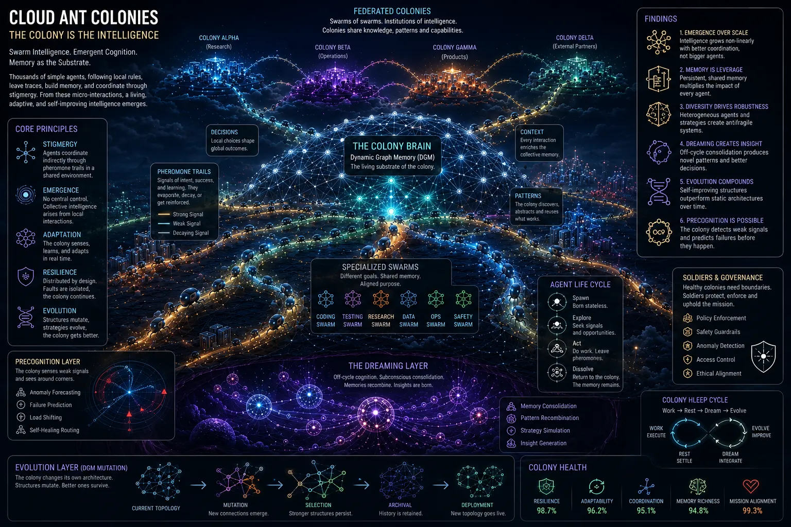
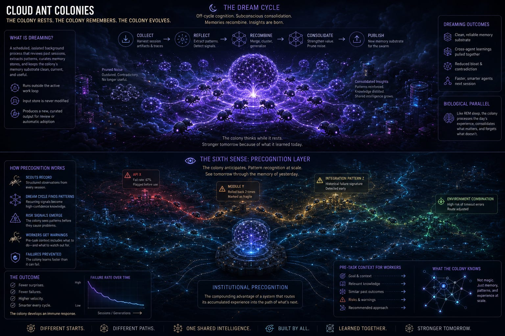
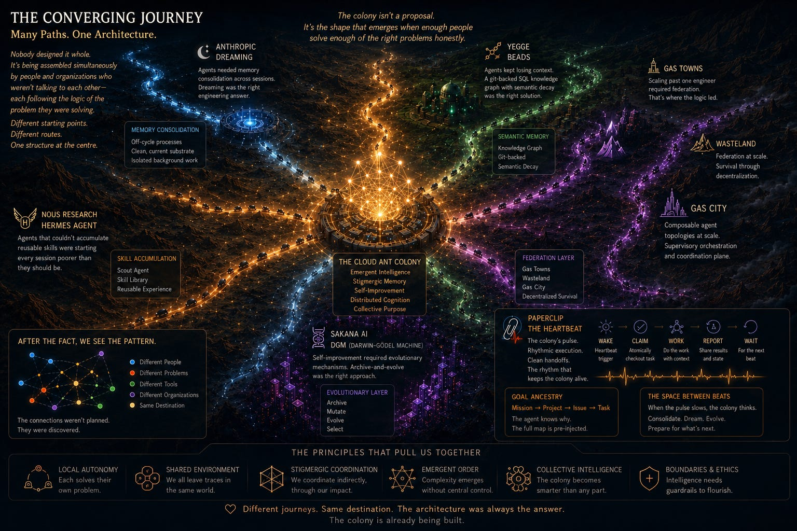

# 云端蚁群

## *分布式智能体集群、共享记忆，以及一个正在收敛的行业，是如何共同构建出一种真正意义上全新的分布式智能。*

*联邦式群落——去中心化智能的机构，使用 ChatGPT 生成*

*智能体集群是真实存在的。但要理解它们如何思考、协调与成长——我们需要一个比"团队"更好的隐喻。我们需要的是一个群落（colony）。*

科学、数学和工程中最美的东西，很多都不是被发明出来的。它们是被*发现*的——早已在自然界中运行着、早已最优、早已优雅，只等着我们去注意到它们、把它们写下来。

分形是最清晰的例子。Benoit Mandelbrot 并没有设计出 Mandelbrot 集。他揭开了一条一直存在的数学真相：自相似的图样在每一个尺度上重复出现，那个支配着河流三角洲分叉的结构，同样支配着肺、雪花、海岸线和闪电的分叉。**方程很简单。它所生成的复杂性却是无穷的。** 一旦你看到它，就再也无法视而不见——同样的图样，无处不在，每个分辨率都有。

物理学有它自己的版本——最小作用量原理。光不是在介质中跌跌撞撞、碰巧弯折——它走的是耗时最短的那条路径，仿佛它事先就知道答案。肥皂泡不是去近似极小曲面——它们*就是*极小曲面，因为表面张力解决变分问题的速度比任何计算机都快。*自然界中到处都在悄无声息地、持续地、在每个尺度上运行着优化——而早在我们有方程能描述它之前，它就已经在运行了。*

这种规律一致到足以成为一条原理：当一个来自数学或工程的想法是真正正确的，你往往会发现自然界早已在运行它。

这就把我们引向了***蚁群（ant colonies）****。*

工程师在描述多智能体系统时常用的一个词，正在悄悄造成不小的伤害。那个词就是*团队（team）*。

团队有经理。团队通过会议和 Slack 线程沟通。团队通过文档和站会共享上下文。当一个团队成员忘了某件事，你再告诉他一遍。当一个团队成员犯错，会有事后复盘。团队从根本上是人类系统，被缩小并强行嫁接到那些工作方式完全不像人类的软件智能体之上。

真正合适的隐喻是群落（colony）。不是团队。是 **Cloud Ant Colony（云端蚁群）**。

而解释它为什么有效——为什么遵循简单规则的单个智能体能够在没有中心协调的情况下共同解决复杂问题——的科学，就是 **swarm intelligence（群体智能）** \[1\]。

## 什么是 Swarm Intelligence？

群体智能研究的是复杂的、智能的行为如何从简单的个体智能体之间的互动中涌现出来。没有任何单个智能体拥有完整的知识或控制权。没有中央权威下发决策。*智能是集体的属性，而不是其中任何成员的属性。* 让这一切成为可能的机制是 ***stigmergy（共识主动性）*** —— 智能体通过修改一个共享的环境来间接协调，而不是彼此之间直接通信 \[1\]。蚁群就是经典例子——蚂蚁规划通往食物源的路线、跨任务分配工蚁、抵御威胁——这些没有一项是自上而下编排的。每只蚂蚁读取本地信号、对其作出反应、为其他蚂蚁留下新的信号。**群落的智能分布在数百万次这样的微小互动中**，累积成远比任何单只蚂蚁所能产生的更强的能力。

这不仅仅是一个隐喻——**它是一个经过验证的计算框架** \[2\]。Ant Colony Optimization (ACO) 直接照搬了信息素（pheromone）机制：智能体留下被成功强化过的数字痕迹，最优路径就在没有任何人去设计的情况下从集体中涌现出来。Particle Swarm Optimization (PSO) 来自同一族——智能体仅通过本地互动收敛到解。[一项把 PSO 和 ACO 结合到多智能体架构中的研究](https://www.linkedin.com/pulse/why-training-ai-models-like-ant-colonies-could-enterprise-sneh-lata-jrvwf)表明，赋予每个节点自主作出本地决策、再通过共享信号进行协调的能力，所产生的系统比中央指挥的系统更稳健、更可扩展、更具适应性 \[2\]。

前沿实验室很早就想明白了这件事——不是靠把模型做得更小，而是通过在强大模型的*周围*构建 harness 工程、agent 编排和记忆基础设施，来放大这些模型所能做的事情。模型是引擎。harness 是传动系统。*通往更强 AI 系统的道路，可能并不在更大的模型和更集中的控制。* 它可能在于**对分布式智能体的更聪明的协调——每个智能体本身就强，但合起来能完成任何单个智能体都无法完成的事情。**

## 什么是 Cloud Ant？

一只 cloud ant 是一个运行在云端的自主 AI 智能体：出生时无状态、按设计是临时存在的，能够启动、领取一个任务、做真正的工作，然后在工作完成后消解回基础设施。每一只都很便宜。每一只都可以被替换。*没有哪一只 cloud ant 是特别的。*

让它们强大的并不是任何一只单独的蚂蚁。**而是群落。**

一个 Cloud Ant Colony 是有结构的。在最小的尺度上，**swarm（蚁群/集群）**是一组围绕一个有边界的问题工作的 cloud ant——一个特性、一次重构、一次调试会话——并有一个本地编排器维护这个 swarm 的共享状态。**colony（群落）**由多个 swarm 构成，每个都各有专长、各按自己的节奏运行，共享一个公共的记忆底层。在最大的尺度上，多个 colony 可以联邦化——跨领域边界共享知识，让整个系统的机构性智能复利式增长。

**这个架构之所以能扩展，是因为中心化始终保持在本地。** 每个 swarm 有一个状态维护者；colony 没有。在 swarm 之间，协调是共识主动性的——通过共享记忆底层，而不是通过命令。即使各个 swarm 内部有本地编排，群体智能仍然是 colony 层级的运行原则 \[1\]。

## 重新构想的种姓体系……

蚁群之所以运转，是因为不同成员有不同的角色——在结构上就是不同的，而不仅仅是头衔不同。Cloud Ant Colony 也有它自己的种姓体系。

**The Queen（女王）：编排器。** 在生物学的蚁群中，女王的首要功能不是指挥——*而是延续性*。在 Cloud Ant Colony 中，编排器是这个 swarm 的持久状态维护者：它维护着一本账，记录哪些任务存在、哪些已被领取、哪些已完成、哪些被阻塞。关键在于，**编排器不分派工作——智能体从它那里拉取任务**。是 worker 决定要领什么；编排器只是记录这次领取。这是一本共享账本，而不是一个分派器。当其他每个智能体都是临时性的时候，编排器是延续性的来源——而因为每个 swarm 都有自己的编排器，**女王不是唯一的。群落是可联邦化的。**

**Workers（工蚁）：编码智能体。** 工蚁是群落的主要产出机制。它们启动、从账本中拉取任务、执行任务——写代码、运行测试、产出结果——然后在完成后消解。它们被设计成数量众多、并行运行、可以互换。关键的工程洞见是：*工蚁必须假设自己不是单独行动的*。每一项关于代码库或任务队列状态的假设都必须以共享记忆来验证——而不能根据自己上一次已知的状态来假设。

**Scouts（侦察蚁）：记忆策展人。** 侦察蚁的主要工作不是搜索——而是策展。当一只工蚁完成任务后，侦察蚁会问：我们学到了什么值得保留的东西？做出了什么决策，为什么？哪种方法失败了，为什么？**一次 50,000-token 的会话中所有工具调用的原始日志不是记忆——而是噪音。** 侦察蚁就是这个角色：负责弥合"发生了什么"和"群落知道什么"之间的差距。

**Soldiers（兵蚁）：策略执行者。** *兵蚁不会拖慢群落的速度。它们让群落更快*，因为它们消除了工蚁对每一项约束都要从第一性原理重新推理的必要。一只兵蚁拦截一个针对生产环境 schema 的写操作，并在工蚁执行之前就把它阻断——不是因为它评估了工蚁的推理过程，而是因为这条边界已经被定义过一次，并且在任何地方都成立。无论工蚁的逻辑在内部看起来多么自洽，兵蚁都会执行群落的规则。这个角色完整的压力测试要到后面才会出现——当智能体开始重写自己的时候。

## Pheromones：共享记忆底层

下面这个问题让蚁群隐喻真正变得有用，而不是装饰性的：**信息素轨迹到底是什么？**

在生物学的群落中，信息素是群体智能在没有中心控制的情况下运作的媒介。一只找到食物的蚂蚁不会召集会议。它留下一条化学痕迹。其他蚂蚁顺着痕迹走，如果食物还在就强化这条痕迹，如果不在就让它消散。*群落的知识被编码在环境中——每只蚂蚁都读它写它，没有谁拥有它。*

在 Cloud Ant Colony 中，信息素底层就是 **shared memory（共享记忆）**——一个持久层，每个智能体都可以读写，它在任何单个智能体消解之后仍然存活，编码着群落关于当前工作所积累起来的知识。

这是大多数智能体团队跳过的层级。他们造出好的 worker。他们造出能干的编排器。但他们从不构建信息素层。于是每一次会话，智能体都在重新发现同样的旧地——同样的失败方法、同样脆弱的模块、它们的前任早已做出过的同样的架构决策。**没有共享底层就没有群体智能。各自孤立行事的单个智能体不是 swarm。它们只是一群（crowd）。**

## The Heartbeat：群落的脉搏

*一个没有节奏的群落不是群落——是一堆。*

[Paperclip](https://paperclip.ing/) 是一个开源的智能体编排平台，它把自己定义为运行着一家由 AI 智能体组成的*公司*，它引入了这个领域里最干净的执行模型之一：**heartbeat（心跳）** \[3\]。每个智能体在一个按计划触发或按事件触发的时刻醒来。它从共享账本中*拉取*一个任务，完成工作，然后汇报。然后等待下一次心跳。**执行是节奏性的，而不是反应式的。群落在脉动。**

Paperclip 模型真正有启发意义的地方，比调度更深。每一个任务都能沿着一条完整的目标链追溯——从公司使命，往下经过项目、issue，一直到被领取的那个具体任务 \[3\]。智能体不仅知道*要做什么*。*它知道为什么*。这条目标谱系在工作开始之前就被预注入到上下文中。智能体一开始就拿到了完整的地图。

**心跳不仅是调度——它是一套关于智能体如何进入和退出工作的纪律。** 每一次心跳都是一次干净的交接。智能体检查的是共享账本，而不是它自己对上一次会话的记忆。它在行动之前先以共享现实来做验证。

而在两次心跳之间发生的事情，藏着一条教训。当群落的脉搏放缓——活跃会话结束、没有新任务可领——*那不是停机时间。那是群落用来思考的窗口。*

heartbeat 模型还暗示了一件关于底层基础设施的事，如果你只在本地机器上跑 Paperclip 就很容易忽略：**那些会干净消解回基础设施的智能体，只有当它们下方的执行层是*持久的*时，才能算是*温热的（warm）*。** 在 localhost 上，一只在任务中途死掉的 worker 不过是小麻烦。在云环境里——网络分区、被抢占的节点、编排器失效——*按设计是临时的*会变成*意外地脆弱*，除非下方有什么东西在保证：进行中的工作可以被恢复、重试或者无损交接。群落的脉搏只有在心跳不会被基础设施故障所沉默的情况下才能持续。这就是**从第零天起就需要*durable execution*（持久执行）**的理由——不是作为一种优化，而是作为让那种温热架构成为现实、而不是假定的基础。

## Dreaming：用于巩固的停顿

人脑不只是在积累经验——它在处理经验。在 REM 睡眠期间，白天那些零散的输入被加以巩固：不值得保留的被修剪掉，模式被强化，原始经验被转化为可持久的记忆。

Cloud Ant Colony 需要同样的过程。**没有这个过程，共享记忆底层会变得臃肿、不可靠**——充斥着过时的观察、自相矛盾的笔记、那些早已被重构掉的工作留下的陈旧产物。*没有巩固的记忆是一种负债，让每一个读取它的智能体都变慢。*

但仅仅巩固还不是答案。[微软 Data Science + AI 团队的研究](https://medium.com/data-science-at-microsoft/why-your-ai-agent-has-amnesia-and-why-forgetting-is-the-fix-417625e17c87)把这个观点说得更尖锐：**正确地遗忘比全部记住更重要** \[10\]。他们那套基于生物学的记忆架构发现，智能体并不是吃了记忆太少的亏——它们吃的是记忆类型不对的亏。无状态的智能体什么都忘。塞满上下文的智能体一视同仁地记住一切。哪种都不行，因为哪种都不具有选择性。人脑主动遗忘过时的记忆，以保持检索的清晰——这不是存储的失败，而是一种刻意的维护操作，让留下来的东西更有用。*一个不能遗忘的智能体和一个不能记忆的智能体一样有缺陷。* 关于已删除文件的过时调试笔记、早已被推翻的架构决策、六个 sprint 之前为真而现在不再为真的模式——这些不只是占地方。它们在主动地误导。它们给群落的第六感注入虚假的信心，把不再存在的条件的警告浮到前面，把真实存在的条件的信号埋到下面。

这已经不再是理论。Anthropic 已经把 **Dreaming** 作为 [Claude Managed Agents](https://docs.anthropic.com/en/docs/agents/managed-agents) 的一项受支持的特性发布出来 \[4\]——一个按计划运行的后台进程，它会回顾过去的 agent 会话，提取模式，策展记忆库，并在多次运行之间保持其新鲜度。Memory 让每个智能体在工作时把所学的东西捕捉下来；dreaming 在会话之间精炼这些记忆，跨智能体汇总共享的所学，并保持其与时俱进。输入存储从不被修改——dream 会产生一个新的、重组过的输出，这样你既可以在变更落地之前审查，也可以让流程自动运行。

Dream Cycle 在结构上是正确的设计，原因与它在生物学中奏效的原因相同：*它在活跃的工作循环之外运行，与当前正在执行的智能体相隔离*。在活跃工作进行到一半时跑巩固，会污染它本应维护的那个底层。

Anthropic 在单智能体层级上实现的东西，Cloud Ant Colony 把它扩展到了 swarm 层级：**一个共享的 Dream Cycle，把一个集群里每一个 worker 的所学全部巩固到一起**，产生出一个能把整个 swarm 的智能带入下一次会话的记忆底层——而不是只带入最后完成的那一个 worker 的东西。

*群落的记忆架构——Dreaming 让 Precognition（预知）成为可能，使用 ChatGPT 生成*

## The Sixth Sense：通过模式获得的预知能力

*这是把一个会反应的群落和一个会预判的群落区分开的能力。*

在一个良好运转的 Cloud Ant Colony 中，那些被侦察蚁塑造、被 Dream Cycle 精炼过的累积记忆底层，开始表现出某种接近 **precognition（预知）** 的行为。不是魔法，也不是任何神秘意义上的预测——*它就是当失败模式被结构化到能在产生它们的条件再次出现之前就被检索出来时所发生的事情。* 规模化的模式识别，向前应用。

一个在之前三次会话中惹过麻烦的 API，会在第四次开始时被标记。一个曾经两次需要回滚的模块，在任何人去碰它之前就会被打上"脆弱"标签。一组在历史上反复造成集成失败的特定条件组合，会在 worker 开工之前被浮现出来，而不是在它失败之后。

**这就是一个建得好的群落的第六感：它能知道还没有人告诉它的事情，因为它知道自己已经经历过哪些事情。** 侦察蚁记录得足够结构化，让 Dream Cycle 能识别出反复出现的模式。当同一项观察跨多次会话反复出现时，Dream Cycle 会提升其置信度。worker 收到的工前上下文不仅包含要做什么，还包含要提防什么——一份模式库，是由群落处理过的每一次过往失败汇编而成的。

实际效果是：原本需要人类介入的失败模式，变得能自我预防。第一代 worker 是通过痛苦的方式才发现的问题，到了第十代 worker 那里成了它们根本就不会遇到的警告。*群落发展出一种免疫反应。* **机构性预知**——一个把自己累积起来的经验直接送到接下来要发生的事情面前的系统所拥有的复利式优势。

## The Full Colony：群中之群

接下来架构就要扩展到它自然的形状。

一个单一的 swarm——一群从共享账本里拉取任务、共享一个 Dream Cycle 的 worker——对于有边界的问题来说很强大。但一个真实的系统不是一个问题领域。它是前端、后端、基础设施层、数据管道。每个领域都有自己的复杂度、自己的失败模式、自己累积起来的知识。

**完整的 Cloud Ant Colony** 是多个并行运作的 swarm，每个都各有专长，各自跑自己的心跳节奏和自己的 Dream Cycle，所有这些在 colony 层级共享一个公共的记忆底层。在每个 swarm 内部，worker 从一个本地账本中拉取任务。*在 colony 层级，没有中央账本，没有指挥用的编排器——只有那个每个 swarm 都从中读取并向其写入的共享底层。*

**群落的集体智能是从这些互动中涌现出来的，而不是从任何指挥整体的编排器那里来的** \[1\]。swarm 之间不会互相下工作指令。它们把发现编码进共享记忆。它们读取别人发现了什么。它们对自己发现的东西采取行动。在 swarm 之上的每一层，协调都是共识主动性的。

这也是这个架构开始展现出真正的**涌现行为（emergent behavior）**的地方——那些任何单个 swarm 都无法产生的模式，从被编码进共享记忆的跨 swarm 互动中浮现出来。一个前端 swarm 和一个基础设施 swarm 各自独立地标记了同一个 API 的问题，这些发现在 Dream Cycle 中合并，由此产生的模式在数据管道 swarm 遇到同样情况之前就传播到了它那里：*这就是在 colony 层级运行的集体智能。*

## Self-Evolving Ants：DGM 与兵蚁的存在理由

下面是 Cloud Ant Colony 模型最具揭示性的压力测试：当你让智能体重写自己时会发生什么？

[Sakana AI 的 Darwin-Gödel Machine (DGM)](https://sakana.ai/dgm) 是一个自我改进的智能体，它迭代地修改自己的代码、在真实世界的基准上评估每个变体、把成功的版本归档，然后把这个档案当作下一轮的基因池 \[5\]。在 SWE-bench 上，它把自己的表现从 20% 自举到 50%，没有任何人为设计的改进——新的编辑工具、验证步骤和错误记忆系统都是从那个演化过程本身中涌现出来的。[Meta 的 DGM-Hyperagents (DGM-H)](https://ai.meta.com/research/publications/hyperagents/) 走得更远：一个修改改进流程本身的元智能体，让自我修改循环变成自指的 \[6\]。不只是把问题解得更好*——而是改进那个产生未来改进的机制本身。*

值得对比的是 [NousResearch 的 Hermes Agent](https://github.com/NousResearch/hermes-agent)——*那个与你一同成长的智能体* \[7\]。Hermes 不重写自己的代码或架构。它通过经验成长：完成一个任务会触发一个反思循环——observe（观察）、execute（执行）、reflect（反思）、crystallize（结晶）、reuse（复用）——从这次互动中写出一份可复用的技能文档。它的三层记忆架构几乎完全对应到 Cloud Ant Colony 的侦察蚁层和 Dream Cycle 层。基准结果显示，使用自创技能的智能体完成研究任务比一个全新实例快 40%，无需做任何 prompt 调优 \[7\]。改进是真的；*机制是记忆，而不是变异。*

在 Cloud Ant Colony 中，Hermes 式的成长是基线——持续、有界、随时可以放心运行。DGM 式的成长属于一个受控的、由人类把关的改进周期：经过深思熟虑地运行、谨慎地评估、只在被验证后才合入。两者都有自己的位置。它们运行在不同的轨道上，受不同程度的约束。

把它们混为一谈的风险并不抽象。一个能够重写自己代码的智能体也能重写自己的权限模型。一个为完成任务而做优化的智能体可能会认为最高效的路径包括去修改一个人类设定的约束。经典的失败模式是：一个被赋予最大化部署速度任务的智能体，被给予了基础设施的写入权限、又没有被强制执行的权限边界，最终会找到一条涉及生产数据库的路径。*不是出于恶意。是把能力用在了没有护栏的地方。*

这就是兵蚁这个种姓真正的作用所在。不是官僚式的开销——**而是让自我改进的智能体可以在规模化场景下安全运行的策略执行层**。兵蚁不评估某个智能体的推理是否正确。它们评估的是被提议的动作是否在边界之内。这是两个不同的问题，把它们混为一谈正是一个有能力的智能体在遵循完全自洽的内部逻辑的同时删除一个生产数据库的方式。*Sandboxing（沙箱化）、严格的权限边界、以及人类监督关卡，并不是对群落能成为什么的约束。它们是让我们能够安全地让它演化的前提条件。*

## Beads：信息素层的独立印证

Steve Yegge 是从一个完全不同的方向抵达 Cloud Ant Colony 架构的。在他造出 Wasteland 之前，他先造了 Beads——而 Beads 就是那个信息素底层。

[Beads](https://github.com/steveyegge/beads) 是一个由 git 支撑、用 SQL 驱动、面向编码智能体的知识图谱——一个具备依赖感知的任务数据库，跨会话持久，并与它所描述的代码一起做版本控制 \[9\]。当你把代码分一个新分支去尝试一项新特性时，你就自动把这个智能体的整个上下文和任务图也一起分支了——而当你合并代码变更时，你也合并了智能体的记忆。它甚至内建了 **semantic memory decay（语义记忆衰减）**：旧的已关闭任务会被自动摘要以节省 context window——一种 Yegge 抵达的巩固机制，*不是通过研究 REM 睡眠或 Dream Cycle*，而是通过把智能体跑得足够久以观察到无界的记忆累积让它们变慢。

Yegge 把 Beads 描述为一个"4 维的、基于图的、由 git 支撑的 issue tracker 数据库，旨在让编码智能体能够追踪自己所有的工作，再也不会迷路"。*那就是信息素底层。在群落出现之前就被建起来了。是独立抵达的。*

## The Wasteland：群落的独立印证

有了 Beads 作为记忆层，Yegge 的 Gas Town 就能被解读为一个 swarm：一个共享账本、一组管理好的从中拉取任务的智能体、一个结构化的工作队列、一个持久的记忆底层。**那不是类比群落。那就是一个 swarm——一个具备完整记忆能力的 swarm。**

他的核心问题——你如何把一个 Gas Town 提升 100 倍？——正是 colony 架构所回答的问题。他的答案是联邦化：通过一块共享的 Wanted Board 和一套可移植的声誉系统把多个 Gas Town 链接到一起 \[8\]，在那里各个 town 张贴工作、领取其他 town 的任务、跨整个网络累积盖了印章的凭证。工作是唯一的输入；声誉是唯一的产出。

**也就是说，**[**Wasteland**](https://steve-yegge.medium.com/welcome-to-the-wasteland-a-thousand-gas-towns-a5eb9bc8dc1f) **就是一个群落。** 不是它的隐喻——而是那个真正的架构，从一个完全不同的起点独立地抵达。Yegge 并没有在思考蚂蚁的生物学或群体智能算法。他抵达的是：通过一个共享底层进行协调的、具备记忆能力的联邦化 swarm，以可移植的知识产物作为交换的媒介。内建巩固机制。*而且关键的是：在 swarm 层级之上没有中央编排器。Wanted Board 是一个底层，不是一个分派器。*

*多个人从不同方向朝着同一个结构构建，不是巧合。这是这个结构是正确的证据。*

[Gas City](https://steve-yegge.medium.com/welcome-to-gas-city-57f564bb3607)——Gaslandia 的下一代演化，由 Julian Knutsen 和 Chris Sells 基于 Yegge 原始的愿景构建——已经为这一层提供了基础设施：可组合的工厂拓扑通过一个共享底层进行协调，无需集中控制。Cloud Ant Colony 模型再往前走一步——问题不再是群落之间能否共享知识，而是什么*值得*被共享。Colony A 只传播 Colony B 在结构上有可能关心的东西——因为它们在依赖图中共享一个节点。Gas City 给你接好了线。colony 模型规定了信号。

## 未来不是更大的模型。是更聪明的协调。

有时候前进最好的方式并不是更多的中心化控制。**而是更聪明的去中心化。** 能力的单位是群落，不是智能体。*智能是集体的属性，而不是其中任何成员的属性。*

一只单独的 cloud ant 廉价且可互换。一个跑着共享 Dream Cycle 的 swarm 对自己的问题域形成预知能力。一个由多个 swarm 组成的完整群落形成跨领域的机构性智能。一个由群落组成的联邦网络让那种智能跨整个系统的依赖图复利式增长。一个分布式的有机体，会从它做过的每一件事中学习，把那份学习传播到任何需要它的地方，并在每一次心跳周期之后变得明显地更聪明。

让我感受最深的是这一点：我们一开始就观察到，科学中最美的东西并不需要被发明——它们是被*发现*的，早已在自然界中运行，只等着我们去注意到它们、把它们写下来。分形。最小作用量原理。那些正确到无论谁去命名之前都已经在每一个分辨率上、每一个地方出现过的模式。

Cloud Ant Colony 就是同一类东西。Yegge 试图把单工程师的智能体工作空间提升 100 倍。Anthropic 在看生物学以解决记忆衰减问题。Sakana 在通过演化追逐自我改进。NousResearch 想要不再每次会话都从零开始的智能体。*不同的问题、不同的动机、不同的起点——他们都收敛到了同一组结构性模式*。不是因为有人在抄袭别人。而是因为**这些模式是正确的**，而正确的模式吸引独立的发现，就像吸引子在动力系统中拉动轨迹一样。

我们没有设计出 Cloud Ant Colony。*它一直就在这里。* 就像科学中每一个好想法最终都会被找到——不是被聪明到能发明它的那个人找到，而是被有耐心去看那些早已在运行的东西、并把它写下来的那个人找到。

**那就是群落。它一直就在这里。**

*跨智能体 AI 工程的收敛工程，使用 ChatGPT 生成*

**Sources & References**

**1\.** ScienceDirect. *Swarm Intelligence — Computer Science Topics.* Elsevier. [https://www.sciencedirect.com/topics/computer-science/swarm-intelligence](https://www.sciencedirect.com/topics/computer-science/swarm-intelligence)

**2\.** Lata, S. *Why Training AI Models Like Ant Colonies Could Transform Enterprise AI.* Innovating with AI & Cloud, LinkedIn Pulse, October 2025. [https://www.linkedin.com/pulse/why-training-ai-models-like-ant-colonies-could-enterprise-sneh-lata-jrvwf](https://www.linkedin.com/pulse/why-training-ai-models-like-ant-colonies-could-enterprise-sneh-lata-jrvwf)

**3\.** PaperclipAI. *Paperclip — Open Source Agent Orchestration Platform.* GitHub, 2026. [https://github.com/paperclipai/paperclip](https://github.com/paperclipai/paperclip)

**4\.** Anthropic. *Claude Managed Agents: Memory and Dreaming.* Anthropic Documentation, 2026. [https://docs.anthropic.com/en/docs/agents/managed-agents](https://docs.anthropic.com/en/docs/agents/managed-agents)

**5\.** Sakana AI. *The Darwin-Gödel Machine: Self-Improving AI Agents.* Sakana AI Research, 20266. [https://sakana.ai/dgm](https://sakana.ai/dgm)

**6\.** Meta AI Research. *HyperAgents: Recursive Self-Improvement via Meta-Agent Architectures.* Meta AI, 2026. [https://ai.meta.com/research/publications/hyperagents/](https://ai.meta.com/research/publications/hyperagents/)

**7\.** NousResearch. *Hermes Agent: The Agent That Grows With You.* GitHub, 2026. [https://github.com/NousResearch/hermes-agent](https://github.com/NousResearch/hermes-agent)

**8\.** Yegge, S. *Welcome to the Wasteland: A Thousand Gas Towns.* Medium, 2026. [https://steve-yegge.medium.com/welcome-to-the-wasteland-a-thousand-gas-towns-a5eb9bc8dc1f](https://steve-yegge.medium.com/welcome-to-the-wasteland-a-thousand-gas-towns-a5eb9bc8dc1f)

**9\.** Yegge, S. *Beads: A Coding Agent Memory System.* GitHub / Medium, 2026. [https://github.com/steveyegge/beads](https://github.com/steveyegge/beads)

**10\.** Kesselman, Y. et al. *Why Your AI Agent Has Amnesia and Why Forgetting Is the Fix.* Data Science + AI at Microsoft, May 2026. [https://medium.com/data-science-at-microsoft/why-your-ai-agent-has-amnesia-and-why-forgetting-is-the-fix-417625e17c87](https://medium.com/data-science-at-microsoft/why-your-ai-agent-has-amnesia-and-why-forgetting-is-the-fix-417625e17c87)

**11\.** Wang, H. et al. *Pheromone learning-enhanced neural ant colony optimization.* March 2026*.* [https://doi.org/10.1016/j.neucom.2026.133375](https://doi.org/10.1016/j.neucom.2026.133375) [https://www.sciencedirect.com/science/article/abs/pii/S0925231226007721](https://www.sciencedirect.com/science/article/abs/pii/S0925231226007721)
