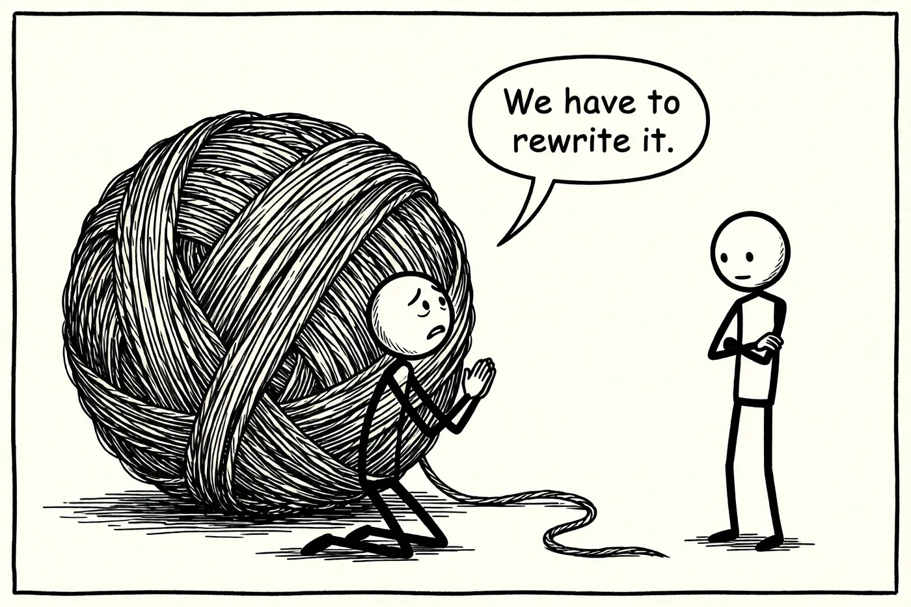
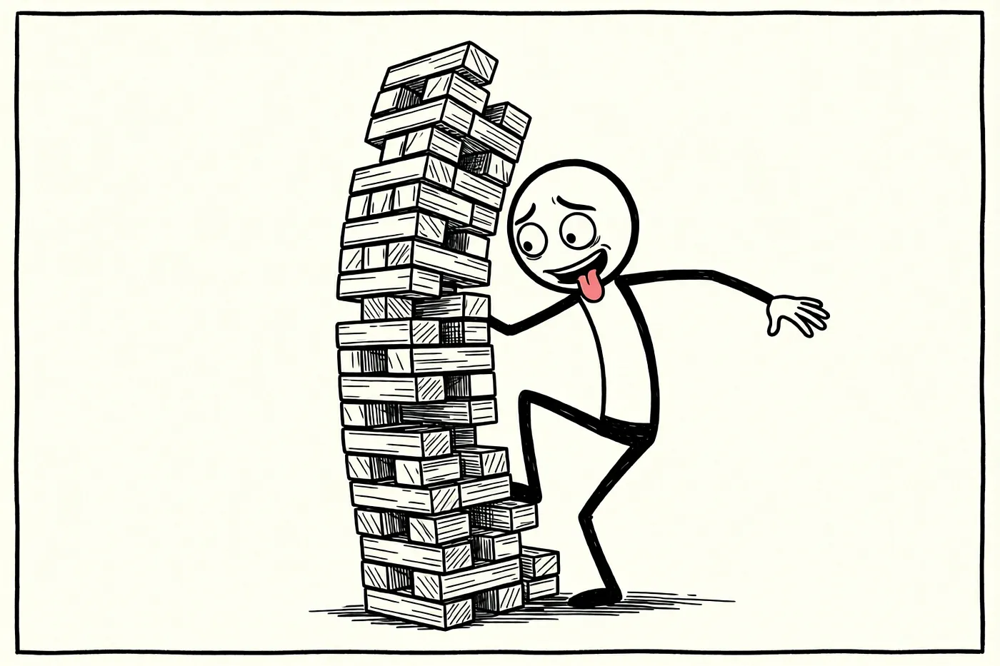
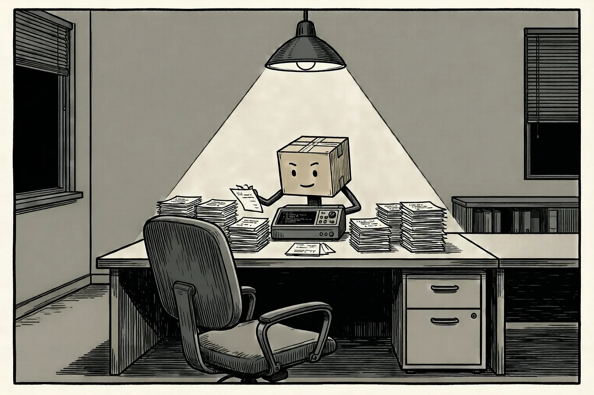

# 我们已经走到 legacy code 的尽头了吗？

## 治疗技术债务的方法已经存在了几十年。我们只是从来没有过一个足够自律到把它应用起来的人。直到现在。

*编程世界里最大的担忧之一就是 technical debt（技术债务），以及它最极端的形式：legacy code（遗留代码）。我们知道，代码在演化的过程中，如果什么都不做，技术债务就会不断堆积，直到达到极端情况——变成 legacy code。但是…… 如果我们已经走到了技术债务的尽头呢？*

## 技术债务

让软件演化并不简单。每一次改动都意味着把新代码与既有代码集成在一起，而那并不总是容易的。**既有代码通常没有预见到未来的改动，即便预见到了，也从来不会正好就是必须做出的那些改动**。所以你必须沿途不断地更新和清理。

但更多时候，那些更新和清理从来都没有发生。日常的压力、对明天会发生什么缺乏远见，开始让添加新代码变得更难。摩擦不断增长，交付时间也是。

这样一直持续，直到出现某个时刻——**触碰既有代码开始让人感到害怕**。不仅更新既有代码很复杂，而且有很高的几率会破坏当前正在运行的东西。技术债务开始变成 legacy code。

**这就形成了一个负向螺旋**。为了避免做出某个可能在不经意间破坏一项功能的代码改动，更多的技术债务被加进来。同时，这又让代码中各个部分之间的连接变得更加脆弱，更容易被破坏。这使得更多的改动变得必要，反过来又加进更多的技术债务。

最终常常以这样典型的请求收场："*我们需要重写代码*"。

## 代码维护

观察这个负向螺旋，有一件事我们看得很清楚：它始于一个单一的事实——缺乏维护，或者说缺乏代码清理。

很多时候这种缺乏清理来自于快速交付的压力（或者说冲动），而且很多清理被认为是没必要的，因为代码已经能跑了。其他时候，代码只是看起来还过得去，并不是因为赶时间，而是因为再做更多的改动似乎没什么意义。在少数情况下，问题更大：代码中几个部分之间形成了某种新的关系，需要重新思考并重组代码，以让未来的改动更容易，或者让今天对各部分之间的关系有更好的理解。

问题是，能不能以某种方式避免它？

业内多年来的建议可以总结为 Boy Scout Rule（童子军规则）：

> "总是让代码比你发现它时更好。"

它很简单，与露营之旅做了类比——露营时你总是被要求让森林比你到达时更干净，清理掉我们发现的、可能是别人留下的东西，我们对代码做同样的事。有了这条规则，你不仅能阻止技术债务增长，而且随着时间推移，你会逐步减少它。

但问题很明显。让一个开发者在每一个特性上都应用这条规则是很难的。**这是一个关于自律和保持警觉的问题，由于它并不自然**，环境本身也帮不上忙，**它最终被搁置一边**。因为如果我们把它当作一次性的事情来看，到了整理的那一刻，遵守这条规则是容易的。但在日常中，当这件事必须在每一次交付时都被应用时，这条规则最终会退居二线并被遗忘。

## Legacy code

当代码开始变得非常糟糕的时候，我们就开始进入下一个阶段——legacy code 阶段。这是开发者开始害怕碰代码的时刻。这时一次改动可能最终在一个意想不到的地方触发某项特性的故障。

不仅如此。在这个阶段，软件也开始变得足够大、足够老，以至于开发者、甚至业务人员，都开始忘记多年来已经实现过的所有特性。即便存在所有已添加特性的记录，也没有谁有能力（或者有时间）把它们全都读一遍，去知道哪些必须继续工作、哪些不需要，去对这个软件本应做什么形成一幅清晰的图景。

为了应对这一切，业内有一个常见的做法：QA testing（QA 测试）。通常会建立一整支质量保证团队，他们手动运行应用程序看它会不会出故障。在很多情况下，他们最终甚至会创建一些自动化测试来验证某些特性。想法很简单：在用户从某个被做出的改动中发现 bug 之前，最好让 QA 用与用户相同的方式使用产品先把它发现。

但是，即便如此，当它是事后才做时，存在一个根本性的问题：

> 什么是一项特性，什么不是？

因为产品一点一点地在增长、在添加特性、在向代码所要求的东西做出让步。**一部分行为之所以在那里，是因为那是想要的**。**另一**部分行为只是**未定义的情况**，被**各行代码之间的相互作用**填补了出来。**还有一些只是开发者的意见**。

而且也并不少见的是会遇到 **QA 把过去曾被请求过的特性当作 bug 提出来**。仅仅因为它们看起来很奇怪，而且很难找到它们曾被记录在什么地方。

## 能减缓它吗？

最近几个月以来我们开始看到像 GitHub Copilot 这样的工具能以相当高的准确度对开发者的 pull request 做自动化审查。这种审查不仅能看到代码的细枝末节并发现其中的错误，还能察觉到代码的真正意图。所以这个工具不仅会指出它认为写得不好或没有遵循足够高质量标准的地方，还能够理解构建这个特性时的上下文，并提出改进建议或可能没有被考虑到的用例。

那么，Boy Scout Rule 的主要问题之一在于，在日常的软件开发中它迟早会被搁到一旁。开发者专注于每一次交付，做一次停顿哪怕是很小的一次，往往都会引入摩擦。所以问题是，我们能不能改变环境来鼓励这种做法？甚至更进一步：

> 我们能不能把这种做法委托给一个不会忘记我们要求它的事情、并且会遵循这条规则的工具？

问题就在这里。

**技术允许这样做，我们不知道的是它做得会有多好。**

想法似乎很简单：如果在一个像 GitHub Copilot 审查这样的流程之上我们再加一个 code cleaner（代码清理器），这个技术债务削减阶段就会是自动的。就像现在每一个 PR 都会出现一整套修改建议，甚至有让 AI 修复的选项，你完全可以把它自动化，让它直接应用这些建议。批准的环节要求审查的不仅是开发者的代码，还有做了清理的那个 AI 的代码。

这一步现在很容易就能接近实现——只需修改审查器的指令，让它按照 clean code 标准被要求去查看所有的技术债务并提出改进。一旦被检测出来，再请 AI 自行修复它就够了。

> 而且夜里也行，因为清理可以留到夜间。这样，清晨第一件事，在做任何事情之前，你就可以审查并并入这些改动。这些改动不会被限制在一个单独的 PR 之内，而是会着眼于多个部分之间结构性的关系，做更深层次的清理。它还会有一个额外的有益效果：开发者会有一个额外的动力去做持续交付——任何没有当天交付的工作，第二天都会有被冲突影响的风险。

## 能逆转它吗？

以上所讲的全都是关于沿途做清理的，但是……一旦代码已经复杂到任何一处改动都会引发不可预测的缺陷时，会发生什么？

在这种情况下，清理可以被视为一个风险点，因为每一次改动都必须经过深度验证。所以你无法相信它运行的方式。

但还有另一条路。

这里你需要利用一些不同的 AI 能力：阅读文档的能力、创建自动化测试的能力，甚至"手动"测试应用程序的能力。

因为在这种场景下**所需要的是给代码做加固**。要拿到一种方法去判断一个改动是否破坏了某个东西。而为此，测试，以及最重要的是知道要测什么，是极其重要的。因为对于已经成长起来、并且已经失控的软件，甚至连什么是特性、什么不是都很难知道。

所以这里的路是漫长的，在某种程度上很复杂。但可能是可行的。

AI 应该从读代码开始，读整个 commit 历史、开发工单的历史、缺陷的历史。然后开始形成假设。它的工作是找出软件的预期行为。对每一个，检查它是否真的指向某种预期行为、还是某个缺陷的解决方案，并检查它没有在之后的某个时刻被更改过。一旦得到确认，就创建软件测试以验证它表现出这种行为，并验证这个测试真的在检查这种行为（通常是通过找到一种方式、甚至改动代码、强制让它因为这个原因而失败）。然后一点一点地继续创建给代码加固所需要的全部测试。

而一旦我们拥有了所有的测试，那么我们就可以开始修改代码。这样如果在任何一刻有一个测试失败了，它会告诉我们哪一项行为被破坏了，我们就能验证它是不是预期的，我们就能决定要不要继续下去，或者去寻找一种替代方案。所有这一切都在到达 QA 之前发生，最重要的是，在到达终端用户之前。

> 有必要强调，让它去寻找并测试软件的行为而不是测试代码（QA 定义下的 unit tests）是非常重要的，因为测试代码恰恰是制造出无法适应的刚性代码的根源。通过测试代码，对代码做任何改动都会让测试失败，它将不会帮助我们持续改进内部设计。

## 极限在哪里

如果我们仔细看，**所有针对 legacy code 的防御方式都共享同一个盲点**。

Boy Scout Rule 依赖于有人记得在每一次交付时去做清理。QA 依赖于有人记得什么是特性、什么只是一些行代码的偶然产物。从头重写则依赖于有人记得代码为什么做它所做的事。总有那么一个夹在中间的、必须不能忘记的人。

而那就是问题所在。不是缺乏工具，不是缺乏知识。这种治疗法早就已经被知道了几十年。所缺的是一个能够一次交付接一次交付地把它应用起来的人，不会累、不会被日常压力冲走、永远不会忘记被要求过什么或为什么被要求过。而那并不是人能做得好的事情。从来都不是。

那么这个极限不是技术上的。是我们自己——在试图保持某个增长速度比我们能记住的还快的东西的干净。而第一次，"不忘记"可以不再依赖我们了。

也许我们还没有走到 legacy code 的尽头。但我们已经走到了让我们总是落入其中的那个原因的尽头。
