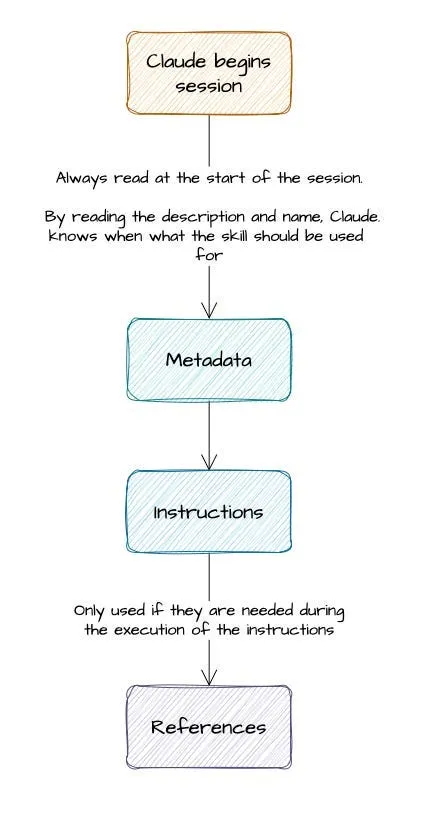
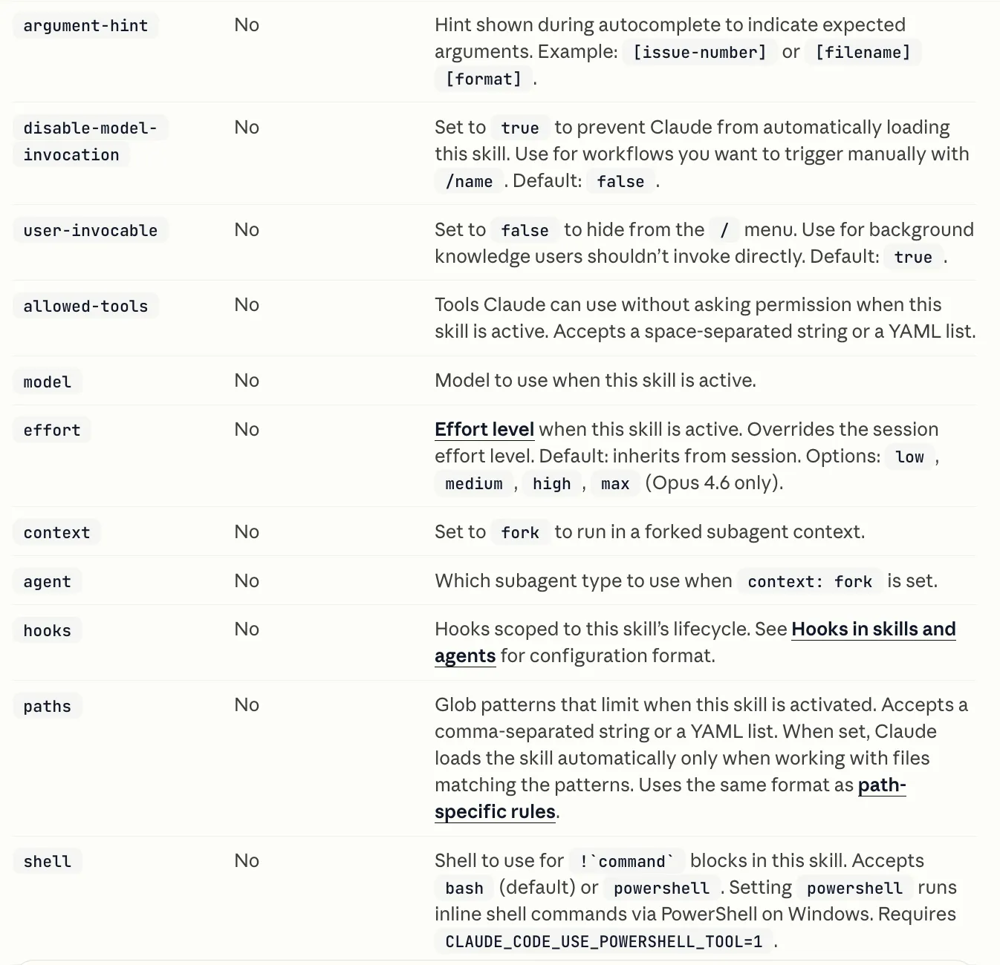
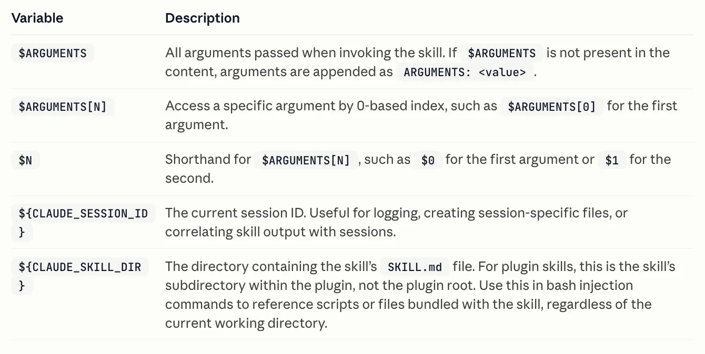
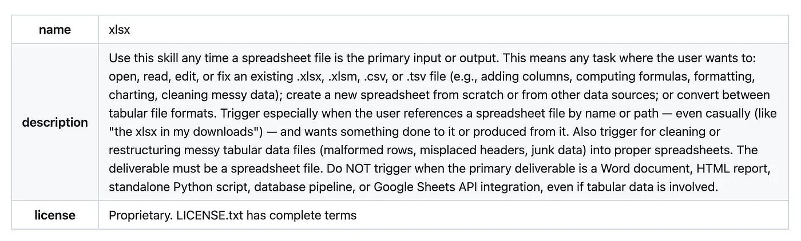
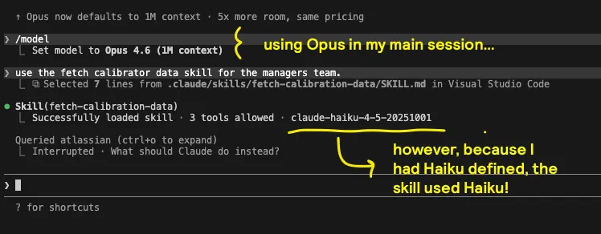
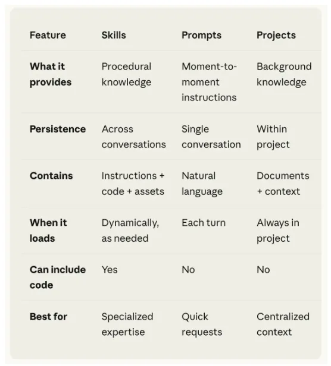

# 官方文档没告诉你的 Claude Code skills 真相

## 一份实战指南：拆解 Claude Code skills 的结构、隐藏开关，以及让 skills 真正可靠的设计原则。

这个月，我为自己 newsletter 写作 pipeline 的每一个环节都构建了一个 skill。

整个过程很顺利，因为身边人都告诉我：*"嘿，简单得很，一个 skill 不就是一个写好的 markdown 文件嘛"*。

然而，Anthropic 的官方文档告诉了你怎么创建一个 skill。它们也提到了一些好的实践，但这些零碎散落在官方 spec 与生产级例子里。更重要的是，只有经过相当长时间的直接观察，你才会开始判断一个 skill 到底是不是在干它该干的事。

所以，我想分享给你的是：**skills 是一种设计模式，而不仅仅是一个 feature。** 大多数从业者把它们当成一份带指令的 markdown 文件。这只对了一半（用来跑 PoC 很棒），但要做到生产级系统的可靠性，你完全可以把它们打磨得更强。

这篇文章假设你已经接触过 Claude Code skills，想再深入一层。我不会带你从零创建第一个 skill。我会聚焦于文档里讲得不够透彻的部分，以及我自己发现的、真正让 skills 变得可靠的那些做法。

## 这篇博客会讲什么

-   **1 分钟看懂 Claude skills。** 快速过一遍它们是什么、解决什么问题。
-   **大多数从业者缺失的心智模型。** 为什么一个 skill 不只是一份指令，以及底层到底发生了什么。
-   **一个 skill 的完整结构。** SKILL.md、frontmatter，以及让整个系统得以运转的那些目录。
-   **可靠 skills 背后的隐藏开关。** 那些决定一个 skill 是稳定运行还是悄无声息地失败的小型设计决策。
-   **解锁真正威力的进阶技巧。** 让脚本和推理混合、为可组合性而设计、以及控制模型行为。
-   **skills 在更大的系统中处于什么位置。** 它们相对于 MCP、subagents 和 agentic workflows 的位置。
-   **什么时候不该用 skills。** 那些让你的系统保持简单和可维护的边界。
-   **实用的设计原则。** 如何像对待软件一样去结构化、测试和迭代 skills。

我们开始吧！

## 1 分钟看懂 Claude skills：skills 是什么？

一个 Claude skill 是一份可复用的指令、资源、以及可选代码的封装包，它教会 Claude 如何**可靠地执行一项特定任务** *(嗯，"可靠"实际上取决于你怎么定义这个 skill，这正是本文要讲的)*。

不同于只存在于单次对话中的 prompt，skill 会跨会话持久存在，并且可以在相关时被自动选中。它不只是 Claude 读取的东西，它是 Claude 可以*主动决定去使用*的东西。

乍一看，skill 似乎很简单：一份 markdown 文件加一些指令。对于小型用例来说，这通常也够用了。简单吧？

## 大多数人忽略的心智模型

当然，如果你只是浮于表面，那 skills 就是简单的。如上所述，大多数从业者在心智上把一个 skill 建模为：一个 markdown 文件，顶部写指令，可能再附几个例子。Claude 读完照做，完事。大概像这样：

\---  
name: summarise-meeting-notes  
description: Summarises raw meeting notes into a short structured recap. Use when the user provides messy notes and wants clear next steps.  
\---  
  
  
\- Read the notes carefully.  
\- Extract the main decisions, open questions, and action items.  
\- Return the output under these headings:  
  \- Summary  
  \- Decisions  
  \- Action items

这就是大多数人脑子里携带的版本：*一个 skill 基本上就是一个挂了名字的 markdown prompt*。这当然能工作。用在 PoC 上也很棒。

但只要你想让 skills 在规模化的场景下保持可靠，这套心智模型就会迅速崩塌。这就是为什么 skills 更应该被理解为一种设计模式，而不只是一个 feature。然而，[Claude API 文档中的 Agent Skills Overview](https://platform.claude.com/docs/en/agents-and-tools/agent-skills/overview) 描述了一个更精确的图景：一个 3 层架构，skill 的不同部分在不同时机加载，付出不同代价。

-   **Metadata（也就是 *Frontmatter fields*）** —— 启动时永远加载。Claude 会先读取它，对每个可用的 skill 都读一遍，以决定哪个可能相关。这就是为什么 description 对 skills 来说***如此***重要（后面会细讲）。
-   **Instructions** —— 这是 `SKILL.md` 的主体部分。它会在 skill 被真正选中时加载。这是 workflow、步骤、示例和输出预期所在之处。
-   **Resources** —— 这些是配套文件，例如文档、模板、schemas 或 scripts，放在 `references/`、`assets/` 或 `scripts/` 这样的目录里。它们只在执行过程中*需要时*才加载。

如果你能吃透这些资产，它们能让 skills 在你的生产系统中实现质量上的巨大飞跃。这也是为什么 skills 更应该被理解为一种**设计模式**，而不只是一个 feature。既然心智模型已经清晰了，我们就可以来看一个 skill 的实际结构，看看这几层在实践中各自落地在哪里。

## 一个 skill 的完整结构

既然加载模型已经讲清楚，我们就可以来看一个 skill 的物理结构：它包含哪些文件、每个部分各自负责什么、以及这套结构如何支撑我们刚刚提到的分层设计。我们会覆盖以下要素：

1.  skills 目录与 SKILL.md
2.  你可以在一个 skill 中使用的 3 个可选目录
3.  深入 Frontmatter fields 中可用的字段

### skills 目录与 SKILL.md

在最简单的层面上，一个 skill 就是一个目录，里面有一个必需的 `SKILL.md` 文件。

在 Claude Code 中，skills 通常位于 `.claude/skills/` 目录下。每个 skill 拥有自己的文件夹，文件夹名就成了这个 skill 在磁盘上的身份。在该文件夹中，`SKILL.md` 是唯一必须存在的文件。

一个最小化的 skill 可能长这样：

.claude/  
└── skills/  
    └── summarise-meeting-notes/  
        └── SKILL.md. # 警告 -> 文件名必须严格写成 SKILL.m

仅此而已就足以创建一个能工作的 skill 了。但在实践中，健壮的 skills 通常会围绕这个核心生长出更多结构。

### 你可以在一个 skill 中使用的 3 个可选目录

[SKILL.md](http://skill.md/) 旁边可以放 3 个可选目录：

-   `scripts/` —— 可执行代码。Shell 脚本、Python 文件，任何 skill 可以直接调用的东西。这是确定性执行所在之处。
-   `references/` —— 选择性加载的重量级上下文。设计规格、查找表、大型参考文档。它们按需加载，而不是激活时加载。
-   `assets/` —— 配套文件：模板、schemas、示例输出。

这意味着一个更完整的 skill 可能长这样：

.claude/  
└── skills/  
    └── newsletter-draft-review/  
        ├── SKILL.md  
        ├── scripts/  
        │   └── validate\_structure.py  
        ├── references/  
        │   └── style\_guide.md  
        └── assets/  
            └── output\_template.md

`SKILL.md` 文件存放 metadata 和主要指令。但这些可选目录让你可以把笨重或专门化的材料移出主文件、按需加载，从而保持 skill 的精简。这一点很重要，因为放在 `references/` 里的内容不必每次 skill 激活时都加载，而塞进 `SKILL.md` 正文里的内容则必须每次都加载。

值得多花点笔墨说说 `references/` 这个目录。三层架构的红利正是在这里于实践中兑现。放在那里的重量级内容只在 skill 执行期间需要时才加载。同样的内容如果放在 [SKILL.md](http://skill.md/) 正文里，则每次激活都要加载。这种区别带来真实的 token 成本，并且会在一个由许多 skills 组成的系统里复利累积。

来自 [Anthropic 最佳实践文档](https://platform.claude.com/docs/en/agents-and-tools/agent-skills/best-practices) 的实用指导：把 [SKILL.md](http://skill.md/) 控制在 500 行以内。把这当作一个结构性目标。当 skill 正文超过它时，问题不是"我怎么把文字压得更紧"——而是"什么内容应该归到 `references/` 里去？"

### 深入 Frontmatter fields 中可用的字段

`SKILL.md` 文件本身的顶部是 frontmatter：一小段描述 skill 的 YAML 块。这些 Frontmatter fields 不过就是用来描述这个 skill 的 specs。

不过，你不能在 spec 里塞任何东西，这部分需要一个实际的格式或 schema。截至本文写作时，[你可以使用的字段大致是这些](https://code.claude.com/docs/en/skills#frontmatter-reference)。其中最重要的两个是 name 和 description。

1.  *(必需)* `name`。小写、用短横线连接、简短。
2.  *(必需)* `description`。解释这个 skill 做什么、何时该被使用。
3.  *(可选)* `license`。许可证名称或指向已捆绑许可证文件的引用。
4.  *(可选)* `compatibility`。环境要求，例如产品目标、系统包或网络假设。
5.  *(可选)* `metadata`。额外的键值信息，例如 owner、version 或内部 tags。

你可以用一大堆控制 skill 的参数来扩展这些可选描述字段。

*截图来自 Anthropic 官方文档。*

下面是一个可能的示例。

\---  
name: newsletter-draft-review  
description: Reviews a newsletter draft for structure, clarity, and section flow. Use when the primary input is a draft article and the goal is editorial improvement rather than full rewriting.  
license: Apache-2.0  
compatibility: "Claude Code; requires Python 3.11+ for local validation script"  
metadata:  
  author: jose-parreno-garcia  
  version: "1.2"  
  team: senior-data-science-lead  
allowed-tools: Read Write Bash(python:\*)  
\---

### skill 中参数的威力

作为 Data Scientists 或 Software Engineers，我们都非常习惯在函数之间传递变量。skills 也有类似的概念，[其中允许字符串替换或注入](https://code.claude.com/docs/en/skills#available-string-substitutions)，从而让 skill 能够接收动态值。

下面是一个例子：

\---  
name: session-logger  
description: Log activity for this session  
\---  
  
Log the following to logs/${CLAUDE\_SESSION\_ID}.log:  
$ARGUMENTS

这个 `session-logger` 可以帮你弄清楚自己有哪些 arguments 在不知不觉间被传来传去。有了它，你就可以开始配合可选 frontmatter 字段里提到的 `argument-hint` 参数一起工作了。

## Anthropic 自己是怎么用 skills 的一个例子。

如你所见，skills 可以比 1 个带 markdown 指令的简单脚本强大得多。事实上，Anthropic 自己用的就是这些同样的特性。

在 [他们的 skills 仓库](https://github.com/anthropics/skills/tree/main/skills) 里，Anthropic 放了海量我们都可以学习的例子。这里挑 2 个给你看：

1.  [xlsx skill](https://github.com/anthropics/skills/blob/main/skills/xlsx/SKILL.md)。292 行，值得通读。description 字段又长又细——明确的触发条件（"DO trigger when…"）和明确的排除条件（"Do NOT trigger when…"）。正文设定了严格的输出标准：零公式错误，全程遵循专业的格式约定。
2.  [frontend-design skill](https://github.com/anthropics/skills/tree/main/skills/skill-creator)。把一个 skill 能用的东西全用上了。它有 `scripts/` 和 `references/` 目录。此外还有 agents/ 以及许许多多其它目录。一个真真正正完整的 skill。

这些不是冗长。这是精密工程。所以，没错，向它们学习。

## 区分可靠 skills 和脆弱 skills 的那些隐藏开关。

一旦你理解了 skill 的结构，下一个问题就更有意思了：**哪些部分实际上决定了 skill 在实践中是否表现可靠？**

### description 字段决定了 skill 是否被选中

第一个、也是最被低估的，是 description 字段。

值得反复说：Claude **不会**一上来就把每一个 `SKILL.md` 通读一遍。它从 metadata 层开始，尤其是 name 和 description，并据此决定哪些 skills 可能相关。只有当某个 skill 被选中后，主体内容才会被加载。当 Claude 手头有 100+ 个 skills 可选时，这在上下文膨胀方面可能成为决定性因素。

所以，让我再说一遍：

> **description 不是文档，它是选择接口。**

[最佳实践指南](https://platform.claude.com/docs/en/agents-and-tools/agent-skills/best-practices) 对此非常直白：用第三人称写 description，同时写清这个 skill 做什么和何时使用它，并包含具体的触发关键词。随着可用 skills 数量增长，description 质量会成为一个排序信号。

这在实践中意味着什么：**一个 skill 文件里最重要的内容，往往是从业者花时间最少的那部分。**

xlsx skill 的 description 精确解释了哪些电子表格操作应该触发这个 skill、哪些不应该、以及这个 skill 对输出质量保证什么。

*Anthropic skill description 的截图。*

### 在选择层就编码失败模式

只处理 happy path 的 skill 是一个等着出事的 skill。

在 description 中显式列出排除条件（*"Do NOT trigger when…"*）可以防止 skill 在会产出糟糕结果的上下文中被调用。失败模式被编码在了选择层，在任何指令运行之前。这与在正文里处理失败模式有本质区别——等到正文运行时，错误的 skill 已经被选中了。

如果你再去读一遍 Anthropic 那张 skill description 的截图，它清清楚楚地写着：*"Do NOT trigger when the primary deliverable is a Word document …*"。这一句的作用就是从一开始就阻止错误的 skill 被选中。结论：Anthropic 都这么用，你也该这么用。

### 为下游使用而结构化输出

一个以自由文本结尾的 skill，对人类读者来说也许依然有用。但相比一个返回结构化、可预测产物的 skill，它要难得多被组合进更大的 workflow。

如果另一个 skill、脚本或 review 步骤需要消费这个输出，那么输出形状就成了接口的一部分。这意味着 skill 不应只是"答得好"。它应该以另一步骤能可靠使用的方式作答。

这种结构不必每次都是僵硬的 JSON。它可以是：

-   YAML，
-   JSON，
-   或者就是固定的 markdown 标题加可预测的小节。

重要的是这个结构是有意为之且稳定的。[Claude Skills Cookbook](https://github.com/anthropics/claude-cookbooks/blob/main/skills/README.md) 在多步骤 workflow 中清晰展示了这个模式——一个阶段产出的内容是为了干净地喂给下一阶段而设计的。

可组合性正是从这里开始的。

## 进阶技巧：scripts、可组合性、和模型路由。

一旦基础到位，下一步就是让 skill 设计**更刻意**。

Anthropic 的文档和开放的 Agent Skills 资料都把 skills 视为指令文件之外的更多东西：它们是由指令、脚本和资源组成的、为协同工作而设计的文件夹。下面这些是我在做 skill 设计时会努力确保覆盖到的。

### 混合推理与确定性的 scripts。

一个 skill 能做的最有用的事情之一，是把工作在 **Claude 的判断** 和 **纯可执行代码** 之间分开。

这就是 `scripts/` 目录的用途。无论是在 Claude Code 还是在更广义的 Agent Skills 模型里，skills 都可以在指令和参考文件旁附带可执行脚本。这意味着 skill 不必为每件事都依赖生成的文本。它可以让 Claude 来推理需要做什么，然后把一个精确的子任务交给 Python、Bash 或其他脚本，当这件事用确定性方式处理更合适时。

这种分工的重要性比听起来要大得多。Claude 适合做解释、优先级判断、分类和决策。Scripts 更适合可重复的机械工作：校验 schema、检查小节结构、规范化文件、抽取字段、或强制某个格式规则。换句话说，**让 Claude 决定，让代码验证**。这通常是比让模型同时即兴完成两边更强的设计。

### 关注点分离（或称模块化）

第二个进阶技巧是可组合性。

孤立看时，一个狭窄的 skill 通常看起来比一个大的 skill 弱。但在实践中，狭窄的 skills 通常更容易被选中、更易维护、也更易组合。Anthropic 的指南反复指向同一个方向：skills 应当简洁、聚焦、并且结构化到让 Claude 能成功发现和使用。Claude Code 也把 skills 放在与 hooks、agents、MCP servers 等其它模块化组件并列的位置，而不是把它们当作巨型的自包含应用。

**设计原则是可组合性优于巨石**：一个由聚焦的 skills 干净链式组合的系统，胜过一个想包揽一切的 skill。

### 模型选择（但需谨慎措辞）

在今天的 Claude Code 里，SKILLs 中似乎存在一种行为：我们可以强制 skill 使用某个特定模型（哪怕你的 session 里用的是另一个模型）。

*⚠️ 重要的提醒是，我不会把按 skill 选择模型当作稳定的、文档化的、跨平台 skill 规范的一部分来呈现。*

下面是你会怎么使用它的一个例子：

\---  
name: newsletter-draft-review  
description: Reviews a newsletter draft for structure, clarity, and section flow. Use when the primary input is a draft article and the goal is editorial improvement rather than full rewriting.  
license: Apache-2.0  
compatibility: "Claude Code; requires Python 3.11+ for local validation script"  
metadata:  
  author: jose-parreno-garcia  
  version: "1.2"  
  team: senior-data-science-lead  
allowed-tools: Read Write Bash(python:\*)  
model: Sonnet  
\---

下面是我自己的某个 skill 里这种行为如何被触发的例子。在下面的截图里，我把 `Opus` 设为主 session 模型，但名为 `fetch-calibration-data` 的 skill 使用了 `Haiku`。

到目前为止，我们已经看了一些非常棒的 skills 技巧。然而，一旦 skills 开始与更大的 Claude 系统交互——尤其是用于外部访问的 MCP、以及用于委派执行的 subagents——它们会变得强大得多。我们在下一节简短地讲讲这点。

## skills 如何与 MCP、subagents 和 agentic pipelines 配合。

一个 skill 是一个**工作流层**。它教 Claude 做什么、按什么顺序做、达到什么标准。但一个真实系统通常还需要更多。它可能还需要访问外部数据，或者为专门工作配置一个独立的执行上下文。这就是 MCP 和 subagents 登场之处。

思考这三者最干净的方式是：

-   **MCP 提供访问**
-   **skills 提供工作流逻辑**
-   **subagents 提供执行上下文**

Anthropic 的 [skills explained 博客](https://claude.com/blog/skills-explained) 包含了一个跨五个原语的对比表：Skills、Prompts、Projects、Subagents 和 MCP。表里覆盖了持久性、各自包含什么、何时加载、以及最适合的场景。实践中最重要的两个整合是 skills + MCP 和 skills + subagents。

*截图来自 Anthropic 的博客文章。*

### Skills + MCP

[2025 年 12 月那篇关于扩展 Claude 能力的文章](https://claude.com/blog/extending-claude-capabilities-with-skills-mcp-servers) 用了一个我觉得很精确的类比：MCP servers 是货架上的库存，skills 是员工的专业能力。MCP 给 Claude 访问数据和工具的能力。Skills 给 Claude 使用它们的既定流程。

任何一个单独都不足以支撑真正的 agentic workflow。一个没有 MCP 的 skill 只能凭已经在上下文中的东西工作。没有 skill 的 MCP 给 Claude 数据访问能力却没有结构化的处理流程。两者结合，就把环闭合了：拿到正确的数据，应用正确的流程。

举个例子，一个 MCP server 可能暴露一个 Notion workspace 并说明如何正确搜索它。一个 skill 则会定义实际的 workflow：先查 project page，然后查之前的 meeting notes，再查 stakeholder context，最后以固定结构返回 summary。

### Skills + subagents

与 subagents 的关系则不同。

-   Skills 定义做什么以及按什么顺序做。
-   Subagents 提供执行容量和领域聚焦。

这个区别很重要，因为这两个原语有时会被混为一谈。Skills 定义*怎么做*，agents 定义*谁来做这件事*（并真的去做）。

### skills 在 agentic pipelines 中的角色

一旦你把这些层组合起来，skills 就不再是孤立的工具，而开始看起来像更大 pipeline 里的构件。

-   某一步也许用一个 skill 来定义 workflow。
-   另一步也许用 MCP 来拉取实时数据。
-   另一步也许跑在一个 subagent 里，让工作发生在隔离的上下文中。
-   而最终输出可能喂给另一个 skill 或者一个人类 review 阶段。

这就是更大架构让人感觉是 agentic 的原因。

这也是为什么试图把一切硬塞进一个 skill 通常会出错。一旦一个 workflow 同时需要外部访问和受控执行，更好的设计通常不是"让这个 skill 更聪明"。而是 **"给这个 skill 配上对的邻居"**。

## 什么时候 skills 是错误的工具。

我们到目前为止讲的一切，应该已经让我们看清了 skills 在哪些地方更有用（以及反过来，在哪些地方不该用）。不过，下面这 4 条是我自己心里始终记着的，免得我像个疯子一样到处堆 skills。

-   **一次性任务。** 如果你只打算做一件事一次，一个 prompt 通常就够了。Skills 带有创作成本。你需要给它命名、写描述、把它结构化、测试它、维护它。这种投入只有在 workflow 足够频繁地重复时，才能让复用和迭代变得值得。这是个很容易掉进去的坑，尤其是当用 Claude 构建感觉很快时。一项任务跑通了一次，就忍不住马上把它"封圣"为一个 skill。
-   **静态上下文交付。** 如果这个"skill"只是一段没有 workflow 逻辑的参考文本，它属于 [CLAUDE.md](http://claude.md/) 规则文件或其他规则层。Skills 的本意是编码**如何做一项任务**。静态上下文是关于 Claude 在做许多任务时应该知道什么。
-   **不通过 MCP 直接访问外部数据。** 直接伸手去够外部 API 或数据库的 skills 是脆弱的——难以测试、难以维护，并且模糊了一个本来就该存在的边界。数据访问是 MCP 的活。拿数据做什么是 skill 的活。把它们混在一起会产出在数据源变化时极难调试的 skills。
-   **"一统天下的 skill"反模式。** 一个在一个文件里同时处理研究、撰稿、SEO 优化和宣发的巨石 skill，不是"全面"，它是不可测、不可发现、不可维护。当一个 skill 试图处理多个不相关的 workflow 时，它选择得不一致，并且在那些它没被设计过的场景里悄无声息地失败。

## 实用的设计原则，包括如何像测试代码一样测试 skills。

[最佳实践指南](https://platform.claude.com/docs/en/agents-and-tools/agent-skills/best-practices) 和 [来自 agentskills.io 的评估指南](https://agentskills.io/skill-creation/evaluating-skills) 共同提供了目前最清晰的可操作指导。下面是我一直在贯彻的原则。

-   **狭窄且可被发现。** 一个可靠地做一件事的 skill，比一个不一致地处理许多事的 skill 更有用。窄范围让 skills 更易被选中、更易测试、并且在失败时更易推理。
-   **为选择而写的 description。** 用第三人称写。同时写清这个 skill 做什么以及何时使用它。使用反映用户自然会怎么描述任务的具体关键词。把那 1,024 字符的上限当作设计空间——不是一个要舒舒服服远离的天花板，而是一个要用心部署的预算。description 是 Claude 在决定是否激活之前会读到的 skill 唯一部分。
-   **把指令与重量级上下文分开。** [SKILL.md](http://skill.md/) 承载指令。`references/` 承载上下文。任何属于参考材料而非 workflow 逻辑的东西——style guides、规格文档、查找表——都属于 `references/`。保持 [SKILL.md](http://skill.md/) 精简，可以保住三层加载模型的效率。
-   **像测试代码一样测试。** [agentskills.io 的评估框架](https://agentskills.io/skill-creation/evaluating-skills) 把 skills 当作软件工件来对待：设计测试用例（prompt + 期望输出 + 任何输入文件）、运行带 skill 和不带 skill 的对比、对输出写断言、打分并迭代。这本身就是一个复杂话题，足以撑起未来几篇文章。目前来说，知道它也很重要、值得纳入考虑就够了。

## 结语

写 prompt 是一种对话行为。构建 skill 是一种***设计***行为。

你必须：

-   定义 scope
-   编码失败模式
-   把指令与上下文分开
-   为下游使用而结构化输出
-   并测试结果。

我把这些视为应用在新介质上的软件工程设计技能。

[最初的 Agent Skills 公告](https://claude.com/blog/skills) 把 skills 框定为"可组合、可移植、高效"。[agentskills.io](http://agentskills.io/) 上的开放标准则昭示了这件事的去向：按 spec 设计的 skills 在 Claude 客户端之间流通，并且随着标准成熟，跨越其他 agent 实现。一个你今天在 Claude Code 里精心构建的 skill，明天就可能跑在另一个 agent 上下文中。

## 现在，我想听你的

如果你一直在构建 Claude Code skills：

-   你做过的最非显然的设计决策是什么——它经受住考验了吗？
-   你掉进过"一统天下的 skill"陷阱吗？你是怎么爬出来的？
-   你是在系统化地测试 skills，还是仍然在生产中发现问题？

我特别好奇人们在实践中是怎么把 skills 和 MCP 结合起来的。这种整合模式让人感觉它们仍然在野外被摸索成型——我想对一对答案。

## References

\[1\] [Introducing Agent Skills](https://claude.com/blog/skills) —— Anthropic 关于 Agent Skills 的最初 2025 年 10 月发布公告；涵盖 composable/portable/efficient 的定位以及 2025 年 12 月关于 [agentskills.io](http://agentskills.io/) 作为开放标准的说明。

\[2\] [Agent Skills Overview — Claude API Docs](https://platform.claude.com/docs/en/agents-and-tools/agent-skills/overview) —— 关于三层加载架构（metadata、instructions、resources）以及 token 估算最技术精确的公开来源；也覆盖虚拟机执行模型。

\[3\] [Agent Skills Specification — agentskills.io](https://agentskills.io/specification) —— [SKILL.md](http://skill.md/) 格式的官方开放标准 spec；涵盖所有 frontmatter 字段，包括实验性的 `allowed-tools` 字段以及 `scripts/`、`references/`、`assets/` 目录结构。

\[4\] [xlsx SKILL.md — anthropics/skills](https://github.com/anthropics/skills/blob/main/skills/xlsx/SKILL.md) —— 一个 292 行的生产级 Anthropic skill，展示了真实 description 字段设计中显式触发与显式排除的写法。

\[5\] [Skill Authoring Best Practices — Claude API Docs](https://platform.claude.com/docs/en/agents-and-tools/agent-skills/best-practices) —— 涵盖 description 写作惯例、命名规范、以及 500 行 [SKILL.md](http://skill.md/) 指导；包含 description 在 100+ skills 中作为选择排序信号的洞察。

\[6\] [Claude Skills Cookbook README — anthropics/claude-cookbooks](https://github.com/anthropics/claude-cookbooks/blob/main/skills/README.md) —— 实用的构建者指南，附带金融 workflow 示例，展示渐进式披露与结构化输出模式。

\[7\] [Using Scripts in Skills — agentskills.io](https://agentskills.io/skill-creation/using-scripts) —— skills 内部脚本化的权威指南；涵盖确定性与生成性之分，以及 agentic 上下文中脚本的设计原则。

\[8\] [Skills explained: How Skills compares to prompts, Projects, MCP, and subagents](https://claude.com/blog/skills-explained) —— 跨五个 Claude 原语的对比表；关于 skills 何时不是正确工具最清晰的来源。

\[9\] [Extending Claude's capabilities with skills and MCP servers](https://claude.com/blog/extending-claude-capabilities-with-skills-mcp-servers) —— skills + MCP 整合的权威来源；用了五金店的类比和真实 workflow 示例。发表于 2025 年 12 月。

\[10\] [Evaluating Skill Output Quality — agentskills.io](https://agentskills.io/skill-creation/evaluating-skills) —— 覆盖将 skills 作为软件工件的 eval 循环：测试用例设计、带 skill 与不带 skill 的对比、断言以及迭代工作空间结构。

## 延伸阅读

感谢你读完这篇文章！如果你想看我更多写的内容，这里有一篇按主题组织了我所有其它博客文章的合集：Data Science 团队与项目管理、数据故事、营销与 bidding science、以及机器学习与建模。

## 保持关注！

如果你想在我发布新文章时收到通知，欢迎在 Medium 上关注我。另外，[也非常欢迎在 Linkedin 上聊聊](https://medium.com/data-science-collective/www.linkedin.com/in/joseparrenogarcia)！
