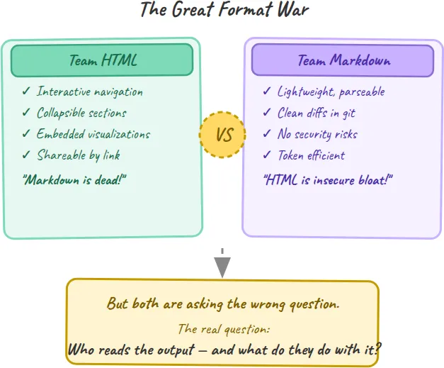
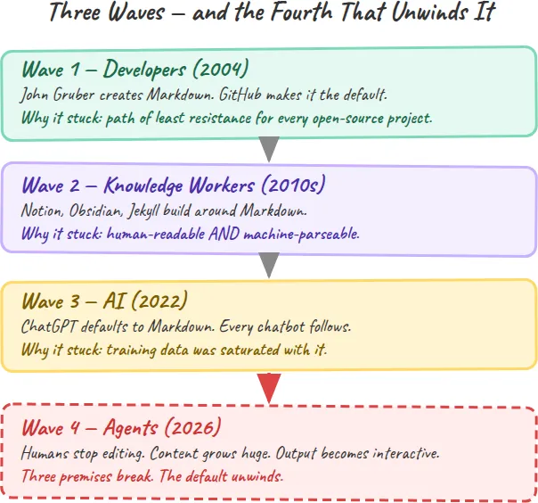
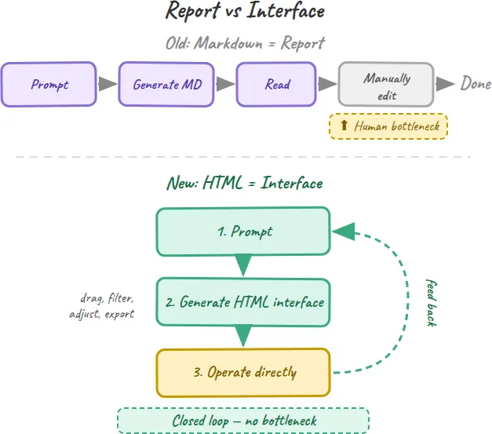
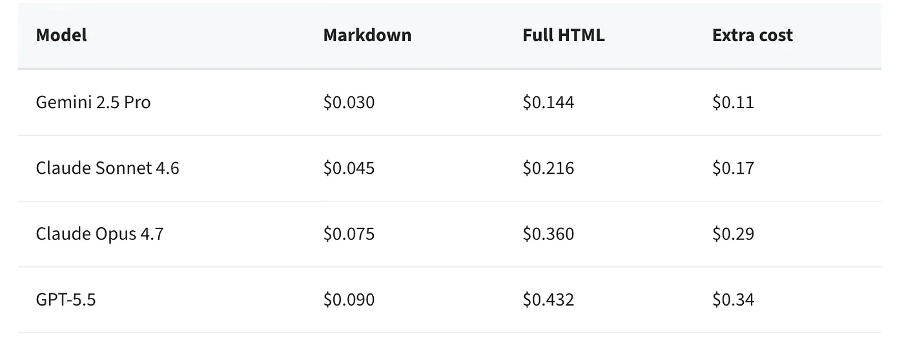
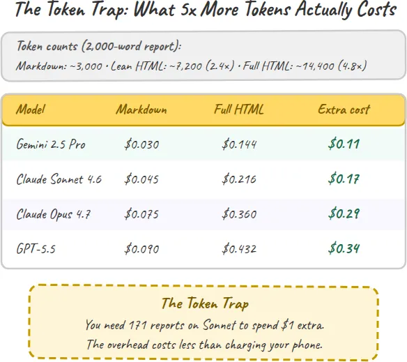
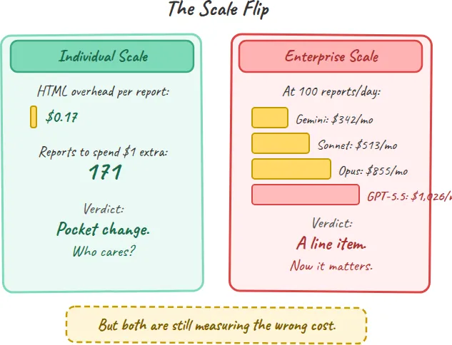
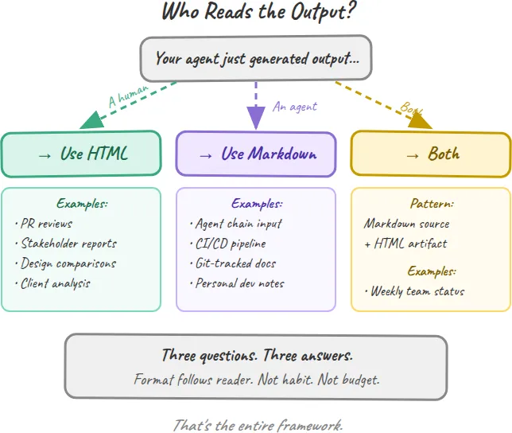
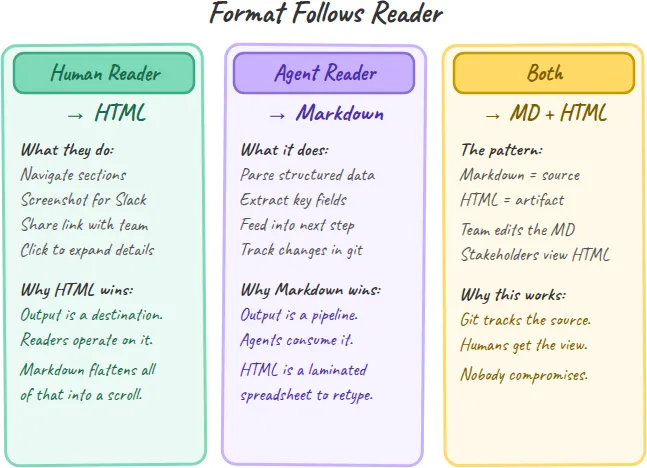
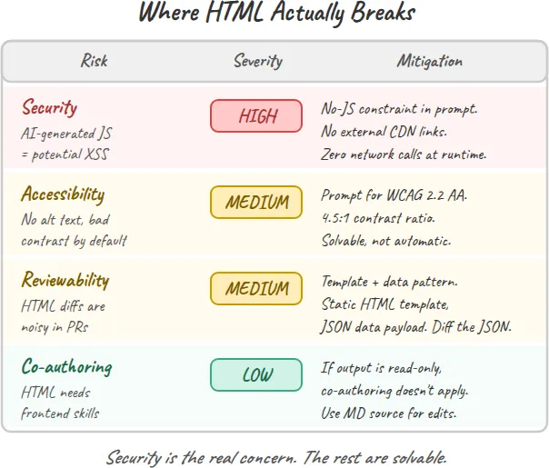
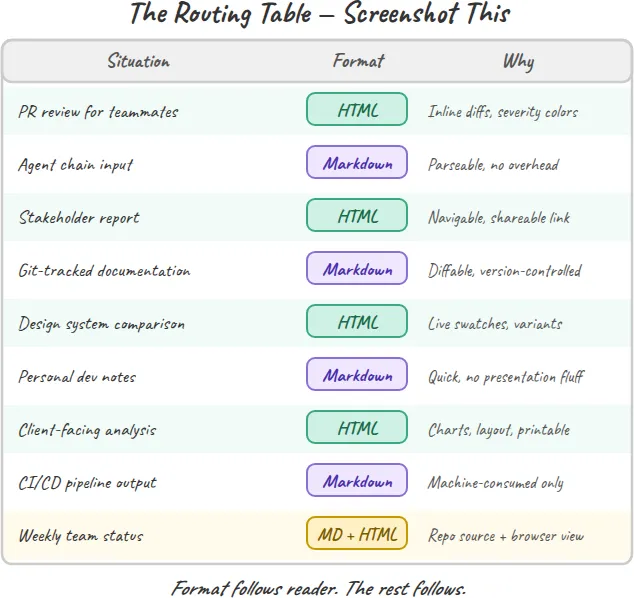

# Anthropic 的工程师说 "干掉 Markdown"，他真正想表达的是什么。

## HTML vs Markdown：这才是双方都需要的那棵决策树。

*图片来源：Olia Gozha on Unsplash*

[免费阅读这篇文章](https://generativeai.pub/anthropics-engineer-said-kill-markdown-here-s-what-he-actually-meant-36bee00c0ca2?sk=9f51cf824236ec961e759f6c4de62345)

上周，Claude Code 的工程负责人告诉开发者们：别再输出 Markdown 了。整个互联网炸了。

Thariq Shihipar，Anthropic Claude Code 的工程主管，发布了[《The Unreasonable Effectiveness of HTML》](https://thariqs.github.io/html-effectiveness/)，附带 20 个可运行的示例。他的论点是：Markdown 是 token 稀缺时代的遗物。HTML 能带来交互式导航、可折叠区块、嵌入式可视化以及可分享的链接。

这篇文章在 16 小时内拿下了 440 万次阅读。

反应来得迅速且部落化。一夜之间形成了两个阵营。

HTML 派说，Markdown 已死。他们指向 Thariq 的那些示例：带有颜色编码严重级别的 code review、带可折叠区块的相关方汇报、带可实时预览色卡的设计系统。"一份你只会滚动划过的 Markdown 文件，就是一份不存在的文件。"

Markdown 派则反击。AI 生成的 JavaScript 带来的安全风险。会破坏 code review 的嘈杂 diff。把 API 预算榨干的 token 开销。"HTML 是在牺牲源码可读性、安全性与可审阅性的代价下，去追求视觉上的光鲜。"

*伟大的格式之战：两个阵营，一个缺失的问题 —— 作者绘图*

双方都错了。不是事事都错。是在最重要的事情上错了。

**HTML 派方向是对的，但忽略了代价。**他们对 3–5 倍的 token 开销一笔带过，跳过了 AI 生成 JavaScript 的安全隐患，也只字未提 Anthropic 从这次格式切换中直接获利（更多 token = 更多收入）。

**Markdown 派看对了风险，但解决的是一个已经过期的问题。**他们仍在为那种 token 预算做优化——那种预算在 GPT-4 还只有 8,000 token 上下文窗口的年代是有意义的。如今上下文窗口已经是 100 万 token 了。约束消失了。习惯却没变。

**真正的问题从来不是 HTML vs Markdown。**它比这更简单：**谁在读这份输出，他们要拿它做什么？**

要理解为什么这个问题比格式之战更重要，你需要先看看 Markdown 一开始是怎么走到今天这一步的。它成为默认选项，不是偶然。它是搭着三波浪潮上来的。

## 三波浪潮，一个默认值

Markdown 并没有赢得一场格式之战。它只是不断地在合适的时刻出现。

**第一波是开发者。**[John Gruber 在 2004 年创造了 Markdown](https://daringfireball.net/projects/markdown/)，作为一种可读的纯文本写作方式，可以转换为 HTML。它原本只是博主们的便捷工具。然后 GitHub 把它用在了 README、issue 和文档上。一夜之间，地球上每一个开源项目都在写 Markdown。不是因为它是最好的格式。而是因为它是阻力最小的路径。

**第二波是知识工作者。**整个 2010 年代，Notion、Obsidian、Jekyll 这些工具围绕 Markdown 构建了它们的整套编辑体验。它成为 wiki、笔记和静态站点的默认选项。吸引力还是那一套：既适合人类阅读，又能被机器解析。你可以在任何文本编辑器里写它，也可以在任何地方渲染它。

**第三波是 AI。**当 ChatGPT 在 2022 年 11 月发布时，它的回复就是用 Markdown 渲染的。不是因为 OpenAI 经过仔细评估后选了它。而是因为训练数据里到处都是 Markdown：GitHub 仓库、技术文档、wiki、博客文章。Markdown 是模型见得最多的东西，所以 Markdown 就是模型产出的东西。自那之后的每一个聊天机器人都沿用了同样的默认值。

三波浪潮。每一波都强化了上一波。**没有人是为 AI 输出而选择了 Markdown。它继承了这份工作。**

*Markdown 采用的三波浪潮——以及正在解开它的第四波浪潮 —— 作者绘图*

这种继承正是问题所在。因为 Markdown 当初被设计出来要服务的那个世界，和我们现在正在构建的世界，在根本上是不同的。Markdown 里烘焙好的三个假设，正在同时崩塌。

## 三个正在崩塌的前提

Markdown 在三个假设之下成为 AI 输出的默认格式。这三个假设在 2022 年都说得通。到 2026 年，没有一个还成立。

**前提 1：人类手工编辑内容。**Markdown 是为那些自己写、自己修订文本的人设计的。这就是博客、文档和 README 至今的运作方式。但 agent 输出是另一回事。你发出一个 prompt。agent 生成一份 2,000 字的分析、一次代码评审、一份项目计划。你读它，也许分享出去。你几乎从不会去打开编辑器重写段落。这个格式的核心价值主张——便于手工编辑——已经不再匹配它的使用场景了。

**前提 2：内容是小尺寸的。**500 字的博客文章用 Markdown 渲染没问题。一份 3,000 字、包含架构决策、权衡表与代码示例的 agent 生成实施计划就不行了。一旦超过大约 100 行，Markdown 就变成了一堵文字墙。没有导航，没有可折叠区块，没办法跳到你关心的那一部分。Thariq 的观察很直白："基本上没有人真的会去读超过 100 行的 Markdown 文件。"

**前提 3：输出是只读的。**旧的工作流是线性的：发 prompt、生成、阅读、关闭。但 agent 时代正在把它推向另一种东西。用户想要和输出交互：筛选一张表、调整参数、左右对比方案、导出一个子集、把结果再喂给下一个 prompt。Markdown 承载不了交互。它是一条单行道。

*旧工作流 vs 新工作流：从"读完关掉"到"操作并回灌" —— 作者绘图*

**当**三个前提**同时崩塌**，**格式问题就变了**。它不再是"哪种格式更高效？"而是"哪种格式匹配读者实际要做的事？"

**Markdown 是一份报告。你读它，然后关掉它。**

**HTML 是一个界面。你在上面操作，并把结果向前传递。**

这个区分比任何 token 成本的计算都更重要。但既然大多数人争论的就是 token 成本，那我们就把数算清楚。

## 没人真的算过的那笔 token 账

HTML 对 Markdown 的争论，靠的是一个核心说法：HTML 多耗 3–5 倍的 token。这个数字被反复传播。几乎没人去核实它在美元层面到底意味着什么。

我做了测试。同一份 2,000 字的报告，分别用三种格式生成：纯 Markdown、精简的语义化 HTML，以及带 CSS 样式和嵌入式 SVG 的完整 HTML。token 数：

-   **Markdown：**~3,000 个输出 token
-   **精简 HTML：**~7,200 个输出 token（2.4 倍）
-   **带 CSS 的完整 HTML：**~14,400 个输出 token（4.8 倍）

你看到的那个被反复引用的"3–10 倍"区间是真的。对于带样式与交互性的富 HTML，你大约要烧掉 5 倍的 token。那么按当前 API 定价，每份报告会花你多少钱呢：

**在个人尺度上，这点开销只是零钱。**你得在 Claude Sonnet 上跑 171 份报告，才能多花一美元。一份报告上 HTML 的多余开销，比给你正用来读这篇文章的手机充电的电费还少。

这就是我所说的**"Token 陷阱"：**为了一个在你实际工程预算里只是凑整误差的成本去做优化。

*Token 陷阱：根本不值得争论的每份报告成本 —— 作者绘图*

但这道数学题还有第二幕。把规模放大，数字就变了。

**每天 100 份报告，这笔开销是真实的。**Claude Sonnet：每月多花 513 美元。GPT-5.5：每月 1,026 美元。这就不再是凑整误差了。这是一条实打实的预算项。

*尺度翻转：单份是分币，企业级用量下就是每月几百美元 —— 作者绘图*

所以 Markdown 派在企业尺度上有他们的道理。但他们仍然在衡量错误的成本。

**问题不在于 token 值多少。而在于人类的注意力值多少。**一位资深工程师的时薪是 75–150 美元。花 15 分钟去解析一堵本该是可导航 HTML 页面的 Markdown 文字墙，要消耗 19–38 美元的工程师时间。同一份报告上的 token 多余开销呢？在 Sonnet 上是 0.17 美元。

**"Token 陷阱"是双向的。**个人浪费时间去争论 0.17 美元的事。企业为了省下几百美元的 token 成本，浪费几千美元的工程师注意力。两种情况下，格式决策都应该跟随读者，而不是跟随预算。

## 决策树：谁在读这份输出？

如果格式跟随读者，那你就得知道你的读者是谁。每一份 agent 输出都有三类受众之一。格式选择直接跟着走。

*决策树：三种读者，三种格式 —— 作者绘图*

**读者 1：一个人。**你的相关方打开浏览器，扫一眼找到他们关心的那一节，截图发到 Slack 上，把链接分享给团队。这就是 Thariq 围绕着构建那 20 个示例的使用场景。带行内批注与严重级别配色的 code review。带可折叠架构区块的实施计划。带可点击的实时色卡的设计系统对比。

HTML 在这里取胜，因为输出本身是一个目的地。读者在上面导航、操作、分享。Markdown 把所有这些都扁平化成一条滚动条。

**读者 2：另一个 agent。**你的输出被喂进一条下游流水线。一个 agent 读取分析、抽取结构化数据、做出决策、触发下一步。从头到尾没有人会看。这就是 Markdown 仍然干净利落地取胜的地方。它轻量、可解析、可 diff。Git 跟踪它的变更。CI 流水线处理它。其他模型以极低的 token 开销消费它。

**用 HTML 做 agent 之间的通信，就像把一张电子表格打印出来、过塑、再交给一个反正要把数字重新敲一遍的人。**

**读者 3：两者皆有。**最常见的情况，也是两个阵营都没处理好的那种。一位开发者生成一份 PR 评审。他自己要读。他也希望它在仓库里被追踪。一位团队负责人生成一份周状态报告。相关方在浏览器里看。这些数据又会喂进下周的规划 prompt。

这种情况下的答案是：**Markdown 作为源，HTML 作为产物。**把 Markdown 保留为可编辑、可 diff、可被 git 跟踪的事实源。再生成一份 HTML 伴随产物给那些需要阅读、导航、分享的人。这正是 Thariq 自己推荐的："在仓库里保留 Markdown 作为可编辑源，生成 HTML 作为相关方查阅用的伴随产物。"

*格式跟随读者：三条路径加示例 —— 作者绘图*

**决策树就是三个问题。**有人类要读吗？用 HTML。只有 agent 要读吗？用 Markdown。两者都要读吗？Markdown 作源，HTML 作产物。这就是整套框架。

## 它会在哪里崩（以及谁从中获益）

决策树很干净。真实世界并不。在你着手把 CLAUDE.md 改成默认输出 HTML 之前，下面是 Markdown 派看对的那些风险。

**安全才是真正的隐患。**AI 生成的 HTML 可以包含 JavaScript。JavaScript 就意味着潜在的 XSS 漏洞、本地数据泄露，以及你并没有要求的代码执行。一位批评者说得很尖锐："运行未经审查的、AI 生成的 JS，会引发 XSS 或本地数据泄露的风险。"这不是理论问题。如果你在为内部工具生成 HTML，你需要一道审查环节，或者在 prompt 里加上严格的"不准 JS"约束。Thariq 自己的指南就要求这样：不许引用外部 CDN、不许 unpkg 导入、只允许系统字体、运行时零网络调用。

**可访问性可以解决，但不会自动解决。**AI 生成的 HTML 默认不符合 [WCAG](https://www.w3.org/TR/WCAG22/)。没有 alt 文本，焦点顺序不一致，文本对比度低。你必须明确地在 prompt 里要求："WCAG 2.2 AA 合规、描述性 alt 文本、4.5:1 的颜色对比度、合乎逻辑的焦点顺序。"大多数开发者并不会这么做。这是一道缺口，但不是一票否决项。

**可审阅性需要一种模式，而不是换格式。**HTML 的 diff 很嘈杂。一行内容的修改可能产生 50 行 diff，因为周围的标签都跟着挪了。对于依赖 pull request 评审的团队来说，这是真实的摩擦点。缓解方法是 "模板 + 数据"模式：把 HTML 模板保持静态，把可变内容存进一个 JSON 负载里，只 diff 那个 JSON。版本控制干净，视觉输出丰富。

*作者绘图：HTML 风险评估*

**接下来是大多数英语世界报道里跳过的那部分：谁从这次转变中获益？**

Anthropic 获益。HTML 输出比 Markdown 多消耗 3–5 倍的 token。更多 token 意味着更多 API 收入。HTML 还制造生态锁定：一旦你的团队围绕 Claude 生成的交互式仪表盘和报告搭建好工作流，再切到另一个模型就意味着要把那些工作流重建一遍。**这不是阴谋。这是商业模式。**而且它并不让 Thariq 的论点失效。但你应该在整体采纳这个建议之前，先了解它背后的激励结构。

我还没看到企业规模上对 AI 生成 HTML 的安全审计。我也没看到可访问性合规研究。HTML 的论点在合适的使用场景下很有力，但工具与护栏还在追赶这个愿景。

## 周一就开始改什么

下面是路由表。截图保存。

情况格式理由给同事看的 PR 评审HTML行内 diff、严重级别配色、可折叠的文件区块Agent 链路的输入Markdown可解析、轻量、无渲染开销给相关方的汇报HTML可导航、可通过链接分享、可截图发到 SlackGit 跟踪的文档Markdown可 diff、可评审、纳入版本控制设计系统对比HTML实时色卡、可交互的组件变体个人开发笔记Markdown快、可编辑、无呈现层开销面向客户的分析HTML专业版式、嵌入图表、可打印CI/CD 流水线输出Markdown被机器消费，没人类读它团队周状态Markdown 源 + HTML 产物团队在仓库里编辑，相关方在浏览器里查看

*作者绘图：路由表*

**Markdown 没有死。它是被提拔了。**从展示层升到了协议层。它一直就更适合做机器可读格式，而不是人类可读格式。agent 时代只是把这一点显得更明白罢了。

HTML 也不是一切的未来。它是那种人类真的需要去阅读、导航并据此行动的输出的未来。

**现在真正重要的技能不是挑对格式。****是认清你的读者。**剩下的自然就跟上来了。

## 在你走之前！🦸🏻‍♀️

如果你喜欢我的故事，并且想支持我：

1.  扔一些 Medium 的爱过来 💕（claps、评论和高亮），你的支持对我意义非凡。👏
2.  在 Medium 上[关注我](https://medium.com/@yanli.liu/about)，订阅以获取我最新的文章🫶

本文发表于 [Generative AI](https://generativeai.pub/)。在 [LinkedIn](https://www.linkedin.com/company/generative-ai-publication) 上与我们连接，并关注 [Zeniteq](https://www.zeniteq.com/) 以跟进最新的 AI 故事。

订阅我们的[新闻通讯](https://www.generativeaipub.com/)和 [YouTube](https://www.youtube.com/@generativeaipub) 频道，以获取生成式 AI 的最新新闻与更新。让我们一起塑造 AI 的未来！

