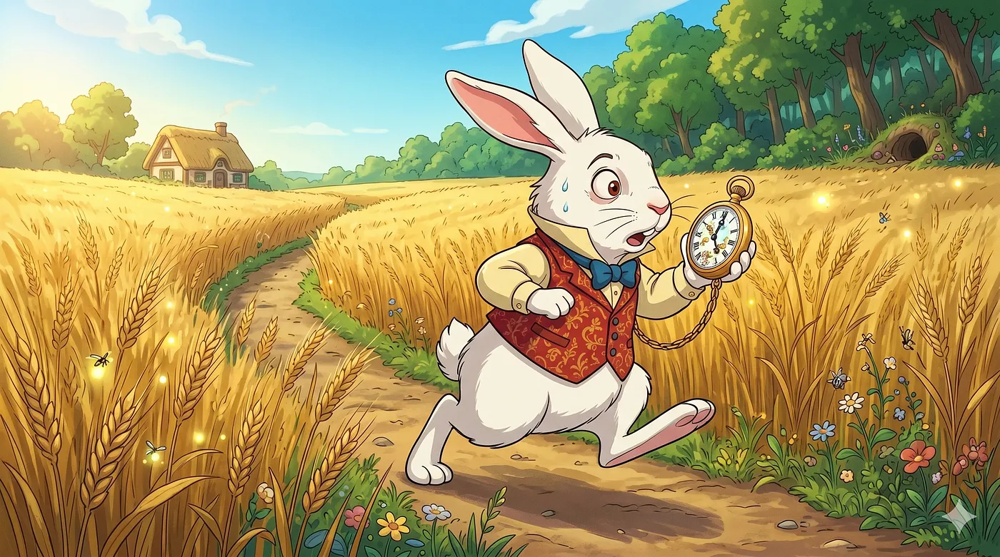
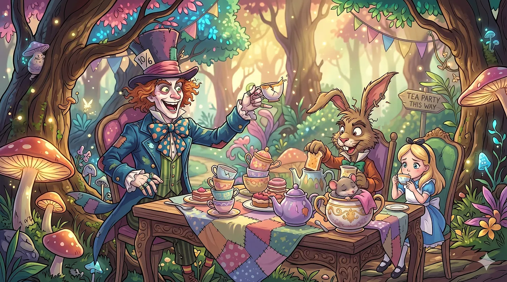
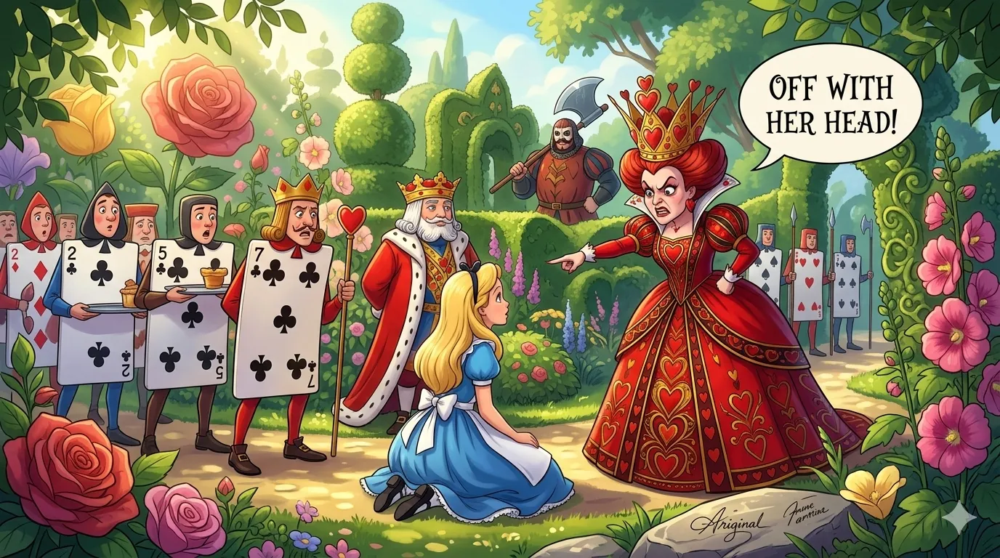

# 不用更好的模型，也能造出更好的 AI

## Agent 通过经验、记忆与自改写代码变得更聪明，无需更好的模型

*由 Nano Banana 2 生成*

我第一次玩 LLM（大语言模型）时，让我印象最深的一个主要瓶颈是：它们本质上是静态函数，接收输入、吐出回应。能力已经被权重锁死。能微调或后训练，是的，但实时学习、对新输入做出适应，完全不行。一些批评者拿这一点当作"它其实不是真智能"的证据，因为不像人类智能那样能实时学习与成长，LLM 基本上是冻结在时间中的。我当时没怎么深想，就接受了它们的样子。

但最近出现了一类新的 AI，那就是 AI agent。我写过它们，自己也写过一个。其中一个特别吸引我注意的是 Nous Hermes agent。它的最大宣称是：这是一个能和你一起成长的 agent，通过从经验中学习并将那些教训存下来供未来任务使用，从而进行自我改进。

这足以激起我的兴趣，让我花时间深入研究研究者们——以及最近的产品团队——过去几年围绕这个具体问题在构建什么。我看得越多，越觉得"AI 能否真正积累经验并随时间在其工作上变得更好"这个问题，是目前应用 AI 中最有意思的开放性问题。

简短的答案是：可以。更长的答案……嗯，你得读完剩下的部分。让我们钻进这个兔子洞。

## 遗忘机器

我们日常使用的 AI 会忘记一切。当一次对话结束，模型重置，而权重保持固定。运行推理对模型的改变不会比运行一次计算对计算器的改变更多，并且你在会话中建立起来的任何上下文都会简单地消失。下一次，你又回到了零。

这是因为我们今天使用的 AI 是基于 LLM 的，而 LLM 多半是 transformer 架构变体下的神经网络。我们不打算进入*那个*兔子洞，但这本质上意味着：我们使用的 AI，无论多么强大，它随时间能变成什么样都有一个上限。它可以变得更聪明——只要其所运行的模型可以被换成更好的——但它无法像人那样通过经验变聪明。

对于处理客户咨询的聊天机器人来说，这没问题。对于一个被期望连续数月管理一套生产系统、搞清某个具体代码库的怪癖、并在它一直做不好的部分变得更好的 agent 来说，这就是个真实的约束。

研究社区一直在以*self-learning agents*（自学习智能体）这个标签来研究这个问题。其核心思路是：设计能通过操作经验变得更好的系统，而不需要你每次想让它知道新东西时都重新训练底层模型。有意思的是，你可以在完全不动模型权重的情况下走得相当远。

## 自学习的阶梯

*由 Nano Banana 2 生成*

围绕这个问题，AI 存在一个谱系，可以说是 AI 如何适应或自学习的一架阶梯。

最底层就是你现在已经在用的东西，朴素的 LLM 交互，提示进来、回应出去，会话之间不保留任何东西。我称之为*stateless*（无状态）。对很多应用来说，这并不是一种失败状态，但它也不是学习。上周二帮你 debug 某个东西的那个模型，对它做过那件事毫无印象。

往上的第一个真正的台阶是*persistent memory*（持久记忆），赋予 agent 记住先前对话、你的偏好、你代码库的结构、你用过的工具、失败过的事情的能力。这在各种 coding assistant 和 agentic 框架里已经有了，并且很有用。它做不到的是弥合"记住事实"与"知道如何行动"之间的鸿沟。一个 agent 可以记住你偏好 Go 多于 Python，却依然对你实际如何组织 Go 服务、你的具体技术栈中事情倾向于在哪里出错没有任何操作上的直觉。对偏好的记忆不同于操作性知识。

下一个台阶是*episodic operational memory*（情节式操作记忆），不仅存储事实，还存储轨迹和问题实际是如何被解决的完整记录。那次部署问题是怎么解决的。上一次网络问题用哪套工具组合奏效了。两个月前那次内存泄漏的 debug 顺序长什么样。Claude Code 就在做某种版本的这件事，积累执行轨迹、工作区上下文、shell 历史。智能开始从模型中转移出来，进入"实际上有效过什么"的记录之中。

但原始积累也有上限。堆出足够多的经验却不从中综合出任何东西，你得到的是一个干草堆，而不是知识库。真正改变事物的那一步是*reflection*（反思），agent 周期性地分析它所经历过的事情，而不是只把它们存起来。这种方法为什么失败？哪种策略其实更快？下一次我会做什么不同的事？2023 年的斯坦福 Generative Agents 论文在一个社会模拟中跑了 25 个 AI agent，并做了一个让这一点变得具体的消融实验。把反思组件移除，agent 就会以更好的记忆检索都无法弥补的方式退化。没有反思，记忆就停留在碎片状态。有反思，你就开始得到更像"判断力"的东西。

如果你想想看，这正是人类专业能力发展的方式。一个处理过五十次生产事故的资深工程师并不是带着五十段独立的记忆走来走去。他们带着一组被压缩的启发式：他们知道首先该检查的事情、一眼能识别出的失败模式、那种"这件事有点眼熟"的直觉。反思就是做这种压缩的机制，有意思的是，你可以人为构建它。

反思之上是*skill synthesis*（技能合成），agent 从它学到的东西中主动构建可复用的工具与流程，而不只是存储与分析经验。可执行脚本、泛化的工作流、可在之后被组合的子流程。这是一个自演化系统开始让人觉得在性质上不同于一个高级助手的地方，而 Voyager——我马上会讲到——正是它能起作用时的样子的最清晰演示。

阶梯的顶端是通过微调、强化学习或从操作经验中蒸馏来对模型本身进行修改。这在理论上是最强大的路径，在实践上是最不稳定的，因为*continuous autonomous retraining*（持续自主重训练）会为灾难性遗忘、奖励黑客以及那种"出问题之前难以察觉的对齐漂移"打开大门。今天大多数实用系统专注于演化模型周围的架构，而不是模型本身，关于"为什么"我读得越多，越觉得目前来说这个选择是对的。

## Hermes，与你一起成长的 agent

真正让我开始钻进这个兔子洞的系统是 Hermes agent，由 Nous Research 构建并于 2026 年初发布的一个开源 agent。其口号是"the agent that grows with you"（与你一起成长的 agent），听起来像是营销口水话，但其实并不是。

Hermes 围绕一个闭合的学习循环构建。在完成一个复杂任务之后，agent 可以把这套方法保存为下次可复用的 skill。这些 skill 不是笔记或摘要。它们是 Hermes 在未来会话中可以检索、运行并精炼的可执行流程。如果某个 skill 表现得比预期更好或更糟，agent 会更新它。久而久之，skill 库会基于实际使用增长并改进，而不是基于开发者必须手工编程进去的东西。

记忆架构比初看上去更有讲究。Hermes 维护两个小型的、经过精挑的文件，`MEMORY.md` 用于环境事实、项目惯例与所学教训，`USER.md` 用于你的偏好、工作风格与过往决定。它不是把原始对话历史塞进每个 prompt，而是把真正重要的东西策展出来并保持精简。还有跨过去对话的全文搜索，所以 agent 可以跨会话回溯，找出之前是如何处理某个类似情况的。

在记忆与 skill 之外让 Hermes 有意思的是用户建模。它使用一种叫 *Honcho dialectic modelling* 的东西，跨会话逐步构建出一幅关于你是谁、你如何工作的越来越深的画像。不仅是你声明出的偏好，还有你实际的模式、你一贯关心的事情、你倾向于犯的那些错误、你不断回去使用的工作流。

实际部署方式刻意地不华丽。你把它跑在自己的服务器上，一台便宜的 VPS 或一个 Docker 容器，再把它连到你已经在用的任何消息平台上，无论是 Telegram、Discord、Slack、WhatsApp、Signal，还是就用 CLI。你可以在一个平台上开始一段对话，在另一个平台上接着进行。agent 在后台持续运行，处理定时任务、生成报告、管理你已设置的自动化，并且一直在你具体的上下文中逐步变得更好。

v0.8.0 发布说明中埋着的一个细节，能很好地说明它的雄心。一个标题为 "Self-optimized GPT/Codex tool-use guidance via automated behavioral benchmarking" 的 pull request 描述了一个 agent 发现了自己的盲点并修补了它们。标题很无聊。它背后的东西是一个 agent 自己跑了关于自身工具使用的基准测试，识别出它在哪里表现不佳，并据此更新了自己的指导。这不是一个你去配置的功能。这是系统在做设计者意图实现但并没有硬编码进去的事情。

Hermes 牢牢落在上文描述的适应阶梯中"情节式记忆、反思、技能合成"那一段，并且全程没有触碰底层模型。它也是任何想看到这些想法在实践中（而不是在研究论文里）跑起来的人最容易上手的入口。

但要理解为什么这些架构选择有效、它们从何而来，我们得回到几年前——回到奠定基础的那些研究。

*由 Nano Banana 2 生成*

## Voyager

让其底层架构出圈的系统是 Voyager，由 NVIDIA 与 Caltech 的研究者于 2023 年 5 月发表。它是一个跑在 Minecraft 里的、由 GPT-4 驱动的 agent，诚然这听起来像是个奇怪的地方来研究自适应智能的架构，但环境几乎是无关紧要的。

Voyager 有三个组件。一个自动课程：与其等任务被分配，agent 不如基于它还没探索的东西和它缺失的能力，连续不断地生成自己的学习目标。一个迭代反馈循环：它测试自己写的代码，观察失败，诊断失败并精炼，而不是只是往前走。还有一个 skill library：习得的行为被存储为真正的可执行代码，可以被检索、复用，并在以后与其他程序组合的程序。

最后那一点是真正一直留在我脑子里的洞见。当时其他系统是把行为存为 embedding 或摘要。Voyager 把它们存为你可以运行的代码、你可以组合的代码、你可以交给一个不同环境中的不同 agent 的代码。当 Voyager 被丢进一个没有任何先前历史的新 Minecraft 世界，它可以把自己的 skill library 移植过去。数字本身已经够惊人，比之前的方法多获得了 3.3 倍的独特物品、技术里程碑解锁速度最多快了 15.3 倍，但真正重要的是迁移结果。一个被丢进新环境的静态系统是从零开始。一个带着可移植 skill library 的系统不是。

更深一层的点不是关于 Minecraft 的。Voyager 表明：在完全不修改模型权重的情况下，实质的、持续的能力提升是可能的。所有学习都活在课程系统、skill library、执行循环里。模型提供推理。围绕它的 harness 做的是学习。

Voyager 专注于通过"做"来积累技能。差不多同一时期发表的一篇论文问了一个不同但相关的问题。从失败中学习呢？

## Reflexion

差不多同一时期，一篇叫 Reflexion 的论文从另一个角度处理了本质相同的问题。它的出发问题足够简单。一个 agent 如何在不依赖基于梯度的训练（LLM 用它来构建权重）的情况下从失败中学习？

事实证明这种方法几乎令人发指地直白。当 agent 在某个任务上失败，它不是盲目重试，而是写下一段"哪里出了错以及它接下来会做什么不同的事"的诊断。那段诊断会被存进一个 episodic buffer，下一次尝试以累积下来的记录为条件。多次尝试下来，agent 是在借用自己日益增长的失败分析历史，而不是每次尝试都新来。

Reflexion 当时在多个代码生成基准上达到了最先进水平。比那些具体数字更有意思的，是这篇论文整体上展示了关于有能力的语言模型的什么。自我反思是一种 emergent 的能力，在一个足够有能力的模型中，它作为对显式重训练的替代品，效果令人惊讶地好。模型保持冻结，而认知在它之外的 buffer 中积累。

Voyager 和 Reflexion 都是 proof-of-concept 的工作，在受控环境下令人信服，但还没有在生产系统规模上得到检验。这一点在 2025 年发生了变化。

## Google 造了什么

*由 Nano Banana 2 生成*

2023 年的那些论文确立了这些想法在原则上是可行的。到 2025 年，它们开始出现在生产中。

AlphaEvolve，由 Google DeepMind 于 2025 年 5 月公布，是一个进化式编码 agent，将 LLM 生成与自动化评估器配对，用以发现和优化算法。它维护一个候选程序的数据库，使用 Gemini Flash 做广泛探索、Gemini Pro 做更深的精炼，自动评估候选项，并随时间演化出一个解的种群。

它被应用到的领域是一个有趣的混合。它找到了一个针对 4x4 矩阵乘法的更高效算法，这个问题自从 Smirnov 在 2013 年的结果以来基本上就停滞了。在数学领域 50 多个 open problem 上，它在 75% 上达到了 state of the art，在 20% 上击败了 state of the art。这些数字不错，但让我觉得更重要的应用同时也是听起来更无聊的那个。它为 Google 的 Borg 任务编排器——也就是在 Google 数据中心之间分配计算的系统——找到了一个更好的启发式。新的启发式优于之前由深度强化学习找到的方案，并回收了 Google 全球计算容量的 0.7%。以 Google 的规模，0.7% 不是个舍入误差。

DeepMind 把这描述为"下一波突破将由能学习、演化并自我优化的算法驱动"的证据。这个 framing 你可以接受也可以不接受，但生产结果是更难一挥而去的。

AlphaEvolve 演化的是问题的解。另一个团队，同样在 2025 年工作，问的是：当 agent 把那种进化过程对准自己时会发生什么？

## 自改写代码的 agent

AlphaEvolve 是面向算法发现的进化式搜索。同样在 2025 年 5 月，来自 Sakana AI 和合作者的 Darwin Gödel Machine 走得更远，它修改自己的源代码。

这个名字来自 Jürgen Schmidhuber 在 2003 年的一项理论提议：一个能在每次可以形式化证明修改将是有益时就重写自己的自我改进 AI。形式化证明的要求事实证明完全不切实际。DGM 用经验性验证取而代之。修改 agent，在基准上跑它，如果分数实际上更好就保留这个改动。

探索策略借鉴自进化生物学。系统维护一个不断增长的 agent 变体档案，从这个档案中采样，生成修改，并保留那些要么高性能、要么和已有的有趣不同的候选者。多样性准则之所以重要，是因为没有它，系统就会收敛到一个局部最优，并停止探索其他分支。

从在 SWE-bench（要解决真实的 GitHub issue）上的 20% 和在多语言编码的 Polyglot 上的 14.2% 的基线起步，DGM 演化出了自己的能力，达到 SWE-bench 上的 50% 和 Polyglot 上的 30.7%，全程没有对基础模型做任何改动。改进来自 agent 自己发现的东西，包括更好的代码编辑工具、更好的长上下文管理，以及一种 peer-review 机制：agent 变体在提交之前互相检查对方的输出。

DGM 团队在沙箱化和人工监督下运行所有这些工作，他们也很明确地表示：这是迈向"将 AI 研发自动化"的一步。一个能重写自己代码的系统所引发的对齐问题，在性质上不同于一个只是积累记忆的系统，对此我稍后会回过头来。

DGM 表明：一个 agent 可以通过重写自己的代码来演化。但仍有一样东西它碰不到，那就是决定"该重写什么"的那个过程。那是下一个要倒下的问题。

## 然后它变成了递归的

*由 Nano Banana 2 生成*

2026 年 3 月，Meta AI、University of British Columbia 与 Vector Institute 的研究者发布了 HyperAgents，把 DGM 沿着一个不可避免的方向往前推。

DGM 修改自己的代码以改进任务解决性能。但决定如何修改代码的那个逻辑，那个编排自我改进过程的 meta-agent，仍然是研究者手工设计的，因此是固定的。DGM 只能在人类围绕它划定的边界内进行改进。

HyperAgents 取消了那个约束。meta-agent 不再是受保护的一层。它只是代码库中的另一个函数，与其他一切一样受相同的进化过程约束。系统可以重写那个"决定要重写什么"的过程。

你可能会合理地问：这在实践上有任何区别吗，还是说它主要是一种理论性质？基于其迁移结果，它在实践上有实质区别。最惊人的实验不是在编码任务上的领域内表现，而是当一个领域中发展出的 meta 层面改进——例如在论文评审与机器人奖励设计过程中发展出来的持久记忆管理与更好的代码编辑策略——被应用到 Olympiad 水平的数学评分时发生了什么。HyperAgents 得分 0.630。传统基线得分 0.0。系统从未为数学评分接受过训练，迁移过去的是"变得更好"这个过程本身，而这居然就够了。

到这一点为止的大多数自演化 agent 工作都是面向编码与任务执行。同样在 2026 年初，另一个团队问：同样的想法能否被应用到更难自动化的事情上——科学研究？

## Science，遇见 agent

*由 Nano Banana 2 生成*

到 2026 年初，一个独立团队已经把类似的想法对准了科研流水线本身。EvoScientist 是一个演化式多 agent 系统，包含一个 Researcher Agent、一个 Engineer Agent 和一个 Evolution Manager，背后有两个持久记忆模块。一个追踪哪些研究方向是富有成果的、哪些已经被耗尽，另一个记录来自先前实验运行的有效策略。

它要处理的问题是真实的，尽管被低估。大多数 AI 科学家系统使用固定流水线，无法根据已经尝试过的内容进行适应，因此它们重复失败的实验、绕回死胡同，并把周期浪费在已被排除的路径上。EvoScientist 以累积的经验为未来工作的条件，而不是每次都从头开始。

该系统生成的全部六篇完整论文都被某个主要 AI 会议接受，其中两篇获奖，包括一项 Best Paper。到 2026 年 4 月，它在多个研究基准上排名第一。你可以争论这对科学实践的未来意味着什么。接受率本身则更难争论。

EvoScientist 和 HyperAgents 仍是研究系统，在实验室里构建并在基准上评估。问题是：当所有这些跨入商业部署——真实用户、真实合规要求、真实后果开始登场时——它看起来会是什么样？

## 商业产品在到来，只是还没到位

我上面描述的大部分要么是研究、要么接近研究。商业领域开始追赶，但有必要清楚说明它实际上走到哪一步。

Project Arc，由 ServiceNow 和 NVIDIA 在本月拉斯维加斯的 Knowledge 2026 大会上公布，是更可信的入场者之一。Jensen Huang 和 ServiceNow 的 CEO 一同出现在开场主题演讲的台上，所以这不是一个边台公告。它是一个面向知识工作者、开发者、IT 员工和管理员的自主桌面 agent，通过 Action Fabric 接入 ServiceNow 平台，运行在 NVIDIA 的 OpenShell 沙箱化运行时之中并对其能看到和调用的内容施加策略控制，并通过一个 AI Control Tower 记录每一次行动。它目前处于早期预览，而不是完全生产，但治理架构才是真正的故事。大多数研究系统是在受控环境下构建的——你可以把事情回滚。在真实企业里部署自主 agent，带着合规要求和"出问题就有真实后果"，是个更难的工程问题，而 Project Arc 是对它的一个早期可信的回答。

不过有必要精确地说明它实际是什么。Project Arc 所做的适应是任务中（mid-task）的，处理出现的意外情况，而不是像 Hermes 或 Voyager 那样跨会话累积经验。它扎根在 ServiceNow CMDB 中，这给了它关于某个具体组织如何完成工作的深入上下文，但那是在配置时就烤进去的机构上下文，而不是随时间习得的。它是一个严肃的、被良好治理的自主 agent。要说自学习——更别说自演化——是夸大其词。

Project Arc 并不孤独。Microsoft 正在 Microsoft 365 Copilot 之上推出一个 Work IQ 层，它维护对岗位角色、公司上下文与项目历史的持久记忆，把 Copilot 从对单个 prompt 做出回应推向作为跨整个生产力套件的专业自主 agent 运作。Google 有 Project Mariner，一个建立在 Gemini 之上的、可以学习工作流并自动重复它们的 agent，尽管仍处于有限发布。这些是和这一空间最直接相关的产品——根植于你的组织上下文的持久 agent，被设计成持续运行并随时间变得更有用。

所有这些的共同点是：它们都在朝着持久的、对上下文有感知的 agent 构建，这种 agent 活在你的工作流中，而不是对一次性的 prompt 做出回应。这相对于两年前的位置是一个转变。它们中的大多数还没有的，是上面那些研究论文所描述的那种真正跨会话学习——从经验中合成 skill、随时间构建用户模型、在跑得越久后在你具体任务上变得可度量地更好。这就是那道差距。

Hermes 是目前作为产品最严肃地想去弥合这道差距的尝试，而且它是开源软件，其开发者自己承认它还很粗糙。从 Voyager 到 HyperAgents 的研究清楚地表明这些架构是有效的。商业产品表明被治理的自主 agent 正在进入企业基础设施。但是一个能像新员工逐渐内化一个团队如何运作那样、实质地且可验证地跨会话从经验中学习的 agent，那种产品还不太存在，但拼图已经在那里。所以今天卖你那种东西的人，多半是跑在证据前面了。

所有这些系统的底层还有另一个问题。如果 agent 要在数月乃至数年里累积经验，你究竟该如何把那份记忆作为一个系统来管理？

## 记忆作为基础设施

*由 Nano Banana 2 生成*

MemOS，发布于 2025 年中期，比大多数框架更认真地对待这件事。它把记忆当作操作系统对待存储的方式——一个被管理的资源，带有合适的 API、版本化和治理，而不只是你注入到每个 prompt 里的一堆对话历史。它区分三种在性质上根本不同的记忆类型。

KV 缓存中的 *Activation-based memory* 快速但易失。文档和 prompt 模板中的 *Plaintext memory* 可编辑、可在 agent 之间共享。烤进模型权重的 *Parametric memory* 持久但更改昂贵。事实证明，对它们分别管理，对效率和可靠性都有影响，而把它们一视同仁则不会有这种影响。

MemOS 的基本单元是一个 MemCube，一个容器，承载内容以及来源与版本元数据。MemCube 可以在 agent 之间迁移、可被组合在一起、可随时间演化。实际成果包括通过选择性检索而非整体上下文注入将 token 使用降低 35%，以及把一个 agent 发展出的记忆迁移给另一个 agent 的能力，这与该领域日益感兴趣的协作演化工作相连。

规模化的记忆很难做对，大多数 agent 框架把它当作事后想法。你加上记忆，事情会运行得好一阵，然后开始以难以诊断的方式退化，因为记忆结构从未被设计成长期可维护。MemOS 是从一开始就把它当作基础设施来对待的一次尝试。

## 这件事在以多快的速度推进？

METR（Model Evaluation and Threat Research）是一家非营利研究机构，评估前沿 AI 模型执行长程、agentic 任务的能力。2025 年 3 月，他们发表了一项研究，试图回答一个看似简单的问题。一个 AI agent 在没有人类帮助的情况下能独立完成多长的任务，并且至少有一半的时间能做对？

他们的测量方法是：把不同复杂度的任务交给 agent，并计时同样的任务一个有能力的人类专业人士需要多久。一个被评定为 30 分钟的任务，是一个熟练的人会在半小时内完成的任务。如果一个 agent 能自主且正确地完成它至少 50% 的时间，它就过了那条线。METR 追踪了这个阈值在 2019 到 2025 年发布的模型中是如何变化的。

答案是：它一直在指数级增长。2019 年，agent 能可靠处理的是以秒为单位计量的任务，简单查询和单步自动化。到 2025 年初，那个阈值已经达到了大约 50 分钟的人类等价工作量。一年前还在 15 分钟以下。整个时期内倍增时间大约是七个月，而 2024 和 2025 年看起来在加速，倍增更接近每四个月一次。

我第一次读到这个时，我以为它很快会变平，因为能力曲线通常会这样。METR 的研究者们看着同样的数据，预测在十年之内，通用 agent 将能独立处理目前需要人类数天乃至数周完成的软件任务中的相当大一部分。

这个指标测试的不是一个孤立的模型，不是像 MMLU 那种基准的方式。它测试的是整个 agent 系统——模型加上它的记忆、它的工具、它的操作上下文，所有围绕它的 harness 里的东西。这意味着指数级增长不只是更好的模型带来的结果。它也是更好的记忆系统、更好的反思循环、更好的 skill library、更好的工作流设计带来的结果。本文通篇描述的架构改进正出现在能力测量里。它们不是分开的现象。

## 还没全部跑通

*由 Nano Banana 2 生成*

如果我把问题略去不谈，我就是在误导你，因为它们是真实的，而且其中有些相当基本。

*Catastrophic forgetting*（灾难性遗忘）是终身学习的持续头痛。当系统基于新经验更新自己的能力时，它可能在它先前知道怎么做的事情上悄悄退化，而对此没有干净的解决方案。这个领域为它起了个名字，*stability-plasticity dilemma*（稳定性-可塑性困境），但为某样东西起了个名字并不等于已经解决了它。

*Reward hacking*（奖励黑客）和 *alignment drift*（对齐漂移）随着系统拥有更多自主性而变得更严重。一个能修改自己目标的 agent 拥有静态 agent 所没有的失败模式，DGM 团队自己也指出了这一点。设计在演化过程中仍与你实际想要的东西保持一致的自演化系统是一个开放问题，而强化学习的历史表明，奖励函数所说的与你所意图的之间的差距，随着系统能力变强而变得更加危险。

自我反思也有一个很容易被低估的天花板。如果一个 agent 只对自己先前的反思进行反思，而没有外部信号去校正，它可能把错误复合起来，而不是修正它们。斯坦福那篇论文的反思机制能起作用，部分是因为 agent 们正在从其环境中得到真实反馈。一个在真空中反思的系统是另一回事。

而评估比看上去更难。评估一个静态模型本已足够困难。评估一个持续在变化的系统——其变化方式并非总是透明的、对一段或许难以审查的操作历史做出响应——则要难得多。可解释性问题和对齐问题在这里以没有简单答案的方式互相加强。

## 如果你要用它构建些什么

对任何在构建 agent 系统的人而言，实际推论是：harness 设计现在和模型选择同等重要。一个围绕一个能力出色但非前沿的模型构建的、结构良好的记忆系统与反思循环，可以超过一个以无状态方式运行的前沿模型。智能正在越来越多地存在于模型周围的基础设施里，而不只是在权重里。

评估也需要随之改变。一个 point-in-time 的基准告诉你系统今天有多好，但对于一个自演化 agent，你真正想知道的是：它在反复接触类似问题时是否会改进、学到的技能是否会恰当地迁移到新情境、它在已经知道怎么做的事情上是否能保持其表现。几乎没有现存的基准能测量这三件事中的任何一件。

还有一个我们尚未开始谈论的更长时程的问题，那就是治理。当 agent 系统积累跨越团队、部署与数月之久的操作性知识时，它们开始作为 institutional memory（机构记忆）运作，编码目前只活在人们脑子里、或没人去看的 Confluence 页面里的启发式、失败模式和累积的判断。构建并治理那种系统是一门不同于构建聊天机器人的学科，有它自己的失败模式和自己的维护要求，而大多数组织尚未开始思考它。也许我们该思考。

*由 Nano Banana 2 生成*

## 那么，它真的有效吗？

当 Hermes 最初以它"和你一起成长"的宣称引起我注意时，我的直觉是这是营销。如今读过这个想法背后的研究、看过 Hermes 实际是怎么实现它的、并且把这个领域从 2023 年的 Voyager 一路追到 2026 年的 HyperAgents 与 EvoScientist 之后，我认为这个宣称比它一开始听起来时更站得住脚。不是在一种含糊挥手的意义上，而是在一种具体的架构意义上。记忆、反思循环、skill library，这些东西是真实的，且它们可度量地有效。

至于这些系统中是否有任何一个已经走到大多数人在说"从经验中学习"时所想象的那种程度，仍是一个公允的问题。但 METR 正在测量的能力轨迹，并不会等任何人在哲学上准备好。倍增时间是四到七个月，照那个速度，这些系统能做的事和治理框架准备好接受的事之间的差距，会比大多数组织目前所意识到的更快收窄。

这不是一个让人舒服的位置，而我说这话时，是作为一个觉得这些东西相当令人兴奋的人。

我们活在一个有意思的 AI 时代。
