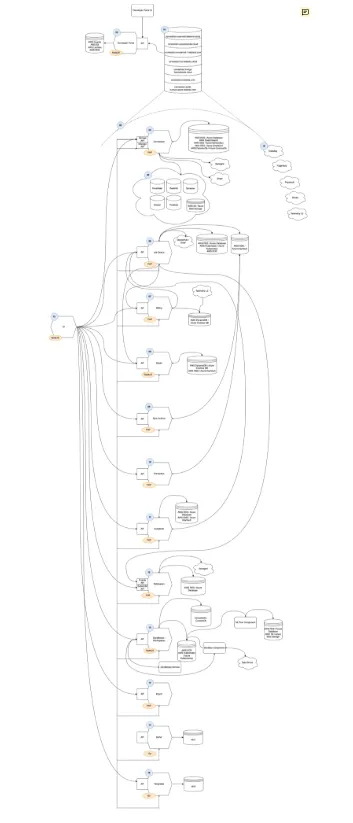
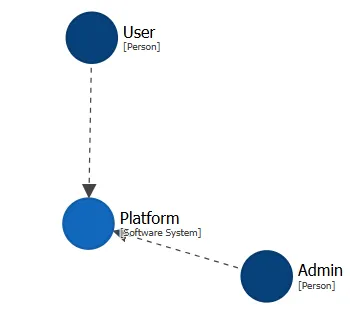
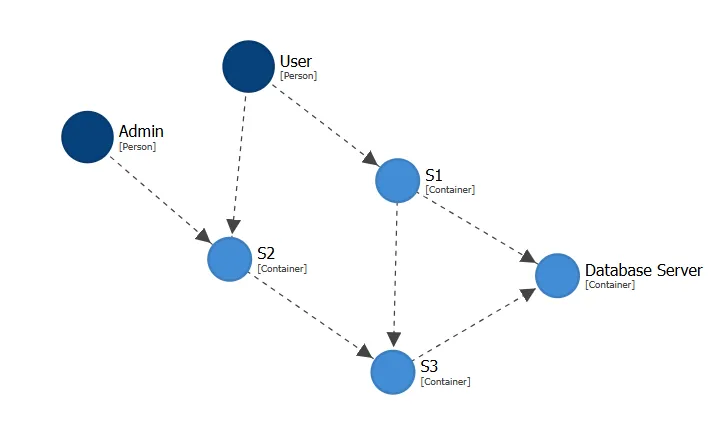
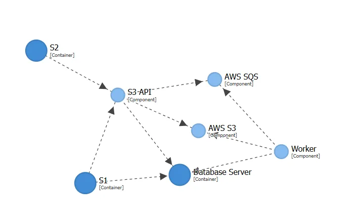
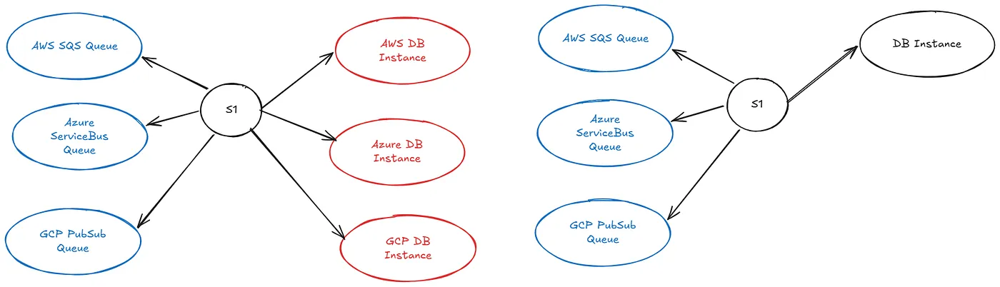
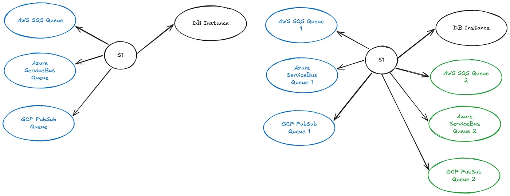
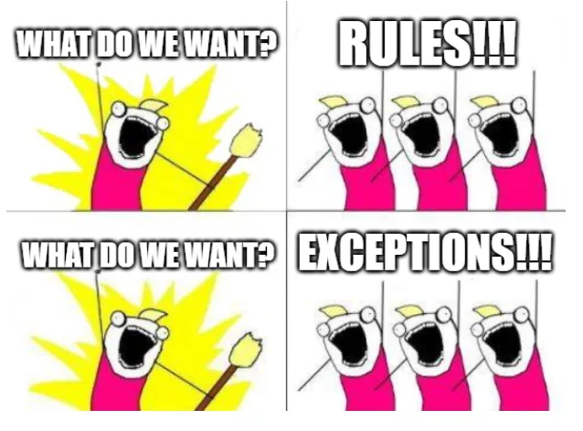
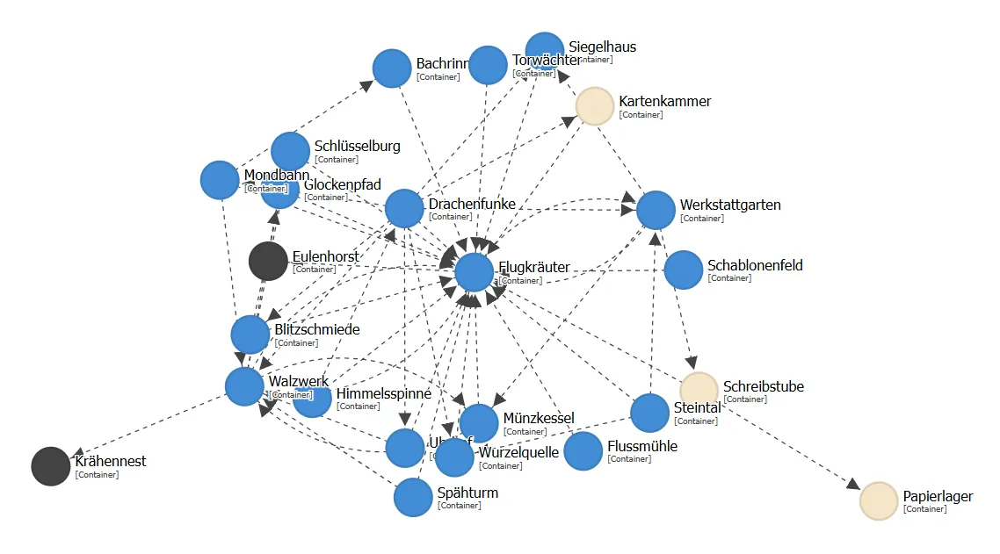

# 为一团中等规模的混乱编写架构文档

*我如何使用一个 Claude skill 为一个中等规模平台的架构编写文档，途中略微抓狂、发疯，并领悟到这个 skill 比产物本身更有价值。*

写软件架构文档很可怕。尤其是在一家没有架构师角色或部门的中型公司。光是想一想公司信息系统的架构，看起来就如此"多余"和"拖我们后腿"。然而中型公司一次又一次最终陷入重复的系统、重复的数据，以及一团混乱。

## 混乱的规模

这个平台 15 年前作为一个 monolith 启动，然后有机地——没有太多预先规划——开始拆分成更多的模块（拆 UI 应该是第一步）、服务、仓库等等。几年后我们达成共识：方向是采用[领域服务（domain services）](https://www.geeksforgeeks.org/system-design/domain-oriented-microservice-architecture/)，因为：

-   对于我们的代码库和公司规模来说，这是合适的分解粒度。
-   它顺应了现状（眯一只眼看，那个 monolith 可以被归类成一个领域），而这个现状本就对我们行得通。

那个决定很聪明（即使事后回看也是），并且今天仍然成立。在工程方面，对平台架构的理解还算可以。对各个领域的理解？就没那么好了。对相互连接和共享资源的理解，活在大概 3 个人的部落式知识里。在工程之外，这种理解为零。

为了把问题框起来：我们有超过 1k 个 GitHub 仓库，其中约 40 个仓库与平台本身相关——这些是"运行中的服务"，不是临时组件、扩展、实验和其他垃圾。这大约是 6 种编程语言写的 180 万行代码（约 70MB）。这 40 个左右的仓库包含大约 30 个领域服务和一个 monolith（其中仍然包含一些很少使用的 UI）。其中一些仓库是 mono-repository（是的，我们有多个 **mono-** repository），还有些只包含可复用代码的库。虽然光是知道这些就代表问题被大大缩减了，但仍然留下了大量代码和依赖需要记录。我会把它视为一个塞不进一个人脑袋的中等规模系统。

不过我有一个巨大的优势——我对整个系统非常熟悉。在 ~30 个服务中，我主动设计或开发了 ~15 个。其余的我知道它们在做什么、它们如何与外界交互。当然，我远远谈不上无所不知，但这帮助极大，我同情所有要去记录从未见过的东西的架构师。

多年来我尝试生成并维护架构文档，我不怕承认我惨败而归。两次我设法做出了一些较为完整的文档，但结果都不算好。

*旧的架构图，故意做成不可读的。*

上面这张图是我做出来的最好的一张。它在新员工入职时还派上了一些温和的用场，但除此之外它太笨重以至于没什么用。主要问题是从来没有时间维护它。同时，公司里也没有严格的变更流程。如果不去事事处处都盯着，根本无法维护它。这份文档每年都变得越来越没用。

## 一个再试一次的新借口

几周前，C 字头高管层冒出一个想法：他们终于要把所有工程师都赶走，这样他们自己就可以用 AI agent 把所有代码都写出来。但他们谁也不太了解当前的技术栈。所以我终于得到机会，可以花一段专门的时间去记录平台架构。

被设定的目标是用 AI 替换掉所有的人类工程师。这对我来说挺合适，我有一堆书要读，我的花园杂草丛生，也许我的待办清单终于可以开始变短。但在我失业之前，我稍稍偏离了那个目标。原因是我并不相信"拥有架构文档"是那种*开天辟地的关键东西*，挡在"拥有人类工程"和"只剩 AI 编码 agent"之间（关于这个我会在另一篇文章里讲）。所以我以一个略有不同——但更立即务实——的目标去对待这个问题。也就是影响分析，它有两种形态：

-   开发影响——例如，如果我想改变 Service 1 的 API 契约，哪些服务需要更新？我需要找哪些团队谈？
-   运维影响——例如，如果 Service 1 的 API 挂了，什么会坏？什么不会坏？谁能修？

这两类问题都应该可以从架构图里得到回答，而不是从某人的记忆里得到。

这类问题在某种程度上可以由可观测性工具回答（例如，我们有 [Datadog](https://www.datadoghq.com/)）。但有局限——那些在运行时不显眼的东西就会被漏掉。最近，我在下线一个 API，发现只剩两个端点在被调用。只有经过仔细的代码调查后，我才发现一个被遗忘的每月 cronjob，然后一个三个月没跑过的按需任务。同样，分析云资源和其他外部资源也很棘手。可观测性工具会告诉你你在调用 S3，但不会告诉你那是哪个 bucket、你用它在干什么。一般来说，很难评估这些关系的目的——Datadog 会告诉你"S1 uses S2"。代码分析会告诉你"S1 在 S2 中存储用户会话"。有人可能注意不到这一点，因为我们*知道* S1 用 S2 来做什么，但一旦你试着把它正式记录下来，信息的缺失就显现出来了。

## C4 Model

对于这个任务，我选择了 [C4 Model](https://c4model.com/) 搭配 [Structurizr](https://structurizr.com/)，主要因为：

-   它对 git 友好——模型以纯文本形式存储，变更可以做 diff 并被 review。
-   它支持模型校验——DSL 编译器会找出悬空的关系；不一致会立刻显现，而不是在自由形式的图里被漏掉。
-   它产出一个单一模型；关系只定义一次；在标准的 L1/L2/L3 视图（见下）中渲染；可以创建自定义视图而不动模型。
-   它对 AI 友好——机器可读的文件，容易被 Claude Code 等工具生成和处理。
-   它有 `!include` 这一概念——模型可以按服务拆分到不同文件中；添加或修改一个服务不会改到无关的部分。
-   强制一致的四层层级——给出关于模型应该如何组织的最佳实践，而不是只是自由形式的图。

我并不知道还有任何其他工具或标准具备所有这些特性。如果你知道，一定告诉我。

## 一个快速的 C4 入门

那么 [C4 是什么](https://c4model.com/)？*C4 是一组用于描述软件架构的分层抽象。每一层都放大上一层。* 这大概仍然非常抽象，而且对于在每个层级该放什么，[还有更多解读方式](https://revision.app/blog/practical-c4-modeling-tips)。重要的部分是"放大"。让我们考虑一个简单的、带主观倾向的例子，与*我想达到的目标*接近：

*整个被建模的 IT 系统的 L1（System Context）视图*

最顶层是我想建模的整个 *Software System*。在这个例子里是一个平台，有两种角色与之交互。接下来，我可以放大到这个平台，看看里面有什么：

*平台的 L2（Container 视图）*

平台由三个 *Container* 组成——服务（S1-S3），其中两个使用一个（共享）数据库服务器。接下来我可以放大到 S3 服务，看看它由什么组成：

*S3 服务的 L3（Component 视图）*

在 L3 视图上我可以看到，该服务由多个 *Component* 组成——API 和 worker，使用数据库（与 S1 共同使用），并额外使用 AWS S3 和 AWS SQS 服务。

简单吧？那有什么大不了的？关键是，上面所有这些图都被存储在一个简单的文本文件里：

workspace "Sample" "A simple C4 sample with two roles and three services." {  
    model {  
        # ---- People ----  
        user  = person "User"  "End user."  
        admin = person "Admin" "Administrator."

        # ---- The single software system ----  
        platform = softwareSystem "Platform" "The platform composed of three services." {

            s1 = container "S1" "Service 1" {  
                s1Api = component "S1 API" "S1 API" "HTTP"  
            }

            s2 = container "S2" "Service 2" {  
                s2Api    = component "S2 API" "S2 API"    "HTTP"  
                s2Worker = component "Worker" "S2 worker" "Background process"  
            }

            s3 = container "S3" "Service 3" {  
                s3Api    = component "S3 API"  "S3 API"         "HTTP"  
                s3Worker = component "Worker"  "S3 worker"      "Background process"  
                s3S3     = component "AWS S3"  "Object storage" "AWS S3"  
                s3Sqs    = component "AWS SQS" "Message queue"  "AWS SQS"  
            }

            db = container "Database Server" "Hosts S1 and S3 databases" "RDBMS" "Database"

            # Component \-> Database (container) relationships  
            s1Api    \-> db "Reads from and writes to"  
            s3Api    \-> db "Reads from and writes to"  
            s3Worker \-> db "Reads from and writes to"

            # Component \-> Component relationships inside S3  
            s3Api    \-> s3S3  "Reads from and writes to"  
            s3Worker \-> s3S3  "Reads from and writes to"  
            s3Api    \-> s3Sqs "Publishes to"  
            s3Worker \-> s3Sqs "Consumes from"  
        }

        # ---- Container-level relationships ----  
        user  \-> s1 "Uses"  
        user  \-> s2 "Uses"  
        admin \-> s2 "Uses"  
        s1    \-> s3 "Uses"  
        s2    \-> s3 "Uses"

        # ---- Component-level relationships (cross-container) ----  
        s1Api \-> s3Api "Calls"  
        s2Api \-> s3Api "Calls"  
    }

    views {  
        systemContext platform "Context" {  
            include \*  
            autolayout lr  
        }

        container platform "Containers" {  
            include \*  
            autolayout lr  
        }

        component s3 "S3-Components" {  
            include \*  
            autolayout lr  
        }  
    }  
}

如果架构发生了变化，用户开始直接使用 S3 服务，我需要做的就是加上**一行** `user -> s3 “Uses”`。这条关系会自动出现在所有它应该出现的视图中。同时，如果我加上 `guest -> s3 “Uses”`，模型就不会编译通过，因为角色 `guest` 没有被定义。然后用几行代码我就可以创建一个新视图，比如把云资源排除出去等等。

## 干就完了！

> 一切理论，朋友，都是灰色的，唯有生命的金树常青。

[Mephistopheles](https://www.buboquote.com/en/quote/3242-goethe-all-theory-dear-friend-is-gray-but-the-golden-tree-of-life-springs-ever-green) 是用这句话讽刺地嘲笑科学的——我并不想这么做，但他说的不无道理。我想强调的是，虽然 C4 回答了许多关于模型应当如何构造的问题，*它并不回答所有问题*。C4 有[以下定义](https://c4model.com/abstractions)：

-   *Software System* — 最高层级的抽象——某种为人提供价值的东西；
-   *Container* — 系统内可独立部署的单元（进程、服务、数据库等）；
-   *Component* — 容器内相关功能的分组（例如一个 Deployment、一个 CronJob）。

这些在[官网上有很好的解释](https://c4model.com/abstractions)，我建议每个人至少完整读两遍。然而当你开始决定把什么放在哪里时，新的问题就出现了。

首先，我从中间层——*containers*——开始。从中间开始也许看起来很奇怪，但因为定义最顶层的抽象（什么是 Software System）往往是最未知、最困难的——我从中间最已知的东西开始。

## 怪癖与皱褶

container 看起来"明摆着"。这个系统有一个公开的服务列表，在 API 索引上列出了 23 个服务，同时列出了 18 个[服务的 API](https://developers.keboola.com/overview/api/)。当然，这两个列表（以及我找到的另外两个列表）都不完整。好吧，随它去；我会把它理清楚——不管是 18 个、23 个还是 35 个服务。由于这个平台是由领域服务而不是 microservices 组成的，看起来还是清楚的。一个领域，一个服务，[一个问题](https://en.wikipedia.org/wiki/F%C3%BChrer#F%C3%BChrerprinzip)。例如 Notifications 由 `notification-api` 实现，位于 `notification-service` 仓库中。单一可部署单元，明显是一个 container。

*其实，并不是。*

只是，这个服务本身由多个单元组成。它包含一个 API 和若干异步 worker。当我看 [Kubernetes](https://kubernetes.io/) 模板时，它是 **5 个不同的 pod** 持续运行的代码。再加上一些按需运行的东西——通常是数据库迁移任务。我当然忽略了副本，因为它们只是简单的复制。**只要基本假设**是高可用，它们对架构图就没有影响。

好吧好吧，回到地面。GitHub 仓库有若干个 [CI/CD pipeline](https://en.wikipedia.org/wiki/CI/CD)，但其中只有一个会创建生产的 docker 镜像。这些镜像被推送到生产镜像注册中心，注册中心反过来触发 Kubernetes 部署的更新。也就是说，**就所有实际用途而言**，整个仓库就是一个可部署的单元，我就这么对待它——一个 C4 container。为了印证这一点，我问了一些问题：

-   会有人期望 API 和 worker 上跑着不同的镜像吗？→ 不会，那会让人感到意外。
-   有任何实际用途吗？→ 不太可能，因为它们共享同样的代码。
-   让 API 用一个和 worker 不一样的镜像有多难？→ 相当难。
-   这是我们想开始做的事吗？→ 不是，没有好处。
-   出事故时，我们怎么回滚它？→ 我们把它当成一个整体来回滚。

在此之后，我把 C4 的定义"Container — 一个可独立部署的单元"为我自己重新表述为"Container — 一个**被当成一个**部署**单元**来对待的东西"。

## 奇行与异象

接下来还有一个跑任务（jobs）的服务，它由 2–3 个 API（取决于你问谁）和大约 15 个 worker 组成。所有这些都是一个 mono-repository，除了一个特别大的 worker 单独住在另一个仓库里（与另外 4 个 worker 一起）。然后还有两个仓库装着别的东西。加起来是 ~8 个 docker 镜像被构建，~15 个运行中的 Kubernetes 资源。有 3 条 CI/CD pipeline 构建这 8 个 docker 镜像并触发 Kubernetes 集群的更新。一个仓库是 mono-repository，那里的 CI/CD pipeline 会一次性触发两个服务的部署（两个镜像），但只在某些情况下才这么做。另一部分在一个独立的仓库中，但同时它自己没有 CD pipeline，因为它只通过另一个（第三个）仓库部署。那个第三个仓库有 CI/CD pipeline，构建一个 docker 镜像，但触发两个 docker 镜像的部署。然后其中一个 API 是完全私有的，因为它对所有其他服务都不可见，但同时它又是单独被部署的（有时是这样）。

*这是疯狂。*

好吧好吧，够了。这是一团乱，但谁人无罪，谁就先扔石头来定第一个模型。这个东西存在，被大量使用，而我决定把它建模为一个 container，因为基于（不是所有，但*某些*）实际原因，它就是一个。如果你碰这只野兽的任何一部分，需要同时碰其他所有部分的可能性都很高。即便你在 mono-repository 上工作，你也常常会发现自己同时在两个其他仓库上开 PR，因为它们他妈的紧紧耦合在一起。我又问了几个问题：

-   会有人期望 API 和 worker 上跑着不同的镜像吗？→ 会，那是正常的，但它们有同样的 build number。
-   有任何实际用途吗？→ 有，逐步部署的时候确实会发生。
-   让 API 用一个和 worker 不一样的镜像有多难？→ 不是问题。
-   这是我们想开始做的事吗？→ 我们已经在这么做了，也许正确的问题是我们想不想停下来？
-   出事故时，我们怎么回滚它？→ 我们按部分回滚。

不是很有说服力，是吧？换言之，我决定把多个 API、多个 Kubernetes 资源和多个 docker 镜像当成一个 container，因为它有时是被这样使用的，并且**总是被这样思考**。好吧，现在我真的是在执行 [Conway Law](https://en.wikipedia.org/wiki/Conway%27s_law)，继续，开枪吧。但最终看起来是合适的。**我是来记录已存在的现状，而不是我希望现实成为什么样子。**

## 怪胎与突变体

我做完了吗？当然没。还有 monolith 服务，对于很多用途我们把它当成 2–3 个服务来对待（因为我们通常会忘了第三个）。虽然它们是由一个 API（一个 docker 镜像，一个 Kubernetes 部署）实现并对外服务的，它们的差别如此之大以至于我们经常把它们当作不同的东西。经常如此，但并非总是。在事故时它们仍然作为一个被回滚，它们由一个团队开发，它们使用相同的云资源，它们共享同一个代码库和数据库。所以我决定把这也算成一个 container。

我想说什么呢？

不管我决定什么"规则"，**总会有某个例外**。请记住我并没有 300 个服务，只有 30 个。即便如此，当我机械地套用规则时，总有一些感觉不对、或者明显违背现实的地方。你可以说我们是混乱的傻瓜，无法就一套体系达成一致，但我会说不是那么回事。整个应用 15 年了，它经历了许多"最佳实践"的迭代，仅仅因为我们周围的世界一直在变。如果最佳实践变了，你开始照做，但你不会停下一个月左右，把这种规模的整套代码库都搬到最新、最棒、最闪亮的实践上。

所以在判断什么是一个 container 时，有很多直觉的成分介入，但最终我认为，回退到 Conway law 是一张安全网。不过我并不是有意为之——我是在写这篇文章时才想到这一点。

## 从 Containers 向上到 Systems

所有这一切都是通过一段冗长的 [Claude](https://claude.ai/) 会话进行的。在对话过程中，我发现了一些我没想到的 container，未启用的服务（但已部分在运行），以及一些已下线的服务（但还没有完全关掉）。但最重要的是，我识别出了 2–3 个 *卫星系统（satellite systems）*。它是某种最初看起来像 container 的东西（例如，因为它在内部被列为一个服务），但事实证明它如此脱节和特殊，以至于完全不适合放进主系统。

所有服务都部署在我们 20 多个 *platform stack* 中的每一个。在我们的术语中，一个 stack 是在给定云提供商和区域中的一个隔离部署（例如，Azure North Europe 或 AWS US East）。但有一个服务，它在服务列表中被正常列出来，但它根本没有部署到那些 stack 中，而是独自坐在它自己的云里，仅通过基于计划的同步与某一个 stack 之间通信。虽然它不是另外一个产品（因为我们只卖一种产品），它仍然是如此疯狂地不同和脱节，以至于不适合放进产品，被当作一个独立的 *卫星系统*。

在仅仅分析服务列表时，我想到的另一件事是：我必须处理运维上的例外。主平台运行在那些 stack 里。虽然有 20 多个 stack，没有任何两个是相同的。它们使用的云提供商不同（AWS/Azure/GCP）。它们有不同形式的计费方式，有些有客户特定的扩展。最初，我试图在 C4 中捕捉这些，结果意识到那会一团糟。所以我决定把整个系统在模型里作为一个**理想化的 stack**——一个包含我们所有东西的 stack，意味着从中得到的信息后续可以被裁剪（"在 stack A 上，服务 B 没有部署，所以发现 C 不适用"）。

旁注：一位同事反对这种做法，说——"全部塞进 C4，AI 会处理"。嗯不会，它不会。在搭建这个东西时使用 Claude（主要是 Sonnet 4.6）极为有用，因为：

-   它了解 C4 和最佳实践，
-   它能以光速扫描代码，
-   它能提供真正有价值的建议。

但是把 30 个服务一股脑抛给它说"解决它"是行不通的。仅仅是关于**我们应该有哪些 container** 以及如何对待它们的原始对话就有 ~13MB、11k+ 行（被压缩了 8 次）。这还不包括把各个服务分析成 component（虽然这里面包含了为做这件事而创建 skill）。同样，C4 的整个要点在于它是一个架构模型，而不是任何狗屁 readme-todo-reference。

## 从 Containers 向下到 Components

第一轮工作之后，我得到了三个 system 和主平台中的 ~30 个 container。现在该往 container 里加 component 了。[C4 关于 component 的定义之一](https://c4model.com/abstractions/component)是"封装在一个良好定义的接口之后的相关功能的分组"。这对我合适，所以我选了各个 Kubernetes workload 作为 component。那样，我就有一个实现 Notification 领域服务的 `notification` container，由 `notification-api` 和 `notification-queue-worker` 组件组成。这对我们的目的来说很自然，但它大概比 C4 文档中给出的例子高一个抽象层级。

在分析各个服务时，又冒出了一个问题。怎么处理云资源？如上所述，主平台运行在所有三家主要云上（但从不同时在一起，这就是*理想化的 stack*），每家云提供商都有自己的特色。

所有 pod 都在托管的 EKS/AKS/GKE 集群中运行。**C4 文档建议**把云资源作为 container（因为你像管理其他服务一样管理和"部署"它们）。技术上来说，是的，我们也通过 [Terraform](https://developer.hashicorp.com/terraform) 在专门的仓库里定义云资源。

但。

但实际上，云资源的所有权在服务之下。也就是说，如果一个在 Notification 服务上工作的人决定他们需要一个 S3 bucket，他们会直接把它加到 infrastructure 仓库下的 apps\\notification-service 文件夹中。这个 bucket 由当时管理 Notification 服务的团队部署，他们不会去找别人帮他们建 bucket。如果服务被下线，bucket 也跟着下线。这也是应用开发者的责任。所以就所有实际用途而言，那个 S3 bucket 就是那个服务（即 container）的一部分（即 component）。又见 [Melvin Conway](https://en.wikipedia.org/wiki/Melvin_Conway)！

## Skill 登场

如我之前所说，整个分析我都是用 Claude 做的。在分析 component 期间，我也创建了一个 [Claude skill](https://claude.com/skills) 来"自动化"这个分析。"自动化"打引号，是因为它远远不是"在一个服务上跑这个就完事了"。但它的帮助极大。虽然服务的乡野广阔起伏、坑坑洼洼（记得吧——15 年、6 种语言！），还是有一些规律我可以利用。

*Skills。*

例如，infrastructure 位于一个单独的仓库中，按 stack 类型和服务组织，并且全部用 [Terraform](https://developer.hashicorp.com/terraform)（只有少数例外，并且仍然使用三种不同的组织方式：所有东西在一个 .tf 文件里、每个云资源一个 .tf 文件放在 cloud provider 目录中、按业务需求每个一个 .tf 文件——例如 queues.tf）。但仍然！这不是一个无头苍蝇式的"找出这个服务用了哪些云资源"，而是一个直接的"这是定义了这个服务**所有云资源**的 Terraform 文件，它们要么这样、要么那样、要么再那样组织"。提供这种信息能极大改善 Claude 模型的输出。

另一个例子是 Kubernetes 资源的定义，位于另一个仓库中。它由按应用组织的 [Helm chart](https://helm.sh/) 或 Kubernetes 模板组成。同样有很多例外，但基本体系是在那儿的。类似地，在 PHP 服务中，有一种通用的其他服务目录，使得寻找服务间依赖变得简单，因为你只需要搜索 `getNotificationServiceUrl()`。同样有不规则之处——某人忘了用它，直接用 `str_replace(‘connection’, ‘notification’, self::url());` 来获取另一个服务的地址。

我从我最熟悉的服务开始分析，所以我能立刻知道 Claude 在什么时候糊弄我（要么漏了一个 component 或依赖，要么幻觉出一个）。在更正它的过程中，我更新了 skill 并重试。由于该 skill 含有大量非公开信息，我创建了一个匿名化的版本，你可以[在 GitHub 上浏览](https://github.com/odinuv/c4-generator-skill)。它对实际内容非常具有代表性。你可以在[通用 skill 文件](https://github.com/odinuv/c4-generator-skill/blob/main/analyze-service/SKILL.md)里看到这个：

> \### Sources of truth — read these only
> 
> \- \`{INFRASTRUCTURE\_DIR}/terraform/modules/app-{SERVICE\_NAME}/{aws,azure,gcp}/\*.tf\`  
> \- \`{INFRASTRUCTURE\_DIR}/terraform/{cloud}/stage-prod/app\_{SERVICE\_NAME}.tf\`  
> \- \`{K8S\_STACKS\_DIR}/apps/{SERVICE\_NAME}/values.yaml\` and \`templates/\`  
> \- \`{C4\_DIR}/service-knowledge.md\`

然后 [Go 特定的 skill 文件](https://github.com/odinuv/c4-generator-skill/blob/main/analyze-service-go/SKILL.md)里有这一段：

> \### 3d. Single Terraform module variant — check before assuming cloud split
> 
> Unlike PHP services, Go services often have a \*\*single Terraform module\*\* with  
> no \`aws/\`, \`azure/\`, \`gcp/\` subdirectories. This is the case when the service  
> only uses cross-cloud resources (e.g. shared Postgres injected from a shared  
> module) and has no cloud-specific resources.
> 
> If the module is flat: read \`main.tf\` directly. The module likely only creates  
> a K8s namespace and injects DB credentials — no service-owned cloud resources.  
> If subdirectories exist, apply the full Step 1 procedure from the common skill.

看到了吧？当我说有三种组织 Terraform 文件的方式时，我没骗你。让 skill 成功的关键是搞清楚怎么找到所需的信息。什么是最好的真相源？

## 提升你的 skill

例如，对于一个 PHP 服务，[Symfony](https://symfony.com/doc/current/service_container.html) 的 `[services.yaml](https://symfony.com/doc/current/service_container.html)` 被当作服务所需环境变量的真相源，再加上 Kubernetes 的 `values.yaml`，后者向服务提供环境值。我学会了完全跳过 `.env` 文件；虽然它们存在，但很乱。

获取每一段信息的顺序也很重要——它从服务**绝对需要**的环境值开始。然后看看**提供了**哪些环境值，并尝试解决不一致（多出的环境值可能在 Symfony service 定义之外的某处被使用，或者它们可能被动态使用，等等）。

构造 skill 时重要的是让它知道如何找到权威信息，而不是去找某个权威列表。因为在现实中，整个景观如此混乱，根本不存在这样的列表。

举另一个例子——这个 skill 有[这样一条指令：](https://github.com/odinuv/c4-generator-skill/blob/main/analyze-service-php/SKILL.md)

> | \`Platform\\Encryptor\\\*\` | application-level KMS / Key Vault key | NOT encryption-at-rest. Resolve the actual \`kms-key-\*…

一些服务使用云托管的密钥（AWS KMS/Azure KeyVault, Google KMS）来加密东西。这是通过两个库之一（PHP 或 Go）完成的。该库可能会假定一些关于密钥的环境变量。所以权威信息是*代码中存在的库*，而不是*存在的环境值*。如果你认为反过来更好，那不对。仅仅看 Terraform 文件，Claude 会假设某个服务有云托管密钥，因为它能找到数据库服务器和密钥之间的链接。但那些是不同的密钥！它们服务于 encryption-at-rest 的目的。或者 Claude 可能假设服务的云托管密钥也用于 encryption-at-rest，但情况也不是这样！会出错的地方非常多。

为了让 skill 足够通用，我把服务特定的知识提取到 **service-knowledge.md** 中，这里描述了那些例外。让 skill 保持通用的动机不是为了"一个 skill 处处通吃"（因为这个 skill 反正就是一堆例外），而是为了让 skill 面向未来。棘手的部分是辨别什么放哪里。*通用规则*和*通用例外*（要 facepalm emoji 的时候它在哪儿呢？）是 skill 的一部分。每个服务的例外是 service-knowledge.md 文件的一部分。

skill 中包含关于 infrastructure 如何组织、服务通常如何组织（大多数 PHP 服务遵循相同的模式）的信息。它包含关于共享库（例如 Platform\\Encryptor）的信息，因为它们的接口通常稳定（既经过时间检验又难以更改）。另一方面，有些信息纯粹是服务依赖的乱麻。

例如，大多数 PHP 服务使用一个中心库来确定其他服务的 URL（[PHP skill 文件](https://github.com/odinuv/c4-generator-skill/blob/main/analyze-service-php/SKILL.md)中的"### 3a. services.yaml — ServiceClient method calls"）。一些 Python 服务拿一个服务并替换 DNS 的一部分（[Python service skill 文件](https://github.com/odinuv/c4-generator-skill/blob/main/analyze-service-python/SKILL.md)中的"### 3c. URL derivation patterns (CRITICAL — easy to miss)"）。然后还有一个服务，它有一个 `LOG_RECORD_URL` 环境变量，它本应该指向另一个服务（不，它不是 logging 服务）。除了翻 readme 或代码之外没有任何合理的方式获得这一信息。如果你错过它，你就完了。我宁愿在 knowledge 文件中明确写出这一点，也不想强迫通用 skill 不去错过某一个具体服务中某一个 readme 文件里的一行注释（这种做法不可靠，并且会污染 skill）。所以在 service-knowledge.md 中针对那个被指名的服务有这条记录：

> \## dreaded-service
> 
> \### appSecrets ENV mappings  
> | ENV key | Target container ID | Notes |  
> | — -| — -| — -|  
> | \`LOG\_RECORD\_URL\` | \`stream\` | Stream service ingest endpoint for recording feed |

## 返工

当我扫描并 review 完大约 10 个服务时，我以为 skill 已经够好了，于是我把它交给了同事，结果它工作了！他们能够通过一个简单的 prompt 来描述另外两个服务的架构：

> In path\_to\\c4\\ there is a skill to generate c4 docs for the Connection service path\_to\_service\\connection

是的，搭这个 skill 是值得的。虽然它一点也不快也不容易。这个 skill 不只是任务的描述——它是在我们服务丛林中导航的指南。

当我看到部分结果时，我决定在模型里改一些东西。一是去掉 Kubernetes 集群的依赖关系"runs on"。整个系统都跑在 Kubernetes 上。把它加在每个 component 上看起来只是 C4 模型里的噪音。我只保留了其他类型的 Kubernetes 依赖。例如，我们有一个服务"runs on" Kubernetes，同时在那同一个 Kubernetes 集群上执行用户定义的 workload。前一个关系被隐藏（它是自动的），后一个关系被保留。

接下来，我把数据库实例分组到一个 container 而不是按云供应商分——例如，一个应用使用 Azure/AWS/GCP 托管的 MySQL 中的某一个，但它并不真正关心云的托管方，它只需要 DB 连接字符串。这与其他云资源不同，对于其他云资源——队列、存储或密钥——仍然作为单个资源记录。下面的图说明了这个变化：

*云资源的分组。*

为什么？同样地，它被以不同的方式对待。云资源通常由服务（以及开发它的人）拥有，而 DB 服务器实例由 SRE 团队拥有（但服务器上的数据库又是由各自服务拥有的）。换种说法：服务关心云队列的具体实现（至少关心到它需要在依赖中有三种不同的库），但它不关心 MySQL 服务器的托管，因为它只关心 DB 连接字符串。

然后我做了另一个改动——为每个服务记录具体的实例。我最初只记录了类（例如，Service 1 依赖 SQS）。我把它改成记录实际的云资源实例，下图说明了这个变化：

*云资源的解组。*

按云资源类别分组被证明不实用，因为它隐藏了依赖。是的，我们有多个服务使用同一个资源。这违反了上面说的所有权原则吗？是的，当然！我提到过有例外吗？更重要的是，从影响分析的角度来看（如果我们改这个队列消息格式会发生什么？）它也不实用，从 C4 的角度看也是不正确的。我最初做分组的动机是认为模型里会有太多资源，应该把这个细节留给 C4 的第四层。那是个错误。

*别忘了规则。*

然后我做了一些小改动；例如，我排除了所有 Datadog 依赖，因为它们同样是默认的。我这里在走薄冰。有人可能会说，一个服务没有被正确地连上可观测性工具，也许是应该在架构图里显眼地凸显的事情。幸运的是，我们的设置让它自动出现在那里，所以在我这里它是一个已知的默认值。我会把这归为微调。

经过所有这些改动之后，又来了一轮重新扫描和 review，我不得不再重复几次（为了正确识别各个云资源）。**感谢上帝有这个 skill。** 但仍然，你必须记住它是一个 LLM，它能得出非常合理但不正确的结论。使用 AI 的巨大好处是它不会为自己永远正确而争论。要是所有人都这样就好了！所以我做了 review 和更正：

> I confirmed the application-side queue boundary, but the actual Terraform resource names (and whether session/connection-events truly use distinct queues per cloud) live in `stacks/.../app_service.tf`, which I didn't read.

以及更正：

> **So your intuition was right.** Only `main` and `commands` are true Pattern A (direct publish/consume). Everything else — `audit-log`, `events-elastic`— is fan-out via SNS/Event Grid/Pub/Sub, with Connection's own worker queue as one subscriber alongside any cross-service subscribers.

还有更正：

> Good instinct to verify. Let me check the stacks Elasticsearch chart and see if there are actually multiple deployments: You were right. There are **two separate Elasticsearch instances** in one chart

诸如此类；总共平均每个服务我重新扫描了 5–6 次，每个服务做了大约 5 次对话来回，我觉得这个数已经相当低了。

## 镀金

颜色！随着模型的发展，颜色变成了一团乱。幸运的是这并不意味着彻底返工。但它需要[停下、躺下、思考](https://en.wikipedia.org/wiki/Stop,_drop_and_roll)（stop, drop, and think）。经过所有这些迭代之后，我得到了一套相当混乱的颜色体系：

-   **C4 层级**——Persons、System、Container、Component。
-   **语言**——GitHub 风格的品牌色（PHP、Go、Python、TS、JS、Other）。
-   **生命周期**——Legacy 和 Uncommissioned。
-   **云 / 外部**——按服务划分的供应商品牌色（SQS、SNS、S3 …）。

需要注意的一点是，Structurizr 的 force-diagram 渲染只支持圆形作为形状，然后你可以有两种颜色——一种作填充，一种作边框。因此你只能编码两个维度的信息。渲染后的图也允许不同的形状。由于我发现我们很可能会更多地使用 force-diagram，我决定走两个半维度：

-   颜色给资源类型（Queue、DB、Keys 等等），
-   边框颜色给云供应商 Azure/AWS/GCP，
-   legacy / decommissioned 着色，因为它只适用于 container，并且不应与类型冲突。

## 结果、学习与收获

*容器的真实结果视图（已匿名化，我们没有一个叫 FlugKräuter 的服务）。*

模型本身没那么有价值，所以折腾颜色是镀金。有价值的部分是 skill 和 service-knowledge 文件，它基本上包含了我所能想到或找到的所有例外的脑内 dump。**终于我变得可被替代了，而不再是一个会走路的公司图书馆。**

结果是：模型出乎意料地小——含生成的服务描述约 200KB（不含约 140KB）。它能舒舒服服地装进模型的 context window，所以我可以问 AI 像"如果 notification 服务挂了会发生什么？"这样的问题。我能**快速得到一个非常正确的答案**（无需扫描 20 多个仓库），就像这样（已缩略并匿名化）：

> Impact if the Notification service goes down:
> 
> Direct callers
> 
> Only **two components** have an explicit dependency on `notification`, both inside the `queue` container, from the `worker-type-2`. No other container or component in the model talks to notification.
> 
> **Functionality lost**
> 
> Subscription-based platform event notifications — most notably the "failed job" / job lifecycle emails and webhooks that users configure per project.
> 
> Any UI surface that reads from the notification service for subscription management.
> 
> **Functionality NOT lost** (this is the important part)
> 
> **Jobs still run.** The daemon's dependency on notification is fire-and-forget for lifecycle events. Job scheduling, flow transitions, and pod spawning, have no notification dependency.
> 
> **Transactional email is unaffected.** Invitations, token sharing, project notifications go via `connection-api → sendgrid` directly, bypassing the notification service entirely.

除此之外，我想把它接进一个 review bot，那样它就能很快判断一个 pull request 是否有一些悬空的口子。

整件事花了略多于 6 天来构造，其中有大量返工。skill 本身在一个服务上跑起来很容易花 10–30 分钟，再加上你为了让结果正确所需的对话来回轮数。我仍然认为这算快，因为我恰好对这个系统有广泛的了解，所以我能在过程很早期就修正错误。

有了这个模型，问题当然就是更新。我还没把这个自动化，但想法是让 skill 带上指令运行——对两个 git commit hash 之间做 diff。同样这工作得非常好，所以当我问：

> In pathTo\\c4\\ there is C4 model, it captures connection service (pathTo\\connection\\) on commit fede1e2efe, what would need to change in the model to capture the state at commit da7a6a8a8a?

我得到：

> Between da7a6a8a8a (Apr 18) and fede1e2efe (Apr 28) only one L3-model-relevant change happened in the connection source: PR #1234 / AJDA-4321 ("remove sandboxes-api-php-client dependency"), merged on April 24. It deleted:
> 
> keboola/sandboxes-api-php-client from composer.json (verified — gone at fede1e2efe) usage from ChangeSnowflakeHostname (Snowflake hostname change CLI) and ResetSandboxesPasswordForProject (BYODB password reset CLI)…
> 
> That is exactly the source of the edge currently modelled in l3/connection.dsl:  
> connection-manage-api -> sandboxes "Updates sandbox credentials during BYODB migrations and Snowflake hostname changes (CLI commands)"

我敢说这他妈真酷——十天的变更（53 个非平凡的合并 commit）被压缩成了一行更新。这样的东西可以每周跑一次，并将服务的 code owner 指派为模型变更（若有检测到）的审批者。

一些学习：

-   要清楚自己为什么要建模架构。如果你只是想看图，或者通过避免不必要的连接来优化请求速度——可观测性工具也许是更好的选择。
-   尽量找出*任何*规律、习俗与约定。即便它们并不总是成立，它们仍然非常有帮助。
-   拥有一份专门描述已知例外的文档同样非常有帮助，比假装没有例外要好得多。
-   一定要用 AI（并且用你能用到的最好的；这种任务需要）。
-   看在上帝份上，别信它（并尽你所能事实核查一切）。
-   从最清晰的事情开始是正路，其他东西会冒出来。如果失败，就返工。这比从想法开始、然后试图把现实塞进想法里要好。
-   顺序很重要，模型在完全扫描之前都不算完成（扫描只是单向的"这个东西用了什么"）。如果选得好，你可以想象最终结果会长什么样，并在中途返工。

一些真正凸显出来的收获：

-   我会认为最重要且最难的，是辨别**什么重要、什么不重要**，把你的精力花在那上面。
-   创建 skill 并使用它是正路。第一版 C4 大概率不是正确的。如果你准备好了，不可避免的返工就是小菜一碟。**skill 比模型本身更有价值。**
-   **抵制把一切都捕捉进来的冲动**——C4 模型或任何架构模型的美在于它体积相对较小，能轻松被推理。
-   看事物是如何被对待和理解的（不是它们如何被 commit/部署/等等）。**记录现实，而不是愿望**。
