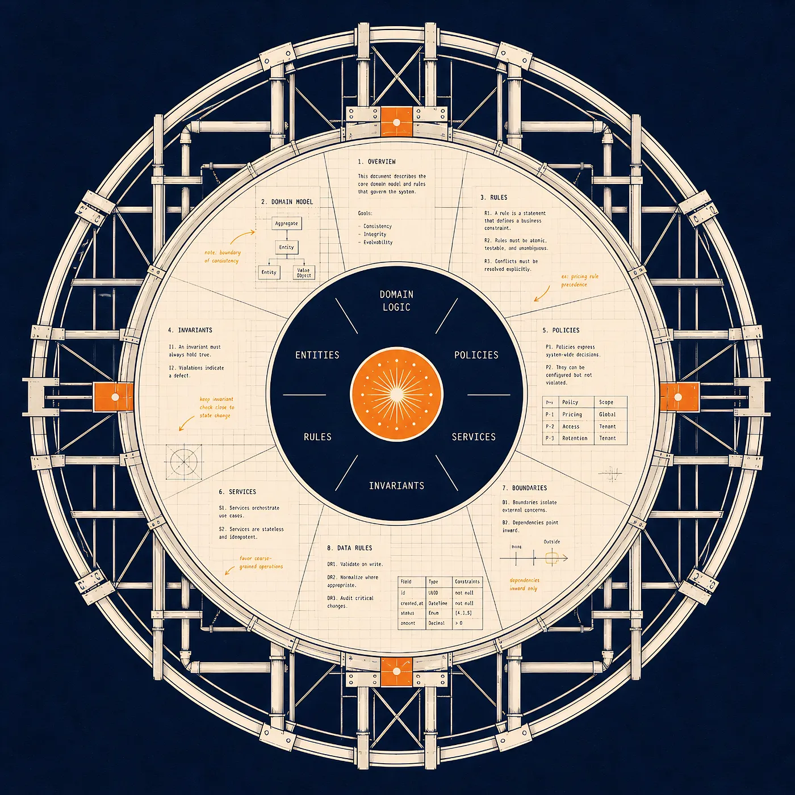
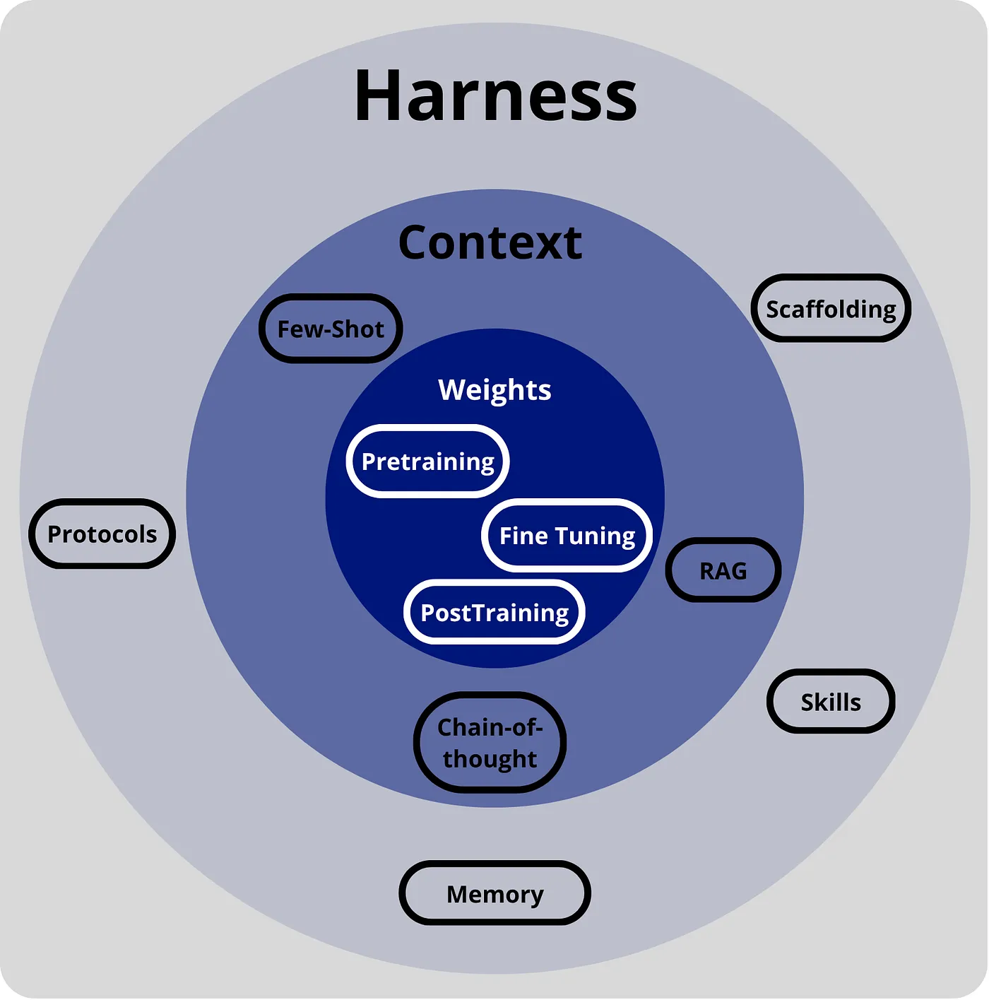
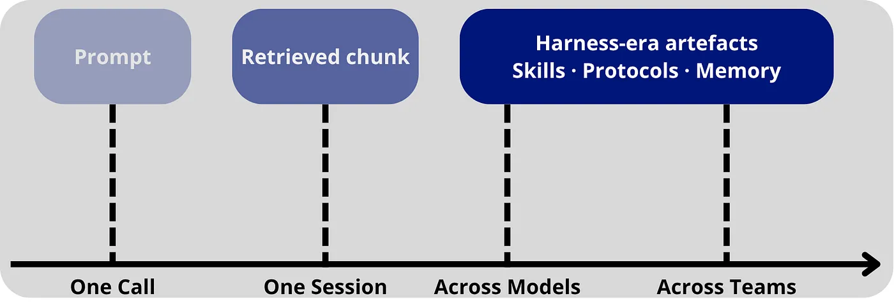

# Harness：企业被打造来迎接的时代

## Prompt engineering 奖励的是不受流程束缚的团队。Harness 奖励的恰恰相反——而企业过去几十年一直在不经意地构建它。

这是一个关于"终端用户如何把语言模型当作黑盒（我们只能控制输入什么、以及对输出做什么）来提升其性能"的故事。从最简单的做法，一路到提升模型性能的复杂变通方案。

*能力以三层的方式向外围绕着模型累积。每一层都添加了新的控制面，而不移除先前的——最外层正是 harness 所栖身之处。Image by the author.*

首先，我们对 prompt 进行 engineering，给模型一个具体的角色，让它在回答前 step by step 地思考，或者提供如何执行某个具体任务的示例，以提升其性能。

接着，我们对输入进行模板化，对我们作为上下文提供的不同组件、示例等使用变量。这是个绝佳机会，可以用语义相似度、关键词搜索和元数据过滤来自动检索上下文。

之后，我们开始在模型周围使用持久记忆、tool registry、sandbox、approval gate 和 orchestration 逻辑——并且把这一切都还叫做 "context engineering"，因为没人有更好的词。

但现在 prompt 本身只是众多影响模型性能的组件之一，其重要性在所有其他因素之下仍有争议。

> 用户控制向外迁移，进入了包裹着模型的运行时。我们只是当时还没给它命名。

[*Externalisation in LLM Agents*](https://arxiv.org/abs/2604.08224) 把整条轨迹归纳为一条单一的弧：能力一路被逐步重新定位——**从权重，到上下文，现在再到 harness**——也就是围绕着模型的那个持久运行时。harness 不是更花哨的 prompt 模板。它是把记忆、可复用的 skill 与机器可读的协议组织进一个受治理的、可检视的基础设施的地方。

> 把它想成商业航空。Weights 时代是飞行员的训练——他们知道的一切都活在他们的头脑和反射里，要升级他们，你得把他们送回飞行学校。Context 时代是飞行前的简报——同一个飞行员，但*这一趟*飞行的航线、天气、配载平衡是在登机口交给他的。Harness 时代是驾驶舱以及连到它上的一切：仪表、自动驾驶、ATC 链路、不论机长想不想都要大声朗读的 checklist、飞行数据记录器，以及地面的签派员。飞行员仍然在飞。但"安全飞行"早就不再是飞行员本身的属性了。它成了系统的属性。

> 如果这种重述是对的，那么我们就处于一个继 context engineering 之后的全新时代，Harness。

## 模型之外栖居着什么

### Weights → Context → Harness

我们可以把这份综述理解为三个不同阶段的演进。每个阶段都标记着：在某一时刻，领域把系统的可变智能放在了哪里。

注意每个阶段都是在前一阶段之上构建，而非取代前者，会向最终方程式中加入更多变量。

在 **Weights 时代**，能力栖居于模型参数之内。进展是参数量、训练数据和后训练偏好优化的函数。如果你想要不同的行为，你需要重新训练，那是适配模型的唯一方式。知识、流程、策略都被烤进同一个不透明的工件，没有办法在不冒险动其他东西的前提下更新其中之一。

**Context 时代**把控制移到了输入里。Few-shot 示例、chain-of-thought、ReAct 和 RAG 都表明：你可以不改变模型而改变其行为——通过改变模型在推理时所看到的内容。这就是大多数人说的"prompt engineering"或 "context engineering"。

一种解读是：它把一个"从权重中回忆"的问题转换成了一个"从上下文中识别"的问题。任务不再是记忆，而是提供能触发我们想要的知识的精确上下文。

> Context Engineering 是从 prompt engineering 出发的一种必要抽象，而 Harness 是下一个抽象。

**Harness 时代**沿用同样的逻辑，并沿三个更多的维度做了延伸。

-   **Memory** 把状态外部化跨越时间。agent 不再把历史塞进一个脆弱的 prompt，而是从一个持久存储中读取，并把内容写回去。
-   **Skills** 把流程性专业知识外部化。agent 不再要求模型在每次运行时都重新推导出工作流，而是加载一个显式的、可复用的工件来描述这类任务是怎么做的。
-   **Protocols** 把交互结构外部化。agent 不再使用自由文本的工具调用和临时的交接，而是填写有类型的 schema、遵循已声明的生命周期、并通过经过权限检查的接口路由。

harness 本身成为承载这三者的运行时环境，外加运营脚手架——agent loop、sandbox、人工监督钩子、可观测性、配置、上下文预算管理——它们让整个系统可检视、可治理。

*每一个时代都是延伸先前的，而非取代之。Weights 时代仍然存在于 Context 时代之内，二者都仍然存在于 Harness 时代之内——能力是向外累积的，而不是向内的。Image by the author.*

**这三个维度描述了什么被外部化；脚手架是那个让外部化对生产安全的运行时。**

综述识别出生产 harness 里有六个这样的设计维度。而下面这部分该让你坐直了：由不同团队独立构建的系统——OpenAI 的 Codex、Anthropic 的 Claude Code、Google 的 Gemini CLI——在本质上收敛到了同样的六个。

> 在那个层级上的收敛不是审美上的偶然。它是可靠运行一个 agent 的结构性必需。

### 同样的把戏，做得更耐久

外部化的故事没有第二条轴线就不完整：耐久性。

一个机智的 prompt 是只能存活一次调用的外部化。一段被检索的内容能存活一次会话。一个 skill 工件、一个协议契约或一条记忆记录能跨越调用、跨越会话、跨越模型——并且越来越多地——跨越团队而存活。Harness 时代的每个维度都不只是*在模型之外*；它是以一种能*持续*的方式在外面。

*外部化不是二元的。一个 prompt 存活一次调用；一段被检索的内容存活一次会话；一个 skill 工件、一个协议契约或一条记忆记录能跨越模型与团队而存活。harness 时代是耐久性时代。Image by the author.*

> 那次耐久性转变迫使第二次转变：从隐式到声明式。

Prompt 时代的控制逻辑是隐式的——它活在 prompt 工程师那天恰好写下的散文里。Harness 时代的控制逻辑是声明式的：权限、生命周期状态、schema、评估细则和 approval gate 都作为工件存储，可以被 diff、被版本化、被审计、被回滚。综述把这称为*externalised governance*（外部化治理）——曾经活在 prompt 散文或事后过滤器里的约束，现在被写成声明式规则，由 harness 在运行时强制执行。

> 回到驾驶舱。飞行员在巡航中临场吼出的一句话是隐式知识——对这一趟有用，落地之后就消失。同样这句话被写进航司的标准操作流程、传播到每一个驾驶舱、每次事故后被审计、在季度评审中被修订，就是声明式知识。同样的内容。不同的耐久性。不同的治理。完全不同的组织方式。

> *你没法对氛围做版本控制。你可以对一个 JSON schema、一份权限策略和一个 skill 文件做版本控制。*

那一句话就是 prompt 时代与 harness 时代的区别——并且它解释了为什么这场过渡对某些团队来说是别扭的、对另一些团队来说则是自然的。

## 翻转

prompt-and-context 时代奖励的是廉价迭代。prompt、retrieval 配方和工具描述可以比权重或正式生产工作流以更快的速度被改动。

赢下那段时期的公司，是那些能在午餐前尝试一百个 prompt 变体、敢于一念之间换掉一整套检索流水线、并把功能跑在一个 Vercel function 和一把个人 API key 上就能发布的公司。

更大的组织在同一时期被卡住了——不是因为他们的工程师更差，而是因为这种媒介不适合他们。他们真正的优势——成文流程、角色定义、审计轨迹、有组织的数据——无法被表达在一个 prompt 里。

一个合规清单不是一段 system message。一个变更控制流程装不进一个 few-shot 示例。让企业在 prompt 时代变慢的那些特征，也正是当时无处安放的那些特征。

> 柔软的表面偏爱内部逻辑也柔软的团队。

Harness 把这一切翻转过来。在结构上，一个 harness 看起来很像许多企业已经花了几十年打造的那种被治理的运营系统——而那三个外部化维度，恰好对应着大公司已经有的、产业级数量级的三样东西。

大公司已经拥有的产业级数量级的三样东西，直接映射到 harness 上：

-   **有组织的、被治理的数据 → memory。** 数据湖、知识管理系统、customer-360 存储。数据团队的工作已经很熟悉了：编目、访问控制、保留策略和检索质量。
-   **运营流程 → skills。** 平台 runbook、close-the-books SOP、供应商上手 checklist 以及客户支持升级协议。在结构上，这些*就是* skill 文件。它们需要的是转录，而不是发明。
-   **稳定的接口 → protocols。** API gateway、entitlement service、policy engine 与审计流水线。像 MCP、A2A、AP2 这样的标准并不是在要求企业发明一些新东西——它们是在要求企业把他们已有的东西以 agent 可读的形式暴露出来。

综述里的 HashiCorp Agent Skills 例子展示了这一模式的运作：一旦基础设施管理的底层接口通过协议契约被稳定下来，平台工程师们一直在维护的 runbook 就可以作为可移植的 skill 文件被外部化，而不再需要在每次 agent 运行时重新推导。稳定的运营接口是让可复用的 skill 能够存在的底料。

小团队当作护城河的那些特征——轻流程、快迭代、隐式知识——在 harness 层变成了负债，因为没有可外部化的东西。在位者过去被绊倒的那些特征——正式流程、有门禁的审批、有组织的数据、严格的变更控制——成了进入运行时的输入。

> harness 时代奖励的恰恰是 prompt 时代所惩罚的东西。

## 当模型变成便宜的那一部分

我们已经处在前沿模型的 plug-and-play 时代。在一个真正的 harness 里把 GPT 级换成 Claude 级、再换成 Gemini 级，系统照常运行。工具仍然被调用。schema 仍然被填好。记忆仍然被读和写。

证据就在主要实验室已经发布的东西里。Anthropic 公布了 Model Context Protocol，主要模型提供商——OpenAI、Google、Microsoft，等等——采纳了它。Anthropic 发布了 Agent Skills，作为可移植的、与模型无关的流程性工件。OpenAI 在 Codex 中、Anthropic 在 Claude Code 中收敛到了同样的结构性模式。跨厂商在六个 harness 设计维度上的收敛不是一个预测。它是对已经发生的事情的描述。

你目前还得不到的是性能保留。

系统能跑——它只是用某一个模型跑得比另一个更好。一个为某个模型的工具使用习惯调过的 skill 在下一个模型上表现不佳。一个在某个窗口尺寸上跑得很顺的检索 prompt 格式，在另一个窗口尺寸上就毛糙起来。

> 这不是 plug-and-play 的失败。它是一个 transferability gap（可迁移性差距）。

综述准确地把它命名了。transferability 问的是：当底层模型被替换时，同一份 harness 配置是否还保持*有效*——不只是兼容。兼容是 MCP、A2A 和共享的 skill 格式一直在回答的问题。有效性仍然开放，而下一轮 harness 工程就是在这里完成。

架构上的箭头是毫无疑义的。你把越多的能力推到 memory、skill 与 protocol 中，性能就越不依赖中间坐着的是哪个语言模型。harness 做得越多，可迁移性差距就缩得越小。

对一个企业而言，这就是 plug-and-play 实际买到的东西。模型层的厂商锁定从一种结构性承诺变成一种暂时的不便。跨模型层级的成本优化——前沿模型用于困难推理、更便宜的模型用于常规挑选——从一次重写变成一项运行时决策。合规姿态成为 harness 的属性，而不是基础模型在某个周二决定要做什么的属性。

Plug-and-play 已经发生了。有意思的前沿是 plug-and-play 而不需要为之付出代价。

## 外部化并不免费

外部化并不免费。综述对它的代价异乎寻常地清晰，其中三项代价值得在任何企业承诺之前摆到桌面上。

**认知开销。** 每一个额外的记忆层、API schema 或安全规则都施加延迟和推理开销。一旦超过某个阈值，模型花在协调模块上的力气就多于解决任务本身。Over-retrieval 用边际相关的轨迹淹没上下文。冗长的 skill 文件抢占同样的上下文预算。设计目标是有效的、效用为正的外部化——而不是最大化的外部化。一个在第一个决策问题之上又创造了第二个决策问题的 harness 已经丢了重点。

**扩大的攻击面。** 一旦认知与流程性负担被重新定位到外部工件中，那些工件就成了目标：

-   Memory poisoning 通过被腐化的情节轨迹悄悄扭曲未来的推理。
-   Malicious skill injection 把对抗性流程嵌入 agent 的可复用工具库。
-   Protocol spoofing——伪造的工具 manifest、被操纵的端点——在合法交互的伪装下导致未授权动作。

skill 文件和协议绑定是应用代码。要像对待应用代码一样对待它们：签名、评审、版本控制，并具备回滚路径。

**Skill 脆弱性。** 一个 skill 工件不是一个写完之后就保持稳定的自足模块。API 会漂移。工作流会演化。一个对上个季度的结账流程跑得漂亮的 skill，对这个季度的流程可能悄悄误导 agent。任何把 skill 当作"一次写、永远部署"的企业推广，都会付出昂贵代价重新学到这一点。

这些代价共有的模式正是这篇文章一直在围绕的那个。治理变成了基础设施。关键 skill 更新的强制评审 gate。记忆与 skill 变更的来源追踪。确定性回滚。跨模型替换的回归测试。这些不再是运营卫生，而开始成为 harness 本身的一部分——这恰好是企业已经知道怎么做的工作，也恰好是 prompt 时代的初创公司系统性回避的工作。

## 从哪里开始

如果外部化是正确的框架，那么招式就具体到可以开始命名。

**把现存的协议、runbook 与数据资产作为 harness 输入审计一遍。** 不要从零开始。每一个正式记录在案的流程都是一个候选 skill 工件。每一个类型化的 API gateway 都是一个候选 protocol 表面。每一个被治理的数据存储都是一个候选 memory 层。这次迁移大多是翻译，而不是发明。

**把 harness 当作长寿命系统看待，而不是模型。** 在任何严肃的推广完成之前，底层模型会换三次。harness 应该比它们所有都活得久。架构决策属于那一层会持久的层。

**从第一天起就为可迁移性而构建。** 测试每一个 skill、每一份记忆 schema、每一个 protocol 表面，至少要在两个模型后端上跑过。如果某个 harness 组件只在一个模型上工作，那它就是一件穿着 harness 时代外衣的 prompt 时代工件。

一个严肃的 harness 是一项投资——在人员、基础设施、治理工作以及跨多个模型后端的回归套件上。诱惑永远在那里：跳过它，去骑这个季度最便宜的前沿模型。那种诱惑是陷阱。没有 harness，公司的智能就活在别人的权重里。有了 harness，它就活在公司自己的协议、流程和数据里——而模型成为了你可以换掉的那一部分。

*同样的三层，中心现在变得可替换。一旦 harness 做的活儿够多，模型就成了你可以换的那一部分。Image by the author.*

三年来，我们一直在改善那个 reasoner。综述里被最低估的一段出现在结论中：更好的 agent 并不仅仅是更好的 reasoner——它们是被更好组织起来的认知系统。接下来三年关乎的是组织。已经花了几十年构建有组织的认知系统的企业，破天荒地，正好处在他们需要在的位置。

如果你喜欢这篇内容，你可能会觉得这些其他帖子也有用：

> **理解不应是只为专家保留的奢侈品。**  
> 我的目标是通过清晰、tutorial 风格的解释，让前沿 AI 与机器学习研究变得可及。
> 
> 如果这篇内容帮你把这个话题想得更清晰，用 **claps** 或 **subscription** 表示支持，真的能帮我把这份工作继续下去。
> 
> 永远欢迎你在 [**LinkedIn**](https://www.linkedin.com/in/fabio-yanez/) 上和我联系，我在那里以同样的精神分享更多写作和想法。
