# 预测墨尔本一家紧急护理诊所的日就诊量

## **我如何构建一个 XGBoost 预测流水线，把患者需求变成临床医生排班决策**


*作者生成的图片*

**作者注：** *本文使用独立创建的代码与合成数据进行示例。所述方法是许多应用领域中常用的标准预测与机器学习技术。*

*被防火墙挡住了？免费阅读本文* [***点这里***](https://hermanwandabwa.medium.com/d4ca30007991?sk=2b459f524ae72fe9eea37a9a96ea971a)

经营一家走入式紧急护理诊所有一个反复出现的运营头痛：要决定某一天该排多少临床医生。如果排得太少，候诊室就可能堵塞，患者会流向最近的急诊科 (ED)。反过来，你又得为不需要的医生工时买单，反之亦然。大多数诊所基于去年的数字、直觉和一点猜测来估算就诊人数，特别是在流感季前后。这正是我想在本文中解决的问题，我把紧急护理需求转化为某种实际可以预测的东西，按天进行预测，并附带一个排班经理可以据以制定计划的置信区间。

预测紧急护理需求和预测购物中心人流量不是一回事。例如，如果一个商场在周二少估了 50 个顾客，多半也不会怎么样。可能美食广场只是人手过多，或者预算受了点小冲击。然而在紧急护理中，预测错误的成本要重得多。人手不足意味着真正可能患病的人等候时间更长。反过来，人手过多会带来相反的问题，会烧掉本就利润微薄的诊所可能拿不出的钱。所以这不只是一次漂亮的预测练习，而是一个有实际后果的运营问题。

我围绕之构建的这家诊所是墨尔本的一家走入式紧急护理诊所，这座城市一如既往地很适合做这个练习，再说我也住在这里。墨尔本的健康需求驱动因素异常丰富，从维多利亚州的公共假日（在这些日子里 ED 通常会接收更多人，因为 GP 不上班），到南半球的冬季流感季。这座城市还经历 10 月到 11 月的花粉症窗口期，以及一些反常事件，比如 [2016 年雷暴诱发的哮喘](https://knowledge.aidr.org.au/resources/storm-thunderstorm-asthma-victoria/)，曾让全市的急救服务超负荷。

我把文章分成了两部分。Part 1（就是这一篇）*涵盖合成数据生成、特征工程、模型训练*和*评估*。Part 2 将涵盖部署：用 FastAPI 后端通过 REST 提供预测、为排班团队提供的 React + Tailwind 仪表板，以及用于把预测与真实结果对照记录的 Supabase 层。和往常一样，所有代码都开源在 [这里](https://github.com/wandabwa2004/urgent_care_forecast/tree/main/notebooks)。克隆下来并为你自己的诊所或场馆做改造。

### **1\. 问题以及为什么预测很重要**

走入式紧急护理诊所尴尬地夹在全科诊所和急诊科之间。它们处理那些不能等三天预约 GP 但又用不上救护车的诉求，例如扭伤、割伤、胸部感染、儿童发热、轻微骨折、伤后随访等等。这让它们的需求变得不稳定。例如，在一个典型的周二它们可能接待 90 名患者，而在复活节星期一数字可能达到 200，其中一半是因为常规 GP 因假日关闭的人。

一个被妥善思考过的预测模型把这件事预先量化下来。它应该能够输出一个数字、一个置信区间，以及一个排班经理可以真正依赖并据以行动的人员配备级别。有了这样的模型，问题从"*会有多少患者走进门？*"转向"*我们今天是需要低、中还是高级别的临床医生排班？*"让我们走一遍我构建的内容以及我是怎么做的。

### **2\. 数据集设计与模拟**

我没有真实的诊所记录的访问权限（即便有也不会公开发布）。所以我生成了一个反映墨尔本真实紧急护理模式的合成数据集。这有用不仅是因为隐私，还因为它让你能控制信噪比，并在方法应用到杂乱的真实数据之前干净地演示方法。

数据集跨越 2023 年 1 月到 2025 年 12 月，给出 1,096 条日记录。

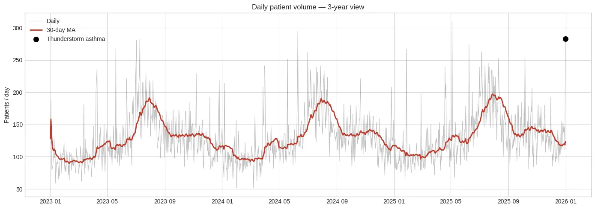
*随时间的每日就诊量*

浅色线显示原始的每日患者计数，红色线显示 30 天移动平均。平滑后的线让合成需求模式更易于解读：流感驱动的冬季高峰、来自花粉症的较柔和的春季上升、较安静的夏季月份，以及来自雷暴哮喘事件或热浪的偶发性尖峰。

每条记录捕捉以下内容：

-   **时间特征**：星期几、月份、季度、年中第几周
-   **天气**：温度（墨尔本特定范围）、降水 (mm)、相对湿度、天气类型（Sunny / Partly Cloudy / Cloudy / Rainy）
-   **日历事件**：维多利亚州公共假日、维多利亚州学校假期，以及关键的，公共假日*之后的那一天*
-   特征集还捕捉了关键的本地健康与天气驱动因素：以 7 月为高峰的冬季流感季、10 月到 11 月的花粉症季、罕见的雷暴哮喘事件，以及高于 35°C 或低于 5°C 的极端温度标记。

值得指出的是，这些驱动因素中有几个的效果与其他场景下*相反*。例如，下雨可能*减少*去娱乐场所的访问，但会*略微增加*紧急护理需求（滑倒、跌倒，以及不能再拖延胸部感染的人）。我花了不少时间在这些符号选择上，因为搞错了的话会产生一个看起来很合理、可以用来训练模型的数据集，但学到的关系是反的。这恰恰是一个表面上被验证过的模型在生产中给出糟糕排班建议的方式。

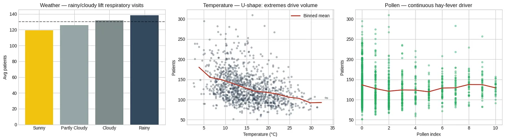
*天气与疾病驱动因素对就诊量的影响*

*左：按天气类型的日均患者数。雨天略高于晴天。中：患者数与温度。右：花粉指数与患者数，指数到约 7 之前是平的，然后急剧上升（花粉症到哮喘的路径）。*

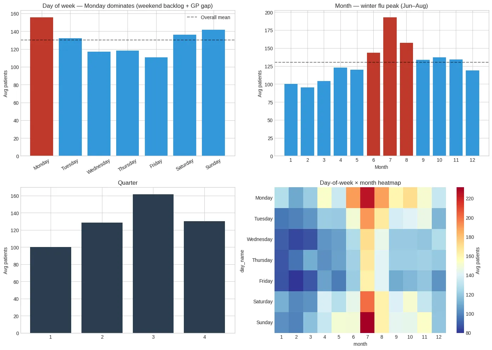
*就诊量的时间模式*

上面是同一个时间故事的四种视图。

这些图显示了强烈的日历效应。周一是最忙的一天，比周中水平高约 15%。7 月和 8 月是高峰月份，这与冬季压力一致，Q3 有最高的季度需求。在热图中，7 月的周一是最忙的星期—月份组合。

患者计数本身使用 [乘性因子](https://www.sciencedirect.com/topics/computer-science/multiplicative-factor) 在每日 100 名患者的基线上生成：

```
day_multiplier = {0: 1.15, 1: 1.00, 2: 0.95, 3: 0.95, 4: 1.00, 5: 0.85, 6: 0.75}
df['patients'] *= df['day_of_week'].map(day_multiplier)

season_multiplier = {
1: 0.85, 2: 0.90, 3: 0.95, 4: 1.00, 5: 1.10, 6: 1.30,
7: 1.45, 8: 1.35, 9: 1.15, 10: 1.10, 11: 1.05, 12: 0.90
}
df['patients'] *= df['month'].map(season_multiplier)

df.loc[df['is_public_holiday'] == 1, 'patients'] *= 1.40
df.loc[df['is_day_after_public_holiday'] == 1, 'patients'] *= 1.22
df.loc[df['is_school_holiday'] == 1, 'patients'] *= 1.15

df.loc[df['is_flu_peak'] == 1, 'patients'] *= 1.50
df.loc[df['is_hayfever_season'] == 1, 'patients'] *= 1.05
df.loc[df['is_thunderstorm_asthma'] == 1, 'patients'] *= 2.30

df.loc[df['weather_type'] == 'Rainy', 'weather_factor'] = 1.08
df.loc[df['temp_extreme_hot'] == 1, 'weather_factor'] *= 1.25
df.loc[df['temp_extreme_cold'] == 1, 'weather_factor'] *= 1.20
df['patients'] *= df['weather_factor']
```

每个因子在最终数据中都有可衡量、可验证的提升，下图对此做了量化。

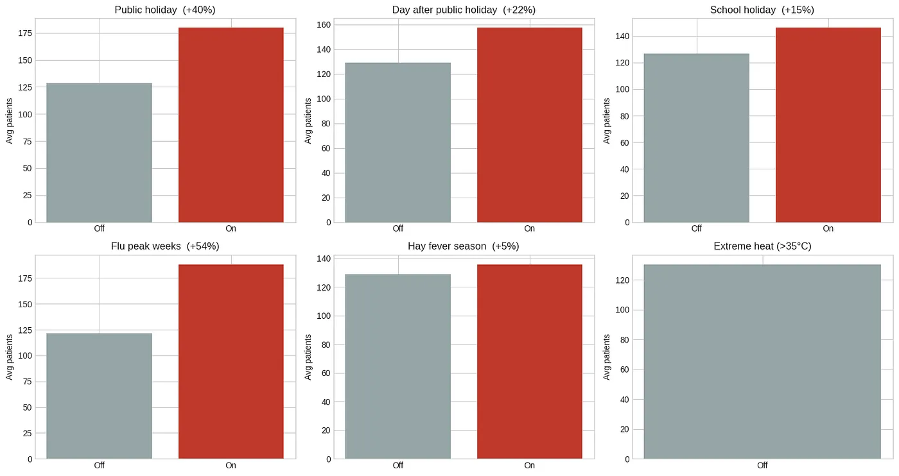
*关键因子对就诊量的影响*

每个面板比较了该因子激活与不激活时的平均患者数。流感高峰 (+54%)、公共假日 (+40%) 和公共假日之后的一天 (+22%) 占主导。花粉症季有一个小但稳定的提升 (+5%)。顺便说一下，并不是每一个花粉症日都会导致哮喘，但在整整两个月的窗口期里，影响是会累加起来的。

为了让合成的需求不那么完美乖巧，我加了高斯噪声，标准差等于预期日交易量的 12%，再加了 2% 的离群率（在这些日子流量飙到正常水平的 1.5–2.5 倍），以及大约 0.01% 的小幅每日增长趋势，以反映缓慢扩展的服务半径人口。最终值被裁剪在每天 30 到 500 名患者之间，这是单家走入式诊所一个现实的运行范围。请记住，这是模拟数据，**不应**作为真实诊所记录的替代品。

得到的分布具有事件驱动需求典型的右偏形状。大多数日子集中在 100–150 名患者，并有一个长尾，由流感季的工作日和公共假日尖峰组成，会推到 250 以上。

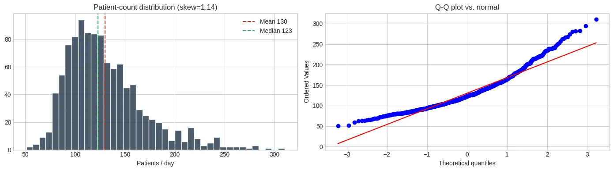
*原始患者计数的右偏分布*

直方图显示偏度 ≈ 1.14，均值高于中位数，并有一个可见的高就诊量日子的右尾。

### **3\. 特征工程**

我在之前的文章中讲过同样的观点，并会继续讲：原始数据给你基线预测，而特征工程后的数据给你好的预测。从 31 个原始列开始，我工程化了 87 个特征，分为八类：

```
Feature groups:
  Temporal    :  17
  Calendar    :   3
  Season      :   4
  Weather     :  11
  Epidemio    :   5
  Interaction :   6
  Lag         :  14
  Rolling     :  27
  Total       :  87
```

这里大多数技巧围绕循环编码、滞后特征和滚动统计，所以我会简要提一下，并在那些紧急护理领域特有的内容上多停留一会儿。

**a) 循环编码——*为什么第 0 天和第 6 天应该 "接近"***

这里又是时间特征的一个微妙问题。如果你直接把 *day\_of\_week* 作为 0 到 6 的值喂给模型，那么模型就会把周一 (0) 和周日 (6) 视为相隔很远，尽管它们其实是相邻的。月份也是同理。十二月 (12) 和一月 (1) 是接近的，不是相反的。

使用 *sin/cos* 变换的循环编码是对此最好的变通方法：

```
df['dow_sin'] = np.sin(2 * np.pi * df['day_of_week']/7)
df['dow_cos'] = np.cos(2 * np.pi * df['day_of_week']/7)
df['month_sin'] = np.sin(2 * np.pi * (df['month']-1)/12)
df['month_cos'] = np.cos(2 * np.pi * (df['month']-1)/12)
df['doy'] = df['date'].dt.dayofyear
df['doy_sin'] = np.sin(2 * np.pi * df['doy']/365)
df['doy_cos'] = np.cos(2 * np.pi * df['doy']/365)
```

最好的思考方式是假设你把每一天放在一张钟表盘面上。周一和周日彼此相邻，十二月紧挨着一月。*sin* 和 *cos* 两个分量都需要，因为单独的 *sin* 无法区分两个映射到相同 y 坐标的日子（例如，周二和周五可能有相同的 *sin* 值但不同的 *cos* 值）。

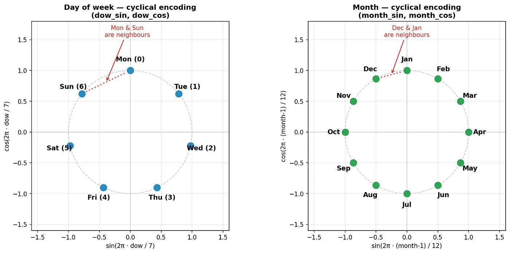
*循环编码*

左侧，星期几通过 *sin/cos* 被映射到一个圆上。右侧，月份在相同的圆形编码上。两个分量都需要，才能在圆上唯一标识每一个位置。

我把这个应用到了 *day-of-week、month、day-of-year* 和 *week-of-year* 上。

**b) 滞后特征——"昨天 *预测明天*"**

近期历史在这个数据集中是最强的预测信号之一。如果昨天有 150 名患者走进来，那么今天的数字更可能接近 150 而不是 80。我用一种让区间对应真实节律的方式复制了这一点：短期动量、每周周期、双周、月度，以及季节性。

```
for lag in [1, 2, 3, 7, 14, 21, 28, 60, 90]:
    df[f'patients_lag_{lag}'] = df['patients'].shift(lag)
df['mean_last_4_same_dow'] = df[['lag_7_same_dow','lag_14_same_dow',
                                 'lag_21_same_dow','lag_28_same_dow']].mean(axis=1)
```

如果你要问为什么是这些特定的区间？滞后 1–3 捕捉短期动量。滞后 7 捕捉同日上周的模式（这一点在这里极其重要，因为周一和周日表现非常不同）。滞后 14、21、28 捕捉双周和月度节律。滞后 60 和 90 捕捉季节性趋势。在紧急护理中，同星期均值尤其强大，因为它回答了一个临床上扎实的问题："*一个周一通常会有多少患者走进来？*"，这是一个和"*一个周日通常会有多少？*"非常不同的问题。这个数据集中的周一比周日高约 50%。

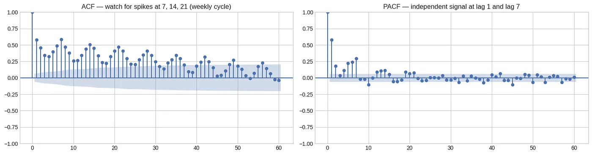
*自相关函数*

ACF 在 7 天的倍数处显示出显著的自相关（每周周期），以及一个较慢的衰减，持续到 60 天之外（季节性结构）。PACF 突出了滞后 1 和 7 携带最多独立预测信息，正好就是特征集中被优先考虑的那些滞后。

**c) 滚动窗口统计**

除了点状滞后之外，我还在多个窗口上计算了滚动均值、标准差、最大值和最小值，再加上指数加权移动平均：

```
for window in [3, 7, 14, 30, 60, 90]:
    df[f'rolling_mean_{window}d'] = df['patients'].shift(1).rolling(window).mean()
    df[f'rolling_std_{window}d']  = df['patients'].shift(1).rolling(window).std()
    df[f'rolling_max_{window}d']  = df['patients'].shift(1).rolling(window).max()
    df[f'rolling_min_{window}d']  = df['patients'].shift(1).rolling(window).min()
for span in [7, 14, 30]:
    df[f'ewma_{span}d'] = df['patients'].shift(1).ewm(span=span, adjust=False).mean()
```

`shift(1)` 至关重要，因为它防止数据泄露，确保我们只使用预测日期*之前*可用的信息。如果你搞错了，那你就把未来数据泄露进了训练，测试指标看起来会棒极了，直到模型进入生产并崩溃。EWMA 变体给近期观测更多权重，这有用，因为模式可能会逐渐变化（想想流感季开始时的爬升）。

**d) 交互特征**

在大多数情况下，紧急护理需求是由*组合*而不是单独因子驱动的。一个*流感高峰*期间的*雨天周一*与*二月*里的一个*晴朗周二*在本质上是完全不同的日子，即便你单独拆解每一个特征。我捕捉了最具临床合理性的组合如下，当然这可以按你的喜好扩展：

```
df['ph_x_monday']=df['is_public_holiday']*df['is_monday']
df['flu_peak_x_rainy']= df['is_flu_peak']*(df['weather_type']=='Rainy').astype(int)
df['hayfever_x_high_pollen']= df['is_hayfever_season']*(df['pollen_index']>=7).astype(int)
df['school_holiday_x_weekend']= df['is_school_holiday']*df['is_weekend']
df['extreme_cold_x_flu_season']= df['temp_extreme_cold']*df['is_flu_season']
df['day_after_ph_x_monday']= df['is_day_after_public_holiday']*df['is_monday']
df['illness_driver_count']=(df['is_flu_season']+df['is_hayfever_season']
                              +df['is_day_after_public_holiday']
                              +df['temp_extreme_hot']+df['temp_extreme_cold'])
```

`illness_driver_count` 特征捕捉一个简单的思想，也就是*在给定的一天有多少与疾病相关的因子被激活*。例如，有三个激活驱动因子的一天和有零个的一天在本质上是不同的，并且这种叠加几乎是单调的。

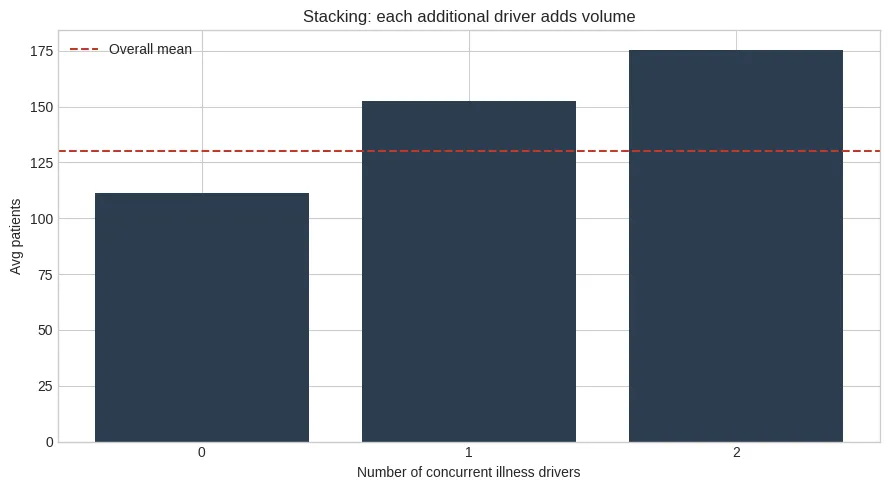
*按疾病驱动因子数量的平均患者数*

上图显示了清晰的叠加效应。没有疾病驱动因子的日子在 605 天里平均约 111 名患者，而有一个驱动因子的日子在 475 天里平均约 153 名患者。同时有两个驱动因子的日子很少见，在三年窗口期里只出现 16 次，但它们平均约 175 名患者。

**e) 墨尔本的季节**

这一点重要，因为墨尔本的季节模式相对于北半球城市是翻转的。12 月是夏季而非冬季，如果模型搞错了这一点，它的季节性假设就会指向错误的方向。

```python
def get_season(month):
    if month in [12, 1, 2]: return 'Summer'
    if month in [3, 4, 5]:  return 'Autumn'
    if month in [6, 7, 8]:  return 'Winter'
    return 'Spring'
```

在紧急护理中，季节对齐很重要，因为墨尔本的冬季月份，也就是 6 月到 8 月，直接映射到流感季。如果模型对季节性的编码错了，那么与流感相关的需求信号就会被稀释到日历的错误部分。

**f) 目标的对数变换**

原始数据中的患者计数是右偏的（偏度 ≈ 1.14），而 `log1p` 让分布更接近正态，这有助于基于梯度的模型收敛，并阻止它们以牺牲典型日子为代价过度加权离群日子：

```
df['patients_log'] = np.log1p(df['patients'])
```

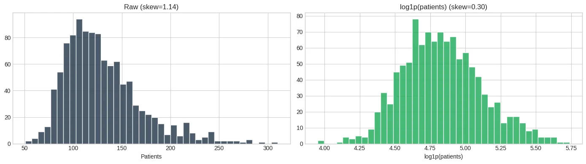
*对患者计数的对数变换*

左侧的图显示了原始目标分布，偏度为 1.14，并有来自高就诊量日子的清晰右尾。应用 `log1p` 之后，偏度降到 0.30，分布变得更接近正态。模型在这个变换后的目标上训练，然后预测在返回之前用 `np.expm1()` 转换回患者计数。我会在 Part 2 讨论生产 API 时再回到这一点。

在所有 87 个特征工程化完成之后，下一步是看哪些实际承载了相对于目标的信号。

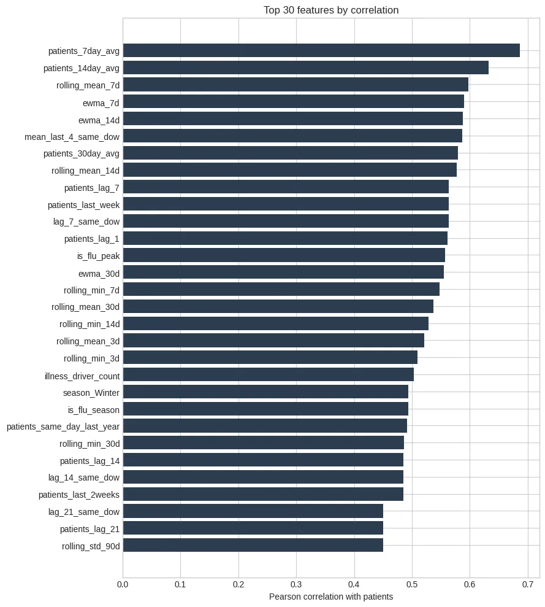
*与患者计数相关性排名前 30 的特征*

滚动 7/14 天的均值聚集在顶部（相关系数在 0.61 到约 0.69 之间），其后是 '*rolling\_mean7d*'。

最长的滞后特征回看 90 天，所以在特征工程之后头 90 行必须被移除。这留下了大约 1,006 个可用观测，足以用于模型训练和一个单独的 90 天 holdout 集。

### **4\. 模型训练与对比**

特征准备好后，我训练并对比了四种建模方法。在此之前，我需要把分割策略搞对。

**Train/Test 分割——尊重时间**

对于时间序列数据，随机的 train/test 分割效果并不好。如果你打乱日期，模型可以从未来的模式中学习，却在更早的模式上被评估。那就是数据泄露，会让指标看起来比实际更好。

我保持了按时间顺序的分割，最后 90 天作为 holdout 测试集，之前的一切都用于训练。

```yaml
Train: 915 rows (2023–04–01 → 2025–10–02)
Test : 90 rows (2025–10–03 → 2025–12–31)
```

对于交叉验证，我使用了 `TimeSeriesSplit`，采用五个扩展窗口的 fold。每个 fold 只在过去数据上训练，并在未来数据上验证，让评估与模型在实际中被使用的方式保持一致。

**模型**

在伸手去拿更复杂的算法之前，我先从朴素基线开始。这些是依赖算术而不是学习到的模式的简单预测策略。如果一个更复杂的模型不能击败它们，那它就配不上它的复杂度。

我用了三种朴素基线，每一种都比上一种稍微更有信息一点。

-   **全局均值：这** 把每一天预测为训练集均值，约为 130 名患者。它忽略一切，包括星期几、天气、流感季和公共假日。这是"耸肩"预测，但它锚定了性能范围的下端。
-   **上周计数 (lag 7)**：用上周同一天的计数来预测今天的就诊量。它捕捉到一个每周节律，但仅此而已。这意味着它无法适应流感高峰、天气变化、学校假期或公共假日。
-   **7 天移动平均**：把今天的就诊量预测为过去七天的平均。它比 lag-7 基线更平滑，但对于*为什么*需求在变依然是盲的。它跟随近期漂移，但不理解背后的驱动因素。

这三者共有的局限是它们都使用单一信号，无法组合信息。*一个有雷暴哮喘警报的、学校假期里的晴朗周六*和*二月里一个下雨的周二*完全不同，而这些基线都看不出区别。这就是 ML 填补的空隙。

我针对这个问题用了三种建模算法。

1.  **Random Forest** 使用了 300 棵决策树，每棵树都在数据的一个随机切片和一个特征的随机子集上训练，使用 `max_features='sqrt'`。单棵树可以学到诸如 *"如果是周一、流感活动很高、温度低于 10°C，则预期更高的就诊量。"* 这样的规则。最终预测对所有 300 棵树的输出取平均，平滑了任何一棵单棵树的怪癖。我还设置了 `min_samples_leaf=5`，以阻止树记住小片噪声。和其他基于树的模型一样，Random Forest 在对数变换后的目标上训练。
2.  **XGBoost** 的工作方式不同。它不是独立地长出树，而是按顺序构建它们。每一棵新树聚焦于前面那些树留下来的误差。简单来说，Random Forest 平均许多独立的树，而 XGBoost 一棵接一棵地构建树，每一棵树追逐剩下的残差。我用了 500 棵树，学习率为 `0.05`，意味着每棵树只做一个小的修正。这通常需要更多的树，但能产生一个更稳定的模型。我在 `log1p(patients)` 上训练 XGBoost，让高就诊量的日子不会主导损失函数。
3.  **Prophet**（Facebook 的时间序列模型）采取一个不同的视角。它不是依赖手工构建的特征，而是把时间序列分解为趋势、季节性和假日效应，然后直接拟合那些组件。我使用乘性季节性，让季节波动可以随着需求的基线水平缩放。我还加入了公共假日、流感高峰、花粉指数和天气作为外部回归变量。

下面是 XGBoost 训练块。

```
xgb_model = xgb.XGBRegressor(
    n_estimators=500,
    learning_rate=0.05,
    max_depth=6,
    subsample=0.8,
    colsample_bytree=0.8,
    min_child_weight=5,
    reg_alpha=0.1,
    reg_lambda=1.0,
    random_state=42,
    n_jobs=-1,
    verbosity=0,
)

xgb_model.fit(X_train, y_train_log)

xgb_preds = np.expm1(xgb_model.predict(X_test))
```

其他两种方法的代码可以在 [这里](https://github.com/wandabwa2004/urgent_care_forecast/blob/main/notebooks/04_modeling.ipynb) 找到。

### **结果**

XGBoost 在所有指标上都给出最好的结果。它 11.89% 的 MAPE 意味着，在平均约 130 名患者的一天里，预测误差大致是 15 名患者。重点不在于模型每一天都预测得很精确，而在于它提供了一个足够可靠的信号来支持人员配备决策。

```
| Model                | MAE   | RMSE  | R²    | MAPE   |
| -------------------- | ----- | ----- | ----- | ------ |
| XGBoost              | 17.04 | 27.69 | 0.30  | 11.89% |
| Prophet              | 17.98 | 28.98 | 0.23  | 12.84% |
| Random Forest        | 18.34 | 29.35 | 0.21  | 12.91% |
| Baseline (7d MA)     | 22.93 | 32.36 | 0.04  | 17.18% |
| Baseline (mean)      | 24.04 | 33.04 | -0.00 | 18.06% |
| Baseline (last week) | 24.09 | 35.87 | -0.18 | 17.22% |
```

相对于基线的改进是显著的。最好的基线（7 天移动平均）有 22.93 名患者的 MAE，而 XGBoost 达到 17.04，误差减少 26%。MAPE 从 17.2% 降到 11.9%，这个差距就是有用的预测与有根据的猜测之间的差距。

关于这些数字有两点值得指出：

-   上周基线的负 **R²** 不是 bug**。** 它只意味着这个基线在这个测试集上的表现实际上*比*预测常数均值*更差*。基线并不被保证能击败常数均值，这也是它们作为校准期望的工具有用的部分原因。
-   约 0.30 的 R² 看起来不高，但那部分是信噪比问题。日均紧急护理量有大量短期变化是日历、天气和流行病学特征无法完全解释的。MAPE 在这里更有用，因为它衡量预测中典型的百分比误差。在 11.9%，它更清晰地反映了模型对于排班是否有用。

在测试数据上，实际值与预测数字如下：

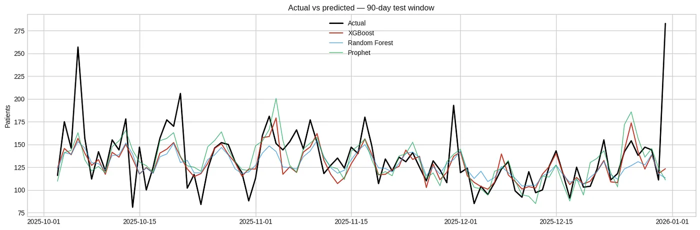
*实际与预测的患者计数*

XGBoost 最贴近地跟踪观察到的序列，既捕捉到每周周期，也捕捉到年末流感的爬升。Random Forest 跟随整体形状，但低估了峰值需求。Prophet 捕捉到广泛的季节性运动，但平滑掉了短期变化，因为它更依赖分解后的趋势和季节性，而不是基于树的模型所使用的工程特征集。

### **5\. 模型评估与 SHAP 可解释性**

原始指标告诉你模型*表现得怎样*，而评估告诉你*它在哪里挣扎、为什么挣扎*，而那才是在你决定是否信任它时真正重要的部分。

**残差分析**

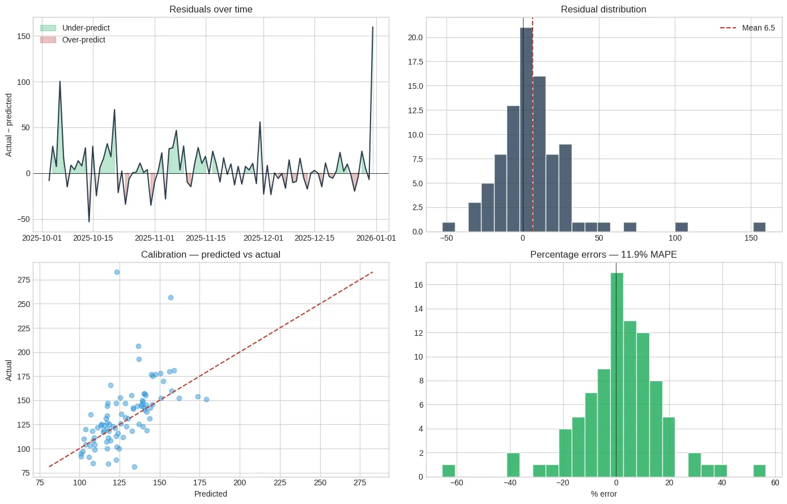
*残差分析*

总的来说，残差看起来是合理的。它们大致围绕零中心，在 holdout 期间没有明显的基于时间的漂移。预测对比实际的图相当好地跟着对角线，尽管模型仍然在某些最高就诊量日子上低估了需求。大部分百分比误差落在约 ±20% 之内，并有轻微的负偏。

模型有一个每天约 6.5 名患者的小幅负偏差，意味着它倾向于稍微低估需求，这在排班中至关重要。人手不足比适度的人手过多风险更大，因此生产流水线不应把点预测当作最终的人员配备数字。一个更安全的做法是接近 80% 预测区间的上界来排班。

**SHapley Additive exPlanations (SHAP) 可解释性**

我用 SHAP 来理解是什么在驱动模型的预测。这点重要有两个原因。首先，它帮助检查模型是否在依赖临床上合理的信号而不是虚假模式。其次，它给了我一个具体的方式，当临床主任和排班经理问模型为什么预计需求上升或下降时向他们解释预测。

```
explainer = shap.TreeExplainer(model)
shap_values = explainer.shap_values(X_shap)
shap.summary_plot(shap_values, X_shap, plot_type='dot', max_display=20)
```

排名靠前的特征与临床医生预期的一致：

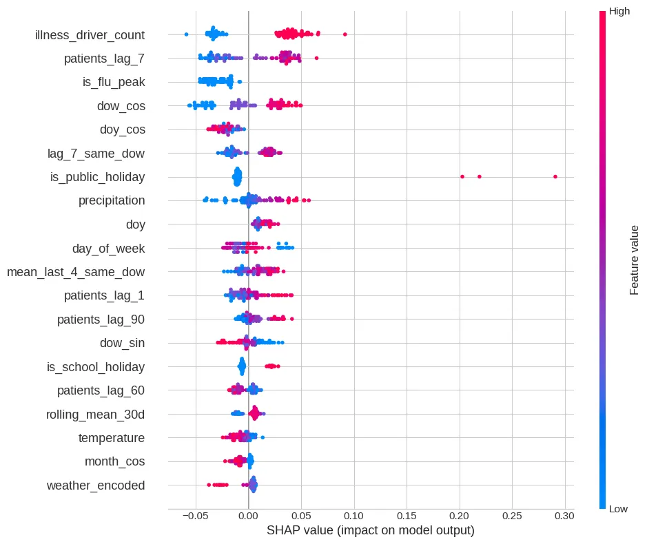
*SHAP 值*

上面这张图是一张 SHAP beeswarm 图，展示了每个特征在 holdout 集上如何把预测推高或推低。每一个点代表那个特征的一次观测，按特征值着色，红色表示更高的值，蓝色表示更低的值。`is_flu_peak`、`illness_driver_count` 和 `patients_lag_7` 主导排名顶部，表明模型严重依赖流行病学压力和近期需求。滞后和滚动窗口特征也贡献明显，但它们在排名上靠后。

我还为最差预测日生成了一张瀑布图。这是那种当一位临床主任问"*为什么模型把昨天预测得这么糟糕？*"时你想准备好的图。它把预测拆解为特征层面的贡献，显示哪些信号把预测推高或推低，以及推了多少。

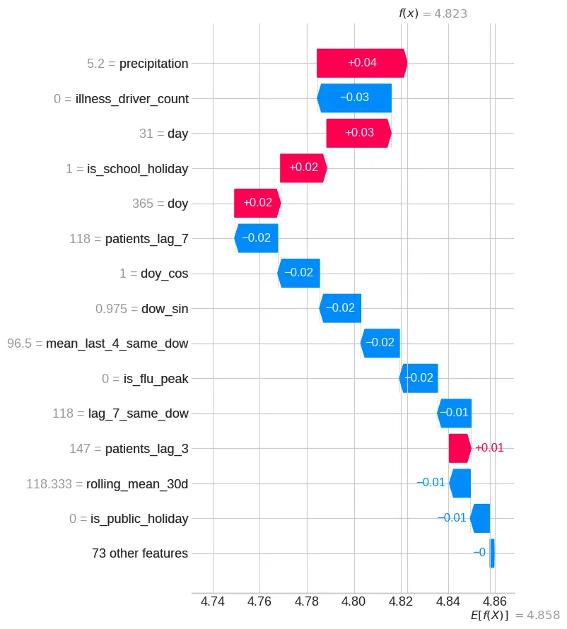
*对最差预测日单次预测的解释*

这点重要，因为不是每个糟糕的预测都有相同的原因。有时候模型错过是因为发生了特征集之外的事情，比如附近 GP 关闭、一起交通事故，或其他本地干扰。其他时候，模型可能面对的是它在训练期间没怎么见过的稀有特征值组合。瀑布图帮助区分这两种情况。

**预测区间**

仅有一个点预测是不够的。排班经理需要知道不确定性的*范围*，这就是我用训练残差计算 bootstrap 预测区间的原因：

```
np.random.seed(42)
n_bootstrap = 500
base_pred = test['pred'].values
bootstrap_preds = np.array([
    base_pred + np.random.choice(cv_resid, size=len(base_pred), replace=True)
    for _ in range(n_bootstrap)
])
lower_80 = np.percentile(bootstrap_preds, 10, axis=0)
upper_80 = np.percentile(bootstrap_preds, 90, axis=0)
lower_95 = np.percentile(bootstrap_preds, 2.5, axis=0)
upper_95 = np.percentile(bootstrap_preds, 97.5, axis=0)
```

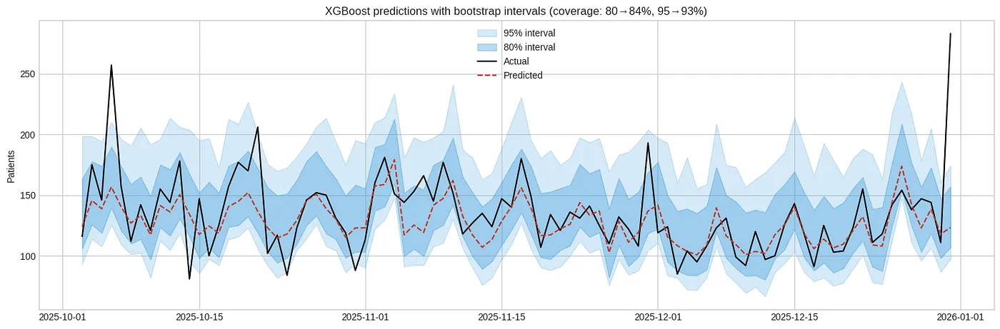
*带 Bootstrap 区间的预测*

红线显示模型的预测，黑线显示实际患者计数。较深的带表示 80% 预测区间，较浅的带表示 95% 区间。实际值大致以预期的比率落在这些带内，这表明不确定性估计是相当好校准的。

对一个排班经理来说，这比一个单一数字更有用。模型不是说"*我们预测明天 145 名患者*"，而是可以说"*我们预测明天 145 名患者，80% 预测区间为 113 到 177*"。这给了经理一个规划区间，而不是一种虚假的精确感。

但有一个注意点。这个 bootstrap 方法假设残差是从所有条件下相同的误差分布中抽取的，这不太可能是真的。公共假日、流感高峰和异常需求日的误差可能比安静的工作日更宽。一个更精细的版本会估计条件特定的区间，但对于第一次部署来说，这给出了一个有用且诚实的不确定性范围。

### **6\. 利益相关者参与**

凭经验，MAE 和 RMSE 单独看对临床主任或排班经理来说意义不大。它们是有用的建模指标，但并不直接回答运营问题：*我们明天应该排多少人？*

所以我用两种更实用的方式来呈现模型输出。

**人员配备级别分类**

除了返回原始的患者计数预测外，模型还可以把每一天分类为一个直接映射到排班规划的人员配备级别。具体的阈值应该由临床运营团队来定义，但一个简单的示例可能像这样：

```
Low (<80 patients): 2 doctors, 3 nurses, standard roster 
Medium (80–150): 3 doctors, 4 nurses, extra triage nurse 
High (>150): 4+ doctors, surge protocol, ED overflow coordination
```

这让预测更容易付诸行动。每一个级别都有具体的人员配备含义、成本含义和临床风险含义。排班经理不再需要孤立地解读患者计数的差异。他们可以把模型输出当作一个直接绑定到人员配备决策的规划信号。

**运营影响**

真正的价值不只是更低的 MAE。是更好的排班决策。如果模型把需求级别搞对了，诊所就能避免在安静的日子里把钱浪费在不必要的人员上，并降低在需求尖峰期间人手不足的风险。

这才是临床主任能用上的版本。不是说"*模型的 MAE 是 17 名患者*"，更好的说法是："*我们大约有 8 天能识别正确的人员配备级别，并能在排班锁定前给你一个 80% 的预测区间。*"

这就是 Part 1 完结了，我很抱歉承认它写长了。我保证（和我过去做过的一样），Part 2 会短得多、也更直观。我们已经从拆解业务问题走过数据生成、特征工程、模型训练、评估和利益相关者呈现。带 87 个工程特征的 XGBoost 模型达到了 11.9% 的 MAPE，并产生了校准良好的预测区间，可用于排班决策。我基本上已经为你提供了一个框架，你可以把你的代码和数据塞进去并预测结果。

在 Part 2 中，我会把这个训练好的模型部署为一个全栈应用：一个通过 *REST API* 提供预测的 *FastAPI* 后端、一个面向利益相关者的 *React + Tailwind* 仪表板，以及可能用于把预测与实际值对照记录的 Supabase 数据库，这样我们就可以回填真实结果并监控漂移。我也会涉及部署考量，以及在真实诊所数据上我会做哪些不同的处理。如果你想要一篇关于把预测数字优化到实际人员配备水平的文章，告诉我一声。

和往常一样，所有代码都开源在 [这里](https://github.com/wandabwa2004/urgent_care_forecast/tree/main/notebooks)。欢迎克隆并为你自己的用例做改造。如果你觉得这有用，请点赞、留言，或分享给从事预测或运营 AI 的人。你总能在我的 [个人主页](https://medium.com/@hermanwandabwa) 找到我的其他文章，我也总是乐意通过 [LinkedIn](https://www.linkedin.com/in/wandabwaherman/) 联络。
