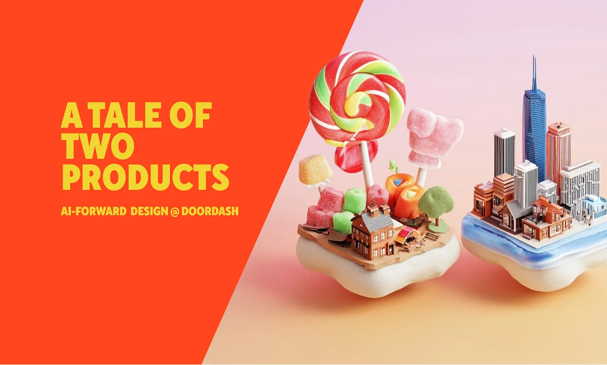
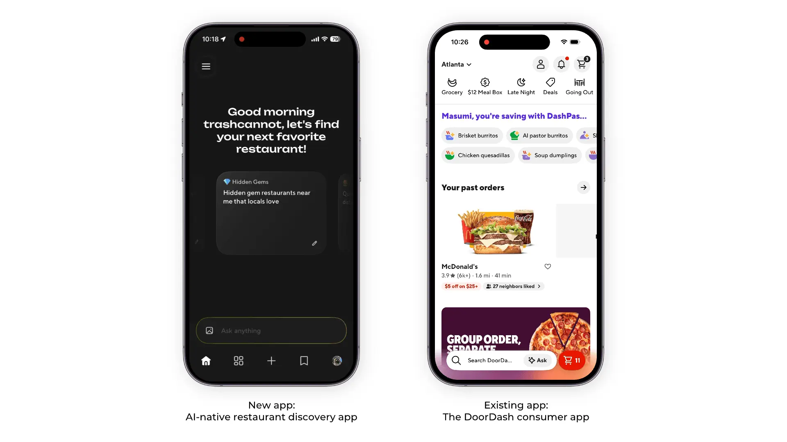
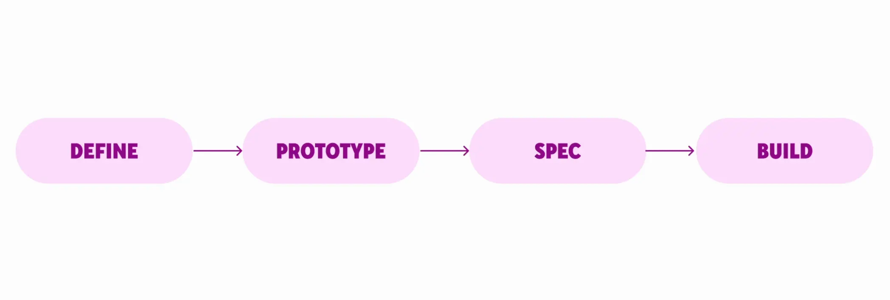
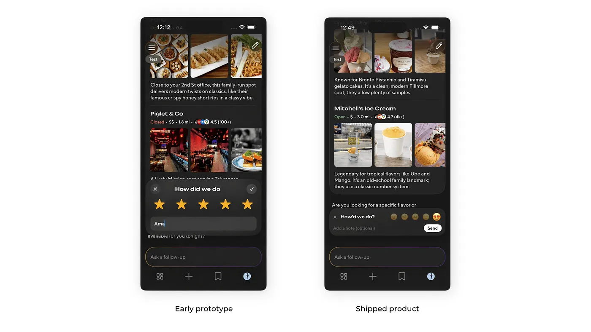
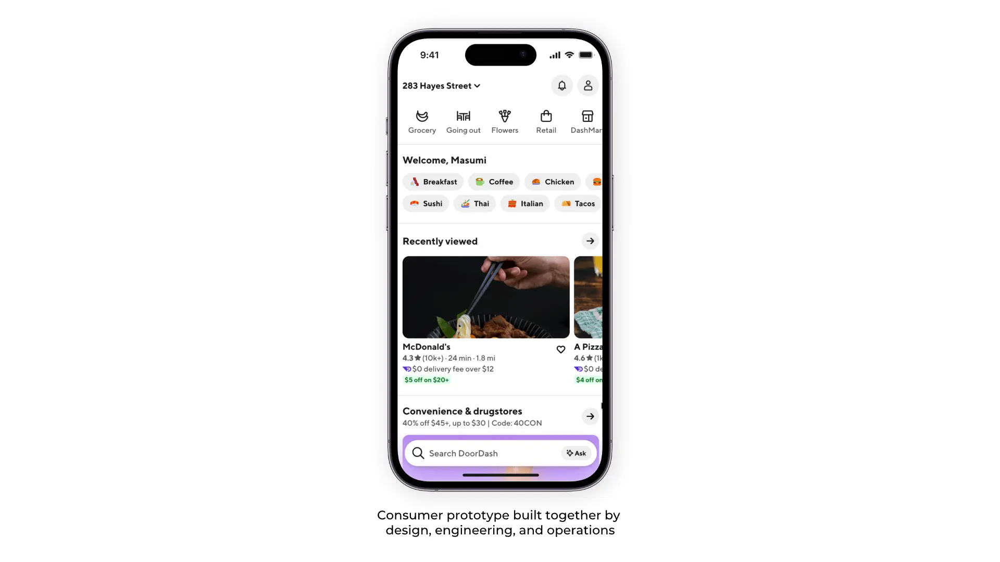
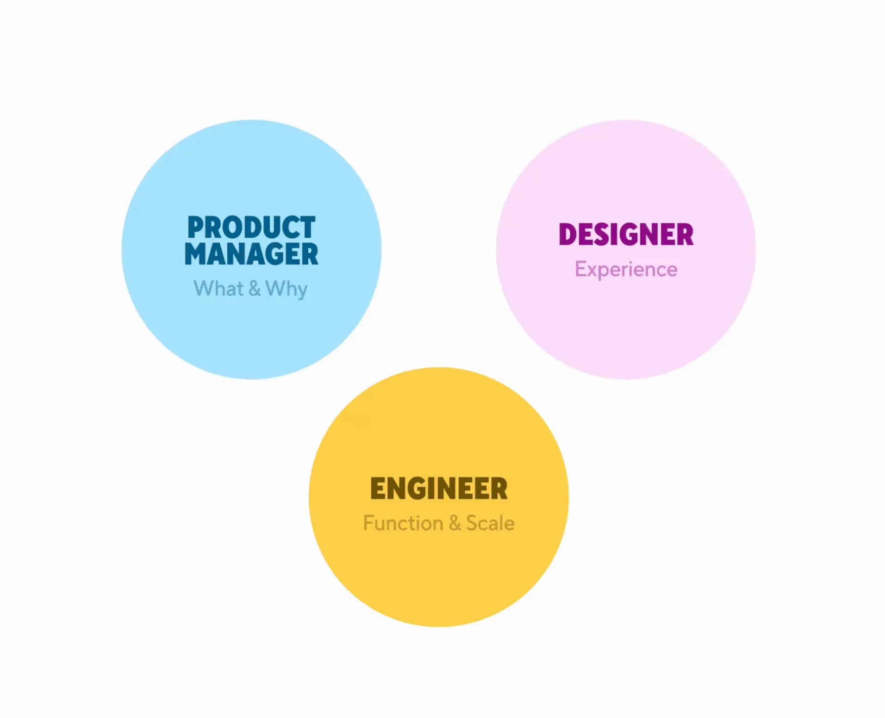
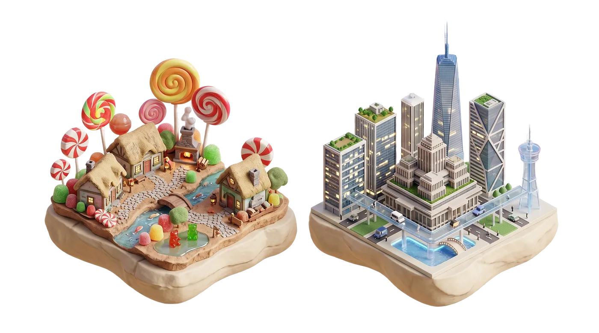

# 两支团队，一次转向：AI 如何重塑我们的产品设计流程

## *当 AI 能造出一切时，设计师究竟该做什么？*

*合著者：Masumi Matsumoto——首席设计师，Ruolan Xia——资深设计师，Qixing Zheng——高级设计经理。*

*本文是我们 AI-Forward 系列的一部分，在该系列中我们探索 AI 如何塑造 DoorDash、Deliveroo 和 Wolt 的设计文化、技艺与影响力。*

随着 AI 在"造一切"上越来越强，设计师工作里哪一部分变得更重要，哪一部分变得不那么重要？过去一年，DoorDash 的两支团队一直在探索这一概念。在本文中，Qixing 将把两个案例研究串起来，讲讲产品开发流程是如何转变的、观察到了哪些新模式、做了哪些实验、又有哪些问题尚未解决。

Ruolan 的团队搭建了一款 AI 原生的餐厅发现 App，没有遗留代码，没有现有用户。反过来，Masumi 的团队负责 DoorDash 核心的消费者体验：庞大的代码库、百万级用户、处处掣肘的生产环境约束。两支团队都没有被要求改变流程——他们各自独立地改了，最后却落到了相似的位置。他们没有聚焦于 AI 的能力，而是**改变了设计师的日常工作方式，借助 AI 驱动的新方式来构建产品。**

## **流程的转向**

旧的设计流程是线性的：定义问题、在 Figma 中探索方案、打磨规范、交付给工程团队、上线。每一步都有不同的负责人和明确的交付物。这种模式来自一个观念：构建是昂贵且缓慢的，所以重活儿应该在设计阶段完成，确保在有人写代码之前就把方案做对。

**AI 打破了这个观念。**

当每个人都能构建时，你会得到大量逼真的快速原型；PM 在写 PRD 之前就先做原型，设计师把生产代码推上去。旧的交接模式已经不再描述实际发生的事情。**原型设计成为新的设计阶段**——现在它与构建相互重叠——让整个流程变得更快、更流畅。

## **从概念到代码**

在 AI 餐厅发现 App 上，**想法直接从概念变成可交互的东西，** 没有中间步骤。Ruolan 不是把视觉稿交给工程师，她是在写生产代码。她的设计搭档 Elisha 与工程师结对编程做功能，并在 20 分钟内和一位 S&O 搭档一起搭建了一份反馈问卷。PM 对的是正在运行的原型，而不是静态产物，工作变成了共享且非顺序的。

消费者 App 团队得出了同样的洞察：原型，而不是静态视觉稿，才是现在的设计产物。但要在这么大的代码库里走到这一步，需要不同的做法。Masumi 帮助她的团队转向了"原型优先"的设计流程。她创建了 **Starter Dough**，一个为团队准备的、带数据钩子的模板化原型 GitHub 仓库。它立即被整个团队所采纳：UX、PM 和工程。Social PM Sean Huang 经常以 Starter Dough 原型作为概念构思的起点，设计师 Rachel He 接着加入，打磨 UI 与交互。消费者团队把这称为"边做边设计"（designing-as-making）。

## **当构建变快时，方向成为瓶颈**

当各个方向、同一时间都涌来逼真的原型时，执行端的洪流是真实存在的。设计师的角色似乎也随之转变，花更少的时间在产出打磨过的交付物上，更多的时间在提供品味与方向：这些原型里哪一个值得继续做？我们该达到什么样的质量标准？什么时候该从探索转向投入？

这就是事情变得棘手的地方。如果没有清晰的设计原则和评估标准，团队就有可能丢掉"我们到底在解决什么问题"这条主线；瓶颈不再是"我们能不能快到把这个做出来？"，而变成了"我们做的是对的事情吗？"

***有帮助的做法：*** 定义谁拥有决策权，而不是谁拥有构建权。我们很早就为每个项目指定了一位"决策负责人"，与做原型的人区分开来。任何人都可以构建，但需要有人来定方向。

## **原型是新的设计产物——但要小心速度陷阱**

当连粗糙的原型都是可交互且打磨过的，旧的"低保真到高保真"设计保真度光谱就崩塌了。一个跑在你手机上的代码原型看起来像最终成品，但其实它只是这个想法的第一份"草稿"。除此之外，多人会一起在同一个原型上工作，让它不断演化。

例如，在 AI 餐厅发现 App 上，Ruolan 的团队使用 Midjourney 在数小时内生成营销网站的视觉方向，而不是数天。Elisha 基于这款 AI App 的 iOS UI 创建了一个 web view 版本（整个过程现在用一条写得好的 prompt 就能一次搞定！）。在消费者 App 上，设计师 Wes Anderson 使用 Starter Dough 库构建首页原型，Ops 搭档 Ishaan Amin 对用户分层进行了建模，后端工程师 Scott Swarthout 接入了实时数据。三个角色，一份产物，一起搭建。

但速度同时也是陷阱——两支团队都发现自己在实时回应每一条反馈、围绕一个人的反应做迭代，并因此丢掉了对原始问题的视线。你必须保持对目标的有意识把控，才能决定哪些事情不做。

***有帮助的做法：*** 像以前对待设计探索那样对待原型：生成很多，按清晰的标准评估，砍掉那些不配留下来的，并且把反馈攒在一起处理，而不是对单个评论一一回应。团队也转向了结构化的 demo 检查点（一周两次，而不是临时的），这样大家在迭代之间有时间思考。设计师的品味与判断在这里更重要，而不是更不重要，包括能说出"我们还没准备好迭代"的能力。

## **三类原型**

原型可以归为三类：

1.  **探索型原型（Exploration prototypes）：** 一次性原型，用于想法生成和早期对齐。
2.  **生产型原型（Production prototypes）：** 基于真实的设计系统和平台组件构建。可以被加固并上线。
3.  **混乱中段原型（Messy Middle Prototypes）：** 它们看起来像真的，但结构上无法上线。数据依赖、后端复杂度、代码上的取巧。这是团队浪费时间最多的地方，所以应当避免。

在 AI 餐厅发现 App 上，Ruolan 的团队在做不同功能时，大多以生产代码作为原型的起点。3 月初，团队在仅一周的时间约束下进行了一次重大改版。Ruolan 贡献了超过 1,000 行代码：浅色与深色模式、用语义化颜色替换硬编码值、修复视觉不一致。这些工作不是作为一个大 PR 上线，而是被拆成更小的改动持续 review 后陆续上线。

消费者 App 团队把这映射到一组与意图匹配的工具光谱，在速度（保持心流）与真实感（原生代码与实时数据）之间做平衡：

-   **Figma + Make** 用于无代码的快速视觉，适合早期探索型原型。
-   **Web 原型**搭配 Starter Dough，用真实数据做逼真迭代。
-   **原生代码**用于对生产 App 的直接改动，适合已经定稿的设计。

团队还在调研"mini-apps"——消费者 App 中隔离出的切片，用于快速做原生原型。还有上生产的代码：今天，DoorDash 的设计师每周提交数百次 commit。像 Josh Woods 这样的工程师已经构建了工具，帮助设计师识别出他们可以直接做的 UI-only 改动。

***有帮助的做法：*** 早早给原型命名意图。"这是用来探索的，不要对代码产生依恋"，或者"这是要上线的，让我们把它好好建起来"。当某个东西落到混乱中段时，诚实的对话是：重写还是清理？把意图说清楚。这是探索性的，还是要规模化的？这种清晰度决定了要投入多少、要保留什么。

## **每个人都是制造者。角色围绕判断而清晰化。**

当每个人都能构建时，你会以为角色会变得模糊。实际上，它们反而更清晰了，不过是围绕判断，而不是技艺执行。

**PM 拥有"这有价值吗"**——我们在做什么、为什么做。

**Design 拥有"这令人向往吗"**——品味、技艺、体验质量。

**Engineering 拥有"这可靠吗"**——上线产品的技术质量与可扩展性。

在 AI 餐厅发现 App 上，主导模式是设计师主导的构建，再由工程师后续加固。新手引导流程直接在代码中做原型，与一位后端工程师结对编程，测试真实的交互，而不是近似情形。在消费者 App 上，一位 PM、设计师、Ops 搭档和工程师在同一个首页原型上实时一起工作。正如 Masumi 所说：当所有人都在看同一份代码时，顺序式的交接就消解了。

如你所见，构建这一部分日益共享。但**每个角色带来的判断比以往任何时候都更重要，** 因为当你能在过去做一件事的时间里做出十件事时，你决策的质量就是把好的团队与"快但迷失"的团队区分开来的东西。

## **我们还在摸索的事**

我们还有很多事情仍在摸索。Figma 既是一个设计工具，也曾是一个 review 工具，当工作转移到代码时，你就失去了那个共享的界面。我们尝试过 GitHub Pages、Loom、频繁的 demo 会议。组合起来管用，但其中没有任何一个像 Figma 的评论线那样流畅。

总结来说，设计师如何保持不可替代，答案不是"去学编程"。答案是在那些 AI 做不到的事情上变得更敏锐：设定方向、维护一致性、在模糊中做品味判断、知道什么时候停止构建、开始做决定。

我们这里描述的是一个快照，希望你觉得有用。如果你的团队也在经历类似的事情，我们很想听听你看到了什么。哪些有效？哪些让你意外？哪些崩了？

