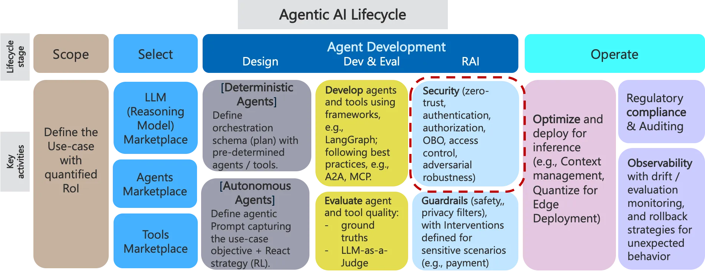
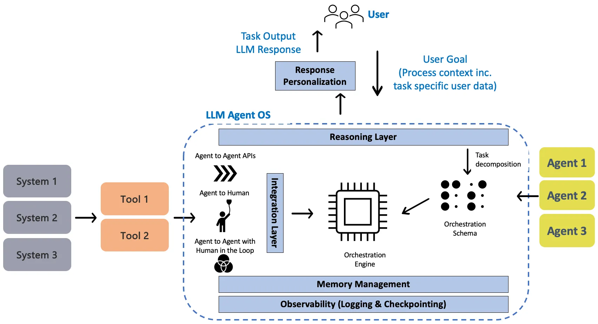
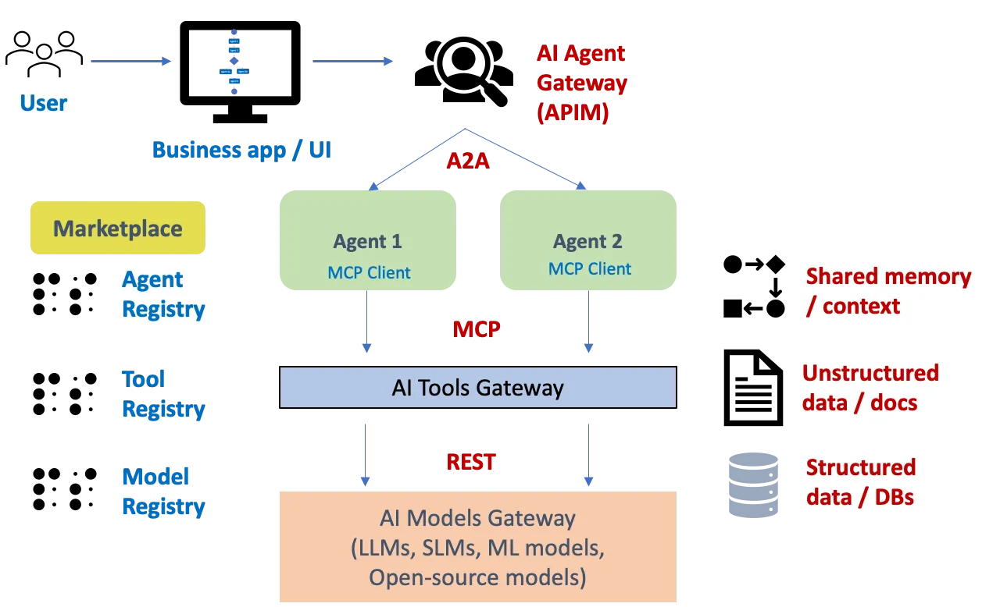
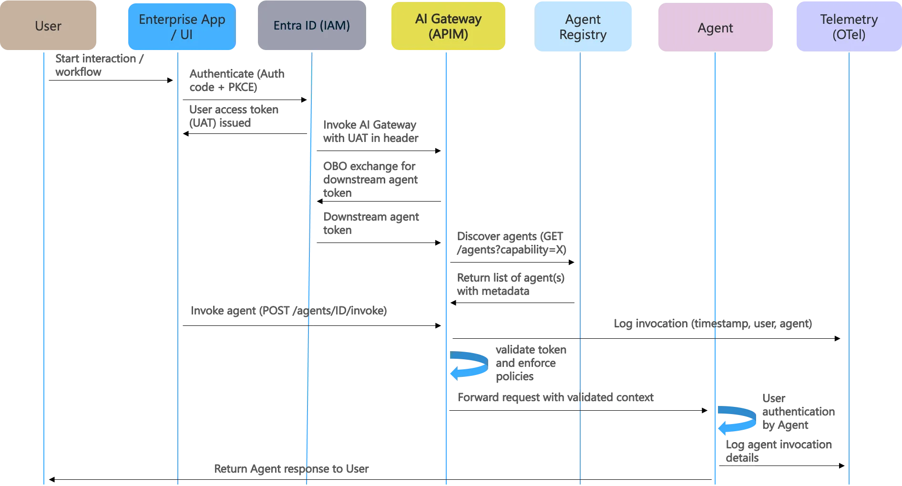
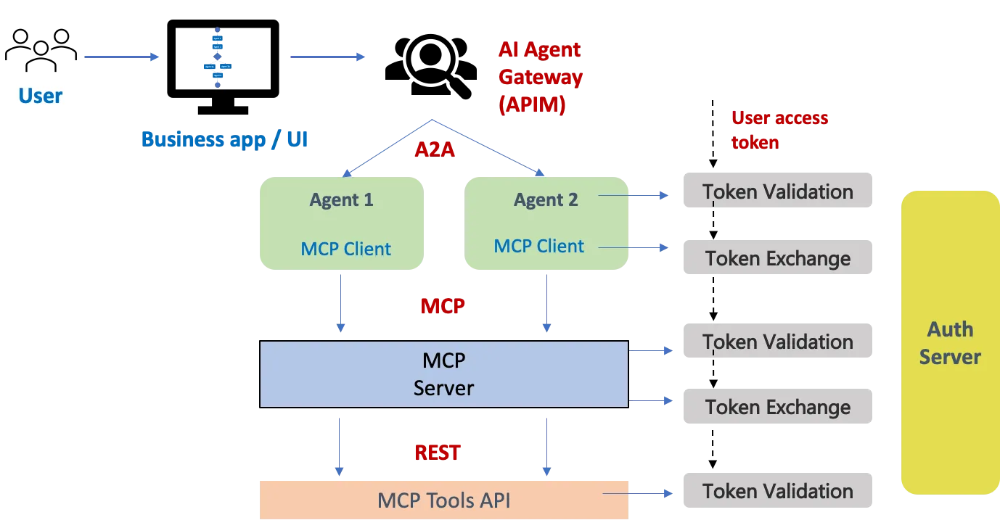
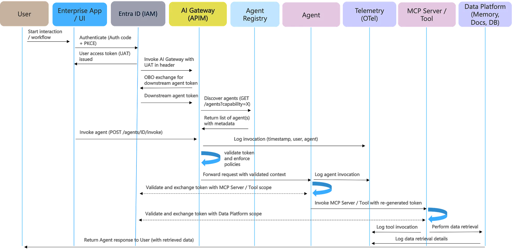

# 智能体 AI 安全模式

## 面向企业级 AI 智能体与 MCP 工具的安全护栏

## 1. 引言

智能体 AI 系统的关键特征在于其自主性与推理能力，这让它们能够把复杂任务分解为更小的可执行任务，进而编排这些任务的执行，并在需要时对执行过程进行监控、反思、适配 / 自我纠错。鉴于此，

> 智能体 AI 有潜力颠覆当今企业中几乎所有的业务流程。

因此我们基本上可以把一切都「智能体化」，从[客户服务台](https://medium.com/data-science-collective/reinventing-the-customer-service-desk-with-autonomous-ai-agents-ca5a0c00ba3f)，到工业流程，例如 [HVAC 优化](https://medium.com/ai-advances/reinforcement-learning-agents-for-industrial-control-systems-b917b513f0c4)；甚至可以利用智能体来构建底层软件、[数据](https://medium.com/data-science-collective/agentic-ai-for-data-engineering-4412d5e70189)以及 ML 工程流水线。为了支撑这个智能体化过程，我们需要一门新的、整体性的学科，它要覆盖完整的智能体生命周期（图 1）：

-   从捕获智能体用例需求开始
-   到设计智能体（一个好的智能体层级结构长什么样？哪些智能体技能与工具适用？）
-   到它们在智能体平台上的**安全且可扩展的**实现
-   再到这些智能体的治理与维护。


*图 1：聚焦于安全模式的智能体 AI 生命周期（作者绘图）*

在这个智能体化过程中需要牢记的一些原则：

-   人们往往倾向于把手工流程一对一地映射到智能体流程上。这是一种[低效的映射](https://medium.com/ai-advances/why-designing-efficient-agentic-ai-workflows-is-so-hard-f6ceb07496aa)。设计者应当记住，智能体并不会，比如说，受 HR 流程的约束 :) 所以一个软件智能体可以做不同的事情，并且以不同于人类的方式去做。
-   与此同时，正如从**安全**视角看人类是链条中最薄弱的一环一样，单个智能体也能让整个执行崩溃。所以这里没有例外，而且如果某个智能体出了问题，我们也不知道该去责备、罚款、解雇谁。因此建议以同样极致的谨慎来设计所有智能体，并配以日志记录、可观测性以及负责任 AI 护栏。

> 如今，AI 智能体通过临时拼凑的端点对外暴露，导致安全、运维与合规控制碎片化。

如果没有一套架构良好的智能体安全架构，我们将面临以下风险：

-   *安全漏洞*：由于身份认证与授权实现不一致；
-   *运维低效*：源于碎片化的监控与遥测；
-   *合规风险*：源于审计追踪不足以及未经授权的数据访问 / 数据治理；
-   *可扩展性挑战：*缺乏集中化的（基于策略的）速率限制与限流；
-   *糟糕的用户体验（UX）*：源于缺乏标准化的智能体（工具与模型）发现、调用模式以及用户访问控制。

在本文中，我们将深入探讨智能体生命周期的**安全**层面。更具体地说，我们为以下各方之间标准化、可扩展的交互定义安全模式：
用户 → 应用 → 智能体 → 工具 →（数据）源系统。

## 2. 智能体 AI 参考架构

图 2 展示了智能体 AI 平台的关键组件，它们构成了第 3 节所述安全模式的基础：

-   **推理**层：用于分解复杂任务并适配其执行，以达成给定目标；
-   智能体**市场 / 注册中心**：收录现有且可用的智能体、工具与模型；
-   **编排**模块：用于编排并监控（观察）多智能体系统的执行；
-   **集成**模块：用于与企业系统（如 ERP、CRM、KB 知识库仓库）集成的 MCP 工具；
-   共享**记忆**管理：用于智能体之间的数据与上下文共享；
-   **治理**层：包括可解释性、隐私、安全、安全性护栏等。


*图 2：智能体 AI 平台参考架构（作者绘图）*

给定一个用户任务，智能体 AI 平台的目标是识别（组合）出一个能够执行该任务的智能体（或一组智能体）。所以我们需要的第一个组件是一个**推理**模块，它能够把一个任务分解为子任务，相应智能体的执行则由一个编排引擎来编排。

思维链（CoT）是当今使用最广泛的分解框架，用于把复杂任务转化为多个可管理的任务，并揭示出对模型思考过程的一种解读。此外，**ReAct**（推理与行动）框架让智能体能够批判性地评估自身的行动与输出，从中学习，并随后优化其计划 / 推理过程。

智能体组合意味着存在一个[智能体市场](https://ai.gopubby.com/ai-agents-marketplace-discovery-for-multi-agent-systems-27a31b6b1ca6) / 智能体注册中心——其中对智能体能力与约束有明确的描述。例如，Agent2Agent（**A2A**）协议规定了 [Agent Card](https://google.github.io/A2A/topics/agent-discovery/)（一份 JSON 文档）的概念，它充当智能体的数字「名片」。它包含以下关键信息：

```yaml
Identity: name, description, provider information.
Service Endpoint: The url where the A2A service can be reached.
A2A Capabilities: Supported protocol features like streaming or pushNotifications.
Authentication: Required authentication schemes (e.g., "Bearer", "OAuth2") to interact with the agent.
Skills: A list of specific tasks or functions the agent can perform (AgentSkill objects), including their id, name, description, inputModes, outputModes, and examples.
```

鉴于需要编排多个智能体，因此需要一个支持不同智能体交互模式的**系统集成层**，例如：智能体对智能体 API、提供输出供人类消费的智能体 API、人类触发 AI 智能体、带人在环的 AI 智能体对智能体。这些集成模式需要由底层的 Agent OS 平台来支持。

我们参考 Anthropic 近期提出的模型上下文协议（[MCP](https://www.anthropic.com/news/model-context-protocol)），它用于把 AI 智能体连接到企业数据所在的外部系统 / 工具。MCP 被称为 AI 模型的「USB-C」，它通过三大构建块实现互操作性：

1.  *Resources（资源）*：这是服务器可以提供给 AI 的结构化数据。例如代码片段、文档的某些部分，或数据库查询结果；任何能增加事实性上下文的东西。
2.  *Prompts（提示）*：是服务器可以提供的预制指令或模板。可以想象成用于摘要文本或以特定风格生成代码的已保存提示。
3.  *Tools（工具）*：指的是 AI 可以请求服务器执行的实际操作。在检索一侧，这些操作包括查询数据库、搜索网络等。

通过对这些进行标准化，任何使用 **MCP** 的 AI 系统都能理解如何通过任何兼容的 MCP 服务器来请求数据（资源）、提供指令（提示）或执行操作（工具）。

鉴于复杂智能体长时间运行的特性，**记忆**管理对于智能体 AI 系统而言至关重要。

> 这既涉及任务之间的上下文共享，也涉及在长时间跨度内维持执行上下文。

这里的标准做法是把智能体信息的嵌入表示保存到一个支持最大内积搜索（MIPS）的向量存储数据库中。为了实现快速检索，会使用近似最近邻（ANN）算法，它返回近似的 top k 个最近邻，以准确性的权衡换取巨大的速度提升。关于这个话题的详细讨论，可参阅我此前关于[智能体 AI 的长期记忆](https://ai.gopubby.com/long-term-memory-for-agentic-ai-systems-4ae9b37c6c0f)的文章。

最后是**治理**层。我们需要确保用户针对某个任务分享的数据，或跨越多个任务的用户画像数据；只与相关的智能体共享（表 / 报告的认证与访问控制）。关于让一个治理良好的 AI 智能体平台在幻觉[护栏](https://medium.com/data-science-collective/guardrails-for-ai-agents-8913f6b67b51)、数据质量、[隐私](https://medium.com/ai-advances/privacy-risks-of-large-language-models-llms-5c0f96dccc56)、可复现性、可解释性、人在环（[HITL](https://medium.com/ai-advances/human-in-the-loop-strategy-for-agentic-ai-d9daa22c3204)）等方面所需关键维度的讨论，可参阅我此前关于负责任 AI 智能体的[文章](https://ai.gopubby.com/responsible-agentops-8d90fbd84985)。

## 3. 智能体交互的安全模式

### 3.1 应用到智能体

我们首先定义用户 / 应用经由 AI 网关到智能体交互的安全模式。基于 AI 网关的端到端安全架构如图 3 所示。


*图 3：基于 AI 网关的智能体安全架构（作者绘图）*

该安全模式由以下组件构成：

-   调用 AI 智能体的用户和 / 或应用。
-   市场：基于 REST 的注册中心，用于发现智能体、工具与模型，指定其能力、元数据与端点。
-   AI 网关：API 管理（AMIP）层，为所有交互强制实施安全、路由、限流、护栏。
-   IAM 提供方：我们针对人类用户考虑使用 Entra ID，针对应用考虑使用服务主体（托管身份）。
    （虽然 [Entra ID](https://learn.microsoft.com/en-us/azure/architecture/aws-professional/security-identity) 是 Azure 专属的，但其他平台上的等效 IAM 解决方案同样适用于所述的安全模式。）
-   记忆：维持用户会话上下文与对话状态（用于多轮对话）。
-   （Open）telemetry：用于监控、合规与分析的集中化日志记录。


*图 4：用户（经由应用 / UI）到智能体的安全模式（作者绘图）*

详细的用户（经由应用 / UI）到智能体的安全流程如图 4 所示，关键步骤概述如下：

1.  用户在业务应用 / UI 中发起交互。
2.  应用使用授权码 + PKCE（Proof Key for Code Exchange，授权码交换证明密钥）向 Entra ID 认证用户。
3.  Entra ID 向应用签发用户访问令牌。
4.  应用在请求头中携带用户访问令牌调用 AI 网关（APIM）。
5.  AI 网关与 Entra ID 执行代表（OBO）令牌交换，以获取下游智能体令牌；*aud（audience，受众）= 智能体。*
6.  AI 网关校验令牌并强制实施策略（JWT 校验，针对智能体作用域 / 用户角色）。
7.  AI 网关把携带已校验上下文的请求转发给智能体。
8.  智能体在智能体层级对用户进行授权。
9.  智能体执行业务逻辑处理，然后把响应返回给用户（经由应用 / UI）。
10.  AI 网关与智能体都将其带时间戳的调用细节记录到 [OTel](https://opentelemetry.io/docs/specs/otel/logs/) 平台。

### 3.2 智能体到 MCP 工具（MCP 服务器与客户端）

在本节中，我们把此前的用户 / 应用 / UI 到智能体的安全模式扩展到智能体到工具的交互（经由 MCP），以适配某个智能体需要调用工具来完成其功能的场景。

在最简单的形式下，MCP 客户端向授权服务器请求一个 [OAuth 2.0](https://oauth.net/2/) 访问令牌，以便随后（携带签发的访问令牌）调用 MCP 服务器 API。OAuth 2.0 规范定义了如何从授权服务器获取 OAuth 2.0 访问令牌的不同流程。最相关的流程将在以下小节中说明：

**客户端凭证授权（CCG）流程**

CCG 流程由 MCP 客户端（嵌入在 AI 智能体内——图 2）使用，以基于其自身的非人类身份从授权服务器获取一个新的访问令牌。

> CCG 流程用于 MCP 客户端不运行在用户—智能体上下文中的情况，支持在后台运行的长时间批处理进程。

注意，需要非常宽泛且高 MCP 权限的完全*自主*的 AI 智能体可能带来重大风险，除非受到精密的动态访问管理及其他护栏的约束。

**OBO AI 智能体——令牌交换（TE）流程**

这种 TE 流程可由 MCP 客户端使用，以代表用户、用一个进来的访问令牌（由上游系统获取的）从授权服务器换取一个新的访问令牌。

> 因此 TE 流程用于 MCP 客户端代表用户运行、服务于近实时用例的情况。

一般而言，AI 智能体与 MCP 服务器不得把从上游系统收到的访问令牌传播到下游系统；除非它们全部部署在同一个运行时平台上。

> 根据 OAuth 2.0 规范，令牌传播不得跨越应用边界，尤其是处于不同安全域中的应用边界。

**安全流程：** AI 智能体（MCP 客户端）→ MCP 服务器 → MCP 工具 API

有了上述背景，我们概述图 5 所示的一次参考性的 AI 智能体（MCP 客户端）到 MCP 服务器交互的步骤：


*图 5：聚焦于智能体生命周期中 AI 智能体（MCP 客户端）→ MCP 服务器 → MCP 工具 API 交互部分的安全模式（作者绘图）*

1.  智能体由用户 / 应用使用一个访问令牌调用（小节 3.1）。
    进来的访问令牌明确针对该智能体，不能用于调用其他智能体或 MCP 服务器。更具体地说，令牌中的 sub（subject，主体）声明标识出原始用户。aud（audience，受众）声明把该智能体标识为令牌的预期接收方。令牌的作用域仅对应于该 AI 智能体所需的权限。
2.  AI 智能体需要调用某个工具（相应的 MCP 服务器）来完成其功能：
    智能体不能直接把它收到的（来自用户 / 应用的）访问令牌传播给 MCP 服务器，主要有两个关键原因：
    \- *溯源*：如果被传播，底层工具（被 MCP 服务器调用的那个）将不知道是 MCP 服务器在发起调用。它看起来会像是应用发起了调用——破坏可审计性。
    \- *作用域*：收到的令牌所拥有的权限作用域可能与 MCP 服务器所需的不同。
    因此 AI 智能体执行一次令牌交换（TE）：智能体向授权服务器的令牌端点发起一次调用，携带以下细节：（自身凭证、收到的访问令牌、新令牌的作用域与受众）。
3.  授权服务器校验来自 AI 智能体的进来的请求。如果校验通过，它签发一个明确针对 MCP 服务器的、有限作用域的新访问令牌。新令牌中的 sub（subject，主体）声明仍然标识原始用户——保留用户上下文。
4.  智能体调用 MCP 服务器：请求中携带交换得到的访问令牌。如前所述，鉴于令牌传播的风险，MCP 服务器可能会执行另一次令牌交换以调用下游工具 API，除非两者都部署在同一个应用 / 平台域中。

### 3.3 从（下游）源系统检索数据

在本节中，我们通过聚焦于数据检索这一层面来完成智能体安全生命周期，*即当智能体需要从记忆、结构化或非结构化数据源检索数据时——*参见图 3*。（*智能体记忆也被视为一个数据存储平台，因此类似的安全模式同样适用。）

正如你到目前为止一定已经注意到的，令牌生成、校验与交换的安全模式保持不变；一旦某个交互（在这里是 MCP 工具与存储平台之间）跨越安全域，就需要一次令牌交换。端到端的安全模式如图 6 所示。


*图 6：覆盖 用户 → 应用 / UI → AI 智能体 → MCP 服务器 / 工具 → 数据平台 的端到端安全模式（作者绘图）*

## 4. 结论

虽然智能体 AI 系统的好处显而易见，但它们同样是复杂系统，难以以安全且可扩展的方式来执行。鉴于智能体系统非确定性、多层级的架构（涵盖 用户 → 应用 → 智能体 → 工具 →（数据）源系统），这不幸是一项极具挑战性的任务。

为了克服这一点，我们概述了安全模式、架构组件与治理机制，以确保整个智能体生命周期的安全与合规——并利用一个 AI 网关作为各智能体层之间的中央集成组件。

智能体 AI 安全仍处于起步阶段，但正变得日益关键！随着智能体开始借助记忆执行更长的任务、在多智能体场景中与工具协作、并处理日益复杂的数据工作流；建议尽早开始基于零信任与安全最佳原则纳入**安全设计（security by design）**——提升信任度并加速企业对智能体工作流的采用。
