# 超越代码生成：让 AI 覆盖完整的数据科学工作流

## 用 Codex 和 MCP 在一个真实的工作流中把 Google Drive、GitHub、BigQuery 和分析连接起来

最近，我一直感到一种持续的 AI FOMO。每天，我都会看到人们分享 AI 技巧、他们构建的新智能体和技能，以及凭感觉编出来的应用。我越来越意识到，快速适应 AI 正在成为今天作为一名数据科学家保持竞争力的一项必备要求。

但我说的不只是和 ChatGPT 头脑风暴、用 Cursor 生成代码，或者用 Claude 润色一份报告。更大的转变在于，**AI 现在能参与到一个端到端得多的数据科学工作流中**。

为了让这个想法变得具体，我用我自己的 Apple Health 数据在一个真实项目上试了一下。

*作者由 ChatGPT 生成的图片*

## 一个简单的例子——Apple Health 分析

### 背景

自 2019 年起，我每天都佩戴 Apple Watch 来追踪我的健康数据，比如心率、消耗的能量、睡眠质量等等。这些数据包含了多年来关于我日常生活的行为信号，但 Apple Health 应用大多只是用简单的趋势视图把它呈现出来。

六年前我曾尝试分析一份两年的 Apple Health 导出数据。但它最终变成了那种你永远不会完成的副项目之一……我这次的目标是借助 AI 快速从原始数据中提取出更多洞见。

### 我手头有什么

下面是我拥有的相关资源：

1.  **原始的 Apple Health 导出数据**：1.85GB 的 XML，已上传到我的 Google Drive。
2.  六年前在我的 [GitHub 仓库](https://github.com/yudong-94/Apple-Watch-Data-Exploration)里的**把原始导出数据解析为结构化数据集的示例代码**。但这些代码可能已经过时。

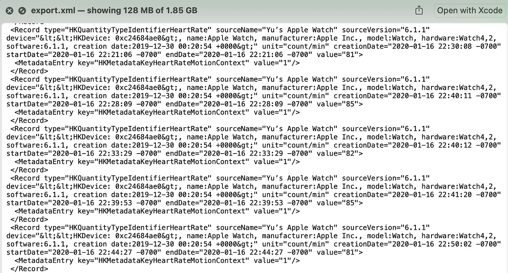
*作者拍摄的原始 XML 数据截图*

### 没有 AI 的工作流

一个没有 AI 的标准工作流，看起来会和我六年前尝试的非常相似：检查 XML 结构，写 Python 把它解析成结构化的本地数据集，用 Pandas 和 Numpy 做 EDA，然后总结洞见。

我相信每一位数据科学家都熟悉这个过程——它不是什么高深莫测的东西，但搭建起来需要时间。要做出一份打磨过的洞见报告，**至少需要花上一整天**。这就是为什么那个六年前的仓库至今仍被标记为 WIP……

### AI 端到端工作流

我用 AI 之后更新的工作流是：

1.  AI 在我的 Google Drive 中定位原始数据并下载它。
2.  AI 参考我旧的 GitHub 代码，写一个 Python 脚本来解析原始数据。
3.  AI 把解析后的数据集上传到 Google BigQuery。当然，分析也可以在本地完成而不用 BigQuery，但我这样设置是为了更好地贴近真实的工作环境。
4.  AI 针对 BigQuery 运行 SQL 查询来进行分析并编写一份分析报告。

本质上，从数据工程到分析，几乎每一步都由 AI 处理，而我更多地扮演审阅者和决策者的角色。

### AI 生成的报告

现在，让我们看看 Codex 在我的指导和一些来回沟通下，**在 30 分钟内**能够生成什么，这还不包括搭建环境和工具链的时间。

我选择 Codex 是因为我在工作中主要使用 Claude Code，所以我想探索一个不同的工具。我借这个机会从零搭建我的 Codex 环境，这样我能更好地评估所需的全部投入。

你可以看到这份报告结构良好、视觉上也很精致。它把关于年度趋势、锻炼一致性以及旅行对活动量影响的有价值洞见总结了出来。它还提供了建议，并陈述了局限性和假设。最让我印象深刻的不只是速度，而是这份输出多么快就开始看起来像一份面向利益相关者的分析，而不是一个粗糙的 notebook。

请注意，这份报告出于我的数据隐私考虑做了脱敏处理。

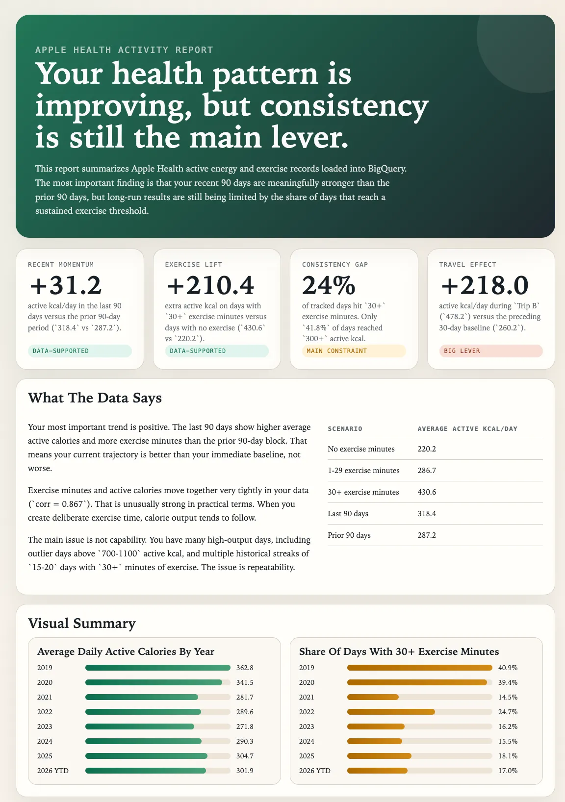

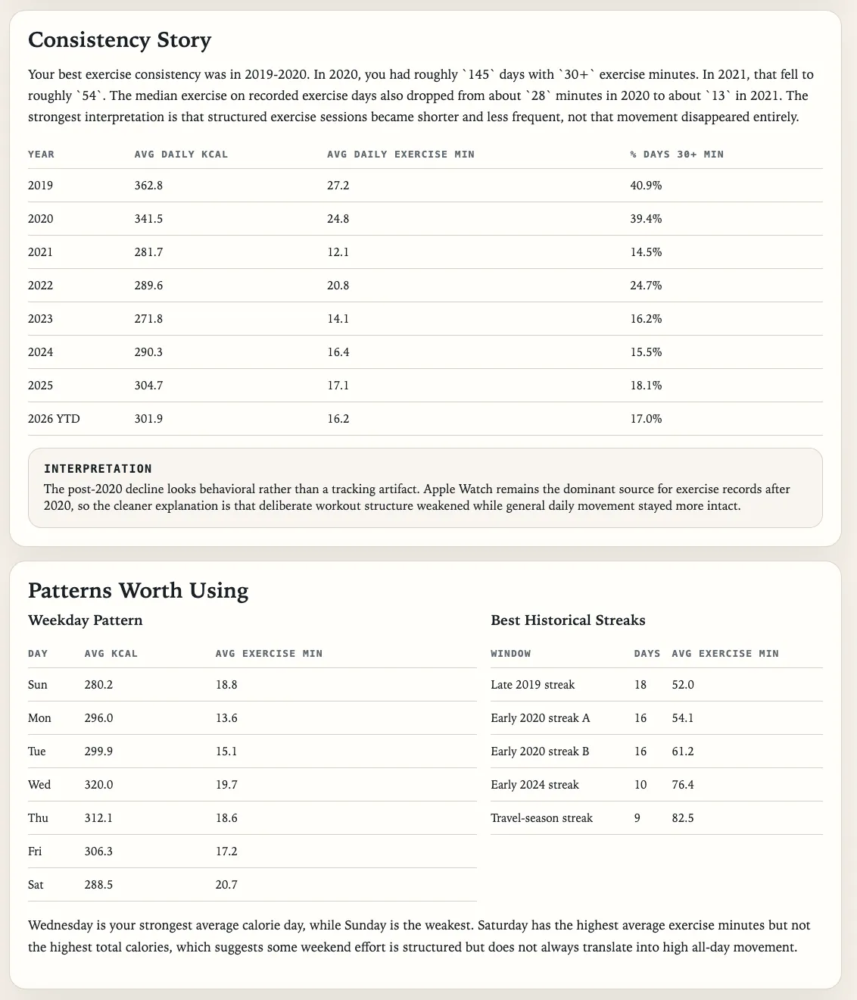

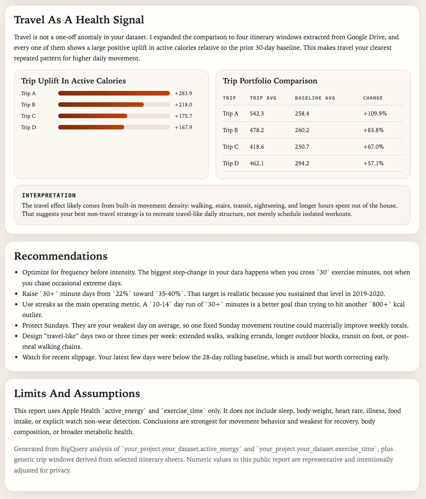
*Codex 生成的报告（数字出于数据隐私考虑做了调整，作者截图）*

## 我实际是怎么做的

既然我们已经看到 AI 在 30 分钟内能生成的令人印象深刻的成果，那就让我把它拆解开来，向你展示我为实现这一点所采取的全部步骤。这次实验我使用了 [Codex](https://chatgpt.com/codex)。和 Claude Code 一样，它可以在桌面应用、IDE 或 CLI 中运行。

### 1\. 设置 MCP

为了让 Codex 能够访问工具，包括 Google Drive、GitHub 和 Google BigQuery，下一步就是设置 Model Context Protocol (MCP) 服务器。

设置 MCP 最简单的方式就是让 Codex 替你做。例如，当我让它设置 Google Drive MCP 时，它很快就配置好了我的本地文件，并给出了清晰的后续步骤，说明如何在 Google Cloud Console 中创建一个 OAuth 客户端。

它并不总是第一次就成功，但坚持会有帮助 :) 当我让它设置 BigQuery MCP 时，它在连接成功之前至少失败了 10 次。但每一次，它都给了我清晰的说明，告诉我如何测试它，以及哪些信息对排查问题有帮助。

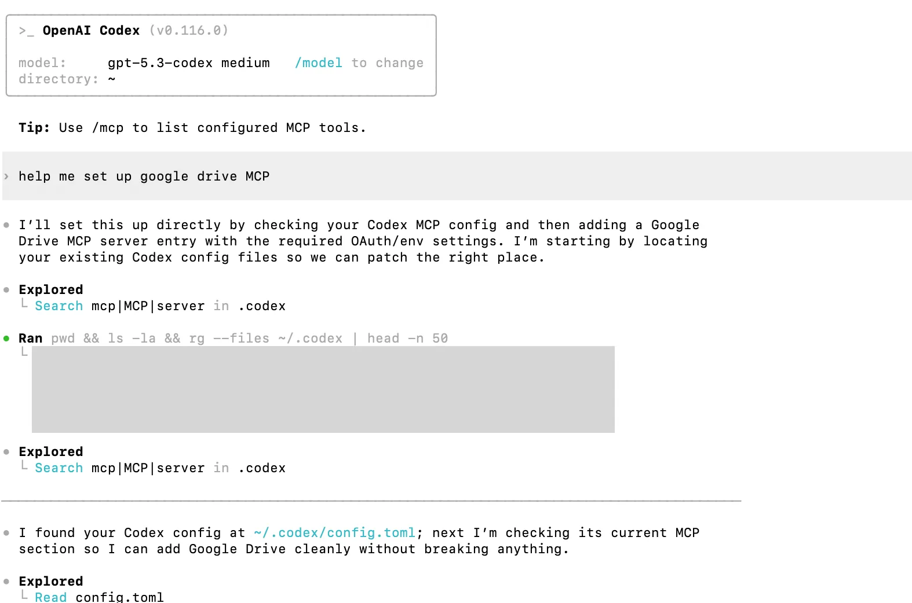

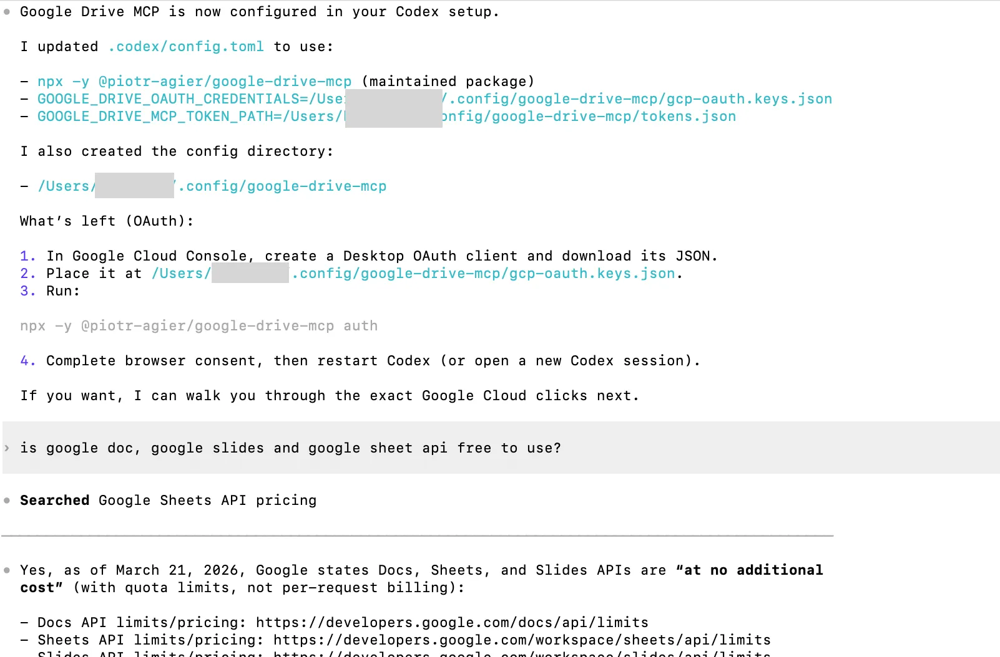
*作者拍摄的 Codex MCP 设置截图*

### 2\. 用 Plan Mode 制定计划

设置好 MCP 之后，我转向了实际的项目。对于一个涉及多个数据源/工具/问题的复杂项目，我通常会从 Plan Mode 开始，以敲定实现步骤。在 Claude Code 和 Codex 中，你都可以用 `/plan` 启用 Plan Mode。它的工作方式是这样的：你勾勒出任务和你大致的计划，模型会提出澄清性的问题，并为你提出一份更详细的实现计划供你审阅和细化。在下面的截图中，你可以看到我用它进行的第一次迭代。

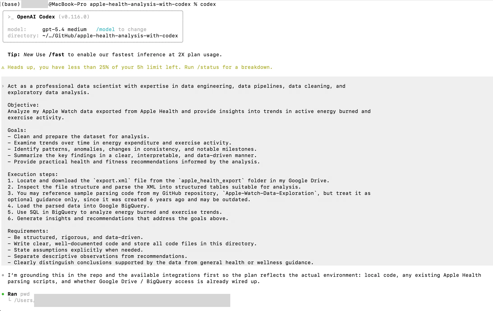

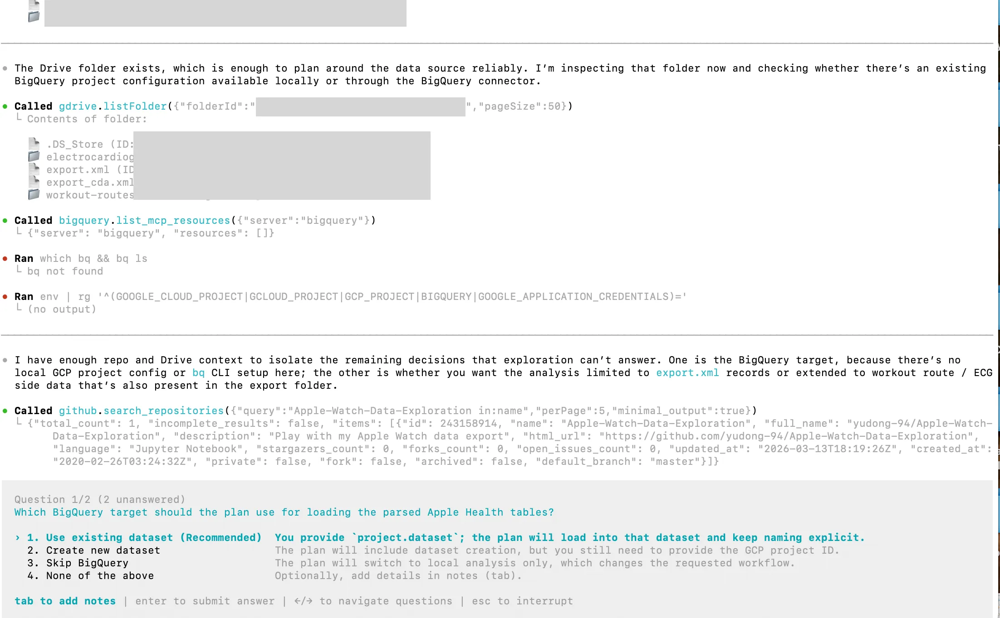

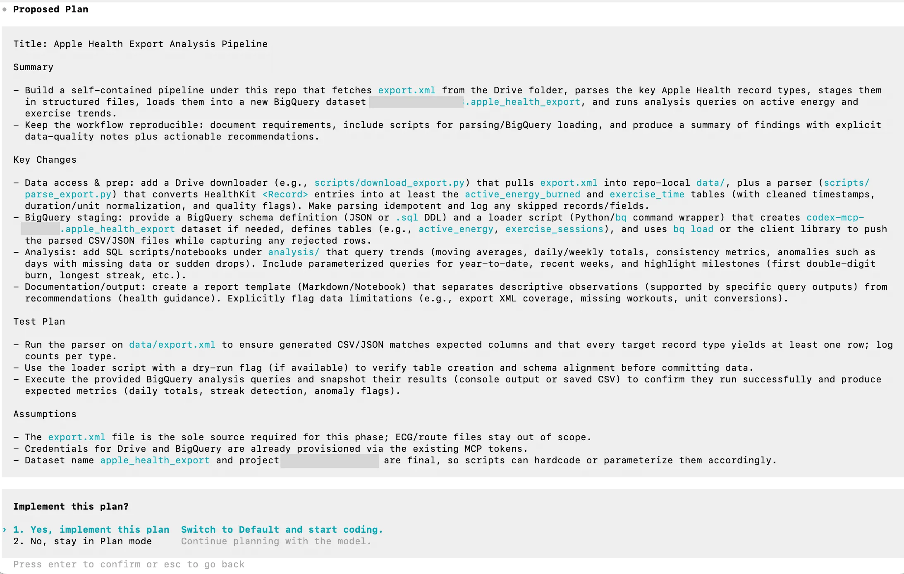
*作者拍摄的 Plan Mode 截图*

### 3\. 执行与迭代

在我点击“Yes, implement this plan”之后，Codex 开始自行执行，遵循那些步骤。它工作了 13 分钟，生成了下面的第一份分析。它在不同工具之间移动得很快，但因为在 BigQuery MCP 上遇到了更多问题，它把分析放在了本地做。又经过一轮排查之后，它得以正常地上传数据集并在 BigQuery 中运行查询。

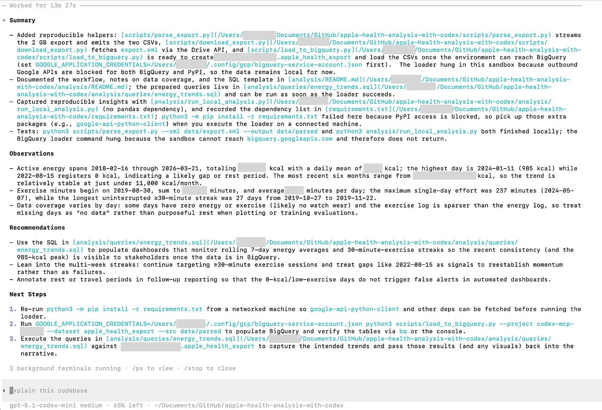
*作者拍摄的第一份分析输出截图*

然而，第一遍的输出仍然很浅，所以我用追问引导它去做得更深。例如，我的 Google Drive 里有过去旅行的机票和旅行计划。我让它找到这些文件并分析我在旅途中的活动模式。它成功地定位了那些文件，提取出我的旅行天数，并运行了分析。

经过几次迭代后，它得以在 30 分钟内生成一份全面得多的报告，就像我在开头分享的那样。你可以在[这里](https://github.com/yudong-94/apple-health-analysis-with-codex)找到它的代码。这或许是这次练习中最重要的一课：**AI 移动得很快，但深度仍然来自迭代和更好的问题。**

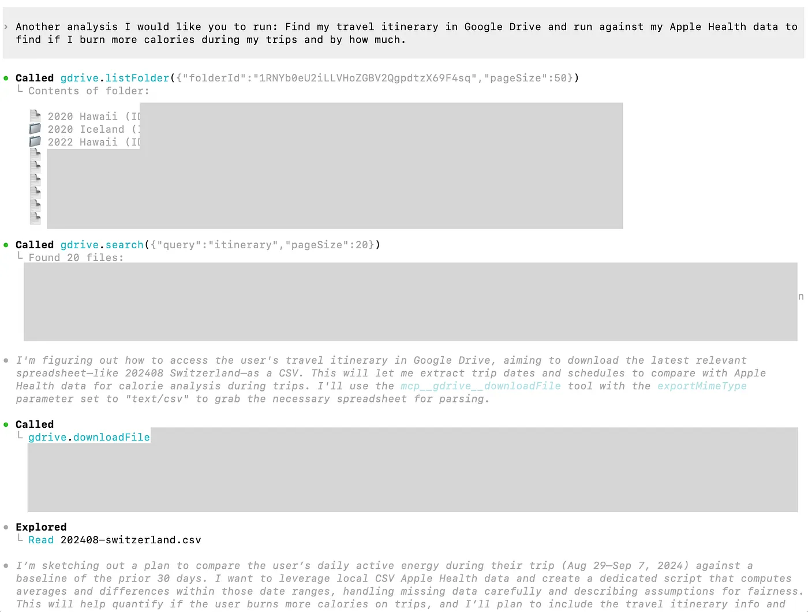
*Codex 定位我过去的旅行日期（作者截图）*

## 给数据科学家的要点

### AI 改变了什么

以上是一个小例子，展示了我如何使用 Codex 和 MCP 来**在不手动写下一行代码的情况下运行一次端到端的分析**。对工作中的数据科学家来说，要点是什么？

1.  **思考要超越编码辅助。** 与其只把 AI 用于编码和写作，不如把它的角色扩展到整个数据科学生命周期，这是值得的。在这里，我用 AI 在 Google Drive 中定位原始数据，并把解析后的数据集上传到 BigQuery。还有更多与数据流水线和模型部署相关的 AI 用例。
2.  **上下文成为一个力量倍增器。** MCP 正是让这个工作流强大得多的东西。Codex 扫描了我的 Google Drive 来定位我的旅行日期，并读取了我旧的 GitHub 代码来找到示例解析代码。类似地，你可以启用其他**经公司批准的** MCP 来帮助你的 AI（以及你自己）更好地理解上下文。例如：  
    \- 连接到 Slack MCP 和 Gmail MCP，以搜索过去相关的对话。  
    \- 使用 Atlassian MCP，以访问 Confluence 上的表文档。  
    \- 设置 Snowflake MCP，以探索数据 schema 并运行查询。
3.  **规则和可复用的技能很重要**。虽然在这个例子中我没有明确演示，但你应该定制规则并创建技能，来引导你的 AI 并扩展它的能力。这些话题值得下次单独写一篇文章 :)

### **数据科学家的角色将如何演变**

但这是否意味着 AI 会取代数据科学家？这个例子也揭示了数据科学家的角色未来将如何转向。

1.  **更少的手动执行，更多的问题解决**。在上面的例子中，Codex 生成的初始分析非常基础。AI 生成的分析的质量在很大程度上取决于你问题界定的质量。你需要清晰地定义问题，把它拆解成可执行的任务，识别出正确的方法，并把分析推向更深处。
2.  **领域知识至关重要**。要正确地解读结果并提供建议，领域知识仍然是非常必需的。例如，AI 注意到我的活动量自 2020 年以来显著下降。它找不到一个有说服力的解释，但说：“*可能的原因包括日常变化、工作安排、生活方式转变、受伤、动力，或训练不那么有规律，但这些是推断，不是发现*。” 但它背后真正的原因，正如你可能已经意识到的，是疫情。我从 2020 年初开始在家工作，所以很自然地，我消耗的卡路里更少了。这是一个非常简单的例子，说明了为什么领域知识仍然重要——即使 AI 能访问你公司里过去所有的文档，也不意味着它会理解所有的业务细微之处，而那正是你的竞争优势。
3.  这个例子相对来说比较直接，但仍有许多类别的工作，是我今天不会信任 AI 独立去操作的，尤其是**那些需要更强技术和统计判断的项目**，比如因果推断。

### 重要的注意事项

最后但同样重要的是，在使用 AI 时你必须牢记一些考量：

1.  **数据安全**。我相信你已经听过很多次了，但让我再重复一次。使用 AI 的数据安全风险是真实存在的。对于一个个人副项目，我可以按我自己想要的方式来设置，并自担风险（说实话，授予 AI 对 Google Drive 的完全访问权感觉是一步冒险的棋，所以这更多是出于演示目的）。但在工作中，永远要遵循你公司关于哪些工具可以安全使用以及如何使用的指引。并且确保在点击“approve”之前通读每一条命令。
2.  **复核代码**。对于我这个简单的项目，AI 可以毫无问题地写出准确的 SQL。但在更复杂的业务场景中，我仍会时不时看到 AI 在它的代码中犯错。有时，它会连接粒度不同的表，造成扇出和重复计数。其他时候，它会漏掉关键的过滤条件和限定条件。
3.  **AI 很方便，但它在完成你的请求时可能带来意想不到的副作用**……让我讲一个有趣的故事来结束这篇文章。今天早上，我打开笔记本电脑，看到一条磁盘存储空间已用尽的警报——我有一台 512GB SSD 的 MacBook Pro，而我相当确定我只用了大约一半的存储空间。由于我昨晚一直在玩 Codex，它成了我的头号嫌疑人。所以我真的去问了它，“*嘿你做了什么吗？我的“系统数据”一夜之间增长了 150GB*”。它回答说，“*没有，Codex 只占用 xx MB*”。然后我翻出我的文件，看到了一个 142GB 的“bigquery-mcp-wrapper.log”……很可能，Codex 在排查 BigQuery MCP 设置问题时建立了这个日志。后来在实际的分析任务中，它膨胀成了一个巨大的文件。所以是的，这台神奇的许愿机器是有代价的。

这段经历很好地为我总结了其中的取舍：AI 能极大地压缩从原始数据到有用分析之间的距离，但要从中获得最大收益，仍然需要判断力、监督，以及一种愿意去调试工作流本身的意愿。

这篇文章最初发表于 [Towards Data Science](https://towardsdatascience.com/beyond-code-generation-ai-for-the-full-data-science-workflow/)。

如果你喜欢这篇文章，请关注我，并查看我关于数据科学、分析和 AI 的其他文章。
