# 仅解码器 Transformer：生成式 LLM 的主力架构

## 从零开始构建世界上最有影响力的神经网络架构……

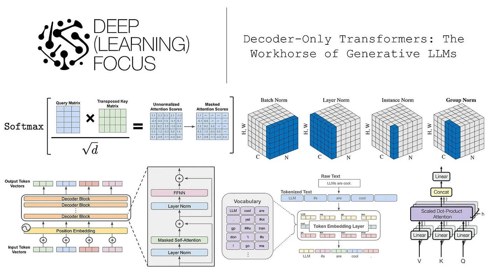
*（来自 [1, 8]）*

本文最初发表于 [我的 Substack](https://cameronrwolfe.substack.com/p/decoder-only-transformers-the-workhorse)。

## 引言

当下 AI 研究的步伐令人瞠目。跟上最新的发表成果是一件难事，即便是这个领域的专家也会感觉自己未能把握住这个不断演化的前沿的那些更细微的细节。尤其在大语言模型（LLM）的领域里，有影响力的研究在不断地被发布出来，从新的基础模型（例如 Gemma \[15\] 和 OLMo \[12\]）到更好的对齐技术（例如 DPO \[32\] 对 PPO \[33\] 对 REINFORCE \[34\]），再到像 [模型合并](https://www.interconnects.ai/p/model-merging) 这样的奇异话题，无所不包。然而，尽管有这些快速的进展，LLM 的一个组件始终保持不变——*仅解码器 transformer 架构*。令人吃惊的是，大多数现代 LLM 所用的架构与原始的 GPT 模型几乎完全相同。我们只是把模型做得大得多，对它稍作修改，并使用一个更广泛的训练（和对齐）过程。出于这个原因，仅解码器 transformer 架构是 AI 研究中最基础、最重要的想法之一。在这篇综述里，我们将全面地解释这个架构，从零开始实现它的所有组件，并探索它在近期研究中是如何演化的。

## 自注意力操作

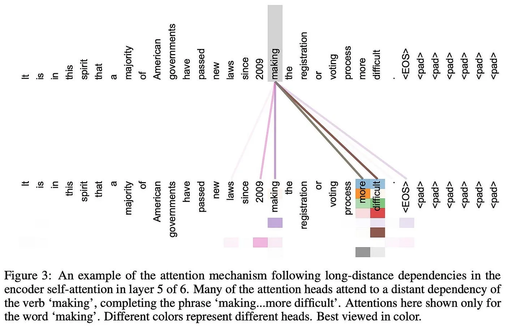
*（来自 [1]）*

考虑到 transformer 架构是在一篇题为 *"Attention Is All You Need"*（注意力就是你所需要的全部）\[1\] 的论文里被提出的，自注意力处于所有现代语言模型的核心，这大概并不令人意外。简单来说，自注意力基于一个 token 与序列中其他 token 的关系，来变换该序列中每个 token 的表示；见上图。但是，*这到底是怎么运作的？* 在本节中，我们将一步步解释自注意力背后的概念，并构建一个（用 PyTorch 写的）LLM 所用的那个自注意力变体的实现。

### 理解缩放点积注意力

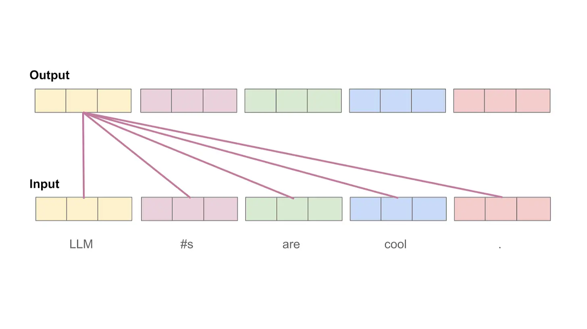

> "一个注意力函数 \[将\] 一个查询和一组键-值对映射到一个输出，其中查询、键、值和输出都是向量。输出被计算为值的加权和，其中赋给每个值的权重，是由查询与对应键的一个兼容性函数计算出来的。" *— 来自 \[1\]*

**投影输入。** 一个自注意力层的输入只是一批 token 序列，其中序列中的每个 token 都用一个向量来表示。假设我们使用一个批大小 `B`，并且每个序列的长度为 `T`，那么我们的自注意力层接收一个形状为 \[ `B, T, d]` 的 [张量](https://pytorch.org/tutorials/beginner/basics/tensorqs_tutorial.html) 作为输入，其中 `d` 是 token 向量的维数。为简单起见，我们将先只用一个 token 序列作为输入来概述自注意力操作；见下图。不过，同样的概念可以轻松地应用到一批序列上。

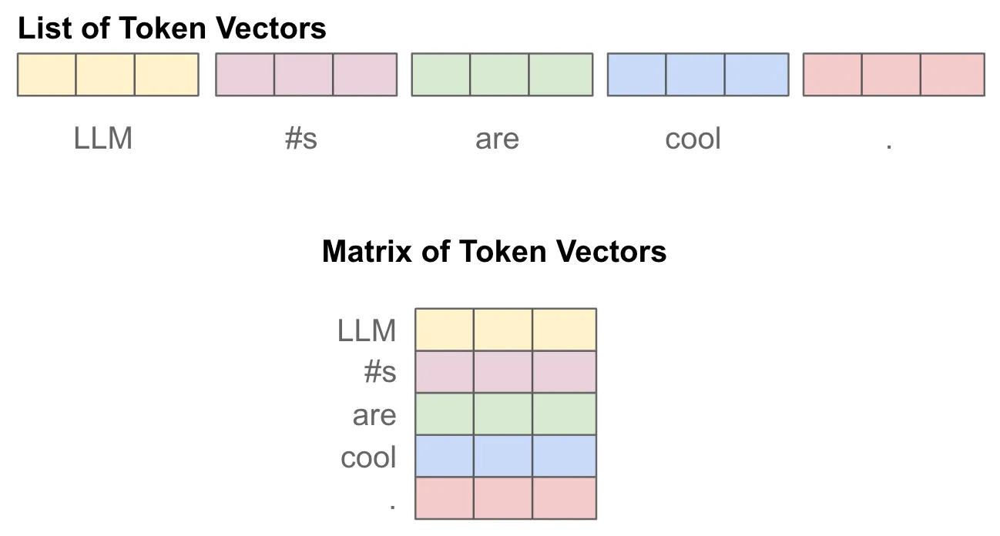
*以列表和矩阵形式表示的 token 向量序列*

自注意力的第一步是对我们输入序列中的 token 向量执行三个独立的（线性）投影，形成键、查询和值向量序列。要做到这一点，我们有三个权重矩阵——*分别对应键、查询和值的投影*——它们被用来投影每一个输入 token 向量，形成新的、变换过的 token 向量序列。因为我们这样做了三次，我们最终得到三个独立的 token 向量序列；见下图。

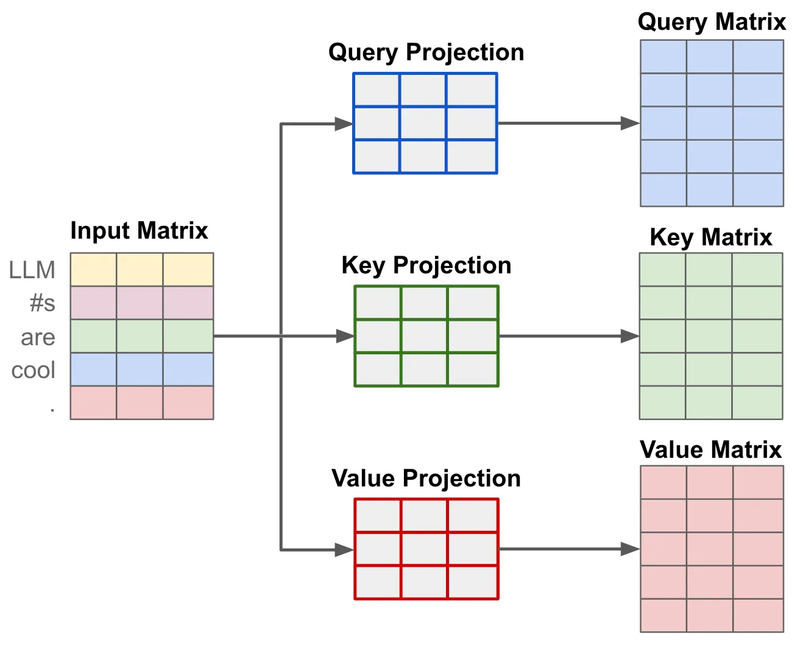
*创建查询、键和 token 向量*

**计算注意力分数。** 在投影了输入之后，注意力分数使用键和查询向量来生成。我们为序列中每一对 token `[i, j]` 计算一个注意力分数 `a[i, j]`。注意力分数位于范围 `[0, 1]` 内，并定量地刻画了在计算 token `i` 的新表示时应该考虑多少 token `j`。在实践中，我们通过取 token `i` 的查询向量与 token `j` 的键向量的 [点积](https://en.wikipedia.org/wiki/Dot_product) 来计算 `a[i, j]`；见下图。

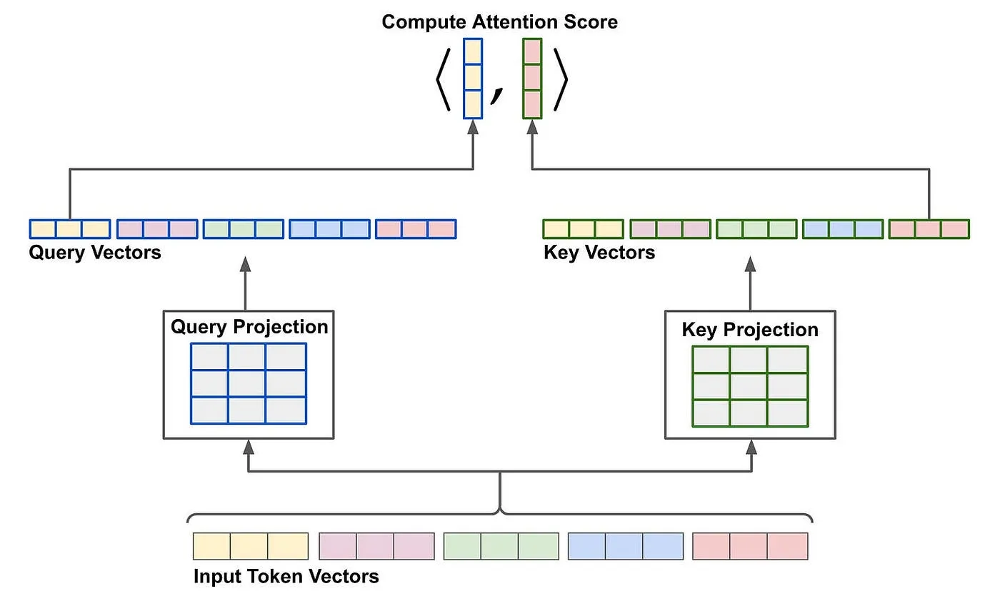
*从查询和键向量计算注意力分数*

我们可以高效地计算一个序列中所有成对的注意力分数，方法是把查询和键向量堆叠成两个矩阵，并把查询矩阵与转置后的键矩阵相乘。这个操作的结果是一个大小为 `[T, T]` 的矩阵——*我们将把它称为注意力矩阵*——它包含了序列中所有成对的注意力分数。从这里开始，我们把注意力矩阵中的每一个值除以 `d` 的平方根——*一种被发现能改善训练稳定性的做法 \[1\]*——并对注意力矩阵的每一行应用一个 [softmax 操作](https://en.wikipedia.org/wiki/Softmax_function)；见下图。在 softmax 被应用之后，每个 token 的注意力分数位于范围 `[0, 1]` 内，并形成一个有效的概率分布。

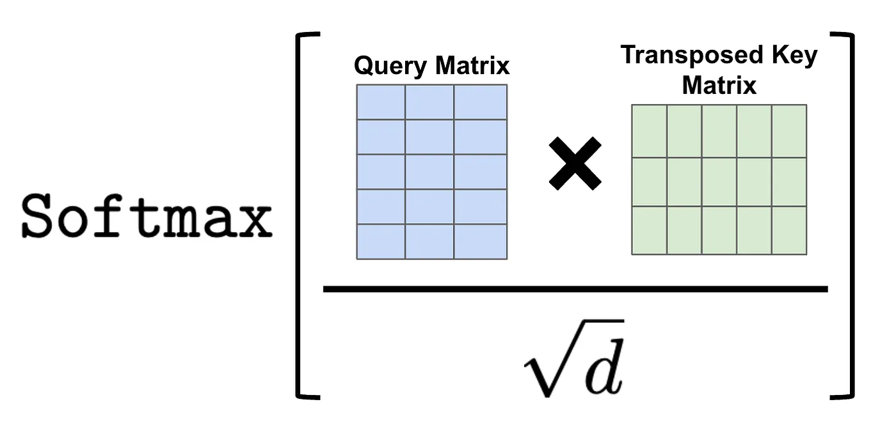
*计算注意力矩阵*

**值向量。** 一旦我们有了注意力分数，推导自注意力的输出就很容易了。每个 token 的输出只是值向量的一个加权组合，其中的权重由注意力分数给出。要批量地计算这个输出，我们可以简单地把所有值向量堆叠成一个矩阵，并取注意力矩阵与值矩阵的乘积。值得注意的是，自注意力保留了它输入的大小——*为输入中的每一个 token 向量产出一个变换过的、* `d` *维的输出向量*。如果我们把这个矩阵乘法手写出来，我们会看到每个 token 的输出表示只是值向量的一个加权平均，权重由注意力分数给出。

### LLM 的因果自注意力

上面描述的自注意力操作构成了 transformer 架构的基础。然而，transformer 的解码器使用一个稍微更复杂的自注意力版本，叫做掩码、多头自注意力。首先，我们将学习掩码自注意力和双向自注意力之间的区别。然后，我们将讨论注意力如何能在多个"头"上并行计算。

**掩码自注意力。** 仅解码器 transformer 使用一个叫做掩码（或因果）自注意力的自注意力变体。普通（或双向）自注意力——*正如前一节中所描述的*——允许序列中的所有 token 在计算注意力分数时都被考虑，而掩码自注意力则通过"掩掉"序列中跟在一个给定 token 之后的那些 token 来修改底层的注意力模式。例如，让我们考虑我们的 token 序列 `["LLM", "#s", "are", "cool", "."]`，并假设我们正试图为 token `"are"` 计算注意力分数。到目前为止，我们已经学到自注意力会在 `"are"` 和序列中每一个其他 token 之间计算一个注意力分数。然而，使用掩码自注意力，我们只为 `"LLM"`、`"#s"` 和 `"are"` 计算注意力分数。*掩码自注意力禁止我们在自注意力期间向序列的前方看*。

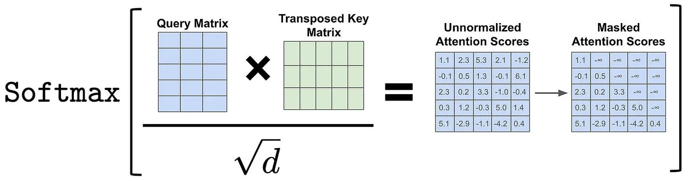
*在因果自注意力中掩盖注意力分数*

掩码自注意力在实践中的实现方式与双向自注意力类似。一旦查询和键矩阵被相乘，我们就有了一个大小为 `[T, T]` 的注意力矩阵，其中包含每个 token 在整个序列上的注意力分数。然而，在对这个矩阵的每一行执行 softmax 操作之前，我们可以把注意力矩阵对角线之上的所有值设为负无穷；见上图。通过这样做，我们确保对于每个 token，在 softmax 操作被应用之后，序列中所有跟在这个 token 之后的 token 都被赋予零的注意力分数。换句话说，*我们掩盖每个 token 的注意力分数，以排除序列中任何未来的 token*。

**注意力头。** 我们到目前为止所描述的注意力操作使用 softmax 来归一化在序列上计算出的注意力分数。尽管这种做法形成了一个有效的概率分布，它也限制了自注意力聚焦于序列中多个位置的能力——*这个概率分布很容易被一个（或几个）词主导*。为了解决这个问题，我们通常在多个"头"上并行地计算注意力；见下图。

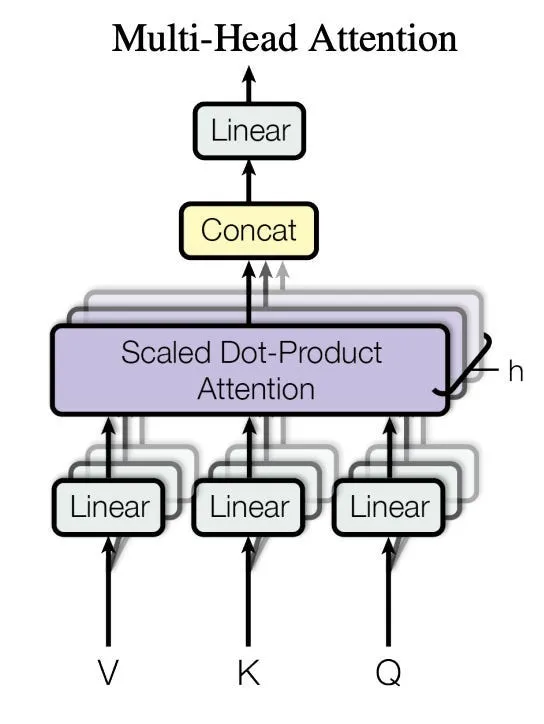
*（来自 [1]）*

在每个头内部，掩码注意力操作是相同的。然而，我们 *i)* 为每个头使用独立的键、查询和值投影，并且 *ii)* 减小键、查询和值向量的维度，以保持计算成本合理。通常，我们会把这些向量的维数从 `d` 改为 `d // H`，其中 `H` 是注意力头的数量。使用这种做法，每个注意力头都能学习一个独特的表示子空间，并聚焦于底层序列的不同部分。此外，我们通过减小每个注意力头所用向量的维度来避免增加的计算成本。

最后，对于多头自注意力，还有一个我们必须考虑的细节：*我们如何组合每个头的输出？* 嗯，有各种不同的选项（例如，拼接、平均、投影等等）。然而，多头自注意力的普通实现通常会：

-   拼接每个头的输出。
-   线性投影那个拼接后的输出。

因为每个注意力头输出维度为 `d // H` 的 token 向量，所有注意力头拼接后的输出具有维度 `d`（即，与注意力层的输入维度相同）。

### 在 PyTorch 中实现因果自注意力

[https://gist.github.com/wolfecameron/26863dbbc322b15d2e224a2569868256#file-causal\_self\_attention-py](https://gist.github.com/wolfecameron/26863dbbc322b15d2e224a2569868256#file-causal_self_attention-py)

如果我们已经理解了到目前为止的讨论，掩码、多头自注意力的实现（完整代码如上所示）应该相当容易跟上！首先，我们使用 PyTorch 里一个简单的线性层来执行键、查询和值的投影。我们可以用单个线性层为所有自注意力头执行键、查询和值的投影！这一层接收一个维度为 `d` 的 token 嵌入序列作为输入，并产出大小为 `3 * d` 的 token 嵌入作为输出。从这里开始，我们可以把输出拆分成 `d` 维的键、查询和值向量序列。然后，每个 `d` 维向量可以被重塑成 `H` 个更小的向量——*每个注意力头一个*——并且我们可以 [转置](https://en.wikipedia.org/wiki/Transpose) 这个张量，得到一个形状为 `[B, H, T, d // H]` 的输出，其中 `B` 是正在被处理的那一批里的序列数量；见下方。

```
q, k, v  = self.c_attn(x).split(self.d, dim=2)
k = k.view(B, T, self.H, self.d // self.H).transpose(1, 2)
q = q.view(B, T, self.H, self.d // self.H).transpose(1, 2)
v = v.view(B, T, self.H, self.d // self.H).transpose(1, 2)
```

从这里开始，我们可以使用基本的矩阵/张量乘法，在每个头内部以及在整个批次上计算所有 token 之间的注意力分数。首先，我们把查询张量乘以键矩阵的转置，从而计算出大小为 `[B, H, T, T]` 的未归一化注意力矩阵。然后我们把这个结果除以 `sqrt(d)`，并在最后一个维度上应用 softmax，从而把每个 token 在序列上的注意力分数变换成一个概率分布。然而，在 softmax 之前，我们把注意力矩阵对角线之上的所有条目填上一个负无穷的值；见下方。

```
att = (q @ k.transpose(-2, -1)) * (1.0 / math.sqrt(k.size(-1)))
att = att.masked_fill(self.mask[:,:,:T,:T] == 0, float('-inf'))
att = F.softmax(att, dim=-1)
att = self.attn_dropout(att)
```

我们还可以选择性地对注意力分数执行 dropout \[2\]，这已被证明能正则化训练过程并改善泛化。一旦注意力矩阵被计算出来，我们就可以通过把注意力矩阵与值矩阵相乘来推导出自注意力的最终输出，这会基于注意力分数对每个 token 取值向量的一个加权平均。这个计算的结果是一个大小为 `[B, H, T, d // H]` 的张量，但我们可以简单地通过转置并重塑这个张量使其大小变为 `[B, T, d]` 来拼接每个注意力头的输出；见下方。

```
y = att @ v
y = y.transpose(1, 2).contiguous().view(B, T, self.d)
y = self.resid_dropout(self.c_proj(y))
```

最后，我们对这个拼接后的输出执行最后一次线性投影（可选地带 dropout），以得到我们的最终结果，如上面的代码所示。

## 仅解码器 Transformer 块

仅解码器 transformer 架构由若干个结构相同、按序堆叠的"块"构成。在这些块中的每一个内部，有两个主要组件：

1.  掩码、多头自注意力。
2.  一个前馈变换。

此外，我们通常用一个残差连接和一个归一化层把这些组件包裹起来。在本节中，我们将更详细地讨论这个块结构，并提供一个 PyTorch 里的具体实现。

### 层归一化

尽管 [高性能 GPU](https://www.nvidia.com/en-us/data-center/h200/) 和模型架构的进步可能让我们觉得不是这样，但 *训练大型、深层的神经网络并不总是一件轻而易举的事*！早期训练带有许多层的神经网络的尝试大多不成功，原因是 [梯度消失、爆炸和不稳定](http://neuralnetworksanddeeplearning.com/chap5.html) 的问题。已经有若干进展被提出来解决这些问题：

-   更好的权重初始化方法（例如，[Xavier](https://www.geeksforgeeks.org/xavier-initialization/) 或 [He](https://www.geeksforgeeks.org/kaiming-initialization-in-deep-learning/) 初始化）。
-   用 [ReLU](https://pytorch.org/docs/stable/generated/torch.nn.ReLU.html) \[5\] 替换 [sigmoid](https://pytorch.org/docs/stable/generated/torch.nn.Sigmoid.html) 激活函数（即，这能让激活函数里的梯度不至于变得非常小）。
-   归一化神经网络的中间激活值 \[6\]。

在本节中，我们将聚焦于上面提到的最后一个进展——*归一化*。归一化背后的动机相当简单。一个深层神经网络的中间激活值可能会变得不稳定（即，非常大或非常小），因为我们反复地把它们乘以一个模型参数矩阵。例如，如果我们运行下面的 PyTorch 代码片段，我们会看到一连串重复同一个（随机）矩阵乘法许多次，会导致我们输出的值变得大得难以置信！

[https://gist.github.com/wolfecameron/f9cb6645dc87a165ce3a7fae980610a4#file-exploding\_activations-py](https://gist.github.com/wolfecameron/f9cb6645dc87a165ce3a7fae980610a4#file-exploding_activations-py)

为了解决这个问题，我们可以在每次矩阵乘法之间归一化激活值，让激活值随时间保持稳定。这正是神经网络里归一化层所使用的想法。让我们看看几个存在的流行归一化变体。

**归一化变体。** 取决于所用的领域和架构，有若干归一化技术是我们可以采用的。两种最常见的归一化形式是：

-   批归一化（Batch Normalization）\[6\]
-   层归一化（Layer Normalization）\[7\]

这些技术相当相似。对于它们两个，我们都只是使用下面所示的等式来变换激活值。它们之间的区别在于我们选择如何计算均值和标准差。

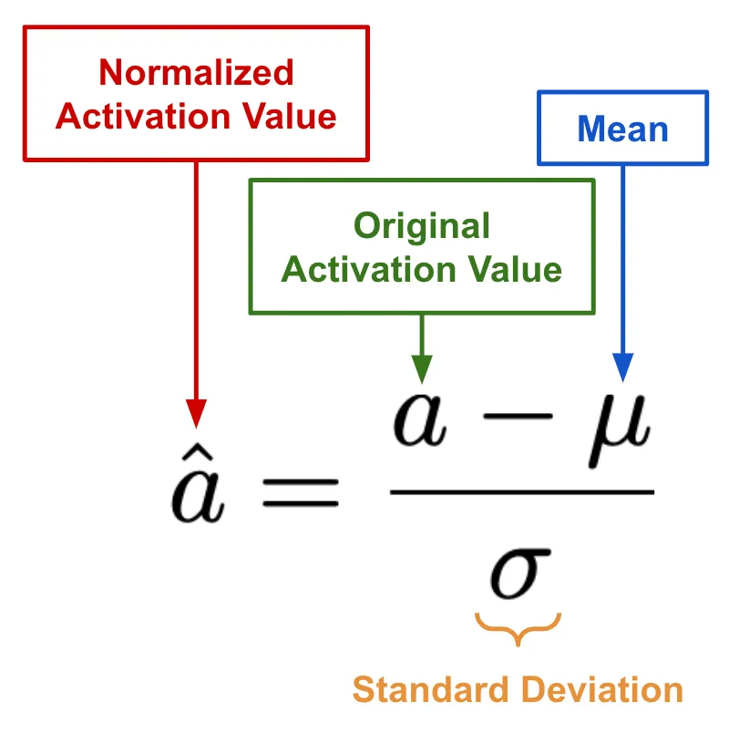
*归一化的标准等式*

批归一化——*正如其名字所示*——在整个 mini-batch 上计算一个按维度划分的均值和标准差；见下方。尽管这种做法运作良好，它受限于一个事实：我们必须处理一个足够大的输入 mini-batch 才能得到对均值和方差的一个可靠估计。这在推理时会成为一个问题，在推理时一次只处理少量输入样本是很常见的。出于这个原因，我们必须在训练期间计算一个均值和标准差的运行估计，以供推理时使用。尽管如此，批归一化被广泛使用，并且是计算机视觉应用中归一化技术的标准选择。

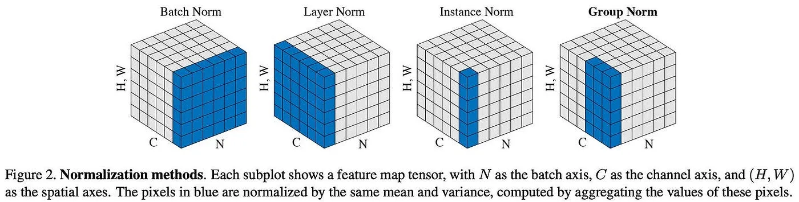
*（来自 [8]）*

层归一化通过在输入的最后一个维度上计算均值和标准差，消除了批归一化对批维度的依赖。在仅解码器 transformer 的情形下，这意味着我们在嵌入维度上计算归一化统计量；见上方。

目前，批归一化通常用于计算机视觉任务，而层归一化是自然语言处理任务的标准。原始的 transformer 架构在它的实现里采用了层归一化 \[10\]，而这个选择自那以后就一直是 transformer 的一个标准。然而，层归一化也曾被更早的语言模型——*那些基于循环神经网络的模型*——在 transformer 被提出之前使用过。

**仿射变换。** 深层网络里的归一化层通常还会与一个仿射变换结合。这听起来可能很复杂，但它只是意味着我们按下面等式所示来修改层归一化。在归一化激活值之后，我们把它乘以一个常数 γ，并且加上一个常数 β。这两个常数都是可学习的，并被当作普通的模型参数一样对待。此外，我们在下面看到，层归一化在分母里使用了一个稍微修改过的标准差形式，它纳入了一个小的、固定的常数 ε，以避免除以零的问题。

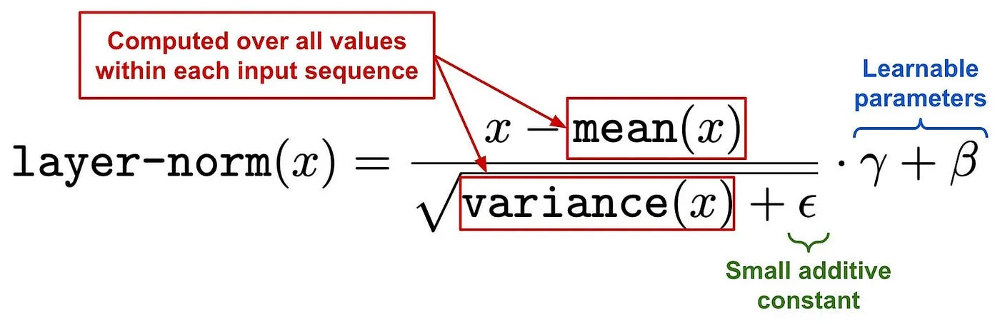
*带仿射变换的层归一化*

层归一化在 PyTorch 中已被实现，可以轻松地通过 [对应的模块](https://pytorch.org/docs/stable/generated/torch.nn.LayerNorm.html) 或它的 [函数式形式](https://pytorch.org/docs/stable/generated/torch.nn.functional.layer_norm.html) 访问。

### 前馈变换

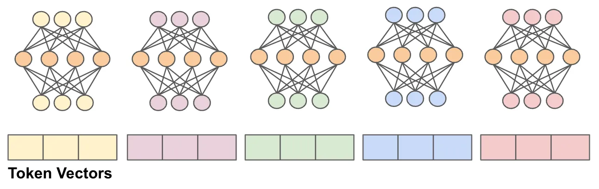
*一个逐点前馈变换的示意描绘*

每个仅解码器 transformer 块都包含一个逐点前馈变换；见上方。这个变换让它输入中的每一个 token 向量都通过一个小型的前馈神经网络。这个神经网络由两个线性层构成——*带可选的偏置*——它们被一个非线性激活函数分隔开。这个神经网络的隐藏维度通常要大于——*在 GPT \[3\]、GPT-2 \[4\] 和许多其他 LLM 的情形下要大 4 倍*——它作为输入接收的那个 token 向量的维度。

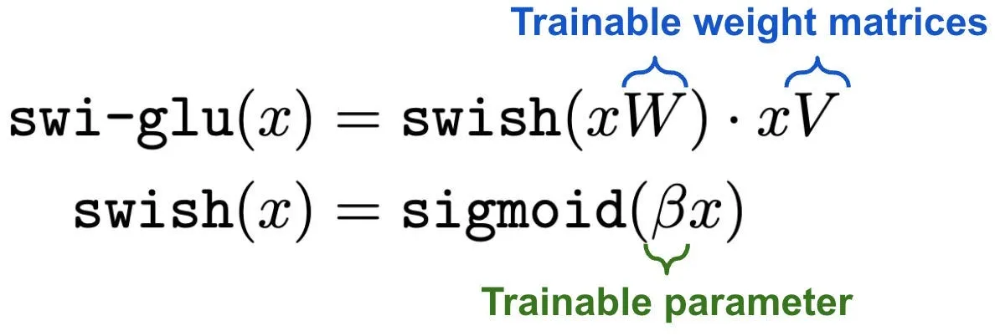
*SwiGLU 激活函数*

**激活函数。** *我们应该在一个 LLM 的前馈层里使用哪个激活函数？* 在 \[13\] 中，作者比较了众多激活函数的性能，发现在给定固定的计算量下，SwiGLU 激活（如上所示）产出最佳性能。出于这个原因，SwiGLU 被像 [LLaMA-2](https://cameronrwolfe.substack.com/p/llama-2-from-the-ground-up) \[11\] 和 [OLMo](https://cameronrwolfe.substack.com/p/dolma-olmo-and-the-future-of-open) \[12\] 这样的流行 LLM 普遍使用。然而，并非所有 LLM 都使用 SwiGLU；例如，Falcon \[14\] 和 Gemma \[15\] 都使用 [GeLU](https://pytorch.org/docs/stable/generated/torch.nn.GELU.html)。

[https://gist.github.com/wolfecameron/3ed9274a0297aab403b5e2d2254ee0ac#file-transformer\_ffnn-py](https://gist.github.com/wolfecameron/3ed9274a0297aab403b5e2d2254ee0ac#file-transformer_ffnn-py)

**在 PyTorch 中的实现。** 实现一个 transformer 块的前馈组件很简单；见上方。我们只需要几个 [线性层](https://pytorch.org/docs/stable/generated/torch.nn.Linear.html)，中间夹一个激活函数。在上面的实现里，一个大小为 `[B, T, d]` 的输入被提供给第一个线性层，它有一个为 `d` 的输入维度和一个为 `h = 4 * d` 的输出维度。第一个线性层对这个输入里所有 `d` 维向量执行一次 [批量矩阵乘法](https://pytorch.org/docs/stable/generated/torch.bmm.html)，乘以一个大小为 `d x h` 的矩阵，形成一个大小为 `[B, T, h]` 的输出。从这里开始，我们对这个输出应用非线性激活函数，并把它传过下一个线性层，它有一个为 `h` 的输入维度和一个为 `d` 的输出维度。最后，我们可以（可选地）对第二个线性层的输出应用 dropout，它的大小为 `[B, T, d]`，以在训练期间正则化模型。

### 残差连接

我们通常在 transformer 块的每一个自注意力子层和前馈子层之间添加残差连接。残差连接的概念最初是由 [ResNet 架构](https://arxiv.org/abs/1512.03385) \[16\] 提出的，它是一个被广泛使用的（且著名的）卷积神经网络架构，用于像图像分类和目标检测这样的计算机视觉任务。残差连接在概念上很容易理解。我们不是仅仅把神经网络激活值传过网络里的一个层，而是 *i)* 存储这个层的输入，*ii)* 计算这个层的输出，并且 *iii)* 把这个层的输入加到这个层的输出上；见下方。

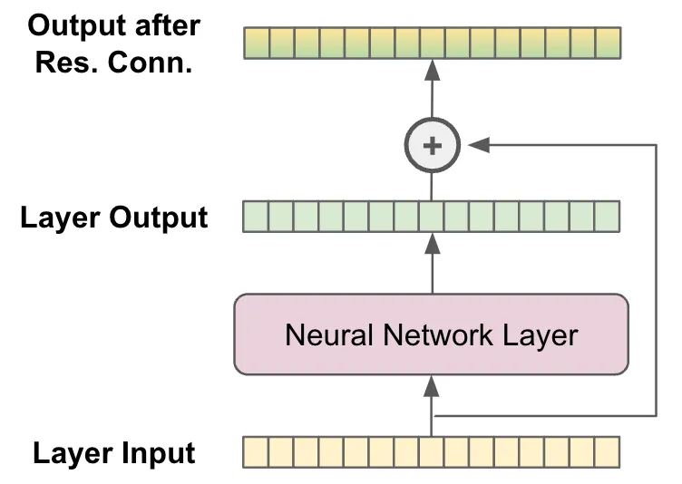
*一个带残差连接的通用神经网络层*

残差连接是一个通用的想法，可以应用于任何不改变输入维度的神经网络层。通过添加残差连接，我们可以缓解梯度消失和爆炸的问题，并改善训练过程的整体便捷性和稳定性。残差连接提供了一条"捷径"，让梯度在反向传播期间能够自由地流过网络。残差连接的好处已经在深度学习文献中被广泛地探索和分析，引出了关于它们用处的各种有趣的直觉 \[17, 18, 19\]。

### 把它们全部拼到一起！

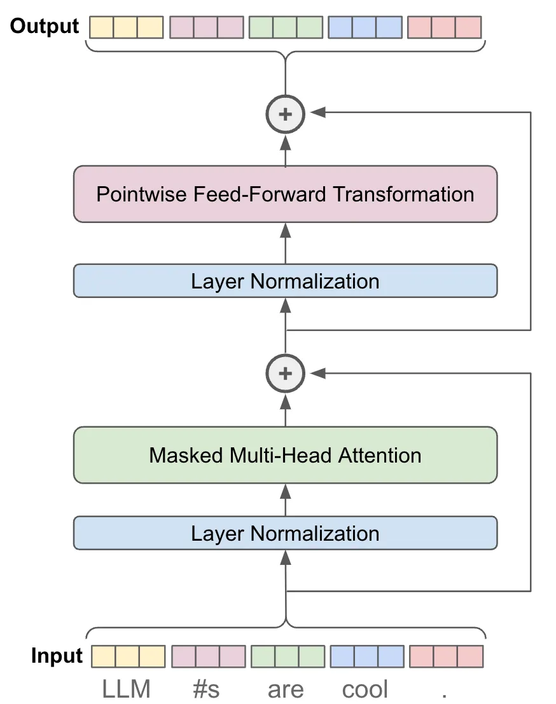
*一个仅解码器 transformer 块*

要构建一个完整的仅解码器 transformer 块，我们必须使用我们到目前为止谈过的所有组件：

-   掩码、多头自注意力
-   层归一化
-   逐点前馈变换
-   残差连接

一个仅解码器 transformer 块的布局如上图所示。正如我们很快将学到的，这个块的确切布局可能会取决于实现而改变。然而，上面的示意图与大多数 GPT 风格 LLM 所用的仅解码器 transformer 块的普通结构相匹配。这同一个仅解码器 transformer 块结构在下面用 PyTorch 实现了出来。

[https://gist.github.com/wolfecameron/0ad044748283c90b4d3002bdc5dbc674#file-decoder\_only\_block-py](https://gist.github.com/wolfecameron/0ad044748283c90b4d3002bdc5dbc674#file-decoder_only_block-py)

## 仅解码器 Transformer

我们现在将看看完整的仅解码器 transformer 架构，它主要由我们到目前为止见过的构件组成。然而，有几个额外的细节我们必须涵盖，比如构造模型的输入，以及使用模型的输出来预测/生成文本。与自注意力相比，这些细节相对简单易懂，但涵盖它们对于得到一个仅解码器 transformer 架构如何运作的完整图景是必要的。

### 构造模型的输入

正如前面所概述的，一个 transformer 块的输入预期是一个（成批的）token 向量序列，通常以一个形状为 `[B, T, d]` 的张量的形式出现。然而，LLM 通常以一个文本提示的形式接收输入。*我们如何把这个文本提示转换成一个 token 向量序列？*

**分词。** transformer 接收原始文本作为输入。处理这个文本的第一步是对它分词，或者说把它转换成一系列离散的词或子词。这些词和子词通常被称为 token；见下方。

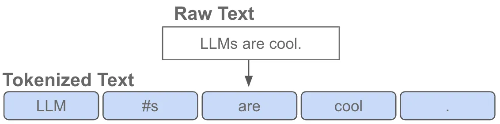
*把原始文本转换成一个 token 序列*

分词过程由模型的分词器处理，它使用像字节对编码（Byte-Pair Encoding，BPE）\[20\]、SentencePiece \[21\] 或 WordPiece \[22\] 这样的算法来把文本拆成 token 序列；更多细节见 [此处](https://huggingface.co/docs/transformers/en/tokenizer_summary)。分词器有一个固定大小的词表——*通常包含大约 50K 到 300K 个唯一的 token*——它定义了可以从一段原始文本序列里形成的那组已知 token。分词器有它自己的训练流水线，用以推导出它底层的词表，并且通常实现两个主要的函数：

-   *Encode*：把一个字符串转换成一个 token 序列
-   *Decode*：把一个 token 序列转换成一个字符串

分词是 LLM 训练和使用中一个常常被忽视的方面。然而，*未能调查和理解一个 LLM 的分词过程是一个巨大的错误*！分词是创建模型输入的第一步，因此，对下游模型的性能有巨大的影响。一个 LLM 的问题常常可以被追溯回分词过程里那些难以察觉的微妙 bug。因此，我会强烈鼓励感兴趣的读者更深入地钻研分词过程。要对 BPE 分词器——*LLM 最常用的分词器*——有一个深入而实用的概览，请查看 [Andrej Karpathy](https://karpathy.ai/) 最近发布的视频，见 [此处](https://www.youtube.com/watch?v=zduSFxRajkE)。

**Token 嵌入。** 一旦我们对文本进行了分词并形成了一个 token 序列，我们必须把这些 token 中的每一个转换成一个对应的嵌入向量。要做到这一点，我们创建一个 [嵌入层](https://pytorch.org/docs/stable/generated/torch.nn.Embedding.html)，它是仅解码器 transformer 模型的一部分。这个嵌入层只是一个有 `d` 列和 `V` 行的矩阵，其中 `V` 是分词器词表的大小。词表里的每个 token 都关联着一个整数索引，对应于这个嵌入矩阵里的一行。我们可以简单地通过在这个嵌入层里查找该 token 的条目来把 token 转换成一个 `d` 维的嵌入；见下方。

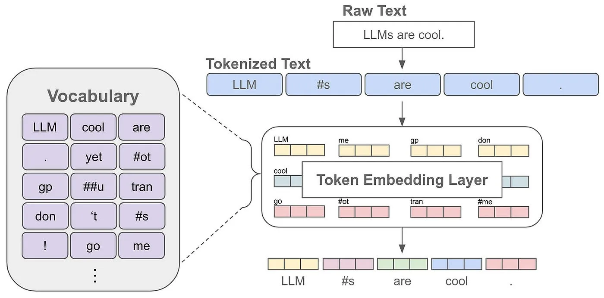
*在一个嵌入层里查找 token 嵌入*

这个嵌入层在 LLM 的训练过程中像任何其他模型参数一样被训练！token 嵌入不是固定的，而是从数据中学到的。

**位置嵌入。** 现在，我们已经把我们的原始文本转换成了一个 token 向量序列。如果我们对一整批文本序列这样做，我们就会有我们的 transformer 块所预期的大小为 `[B, T, d]` 的输入。然而，有一个最后的步骤我们需要执行——*位置嵌入*。

> "由于我们的模型不包含循环也不包含卷积，为了让模型能利用序列的顺序，我们必须注入一些关于序列中 token 的相对或绝对位置的信息。" *— 来自 \[1\]*

在研究自注意力机制时，我们可能会注意到，在计算输出时并没有考虑每个 token 在序列中的位置！然而，一段文本序列里词的顺序显然是重要的（例如，*"I have to read this book."* 对 *"I have this book to read."*）。因此，我们需要某种方式把位置信息注入到自注意力过程中。在 \[1\] 中，这是通过把维度为 `d` 的位置嵌入加到模型输入里的每个 token 上来完成的。因为序列里的每个位置都有一个唯一的位置嵌入，每个 token 的位置都能被区分开来。

与 token 嵌入类似，我们可以把位置嵌入存储在一个嵌入层里，并在 LLM 的训练过程中从数据里学习它们——*这种做法实现起来很简单*。或者，我们可以通过某个规则或等式生成固定的 token 嵌入。在 \[1\] 中，位置嵌入是使用正弦和余弦函数生成的，如下图所示。

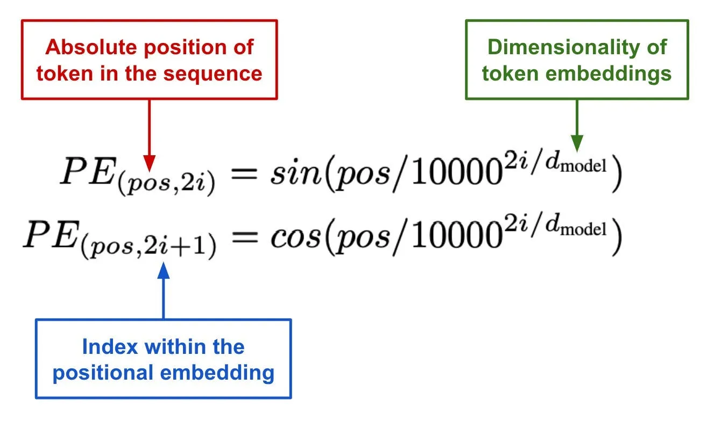
*用正弦和余弦函数生成位置嵌入（来自 [1]）*

这些做法被称为"绝对"位置嵌入策略，因为所用的嵌入是由 token 在序列中的绝对位置决定的。正如我们将在本文后面看到的，绝对位置嵌入策略未能泛化到比训练期间所见更长的序列上，这引出了更具泛化能力的策略的提出。

### 完整的仅解码器 Transformer 模型

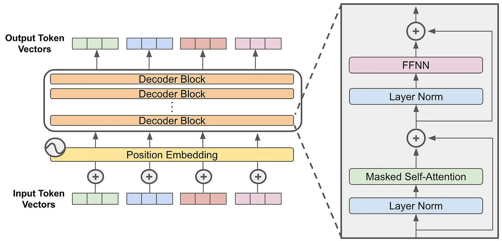
*一个仅解码器 transformer 模型的结构*

一旦我们构造了模型的输入，我们只需把这个输入传过一连串仅解码器 transformer 块；见上方。transformer 块的总数取决于模型的大小；例如，OLMo-7B \[12\] 有 32 层，而 OLMo-65B 有 80 层；见下方。transformer 块保留它们输入的大小，所以模型主体的输出——*包括所有 transformer 块*——是一个与输入大小相同的 token 向量序列。

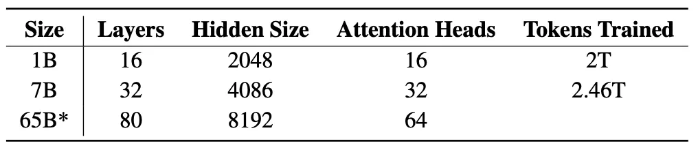
*OLMo LLM 的规格（来自 [12]）*

增加底层 LLM 里 transformer 块/层的数量，是增加模型大小的主要方式之一。或者，我们可以增大 `d`（即，token 嵌入的维度）的值，这会增大模型里所有注意力层和前馈层的权重矩阵的大小。如上所示，我们通常通过同时增加 *i)* 层的数量和 *ii)* 隐藏维度来扩大一个仅解码器 transformer 的大小。常常，我们还会增加每个注意力层里头的数量，但如果我们假设每个注意力头都有一个为 `d // H` 的维度，这并不影响模型里的参数数量。

**分类头。** 最后，仅解码器 transformer 架构有一个我们必须考虑的最后细节。一旦我们把我们的输入序列传过模型的主体，我们就接收到一个大小相同的 token 向量序列作为输出。要生成文本或执行下一个 token 预测（关于这个过程的更多细节见 [此处](https://cameronrwolfe.substack.com/p/language-model-training-and-inference)），我们把每个 token 向量转换成一个在潜在的下一个 token 上的概率分布。要做到这一点，我们可以在模型的末尾添加一个额外的线性层，它有一个为 `d` 的输入维度和一个为 `V`（即，词表的大小）的输出维度，它充当一个分类头；见下方。

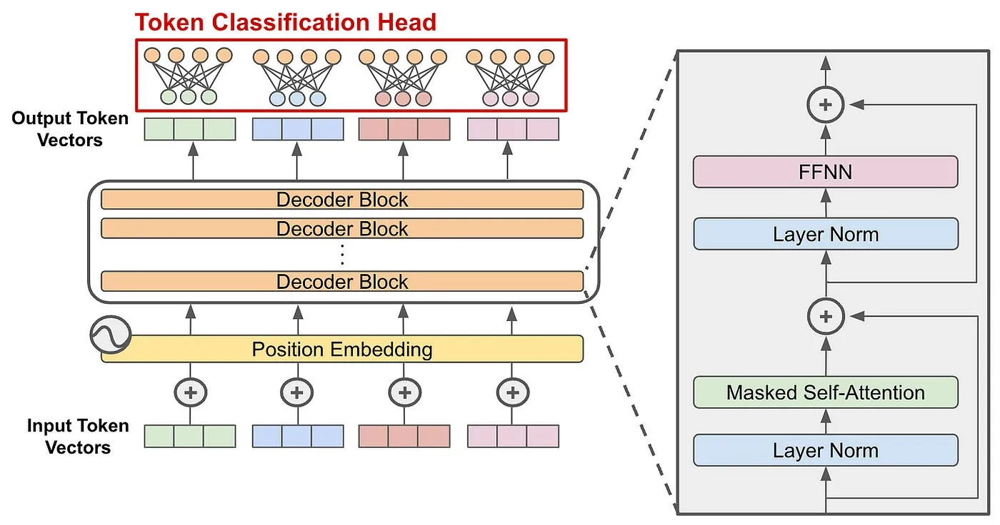
*给仅解码器 transformer 添加一个分类头*

使用这个线性层，我们可以把我们输出里的每个 token 向量转换成一个在 token 词表上的概率分布。从这个在 token 上的概率分布，我们可以执行：

-   *下一个 token 预测*：LLM 的预训练目标，它使用一个 [交叉熵损失函数](https://pytorch.org/docs/stable/generated/torch.nn.CrossEntropyLoss.html) 训练模型为输入序列里的每一个 token 预测下一个 token。
-   *推理*：基于模型生成的 token 分布，自回归地采样最佳的下一个 token 来生成。

[https://gist.github.com/wolfecameron/f574c5c9a61f3b3a045b2cbd9593cfd7#file-gpt-py](https://gist.github.com/wolfecameron/f574c5c9a61f3b3a045b2cbd9593cfd7#file-gpt-py)

**完整架构（在 PyTorch 中）。** 仅解码器 transformer 架构的完整实现被描绘在上方。考虑到我们已经讨论过这个架构的每一个组件，上面的代码应该相对直截了当。所做的唯一修改是：

1.  在把 token 和位置嵌入作为输入传给第一个仅解码器 transformer 块之前，对它们应用 dropout。
2.  添加一个最后的层归一化模块，它在分类头之前对仅解码器 transformer 块的输出进行归一化。

一旦我们把我们的输入传过所有仅解码器 transformer 块，我们既可以把所有输出 token 嵌入传过线性分类层，让我们能在整个序列上应用一个下一个 token 预测损失（即，在预训练期间做的事）。或者，我们可以只把最后一个输出 token 嵌入传过线性分类层，让我们能采样要包含在模型生成输出里的下一个 token（即，在推理期间做的事）。

## 该架构的现代变体

既然我们理解了仅解码器 transformer 架构，我们就可以看看现代 LLM 所使用的这个架构的一些变体。在大多数情况下，仅解码器 transformer 的核心细节被保留了下来。然而，最近对生成式 LLM 兴趣的激增，已经产生了对仅解码器 transformer 的各种有用修改，这些修改改善性能、提升速度（在训练和推理期间都是）、让训练过程更稳定、让模型能处理更长的输入序列，等等。

### Transformer 块布局

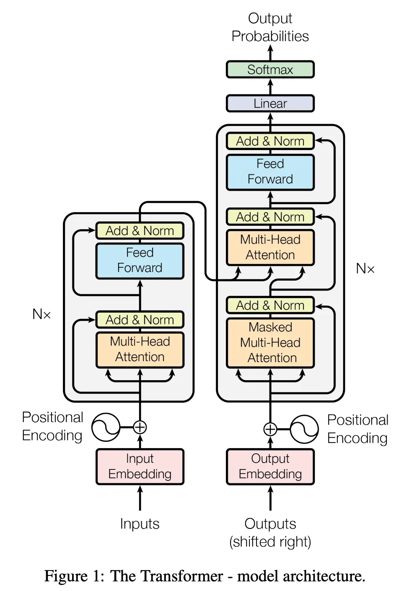
*（来自 [1]）*

我们到目前为止见过的仅解码器 transformer 块的布局是标准的 transformer 块配置。然而，这个块里归一化操作的顺序可能会取决于实现而改变。例如，我们可以在上图中看到，在原始的 transformer 架构 \[1\] 里，层归一化操作被描绘为出现在注意力层和前馈层之后。此外，*有些架构在两个位置都执行归一化*；例如，Gemma \[15\] 对每个 transformer 子层的输入和输出都进行归一化，如下面所解释的。

> "我们对每个 transformer 子层的输入和输出都进行归一化，这偏离了只归一化其中一个或另一个的标准做法。" *— 来自 \[15\]*

**并行块。** 文献中也探索了一些替代的块结构。例如，Falcon \[14\] 和 PaLM \[24\] 使用一个并行的 transformer 块结构，它把输入并行地传过注意力层和前馈层，而不是按序传过；见下方。这种做法减轻了分布式训练的通信成本，并且两个模型都发现它不会产生可察觉的性能退化。

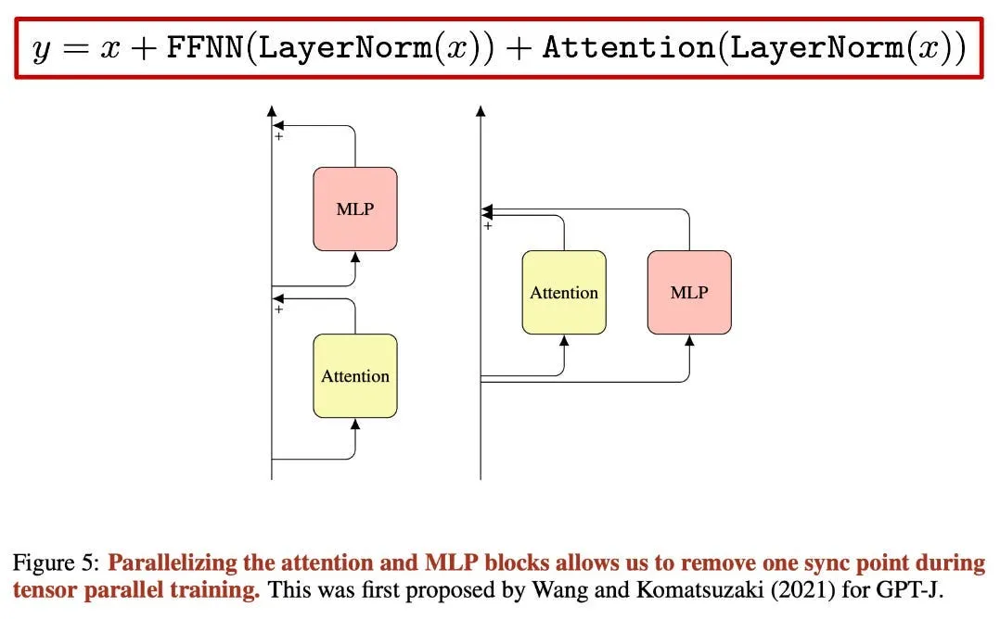
*（来自 [14]）*

### 归一化策略

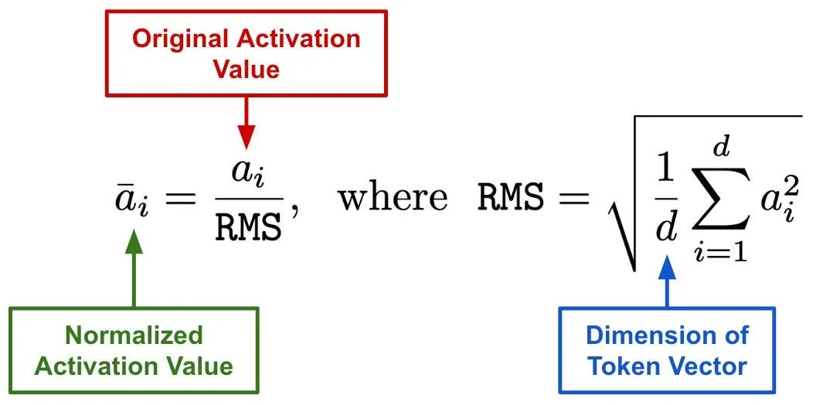
*RMSNorm 的公式表述*

除了改变 transformer 块里归一化层的确切位置之外，所用的归一化策略也在不同模型之间有所不同。虽然大多数模型使用层归一化，**均方根层归一化（Root Mean Square Layer Normalization）\[29\]**（简称 [RMSNorm](https://github.com/bzhangGo/rmsnorm)！）也很流行。RMSNorm，其公式表述如上所示，只是层归一化的一个简化版本，它已被证明能改善训练稳定性和泛化。此外，RMSNorm 尽管表现相似，却比层归一化高效 10–50%，这引得像 LLaMA \[30\] 和 LLaMA-2 \[11\] 这样的模型采用这种做法。

**更好的层归一化。** 更进一步，某些 LLM 采用了层归一化的修改形式。例如，MPT \[26\] 模型使用 [低精度层归一化](https://docs.mosaicml.com/projects/composer/en/latest/method_cards/low_precision_layernorm.html) 来改善训练期间的硬件利用率，尽管这种做法在罕见的情况下可能会导致损失尖峰出现。类似地，许多 LLM（例如，OLMo \[12\]、LLaMA-2 \[11\] 和 PaLM \[24\]）排除了层归一化里的偏置项；见下方。事实上，*这些模型中的许多还彻底排除了 transformer 所有层里的偏置*！排除 transformer 里的偏置项维持或改善了 LLM 的性能，并产生一个（适度的）加速。

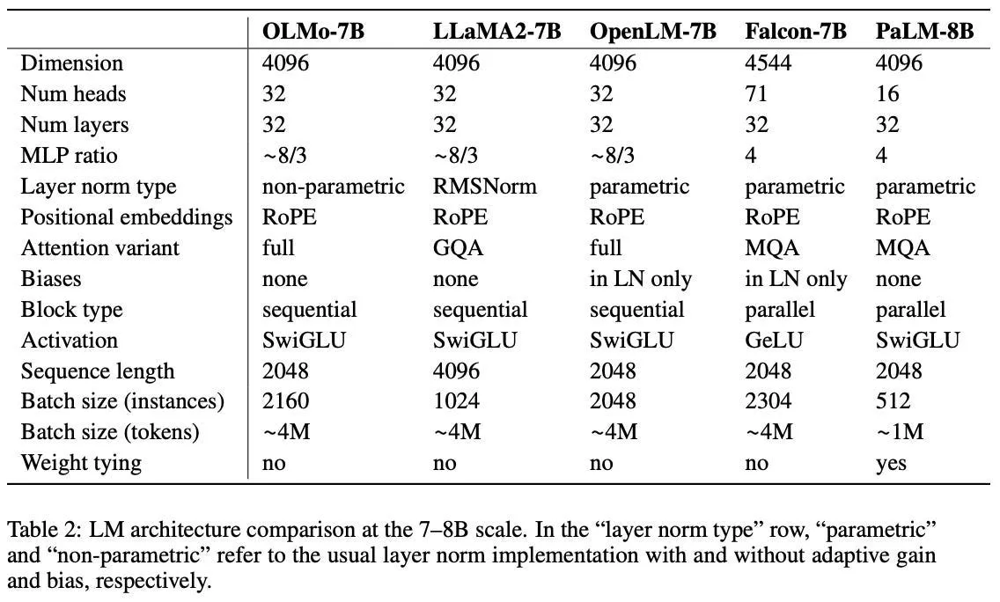
*（来自 [12]）*

### 高效的（掩码）自注意力

尽管自注意力是 transformer 架构的基础，这个操作有些低效——*它是一个* `O(N^2)` *操作*！出于这个原因，大量高效的注意力变体被提了出来；[Reformer](https://arxiv.org/abs/2001.04451)、[SMYRF](https://arxiv.org/abs/2010.05315) 和 [Performer](https://arxiv.org/abs/2009.14794) 仅举几例。这些技术中的许多在理论上把自注意力的复杂度降低到 `O(N)`，但它们 *在实践中未能取得可衡量的加速*。为了解决这个问题，**FlashAttention \[25\]** 以一种高效且 IO 感知的方式重新表述了自注意力操作；见下方。

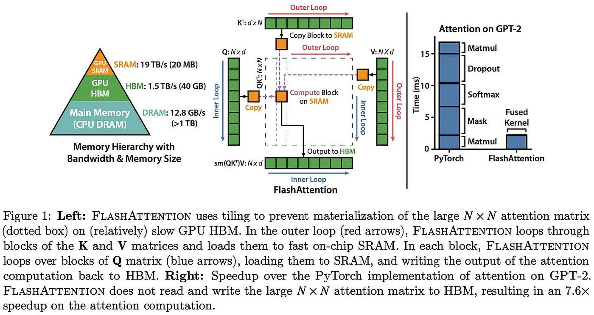
*（来自 [25]）*

FlashAttention 的内部运作大多与硬件相关；更多细节见 [此处](https://shreyansh26.github.io/post/2023-03-26_flash-attention/)。然而，其结果是一个对自注意力操作的直接替换品（drop-in replacement），它有各种了不起的好处：

-   把 BERT-large 的训练时间加速 15%。
-   为 LLM 启用更长的上下文长度（由于更好的内存效率）。

在 [PyTorch 2.0 发布](https://pytorch.org/blog/accelerated-pytorch-2/) 之后，缩放点积注意力——*这是我们在本文中学到的那个自注意力变体*——可以被替换成 FlashAttention 以改善效率！出于这个原因，许多近期的 LLM（例如，Falcon \[14\] 和 MPT \[26\]）使用 FlashAttention。此外，这个领域里仍有活跃的研究在被发表，这已经产生了一些有趣的发展：

1.  [FlashAttention-2](https://arxiv.org/abs/2307.08691)：修改 FlashAttention，以在效率上产生进一步的提升。
2.  [FlashDecoding](https://pytorch.org/blog/flash-decoding/)：FlashAttention 的一个扩展，它在训练效率之外还聚焦于改善推理效率。

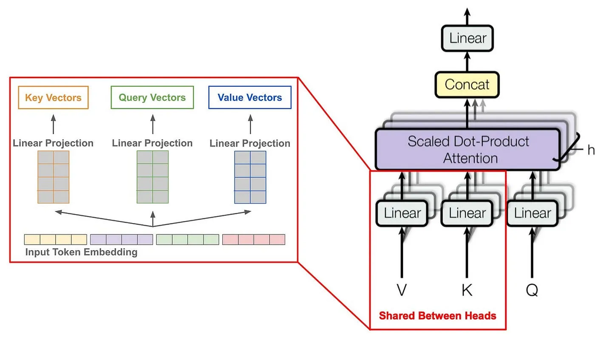
*多查询注意力在注意力头之间共享键和值投影（来自 [1]）*

**多查询和分组查询注意力。** 在 FlashAttention 之外，若干近期的 LLM（例如，[Gemini](https://cameronrwolfe.substack.com/p/google-gemini-fact-or-fiction) \[27\]、Falcon \[14\] 和 PaLM \[24\]）使用多查询注意力，这是一种高效的自注意力实现，它在一层里的所有注意力头之间共享键和值投影；见上方。它不是为每个头执行一个独立的投影，而是所有头共享同一个键的投影矩阵和同一个值的投影矩阵。这个改变并不会让训练变快，但它显著地改善了所得到的 LLM 的推理速度。

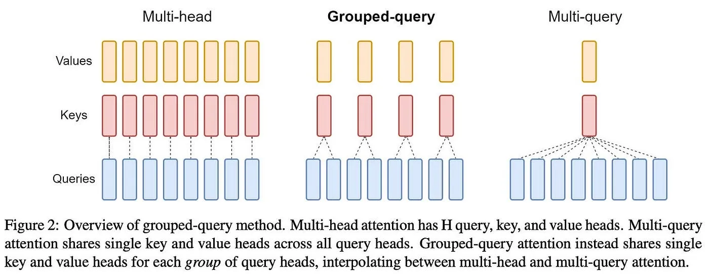
*（来自 [28]）*

不幸的是，多查询注意力可能会导致性能的轻微恶化，这引得一些 LLM（例如，LLaMA-2）去寻找替代方案。分组查询注意力（GQA）\[28\] 不是在注意力头之间共享所有的键和值投影，而是把 `H` 个总的自注意力头划分成组，并在同一个组内共享键/值投影；见上方。这种做法是普通多头自注意力和多查询注意力之间的一个插值，后者在所有 `H` 个头之间使用一个共享的键和值投影。有趣的是，*GQA 维持了普通多头因果自注意力的性能，并取得了与多查询注意力相当的效率*。

### 更好的位置嵌入

> "我们发现，使用正弦位置嵌入的 transformer 语言模型（LM）有非常弱的外推能力。" *— 来自 \[31\]*

我们到目前为止学到的位置嵌入技术，使用由每个 token 在序列中的绝对位置决定的加性位置嵌入。尽管这种做法很简单，它限制了模型泛化到比训练期间所见更长的序列的能力。结果是，如果我们需要在推理时接受更长的输入，我们必须在更长的序列上预训练 LLM（即，这可能相当昂贵）。出于这个原因，各种替代的位置编码方案被提了出来，包括 [相对位置](https://jaketae.github.io/study/relative-positional-encoding/) 嵌入，它只考虑 token 之间的距离而不是它们的绝对位置。在这里，我们将研究两种最常用的、把位置信息注入到 LLM 里的策略——*RoPE \[23\] 和 ALiBi \[31\]*。

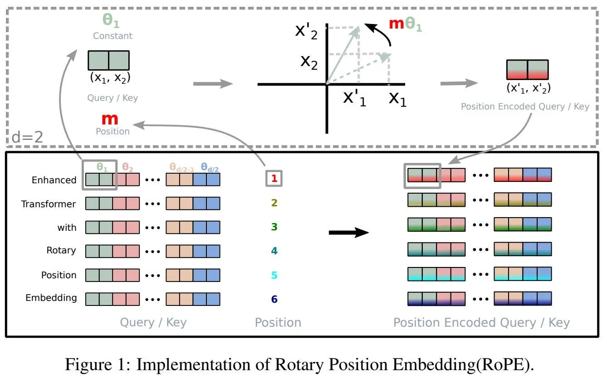
*（来自 [23]）*

**旋转位置嵌入（Rotary Positional Embeddings，RoPE）\[23\]** 是绝对位置嵌入和相对位置嵌入的一个混合体，它通过以下方式把位置纳入自注意力：

1.  用一个 [旋转矩阵](https://en.wikipedia.org/wiki/Rotation_matrix) 编码绝对位置。
2.  把相对位置信息直接加到自注意力操作里。

值得注意的是，RoPE 在 transformer 的每一层注入位置信息，而不是仅仅在模型的输入序列里。这种做法被发现能在绝对位置信息和相对位置信息之间产生一个平衡，提供扩展到更长序列长度的灵活性，并且具有随相对距离增加而衰减的 token 间依赖性（即，相距很远的 token 彼此付出更少的注意力）。RoPE 最近越来越流行，引出了它在像 PaLM \[24\]、Falcon \[14\]、OLMo \[12\]、LLaMA/LLaMA-2 \[11, 30\] 等流行 LLM 中的使用！

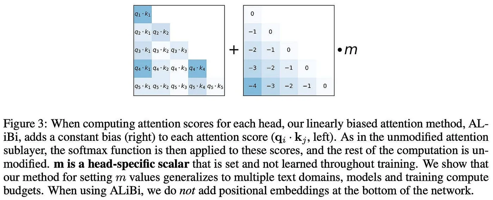
*（来自 [31]）*

**带线性偏置的注意力（Attention with Linear Biases）\[31\]** 是一种后续技术，被提出来改善位置嵌入策略的外推能力。ALiBi 不使用位置嵌入，而是通过在 transformer 的每一层向注意力矩阵添加一个静态的、非学习的偏置，把位置信息直接纳入自注意力；见上方。我们正常地计算注意力矩阵（即，作为查询和键矩阵的一个乘积），但向注意力矩阵的值添加一个常数偏置，它对相距更远的查询和键之间的分数进行惩罚。我们可以非常容易地实现这种做法，方法是把这些额外的偏置加到用于计算因果自注意力的那个注意力掩码上。

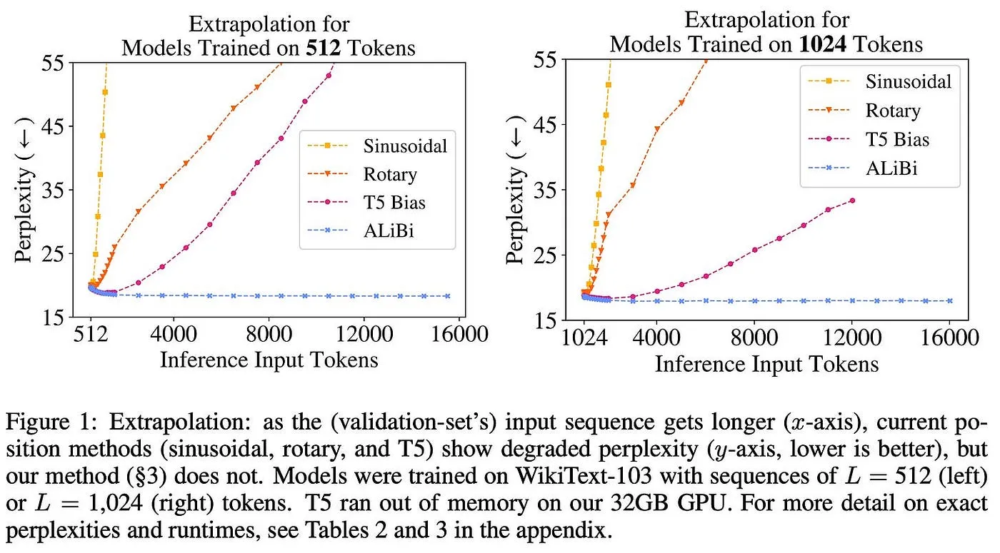
*（来自 [31]）*

尽管它很简单，这种做法在外推到比训练中所见更长的序列方面，胜过了普通位置嵌入技术和 RoPE 两者；见上方。此外，计算和内存成本并没有显著增加。ALiBi 被 MPT 模型 \[26\] 采用，这些模型被微调以支持长达（并超过）[65K token](https://huggingface.co/mosaicml/mpt-7b-storywriter) 的输入长度！

## 要点总结

尽管创新的步伐令人瞠目，仅解码器 transformer 仍然是生成式 LLM 研究的基石。事实上，大多数现代 LLM 所用的模型架构，尽管大得多并以微妙的方式被修改过，大体上与原始 GPT 模型 \[3\] 的架构相匹配。因此，对任何有兴趣更好地理解一个语言模型内部运作的人来说，建立起一个对仅解码器 transformer 架构可用的理解是绝对必要的。从这篇综述里的信息出发，我们可以把我们对仅解码器 transformer 模型的理解分解成以下几个核心想法。

**构造输入。** 仅解码器 transformer 接收一个文本提示作为输入。首先，我们使用一个分词器——*基于像字节对编码这样的算法*——把这个文本拆成离散的 token。然后，我们把这些 token 中的每一个映射到一个存储在嵌入层里的对应 token 向量。这个过程形成一个 token 向量序列，它被作为输入传给模型。可选地，我们可以用加性位置嵌入来增强这些 token 向量。

**因果自注意力** 是仅解码器 transformer 的核心，它让模型能从输入中 token 之间的关系里学习。普通的自注意力操作通过取其他 token 表示的一个加权组合来变换每个 token 的表示，其中权重由 token 之间成对的注意力（或重要性）分数给出。因果自注意力遵循一个类似的策略，但只为序列中在前的 token 计算注意力分数。注意力在若干个头上并行执行，每个头都能聚焦于输入序列的不同部分。

**前馈变换** 在仅解码器 transformer 的每个块内部被执行，让我们能单独地变换每个 token 的表示。这个前馈组件是一个小型神经网络，它以逐点的方式应用于每一个 token 向量。给定一个 token 向量作为输入，我们把这个向量传过一个线性投影，它把向量的大小增大约 4 倍，应用一个非线性激活函数（例如，SwiGLU 或 GeLU），然后执行另一个线性投影，它恢复 token 向量的原始大小。

**Transformer 块** 被按序堆叠，以形成仅解码器 transformer 架构的主体。仅解码器 transformer 块的确切布局可能会取决于实现而改变，但有两个主要的子层始终存在：

1.  因果自注意力
2.  前馈变换

此外，这些子层被一个层归一化模块——*在子层之前或之后（或两者都有！）*——和一个残差连接包裹起来。

**分类头。** 仅解码器 transformer 有一个最后的分类头，它接收 transformer 最终输出层的 token 向量作为输入，并输出一个与模型分词器词表大小相同的向量。这个向量既可以用来通过下一个 token 预测来训练 LLM，也可以用来在推理时通过像核采样（nucleus sampling）和束搜索（beam search）这样的采样策略来生成文本。

### 第一次看这份简报？

嗨！我是 [Cameron R. Wolfe](https://cameronrwolfe.me/)，深度学习博士，[Netflix](https://research.netflix.com/research-area/nlp-and-conversations) 的资深研究科学家（Staff Research Scientist）。这是从我的 [Deep (Learning) Focus](https://cameronrwolfe.substack.com/) 简报转载的，在那里我帮助读者更好地理解 AI 研究中的重要话题。如果你喜欢这份简报，请订阅、考虑付费订阅、分享它，或者在 [X](https://twitter.com/cwolferesearch)、[LinkedIn](https://www.linkedin.com/in/cameron-r-wolfe-ph-d-04744a238/) 和 [Medium](https://wolfecameron.medium.com/) 上关注我！

### 参考文献

\[1\] Vaswani, Ashish, et al. "Attention is all you need." *Advances in neural information processing systems* 30 (2017).

\[2\] Zehui, Lin, et al. "Dropattention: A regularization method for fully-connected self-attention networks." *arXiv preprint arXiv:1907.11065* (2019).

\[3\] Radford, Alec, et al. "Improving language understanding by generative pre-training." (2018).

\[4\] Radford, Alec, et al. "Language Models are Unsupervised Multitask Learners."

\[5\] Glorot, Xavier, and Yoshua Bengio. "Understanding the difficulty of training deep feedforward neural networks." *Proceedings of the thirteenth international conference on artificial intelligence and statistics*. JMLR Workshop and Conference Proceedings, 2010.

\[6\] Ioffe, Sergey, and Christian Szegedy. "Batch normalization: Accelerating deep network training by reducing internal covariate shift." *International conference on machine learning*. pmlr, 2015.

\[7\] Ba, Jimmy Lei, Jamie Ryan Kiros, and Geoffrey E. Hinton. "Layer normalization." *arXiv preprint arXiv:1607.06450* (2016).

\[8\] Wu, Yuxin, and Kaiming He. "Group normalization." *Proceedings of the European conference on computer vision (ECCV)*. 2018.

\[9\] Ulyanov, Dmitry, Andrea Vedaldi, and Victor Lempitsky. "Instance normalization: The missing ingredient for fast stylization." *arXiv preprint arXiv:1607.08022* (2016).

\[10\] Vaswani, Ashish, et al. "Attention is all you need." *Advances in neural information processing systems* 30 (2017).

\[11\] Touvron, Hugo, et al. "Llama 2: Open foundation and fine-tuned chat models." *arXiv preprint arXiv:2307.09288* (2023).

\[12\] Groeneveld, Dirk, et al. "Olmo: Accelerating the science of language models." *arXiv preprint arXiv:2402.00838* (2024).

\[13\] Shazeer, Noam. "Glu variants improve transformer." *arXiv preprint arXiv:2002.05202* (2020).

\[14\] Almazrouei, Ebtesam, et al. "The falcon series of open language models." *arXiv preprint arXiv:2311.16867* (2023).

\[15\] Google DeepMind (Gemma Team). "Gemma: Open Models Based on Gemini Research and Technology" (2024).

\[16\] He, Kaiming, et al. "Deep residual learning for image recognition." *Proceedings of the IEEE conference on computer vision and pattern recognition*. 2016.

\[17\] Jastrzębski, Stanisław, et al. "Residual connections encourage iterative inference." *arXiv preprint arXiv:1710.04773* (2017).

\[18\] Veit, Andreas, Michael J. Wilber, and Serge Belongie. "Residual networks behave like ensembles of relatively shallow networks." *Advances in neural information processing systems* 29 (2016).

\[19\] Li, Hao, et al. "Visualizing the loss landscape of neural nets." *Advances in neural information processing systems* 31 (2018).

\[20\] Sennrich, Rico, Barry Haddow, and Alexandra Birch. "Neural machine translation of rare words with subword units." *arXiv preprint arXiv:1508.07909* (2015).

\[21\] Kudo, Taku, and John Richardson. "Sentencepiece: A simple and language independent subword tokenizer and detokenizer for neural text processing." *arXiv preprint arXiv:1808.06226* (2018).

\[22\] Wu, Yonghui, et al. "Google's neural machine translation system: Bridging the gap between human and machine translation." *arXiv preprint arXiv:1609.08144* (2016).

\[23\] Su, Jianlin, et al. "Roformer: Enhanced transformer with rotary position embedding." *arXiv preprint arXiv:2104.09864* (2021).

\[24\] Chowdhery, Aakanksha, et al. "Palm: Scaling language modeling with pathways." *arXiv preprint arXiv:2204.02311* (2022).

\[25\] Dao, Tri, et al. "Flashattention: Fast and memory-efficient exact attention with io-awareness." *Advances in Neural Information Processing Systems* 35 (2022): 16344–16359.

\[26\] "Introducing MPT-7B: A New Standard for Open-Source, Commercially Usable Llms." *Databricks*, 5 May 2023, [https://www.databricks.com/blog/mpt-7b.](https://www.databricks.com/blog/mpt-7b.)

\[27\] Google Gemini Team et al. "Gemini: A Family of Highly Capable Multimodal Models", [https://storage.googleapis.com/deepmind-media/gemini/gemini\_1\_report.pdf](https://storage.googleapis.com/deepmind-media/gemini/gemini_1_report.pdf) (2023).

\[28\] Ainslie, Joshua, et al. "GQA: Training Generalized Multi-Query Transformer Models from Multi-Head Checkpoints." *arXiv preprint arXiv:2305.13245* (2023).

\[29\] Zhang, Biao, and Rico Sennrich. "Root mean square layer normalization." *Advances in Neural Information Processing Systems* 32 (2019).

\[30\] Touvron, Hugo, et al. "Llama: Open and efficient foundation language models." *arXiv preprint arXiv:2302.13971* (2023).

\[31\] Press, Ofir, Noah A. Smith, and Mike Lewis. "Train short, test long: Attention with linear biases enables input length extrapolation." *arXiv preprint arXiv:2108.12409* (2021).

\[32\] Rafailov, Rafael, et al. "Direct preference optimization: Your language model is secretly a reward model." *Advances in Neural Information Processing Systems* 36 (2024).

\[33\] Ouyang, Long, et al. "Training language models to follow instructions with human feedback." *Advances in Neural Information Processing Systems* 35 (2022): 27730–27744.

\[34\] Ahmadian, Arash, et al. "Back to Basics: Revisiting REINFORCE Style Optimization for Learning from Human Feedback in LLMs." *arXiv preprint arXiv:2402.14740* (2024).
