# 读懂 DeepSeek-V4 之前，先把基础打牢

## 读懂驱动它的那些组件

本文写给我 CS610 课程 2026 年 4 月学期的学生。

## 目录

-   背景
-   为什么选 DeepSeek？
-   参考文献
-   1\. 不该跳过的基础
-   1.1 字节对编码（Byte Pair Encoding）  
    1.2 嵌入（Embeddings）  
    1.3 把上下文考虑进来  
    1.4 位置编码（Positional Encodings）  
    1.5 得到输出
-   2\. 构建模块
-   2.1 注意力（Attention）  
    2.2 多头潜在注意力（Multi-heads Latent Attention, MLA）  
    2.3 专家混合（Mixture-of-Experts, MoE）  
    2.4 多 Token 预测（Multi-Token Prediction, MTP）
-   3\. DeepSeek-v4 里的新东西
-   3.1 流形约束超连接（Manifold-Constrained Hyper-Connections, mHC）  
    3.2 压缩稀疏注意力（Compressed Sparse Attention, CSA）  
    3.3 重度压缩注意力（Heavily Compressed Attention, HCA）  
    3.4 Muon 优化器

## 背景

2025 年 1 月，DeepSeek-R1 发布，同时开源了蒸馏版的「[32B 与 70B 模型，性能与 OpenAI-o1-mini 相当](https://api-docs.deepseek.com/news/news250120)」。接下来那一周，几家 AI 巨头的[股价应声暴跌](https://www.reuters.com/technology/artificial-intelligence/chinas-deepseek-sparks-ai-market-rout-2025-01-27)。短短几周内，我就更新了 CS610 的课程内容，给 2025 年 1 月和 4 月两届学生讲怎么[在本地部署 DeepSeek](https://medium.com/mitb-for-all/deploying-deepseek-locally-c96ce6a74634)。

今年我备课、准备 2026 年 4 月学期的 CS610 时，DeepSeek 又在 2026 年 4 月[发布了 V4](https://api-docs.deepseek.com/news/news260424)，性能足以与 Claude-Opus-4.6、GPT-5.4 和 Gemini-3.1 比肩。

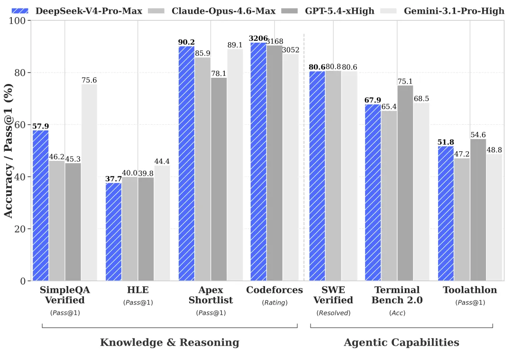
*图片来源：https://api-docs.deepseek.com/news/news260424*

在技术上真正搞懂底层发生了什么，是件好事。面试实习或工作时能把这些讲准确，一定会让你更占优势。

每一次新发布都建立在大量基础知识之上——这对底子扎实的人是幸事，对底子薄弱的人恐怕就没那么幸运了。也就是说：新手光读最新那篇论文远远不够；可要顺着一篇篇引用追下去，又会掉进没底的兔子洞。更别提 V3 和 V4 两篇论文加起来有一百多页。

## 为什么选 DeepSeek？

我之所以聚焦 DeepSeek 系列，是因为它配套的论文把模型架构和训练过程都讲得很细——这一点别的闭源模型做不到。

v3、r1 和 v4 之间有不少共通之处，比如 Multi-Head Latent Attention 和 Mixture-of-Experts。三者也都用了 Group Relative Policy Optimization（GRPO），这部分我会在强化学习课程里讲。

我们一步一步来。我敢打赌，哪怕过了五年，这些知识作为基础模块依然不会过时。

## 参考文献

为了完整，也方便你按时间线快速查阅，这里列出 DeepSeek 和其他机构的相关论文。

**DeepSeek 出品**

-   DeepSeek-MoE，Dai *等人*（2024），*Towards Ultimate Expert Specialization in Mixture-of-Experts Language Models*。[https://arxiv.org/pdf/2401.06066](https://arxiv.org/pdf/2401.06066)
-   DeepSeek-v3，Liu *等人*（2024），*DeepSeek-V3 Technical Report*。[https://arxiv.org/abs/2412.19437](https://arxiv.org/abs/2412.19437)
-   DeepSeek-r1，Guo *等人*（2025），*DeepSeek-R1: Incentivizing Reasoning Capability in LLMs via Reinforcement Learning*。[https://arxiv.org/pdf/2501.12948](https://arxiv.org/pdf/2501.12948)
-   DeepSeek-v4，DeepSeek（2026），*DeekSeek-V4: Towards Highly Efficient Million-Token Context Intelligence*。[https://huggingface.co/deepseek-ai/DeepSeek-V4-Pro/blob/main/DeepSeek\_V4.pdf](https://huggingface.co/deepseek-ai/DeepSeek-V4-Pro/blob/main/DeepSeek_V4.pdf)

**其他**

-   Attention Is All You Need，Vaswani *等人*（2017）。[https://arxiv.org/abs/1706.03762](https://arxiv.org/abs/1706.03762)
-   GPT-2，Radford *等人*（2019），*Language Models are Unsupervised Multitask Learners.* [https://cdn.openai.com/better-language-models/language\_models\_are\_unsupervised\_multitask\_learners.pdf](https://cdn.openai.com/better-language-models/language_models_are_unsupervised_multitask_learners.pdf)
-   GPT-3，Brown *等人*（2020），*Language Models are Few-Shot Learners*。[https://arxiv.org/abs/2005.14165](https://arxiv.org/abs/2005.14165)
-   GPT-4，Achiam *等人*（2023），*GPT-4 Technical Report*。[https://arxiv.org/pdf/2303.08774](https://arxiv.org/pdf/2303.08774)
-   RoFormer，Su *等人*（2021/2024）。[https://arxiv.org/abs/2104.09864v5](https://arxiv.org/abs/2104.09864v5)；[https://doi.org/10.1016/j.neucom.2023.127063](https://doi.org/10.1016/j.neucom.2023.127063)
-   Multi-token Prediction，Gloeckle *等人*（2024）。[https://arxiv.org/pdf/2404.19737](https://arxiv.org/pdf/2404.19737)

## 1. 不该跳过的基础

我一向认为，得弄明白输入是怎样一步步变成模型输出的。我们从头说起。

DeepSeek——其实任何 LLM 都一样——接收的输入是一个字符串，也就是一串字符。

### 1.1 字节对编码（Byte Pair Encoding）

拿到输入序列后，我们得先确定 token，才谈得上把它映射到对应的向量。

字节对编码（BPE）是一种子词级别的分词方法。它是两个极端之间的折中：一个极端是按单个字符分词，但单字符本身往往没什么意义；另一个极端是不加区分地把整个词当成一个 token，这又会丢掉泛化能力。

BPE 可以追溯到 1990 年代（Shibata 等人，1999），但到了 2020 年代，GPT 和 DeepSeek 这些顶尖模型仍在用它。  
BPE 的做法是反复合并出现得最频繁的相邻符号对——这些符号一开始就是单个字符。常用词通常最后会直接合成一个 token。DeepSeek-v3 的分词器有 128,000 个 token 的词表（见 DeepSeek-v3 第 4.1 节）。

举个例子，看这句话：‘*My father works in a financial corporation.*’

```python
import torch
from transformers import AutoTokenizer, AutoModeltokenizer = AutoTokenizer.from_pretrained(
    "deepseek-ai/deepseek-llm-7b-base"
)
sentence = "My father works in a financial corporation."tokens = tokenizer.tokenize(sentence, return_tensors="pt")
token_ids = tokenizer(sentence)["input_ids"]
print("Tokens:", tokens)  
print("Token IDs:", token_ids)
```

它会被切成下面这八个 token。注意，‘in’和‘a’各自只用一个 token 表示（索引 1695），而‘corporation’用了两个 token。

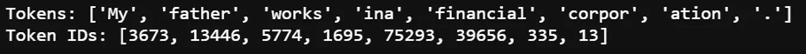

反过来，这些 token 索引也能用来取回原本的子词。

```
for idx in token_ids:
    print(tokenizer.decode(idx))
```

### 1.2 嵌入（Embeddings）

从 BPE 拿到 token 之后，我们得用数学方式表示它。嵌入（embedding）可以粗略理解为对一个 token 的描述——比如它是动词还是名词、有哪些语义属性、带什么样的感情色彩、通常和什么搭配，等等。这些数值全是学出来的（依据它们在大型语料里的自然出现情况），甚至可能没法逐个解释。它就类似于一张图像的[特征向量](https://medium.com/mitb-for-all/intuition-behind-probabilities-from-supervised-learning-391a4eaf2ac6)。

嵌入 vᵢ 最初是怎么得到的，有不少经典方法，比如 Word2Vec、GloVe，或者像 FAIR 的 FastText 这类更花哨的做法。

我们把一个 torch 张量传给 `.embed_tokens` 就能拿到嵌入。输出是一个形状为 \[1, n\_tokens, 4096\] 的 torch.Tensor，其中 4096 是嵌入空间的维度数。

```sql
model = AutoModel.from_pretrained(
    "deepseek-ai/deepseek-llm-7b-base", output_hidden_states=True
)
model.eval()token_ids = tokenizer(sentence, return_tensors="pt")["input_ids"]  
with torch.no_grad():
    token_embeddings = model.embed_tokens(token_ids)
```

这里我用的是一个简单的蒸馏版‘7B’变体，而不是最新的 DeepSeek-V4，这样任何读者都能快速、轻松地复现。原理是完全一样的。

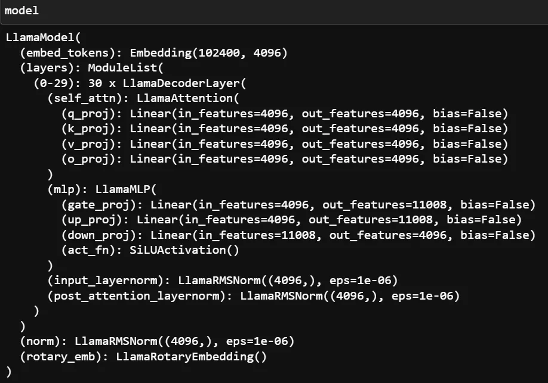
*作者截图，展示了“deepseek-ai/deepseek-llm-7b-base”这个模型的构成。*

为了对它有更直观的感受，我们把每个 token 连同它嵌入的前四个值一起可视化出来（当然也可以用 PCA 之类的降维技术，但还是简单点好）。

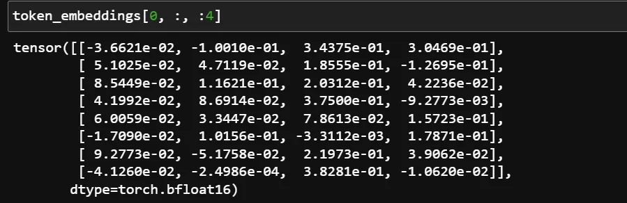

可以看到，这些值大多在 0.01 ~ 0.1 这个量级。

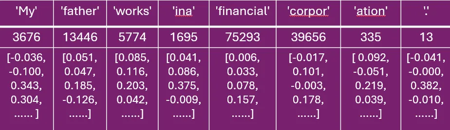
*每个 token 嵌入的前四个值。*

现在，如果我们在没有上下文的情况下，比较‘works’和‘corpor’这两个 token 嵌入（维度 4096）之间的余弦相似度，结果只有 0.04。原因是原始的 token 嵌入本身并不包含句子层面的语义——它既没有上下文，也不知道自己在句中的相对位置。

```
emb_1 = token_embeddings[:,2,:]  
emb_2 = token_embeddings[:,5,:]  from torch.nn.functional import cosine_similarity
cosine_similarity(emb_1, emb_2)
```

先剧透一下：如果你比较的是最后一层隐藏状态的嵌入，余弦相似度会升到 0.707。这是怎么做到的，我们接着往下看。

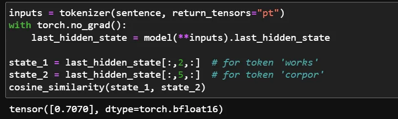
*作者截图。*

### 1.3 把上下文考虑进来

接下来看这个短语：“*father works at a bank*”。每个词（token）都有自己的向量。可问题是，*bank* 有多种含义（金融机构、河岸等等），到底取哪个意思，得看句子里其他的词。所以我们想要的，是一个修正过的向量——它不只对应这个词本身，还包含来自相邻词的上下文。

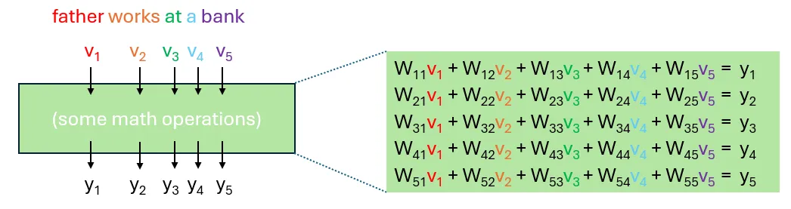
*把嵌入向量 v1 到 v5 修正为 y1 到 y5 的思路。我们想把 v2（‘works’）的某些信息融进 v5（‘bank’），让最终的 y5 捕捉到“bank 指的是某个金融机构”这层含义。图片由作者绘制。*

不存在某个‘唯一最优’的 **W** 能把 vᵢ 变换成 yᵢ，因为这取决于其他的 token。所以，乘上一个可学习的矩阵显然有好处——这样得到的 yᵢ 就能把上下文考虑进来。

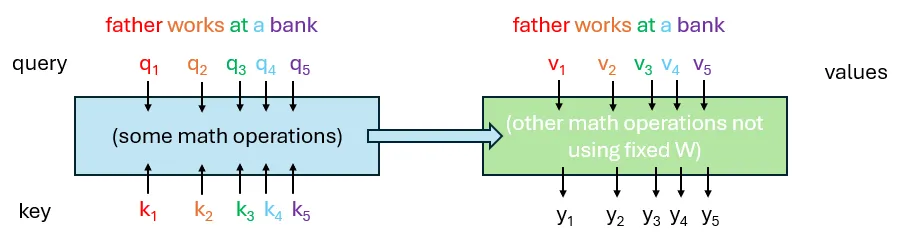
*把 vᵢ 变换为 yᵢ 时考虑整句的上下文，而不是套用一刀切的权重。图片由作者绘制。*

要注意，即使是同一个词，qᵢ、kᵢ、vᵢ 也会不一样，因为它们是用不同的投影矩阵映射出来的（上图未画出）：


*Q、K、V 是所有 token（可以理解为词）的查询、键、值表示，由输入嵌入 X 经学习得到的矩阵 WQ、WK、WV 投影而来。*

对线性代数不太熟的读者，下面这张图会有帮助。

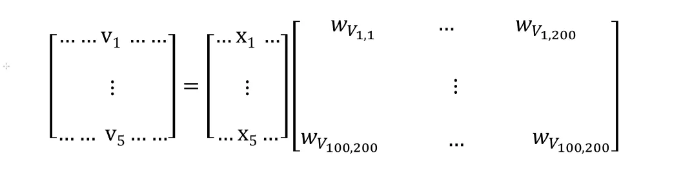
*假设每个 x 是长度 100 的向量，v 是长度 200 的向量。矩阵 X 由 x1 到 x5 组成（这里假设有 5 个 token）。V = XW_{V} 的形状就是 (N, 200) = (N, 100) × (100, 200)。实际中 W_{V} 通常是方阵，因为维度相同；我这里特意用了不同维度，是为了把矩阵乘法讲清楚。还要注意，这里的 W_{V} 和本节开头的 W11 到 W55 很不一样；那些 W11 到 W55 本身可能是 Q 和 K 的函数。*

### 1.4 位置编码（Positional Encodings）

注意力模块本身分不清 token 的先后顺序。可顺序是有意义的，必须考虑进来——‘*not completely*’（不完全）和‘*completely not*’（完全不）含义就不一样。

我们先从正弦位置编码（Sinusoidal Positional Encodings）讲起。打好这个基础，之后理解旋转位置编码（Rotary Positional Encodings）就容易了。Vaswani *等人*（2017）的[注意力论文](https://arxiv.org/pdf/1706.03762)给出了下面这个式子：

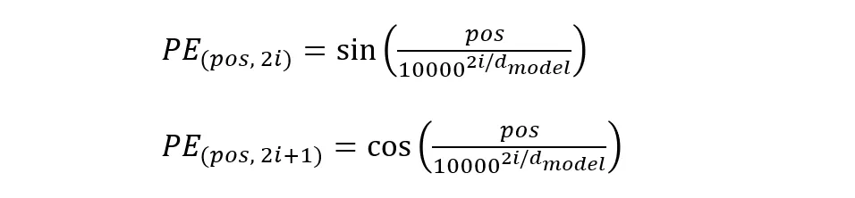
*出自‘Attention Is All You Need’论文第 3.5 节的公式。*

每个 token 的位置 `pos` 都被赋予一个长度为 d\_{model} 的确定性向量。索引 `i` 指的是嵌入向量内部的维度，而不是 token 在句中的位置。对一个 4096 维的空间，我们有 2048 对 (`2i, 2i+1`)。

下面的 GIF 动图展示了位置编码（PE）的正弦分量是如何随 token 位置 `pos` 变化的。每一帧代表某个特定 `pos` 对应的 2048 个位置编码值；把它和另外 2048 个余弦值加起来，就能看到每个 4096 维的 `pos` 都有自己独一无二的‘签名’。

这个 PE 向量会被加到（叠加到）token 嵌入上，让两边的信息‘混’在一起。之所以是叠加而不是把位置嵌入拼接上去，是因为拼接会带来更多参数和训练开销。为了说明叠加的效果，我把自己拍的两张照片叠在了一起（一张是一盘食物，一张是一处景点）。


*作者制作的叠加图。可以把食物照片的像素想象成 token 嵌入，景点照片的像素想象成位置嵌入。*

位置信息还能以一种更‘温和’、不那么侵入的方式融入进来，这就是旋转位置编码（RoPE）。它把 d 维的嵌入空间分成 d/2 个子空间，再按 token 位置 *m*（也就是上文的 `pos`）和 𝜃ᵢ（公式见下）确定的角度去旋转向量。

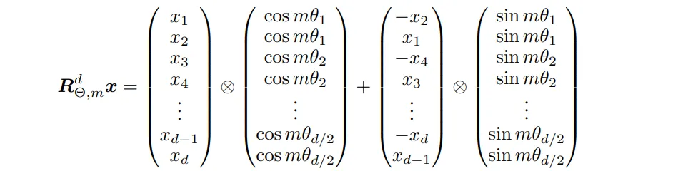
*RoFormer 第 3.4.2 节公式 34 的截图（https://arxiv.org/pdf/2104.09864），它是该论文第 3.2.2 节公式 14 和 15 的一种高效写法。*


*角度 𝜃 是 i（嵌入向量内部的维度）和 d 的函数。公式出自 RoFormer 第 3.2.2 节。*

在此基础上，为了处理更长的上下文，还会用到 YaRN（Yet another RoPE extension）——2024 年的 DeepSeek-V3 论文第 4.3 节就提到了这一点，并引用了一篇更早的 2023 年工作。

### 1.5 得到输出

我们给 LLM 输入一段文字、拿到一个回答时，实际得到的是一个个 token 的预测，再拼接起来。每一个输出都会被增量地接到输入序列后面，然后据此预测下一个输出 token。

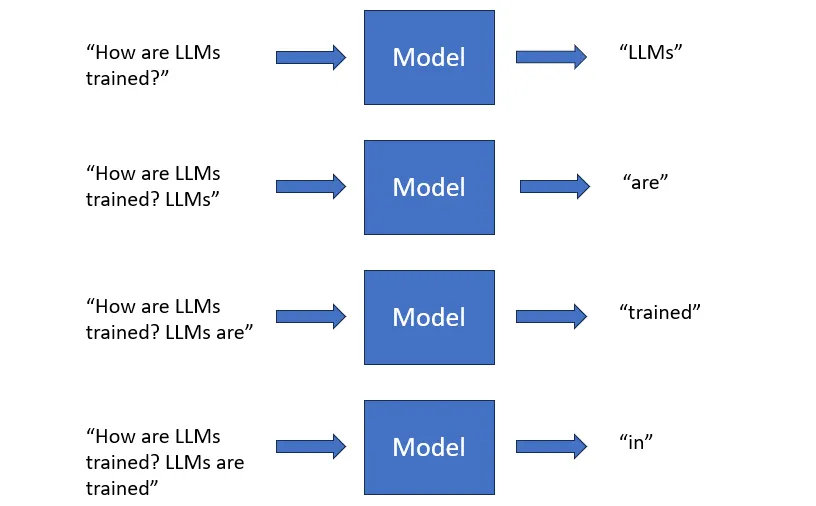
*生成后续预测时，输出会被接到输入后面。这里我们在打基础，所以先忽略 Multi-Token Prediction 这类改进。*

看起来这中间会有大量重复计算，但 key-value 缓存能让模型复用之前算好的 K、V 向量。这样，每一步生成时它只需要把最新的那个 token 过一遍 Transformer 层，同时去关注缓存里的历史 token 就行。

## 2. 构建模块

在 DeepSeek-V3 里，作者说模型有 61 个 Transformer 层，每一层（块）由 RMSNorm、多头潜在注意力（本文第 2.2 节）、专家混合（本文第 2.3 节）以及跳跃连接组成。RMSNorm 和跳跃连接你多半已经知道了。

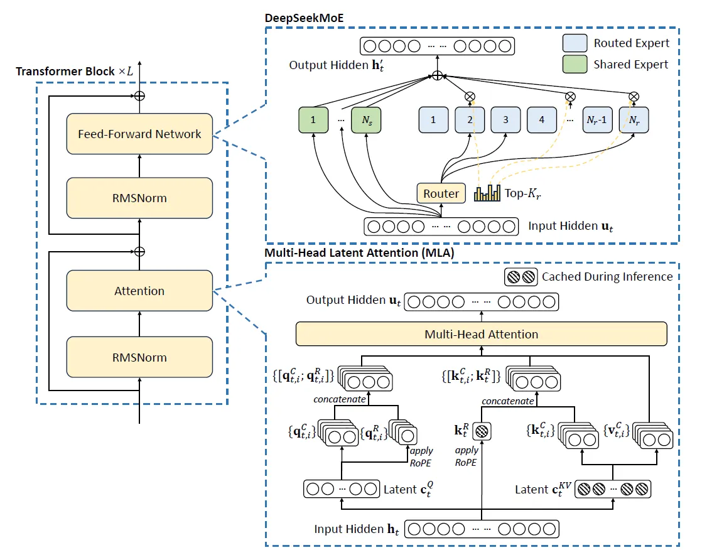
*DeepSeek-v3（2024）图 2 的截图，https://arxiv.org/pdf/2501.12948。DeepSeek-V3 的架构。*

### 2.1 注意力（Attention）

在有注意力机制之前，编码器-解码器序列模型不得不把输入压缩成一个固定大小的上下文向量，这就造成了信息瓶颈，性能也因此受损——上下文一长尤其明显。

回想本文第 1.3 节，我们当时就在设法让 yᵢ 把上下文纳入进来（虽然那个例子很短，只是为了说明）。这件事，注意力机制能做到。

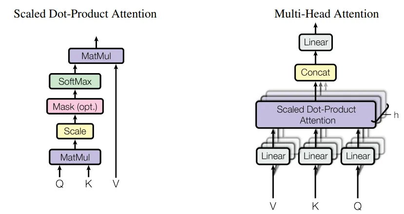
*‘Attention Is All You Need’图 2 的截图，https://arxiv.org/pdf/1706.03762。我们先看左半边（只看注意力），多头注意力放到后面的小节再讲。*

上面这张图你在很多地方都见过。我们要确保自己真的明白：这里的数学运算***为什么***要做、又是***怎么***做的。

从数学上讲，上图左边其实就是在描述下面这个等式。

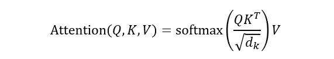
*注意力论文第 3.2.1 节的等式 (1)，https://arxiv.org/pdf/1706.03762。*

把中间步骤画成流程图，过程可能会更清楚。

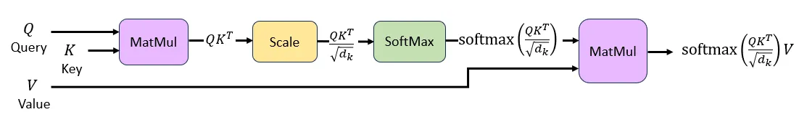
*图片由作者绘制。*

在自注意力里，同一个 X（如果是第一层，它就是输入嵌入；否则是某个中间隐藏状态）被用来得到 Q、K、V；而在交叉注意力里，Q 来自一个序列，K 和 V 来自另一个序列。

DeepSeek 各个变体的架构是公开、可验证的，它们其实都是仅解码器（decoder-only）的 LLM，所以我们这里聚焦自注意力。注意力矩阵会做因果掩码，也就是说，每个 token 只能关注它自己和更早的 token，不能关注未来的 token。

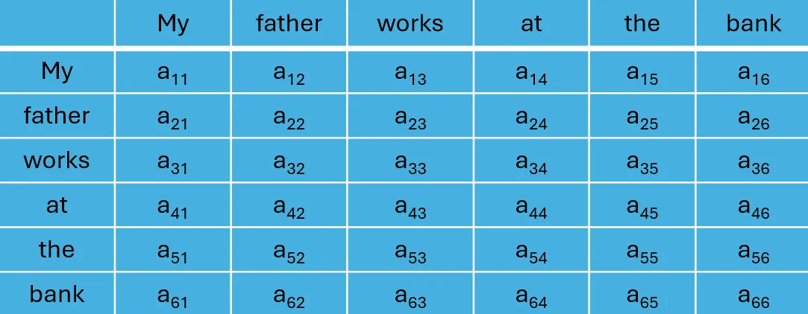
*对 n 个 token，注意力矩阵的形状是 (n, n)，其中每个元素 a_{i,j} 表示 token i 对 token j 的关注程度。*

### 2.2 多头潜在注意力（Multi-heads Latent Attention, MLA）

接着说说为什么要做‘多头’注意力。一个句子里通常包含好几种需要同时理解的关系。想想这句话：“*My father works at a bank where overtime is discouraged*”。

单个注意力头已经能让每个 token 关注其他所有 token，但它只能捕捉一种模式。有了多个头，一个头可能专注于‘My’和‘father’这类关系（而不是‘My’和‘bank’），另一个头可能把‘works’和‘bank’这样的地点关联起来，第三个头则可能追踪‘overtime’和‘discouraged’这类情感倾向。

当然，实际不会这么干净、这么泾渭分明——我们就把它交给模型，让它在训练中自己学出最有效的分工。

DeepSeek-V3 论文第 4.2 节说，注意力头的数量是 128，每个头的维度也是 128。

现在来看 MLA 里的‘潜在’（latent）。

如第 1.5 节所说，缓存 KV（键值）是为了避免重复计算。但这又带来另一个问题：如果什么都存，缓存会非常大，上下文一长就很烧钱。

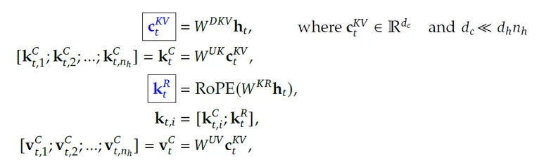
*DeepSeek-v3（2024）第 2.1.1 节等式 (1) 到 (5) 的截图，https://arxiv.org/pdf/2501.12948，作者另作了修改，把额外信息整合到一张图里。*

**h**ₜ 是某个注意力层中 token t 的隐藏表示。MLA 先把 **h**ₜ 压缩成一个更小的潜在向量 **c**ₜᴷⱽ。DeepSeek-v3（第 4.2 节）说，隐藏维度是 7168，而 KV 压缩维度是 512（也就是原维度的 1/14）。因此，Wᴰᴷⱽ 是一个形状为 (512, 7168) 的可学习参数矩阵。

要重建时，压缩后的潜在向量 **c**ₜᴷⱽ 会用矩阵 Wᵁᴷ 做上投影，得到 **k**ₜᶜ——它是 1 到 nₕ 所有注意力头的内容键（content-key）分量拼接而成。既然有 128 个注意力头、每个头维度为 128（同样见 DeepSeek 论文第 4.2 节），Wᵁᴷ 的形状就是 (16384, 512)。

再看上面截图里的第 3 个等式，**k**ₜᴿ 是键的旋转位置部分（压缩形式）。（旋转位置编码 RoPE 参见我上面的第 1.4 节。）DeepSeek-v3 的作者特意把架构设计成：**k**ₜᶜ 由压缩潜在向量 **c**ₜᴷⱽ 重建，而 **k**ₜᴿ 单独确定。原因是，如果把位置信息直接混进去，缓存就不那么‘干净’，**c**ₜᴷⱽ 也更难高效表示。DeepSeek 作者把 dₕᴿ 设为 64，所以矩阵 Wᴷᴿ 的形状是 (64, 7168)。

第 4 个等式对应的就是 DeepSeek 第 2.1.1 节里说的那个“*携带旋转位置嵌入的解耦键*”。第 5 个等式则展示了值 **v**ₜᶜ 是怎样用 Wᵁⱽ 重建的，做法和 **k**ₜᶜ 类似。

注意力查询同样会经过一次低秩压缩。做法和上面一样，只是换成了 Wᴰꟴ、Wᵁꟴ、Wꟴᴿ 这几个矩阵。

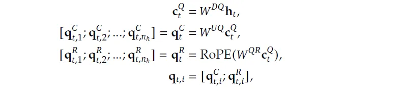
*DeepSeek-v3（2024）第 2.1.1 节等式 (6) 到 (9) 的截图，https://arxiv.org/pdf/2501.12948。*

### 2.3 专家混合（Mixture-of-Experts, MoE）

DeepSeek-V3 论文里几乎没怎么解释它的 MoE 是如何工作的，只说了“*每个 MoE 层由 1 个共享专家和 256 个路由专家组成……在路由专家中，每个 token 会激活 8 个专家*”。

所以，关于 DeepSeek 所用 MoE 的具体细节，我们要参考 Dai *等人*（2024）——毕竟自 20 世纪末以来，MoE 已经有过[很多种形式](https://ieeexplore.ieee.org/abstract/document/6215056/)。

MoE 的思路是：让‘专门化’的网络组件，在（路由器认为）它们擅长的领域里去做预测。这样一来，既能训练出大容量的模型，又能把每个 token 的计算量控制在可接受的范围。DeepSeek-V3 共有 671B 参数，而每个 token 只激活其中约 5.5%。

DeepSeek 的 MoE 用了细粒度专家切分（Fine-Grained Expert Segmentation，见 [https://arxiv.org/pdf/2401.06066](https://arxiv.org/pdf/2401.06066) 第 3.1 节）：专家数量增多，每个专家的规模减小，从而实现“*对被激活专家更灵活、更自适应的组合*”。具体选哪些专家，由一个路由器决定。

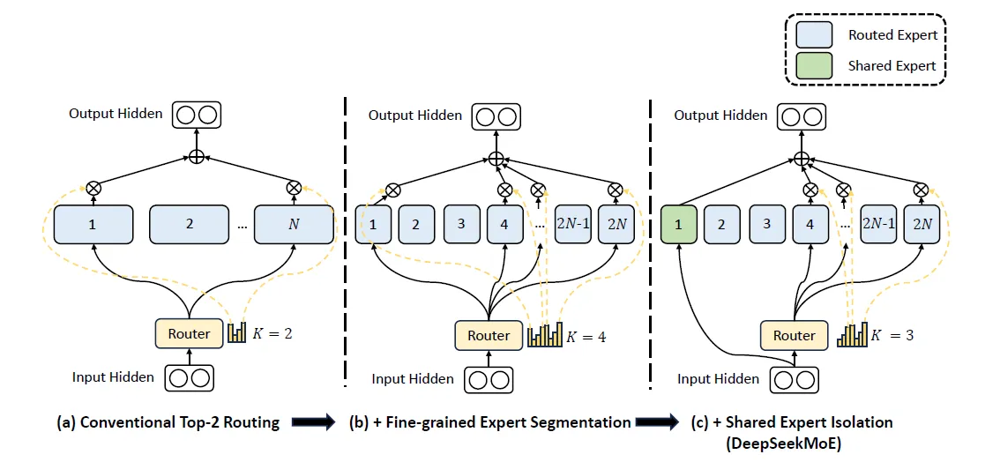
*DeepSeek-MoE（2024）图 2 的截图，https://arxiv.org/pdf/2401.06066。在 (b) 中，路由器面对的专家数量翻了一倍，每个专家规模更小（用更小的方框表示）；被选中的‘细粒度专家’数量也翻了一倍。在 (c) 中，可以看到 #1 是一个‘共享专家’，它会被直接使用，不需要路由器来挑选。*

为了避免冗余（即不同专家学到的是同一批通用知识），DeepSeek 还隔出了一部分专家充当“*共享专家*”，如上图 (c) 所示——这些专家是“*确定性地分配*”的，不靠路由器挑选。

与此同时，他们也考虑了负载均衡（MoE 论文第 3.3 节）。因为如果路由分布不均，那些较少被选中的专家就得不到足够训练、表现变差，于是更不容易被选中——这种恶性循环最终会导致路由崩溃，让这些专家变成废子。

DeepSeek-v3 采用了一种无辅助损失的负载均衡策略（见 [https://arxiv.org/pdf/2412.19437](https://arxiv.org/pdf/2412.19437) 第 2.1.2 节）：在决定 top-K 路由目标时加上一个偏置项——某个专家负载不足就调大这个偏置，负载过重就调小。

### 2.4 多 Token 预测（Multi-Token Prediction, MTP）

在多 Token 预测里，模型被训练成一次预测多个未来 token，用的是各自独立的输出头。用 DeepSeek-v3 作者的话说，这“*让训练信号更密集*”，并且“*可能让模型预先规划自己的表示*”。

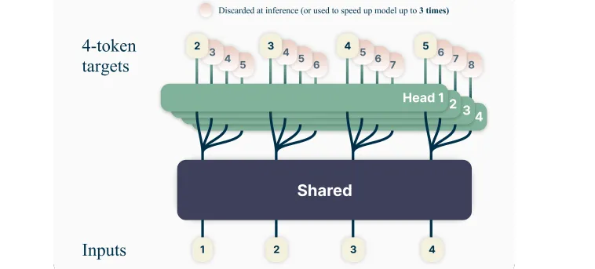
*Multi-token Prediction 论文（Gloeckle 等人，2024）图 1 的截图，https://arxiv.org/pdf/2404.19737，被 DeepSeek-v3 引用。*

从数学上看，当要一次预测 n 个未来 token 时，模型被训练去最小化预测未来 token x\_{t+1}, … , x\_{t+n} 的[负对数似然](https://medium.com/mitb-for-all/mle-vs-map-worked-example-1712e2fcb49b)（也就是交叉熵损失），条件是给定输入 token x₁, …, xₜ。


*Multi-token Prediction 论文等式 (2) 的截图。*

DeepSeek-v3 没有用相互独立的输出头，而是顺序地预测未来 token，以此“*在每个预测深度上保持完整的因果链*”（DeepSeek-v3 论文第 2.2 节）。作者还说，MTP 是“*用来提升主模型性能的，所以推理时我们可以直接丢掉 MTP 模块*”。

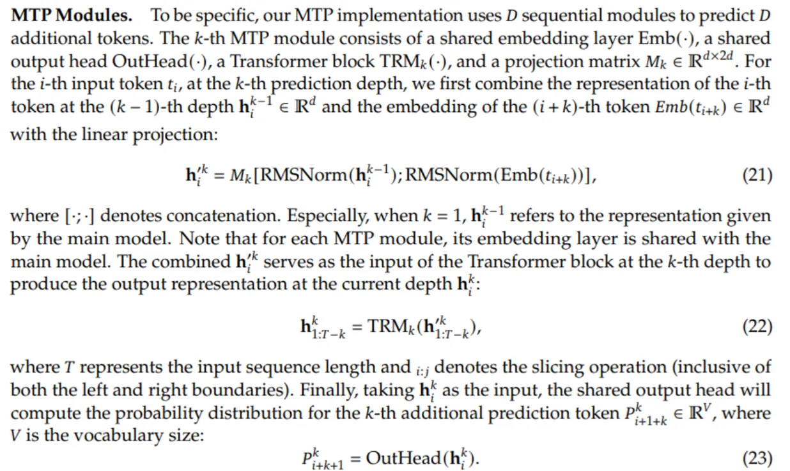
*DeepSeek-v3（2024）第 2.2 节等式 (21) 到 (23) 的截图，https://arxiv.org/pdf/2501.12948。*

DeepSeek-v3 的等式 (21) 到 (23) 解释了上图的 MTP 模块，要看懂它们得费点劲。我画了一张流程图，让其中的数学更直观。

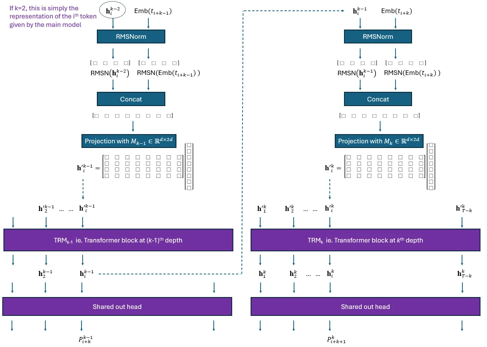
*作者从零绘制的图。用 PowerPoint 做的，外加不少耐心。这里的矩阵对应 d=4 的情形。*

## 3 DeepSeek-v4 里的新东西

在 DeepSeek-v4 里，作者一开头就说，他们“*保留了 Transformer 架构和 MTP 模块，同时引入了几项关键升级……第一是流形约束超连接（mHC），第二是……压缩稀疏注意力和重度压缩注意力，第三是……把 Muon 作为优化器*”，并且“*仍沿用 DeepSeekMoE……MTP 配置保持不变……其余未明确说明的细节都遵循 DeepSeek-V3 既定的设置*”。

现在你明白我为什么花这么多篇幅讲 DeepSeek-v3 了吧。不先把 v3 吃透，根本没法直接跳到 v4。学完上面这些，你其实已经搞懂了 DeepSeek-v4 相当大的一部分——同时也搞懂了许多主流 LLM 的核心组件。

### 3.1 *流形约束超连接（Manifold-Constrained Hyper-Connections, mHC）*

### **3.2 压缩稀疏注意力（Compressed Sparse Attention, CSA）**

### 3.3 **重度压缩注意力（Heavily Compressed Attention, HCA）**

### 3.4 Muon 优化器

> 这篇已经太长了，3.1 到 3.4 我会另写一篇来讲，到时把链接放在这里。顺利的话下周就发——只要别出什么大乱子……

*免责声明：本文所有观点与解读均属作者个人，不代表 MITB。我声明：我对此处发布的内容拥有完整使用权，没有任何抄袭。我声明：本文由我本人撰写，未借助 ChatGPT 等任何生成式 AI 工具。我声明：本文未违反任何数据隐私政策，与此处内容相关的任何数据，据我所知都来源合法。我同意，未经编辑批准不擅自改动。任何违规都可能导致本文被刊物撤稿。*
