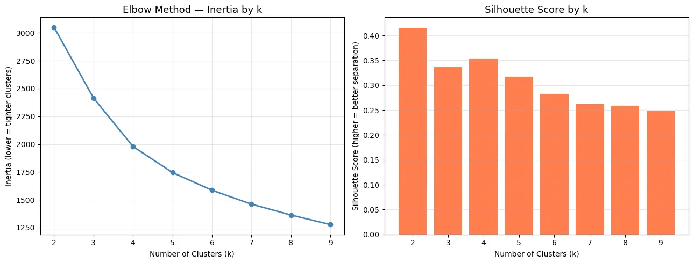
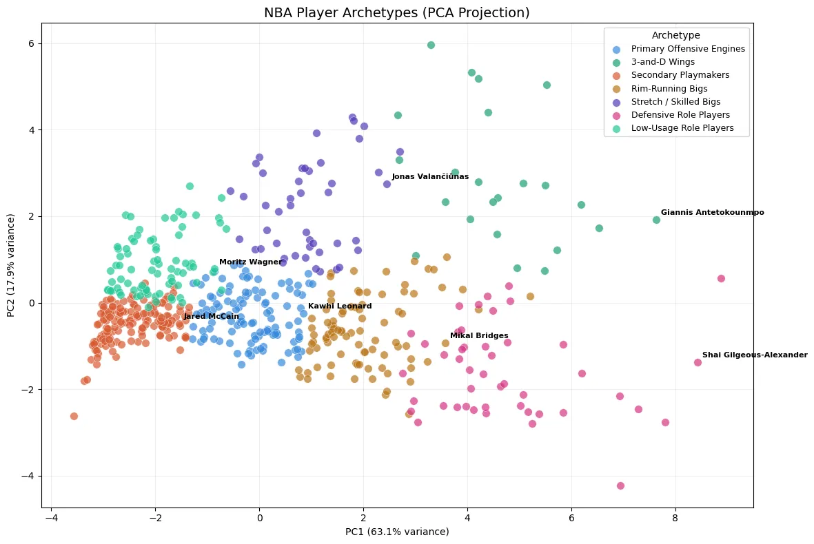
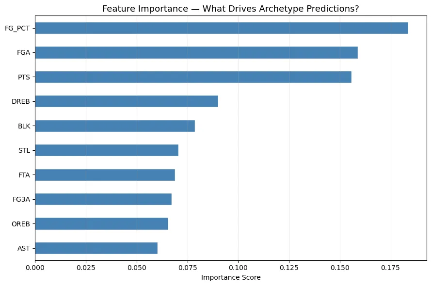

# 从原型到预测：用随机森林实时分类 NBA 球员

*NBA 球员原型，第 2 部分：用随机森林实时预测球员角色*

## 引出问题的那个疑问

如果你读过我上一篇文章，你就知道我用 K-Means 聚类来论证：传统的 NBA 位置基本上已经过时了。数据找到了五种自然的球员原型，它们与某人被登记为后卫还是前锋毫无关系。看到这一点很酷，但它在桌面上留下了一个相当明显的后续问题：好吧，那现在怎么办？如果一位球队管理层的分析师想知道某个球员属于哪种原型，难道他们每次都得重新跑一遍整个聚类流程？那不现实

这里的利益相关方是一位 NBA 球队管理层的分析师，他需要快速评估球员，以服务于交易、自由球员市场和选秀。他们需要看一眼一份数据栏，就立刻理解那名球员填补的是什么角色——基于他们怎么打球，而不是球员名单上印着的是什么位置。这个问题的答案驱动着三个真实的决定：这个交易目标能填补我们存在的某个缺口吗？这名自由球员的角色值我们将要付出的代价吗？这名新秀的画像是我们已经覆盖了的东西，还是说他带来了某种新的东西？

这正是监督学习派上用场的地方。我们不必每次都从零开始聚类，而是在我们已经找到的原型上训练一个分类器，让它来预测一名新球员归属于哪里。快速、一致、可部署。

## 数据

理想情况下，我本应该拥有多个赛季的数据，这样模型就能学到稳定的角色模式，而不只是某一年的快照。诸如真实命中率、上场/下场净效率分项以及防守效率值这样的高阶指标，也会对每名球员在攻守两端各贡献了什么给出一幅更丰富的图景。而且，能自动标记出因伤缩水的赛季也会很棒，这样一个只打了 30 场的球星就不会被误读成一名替补球员。

我手头有的是 2024–25 赛季的场均数据，来自 NBA 官方的 stats API，通过 nba\_api 这个 Python 库经由 LeagueDashPlayerStats 端点拉取。无需 API key，无需爬虫，毫不费力。原始拉取的数据有 600 多名球员。我把范围筛选到任何场均至少打 20 分钟的人，这剔除了垃圾时间的球员，以及那些因伤缩水赛季而场均数据具有误导性的球员。剩下的是刚刚超过 300 名轮换级别的球员可供处理。

我也修订了原文章里的特征集。原来的八个特征制造了一个问题：计数类数据相似的后卫和中锋最后落进了同一个簇里。模型没有办法分辨出区别，因为它看的是一个合并的 REB 列。把那一列分拆成单独的 OREB 和 DREB，立刻就给了算法可以利用的东西。我还加入了 FGA 和 FTA 作为使用率和进攻参与度的代理指标，因为这个 API 没有一个直接的使用率列。最终的十个特征是 PTS、AST、OREB、DREB、STL、BLK、FG3A、FG\_PCT、FGA 和 FTA。

## 方法

这个项目建立在第 4 模块的 K-Means 聚类之上。K-Means 的工作方式是随机放置簇中心，把每名球员分配给最近的那个簇中心，然后把簇中心移动到分配给它的球员的平均位置。它会一直这么做，直到什么都不再变化。它是无监督的，意思是你不会提前告诉它答案，你只是让它在数据里找到自然的分组。

我用肘部法则和轮廓系数来选定 k=7，比原文章里的 k=5 有所提升。扩展后的特征集揭示出了更细的区分，而五个簇太粗糙、捕捉不到这些区分。在聚类之前，所有特征都用 StandardScaler 做了标准化，这样像得分这样高量级的数据在计算距离时就不会淹没掉其他所有东西。

在检查了聚类结果之后，我决定用一个监督分类器来扩展这个项目。在我自己对分类方法做了一番研究之后，我选定了随机森林。一个随机森林会构建大量的决策树，每棵树都在数据和特征的一个随机切片上训练，最终的预测则是所有树的多数投票。它比单棵决策树更可靠，因为跨许多棵树取平均会把噪声抹平，而且它会作为副产品产出特征重要性分数，这帮助我验证了模型是在从正确的信号里学习。

## 分析

一旦我有了七个带标签的原型，我就搭建起了监督学习的流程。十个聚类特征成为输入（X），原型标签则成为模型试图预测的目标（y）。我把数据按 80/20 拆分成训练集和测试集。这里有一点值得指出，我用了分层抽样，它确保每种原型在训练集和测试集里都按比例得到代表。对于像这样一个相对较小的数据集，一次随机拆分可能会意外地让某些原型在测试集里代表不足，从而让评估具有误导性。

我训练了一个有 200 棵树的随机森林，并把每棵树的深度上限设为 10。那个深度限制充当了对抗过拟合的护栏——过拟合是指模型死记硬背训练数据，而不是学到可泛化的模式。在训练之后，我在留出的测试集上做了评估，用的是整体准确率、一份带有每个类别精确率和召回率的逐原型分类报告，以及一个混淆矩阵，用来确切地看出模型在哪里出现了混淆。

在分析过程中有一件事把我绊住了：模型是在 StandardScaler 处理过的缩放数据上训练的，但当我第一次测试预测函数时，我喂给它的是原始数据。模型自信地把每名球员都预测成低使用率角色球员，这显然毫无道理。修复办法是确保每个新输入在抵达分类器之前，都先用那个在训练数据上拟合过的同一个 scaler 经过 scaler.transform() 处理。关于这一点，在 bug 那一节里有更多内容。

## 模型发现了什么

随机森林在留出的测试集上表现良好，正确地识别出了它在训练期间从未见过的球员的原型。混淆矩阵显示，最常见的混淆发生在 3-and-D 侧翼和防守型角色球员之间。说实话，这从篮球的角度讲是说得通的。这两组从统计上看起来很相似，因为他们都有不高的得分、不错的篮板和强硬的防守。把他们区分开的主要东西是三分球的出手量和上场时间，而那些区别足够微妙，以至于连模型有时也会搞错。

特征重要性图表显示出 FG\_PCT、FGA 和 PTS 是预测的三个最大驱动因素，顺序就是这样。当你想一想，这就很说得通了。FG\_PCT 能区分原型，这告诉你模型正在捕捉到大个子和后卫之间投篮画像的差异，因为吃饼型的大个子往往以高得多的命中率出手，相比外线球员而言。FGA 起到很重的作用，这证实了出手量是把球星和角色球员区分开的一个可靠信号。而 PTS 凑齐前三位，这只是进一步印证了得分负荷是用来区分谁是一支球队的主要选择、谁在填补一个辅助角色的最清晰方式之一。

真正的回报是 predict archetype() 这个函数。你递给它任何一名球员的场均数据，它就回给你一个原型和一个置信度分数。一份高得分、高助攻、高 FGA、低 OREB 的画像会被叫做主要进攻引擎。一份高 OREB、高 DREB、高 BLK，但几乎没有三分出手的画像，则会返回为吃饼型大个子。模型学会区分的七种原型是主要进攻引擎、3-and-D 侧翼、次级组织者、吃饼型大个子、空间型与技术型大个子、防守型角色球员，以及低使用率角色球员。一位球队管理层的分析师现在可以在几秒内得到那个答案，完全不用碰聚类代码。

## 清洗、Bug 与 AI 协助

清洗很直接。20 分钟的筛选条件通过移除样本量小的球员完成了大部分的重活。dropna 调用处理了少数几个在一个或多个特征上有缺失值的球员，通常是那些整个赛季从没尝试过一记三分、在 FG3\_PCT 里是空值而不是零的人。对于像那样的百分比列，把空值替换成零是正确的做法，因为一个缺失的三分命中率确实意味着零次出手。

有两个 bug 我预料其他人会遇到。第一个是我已经提到过的缩放不匹配。如果你在 StandardScaler 的输出上训练，却往你的预测函数里喂原始数据，你每次都会得到自信而完全错误的预测。永远在新输入上调用 scaler.transform()，而不是 scaler.fit\_transform()，并且使用那个在你训练数据上拟合过的同一个 scaler 对象。第二个 bug 是一个 sklearn 警告，它会在你用一个 numpy 数组训练、却往 predict 里传入一个 DataFrame 时触发。修复办法只是在你的输入上调用 values，在预测之前把列名剥掉

我用 Claude 作为 AI 助手来帮助构建代码流程的结构，并得到某些章节的初稿。对于代码，我在自己的环境里运行了每一个单元格，并在信任任何结果之前，把输出与我已经很了解的球员做了核对。对于写作部分，我重写了那些没有准确反映我所发现内容的部分，尤其是特征工程的理由和 bug 那一节，因为那些来自我自己一行行琢磨代码的过程，而不是来自 AI 产出的任何东西。

## 局限性

最大的局限性在于，监督模型的好坏只取决于它学习所依据的标签。那些标签来自对一个赛季数据做的 K-Means，而 K-Means 对你怎么挑 k、你纳入哪些特征以及随机初始化都很敏感。一位在聚类阶段做出略微不同选择的分析师，最后会得到不同的原型，而监督模型也会因此学到不同的模式。这些标签有用且可解释，但它们不是基本事实。

计数类数据也讲不出全部的故事。两名都场均 18 分的球员，在模型看来是完全一样的，即便其中一个是靠好的出手机会高效地做到的，而另一个是靠高出手量和低命中率做到的。加入真实命中率或上场/下场净效率值会让原型的边界更锐利，尤其是在球星和次级创造者之间——他们的得分数字相似，但那些数字的质量非常不同。

伤病仍然是个问题。Joel Embiid 在原文章里落进低使用率簇，并不是他实际角色的反映，它是一个缩水赛季造成的统计假象。这个工具的一个更稳健的版本会标记出低于某个出场场次阈值的球员，并要么把他们排除掉，要么在把他们的数字喂进模型之前做调整。

还有一个值得思考的伦理角度。如果球队管理层开始用原型分类器来筛选球员的去留，一名像 Draymond Green 这样真真切切处在两种原型之间的球员，可能会被系统性地低估，因为模型逼着给出单一的标签。模型在每个预测旁边产出的那个置信度分数，正是因为这个原因才重要。如果模型有 91% 的把握，那很好。如果它只有 55% 的把握，那名球员就是一个边界情况，应当被更仔细地评估，而不是被自动归类。

最后，这是一个单赛季的模型。球员的角色会因交易、伤病、年龄和新的教练体系而改变。一个完全在 2024–25 赛季数据上训练的分类器会变得过时。正确的长期解决方案是在最近两到三个赛季的滚动窗口上重新训练，这样模型就能随着联盟的演变而保持时新。
