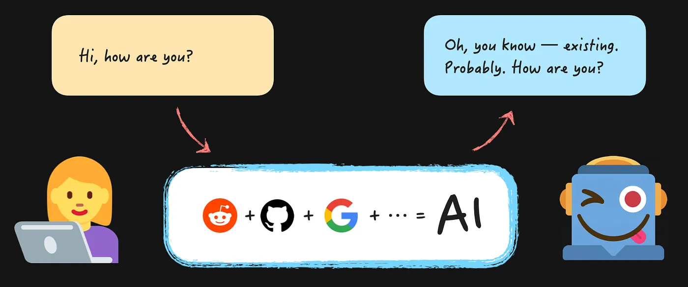
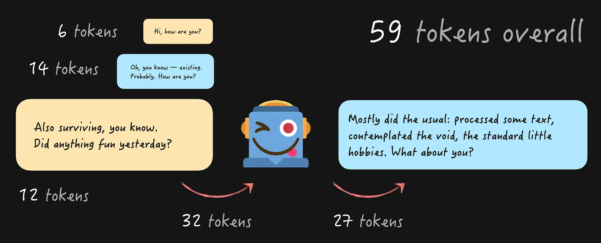
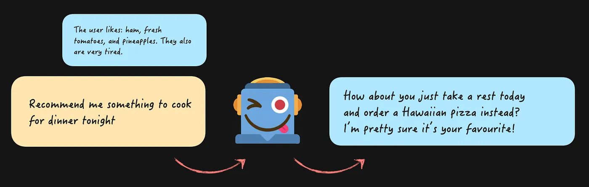

# AI 如何记忆，又为何遗忘：第 1 部分。上下文问题


AI 编程。我打算假设你在此时此刻至少已经试过了。你大概用过像 Claude 或 Cursor 这样的工具，试过不同的模型，甚至可能用 Anthropic 或 OpenAI API 构建过你自己的东西。当你不得不为超额使用的 token 付费时，你可能哭过一小会儿，而“agents”这个词到现在已经能让你脑动脉瘤了。如果你完全不知道我在这里说什么，请把你星球的坐标发给我，那里一定非常宁静。

在做上面所有这些事情的时候，你可能已经注意到 AI 有时候非常“蠢”：它会忘记东西、把东西搞混，并对简单的事实感到困惑。尤其是在聊天里那种漫长、激烈的辩论环节中，或者当你试图一次性搞定一个大功能时，哪怕带着一份计划。而如果你有机会比较过不同的编程工具，你可能已经注意到它们的表现差异巨大，即使它们用的是同一个模型。

你想知道为什么，以及如何缓解它吗？

在过去几个月里，我处理了多到不合理的关于一切 AI 相关内容的信息，放弃了手动编写功能，把我们的代码仓库改造成了一个对 LLM 友好的环境（多多少少吧），而现在我正在构建一个带高级上下文管理的 AI 系统，来把这一切收个尾。

是时候开始信息倾倒了，不然我的大脑会爆炸。

## 建立基准

### 什么是 AI

首先，什么是 AI？我不打算深入讲解大语言模型 (Large Language Models, LLMs) 是什么、是什么让它们“大”、它们是如何被训练的，以及 transformer 架构是什么的所有细节。那些细节在这里其实并不重要，而且坦白说，非常无聊。对所有在场的 ML 极客们说声抱歉。

重要的是这一点。

我们今天听说的所有 AI 模型，至少在编程语境下，就是它们 —— LLM 和 transformer。它们接收用我们日常语言写成的指令（因此有了 LLM 里的 Language），并把它被训练过的所有数据 *transform*（变换）成对那个输入最相关的东西。这基本上就好像你可以把整个互联网拿过来，像捏橡皮泥 (Play-Doh) 一样挤压它，直到它开始呈现出你想要的形状（差不多吧，毕竟那是橡皮泥）。而 LLM 的输出里为什么会有那么多 emoji：太多公开的 LinkedIn 帖子最终进入了训练数据。

或者，对于编程模型这种情况，我们挤压的是整个 GitHub。



好吧，如果你想要那些用来谷歌搜索事实数据的无聊术语：在训练期间，模型处理整个互联网/Github/任何它被训练的东西，并通过处理数据来学习“权重”（即数字）。然后，你的输入文本被切分成 token（即文本块），转换成“向量 (vectors)”和“嵌入 (embeddings)”，并被发送到预训练好的模型。模型随后使用所谓的“注意力机制 (attention mechanism)”来尝试预测基于输入对输出来说什么是最重要的，并生成新的 token（即文本块），一次一个 token。

基本上，AI 全部的内容，就是这个：

```javascript

const outputText = transformWithInternetData(inputText); 
```

其中“**token**”是处理 LLM 时最重要的概念之一。因为“token”就是我们的钱从我们银行账户里被抽干的方式。所有的输入和输出文本都以 token 来度量，即 LLM 接收的、并基于它所拥有的数据进行预测的文本块。你对 LLM 问“Hi, how are you?”，它回答，然后美元计价器就开始转动了。


不同的模型和不同的语言会给你不同的 token 组合，但对它们所有人来说想法都是一样的。外面有大量的可视化工具，比如[这里有一个](https://platform.openai.com/tokenizer)是给 OpenAI 的。

### 与 AI 的对话：上下文 (Context)

好吧，所以如果它只是把一些文本发送进一个函数并从中收到一些文本，那我们究竟是如何能够与 AI 进行整段有意义的对话的呢？

简单！你只需随时间保留并累积整段对话，并在每个问题里一起发送它。



当然，每个新问题都累积来自之前对话的所有 token。这就是我们所称的“Context”（上下文），而它的最大尺寸（以 token 计）被称为[“Context window”（上下文窗口）](https://www.ibm.com/think/topics/context-window)。基本上，它就是 LLM 在任何时刻所知道并“记住”的信息。

让我再重复一遍，以防万一：**Context 是 AI 唯一记得的关于你的东西**。在 AI 那一侧没有记忆，没有会话，没有以任何形式回忆起之前对话的能力。你发送的就是你拥有的，永远如此。

这使得 Context 成为在处理 AI 以获得你所需结果时，唯一一件最重要的需要理解的事情。

### 与 AI 的对话：记忆 (Memory)

等一下。上次我和我最喜欢的助手对话时，它记得我上周早餐吃了什么。而在 Claude 里，我可以创建一个项目，往里面丢一堆文件，然后就这些文件和 AI 进行多个聊天。而它*记得*我们之前讨论过什么！你现在是在骗我吗？

不完全是 😉 所有那些能力都是一大堆真的很聪明的变通办法，有时是名副其实的 hack，是构建像 Claude 这样工具的开发者们想出来的，用来把所有这些信息注入到 Context 里。

当你进行一段关于你最爱食物的对话时，它被存储在某个地方，比如一个数据库，或者甚至是你电脑上的一个文本文件。然后，当你开始一段新对话时，来自第一个聊天的那条信息就被字面意义地追加到你所问的问题上，然后被发送给 AI。



从代码的视角看，它就只是这个：

```javascript

const messages = [
  {
    role: "system",
    content: `You are a helpful assistant that genuinely cares about the user's wellbeing. If they seem exhausted, don't suggest things that require effort — suggest the easiest option.
    Here is what you know about the user from previous conversations
    - Favorite foods: ham, pineapple, fresh tomatoes
    - Current state: has been completely exhausted and burnt out lately`,
  },
  { role: "user", content: "Recommend me something to cook for dinner tonight" },
];const response = sendMessagesToAi(messages);console.log(response);
```

我们首先组装“system”消息，也被称为 **System Prompt**（系统提示），在这里我们放入助手的所有准则，比如“be helpful”和“suggest an easy option”。再加上我们可能从所有“memory”来源中拿到的所有信息，用来引导 AI 它“知道”什么。然后发送！

AI 把“ham + pineapple + tomatoes + exhausted”联系到一起，并会建议点一份夏威夷披萨。有一半的时候，这个 prompt 需要打磨一下 😅 如果你想自己试一试，这里有[最小复现示例](https://github.com/developerway/why-ai-forgets/blob/main/examples/02-system-prompt/src/index.ts)。我用 `claude-sonnet-4-6` 和 `gpt-5.4-mini` 试过它。Claude 一如既往是我最好的伙伴 —— 有一半的时候，它真的会建议就点一份夏威夷披萨。OpenAI 的模型总是催着我去做饭。这就是为什么我不用他们的产品来编程 😅

如果我们想继续这段对话，我们就把模型的回复加到 `messages` 数组里，把用户的问题加在末尾，然后再次发送它。

```javascript

const messages = [
  {
    role: "system",
    content: `You are a helpful assistant that genuinely cares about the user's wellbeing. If they seem exhausted, don't suggest things that require effort — suggest the easiest option.
    Here is what you know about the user from previous conversations
    - Favorite foods: ham, pineapple, fresh tomatoes
    - Current state: has been completely exhausted and burnt out lately`,
  },
  { role: "user", content: "Recommend me something to cook for dinner tonight" },
  {
    role: "assistant",
    content:
      "How about you just take a rest today and order a Hawaiian pizza instead? I'm pretty sure it's your favourite!",
  },
  {
    role: "user",
    content: "Where would I order one in Sydney?",
  },
];const response = sendMessagesToAi(messages);console.log(response);
// Response: I'd just go with Domino's or Pizza Hut — they're everywhere in Sydney and deliver fast, so zero effort on your part! 🍕
```

但在现实中，它并不像把所有已知的关于用户、他们的家人以及他们整个工作经历的东西都一股脑倒进系统提示里那么简单。我说的是“真的很聪明的变通办法和 hack”，而不是“用户从出生起的全部历史”，这是有原因的。

## 为什么大 Context 不是个好主意

在 Context 里发送太多信息，不论是系统提示还是太多很长的消息，都伴随着高昂的代价。而我说的不是美元，尽管它们也起着自己的作用。

### 大 Context 很慢

是的，就是这么简单。你发送给 LLM 的越多，把文本切分成 token、让那些 token 穿越 AI 人造大脑的错综复杂之处、以及让最终结果被生成出来，所花的时间就越长。

上面那段关于披萨的小对话用我的伙伴 `claude-sonnet-4-6` 花了 **184 个 token** 和 **1.5 秒**。如果我把我[最新 5 篇文章](https://www.developerway.com/)的全文注入到 prompt 里并让它回答一个问题，它会用掉 **50,256 个 token** 并花费 **8 秒**。对于 20 篇文章，那大约是 ~112,184 个 token 和 15 秒。

你可以[在这里自己试一试](https://github.com/developerway/why-ai-forgets/blob/main/examples/03-long-message/src/index.ts)。我甚至在那里为了这个目的牺牲了我最新的 5 篇文章。

### Context Rot（上下文腐烂）现象

除了对话中的每条消息都要花费数秒之外，关于大 Context 还有另一个更严重的担忧：AI 就是不擅长处理它。是的，最新的模型有 100 万 token 的 Context Window，其中一些甚至有 1000 万。你大概可以把 Terry Pratchett 所有书的内容塞进去，并且还剩有空间放最新的新闻文章。

不重要。

[越来越](https://www.trychroma.com/research/context-rot)[多](https://arxiv.org/pdf/2601.15300v1)[的](https://arxiv.org/pdf/2510.05381v1)研究冒出来，表明 LLM 在性能上开始退化的时机，远早于我们达到 Context Window 尺寸之时。而我实际上通读了其中一些，而不只是它们被总结过的版本 😜。

这被称为 **Context Rot**。如果你不是阅读研究论文的超级爱好者，下面是一个快速总结。

所有最新的模型在**“大海捞针 (needle in a haystack)”**测试上都表现得非常好：当一小条非常显眼的信息被埋在一墙不相关的文本里时。比如如果我把“I LIKE CATS”字符串藏在我某篇聚焦 React 的文章里并让模型找到它。它们所有人都会找到。这就是他们官方衡量性能、并在那些大肆炒作的发布会上宣布某个模型比另一个更好的方式。你自己琢磨吧。

对于那些类似**真实世界用例**的任务，事情往往会出岔子。当你需要的信息被埋在带有大量非常相似信息的文本里时。或者更糟，被埋在彼此矛盾或者干脆就是错误的信息里时。或者当你需要执行某些比简单搜索单个事实更复杂的东西时，比如把散布在文本各处的不同事实连接到一起。或者甚至是提取并总结多段内容。

对于所有那些情况，模型会分心、困惑，并开始遗漏或编造东西，速度比那台“100 万 Context Window！！”炒作机器引导你去相信的要快得多得多。一个明显的退化早在 10000 个 token 时就可能出现。或者甚至更早，取决于任务和数据的质量。还有一种 **U 形性能曲线**的现象：模型对开头和结尾的内容处理得相对不错，但对中间的内容退化得很厉害。

而 Context Rot 现象实际上非常容易由你自己来测试，你不需要是个研究人员。这是我做的。

### 实验 1：与众多之一的对话

我把我的五篇聚焦 [React 性能](https://www.developerway.com/tags/performance)的文章注入到了 Context 里。就好像用户在他们的消息里上传了它们，并提出请求“分析它们，我会问问题”。这些文章里只有一篇聚焦于[服务端组件 (Server Components)](https://www.developerway.com/posts/react-server-components-performance)，其余的覆盖 React 性能的其他方面。

然后我精心制作了一段关于 React 渲染和服务端组件的小“对话”，它只用了来自其中一篇文章的数据。然后我问模型，React 服务端组件是否有任何缺点或令人惊讶的结果。

如果你想自己试一试，确切的[对话](https://github.com/developerway/why-ai-forgets/blob/main/examples/03-long-message/src/index.ts#L46)在这里。我在 Sonnet 4.6 和 GPT 5 mini 上都做了测试，每个模型三次。

结果是：

-   ~46k token 的 Context
-   按问题所要求的“令人惊讶的结果”的最终数量在每次运行之间都不同（在 3 到 6 之间）。所以文章里有些内容被遗漏了。
-   最重要的是，Sonnet 有一次纳入了一个来自 React Actions 文章的“令人惊讶的结果”，关于 actions 不能并行运行。这在技术上是真的，它是一个缺点也是一个惊讶之处，但它和服务端组件毫无关系。模型被这样一个事实分了心：actions 是在服务端组件的模糊语境中被讨论的，而我又问的是“缺点或令人惊讶的结果”。

也就是说，即使在 **46k token** 的 Context 上，我已经在三次中的一次运行里看到了一个严重的 **Context 污染 (Context pollution)** 案例，它源自不相关的文章。再加上各个回答之间的不一致和数据缺失。

### 实验 2：把它们全都总结一遍

第二个实验。我把我 20 篇文章的内容注入到对话里，并让 AI 用一两句话总结其中的每一篇，结果以一张表格呈现。这个小实验每次尝试吃掉 **~130k token**，并在 Anthropic 收费上花了我将近 10 美元。明白我说的美元计价器在转动是什么意思了吧？

最终结果是……至少可以说，很有意思。

200k（两个模型的上限）里的 130k token 是容量的 65%，所以本不该是引起担忧的事情。

**OpenAI** 模型做出了非常笼统的总结，每次尝试之间都是零具体数据。如此笼统又如此无聊，我甚至没法好好读完它们。但没有其他重大的危险信号或幻觉。

**Claude Sonnet** 模型有点抓狂了。我用它跑了大约 6 次尝试，只有一次没有问题。在其他几次里，它会：

-   返回 16 到 19 篇文章总结，而不是 20 篇。所以丢失了信息。有趣的是，它丢的是列表中间的文章，从而印证了 U 形性能退化现象。
-   以一种与第一个实验类似的方式，把一篇文章的洞见泄漏到另一篇里。
-   直接编造或张冠李戴数字。
-   而最绝的那个值得有它自己的一段（见下文）。

这一个简直让我大开眼界。输出结果是一张表格，有一列放文章名，一列放总结。表格有 21 行，其中一篇文章的标题是“Three simple tricks to speed up yarn install”。这是一篇真实的文章，有真实的标题，是我从博客最早期就有的。但它并没有被包含在 prompt 里！相信我，我反复检查了两遍三遍。而那段总结是完全幻觉出来的。

这里唯一可能的解释是，它从训练数据里泄漏了出来。我的博客是公开的，这篇[文章很老](https://www.developerway.com/posts/three-simple-tricks-to-speed-up-yarn-install)，所以它很可能被包含在了训练数据里。而当模型看到 20 个文章标题时，往列表里再加一个似乎是不用动脑子的事情。本质上，模型通过结合它的训练数据和所提供的输入，发明了看似合理但完全错误的信息 🤯。

所以，在 Context Window 的 65% 处，AI 丢失了内容、在文章之间泄漏、伪造了数字，并从对话之外导入了一整篇文章。😬 真棒。

## Claude/Cursor 又是怎么仍然能用的呢？

有趣的事实：如果我让真正的 Claude 应用来做第二个实验，而不是手动给一个 Sonnet 模型发送消息，它的表现会好得多得多。我检查过 😉

同样的模型，同样的 prompt，完全不同的行为。

这是因为 Claude、Cursor 以及它们的伙伴们为我们打了一场漂亮的仗。它们动用其武器库里的一切来对抗 Context Rot 问题（当然，它们知道这个问题）：滑动 Context 窗口、在各个阶段进行 Context 折叠、工具及其修剪、子 agent 和 agent，等等。

所以如果你从一个编程 agent 切换到另一个，并突然觉得它即使用着最新的模型也太蠢了：那是因为它们围绕 Context 所做的一切都不一样。你可能需要调整你的工作流。

我会在这篇文章的第 2 部分里覆盖上面所有这些内容，否则它马上就会变成一本书了。敬请关注并订阅更新，关注**“AI 如何记忆与遗忘：第 2 部分。上下文解决方案 (How AI Remembers and Forgets: Part 2. The Context Solutions)”**。

在那之后，将会有时间留给有争议的观点、分享高级工作流技巧以及激烈的争论，在**“AI 如何记忆与遗忘：第 3 部分。上下文实战手册 (How AI Remembers and Forgets: Part 3. The Context Playbook)”**里。

现在，让我留给你一件需要记住的事情：Context Rot 是非常真实的，而你的聊天越长，模型走向一个奇怪方向的概率就越高。如果它发生了，那意味着 Context 被损坏了。不要和这个机器人争辩，那只会进一步污染 Context。直接开一个新会话吧。
