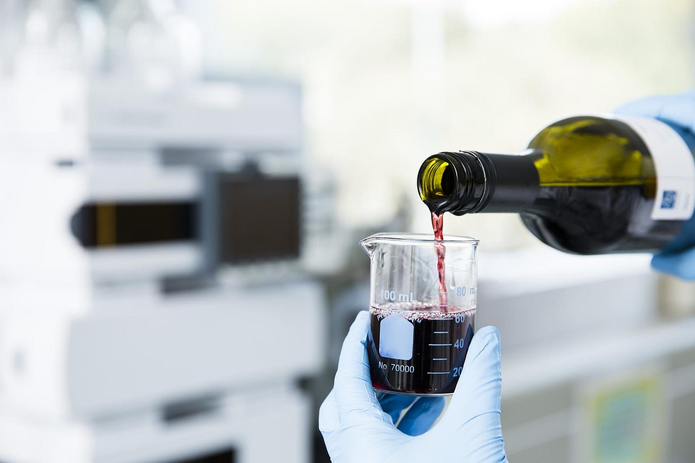
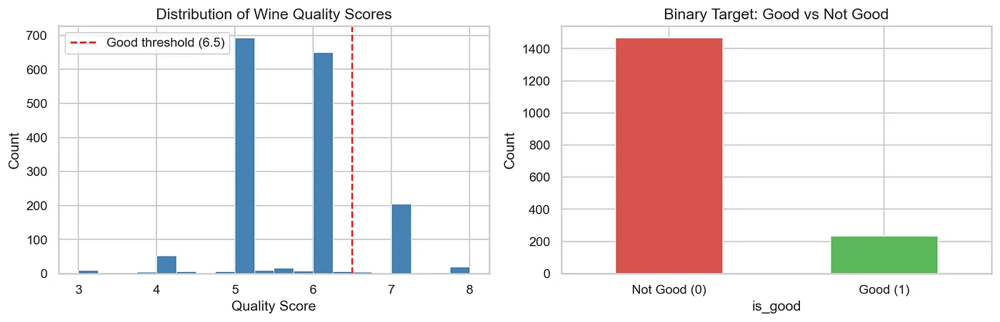
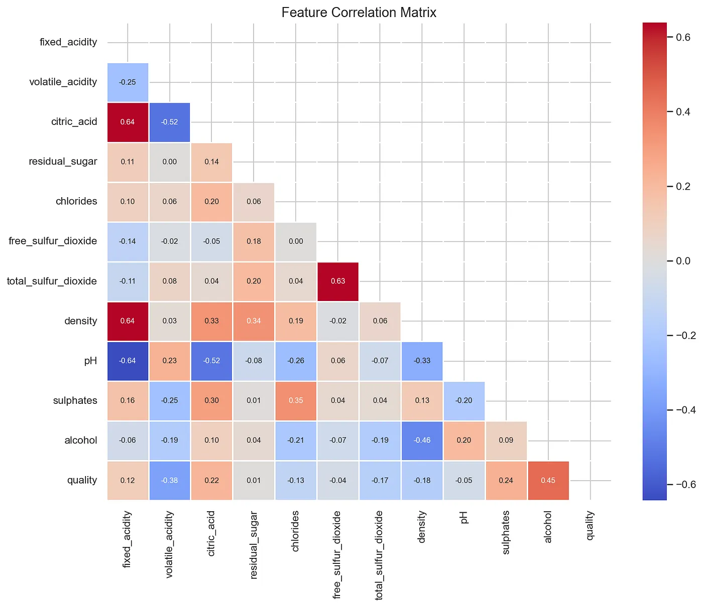
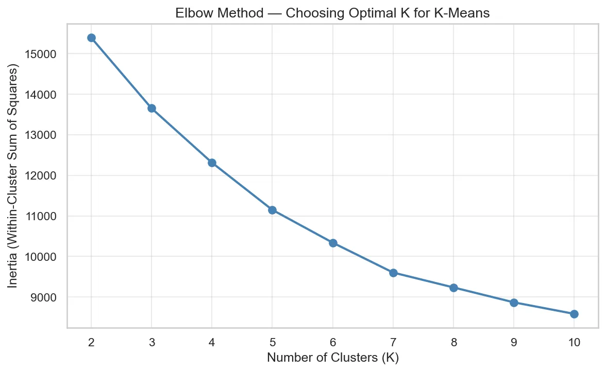
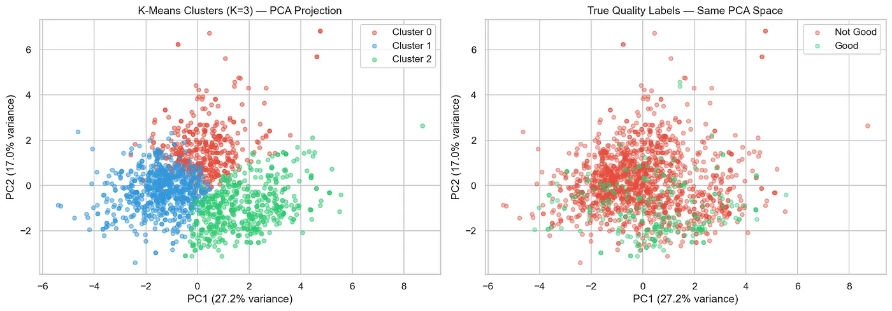
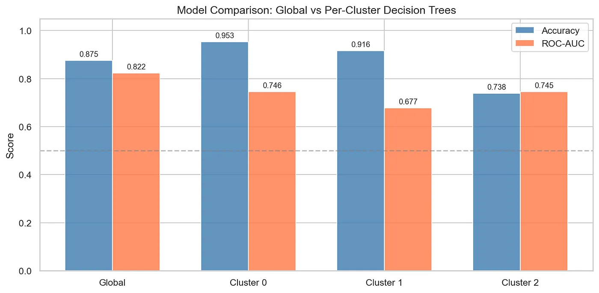
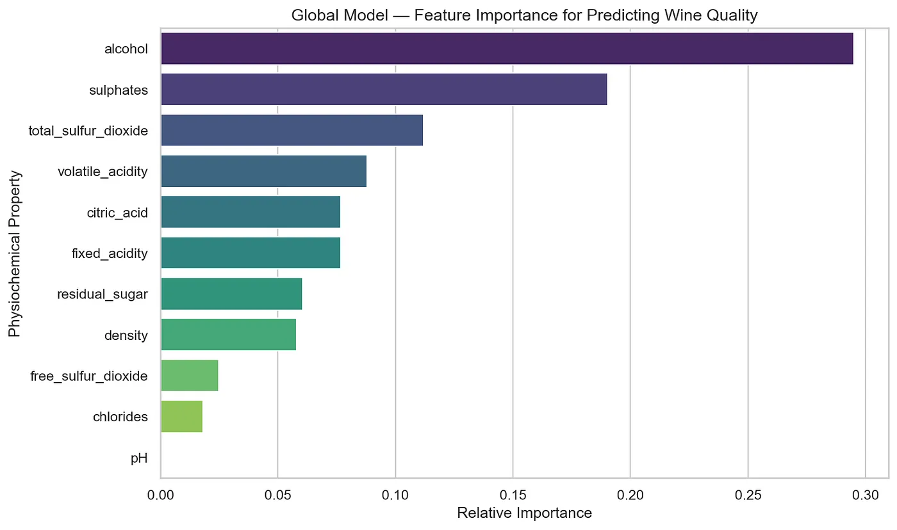
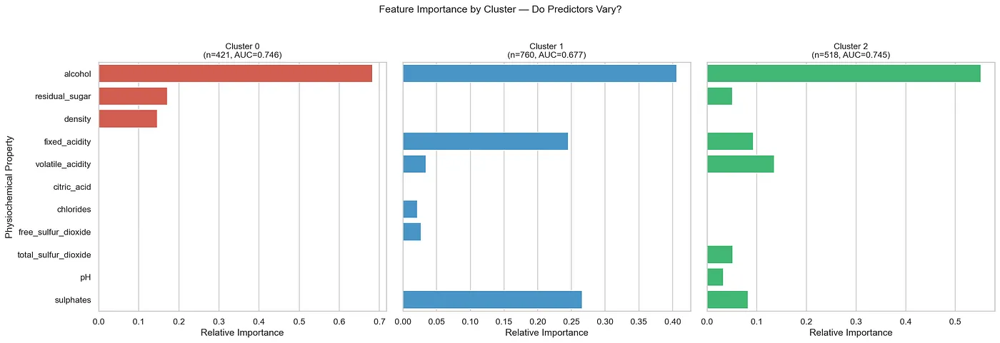
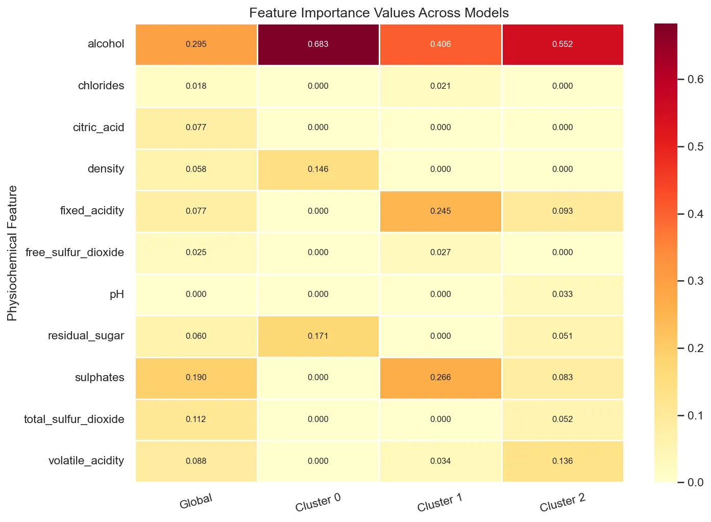
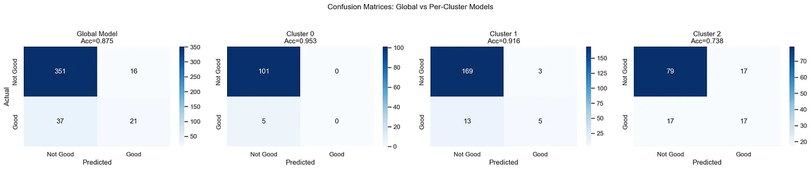

# 我们能如何更好地对葡萄酒品质进行分类？

**作者** Nimbus Kunwar、Tanika Jangam、Hanish Vadlamudi 与 Sifene Fufa

## **引言**

用于评定葡萄酒品质的度量体系在经验丰富的评审之间往往并不一致。专家给出的分数可能因各自的评价而出现显著差异，然而，一旦葡萄酒已经装瓶、待售，葡萄酒本身就再也无法因这些评价的结果而改变或受到影响。这类结果浪费了时间与资源，而它在这个行业里几乎每天都在发生。

我们研究了机器学习模型能否为这个问题提供一种预测性的解决方案。我们提出了两个主要问题：

1.  模型能否仅凭一款葡萄酒的化学性质，就准确预测它是"好"还是"坏"？
2.  那些能预测葡萄酒品质的化学性质，究竟是在所有葡萄酒品种之间一致地适用，还是这些特征会随着葡萄的不同收成而变化？

为了考察这一点，我们使用了一个来自 1,699 个红葡萄酒样本的数据集，每个样本都针对十一项化学特征进行了检测，例如酒精含量、酸度和硫酸盐。我们采用决策树分类技术作为建模方法，把葡萄酒分类为"好"或"坏"。随后我们使用 K-Means 聚类来判断葡萄酒是否会以一种自然的方式聚集到不同的化学分类中。我们确定，葡萄酒品质最稳定的两个指标是硫酸盐和酒精，而葡萄酒本身则形成了一些聚类，这些聚类显示出相当不同的化学特征。因此，这对于酿酒师如何针对不同批次进行生产决策具有切实的意义。

## **研究问题与利益相关方**

我们的主要问题如下：

> **葡萄酒在化学上的哪些性质会对其品质产生最大影响？而这些因素是否会随着用于酿造它的化学成分而改变？**

本项目的利益相关方是某个葡萄酒庄园的葡萄酒生产者或葡萄园管理者。他们必须酿造出高品质的葡萄酒，并且每天都要就生产做出决策。目前，大多数酿酒师只有在葡萄酒被某位专业品酒师评估之后，才会发现自己葡萄酒的品质。那时葡萄酒已经酿成，在那个阶段几乎无能为力。我们的模型为他们提供了某种明显更有用的东西，一种可以在实验室中使用的方法，在葡萄酒仍处于生产过程中时检测某项重要化学性质，并在它尚未准备好之前就预测其品质。

这直接回答了一个问题：

> 在发酵和调配过程中，我应该关注并调整哪些化学物质，才能始终酿造出顶级品质的葡萄酒？

举例来说，如果葡萄酒的品质与酒精含量的关联最为准确，酿酒师就可以尝试让葡萄挂枝更久，或者尝试设法让葡萄形成更多天然糖分，在采收前发展出更多天然糖分。如果葡萄酒中过高水平的二氧化硫对其品质产生负面影响，那么酿酒师可以直接减少为了保护葡萄酒而添加的二氧化硫量。这些改变是可以实现的，并且对葡萄酒品质而言具有实质后果。这让酿酒师在生产过程中有了一份具体的、数据驱动的清单可以遵循，而不必等到葡萄酒酿成才发现它好不好。

## **数据采集**

对于我们的项目，我们本来希望获得更多关于葡萄酒是如何酿造的信息，例如使用了什么类型的葡萄、生产期间的天气状况、土壤状况与质量、发酵温度、陈酿时长等等。此外，能够获取顾客评价或专家品鉴笔记，将有助于为我们提供关于葡萄酒品质的更多洞见，然而这类信息通常非常难以获得，因为它一般不会公开发布。

在我们的项目中，我们获取了来自 [UCI 机器学习数据库的 Wine Quality 数据集](https://archive.ics.uci.edu/dataset/186/wine+quality)，以及同一数据的 [Kaggle 版本](https://www.kaggle.com/datasets/arnavs19/wine-quality-uci-machine-learning-repository)。红葡萄酒数据集有 1,599 条不同样本的记录，每个样本包含 11 项化学性质。这些化学特征包括酒精、酸度、二氧化硫水平和 pH 值。所有样本都已由专家根据其品质在 0 到 10 的范围内进行评分。

*图 1：左侧是 1,599 个红葡萄酒样本原始品质分数的分布，6.5 的分类阈值用红色标出。右侧是由此得到的二元类别分布，86.3% 的葡萄酒被标记为"不好"，凸显了使 ROC-AUC 比准确率更可靠的评估指标的类别不平衡。*

在开始我们的分析之前，该数据集并没有很多空值或错误。然而，为了执行分析仍需要一些数据准备工作。首先，我们修改了列名中所有的空格，把它们替换为下划线，以便在使用 Python 时更容易引用这些列。其次，我们把所有品质分数（如上文所定义）转换成了两种新的分数类型："好"，即品质分数大于 6.5，以及不好，即品质分数小于或等于 6.5。

在使用 KMeans 聚类之前，执行了诸如 StandardScaler 这样的数据标准化，因为在度量某些化学变量时，其中某一个可能会明显大于其他变量。这个过程确保所有特征在 KMeans 聚类过程中获得同等的权重。

*图 2：所有 11 个理化特征与品质分数之间的 Pearson 相关矩阵。酒精与品质显示出最强的正相关（r = 0.48），而挥发性酸度显示出最强的负相关（r = −0.39），这促成了它们在全局模型和按聚类模型中的突出地位。*

## **课程中的模块**

在本次分析中，我们使用了课堂上两个模块的方法，模块 4（无监督学习/聚类）和模块 6（有监督分类/决策树）。

## **模块 4：K-Means 聚类**

我们使用的第一个主要方法是 K-Means 聚类，取自无监督学习模块。这里的思路相当直接，基本上，在询问如何预测葡萄酒品质之前，先问一问所有葡萄酒在化学上是否真的遵循相同的规则是有道理的。我们没有直接假定这 1,599 个红葡萄酒观测值构成一个同质的总体，而是假设葡萄酒可能会自然地聚集成不同的化学画像，并且品质预测因子在这些画像之间可能有所不同。之所以选择 K-Means，是因为它高效，并且在连续数值特征上表现良好。它还会给出硬聚类分配，使建模过程干净且可解释。

与该方法相关的一个关键预处理步骤是使用 StandardScaler 进行特征标准化。这直接来自该模块对基于距离的算法的讨论：K-Means 最小化簇内平方和，这意味着它对特征尺度敏感。像总二氧化硫（取值范围约 6–289）这样的特征，在没有标准化的情况下会完全压制像 pH 值（约 2.7–4.0）这样的特征，导致聚类由数值大小而非有意义的化学变化所驱动。标准化为零均值和单位方差，确保每个特征在距离计算中具有相同的影响力。

为了选择簇的数量 K，我们应用了肘部法，绘制 K 从 2 到 10 取值时惯量的变化曲线，并识别"肘部弯折"，即内聚度的边际收益开始递减之处。基于这张图选择了 K=3，给了我们三个在化学上可解释的聚类，它们在酒精含量、酸度和二氧化硫水平上有着有意义的差异。

*图 3：簇内惯量与簇数 K 的肘部图。曲线在 K=3 处显示出明显的弯折，惯量下降速率在此处大幅放缓，证明了我们选择三个聚类的合理性。*

最后，PCA（主成分分析）被用作一种降维技术，把这些聚类可视化在二维空间中，从而可以并排比较 K-Means 分配与真实品质标签在同一投影空间中的吻合程度。

## **模块 6：决策树分类**

第二个主要方法是决策树分类，取自有监督学习模块。我们选择决策树有两个原因，一是它们高度可解释（特征重要性精确量化了哪些化学性质驱动了预测），二是它们并不期望数据遵循一条直线，这对于化学数据来说确实很重要，因为像硫酸盐与品质之间这样的关系不太可能是严格线性的。

目标变量被设计为一个二元分类问题，例如品质分数高于 6.5 的葡萄酒被标记为"好"（1），品质分数等于或低于 6.5 的葡萄酒被标记为"不好"（0），这大致与"优质"分类的标准行业惯例一致。我们事先进行二值化，使模型不去尝试计算分数，而只是判断优质与否，这样它更有可能分类正确。

本项目在两个层级上应用了决策树：一个在完整数据集上训练的全局基线（最大深度为 5），以及在每个 K-Means 聚类上分别训练的按聚类模型（最大深度为 4，并且每个叶子节点至少 10 个样本，以防止在较小的聚类子集上过拟合）。这种两层级设计直接呼应了该模块关于模型复杂度应如何根据样本量进行校准的讨论。

为了对模型进行评估，我们遵循了所学到的标准有监督学习方法：即训练/测试集划分（75/25，按目标分层以保留类别不平衡）、准确率、ROC-AUC，以及全局模型的 5 折交叉验证 AUC。使用多个指标是有意为之的，因为在不平衡数据上仅靠准确率会产生误导（大约 86% 的葡萄酒是"不好"的），所以 ROC-AUC 分数提供了一种更好的方式来判断我们的模型在区分"好"酒和坏酒方面的表现如何。然后我们最终考察了哪些化学特征对我们整个数据集而言重要，对比那些仅在各聚类内部重要的特征。

## **回答驱动性问题的分析**

驱动性问题：

> 预测葡萄酒品质的化学特征是否会因葡萄酒底层的化学画像而有所不同？

**第 1 步：建立全局基线**

在引入聚类之前，我们在包含 1,599 个红葡萄酒样本的完整数据集上训练了一个单一的决策树分类器，使用葡萄酒中全部 11 个化学特征：

-   固定酸度
-   挥发性酸度
-   柠檬酸
-   残糖
-   氯化物
-   游离二氧化硫
-   总二氧化硫
-   密度
-   pH 值
-   硫酸盐
-   酒精

数据集使用分层抽样按 75/25 划分为训练集和测试集，以保留约 14% 的"好"类别比例。该模型以最大深度 5 进行训练，并在准确率、ROC-AUC 和 5 折交叉验证 AUC 上进行评估。

这个全局模型为余下的分析建立了参照点，既在性能方面，也在它识别出哪些特征最重要方面。全局范围内最重要的预测因子是酒精、硫酸盐和总二氧化硫，与先前的葡萄酒品质文献一致。这个基线回答了平均而言什么因素能预测品质，但它没有说明这个结果是否在不同类型的葡萄酒之间成立，而那正是驱动性问题。

**第 2 步：通过 K-Means 发现化学聚类**

在建立了基线之后，K-Means 聚类被应用于经过缩放的特征矩阵，把葡萄酒分割成化学上不同的群组。肘部法给了我们 K=3 的选择，它产生了三个化学画像有意义地不同的聚类：这些聚类主要沿着酒精含量、挥发性酸度和二氧化硫水平这些维度被分开。

"好"酒的比率在各聚类之间有所不同，确认了品质并非均匀分布，并且某些化学画像比其他画像更有利于得到高品质的结果。

*图 5：把全部 1,599 款葡萄酒投影到二维空间的 PCA 投影。（左）K-Means 聚类分配（K=3）——这三个群组在很大程度上可分，中心处存在预期之中的重叠。（右）同一空间中的真实品质标签——"好"酒集中在投影的右侧，部分地与聚类 2 对齐。*

PCA 可视化确认了这三个聚类在两个主成分维度上是可分的，尽管存在预期之中的重叠，并且聚类结构部分地与品质标签对齐。

*图 9：全局模型和按聚类模型的准确率和 ROC-AUC。聚类 2 的 AUC 为 0.745，与全局基线的 0.822 相比具有竞争力，尽管它仅在 518 个样本上训练。*

**第 3 步：按聚类的决策树与特征重要性比较**

核心的分析步骤是在三个聚类中的每一个内部训练一个单独的决策树分类器。每个聚类专属的模型都仅在该聚类的葡萄酒上以 75/25 的划分进行训练，最大深度略微降低为 4，最小叶子大小为 10，以防止在较小的子样本上过拟合。

对于每个聚类模型，都计算了准确率和 ROC-AUC，并取出特征重要性进行排名。随后这些按聚类的画像被使用分组条形图和特征重要性热力图直接相互比较，并与全局基线进行比较。

*图 4：来自全局决策树分类器（最大深度=5，ROC-AUC=0.822）的特征重要性分数。酒精和硫酸盐是全局范围内占主导地位的预测因子，但这个单一模型是在所有葡萄酒上取平均。下面的按聚类分析揭示了这幅图景如何发生变化。*

这张热力图非常具有信息量，它让我们可以从视觉上检查是否有任何特征在各聚类之间显著地获得或失去重要性，这将表明全局模型是在一些有意义地不同的子总体上取平均。

*图 8：所有模型的特征重要性热力图。各列之间不断变化的模式，尤其是挥发性酸度、固定酸度和硫酸盐的模式——确认了品质预测因子会因化学画像而异。*

**第 4 步：误差分析**

我们为全局模型和每个聚类模型生成了混淆矩阵，以刻画误分类的性质。全局模型的误分类样本按聚类分配进行了分析，这询问了误差是否集中在某个特定的聚类中，如果是，则表明全局模型对那一葡萄酒子集尤其不适用。

*图 10：所有四个模型的混淆矩阵。全局模型的假阴性集中在聚类 1，表明它对那种中段化学画像最不适用。*

## **关键发现**

我们的发现基本上表明，虽然酒精和硫酸盐是重要的预测因子，但它们的影响会因聚类而变化**。**具体来说，像挥发性酸度和柠檬酸这样的特征，在某些聚类中扮演了比全局模型向我们展示的更突出的角色。这确认了驱动性假设，即单一的通用模型确实掩盖了化学性质预测品质方式中的细微之处，而在不同化学制度下运作的酿酒师，将从聚类感知的预测模型中获益，而不是采用一刀切的模型方法。这些按聚类的模型在各自聚类上也展现出相对于全局基线接近或更优的 ROC-AUC 分数，进一步支持了这种新方法的价值。

## **这对酿酒师意味着什么**

全局模型达到了 87.5% 的准确率和 0.822 的 ROC-AUC，其中酒精（0.295）、硫酸盐（0.190）和总二氧化硫（0.112）成为全部 1,599 款葡萄酒中排名前三的预测因子。单独来看，这会暗示出一个通用配方：提高酒精和硫酸盐水平，管理二氧化硫，品质就会随之而来。然而，按聚类的模型揭示出这幅图景并不完整。

K-Means 把这些葡萄酒分成三个化学上不同的群组。聚类 2 是品质最高的聚类，其中 26.4% 的葡萄酒被评为"好"，其特征是更高的硫酸盐（均值 0.754）、更高的柠檬酸（0.467）和更低的 pH 值（3.196）。对于这种画像中的葡萄酒，酒精仍然是占主导地位的预测因子（重要性 0.552），但挥发性酸度（0.136）和固定酸度（0.093）也扮演了有意义的角色，而这些角色在很大程度上被全局模型所掩盖。聚类 1 是一个中段群组（9.7% 的好酒率），显示出不同的模式：硫酸盐（0.266）和固定酸度（0.245）几乎与酒精（0.406）同等重要，表明对于这些葡萄酒而言，矿物平衡与发酵强度一样重要。聚类 0 最为引人注目，只有 5.0% 的葡萄酒被评为"好"，平均酒精含量更低（9.92%），该模型几乎完全依赖于酒精（0.683），残糖和密度作为次要信号；硫酸盐在这一群组中的预测重要性为零。

对酿酒师而言切实可行的要点是这样的：首先，通过检测当前批次的酒精含量、硫酸盐水平和酸度画像，识别它落入哪个化学聚类。如果你的葡萄酒类似于聚类 2，就把重点放在发酵期间管理挥发性酸度上，因为在那种画像中它是一个有意义的品质区分因素。如果它类似于聚类 1，那么调配期间的硫酸盐添加和酸度控制就是你的关键杠杆。如果它落入聚类 0 的低酒精画像，那么主要的干预措施就是在采收前最大化天然糖分的发展，从而推高酒精含量。一条单一的通用规则——"添加硫酸盐，提高酒精"——错过了这些区别，并且是一种比本次分析所提供的聚类感知方法更不精确的指南。

## **常见 Bug 与陷阱**

在复现这项分析时，你很可能会遇到几个值得提前指出的问题。

最常见的问题涉及在严重不平衡的数据上进行分层训练/测试集划分。因为大约 86% 的葡萄酒被标记为"不好"，在调用 train\_test\_split 时不加 stratify=y 偶尔会产生一个"好"样本数量为零的测试集，导致 roc\_auc\_score 抛出一个关于只存在单一类别的 ValueError。请始终传入 stratify=y，以在两个划分中都保留类别比例。同样的问题也可能出现在聚类层级：尤其是聚类 2 的"好"率非常低，在某些随机种子下，25% 的测试划分最终只包含单一类别。我们通过在拟合任何按聚类模型之前检查 y\_c.nunique() < 2 来防范这一点，如果该检查不通过，就跳过该聚类。最后，scikit-learn 的 plot\_tree 在较高的最大深度下可能会产生密集到无法阅读的输出。我们发现，在调用 plot\_tree 时把 max\_depth 保持在 3 或 4（即使拟合的模型使用了深度 5），可以使图表对于演示目的而言保持可解释。

## **AI 协助**

我们在本项目的部分环节中使用 Claude 作为助手，主要用于帮助构建分析流程的结构/起草样板可视化代码（坐标轴标签、调色板、图形尺寸）。所有与模型相关的设计决策，例如 K=3 的选择和 6.5 的品质阈值，都是由团队独立做出的。我们审查了模型建议的每一个代码块，并捕捉到了几个问题：

-   按聚类循环的一个初始版本没有处理单一类别的边界情况
-   特征重要性热力图的一个早期草稿使用了排名顺序而非原始重要性值，这掩盖了各聚类之间实际的量级差异

所有这些错误都在最终 notebook 运行之前得到了纠正。

## **局限性**

尽管我们的分析能够提供预测葡萄酒品质的重要洞见，但仍有许多重要的局限性应当被承认，这些局限性不仅涉及数据本身，也涉及本项目的具体方法论和伦理考量。

## **数据局限性**

本项目使用的数据集（来源于 UCI 机器学习数据库）只有产自葡萄牙 Minho 地区的"红 Vinho Verde"葡萄酒。由于这种地理和品种上的特定性，我们的发现无法推广到其他地区、葡萄品种或不同生产风格的葡萄酒。例如，白葡萄酒与红葡萄酒相比有着根本不同的化学组成。正因如此，白葡萄酒很可能会有极为不同的聚类结构和预测因子。除了这种差异之外，数据集中仅有 1,599 个样本对于机器学习而言相对偏少。某些品质分数区间，尤其是 3 分和 8 分的分数严重代表性不足，这限制了模型对那些对我们的训练数据集而言品质极高或极低的葡萄酒的接触。

## **分析局限性**

我们项目中的一个主要设计决策是把品质分数在 6.5 的阈值处进行二值化。这意味着我们会把一个连续的 10 分制刻度转换成一个二元的"好"或"不好"标签。尽管这是行业惯例，它本质上仍然是任意的，因为在这种转换下，一款评分为 6.4 的葡萄酒会与一款评分为 3.0 的葡萄酒被标记为完全相同。这不仅会丢弃可能相当有意义的品质变化，而且由此产生的、数据集大约 86% 为"不好"的类别不平衡也表明，仅靠准确率是一个有误导性的指标。因此，我们在整个评估过程中优先采用 ROC-AUC，这样一个只是对每款葡萄酒都预测"不好"的模型就无法虚高其性能分数。

对于我们的 K-means 聚类，我们使用了 K=3，因为通过观察肘部图，曲线在 K=3 处显示出明显的弯折，惯量下降的速率在此处大幅放缓。然而，这种方法是主观的，一种偏差更小的方法会利用轮廓系数或间隙统计量来确保 K=3 是一个有效的选择。K-Means 本身也假设各簇大致相等且呈球形，这可能并不反映葡萄酒化学数据的实际几何结构。此外，看看我们的按聚类决策树，这些树是在更小的数据子集上训练的。正因如此，即使有深度约束，过拟合的风险也会增加。

## **伦理考量**

把自动化品质评分应用于葡萄酒生产存在一种伦理上的担忧。一个在历史评分上训练的模型，本质上把那些为这些葡萄酒打分的特定品酒师的偏好当作数据来使用。如果这些偏好带有文化偏见（例如，偏爱更浓烈、更高酒精的风格），那么该模型可能会让以不同传统方法酿造葡萄酒的生产者处于不利地位，尽管那些葡萄酒按其他标准而言酿造得很好。把这个模型部署用于商业用途会强化现有的市场层级，甚至为小型生产者，或不遵循传统方法的生产者制造壁垒。本分析在现实世界中的应用，应当把这个模型的输出当作众多输入中的一个，表明人类专家评审在这一过程中处于核心地位。

## 附录

Tanika Jangam：Github 仓库代码、局限性

Hanish Vadlamudi：课程中的模块、回答驱动性问题的分析

Nimbus Kunwar：引言、研究问题与利益相关方、数据采集

Sifene Fufa：这对酿酒师意味着什么、常见 Bug 与陷阱、AI 协助

Github 仓库链接：[https://github.com/tanikajangam/WineClassification-FinalProject](https://github.com/tanikajangam/WineClassification-FinalProject)
