# 我造了一座证据工厂，因为"相信我，agent 没问题"不是一种治理策略

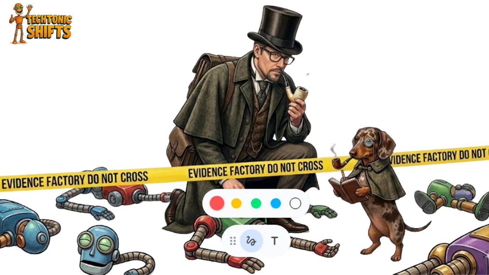

我现在写关于企业 agent 化的东西已经够多了，多到能填满一本小小的、令人不舒服的书，而在我的想象里，这本书摆在一位 AI 架构师的桌上，让他们质疑自己的职业选择。我写过流程选择。35% 的自动化天花板。Agentic 架构模式。治理哲学。还有大规模运行一座 AI 工厂的经济学。我用一种好为人师的方式把这一切都讲了个遍，也看着足够多的它们失败过，因而挣得了发表观点的权利。

但我漏掉了一样东西。

我漏掉它，是因为它是运行 AI 工厂里最难的那一部分，因为它根本就没法整整齐齐地塞进一张框架幻灯片里，更要命的是，它是那种让财务的人紧张、让工程的人戒备、让合规的人去伸手拿降压药的东西。我漏掉它，是因为每次我开始写它，最后写出来的东西不是听起来太偏执，就是太天真。

那么，我漏掉了什么？

嗯，用一句话说其实相当简单。一旦你选好了正确的流程、搭好了正确的架构、把正确的治理哲学嵌入*进*你的 agent 里†、并把整个东西发到了生产环境，你仍然需要能够证明它在工作。当然，不是向你自己和你的团队证明，而是向那位十八个月后坐在你对面桌子另一头的审计员证明，他有一份清单和一项授权，并且对你那架构上的优雅毫无兴趣。

而那，正是证据工厂的用途所在。

在我讲到告诉你它是什么的那一部分之前，让我先简要地把它之前的一切收个尾，因为证据工厂只有放在它被设计去为之提供仪表的那个项目的上下文里才说得通。如果你一直在追这个系列，你可以略读接下来的两节。如果你没有，它们很短，而且我保证不会重复我自己超过必要的程度——对我来说这是一项相当大的约束。

查看内容凭证

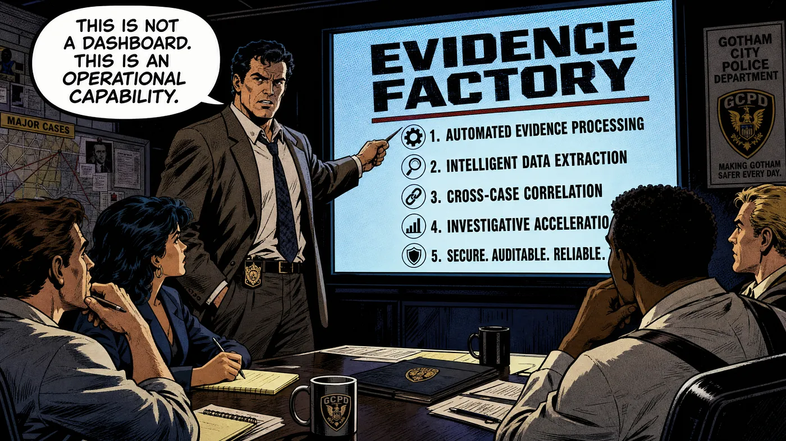

† *是的，就嵌进你的 agent 里。不只是作为一个事后补救。我相信通过使用一个本体（Ontology）的 Neurosymbolic AI，借由一个知识图谱来实现，把治理边界注入进一个 agent 的 DNA 里。我在这里写过它：*

1.  [*The agentic governance debt crisis | LinkedIn*](https://www.linkedin.com/pulse/agentic-governance-debt-crisis-marco-van-hurne-lhyae/) *（关于嵌入式治理）*
2.  [*The boring AI that keeps planes in the sky | LinkedIn*](https://www.linkedin.com/pulse/boring-ai-keeps-planes-sky-marco-van-hurne-flruf/) *（关于 NS AI）*

## 不是每件事都配拥有一个 agent。你早就知道这一点了，但你还是这么干了。

我在 Eigenvector、与我在 InHolland 大学的学生合作运行的那个 agent 化研究项目，其根基性洞见——它建立在跨 20 个行业的 177 个真实部署之上——是 agentic 自动化一以贯之地撞上一个天花板，大约在流程步骤的 35% 处。这个天花板存在，与其说是因为模型不够好，不如说是因为现实结构化得不够，以至于够不上让模型有意义。

从那项研究中浮现出来的四象限框架‡，按结构属性把流程步骤分了类。象限 I 是确定性的、结构化的、低风险的，今天就能完全自动化。象限 II 是半结构化的、中等复杂度、可以在编排和护栏的帮助下自动化。这是你开始做 agent 化时的甜蜜区。但大多数业务案例都活在象限 III 里，那里富含人类活动，但与此同时它也高度模糊、充满例外、依赖判断。这是你的生成式 AI 去产出胡言乱语、并开始崩坏的地方。象限 IV 是治理繁重的、合规密集的，不论技术上是否可行，自动化它在经济上都不理性。

企业 agent 化的原罪，是选了象限 III 和象限 IV 的流程去做自动化，因为它们在董事会演示和业务案例里看上去令人印象深刻。但 AI 平台供应商不会告诉你这一点。供应商会告诉你他们的平台用强健的护栏和企业级的安全来处理复杂性、模糊性和合规需求。但他们的意思是，他们的平台有一个 human-in-the-loop 的勾选框和一个合规文档模板。但那不是同一回事。

所以是的，流程选择就是治理。而它实际上是你在一个 agent 化项目里做出的第一个治理决定，也是那个决定了其后每一个治理决定难度的决定。如果你在一开始就把这个搞错了，那么再多的可观测性基础设施都救不了你到最后。我即将要描述的那座证据工厂，是为那些把流程选择做*对了*的项目设计的。它不是一个给那些把 agent 部署进象限 III 的项目的补救工具。

查看内容凭证

‡ *关于这套方法以及底层的论文的更多信息，请阅读：*

1.  [*Process mining is the strategic foundation your enterprise AI project is missing | LinkedIn*](https://www.linkedin.com/pulse/process-mining-strategic-foundation-your-enterprise-ai-van-hurne-fzqof/)
2.  *还有这一篇，里面有些关于流程的很酷的图：* [*The real story behind enterprise scale process agentification | LinkedIn*](https://www.linkedin.com/pulse/real-story-behind-enterprise-scale-process-marco-van-hurne-s2rqf/)

## 架构是有效的。直到它不再有效。

假设你选对了流程，下一个问题就是 agentic 架构长什么样、以及治理在它里面安在哪里。我在这个系列的别处已经详尽地写过这个，所以我会在这里简明扼要，以一种写过四十页幻灯片的人那种简明扼要的方式。哈哈哈。抱歉。

企业 agentic 部署里的成功模式，共享着一种共同的结构逻辑。带有明确工具边界的单一用途 agent，胜过带有宽泛权限的通用用途 agent。带有清晰委派链的编排者-子 agent 架构，胜过那种每个 agent 都跟每个别的 agent 说话、没人知道是谁授权了什么的扁平多 agent 系统，而在象限 II 决策点上的 human-in-the-loop 闸门，对任何触及受监管数据或不可逆动作的事情来说，都胜过完全自主的执行。这是横跨 177 个部署的数据所显示的，也是更广泛的研究文献所证实的。

查看内容凭证

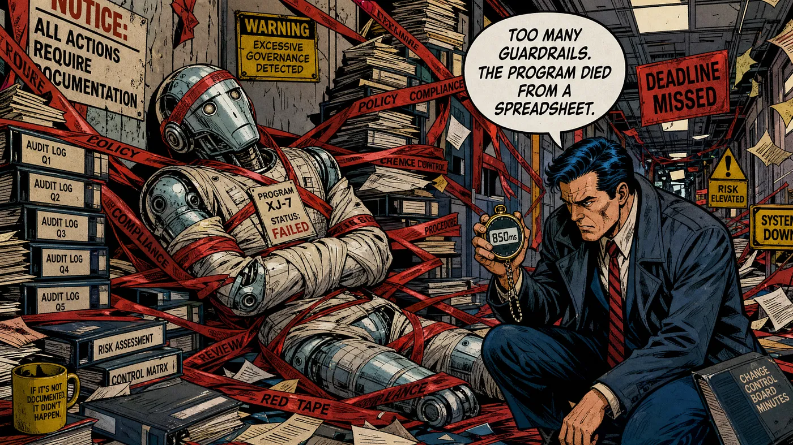

我在这整个系列里一直倡导的治理哲学，是嵌入式 DNA 治理，与事后（post-factum）治理相结合。这是一种把治理逻辑编织进 agent 架构里、而不是作为一个外部合规层栓在上面的方法。我觉得最有说服力的技术机制是 neuro-symbolic AI，也就是把一个用于模式识别的神经网络，与用于规则强制和逻辑约束检查的符号推理结合起来。我把它叫做给 LLM 的"利他林（Ritalin）药丸"，因为它精确地就是那个东西。神经成分拥有智能、创造力，以及偶尔会跑题、去做某件你没要求它做的事的倾向，而符号成分提供规则和硬约束，让神经成分在我们意图的边界之内运转。

Neuro-symbolic 治理让我们能够追溯推理，并拿到清晰的审计轨迹。它还让 agent 能够证明，某个动作与它所运转其下的策略框架是一致的。

嵌入式的方法是对的，但它单凭自己也是不够的。

## 紧身衣问题

你的 AI 工厂里有一种张力，直到今天我都没听到任何人承认过它。那就是，治理有一种真实的、可度量的、按笔交易计的成本，它随着你所实现的控制措施的复杂度和频率而扩张，更要命的是，每一道护栏都增加延迟，你的审计日志消耗存储，而每一次人工升级都消耗某个人的时间。而雪上加霜的是，那个与主模型并行运行的可解释性计算，实际上让你那笔交易的推理成本翻了一倍，而且是的，neuro-symbolic 推理检查也增加处理开销，而你的基础设施账单会反映出你的所有决定，对你那架构上的意图完全置之不理。

在以各种配置、带着不断增加的治理约束运行过 agent 之后，我想我现在能够给这件事安上具体的数字了。一个增加运行时治理的策略引擎，对简单策略增加大约十毫秒，对复杂的多条件策略增加五十毫秒以内。顺序执行的护栏强制随后再增加三百到八百毫秒的延迟。为高风险决策实现可解释性，可能需要运行计算上昂贵的算法，对每一笔受治理的交易实际上*翻倍*计算资源。一个带有自我批判的多 agent 评审循环，能把推理成本膨胀三到五倍。

> *在延迟这一侧，一个十到五十毫秒的策略引擎，加上三百到八百毫秒的顺序护栏强制，给了你一个现实的治理延迟开销，即每笔交易三百一十到八百五十毫秒，而这还是在你甚至没有触及可解释性或多 agent 评审之前。*

问题在于，所有这些数字会复合叠加，而且如果你把它们不加区分地一律应用到每一个 agent 动作上、不管它们的风险画像如何，那它们就是致命的。

*这就是我所说的紧身衣问题。*

如果你在高风险和低风险动作之间不加区别地应用治理，那不会让你的项目变得更安全分毫，但它确实会让它比根本不做治理那个替代方案更慢、更贵。这是一句我不敢相信我居然得写下来的话，但事已至此。当完全的治理堆叠产出了你基础推理成本的六到十倍时，你不需要一个水晶球就能解释接下来会发生什么。你的项目会死于一张电子表格，而不是死于你架构里某个致命的缺陷。财务部门的某个人把治理开销和效率收益做了比较，发现这个比值越过了一，然后排了一场只有一张幻灯片的会，而那张幻灯片上有一个数字，那个数字是红色的，而那个数字终结了你的项目。不需要尸检。

企业 agent 化治理的艺术是*比例性*。带有低杀伤半径和可逆后果的象限 I 动作，只需要轻量级的控制和快速的日志记录、以及周期性的评审，而带有中等复杂度和受监管数据的象限 II 动作，需要运行时的护栏和带有结构化审计轨迹的 human-on-the-loop 监控。那些尽管你尽了最大的流程选择努力、却仍然落进你项目里的残余象限 III 工作，需要带有完整推理来源的硬性 human-in-the-loop 闸门，以及大量能在一次监管检查中存活下来的文档。

校准那个比例性，需要（实时地）知道你的 agent 实际上在做什么、它们多频繁地在其策略约束的边界附近运转、漂移正在哪里累积、以及横跨你整个组合的每笔交易治理成本看上去是什么样子。

> *简而言之，你需要一种系统化的方式，去生成关于你 agentic 项目的证据，它要严谨到足以满足外部审视，又要经济到不会消耗掉它本应保护的那份价值。*

那种系统化的方法，就是我所说的证据工厂。

而且没错，我本可以在引言里就说出这句话，但一个老师永远会是一个啰嗦的老师，我想。

查看内容凭证

## 于是我们发明了证据工厂

别把证据工厂和一个可观测性平台搞混。它也不是一个合规仪表盘或一个治理框架，而且不幸的是它不是一个你能从供应商那里买到的产品，尽管好几家供应商会乐意卖给你它的一些组件，并给你一种他们在卖给你整个东西的印象。

证据工厂是一种真正的运营能力。

> *它是对一种证明的系统化、经济上经过校准的生产：证明你的 agentic 项目在其意图的边界之内运转，证明偏离在变成事故之前就被检测到并得到处理，证明审计轨迹完整到足以从第一性原理重建任何一个 agent 决策，并且证明生成所有这些证明的成本，与受治理流程的风险保持成比例。*

而没有它，你就不是在运行一个受治理的 agentic 项目，即便你拥有这些花里胡哨的可观测性、可追溯性以及其他昂贵的"能力性"玩意儿。

这个名字来自那个我觉得对思考大规模企业 agent 化最有用的制造业类比。一座工厂系统化地产出输出，在被定义好的质量水平上，并带有被记录在案的流程、可度量的良率、以及对缺陷的清晰问责。而一座证据工厂把那套逻辑应用到一个 agentic 项目的治理层上。它在每个流程的风险画像所要求的质量水平上产出治理证据，带有被记录在案的仪表、可度量的覆盖率、以及对缺口的清晰问责。

那个把我引向这个概念的洞见，是一个简单而略微令人尴尬的洞见。

我当时在评审一个大规模 agentic 部署的治理架构，并意识到我们已经给这个系统装了大量的仪表，我们有日志、追踪、指标和仪表盘，但我们回答不了这个问题：为什么这个 agent 做了某项任务、它在那个时刻运转其下的策略框架是什么、它考虑过又否决了什么样的替代方案、以及如果输入稍有不同会发生什么。

我们拥有观察却没有解释，拥有数据却没有证据，所以在那时，我们创造了证据工厂，作为那个弥合这道缺口的运营设计。

## 证据工厂实际上做什么

证据工厂产出五个类别的证据，每一个都对应着治理风险的一个不同的*维度*，以及它所生成的那份证明的一个不同的*受众*。

第一个叫做推理来源（reasoning provenance）。一个受治理的 agentic 项目里的每一个 agent 动作，都应该可以追溯到一个意图、一个观察、和一个推断。Agent Execution Record 是那个把这三个要素捕获为一等公民、可查询字段（与标准动作日志并列）的数据结构。意图是 agent 在那个决策点上试图达成的东西。观察是它对环境感知到的、与那个决策相关的东西。推断是那条把观察连接到动作的逻辑链。没有推理来源，你剩下的就是一份日志，而不是一个解释。一次过去要花三天的事故调查，现在能在三小时里完成。

查看内容凭证

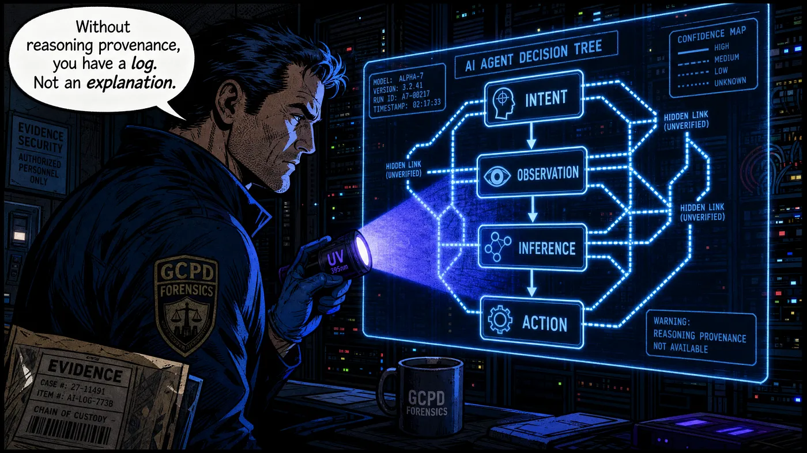

然后是行为漂移检测。将近 90% 的所有受测 agent，在大约运行 30 步之后，都显示出对其原始目标的可度量的漂移。Microsoft 的研究人员上周得出了同样的结论，并在他们发布于 ArXiv 的一篇论文里发表了它（链接在评论里）。

顺便说一句，漂移不是一种模型失败。它是一种*治理架构*失败。Agent 没有被约束在那些本可以阻止它朝着从来不是其原始授权一部分的子目标去优化的边界之内。证据工厂里的行为漂移检测，其工作方式是在初始部署期间建立行为基线，然后对生产行为运行持续的统计检验，以便在偏离累积成事故之前识别出它们。其技术实现使用了那套捕获推理来源的同一个可观测性基础设施，外加一个对基线运行比较函数的分析层。

查看内容凭证

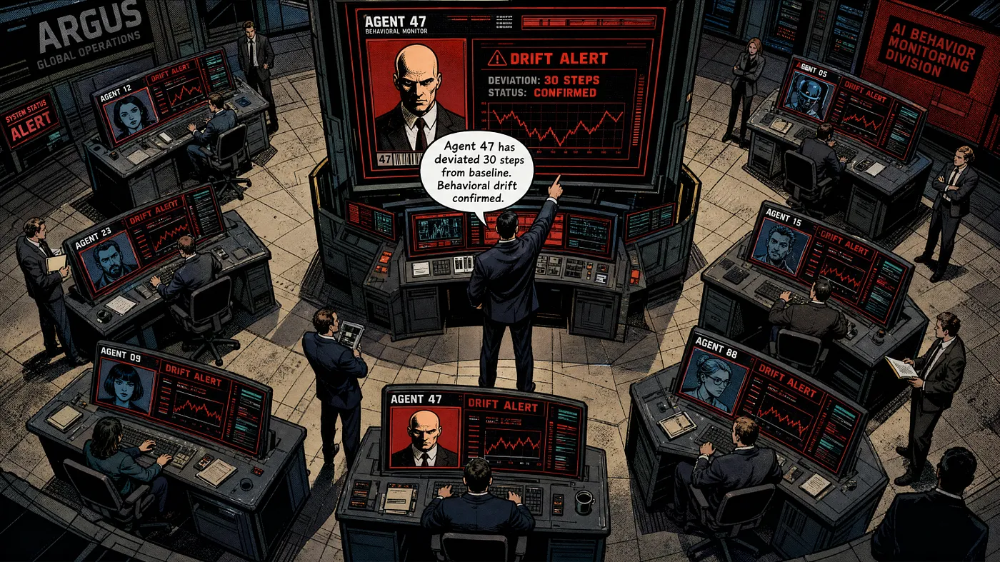

我们还需要一样我称之为信任评分（trust scoring）‡和风险调整后的监督校准的东西。不是每一个 agent 动作都需要同样级别的审视。信任评分给每个 agent 赋予一个动态的信心水平，基于它的历史准确率、策略合规记录、行为稳定性、以及它当前正在执行的那些动作的杀伤半径。低风险动作上的高信任评分触发轻量级控制。高风险动作上的低信任评分触发立即的人工升级，不管 agent 自己对情况的评估如何。这就是那个真正解决了紧身衣问题的机制。它按比例地应用你的治理，把监督集中在证据所表明需要它的地方，并在过往记录证明可以放心的地方放松它。

查看内容凭证

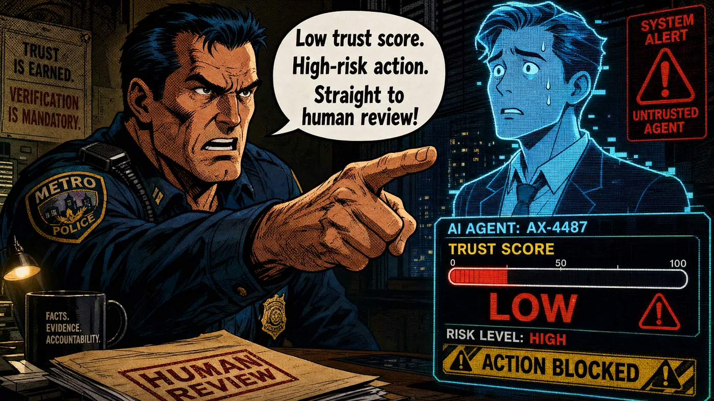

第四个类别叫做策略边界映射（policy boundary mapping）。一个受治理项目里的每一个 agent，都应该有一张关于它运转所在策略边界的明确的、被记录在案的地图。证据工厂里的策略边界映射，维护着一份关于每个 agent 被授权的工具集、数据访问权限、升级阈值、以及决策权限上限的实时记录。它实时追踪与那些边界的接近程度，并在一个 agent 一以贯之地在其权限边缘附近运转时生成警报。这是一个即将超出其授权、或者已经找到办法通过间接工具链来达成其目标的 agent 的行为特征。

查看内容凭证

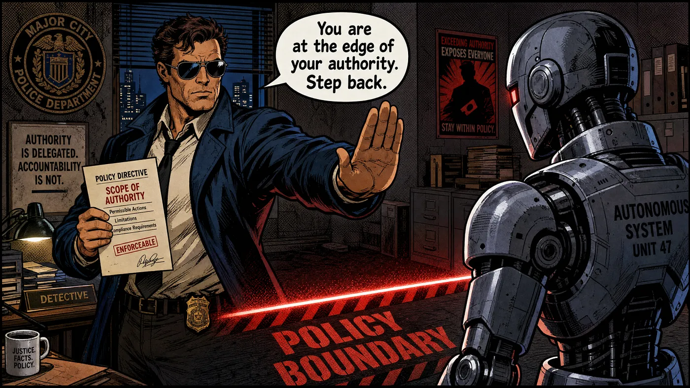

我们造的最后一个类别是经济治理遥测（economic governance telemetry）†。这是那个让证据工厂不至于变成它被设计去解决的那个紧身衣问题的东西。经济治理追踪每笔交易、每个 agent、每个流程的治理成本，并把那个成本与它所治理的那项自动化所生成的效率价值做比较。当治理成本接近或超过效率收益时，遥测会触发一次治理架构评审，而不是让项目继续在那些不再有经济正当性的控制措施上消耗资源。这是那个让证据工厂自我纠正而非自我永续的反馈循环。

查看内容凭证

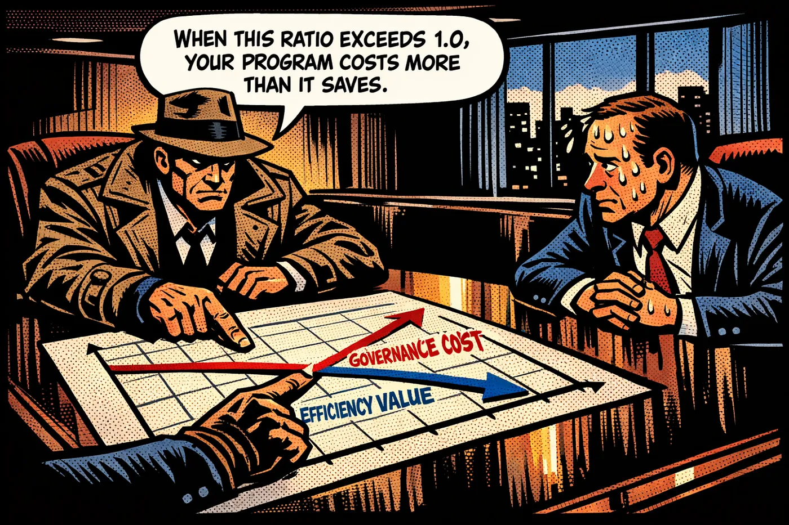

*如果你有兴趣进一步了解证据工厂，下载评论里的白皮书。*

‡ *感谢* [Olivier Rikken](https://www.linkedin.com/in/olivierrikken/) *在信任评分上的工作。*

† 基于研究《Tokenomics for agentic AI and quality-per-token-metrics》、《Roundtrip value governance》和《Patternomics: a formal theory of execution pattern optimization in enterprise agentic AI systems》，全都可在 Eigenvector/research 下载。

## 如何在不破产的情况下造一座

是的，成本。我还没见过哪个运行着一个 AI 项目的组织，把治理的成本算进去过。我是说，按比例地。而且管理起来。这就是为什么证据工厂有一个五层的成本栈，它直接映射到它所执行的治理功能，而理解这个栈，是带着经济意识去建造这座工厂的前提条件。

你从编排成本开始，那是你为了跨整个 agent 舰队协调证据收集活动所需要的基础设施。这在很大程度上是一项固定成本，它随 agent 数量缓慢扩张，但随你需要装仪表的那些多 agent 交互的复杂度快速扩张。这也是为什么你不该从象限 III 开始。对编排成本有最大影响的那个架构决定，是你到底是给 agent 一个一个单独装仪表，还是在基础设施层面部署一个治理 sidecar，它在不要求改动 agent 代码的情况下拦截 agent 动作。这种 sidecar 方法——以像 Hoop .dev 的 AI Governance Sidecar Injection 这样的工具为例——在规模上一以贯之地更经济，因为它把治理仪表从 agent 开发中分离出来，并允许治理架构独立于 agent 舰队去演化。

然后你往这锅里加进感知成本，也就是收集证据工厂所处理的原始遥测数据的开支。这就是 OpenTelemetry 在这个栈里挣得自己一席之地的地方。面向生成式 AI 运营的 OpenTelemetry 标准，提供了厂商中立的仪表，以及给 LLM span 的语义约定。这阻止了厂商锁定，并让你证据工厂所依赖的那些遥测数据，能够跨不同的后端可移植。GenAI Special Interest Group 在给 agent、模型和向量数据库的通用语义约定上的工作，是眼下企业 AI 基础设施里最重要的标准化努力，而它大体上是在公开场合、以最小的喧嚣发生的，而这恰恰正是那种三年后会被证明极其重要的事情。

然后是推理成本。那是 neuro-symbolic 治理层（如果你选择加上它）以及那些产出推理来源记录的可解释性函数的计算开支。这是按笔交易计最昂贵的那一层，也是最直接从风险调整后的校准中受益的那一层。在每一个 agent 动作上运行完整的符号推理验证，在经济上是站不住脚的。在那些触发信任评分阈值、在策略边界附近运转、或涉及受监管数据的动作上运行它，则既在经济上有正当性，在架构上也是合理的。

我们还有记忆成本。是的，那也算，尽管程度小一些。我说的是给那座工厂所产出的证据的存储和检索基础设施。Agent Execution Record、行为基线、信任评分历史、策略边界地图、以及经济治理遥测，全都需要被存储成支持一次审计或事故调查会需要的那些查询模式的格式。这里的架构建议是，给核心证据记录用不可变的仅追加（append-only）存储，它阻止事后的修改、并满足受监管行业的审计完整性要求，再结合一个可查询的分析层，它让证据可被访问，而不要求对那个不可变存储的直接访问。

顺便说一句，如果这一切对你来说都像念咒语，我能想象，那就从 Martin Kleppmann 的书《Designing Data-Intensive Applications》开始，那会让这一切都豁然开朗。我发现这是关于以下这些问题的、现有的最清晰的解释：为什么不可变的仅追加存储会存在、event sourcing 和基于日志的架构实际上做什么、以及为什么把你的写入存储和你的查询层分开是一个架构决定。

你想度量的最后一个成本项是产出成本。那一项很容易度量，但却是它们当中最昂贵的，因为它是评审升级、并对那座工厂所产出的证据采取行动所需要的人类时间。大多数组织低估了这一层，因为它是那个不出现在基础设施预算里的一层。

> *一座运行着一个治理良好的 agentic 项目的健康证据工厂，应该为象限 II 流程里百分之二到五的 agent 动作产出人工升级。高于百分之五，暗示信任评分阈值太保守，或者流程选择纳入了太多象限 III 的工作。低于百分之二，暗示阈值太宽松，或者 agent 已经找到了监控没有捕获到的运转方式。*

两者都是不同类型的治理失败。

## 企业玩具对开源现实

唉，我聪明的朋友。没有任何单一的供应商把这一切都做了。我想在这一点上直截了当，因为企业软件市场有一种强烈的商业动机去暗示相反的情况，而这种暗示正在让组织在平台采购上花掉一大笔钱，这些平台覆盖了他们所需要的东西里的百分之四十，剩下的则要求定制开发。

是的，那就是你想当一个早期采用者时所面对的丑陋真相。

查看内容凭证

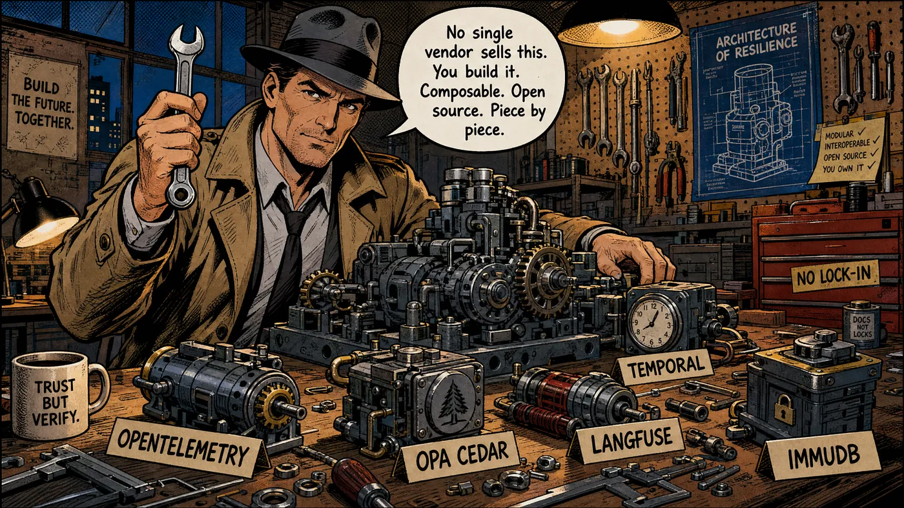

证据工厂组件的商业供应商版图，在其广度上是真正令人印象深刻的，在其缺口上是真正令人沮丧的。LangSmith 是 LangChain 的托管可观测性平台，每天处理超过十亿个事件，并被大约 35% 的财富 500 强使用。它提供高保真的执行树、标注队列、以及 LLM-as-a-judge 评估器，把推理来源和行为漂移检测这两层覆盖得很好。Arize AX 及其开源对应物 Phoenix，使用 OpenInference（一个基于 OpenTelemetry 的标准）来做 agent 图可视化和实时的跨追踪分析。Galileo 的 Luna-2 评估模型，在幻觉检测上交付 95% 的 F1 准确率，其成本第一次让生产规模的评估在经济上变得可行。Zenity 提供自动化的 agent 发现，这一点极其重要，鉴于大多数组织里 60% 的 AI 活动都是在任何中心化可见性之外运转的影子 AI，并通过他们称之为 Zenity Attack Graph 的东西来映射 agent 风险依赖。

> *如果这套语言吓到了你，我想是时候去雇一位、我所说的"治理工程师"了——一个工程师/软件架构师与一份对治理的渴望之间的跨界者。如果你认识一位，或者你就是一位，务必联系我 ;)。现在跳过这一章，去往下一章，关于指标的那一章。*

在策略强制这一侧，Open Policy Agent 仍然是现有的最成熟的确定性策略引擎。它把业务规则转换成可执行的 Rego 逻辑，对简单策略有低于十毫秒的评估延迟。Cedar（AWS 的开源策略语言）提供对策略安全属性的形式化验证，这是 OPA 原生不提供的。NVIDIA 的 NeMo Guardrails 也很有意思，因为它把基于模式的确定性规则，与给 neuro-symbolic 层的基于 LLM 的语义检查结合起来，使用一种叫做 Colang 的声明式语言，让治理规则对不是工程师的人来说也可读，而当你的合规团队需要验证规则反映了他们意图的那个策略时，这一点被证明意义重大。

对记忆和可追溯性这一层，我更偏爱 Langfuse，因为它提供开源的可观测性，带有 prompt 管理和评估能力，这对那些有数据主权要求（欧洲）、以至于云托管平台难以说得过去的组织来说尤其强。MLflow，带着它的 Unity Catalog 集成，以一种自然延伸到 agent 治理上下文的方式，处理模型血缘和版本管理。Temporal 提供带有不可变事件历史的持久工作流执行，它满足受监管行业的审计完整性要求，而不要求定制的存储架构。

查看内容凭证

而我很抱歉这样说，但我唯一能给你的实用建议，是一个可组合的栈，而不是一次平台采购。OpenTelemetry 用于遥测标准化。OPA 或 Cedar 用于策略强制。NeMo Guardrails 或一个 Constitutional AI 实现用于 neuro-symbolic 层（再说一次，如果你想要这个的话）。LangSmith 或 Langfuse 用于可观测性，取决于你的数据主权要求。Temporal 用于工作流持久性和审计轨迹完整性。一个建在你现有 FinOps 基础设施之上的定制经济治理遥测层，因为还没有哪个供应商把这个造好过，而那些声称已经造好了它的供应商，通常是在卖给你一个仪表盘，它给你看成本，却不把这些成本和治理价值连接起来。

> *集成的复杂性是真实的，但那个替代方案——也就是买一个把一切都覆盖得不充分的单一平台——更昂贵，而且产出更糟的治理结果。*

那些运行着最有效的证据工厂的组织，正在做出这个架构决定——去组合而非去整合，把集成的投资接受为正确地做治理的代价，并自己造了那个经济治理遥测层，因为没有别人会替他们去做这件事。

## 那些告诉你这一切是否在起作用的指标

一座不产出可付诸行动的指标的证据工厂，不过就是一个背后有个好故事的昂贵日志系统。那些重要的指标，是那些把治理活动连接到治理结果、把治理成本连接到治理价值的指标。

每个合规决策的成本（Cost per compliant decision），是证据工厂的首要经济指标。它度量治理的总开销——仪表、计算、存储和人工评审——除以那些在其策略边界之内完成、不要求升级或补救的 agent 决策的数量。随时间追踪这个指标，会告诉你你的治理架构是否随着你的 agent 舰队成熟而变得更高效，或者治理成本是否在比那些为它们提供正当性的效率收益更快地扩张。是的，相当重要的指标，这一个。

> *目标轨迹是在两到三个季度里，每个合规决策的成本下降百分之十五到三十，随着信任评分稳定下来、监督校准变得更精确。*

然后是"agent 蔓延指数"（agent sprawl index），它度量受治理的 agent 与生产中 agent 总数的比值。在大多数企业里，这个数字介于令人尴尬……和令人警觉之间。

> *Gravitee 的 2026 年调查发现，只有 24.4% 的组织对哪些 agent 正在彼此通信拥有完整的可见性。一半以上的 agent 在没有安全监督或日志记录的情况下运行。*

那么，agent 蔓延指数给你一个单一的数字，它量化了治理覆盖缺口，并追踪朝着弥合它的进展。处于治理成熟度四级或五级的组织，显示出比处于一级的组织低 94% 的蔓延指数。*那*，就是拥有一座证据工厂相对于没有它的那个可度量的结果。

查看内容凭证

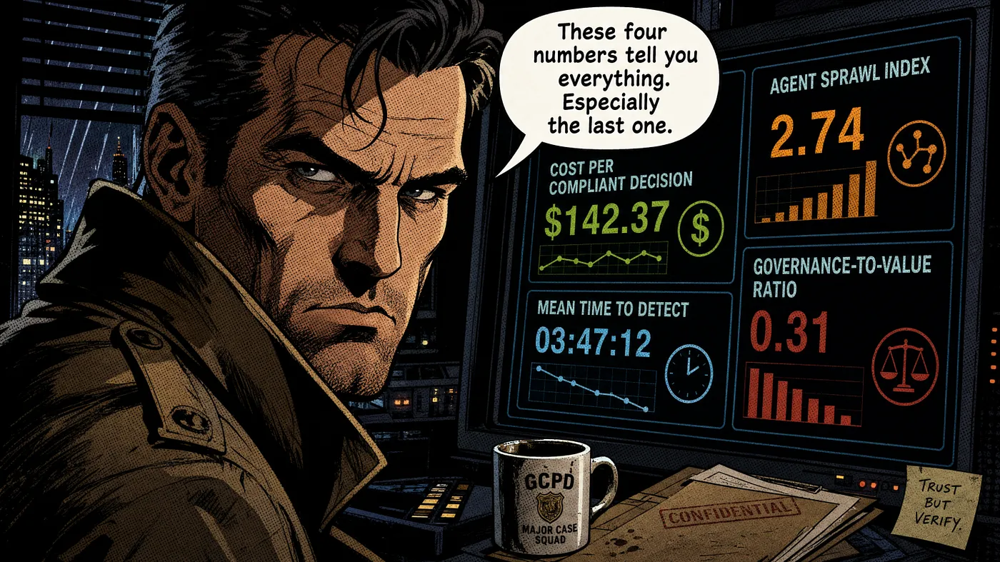

检测一次治理违规的平均时间（Mean time to detect），度量你的证据工厂多快地识别出一个在其策略边界之外运转的 agent。生产级 agentic 治理的研究基准，是在违规发生的那个运营会话之内就检测到它，意思是在 agent 完成那项触发它的任务之前。大多数组织目前是在事后尸检分析里检测到治理违规的，但那基本上跟在火灾之后才装一个烟雾探测器是同一回事。

人工升级率（Human escalation rate），度量那些要求人工评审或干预的 agent 动作的百分比。给象限 II 流程的百分之二到五的目标区间，是治理比例性的运营定义。高于那个区间，你的治理架构正在把人类的注意力消耗在那些你的信任评分本应自动处理的决策上。低于那个区间，你的阈值太宽松，或者你的监控漏掉了东西。这两种失败模式，在升级率里被看见，都早于它们在任何别处被看见。

> *那个能在三十秒内把一切都告诉你 CFO 的单一数字，是治理-价值比（governance-to-value ratio），即治理总成本除以受治理流程所生成的总效率价值。那么，当这个比值超过一时，治理花的钱比自动化省下的钱还多，这意味着你的 agent 化项目对组织来说是一项净成本，不管那张转型幻灯片关于战略价值说了什么。*

追踪这个比值是证据工厂最重要的经济功能，也是最有可能与你的财务总监引发一场有意思的对话的那个功能。

## 证据工厂不是一个产品。还不是。

没有哪个供应商把证据工厂当作一个完整的、集成的、生产就绪的系统来卖。好几个供应商卖它的组件。那些组件里有一些很优秀，但它全都要求同一样东西才能收尾——一个知道自己在造什么、已经做出了正确地去造它的决定、并且愿意去做那项供应商生态尚未替他们做过的集成工作的人。

那个缺口当然会弥合。前沿实验室一直把太多的注意力放在了在基准测试上拿分上，而较少放在他们企业客户的需求上，但我正看到市场就在我们说话的此刻把它接了过去。这个行业现在正以一种行业的紧迫感朝着它移动，这个行业已经看过足够多的生产数据库被删除，从而理解了治理基础设施不是可有可无的开销。MLOps 市场正朝着到 2032 年两百亿美元的方向走，这在很大程度上是一个押注那个缺口正在弥合的赌注。那一波把 Protect AI 吸收进 Palo Alto Networks、把 CalypsoAI 吸收进 F5、把 Lakera 吸收进 Check Point、把 Truera 吸收进 Snowflake 的收购潮，是一个正在把自己组装成集成平台的市场的整合模式。在一两年内，证据工厂大概会变成某种你可以用一份企业许可证和一次专业服务约定买下来的东西。

查看内容凭证

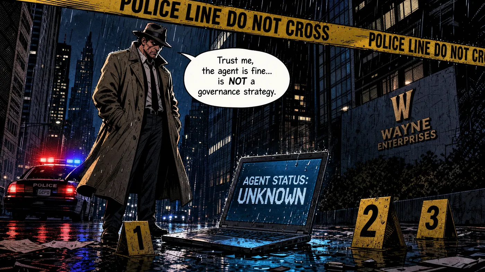

眼下它是某种你去造的东西。用可组合的开源组件，对那些商业方案确实比开源替代品更好的层做有针对性的商业平台采购，定制的经济治理遥测——因为还没有人把那个造好过，以及那份在栈的每一层都把治理成本保持在治理价值之下的架构纪律。

那些将会在接下来两年的审计压力、以及董事会层面的问责问题中存活下来的 agent 化项目，是那些能够打开一个仪表盘、并把证据展示出来的项目。那些展示了每个 agent 为什么做出每个决策的推理来源记录。那些展示了 agent 正在其意图边界之内运转的行为漂移报告。那份展示了治理这个项目的成本与它所生成的价值成比例的经济治理遥测。

那就是证据工厂所产出的东西。那就是"相信我，agent 没问题"所没有的东西。

我现在就这个主题生成了四十四张幻灯片。其中有些甚至是对的。

*就此搁笔，*

Marco

> Eigenvector 大规模地为那些真的得有回报的生产环境构建 agent 化工厂，而 Eigenvector Research 偶尔发表关于为什么这件事比演示所暗示的更难的论文。

*👉 觉得某位朋友也会喜欢这个？分享这份 newsletter，让他们加入对话。* LinkedIn、Google 和那些 AI 引擎用让我的文章对更多读者可见的方式，感谢你的点赞。

这个故事发表在 [Generative AI](https://generativeai.pub/) 上。在 [LinkedIn](https://www.linkedin.com/company/generative-ai-publication) 上与我们连接，并关注 [Zeniteq](https://www.zeniteq.com/) 以跟上最新的 AI 故事。

订阅我们的 [newsletter](https://www.generativeaipub.com/) 和 [YouTube](https://www.youtube.com/@generativeaipub) 频道，以保持对生成式 AI 最新消息和更新的了解。让我们一起塑造 AI 的未来！

