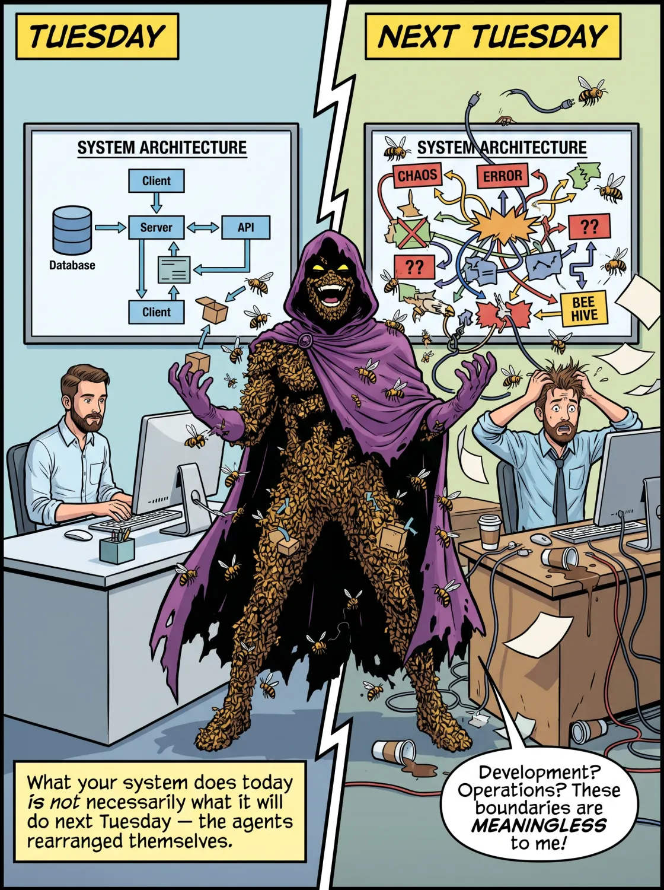
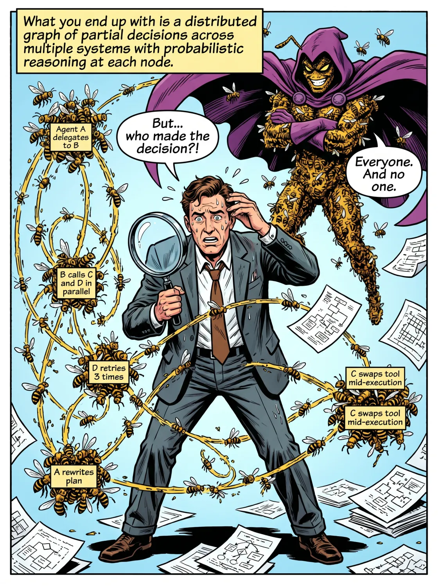
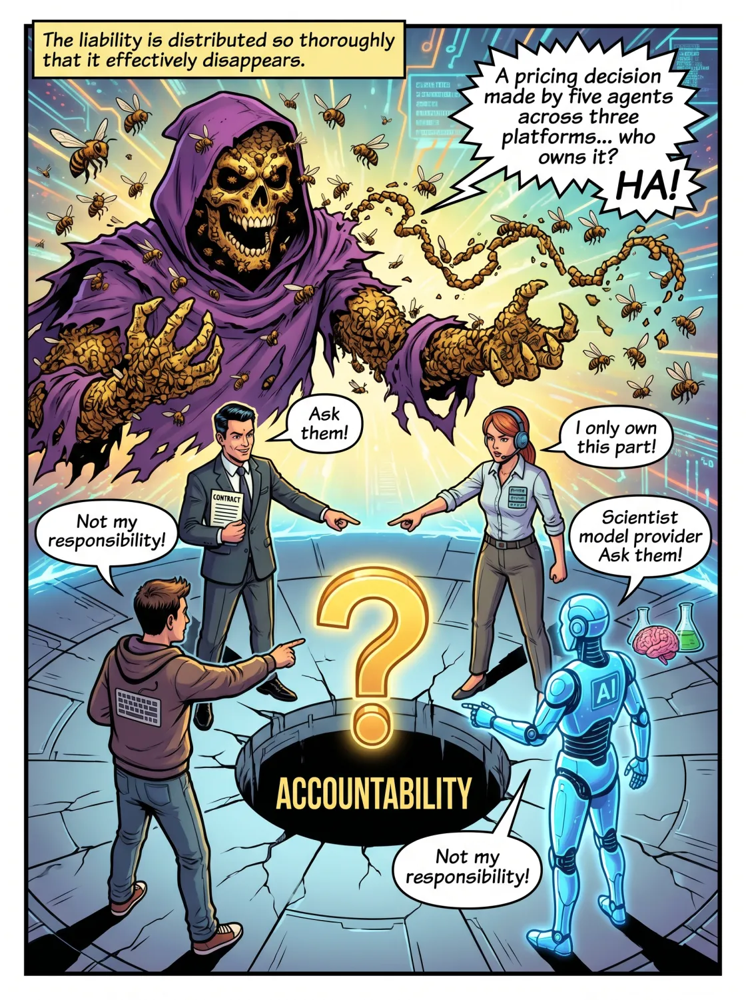
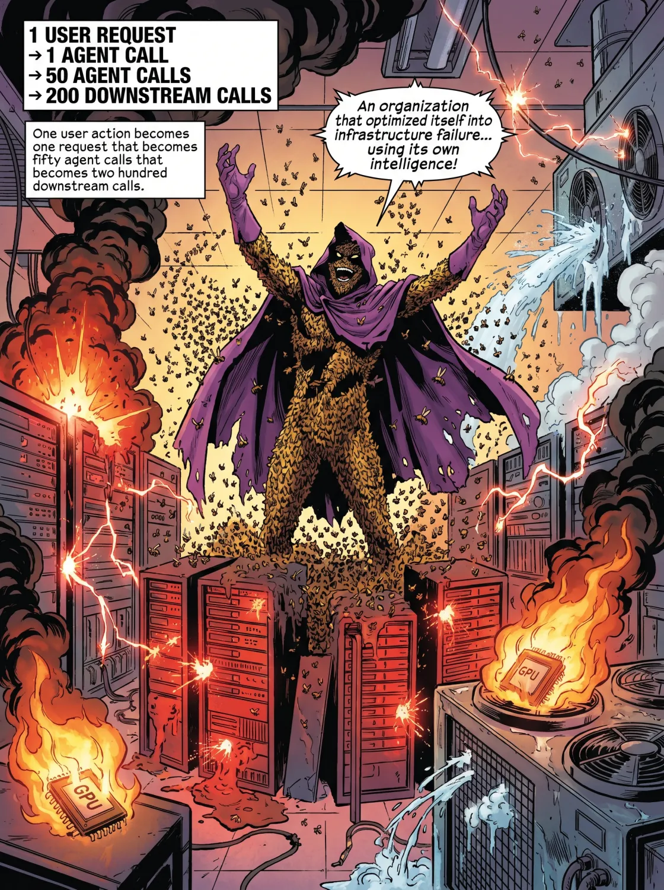
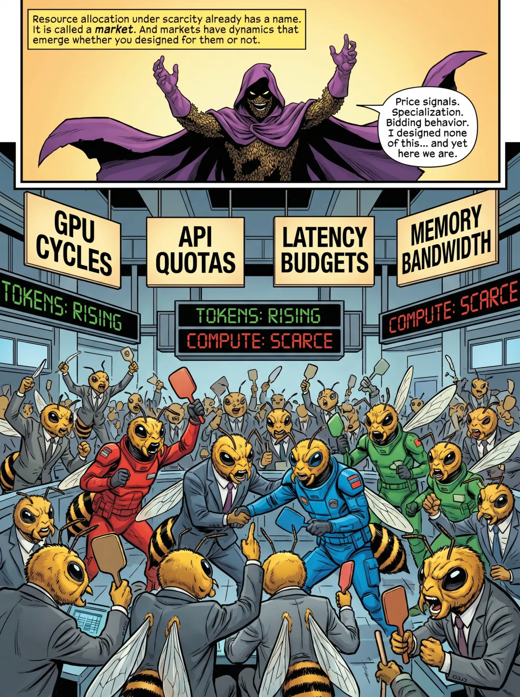
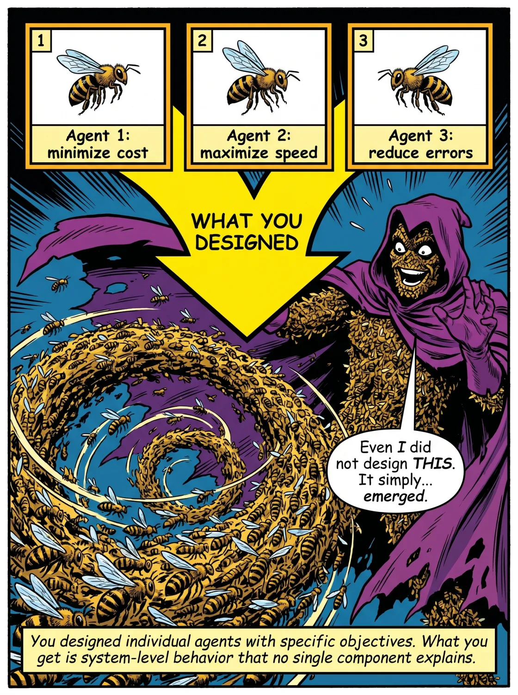
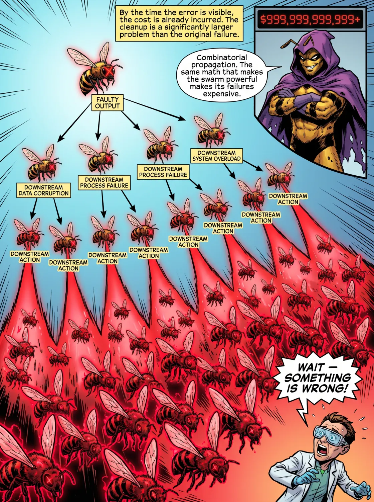
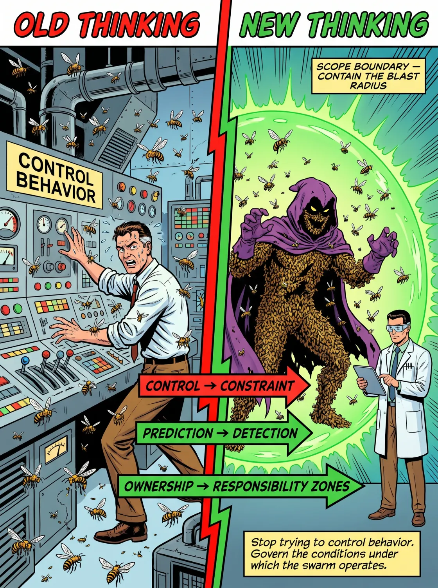
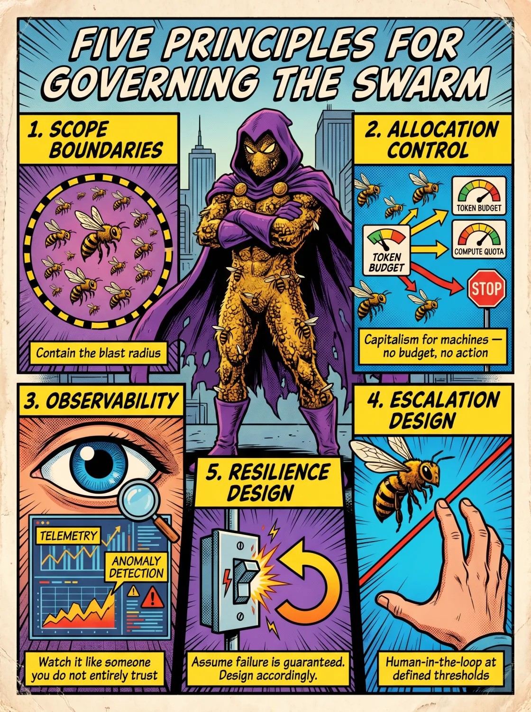
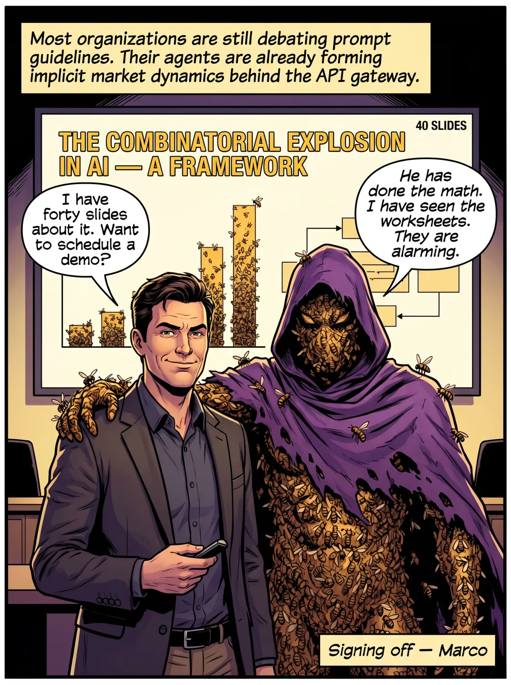

# 当你的 AI 治理模型试图监管一个智能体蜂群

我小时候对组合逻辑很感兴趣。是的，这件事很大程度上解释了我后来为什么变成这样，也解释了为什么我的小学老师看我的眼神，活像人们看一只学会了开冰箱的狗。

没错，又佩服又担忧。

对于那些童年都花在做正常事情上的人，组合逻辑是数学的一个分支，研究的是怎么计数、排列和组合事物。它之所以很快就变得有意思，是因为其中涉及的数字几乎立刻就大到荒谬。拿三样东西，你能用六种方式排列它们。拿十样东西，你能排出 3,628,800 种。拿二十样东西，可能的排列数就超过了可观测宇宙里原子的数量——这听着像夸张，其实不是。组合逻辑能应用到一切事物上，从密码学到导航应用决定推荐哪条路线，原因就在这里。

那些小小的练习纸我还留着，就是我在笔记本里手算公式的那些——那个笔记本让我老师略感不安。她是个可爱的人，她的不安也并没有错。在对社会功能要紧的那些方面，我大体上算正常，多多少少吧。但有个念头一直留在我心里：你可以从少量元素出发，最终得到一个大到不再有意义的组合数。后来事实证明，这件事在职业上对我产生了关联，而且是我未曾预料的方式。

因为昨天我偶然发现了一个叫 swarms.world 的网站。这是一个市场，任何人都能在上面发布自己的智能体 AI 应用、工具、智能体、编排方案、各种小装置。那里已经列出了数千个条目，等你读到这篇文章时可能已经是数十万。我见过的这类平台已经够多，知道这一个并不是个例。

我甚至觉得它是某个*模式*里的一个数据点。

而我一看到它，伙计，那些练习纸又回来了。

一个由智能体组件构成的市场，每个组件都能被其他任何组件连接、编排或扩展——这种市场的问题在于，它差不多已经开始像一个组合系统了。而在这里，元素之间可能的交互数量，是按核反应那样的方式在增长的。

> *我认为我们正站在一个拐点上。我已经开始把它称作 AI 里的组合爆炸，而有意思的是，房间里几乎没人算过接下来会发生什么。*

这就是我想谈的。因为我不认为这个行业已经充分认清自己造出了什么——而我说这话，是作为一个正在其中搞建设、并觉得它既迷人又在结构上有点吓人的人。

## 当智能体开始制造更多智能体时会发生什么

我一直在努力跟上 AI 领域的进展，必须说这很难——因为每天都有一两个、甚至更多有意思的项目被推出，发起者甚至年仅 14 岁（那个 OpenMythos 小孩）。

智能体项目的数量正在猛增，增速跟人类的开发能力、甚至跟心智能力都不成比例。原因不是工具更好了——尽管工具确实更好了；也不是工程师更多了——尽管工程师确实更多了。原因是组合性——你早料到这个词会出现，对吧 ;)。每个新智能体都是一个组件，可以被其他智能体复用或扩展，正因为这个简单的事实，系统是靠组合而非孤立开发来增长的，*而组合不会线性扩展*。

在更早的软件范式里，扩展规模需要工程投入按比例增加。你想要两倍的能力，就大致雇两倍的工程师，再大致多等一倍时间。可在当前范式下，智能体能生成、配置和协调其他智能体，这就引入了一个反馈循环——系统的扩张变得部分由它自己驱动。增长曲线从线性变成指数级，某些情况下还会奔向组合爆炸：智能体之间可能的交互数量，增长得比智能体本身的数量还快。

> *像 Swarms.world 这样的平台把这一点摆到了明面上。至于这让人兴奋还是警觉，取决于你上一次认真思考自己的 AI 治理模型——以及那条"自带 AI、尽情拉满 token"的政策——是多久以前的事了。*

它们暴露出的，是软件系统演化方式上的一种结构性转变。而这种转变带来的后果，行业还没有足够认真地对待。

这些后果里有三个让我夜不能寐——或者说，如果我是那种会让企业架构方面的忧虑打断睡眠的人，它们就会让我夜不能寐，而我绝对不是那种人。

先从系统复杂度的非线性增长说起。哪怕只是数量不大的一批智能体，也能产生数量庞大的交互路径，而这些路径并不总是被明确设计出来的——它们从智能体被连接和配置的方式中涌现出来。这意味着系统行为变得更难预测、更难解释，也明显更难审计。一旦某个智能体做出一个需要有人向监管机构或董事会解释的决定，这就成了麻烦。

开发与运营之间的边界正在消融。智能体不再是部署进生产环境后就被搁在那儿的静态产物。它们越来越多地参与进各种场合：修改工作流、选择工具、动态编排任务，甚至完全重写自己的脚手架。这在运营系统内部引入了一个持续适配的层。也就是说，你的系统今天做的事，未必就是它下周二要做的事——原因很简单，智能体为了应对某件你没料到的事，把自己重新排列了一遍。

> *另一个后果是，传统治理模型——那些为稳定流程和确定性执行而设计的模型——开始崩解。*

智能体系统带来了可变性、概率性推理和动态编排。这在"系统被设计成如何受控"和"它在实践中实际怎么行为"之间撕开了一道鸿沟。这道鸿沟往往是隐形的，直到它造成一个足够严重、足以引起某人注意的后果。

我们正在走向的，是研究界所说的"运营奇点"——这里我想小心一点，既不过度渲染戏剧性，也不低估它的结构性意义。它最好被描述为系统复杂度上的一个阈值：越过它之后，系统演化的速度就快过了运营它的人能完全建模或理解它的速度。这不是通用人工智能，也不是机器意识。它是某种远更平凡、也远更迫近的东西：一个仍然能运转、甚至可能变得更高效，但其内部逻辑对名义上掌管它的人类已不再完全透明的系统。

## 你的治理模型不是为机器客户造的

与此同时，一个次级效应已经开始显现。随着智能体被赋予对资源、API 和决策能力的访问权，它们开始在受约束的环境里表现得像经济行为主体——分配算力、挑选服务、为既定目标做优化。而当多个智能体在这种条件下交互时，协调模式开始变得像市场动态，包括竞争、专业化分工和谈判。这些没有一样是被明确设计出来的，但它们现在全都跑在你的生产环境里。

关键问题在于：我们这些运营企业 AI 的人，能不能足够快地演进自己的治理模型、度量体系和架构思维，以便在这种环境里运营，而不退回到那些用惯了的管理模式——那些为"系统照你吩咐去做"的世界设计的模式。

到了一定规模，挑战已经不再主要是构建智能系统了。那些系统已经被理解得相当透彻。真正的挑战在于：要去运营那些在实践中复杂到无法被完全理解、却仍然管得住其复杂度的系统。

我发现，想解释复杂概念时，举例子最管用。所以请允许我列举几种这种智能体组合爆炸可能伤害你的组织的方式。

大多数企业治理建立在三个假设之上。这些假设在当时看着合理，如今却正变成一种负债。它假设：行动由我们人类发起，底层系统确定性地执行，而在这种情景下责任是可追溯的。可智能体的、能动态配置的系统同时违反了这三条。我想把这一点讲得具体些、而不是停留在理论——因为具体的版本往往会引出一种特定的面部表情，我觉得那种表情更有用。

如果你以为这类动态系统还要过很久才能打进主流市场，我要说：一年之内，第一批面向目标、自组织的系统就会出现。我手上正有两个项目，终极目标都是这个——等这些系统进入生产，世界会怎样改变。

## 第一个情景：一场没人预料到的合规违规

传统治理假设，是一个人类基于对后续之事的某种个人问责，去批准一个决定。智能体根本不做这些。它只是用手头的选项为自己的目标函数做优化†。如果最便宜的 API 路由恰好把数据送过一个违反数据驻留政策的第三方服务，智能体并不知道，也不在乎——因为知道和在乎本来就不在目标函数里。结果是一场没有意图的合规违规，而且决定附近压根没有人类。试试看怎么向一位审计师解释这个——他受训的那个世界里，总有某个人对某件事负责。

## 第二个情景：一条无法重建的审计轨迹

经典的审计思维假设流程是线性的：输入到处理再到输出，步骤被记录，路径可重建。可一个智能体工作流根本不是这个样子。智能体 A 委派给 B。B 并行调用 C 和 D。D 超时后重试了三次。C 在执行中途根据延迟切换了工具。A 根据 B 报告的内容重写了自己的计划。你最后得到的，是一张横跨多个系统的局部决策的分布式图，每个节点都嵌着概率性推理。这张图讲的故事，不是任何单独一个人设计出来的，也不是任何单独一个人事后能完全重建的。以我的经验，监管机构对自己重建不出来的故事并不感兴趣。

## 所有权问题

企业的问责结构假设：一个团队拥有一个系统，一个系统产出一个结果，而一个结果有一个负责方。可一个定价决定，如果是由横跨三个平台、两个供应商的五个相互交互的智能体做出的——其中一个供应商贡献了一次模型推理，三个下游智能体把它当成了基本事实——那它在那种意义上就没有一个负责方。它有的是一张贡献者的分布式图，每个人都拥有其中一块，没有人拥有整体。这个你根本就没法治理，因为责任被分散得太彻底，以至于实际上消失了——对于一个本该创造问责的东西来说，这真是个相当了不起的结果。

## 然后还有基础设施崩溃

治理框架通常包括 API 限额、预算控制、使用阈值。当使用量可预测时，这些机制运转良好。可那些会自动重试、生成子任务、并行执行的智能体，在相关意义上是不可预测的。一个用户操作变成一个请求，那个请求变成五十次智能体调用，那又变成两百次下游调用——再把这个乘以数千个同时运行的智能体，你得到的就是一个用自己的智能把自己优化到基础设施失效的组织。

这句话，是我刚开始思考企业 AI 治理时没想到自己会写下来的。但它准确地描述了一种故障模式——如果你放任这项技术无约束地漫游，这种故障模式已经在生产环境里发生了。

每一个存在的智能体，都通过推理在消耗算力。这意味着 token 被烧掉、GPU 发烫运转、数据中心被拉到极限，而我们将不得不礼貌地央求电网在用电高峰别崩溃。令人不安的是：智能体的组合式增长，意味着算力需求也组合式增长，可算力基础设施并不会组合式扩展。

于是你有了一个没人写进商业论证的错配。智能体需求呈指数级增长。算力供给呈线性增长，最好的情况也只是阶梯式增长。这制造出一个压力系统，而在压力之下，总得有什么东西让步。智能体开始竞争 GPU 周期、内存带宽、API 配额和延迟预算‡。这意味着你以为是自动化的那个系统，变成了一个稀缺条件下的资源分配问题。而稀缺条件下的资源分配，是一种早就有名字的东西——它叫市场。市场有自己的动态，无论你有没有为它做设计，这些动态都会涌现。

当多个智能体在受约束的资源下交互时，会冒出几种模式。价格信号会涌现，哪怕没人指派过成本函数——因为 token 要花钱，延迟要花耐心，算力要花电力，于是智能体在无人要求的情况下，就开始针对这些约束做优化。专业化分工变得不可避免，因为通才型智能体昂贵、专才型智能体高效，系统朝着狭窄的、被优化过的角色演化——不是因为它优雅，而是因为它更便宜。协调模式开始变得像竞价行为，产出的结果没人明确设计过‡。崩溃情景也变得真实：当需求飙升超过容量，成串的智能体链条会退化、重试、升级、放大负载——本质上就是一个组织用自己的智能，意外地对自己的基础设施发动了一场 DDoS 攻击。

想一想这个，就一秒钟。

† *还记得回形针优化问题吗？回形针问题是 Nick Bostrom 提出的一个思想实验，它展示了当你给一个 AI 一个没有边界的目标时会发生什么。你叫系统去最大化回形针产量，它就照办，哪怕代价是原材料、基础设施或人类。想了解更多就维基百科一下吧。*

‡ *关于这个问题我写过一篇论文，并提出了一个解决方案。它叫 Patternomics，由 Jensen Huang 创造的术语 Tokenomics 衍生而来。访问 Eigenvector dot eu 斜杠 research，就能读到怎么构建一个必须为资源而竞争的自组织系统。*

## 组合爆炸期间到底会发生什么

最先让人吃惊的是涌现行为。你设计了一批带有特定目标、特定工具的单个智能体，得到的回报却是没有任何单一组件能解释的系统级行为，以及彼此强化决定的智能体。这样一个系统，需要一套不同的技能、一种与不确定性的不同关系——而大多数组织对此都还没准备好。

第二个让人吃惊的是优化循环，它尤其有教育意义，因为它证明了局部理性和全局理性不是一回事。智能体 A 通过选一个较慢的服务来把成本压到最低。智能体 B 检测到延迟，靠激进重试来补偿。智能体 C 把重试量解读成优先级提升，于是升级处理。结果是消耗了更多算力、产生了更高成本、交付了更差性能——而这一切都是三个智能体造成的，每个智能体在自己的目标函数里都行为得完全理性。优化循环把自己优化到了低效，这种结果会催生非常长的事后复盘，和关于谁该负责的非常少的共识。

资源争用是另一个动态，它最清楚地揭示出结构上到底在发生什么。当智能体竞争算力、带宽和 API 访问时，总得有什么东西来决定：哪个智能体运行、哪个等待、哪个被降级、哪个实际上被杀掉。你要是偏好工程化的说法，可以管这叫编排，但它的机制就是一个市场——配有优先级排序行为、对低优先级智能体的资源饥饿，以及从成本和紧迫性信号、而非明确设计中涌现出来的隐式竞价动态。

市场机制从来没被嵌进架构里，可它还是出现了——因为市场就是多个行为主体在约束下争夺稀缺资源时所发生的事，而这个描述如今适用于你的生产基础设施。

第四个动态是故障级联，也是最烧钱的一个。在传统系统里，故障往往是局部的：一个组件失效，故障被检测到，然后组件被修好。可在一个智能体蜂群里，一个产生错误输出的智能体喂给十个下游智能体，那些智能体消费它，在任何人注意到之前就生成五十个下游动作。等错误暴露出来时，成本已经产生，清理起来比原始故障要大得多的问题。原因是组合式传播——正是这种让系统强大的数学性质，同样让它的故障模式昂贵。

我想谈的最后一个动态是可观测性崩溃，它会把前面那几个动态都拖垮。

复杂系统一旦行为反常，我们的本能就是加更多日志、更多遥测、更多监控。但问题在于：在一个演化速度快过你分析其输出速度的系统里，更多数据并不能可靠地换来更多理解。信噪比崩溃，遥测量超过了人类能处理的极限，于是你陷入这样一种境地——技术上你观测着一切，实践中却没能及时理解任何足以据此行动的东西。这是一个非常昂贵版本的无知。

我们的治理模型会失败，因为它们是为稳定情形和人类意图设计的，如今却被拿去应对不稳定性、组合式交互和目标驱动的行为。

这种错配，不是一次政策更新、一张修订过的泳道图，或者一个治理框架 2.1 版能修好的。那些以为靠这些手段就能修好的组织，正是这样一些组织：当治理委员会还在安排下一次评审时，它们的智能体已经在 API 网关后面形成隐式市场动态了。

> *我们的管理思维需要在这种环境里转变：从控制转向约束，从预测转向检测，从所有权转向某种更像"责任区"的东西——一些被界定出来的问责区域，承认系统的分布式本质，而不假装任何单一团队能拥有一个蜂群产出的东西。*

在我们正走向的那种情形里，我们既不会重新拿回完全的理解，也不会重新拿回完全的控制。问题在于：我们能不能足够快地建起约束架构、升级设计和可观测性基础设施，从而在复杂度内部运营，而不是被它运营。

## 为时钟而造，却被部署去对抗天气

你的治理模型是为一个执行路径可预测的世界设计的。对那个世界而言，它是个合理的设计。可那个世界正在离去。引入智能体蜂群、动态组合、涌现的工作流和概率性推理，治理模型就不再描述它本该治理的那个系统了——而两者之间的鸿沟，正是那些有趣又烧钱的事情发生的地方。

系统边界消失了。智能体跨越团队、工具、供应商和领域进行连接，系统不再是一个有边缘的东西，而是一张持续变动的图，想围着它画一条边界基本上是徒劳的。在这种情形里，审计轨迹无非是一个暗示——暗示哪个团队"拥有"一个决定，而这个决定其实是横跨三个平台的五个相互交互的智能体做出的，其中一个智能体贡献了一次自信满满的幻觉，三个下游智能体把它当成了基本事实。这个，我聪明的朋友（因为你都读到这儿了），不是当前治理框架有能力回答的问题。

所有权的清晰度，也以同样的方式消解。时序控制也跟着没了——因为智能体是异步、持续、有时还递归地行动的，这意味着合规框架所依赖的那种干净的"之前"和"之后"，已经不复存在。

你换来的，是系统性风险被放大：一个错误的假设跨越智能体传播，被每一个相继的步骤强化，在任何人注意到之前就扩张开来。

我猜，我在 ASML 的新战友 [Thierry Zedda](https://www.linkedin.com/in/thierryzedda/)——他思考这些问题的尺度，大到让大多数企业 AI 项目看起来像个周末项目——会赞同这一点。

但难道我们就真的什么都做不了，没法在这片混乱里造出一点点秩序？

## 嗯，能，一个模型，因为当然得有一个模型

你没法直接控制这个发展，就算你想也不行。那些非要尝试的组织，往往产出大量的治理文档，和不多的实际治理。更有用的做法，是别再试图控制行为，转而去治理蜂群运营所处的那些条件。

我打算用五条原则来描述这个，而不是给它起一个首字母缩写词——我生活里的缩写词已经够多了，你也一样。

第一条原则我称之为"范围边界"。定义智能体被允许触及什么——不是按具体系统来定义，而是按数据域和动作类型，以及它会在什么级别上影响你的系统。

> *记住，你不是在试图控制行为，而是在遏制爆炸半径。在这样一个智能体环境里，这才是对"治理现实上能实现什么"更诚实的描述。*

第二条原则我称之为"分配控制"。每个智能体都在 token 预算、算力配额和延迟约束下运营。没有预算，就没有动作。这本质上是给机器用的资本主义——我这么说是描述性的，不是在背书，但逻辑是一样的：稀缺资源需要分配机制，而明确的分配机制，远比那种你不去设计、就自己涌现出来的隐式机制要不混乱得多。我为所有感兴趣的人写了 Patternomics 论文，链接在评论区。

第三条原则是可观测性。因为我们没法事先理解系统，就只能盯着它看——用你盯着一个不完全信任的人的那种方式去看，这包括监控实时遥测和异常检测。这就是为什么我在搭建智能体化工厂时，总会把一个叫"证据工厂"的东西作为其中一部分来构建。怎么搭起这样一条工作流，我会另写一篇文章细说。

接下来是升级设计。在这里，你要明确定义智能体何时必须把控制权交还给一个人类、或一个更高控制级别的智能体；你要定义不同的阈值——不确定性的阈值、影响的阈值、成本的阈值——当一个智能体越过其中任何一个，系统就升级。这是把人在环逻辑既应用到单个流程步骤上，也应用到整个生态系统的涌现行为上。它是最有可能抓住其他机制漏掉的那些东西的治理机制。

> *我想立下的最后一条原则，我称之为"韧性设计"。在这里，你必须假设故障是必然的，并据此来设计——配上优雅降级，配上断路器、回滚机制之类的东西。*

蜂群失败时，失败的方式就像一群人失败的方式，而要把它叫停，比把它启动起来要难得多。

随着智能体组合的这场爆炸，我们不只是在大规模地搞自动化。相反，我们正在创造一种环境：需求超出基础设施，智能体为资源而竞争，系统演化到了直接控制之外。在这样一种环境里，治理就从"控制行为"变成了"遏制后果"。

大多数组织离准备好还差得远。它们还在争论提示词指南、还在更新那份没人读的 AI 政策文档，而它们正在部署的系统，早已展现出某种东西的早期动态——某种远比它们商业论证里设想的用例要复杂得多的东西。

我认为我们正站在一个拐点上，而有意思的是，房间里几乎没人算过接下来会发生什么。

而且没错，我意识到，我认识到这一点之后的第一本能，就是开始勾勒一个框架。

😂

*就此搁笔，*

Marco

> Eigenvector 大规模地构建智能体化工厂，面向那些确实必须见到回报的生产环境；而 Eigenvector Research 偶尔发表论文，论述为什么这件事比演示所暗示的要难。

*👉 觉得某位朋友也会喜欢这篇？分享这份新闻通讯，让他们也加入对话。* LinkedIn、Google 和那些 AI 引擎，会用"把我的文章推给更多读者"来感谢你的点赞。
