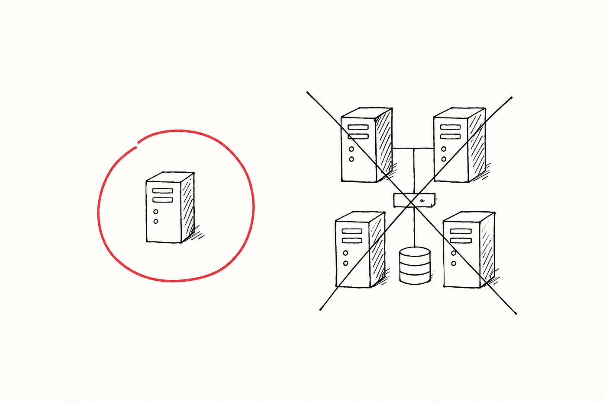
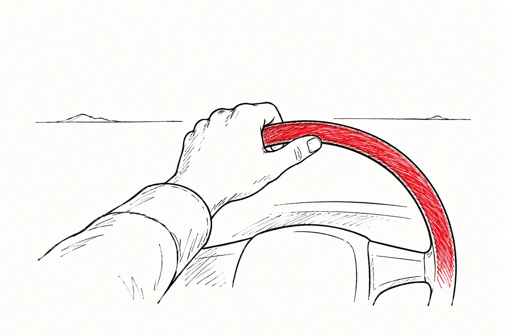

# 代码变便宜了，判断力没有。

关于 AI 与工程，主流的说法是它降低了门槛。如今一个初级工程师配上趁手的工具，就能做过去中级工程师才能做的事。一个中级工程师能做过去资深工程师才能做的事。金字塔被压扁，组织架构变得更扁平，顶端那些经验丰富的工程师变得不那么不可或缺了——因为他们过去提供的杠杆，现在已经被烤进了工具里。

我不认为正在发生的是这件事。我认为发生的恰恰相反，而那些押注于第一种解读的组织，会切身感受到这一点。

在一支认真使用 AI 的工程团队里，瓶颈不再是写代码。实现的成本被压缩的速度，比大多数团队适应它的速度还快。变得稀缺的，是那种决定"实现什么、各部分该如何拼合、以及该拒绝什么"的东西。那部分工作一直都在。过去它与实现并行进行，往往由同一批人来做，往往没人把它当成一项独立的活动来察觉。如今实现已被部分自动化，判断这一层便独自显露出来——而它原来才是这份工作的大部分。

## 真正改变的是什么

过去二十年里的大部分时间，一支小型工程团队能交付多少东西，实际的上限在于团队成员能写、能测、能维护多少代码。那道天花板已经移动了。一个能高效驾驭 AI 工具的工程师，如今能产出过去需要一个小团队才能完成的可用实现。工作仍然得被界定、被评审、被集成，但写代码这一动作不再是限速环节。

大多数工程组织都注意到了这一点，而大多数都得出了同一个结论。如果代码更便宜了，那么写代码就不需要那么多人。团队从顶端开始变薄，因为那里的人最贵，而它们的假设是：AI 加上一小群经验较浅的工程师，就能补上缺口。我最近写过一篇文章，谈到这如何改变了[一支小团队实际能够企及的范围](https://medium.com/@mattwhetton/the-two-person-team-is-the-new-ten-person-team-a579e353b802)，而这里的论证底下，垫着的是同一种压缩。

那种解读忽略了"代码变便宜"实际暴露出来的东西。当实现还很昂贵时，"决定造什么、决定放着不动什么、决定拒绝什么"的工作，是藏在"造东西"这项工作内部的。它之所以被做了，是因为资深工程师本就在场，在写东西的过程中作出那些决断。如今写代码这件事已被工具部分吸收，但作决定这件事哪儿也没去。它仍然在那里。只是它不再伪装成编码工作了。

## 判断力究竟是什么

这里说的判断力，不是"经验"的一个含糊替身。它是一组具体的东西，而且每天都会冒出来。

它是在团队如今很可能会揽下超出自己应揽范围的活儿时，选择正确的问题去做。它是在那些单看都没问题、合起来却不连贯的决定之间，作出连贯一致的取舍。它是在每一份新贡献都想把系统稍微拗离正轨时，把系统的概念形态稳稳地把住。它是读出一个"在顺利路径上能跑通"的设计在运维上的后果。它是对那些已经变得添加成本低廉、因而诱人添加的复杂性说不。

这些都不是什么新的职责。新的是：它们不再被吸收进实现工作内部。它们必须被刻意地完成，由一个把它们识别为"工作本身"的人来完成。

## 这在实践中是什么样子

*那个答案说得通。它在具体情境里也是错的。*

最近，我管理的一支团队遇到一个决策，是关于如何为一项新的支付授权服务设计架构。这项服务需要快速响应，并且需要在某样东西被授权一段时间时进行原子化的解析。我们在 AI 参与的情况下把它一步步推演下来。那些建议都是合理的。合理的结构，合理的边界，合理的取舍。然后它选用了 Redis 作为缓存与协调层。

这是个好答案。在教科书里它或许是正确答案。问题在于，它擅长解决的那个答案，并不是我们实际遇到的那个问题。我们目前并不运行 Redis 集群。我们目前并没有为它付费。我们的基础设施成本非常低，我们也没有扩张这块占用的压力。我们需要的是某个能快速跑起来的东西，而我们已经有一个在运行的数据库，对我们所需的那个操作来说，它几乎肯定足够快。

我们把设计拉回去，改用现有的数据库。不是因为 Redis 在原则上是错的。而是因为，要作的决断不是"Redis 能不能行得通"；要作的决断是"我们是否应该提前优化，去用上一套我们尚不需要的基础设施——用在一项实际负载我们尚不清楚的服务上，而现有的工具很可能已经够用了"。那一番权衡并不在 AI 的建议里。它也不会在。AI 推理的是它面前的那个问题。我们推理的是它面前的那个问题，再加上围绕它的那家公司。

还有一种更简单的失败模式值得简短点名一下，因为它往往主导了讨论，而且它是更容易抓住的那一种。AI 有时会犯局部性的错误。在我自己的一个业余项目里，要处理同一份数据的不同视图，AI 造了两个分开的页面，而正确做法本该是一个参数化的页面。代价在后来才显现——每次我要求作一处改动，结果它被应用到了一个地方、另一个地方却没改。那种错误是真实的，但它属于看得见的那一类。你会注意到它，你修掉它，然后继续往前走。随着时间推移，更好的工具大概会降低它出现的频率。

Redis 那个决断属于更难的一类。那个答案说得通。那个答案本会被交付出去。那个答案在评审里本会看起来没问题。它在具体情境里是错的，而房间里唯一知道它在情境里错了的，是一个见过足够多这类决断走向另一个方向的人。

## 资深工程师如今究竟是干什么用的

塑造了当下大多数工程层级体系的那个模型，奖赏的是那些能亲自扛起最多实现负荷的人。最强的资深工程师，往往是那个能交付最多、能修掉最难的 bug、并在做这些事的同时把系统的最大部分装在脑子里的人。那个版本的"资深"，正在被商品化，而其速度比大多数组织愿意承认的都快。

正在变得更有价值的，是另一个版本。它是这样一种工程师：能够指挥一组由 AI 辅助产生的贡献，并让它们保持连贯。是那个能够在比过去更多的变更中把架构稳稳把住的人——在同样的时间窗口里，能消化掉过去无法消化的变更量。是那个能够在模糊性中进行推理、点出那个还没人浮上台面的运维风险、并拒绝那个在情境里是错的、看似说得通的答案的人。工作已经发生位移：从"产出每一件制品"，变成"塑造那个产出制品的杠杆"。

这不是一个关于软技能的论证。它无关沟通，也无关干系人管理——这两者都很重要，但都不是重点。它关乎的是那种技术判断力：决定什么被造出来、什么不被造出来；而它被施加在一股工作流上——这股工作流过去慢到足以自我调节，如今快到无法自我调节。

## 要避免的错误

当下的本能反应，是把"实现变便宜"读作一个信号，意味着该削减团队里资深的那一端。逻辑很直接。如果配上 AI 的初级工程师能产出比过去更多的东西，那么指挥他们的昂贵的人就不需要那么多。

这是个错误的决断，而且我认为，正是这个决断会界定哪些工程组织在未来几年里挣扎得最厉害。不是那些采纳 AI 太慢的组织。而是那些采纳了 AI、眼看着实现成本下降、然后就断定判断力这一层也跟着一起下降了的组织。它没有下降。它变得更重要了，更暴露了，也作为一项独立的活动而更可见了。把那些原本在做这件事的人移走，理由是工具现在替他们做了——这是我最会主动押注其反面的一招。

从 AI 那里获益最多的团队，会是那些留住经验丰富的工程师、并改变这些工程师所做之事的团队。更少的亲自产出。更多的指挥。更多对"看似说得通"的拒绝。更多在系统被以比过去更快的速度改动时，把它稳稳把住。

## 我的结论

如今代码很便宜，便宜到了五年前没有的程度。这是真实的，它改变了工程工作的形态。但它改变形态的方向，并不是大多数人正在为之定价的那个方向。

门槛并没有被降低。被压缩的是"写"这件事，而在它底下被暴露出来的，是那部分一直以来最重要、也最难被看见的工作。那部分工作更资深，而不是更不资深。认识到这一点并据此调整结构的团队会做得很好。没有认识到的团队，会在接下来的几年里缓慢而昂贵地发现：他们移走的那部分工作，正是把一切撑在一起的那部分。

*更少的亲自产出。更多的指挥。*
