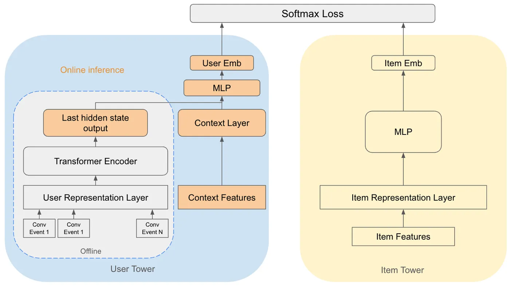
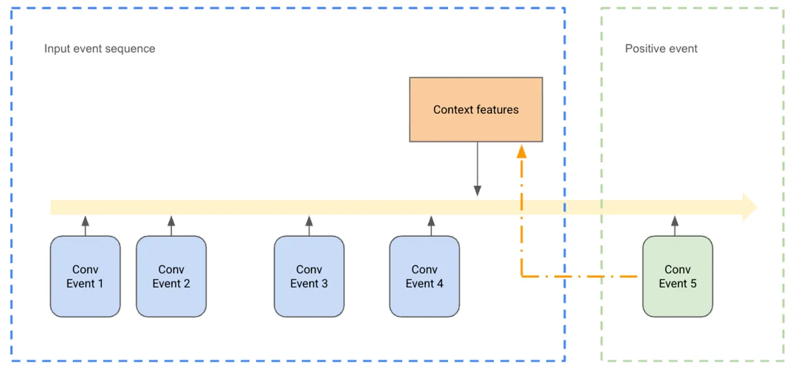
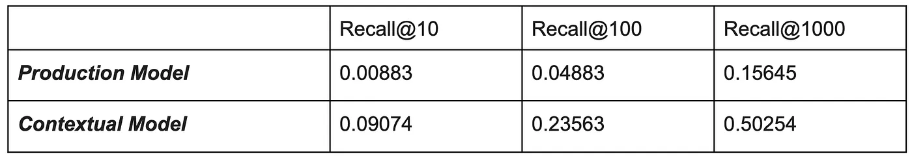

# 提升广告相关性：把实时上下文融入序列推荐模型

Huiqin Xin | Machine Learning Engineer II, Ads Vertical Modeling；Lakshmi Manoharan | Senior Machine Learning Engineer, Ads Vertical Modeling；Karthik Jayasurya | Staff Machine Learning Engineer, Ads Signals；Ziwei Guo | Senior Machine Learning Engineer, Ads Vertical Modeling；Alina Liviniuk | Machine Learning Engineer II, Ads Vertical Modeling

## 动机：为什么需要实时上下文

在此前的一篇文章 **Ads Candidate Generation using Behavioral Sequence Modeling**（[原文](https://medium.com/pinterest-engineering/ads-candidate-generation-using-behavioral-sequence-modeling-f9077ee1325d)）中，我们介绍过一个候选生成器（CG）。它用一个基于 Transformer 的双塔模型，借助用户的*站外*转化历史——这是一个很强的信号——来预测用户未来会与哪些广告主、哪些具体商品发生交互。这是一次重要的进步：它不再依赖静态的兴趣类目，而是开始对用户不断演化的购物旅程建模。

但这个初版序列模型有一个关键短板：缺少线上上下文信息。用户 embedding 是离线推断出来的，完全基于历史站外行为。这意味着在广告真正展示的那一刻，模型并不知道用户此刻正在 Pinterest 上浏览什么。对于 *Related Pins*、*Search* 这类高度依赖上下文的场景来说，这是个致命缺陷——用户当前查看的 Pin 或搜索词，本身就是一个强烈而即时的意图信号。举个例子，在 Related Pins 场景里，如果用户正在看一个"复古皮质扶手椅"的 Pin，那么推荐的广告就应该高度贴合这件具体商品，而不只是迎合用户宽泛的、长期的兴趣。

缺少上下文严重限制了模型在这些场景上的效果：在此前的生产系统里，Related Pins 上不到 1% 的曝光来自这个 CG，说明它产出的候选很难熬过下游的排序和竞价环节。

## 上下文序列建模方案

为了攻克这个难题，我们开发了 **Contextual Sequential Two Tower Model**（上下文序列双塔模型）。它是序列推荐模型的一次演进，专门用来引入实时的线上上下文。这个方案聚焦三大方向：全新的模型架构、新颖的训练方法，以及一套混合式的服务流程。

## 模型架构：引入上下文层

架构上最核心的改动，是把一个 **context 层**直接集成进双塔模型的 query 塔里。

*图 1. 上下文序列双塔模型架构*

如上图所示，模型现在会把原 Transformer 编码器的输出（代表历史序列信息）与新 context 层的输出拼接在一起。这个合并后的表示再被送入最终的多层感知机（MLP），从而得到最终的用户 embedding。

对于 Related Pins 场景，context 层的输入特征来自*主题 Pin*（用户当前正在查看的那个 Pin），具体用到的特征包括：把主题 Pin 排名靠前的*兴趣类目*的 embedding 表示聚合起来，并按它们的置信度分数加权。

为了让模型进一步个性化，我们还在用户表示层里加入了用户人口统计特征的 embedding，比如年龄、国家和性别。

## 用合成上下文训练模型

由于实时上下文只在服务时才能拿到，我们必须让模型在离线训练阶段就有能力从这个信号中学习。解决办法是使用**合成增强数据**。

*图 2. 用合成增强数据训练模型*

在模型训练过程中，我们人为地把一份从*正样本标签*（即转化事件）派生出来的伪上下文信息，注入到输入序列里。例如，通过投影正样本物品的*兴趣类目*特征，我们鼓励模型去检索那些在语义上与该用户会话所关联的*上下文*相关的物品。训练时，context 层会使用很高的 dropout 率，以确保模型仍然依赖用户的历史事件序列（也就是 Transformer 的输出）。

我们之所以选择用合成增强数据、而不是真实上下文数据，主要出于两个难题：

1.  把站内数据与站外数据合并起来在技术上有相当大的困难。
2.  我们无法保证用户在两个相邻的站外事件之间，曾在 Related Pins 上看过广告曝光。

## 混合式用户 embedding 推断

由于上下文特征（例如主题 Pin 特征）只有在广告请求时刻（线上）才能知道，我们采用了一种**混合式模型推断**方案。

1.  **离线推断：** 用户塔的大部分（也就是 Transformer 编码器）在离线完成推断，并把 Transformer 的最后一个隐藏状态（事件序列的编码表示）存入特征存储。对于有新增站外活动的用户，这部分会每天刷新一次。
2.  **在线推断：** 用户塔剩下的部分——context 层和最终的 MLP head——则在服务时刻线上计算，输入是实时上下文特征和预先算好的离线用户信号。

这套架构和服务流程，让用户 embedding 能够被实时上下文动态影响，从而保证推荐结果既个性化（来自序列），又与上下文相关。

## 结果与业务影响

### 离线评估

为了评估引入上下文特征对模型召回广告候选"存活率"的影响，我们做了一次离线评估。我们用 Related Pins 上真实流量广告数据的日志特征，生成模型输出 embedding，并计算 Recall@K——这个指标衡量的是在 top-K 检索结果中找到的正样本物品所占的比例。这里，把那些熬过排序漏斗、最终送达用户的候选视为正样本物品。这个新模型表现出显著提升，与生产模型相比，Recall@K 提升了 3 到 10 倍。

*表 1. 生产模型与上下文模型的 Recall@K*

## 存活率与相关性

我们成功提升了这个 CG 在 Related Pins 场景上候选的存活率。候选的相关性中位数提升了 **~275–300%**。在 Related Pins 整个场景上，广告相关性指标提升了 **1.08%**。此外，我们还观察到候选送达量大幅上升——被检索出来的广告候选中，最终送达曝光的数量增加了 **2 倍**。

## 顶层业务指标

候选相关性的改善，转化成了与转化相关的业务指标 ROAS（Return on Ad Spend，广告支出回报率）上约 0.7% 的可衡量增益。尤其是对那些贡献了大部分总收入的头部国家，模型带来的收益更大，ROAS 提升约 1.4%。

## 未来工作

我们计划探索以下几项关键改进：

1.  **上下文场景扩展：** 下一个关键步骤，是把这个上下文增强的候选生成器扩展到其他高价值的上下文场景，尤其是 Search。对 Search 来说这一点格外关键，因为在展示的广告候选与用户搜索词之间保持高相关性是重中之重。
2.  **更高级的融合技术：** 不再停留在简单地把 context 层与序列编码器输出做拼接。我们提议采用**基于 cross-attention 的融合**：让 context 层 embedding 作为 query，让 Transformer 输出的编码序列作为 key/value。这种做法能让最终的用户塔 embedding 根据实时上下文，动态捕捉每个历史事件的重要性。

## 致谢

我们要感谢 Supeng Ge、Yang Liu、Richard Huang、Yu Liu、Zhuqing Zhang、Kevin Liao、Yu Gu、Wanyu Zhang 的尽心帮助；感谢 Alice Wu、Leo Lu、Siping Ji、Ling Leng 出色的支持与领导；感谢 Joachim Groeger 富有价值的讨论与支持。
