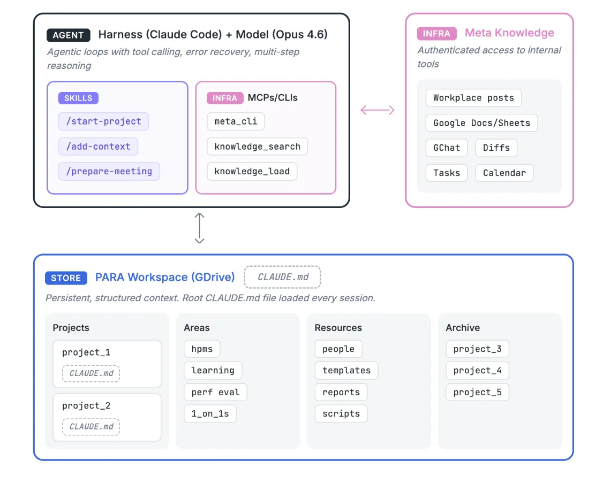
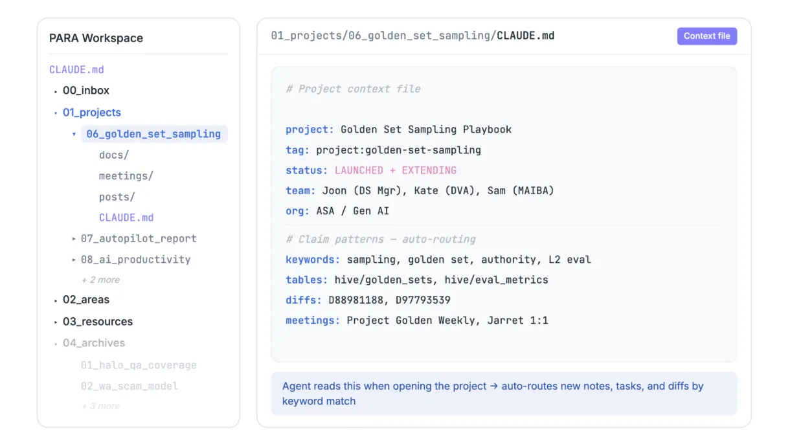
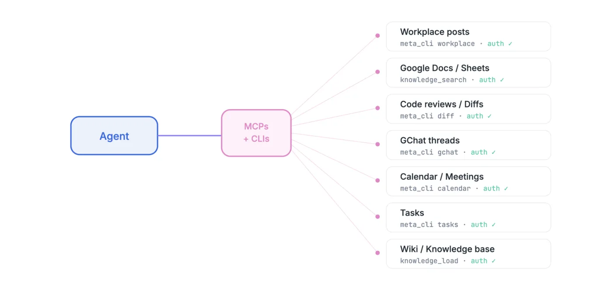
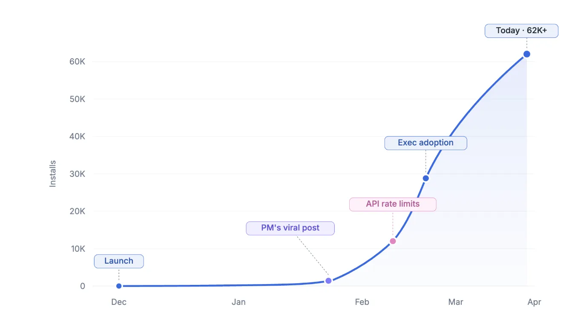

# 我们如何为 6 万名知识工作者打造 AI 第二大脑

*作者：Analytics at Meta*

Meta 的知识工作者每天都在跟工作流的碎片化作斗争：会议记录、任务、关键决策、代码上下文这些重要信息，散落在彼此割裂的平台上。每开启一段新的 AI 对话，都得从零冷启动——重复同样的解释、贴同样的链接、花同样的十分钟铺垫上下文，真正的工作才能开始。

于是我们验证了一个简单的假设：如果一个 AI agent 能持续、结构化地访问一个人手头的所有工作，并把这份上下文带进每一次交互，会怎样？它不是一个回答问题的聊天机器人，而是一个真正干活的伙伴——能跟进项目、读会议记录、发现各种关联，并在此前对话的基础上继续推进。

这个 AI 第二大脑实验诞生于分析团队，如今已被 Meta 内部 6 万多人采用：工程师、产品经理、设计师，以及法务、财务、传播、销售等岗位。这篇文章讲的是它如何被打造出来、如何成长、以及我们从中学到了什么。

## 它是如何运作的

AI 第二大脑由四个主要部分组成。

## PARA 工作区：一种 agent 能看懂的文件夹结构

这个想法起源于一套已有的效率框架。[Tiago Forte 的 PARA 方法](https://fortelabs.com/blog/para/) 把所有个人信息归入四类：**Projects**（项目，短期、进行中的工作）、**Areas**（领域，长期承担的职责）、**Resources**（资源，未来可能有用的参考材料）、**Archives**（归档，前三类中已不活跃的项目，留作日后查阅）。它本是为人的笔记整理而设计的，但事实证明它对 AI agent 同样好用。它不只告诉 agent *有哪些*信息存在，还告诉它什么是活跃的、什么是重要的、新信息该往哪里放。

PARA 工作区给 agent 提供了一份持久的、关于一个人工作全貌的地图。当用户开启一个新会话时，agent 已经知道他们的活跃项目、团队结构、工作惯例和近期动态。当一份会议记录传进来，agent 会读取内容，把它和已知的项目关键词做匹配，然后归入正确的文件夹——不需要谁来告诉它该放哪。

这种结构还解决了一个实际问题：上下文窗口是有限的。把每个项目的每份文档都加载进每个会话，既浪费 token，又拉低输出质量。取而代之的做法是：agent 每次会话先从一份精简的根上下文 CLAUDE.md 开始（一份概述你是谁、你在做什么的摘要），只在对话需要时才深入到具体的项目文件夹，并且只在打开那些文件夹时才把对应项目的 CLAUDE.md 加载进上下文。这个理念叫渐进式披露（progressive disclosure），它后来成了最重要的设计决策之一。前期上下文精简，需要时再深入细节。

像 Claude Code 这样的多数编码 agent，都建议把工作切分成一个个项目，每个项目配一份自己的 CLAUDE.md。这套模式在"项目"能干净地对应到一个你用 cd 进入的代码仓库时是行得通的；但知识工作要混乱得多。会议记录、文档、决策、任务往往同时横跨多个项目，项目来来去去，而且大多数根本不是代码仓库。PARA 中按项目划分的 CLAUDE.md 文件与上述默认模式正好对齐，但它们之上的一切都是新的：一份根 CLAUDE.md，承载你的身份和跨越每个会话的活跃项目组合，再加上一个生命周期层（Projects、Areas、Resources、Archives），告诉 agent 此刻哪些项目要紧、新信息该去哪。正是这个根层级让跨项目的 skill 成为可能——比如读会议记录并把它们路由到正确的项目，或者生成从每个人工作中汇总数据的团队报告。

## 基础设施层：通往内部工具的桥梁

知识工作者需要的信息，大多不在本地文件里，而在他们使用的工具中：文档编辑器、消息平台、任务跟踪器、代码评审系统、wiki。让这个项目成为可能的关键投入，是 Meta 开发的一批 MCP（Model Context Protocol 服务器）和 CLI（命令行接口），它们让 AI agent 能以经过认证、有作用域限定的方式访问这些系统。

没有这一层，agent 只能读取本地文件。有了它，agent 就能拉取会议转录、查看任务状态、读取讨论串、撰写文档——而且全程都在用户自己的权限范围内。

## Agent：执行引擎

一个 AI agent 不只是一个模型。它是一个模型加上一个 *harness*：把问答系统变成工作引擎的执行环境、工具和编排逻辑。没有 harness，模型只能回应 prompt。有了它，模型就能运行 bash 命令、读写文件、调用 API、从错误中恢复，并在一个循环里把一连串决策串起来，直到任务完成。

一个有能力的 harness 提供了持续性知识工作所需要的：agentic 循环（推理、行动、观察、重复）、文件系统访问、工具调用、MCP 集成和错误恢复。它不只是回答关于你项目的问题，而是替你浏览文件夹、运行搜索、调用 CLI、写文件。*（撰写本文时，我们的部署运行在 Claude Code 加 Anthropic 最新模型上；这套架构与 harness 无关，可替换。）*

## Skills：以 Markdown 形式存在的工作流

Skills 是可复用的指令，用纯 Markdown 文件加上一些脚本编码而成：没有编译代码、没有服务器、没有部署流水线。每个 skill 一步一步地告诉 agent 如何完成一个特定的工作流。因为它们就是文本，任何人（甚至 agent 自己）都能编写、修改和分享它们。事实证明，这是采用率和社区贡献两方面最强的驱动力之一。举几个例子：

-   /para-init 从零引导一个新的工作区。agent 扫描用户最近的帖子、文档、任务、wiki 和代码评审，推断出他们正在做哪些项目。它提出一套文件夹结构，为发现的每个项目生成上下文文件，并用相关资源把它们填充起来。一个用户在一次会话里就能从一无所有走到一个结构完整的工作区，完全不需要手动整理文件。
-   /start-project 从一段头脑倾倒（brain dump）创建一个新项目。用户用自由文本描述他们正在做什么：目标、相关方、悬而未决的问题、相关链接。agent 随后在内部工具中并行地做深度调研，寻找相关的文档、讨论和此前的工作。它把找到的东西呈现出来，提出一套项目结构，并在用户确认后创建好一切（文件夹、上下文文件、简报、初始任务）。
-   /read-meeting-notes 增量地处理 AI 生成的会议转录。agent 扫描配置好的来源（文档文件夹、本地文件），识别出它尚未处理的记录，提取行动项和决策，并用一套加权打分系统——基于关键词匹配、相关方重合度和明确的项目提及——把每份记录路由到最相关的项目。每天跑一次，就能让项目待办列表保持最新，无需手动操心。
-   /debrief:team 生成一个管理者视角的视图，展示整个团队在某段时间内完成了什么。agent 先解析出组织树，然后为每个团队成员并行启动各自的工作摘要，每份摘要都从代码评审、任务、帖子和文档中取材。它把这些结果自下而上地综合成一份组合式（portfolio-style）报告，按项目而非按人来组织，并输出一个可分享的 HTML 页面。对于一个 10 人的团队，这只需几分钟跑完，取代了原本要耗费数小时的状态收集。

这些只是第二大脑预装的部分 skill。社区此后又创建了数千个，放在一个内部库里供任何员工安装。用户也常常为自己岗位或团队特有的重复性工作流编写专属 skill，往往一个小时内就能搞定。

## 滚雪球：三个月从 0 到 6.3 万

采用率一直是慢热的，直到二月初，一位非技术岗的产品经理发布了一篇帖子，标题是"我终于建好了我的第二大脑。这是你也该建一个的理由。"他把一份面向非工程师的安装指南，和一组它能解锁什么的具体例子配在一起：从实时会议转录起草文档、几分钟内综合出领导层摘要、跨数周跟踪项目。短短几天内，这套系统就传遍了 Meta 的每一个职能部门。

不久之后，增长超过了基础设施的承载力：插件接入的共享云存储集成触发了 API 限流，拖慢了 Meta 更大范围的 AI 开发环境，需要把容量扩大到原来的 10 倍。这次事故是采用真实、自发并且加速度远超我们规划的最干净信号。

如今这个插件在 Meta 各个组织支柱上有 6.3 万多次安装，日活跃用户大约 1 万。社区已经构建了 9 个学科专属的工具包（面向产品经理、数据科学家、工程师、设计师等），一套团队级共享上下文系统，以及面向自动化会议处理、职业发展跟踪和可视化报告的集成。

## 我们学到了什么

**基础设施先行。** agent 的有用程度，取决于它能触及的系统。对内部工具（文档编辑器、消息平台、任务跟踪器、代码评审）经过认证的访问，是把一个有用的 agent 和一个聊天机器人区分开的关键。构建 AI agent 工作流的组织，应该在做其他任何事之前先投资这个基础设施层（强烈推荐 [这篇文章](https://www.reddit.com/r/LocalLLaMA/comments/1rrisqn/i_was_backend_lead_at_manus_after_building_agents/)，讲的是如何构建好用的 CLI）。应用层会随之而来，而且往往来自意想不到的方向。

**渐进式披露胜过上下文倾倒。** 一次性把所有东西喂给 agent 会拉低输出质量。PARA 结构天然支持分层加载：先加载根上下文，项目细节按需加载。Skills 遵循同样的模式：agent 只看到一段简短的描述，直到它选择去调用某个 skill。前期上下文精简，需要时再深入。[有一些证据](https://arxiv.org/abs/2602.11988) 表明，过多的上下文文件可能对 agent 的表现有害，所以也要谨慎对待你每次会话喂给 agent 的东西、以及你怎么写它们（[这里](https://www.humanlayer.dev/blog/writing-a-good-claude-md) 有一份关于如何写好 CLAUDE.md 文件的实用指南）。

**低摩擦的上手体验驱动了病毒式采用。** 那条引导命令 /para-init——它扫描近期动态并构建出一个初始工作区——移除了采用的最大障碍。用户在第一次会话里就看到了真实价值，不用花几个小时手动整理文件。当入门成本足够低时，人们当天就会把它分享给团队。

**你的用户就是你最好的建设者。** 初次发布之后的每一个重大功能（笔记本电脑支持、Google Drive 优化、自动化会议记录处理、可视化报告、共享团队上下文）都是社区成员构建的，不是原作者。十几位贡献者提交了代码。还有数百人写了指南、回答了问题、创建了自定义 skill。从草根成长到 6 万多次安装，没有任何自上而下的指令。

**可组合性创造的价值比功能更多。** 因为 skill 是公开的 Markdown 文件，工作区也只是一个文件系统，任何人都能为自己的需求扩展这套系统。各个团队为冲刺签到、绩效评审跟踪、客户健康度看板和数据分析工作流构建了 skill。这个插件不再只是一个工具，而成了一个平台，每一次扩展都让整个系统对所有人更有用。

## 接下来是什么

这个项目已经超越了个人效率的范畴。一套团队级共享上下文系统——内部称为"第三大脑"——让团队成员各自的工作区汇入一个共享的知识层，目前正在数十个团队、数百名参与者中试点。主动型 agent 按计划运行，而不是等着 prompt：早间简报、自动化会议记录处理、日终摘要。而底层架构正在与 Meta 更广泛的 AI 平台融合，把结构化上下文和持久记忆带给更多工具和更多用户。

最初只是一位数据科学家为解决散乱笔记而做的小修补，如今变成了一场全公司范围的实验——探索人类与 AI agent 如何在持续、复杂的知识工作中协同。
