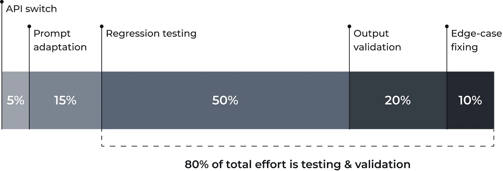
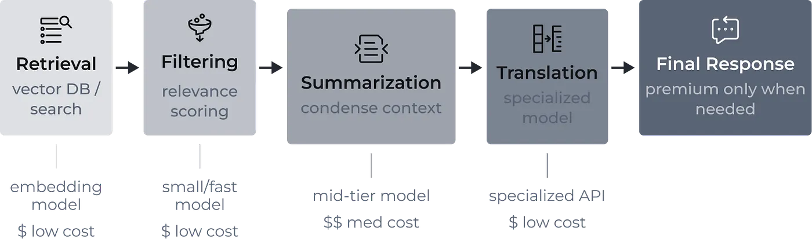

# LLM 弃用与迁移策略：如何应对不断上涨的 AI 价格

## 应对 LLM 退役、把工程开销降到最低的实用框架

模型退役是 AI 市场的一种结构性现实，不是罕见的运维事件。OpenAI（GPT）、Anthropic（Claude）、Google（Gemini）以及其他 LLM 供应商，会频繁弃用某些特定的 API 版本，转而推出更新的模型。

最大的错误，是把这些模型当成永久可用的大宗商品。在一个生产就绪的系统里，prompt 逻辑和输出稳定性往往是针对某个特定模型的独有行为精调出来的。

因此，当供应商决定让某个模型退役时，就会逼着你做一次计划外的迁移——哪怕你的系统运行得毫无瑕疵、还在持续创造收入。失去一个基础模型，会触发一轮针对新模型的强制回归测试与重新校准。要构建可靠的系统，就必须有一套明确的策略，因为这种强制迁移带来的冲击是多维度的：

-   **财务层面** —— 价格的直接上涨会随规模复利累积。哪怕只是微小的百分比变动，对高流量系统也会产生实质性影响。
-   **运维层面** —— 迁移会占用本可以用于推动产品增长的工程产能。
-   **技术层面** —— 输出的非确定性让回归验证变得复杂，对生成密集型系统尤其如此。
-   **战略层面** —— 过度依赖单一大模型会加剧供应商锁定，削弱你的议价筹码。

在本文中，我们会结合个人经验，过一遍那些行之有效的实践——它们能帮你在供应商的退役周期里活下来，同时保持系统稳定。

## 为什么 LLM 弃用对工程师来说是个「热点」话题

从技术视角看，这种挫败感很简单：系统一直好好的，直到被迫改变为止。

在传统的 AI 方案里，当你训练好一个模型并把它部署到生产环境，事情并没有就此结束。你会持续监控它、跟踪质量指标，只有在用户行为发生变化或性能退化时才会重新训练。没有理由去替换一个稳定、还在创造收入的模型。

当你训练自己的模型时，性能退化往往是数据漂移导致的。比如，一个定制的计算机视觉模型可能因为摄像头角度或分辨率被调整而失效。模型不是无缘无故随时间退化的；真正变的是现实世界里的数据分布。重新训练的过程由你掌控。但换成 API 供应商，这套动态机制就完全不同了。

当你依赖基于 API 的 LLM 供应商时，决定权就不在你手里了。即便某个模型完全满足你的需求，供应商也可能出于内部原因把它弃用——成本、基础设施负载、战略定位。他们移除这个模型，不是因为它对你退化了，而是因为它在商业上对他们不再划算。

你可以拥有一个健康的生产环境，一切表现都可预测，却仍然被迫迁移。这就是为什么这个话题会在工程团队内部制造紧张：问题来自系统之外。

这些外部压力，会表现为三类主要的业务与技术风险，每个团队都必须把它们考虑进来。

## 模型弃用引发的业务与技术问题

### 1. 成本直接上涨

哪怕只是 5%–10% 的涨价，在规模化之下也会变得举足轻重。一个每天处理 10,000–20,000 次请求的聊天机器人，会把每一点边际变化都放大。当差距达到 50% 甚至更多时，它会重塑整个产品的成本模型。

供应商有时会推荐一个「最接近的替代品」，但那个模型可能处在更高的定价档位。市场已经从拼价格和速度，转向了拼质量——成本也明显更高。

市场动态也发生了转变。早期的竞争强调速度和激进定价。如今，供应商主要在质量提升上竞争——往往会以明显更高的价格点推出更新的模型。在某些代际更替中，价格差异可能接近 2 倍。例如，像 Gemini 这样的模型，每一次代际跃迁都可能让价格几乎翻倍。供应商依赖带来的残酷现实很简单：你要么接受它，要么换供应商。不过，换供应商并不是保护利润率的唯一办法。你也可以实施[一套省成本的架构](https://towardsdatascience.com/frugalgpt-and-reducing-llm-operating-costs-ff1a6428bf96/)，在不牺牲质量的前提下把开销降到最低。

### 2. 迁移成本与投入

换一个 endpoint 是小事——你只要改一下 URL。但适配行为不是。

迁移中的大部分时间，并不花在切换 API 上，而是花在：

-   prompt 适配
-   回归测试
-   输出的结构性验证
-   修复边界情况

在大型系统里，输出结构的细微变化一开始可能不会被察觉。系统在技术上还能工作，但格式差异或微小的行为偏移可能会破坏下游逻辑。

从个人经验看，大约 80% 的迁移投入都花在测试，以及基于质量检查去打磨 prompt 上。而且和传统软件系统不同，LLM 是非确定性的。你不能依赖二元的输入-输出比对。两个有效答案在措辞上可能不同，但都可以接受，这让自动化变得复杂。

*图 1。迁移投入构成。作者绘图*

### 3. 业务风险

即便有供应商的指引，新模型的行为也总会有所不同。迁移引入了不确定性：

-   响应结构可能发生变化
-   语气或推理模式可能改变
-   边界情况的处理方式可能不同

这些风险或许是当前市场固有的，但它们不一定要演变成一场灾难。接下来的三大支柱，构成了一套「迁移就绪」策略的基础。

## 测试与迁移策略

结构化的方法能降低风险，但无法消除风险。

## 1. 维护一个回归数据集

每个生产系统都应该有一组稳定的评估样例：

-   **对聊天机器人：** 问题-期望答案对
-   **对分类任务：** 带标签的样本
-   **对结构化输出：** 格式验证用例

每一次模型更新都应该针对这个数据集做验证。如果质量没有退化，迁移就会更安全。

分类任务相对容易验证，因为你只需比较预测出的标签（例如类别 1–5）。生成任务则要难得多，因为输出在设计上就是可变的。

由于标准的单元测试（例如 assert output == expected）在生成式文本上会失效，工程团队必须实施专门的评估流水线：

-   **LLM-as-a-Judge：** 用一个更大、能力更强的模型，按一套严格的标准来给新模型的输出打分。你可以问这个裁判模型：「候选 B 是否包含基线 A 中的所有事实信息，且没有添加幻觉内容？回答 Yes/No。」
-   **语义相似度打分：** 把旧模型的期望输出和新模型的实际输出都转成向量 embedding。如果 cosine 相似度分数很高，那么新一代的生成在语义上就是可接受的。
-   **确定性护栏：** 评估的是结构，而不是自由形式的文本。用基于代码的检查来确保模型输出合法的 JSON，或者包含必需的关键词。

## 2. 设计与模型无关的 prompt

一条实用的建议：避免把 prompt 过拟合到某个特定模型。当开发者倚重某个模型的特有怪癖时（比如 Claude 严重依赖 XML 标签，而 GPT 偏好 Markdown），就会出现这种情况。

举个例子：如果你正在用一个新的 Gemini 模型来构建，不要只测它。用一套 100 个测试用例，在 Gemini、GPT 和 Claude 模型上同时跑——用完全相同的回归测试，并调整你的 prompt，把模型之间的差异降到最低。生成一张所有模型的通过/失败汇总表。这样做能大幅提升系统的未来适应能力，缩短未来的迁移时间。

目标不是把差异完全抽象掉，而是确保各家供应商之间大致的行为稳定性。这能降低未来的切换成本。

## 3. 分解复杂任务

不要在一次大模型调用里解决所有问题，而是把任务拆成更小的步骤：

**检索 ➡ 过滤 ➡ 摘要 ➡ 翻译**

*图 2。任务分解流水线。作者绘图*

LLM API 是按 token 计费的，不是按调用次数。拆分任务不会显著改变总的 token 用量，但能让你在子任务上使用更简单、更便宜的模型。如果你拿一个繁重的任务——比如查找相关文章、过滤、摘要、翻译——把它拆成四个独立的 API 请求，你的总 token 数大体保持不变。然而，由于你可以把更简单的过滤和翻译步骤路由到小得多的模型上，你单位 token 的整体成本就会大幅下降。

**你能得到什么好处？** 更低的成本、更大的灵活性、某个模型被弃用时更容易替换，以及可以用上开源或自托管的高性价比替代方案，比如 Llama、Mistral 等等，此外还有：

-   自托管：在自己的基础设施上托管开放权重模型，你就获得了绝对的持久性。
-   专用硬件 API：另一种选择是使用像 Groq 这样的公司，它们构建定制的语言处理单元（LPU）——专门为加速语言模型推理而设计的硅芯片。这让你能通过 API 以极快的速度（每秒 400+ token）访问开源模型，成本只是旗舰级专有模型的一小部分。

如果你的架构依赖于一个昂贵的「超级模型」，那你基本上就被锁定了。如果任务被分解了，可替换的选项数量就会扩大。然而，一旦你的架构变得模块化，挑战就转移到了选择上：你怎么判断哪个模型才适合你那个特定的子任务？

## 评估替代方案、对比供应商

像 [Artificial Analysis](https://artificialanalysis.ai/) 这样的公开榜单，会对比模型的速度、推理能力和定价。这些基准在方向上是有用的：一个排名靠前的模型，通常会胜过一个排名靠后的。

你可以把它当作一个参考来源，帮你识别哪些模型和你当前在用的处在同一个性能档位。

然而，相邻模型之间的差异往往很微小，而且与任务相关。如果两个模型的基准分数很接近（例如 48 对 47），公开排名就没那么重要了。真实世界里的表现会完全取决于你具体的用例。基准测试用的是中性任务；你的工作负载可能表现得不一样。通常，[削减 AI 运营成本](https://quantumobile.com/blog/ai-cost-reduction-outlook-how-to-cut-operational-expenses-smartly/)最有效的策略，是选择与任务相称的模型——对领域特定的任务使用更小、经过微调的模型，而不是默认就用昂贵的旗舰 LLM。

**你的策略如下：**

1.  用排名来筛出一份候选短名单。
2.  在集成之前，永远要在你自己的回归数据集上测试模型。

与此同时，要主动追踪模型生命周期的公告。供应商通常会提前公布退役时间表。要有效利用这些信息，你应该把这些时间表整合进一个更宏观的策略里，用于观察市场趋势和内部质量指标。

## 自动化的市场监控与切换

很遗憾，没有什么灵丹妙药。你能系统性去做的是：

### 监控供应商的生命周期页面和弃用时间表。

要意识到，弃用通常分几个明确的阶段发生：首先，新用户被阻止访问旧的 endpoint；接着，现有用户会获得几个月的宽限期；最后，它被彻底关停。你会被提前告知，但你仍然必须迁移。

### 在生产环境中持续追踪质量指标。

建立全面的监控、可追溯性和可观测性。无论你的应用是实时运行还是异步批处理，你都必须记录一切、追踪中间输出（在分解后的工作流里尤其如此），并随时间收集质量指标。当质量下滑时，你就有一个基线可供调查。退化通常是因为用户行为改变或输入数据发生偏移——也就是数据漂移。通过严格记录生产指标，你就能判断质量下滑是因为你的用户改变了行为，还是因为你的 API 供应商在背后悄悄更新了模型。

### 维护可以针对多个模型运行的回归测试。

把你的 CI/CD 流水线构建成这样：让你的自动化回归测试持续把生产样本路由到你的后备模型上。这样能确保——随着你的 prompt 随时间自然演进——你的后备模型始终保持完全兼容，迁移仍然简单得像拨动一个配置开关。

### 定期对同一价格区间内可比的模型做基准测试。

设立一个季度例行流程，严格在你当前的单位 token 成本上限内评估新的开源或 API 模型。因为供应商常常会在弃用事件期间推送昂贵的旗舰升级，维护一份经过测试的替代品短名单，是你避免被迫增加预算的最佳策略。

迁移一旦拖延就会变得令人焦头烂额。当多个模型需要同时替换时，工作量会迅速翻倍。主动评估和错峰迁移能减轻压力和运维风险。拖延这些更新可能是毁灭性的。在真实世界中、同时运行多达 15 个模型的企业系统里，一次强制弃用事件,可以轻易吞掉 1 到 1.5 个人月的纯被动性、非功能性工程工作。

## 模型弃用是一种结构性现实，而非例外

没有哪一个技术小窍门能消除这种风险。真正管用的，是系统设计上的纪律：

1.  **假定替换不可避免。** 构建能容忍切换的架构。
2.  **持续监控质量指标。** 退化检测应该成为标准做法。
3.  **维护稳健的回归数据集。** 对生成式系统尤其如此。
4.  **分解复杂的工作流。** 更小的子任务会拓宽你的模型选择，并减轻成本压力。
5.  **主动对替代方案做基准测试。** 不要等到弃用公告才行动。

最有韧性的团队，把模型供应商当作模块化的基础设施层，而不是永久的依赖。在 AI 市场里，长期稳定并非来自今天选对了「最好」的模型。它来自于设计出这样的系统——当那个模型明天消失时，它依然保持稳定。
