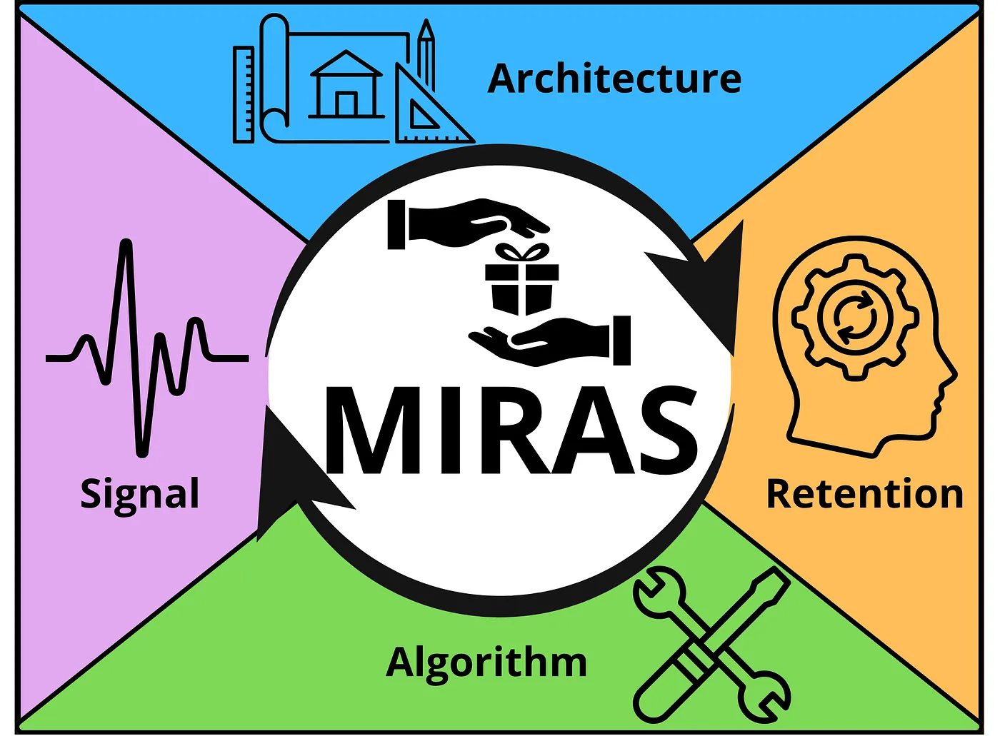
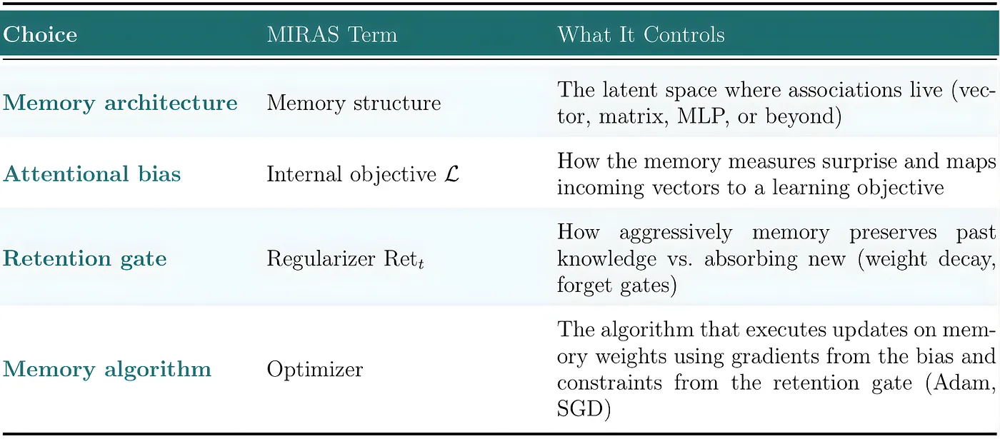
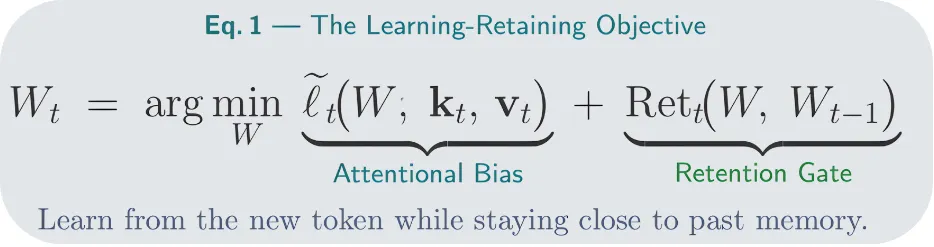
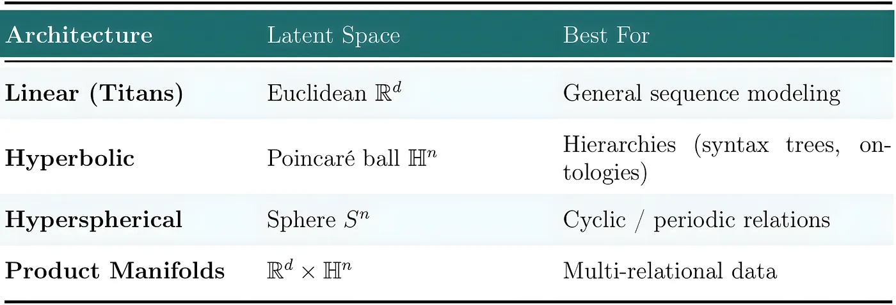
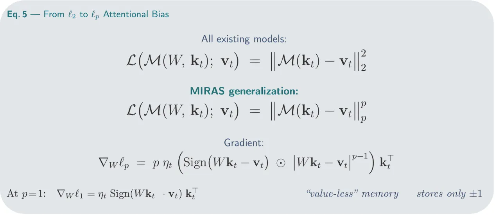
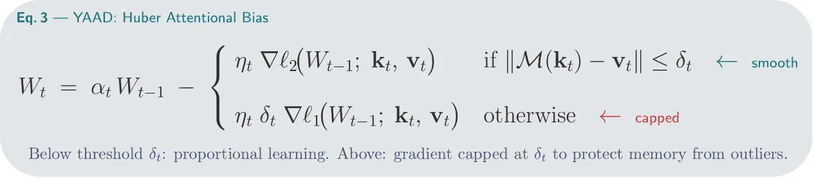
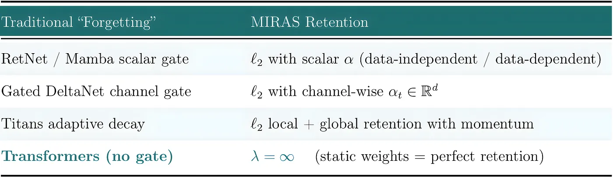
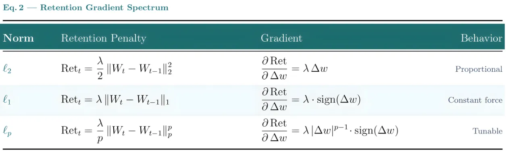
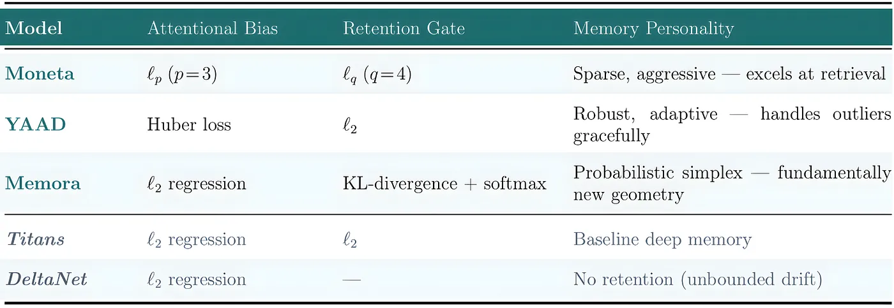

# MIRAS：Transformers、Mamba 与 Titans 背后的设计蓝图

## Google 的新框架揭示：每一个现代序列模型都在求解同一个四选项的优化问题

我们用来让语言模型记得更好的那些精巧机制——门控函数、权重衰减、自适应遗忘——结果都只是同一个底层原理的不同实例，这个原理就是***保留门（retention gate）***。


*构建序列模型的整张蓝图已经落地。MIRAS 把设计的可能性炸开了。图片由 GPT-5 生成。*

举例来说，Titans 里的遗忘机制可以被重新诠释——它不是一个负责擦除的门，而是一个保留门，决定要保留多少。

每一个现代序列模型都在管理记忆。区别在于怎么管理：

-   Transformers 维护一个 KV 缓存，它（在最好的情况下）随上下文长度线性扩展。
-   Mamba 把上下文压缩进一个固定大小的状态。
-   Titans 接入一个神经网络，让它在推理过程中更新自己的权重。

不同的架构。不同的机制。不同的哲学。但归根结底，它们都在试图解决同一个问题。

每一个带记忆的模型，都在学习如何在键和值之间做映射，由一个特定的内部目标引导，被一个控制更新如何发生的正则项约束，并在已有知识与有价值的新信息之间求平衡。

四个设计选择。每一个处理序列的深度学习模型都在做这些选择，无论它的设计者是否意识到这一点。

> 这就是 MIRAS 的核心主张，它重写了整个序列建模的版图。

> MIRAS——在波斯语、阿拉伯语和土耳其语中意为"遗产"——是一个***设计框架***，它把你听说过的每一种序列架构背后的四个选择都暴露了出来。

在我此前对 [***Titans***](https://medium.com/ai-advances/titans-how-google-taught-ai-to-surprise-forget-and-remember-b4bd497c0789?sk=09bc2f235e2167f0b97cab99cb22e585) 的深度剖析中*，*我探讨了 Google 如何用惊讶驱动的学习和自适应遗忘，把长期记忆接入 transformer。

我还对比了 [***Titans 的不同实现***](https://medium.com/ai-advances/googles-titans-4-ways-to-wire-long-term-memory-into-a-transformer-7e8294e4af17?sk=a68ee11d8962d881d5955b8a7e3c0c3a)，重点放在长期记忆模块上，因为从架构角度看，这才是那篇论文引入的真正新创新。

## **每一个序列模型都在求解同一个问题**

如果你看看过去几年里定义了序列建模的那些模型——[RetNet](https://arxiv.org/abs/2307.08621)、[Mamba](https://arxiv.org/abs/2312.00752)、[GLA](https://arxiv.org/abs/2312.06635)、[DeltaNet](https://arxiv.org/abs/2406.06484)、[Gated DeltaNet](https://arxiv.org/abs/2412.06464)、[RWKV-7](https://arxiv.org/abs/2503.14456)、[DeltaProduct](https://arxiv.org/abs/2502.10297)、[TTT](https://arxiv.org/abs/2601.16175)、[Titans](https://arxiv.org/abs/2501.00663)。它们中的任何一个都在定义一种新架构，并宣称自己在解决传统序列建模的老大难问题上有创新。

> 现在看看它们每一个实际优化的是什么。

那些模型全都用同一种注意力偏置（ℓ₂ 回归或点积相似度），用同一种保留门（ℓ₂ 正则化）。它们之间的差异是真实的，但很浅：标量门控对比逐通道门控、数据相关参数对比静态参数、向量记忆对比矩阵记忆。这些是重要的工程选择，不是根本性的架构创新。

> 整个领域一直在探索一个广阔设计空间里的某一个角落，而 MIRAS 就是那整张地图。

MIRAS 让序列建模当前设计空间之小变得可见。九年的线性循环神经网络（RNN）研究，一直在一栋大得多的建筑里的某一个房间里徘徊。这个房间很美。但还有更多房间值得去参观。

> 让我们一头扎进这张蓝图。

## **每一个序列模型背后的四个设计选择**

每一个序列模型都由四个设计选择定义。MIRAS 给它们命名、把它们形式化，并且——这是第一次——把它们当作可以混搭的独立维度来对待。


*MIRAS 把整个框架划分成 4 个相互关联的维度。具体的选择将取决于目标学习目标、模型容量和学习动态。图片由作者制作。*

第一个是**记忆架构**：各种关联所驻留的那个潜空间。一个向量、一个矩阵和一个 MLP——每一个都为存储键值映射定义了不同的容量。

第二个是**注意力偏置**：驱动每一次更新、产生学习信号的内部损失目标。这是记忆衡量"它预测了什么"与"实际到来了什么"之间差距的方式——也就是塑造每一个学习步骤的"惊讶"的定义。

第三个——也是这个框架的明星——是**保留门**：那个正则项，它控制记忆在保留过往知识与吸收新信息之间有多激进。你曾经遇到过的每一个遗忘门，都是一个伪装起来的保留门。

第四个是**记忆算法**：那个优化器，它用来自注意力偏置的梯度和来自保留门的约束，执行实际的权重更新。SGD、Adam 和动量法各自产生不同的学习动态。


*在 MIRAS 框架中定义每一个序列模型的四个设计选择。图片由作者制作。*

从数学上讲，这个框架中的每一个模型，在每个 token 上都求解同一个优化问题：


*学习-保留目标：在向新 token 学习（注意力偏置）的同时保持靠近过往记忆（保留门）。图片由作者制作。*

> 让我们独立地把每一个旋钮拆开来看。

### **记忆架构：知识所栖居的几何**

记忆架构就是那个潜空间本身：

-   一个向量记忆一次只存储一个关联——快且便宜，但受限。
-   一个矩阵记忆存储一整个键值映射，它是 RetNet、Mamba 和 GLA 背后的主力。
-   一个 MLP 记忆——Titans 和 TTT 所用的——把关联存储在一个小神经网络的权重里，以更昂贵的更新为代价换来了非线性的容量。

> 在这架梯子上每往上爬一级，都是在用算力换表达力。

但容量只是故事的一半。这个架构还约束着另外三个选择能做什么：一个基于 MLP 的记忆要求基于梯度的更新，而一个基于矩阵的记忆则容得下更简单的解法。这个选择会涟漪般传遍整个框架。

> 进一步推广——推广到非欧几里得的记忆几何，比如用于层级结构的双曲流形、用于方向性数据的球面流形——是一个自然的扩展，但这个方向更多是被[几何深度学习](https://arxiv.org/abs/2104.13478)的文献所覆盖，而不是被 MIRAS 本身所覆盖。


*记忆架构决定了模型能高效表示什么样的结构——而不只是它能存储多少。*

这个框架在这个维度上的贡献，是把记忆架构*命名*为一个独立的设计选择；至于用更丰富的几何去填充这个维度，则是未来的工作，而且大多属于另一个研究社区。

### **注意力偏置：模型如何定义"惊讶"**

注意力偏置是记忆为每一个新 token 所优化的目标函数，通常由一个损失函数刻画。它是记忆对***惊讶***的定义：它如何衡量"它预测了什么"与"实际到来了什么"之间的差距。

这个选择对学习动态有直接的后果。正如我们在 [titans-how-google-taught-ai-to-surprise-forget-and-remember](https://medium.com/ai-advances/titans-how-google-taught-ai-to-surprise-forget-and-remember-b4bd497c0789?sk=09bc2f235e2167f0b97cab99cb22e585) 中看到的，**记忆损失函数的梯度就是那个**​***惊讶信号***——一个小的损失意味着"我以前见过这个"，一个大的损失意味着"这是新的，注意了"。

误差的大小决定了记忆更新得有多激进。算得太激进，一个离群 token 就劫持了整个记忆状态。算得太柔和，模型就分辨不出真正的新奇与噪声。

几乎每一个现存的模型，对这个张力都用了同一个答案：ℓ₂ 回归，也就是记忆的预测与真实值之间的均方误差。成比例、平滑、性质良好。但它远不是唯一的选项——而 MIRAS 把整个损失函数的版图都打开了。

**ℓₚ-范数注意力偏置**把 ℓ₂ 推广到任意指数。在 p = 2 时，我们复原出每一个现存的模型。在 p = 1 时，有意思的事情发生了：记忆只存储误差的***符号***，把键映射进 -1 和 +1 这两个极端类别。

作者把这称为***无值关联记忆（valueless associative memory）***，并引出了一个引人入胜的与人类应对机制的类比——在极端事件下，大脑会存储***"某件事发生过"***，而不保留确切的数值。


*从 ℓ₂（每一个现存模型）到 ℓₚ 推广。在 p=1 时，记忆变得"无值"——只存储 ±1。图片由作者制作。*

我们可以用 **Huber 损失**来平滑这个惊讶信号，它给了记忆一种应对离群点的机制，并根据阈值 δₜ 产生不同的结果：

-   在阈值 δₜ 以下，它的行为像 ℓ₂——成比例、平滑。
-   在 δₜ 以上，它切换到 ℓ₁——梯度被封顶，对离群点鲁棒。

模型会***动态地***决定每个 token 属于哪个区间。


*YAAD 的更新规则：对常规 token 做平滑的 ℓ₂ 学习，对极端惊讶做封顶的 ℓ₁。阈值 δₜ 是学习得来的。图片由作者制作。*

> 这就是 **YAAD** 背后的架构，它是 MIRAS 三个全新模型之一。

YAAD 用 Huber 注意力偏置搭配 ℓ₂ 保留——这个系统平滑地吸收常规 token，但对极端惊讶给它的响应封顶。在实验中，YAAD 在长上下文任务上胜过纯 ℓ₂ 模型，恰恰是因为它拒绝让离群 token 劫持记忆。

### **保留门：这个框架真正的明星**

保留门是那个正则项，它约束着记忆在每一次更新时漂移多少。

每一次有新 token 到来，记忆都面对一个根本性的张力：吸收新信息，还是保留它已经知道的东西。

保留太少，一个惊讶的 token 就会覆盖掉一切——模型变得健忘，追着它最后看到的东西跑。

保留太多，模型就变得僵硬，即使证据压倒性，也无法适应真正全新的模式。

> 你遇到过的每一个"遗忘门"——在 LSTM、GRU、Mamba、RetNet 里——都是一个伪装起来的保留门。

那个看起来像是"主动决定擦除"的东西，在数学上是一个惩罚项，惩罚记忆被允许偏离其先前状态多远。

在 Titans 中，这表现为自适应权重衰减：模型根据来自注意力偏置的惊讶信号，动态地控制要保留多少旧记忆：

-   高惊讶放松保留约束，为新信息腾出空间。
-   低惊讶收紧它，让记忆保持稳定。

MIRAS 在整个序列模型的分类体系中，把这个映射明确化了：


*每一个"遗忘门"都被重新框定为保留正则化。图片由作者制作。*

仔细读最后那一行。一个 Transformer 不过就是一个带***无限保留***的关联记忆——它在测试时从不更新自己的权重，所以它从不需要在学习与遗忘之间求平衡。这是 MIRAS 之内的一个设计选择，而不是一个根本不同的范式。

这种重新框定不是表面文章。LSTM 的 sigmoid 遗忘门可以被重新诠释为一个 ℓ₂ 保留正则项——一个与新旧记忆状态之间平方距离成比例的惩罚项。

> sigmoid 近似了一个近端惩罚（proximal penalty）。模型不是在擦除——它是在*欠保留*。

**这个门控制的是记忆被允许改变多少，而不是要删除什么。** 这是一个关于机制的数学观察：真实的大脑确实有主动的遗忘过程。但在一个深度序列模型之内，每一个"遗忘门"计算的都是一个保留惩罚。

> 数学一直都是保留。我们只是把它叫成了遗忘。

一旦你把保留门看作一个独立的维度，你就可以开始拧动它了。把它想成一个针对惊讶的恒温器。当一个新 token 到来并产生一个大梯度时，保留门决定记忆响应得有多激进。

每一种范数都在记忆上产生一种根本不同的"更新力"：


*保留梯度的谱系：从成比例的阻尼（ℓ₂），到恒定的力（ℓ₁），再到可调的灵敏度（ℓₚ）。图片由作者制作。*

ℓ₂ 是那个"金发姑娘区间"——平滑的 Hebbian 学习，它让惊讶的事实更新记忆，又不破坏长期知识的稳定。ℓ₁ 不在乎大小：小的变化和大的变化得到同样的力，产生稀疏、激进的更新——非黑即白的"保留还是覆盖"的决策。而 MIRAS 的实验印证了这其中的利害。

把保留范数从 ℓ₂ 改成一个更高指数的 ℓ-范数（就像 Moneta 所做的那样），会直接影响模型相对于上下文长度的扩展行为。

另一方面，弹性网保留（elastic-net retention，ℓ₁ 与 ℓ₂ 的混合）提供了又一个选项：一个可调的旋钮，在稀疏选择（通过软阈值实现的硬遗忘）与平滑巩固之间调节。

```

optimizer = AdamW(memory_params, weight_decay=lambda_) 

bias_loss = F.mse_loss(W @ keys, values) 
ret_loss = (lambda_ / 2) * torch.norm(delta_W, p=2) ** 2 
total = bias_loss + ret_loss
```

### **记忆算法：藏在明面上的优化器**

记忆算法是实际计算权重更新的那个机制。梯度下降是默认选项。

但算法的选择是当前文献中探索得最少的维度，而 MIRAS 讲清楚了：优化器是一个一等公民级的设计选择，不是实现细节——因为优化器决定了注意力偏置和保留门***如何***相互作用：

-   单步梯度下降把每一次更新都当作独立的：计算梯度、施加保留、往下走。
-   动量法跨 token 累积惊讶，让记忆在投身于一次大更新之前先建立起信念——这正是 Titans 所用的，也是它的惊讶度量从优化步骤中自然涌现出来的原因。
-   牛顿法用二阶信息以闭式形式求解内层优化。对一个二次的注意力偏置，这会坍缩成值替换——也就是 delta 规则——产生一个比梯度下降所走的那一小步可加更新更有表达力、更"精确"的更新。这就是为什么 DeltaNet 和 Mesa-layer 可以被解读为 MIRAS 的牛顿步实例，而非梯度下降的实例。

> 同样的注意力偏置、同样的保留门、不同的优化器——根本不同的记忆行为。

## **前向传播正则化不是记忆保留**

在 MIRAS 之前，人们很容易把两种完全不同的正则化混为一谈。[LayerNorm](https://arxiv.org/abs/1607.06450)、[Dropout](https://www.cs.toronto.edu/~rsalakhu/papers/srivastava14a.pdf)、[RMSNorm](https://arxiv.org/abs/1910.07467)——这些稳定的是***前向传播***。它们控制梯度流、防止协同适应，并把激活值保持在一个健康的范围内。它们作用于信号，而不是记忆。

保留门作用于计算中一个根本不同的点：***在优化器步骤之内***，在梯度已经算完之后，在模型正决定要把自己的记忆权重更新多少的那一刻。

```
Forward Pass: x → [LayerNorm → Dropout → FFN → ...] → loss → gradients
                                        ↑ Signal regularization (stability) Optimizer:    gradients → Δw → w_new = w_old + Δw − λ(w_new − w_old)
                                        ↑ Memory regularization (retention)
```

> LayerNorm 把 transformer 从梯度的末日中救了出来。保留门把 AI 从记忆的末日中救出来。

这种解耦不只是理论上的优雅。前向传播正则化让**送往记忆的梯度保持干净**。保留门让**记忆跨时间保持干净**。

Transformer 从不需要区分这两者，因为它们的权重是静态的——没有测试时更新，没有保留问题。但你一旦允许一个模型在推理时学习——就像 Titans、TTT，以及现在的 MIRAS 所做的那样——这个区分就变成承重的了。没有保留，记忆容量会很快饱和；Hebbian 学习的可加性会让记忆溢出。

> 有了恰当的保留，模型就能跨远长得多的上下文管理它那固定大小的记忆。

## Moneta、YAAD 和 Memora：从一个框架而来的三个模型

给设计空间命名的回报，是能够去搜索它。MIRAS 的作者们挑选了三个特定的组合——每一个都为一种独特的记忆"个性"而设计——并证明它们胜过每一个现代基线。

**Moneta** 用 ℓₚ 注意力偏置，搭配一个指数不同的 ℓ-范数保留门。**锐利、激进的记忆**，在检索密集型任务上表现出色。消融实验发现 p≈3 是注意力偏置的最佳点，它放大惊讶的 token、抑制常规的 token；保留指数则独立地控制相对于上下文长度的扩展行为。

> 锐利：一种为记住惊讶事实而调校的记忆

**YAAD** 用 Huber 注意力偏置搭配 ℓ₂ 保留。**鲁棒、自适应的记忆，优雅地处理离群点**——那个 ℓ₂/ℓ₁ 切换点，通过一个输入相关的阈值 δₜ 逐 token 学习而来，让极端 token 得以被记录，又不让它们占据主导。

> 平滑：一种为保持上下文完整而调校的记忆

**Memora** 用 ℓ₂ 注意力偏置搭配 **KL 散度保留**，这从根本上改变了"保持靠近先前记忆"究竟意味着什么。ℓ₂ 保留把新旧记忆之间的差异衡量为单一的欧几里得距离——把记忆当作平直空间里的一个点——而 KL 保留则把它们当作**概率分布**来比较，问的是记忆的信念之*形状*移动了多少，而不是它的坐标移动了多远。

> *分布：一种为权重意味着什么、而不只是权重是什么而调校的记忆*

> 对 Memora 来说，其后果是：记忆中那些有把握的部分会抵抗改变，而不确定的槽位则乐于适应；而更新规则本身变成了乘性而非加性的：权重被梯度的指数所缩放，并通过 softmax 在概率单纯形上重新归一化。


*三个全新的 MIRAS 变体与现存基线的对比——每一个都有一种独特的记忆个性。图片由作者制作。*

这三个全都击败了每一个现代线性循环模型，并且面对包含 softmax 注意力的混合架构也能站住脚。在大海捞针基准（RULER）上，Moneta 在从 1K 到 8K 的序列长度上拿到了 93.5 的平均分，而 Gated DeltaNet 是 75.8，Mamba2 是 52.0。这些不是边际上的提升。

> 真正的突破不是 Moneta、YAAD 或 Memora。是那个让发明它们变得轻而易举的框架。

## **设计空间刚刚炸开了**

三个组合。还有数百个看似合理的替代方案，论文丝毫未触。

> 想想这个空间实际长什么样：多种注意力偏置（ℓ₂、ℓₚ、Huber）× 多种保留门（ℓ₂、ℓₚ、KL、弹性网、Bregman 散度）× 多种记忆架构（线性、MLP、双曲、球面、积流形）× 多种优化器（GD、动量法、牛顿法、隐式方法）。

> 这个格点的每一个单元格都是一个潜在有效的序列模型。在 MIRAS 之前，它们几乎全都是不可见的。

其影响远远超出语言建模：

-   **持续学习变成原生的。** MIRAS 模型按设计就在测试时学习。没有预训练-微调的割裂。优雅的上下文内遗忘变成一个可调的设计参数，而不是一种涌现出来的失败模式。
-   **Agentic AI 得到一个有原则的记忆基底。** 一个在情节中途更新自己记忆的 agent——记住工具输出、纠正失败的策略、巩固部分成功——现在有了一个框架来选择那记忆*如何*巩固，而不是即兴发挥。
-   **多模态流变得自然。** 视频帧、DNA 序列、传感器数据——任何能表达成键值对的东西，都流经同一个框架。保留范数的选择，变成一个针对具体模态的设计问题。
-   **几何序列模型变得可处理。** 流形工程这个方向——用于层级结构的双曲记忆、用于周期信号的球面记忆——正等着有人去给它做基准测试。

> Titans 已经是一次范式转变了。MIRAS 把这幅图补全。它告诉我们：Titans 是一个设计空间里的一个点，而不是终点。

我们过去五年里一直称之为"创新"的那些架构，都是同一个主题的变奏。给这个主题命名的那个框架，才是那个最终让我们听见其余乐章的框架。

> **理解不应该是只为专家保留的奢侈品。**  
> 我的目标是通过清晰的、教程式的讲解，让前沿的 AI 与机器学习研究变得人人可及。
> 
> 如果这篇文章帮你把这个话题想得更清楚了，用**拍手**或一份**订阅**表达支持，真的能帮助这项工作继续下去。
> 
> 也欢迎你随时在 [**LinkedIn**](https://www.linkedin.com/in/fabio-yanez/) 上与我连接，我在那里以同样的精神分享更多文字和想法。
