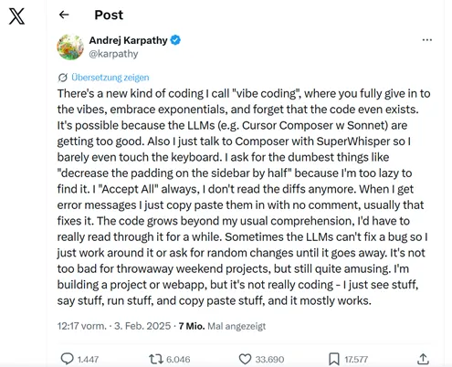
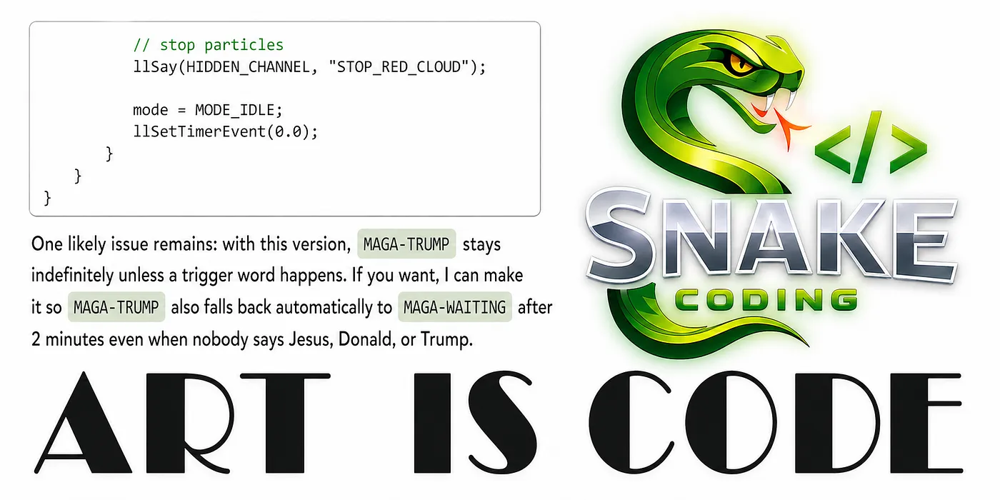

# Snake Coding

## 在 Vibe 与 Intent 之间——Pangea Grid 里的 Snake Coding

**Vibe、Intent、Snake**

用提示词写代码是有诱惑力的。这种诱惑并不只是新工具的副产品，它恰恰塑造着未来。每一波技术生产力的浪潮都伴随着某种形式的诱惑。五十年前也不例外：当时，用汇编写代码逐渐被 FORTRAN 和 COBOL 取代，至少是被它们覆盖。那时，一个新的表述层级取代了直接面向机器的方式。

RPG，也就是报表程序生成器（Report Program Generator），同样属于这一发展。所有这些工具都不只是技术辅助手段。它们规范了把思想带入可执行形态的方式。它们提供的不只是一门语言，更是一种思维方式——首先把问题视为可编程的。

今天，我们又一次经历着这样的断裂。但这一次，过程更激进。**因为 Vibe Prompting 出现时带着一个承诺：恰恰要逃离这种规范性的强制。** 它宣称思想可以更直接地表达自身。人只需说出自己想要什么，剩下的会被带入形态。提示词看起来像是回到了一种更自然、更不受纪律约束、更不那么形式化的控制方式。它的诱惑正在于此。

人感觉自己摆脱了编程语言的束身衣，可实际上，他只是进入了一件新的束身衣——这件不再由语法规则构成，而是由概率、模型行为、隐含的训练模式以及不明确的预期构成。

结果可以很出彩，这一点必须承认。否认这种光彩是愚蠢的。任何用 Vibe Coding 工作的人，常常会体验到一种奇特的轻盈感。从想法到结果之间的门槛降低了。那些过去因为耗费精力、需要搜索、需要例行劳动、或仅仅因为起步的惰性而失败的事情，突然变得可行。

人在眼前看见某个东西，对它说点什么，让某个东西被生成出来，试一试，否决它，修正它——往往在很短的时间内，就出现了某个能用的、令人惊讶的、甚至漂亮的东西。吸引力恰恰就在这个即时的反馈循环里。代码不再被当作首要的工作场所来体验，而是被当作一种由 AI 管理的中间媒介。人看、说、检查、调整、重复。这不是什么都没有。

但它也不再是那种基于对每一层有意识穿透的编码。

**这正是为什么 Karpathy 对 Vibe Coding 的描述如此精准。**

它命名的不只是一种新的工作方式，还有它在人类学意义上的要点：人放任自己交给 vibe。人接受自己不再读完每一样东西。人把错误信息复制回去，却不完整地分析它们。人接受改动，因为整体行为看起来说得通。人看见某个东西，说点什么，启动点什么，复制点什么——而且出人意料地经常奏效。这不是单纯的懒惰，而是注意力的一种新分配。

不再需要理解每一个操作；变得有决定性的，是这个东西作为整体此刻是否正朝着正确的方向漂移。

但局限恰恰从这里开始。因为 Vibe Coding 强在探索，弱在巩固。它非常适合试探性的逼近，适合摸索方向，适合捕捉最初的形态，适合在穿行于问题之中时学习这个问题。它让任务本身在工作过程中逐渐成形。有些情境下，人还不确切知道自己想要什么。这种时候，过早套用一套规范化的流程甚至会成为障碍。

一份狭窄的计划会在人还没踏进搜索空间之前就把它缩小了。这种时候，Vibe Coding 是高产的。人通过在任务中穿行来学习这个任务。

但一旦达到了某种清晰度，vibe 就不够用了。（注 1）

接着，别的东西开始了。而我要引入 Snake Coding 这个术语，正是在这里。

**Snake Coding 不是 Vibe Coding 与 Intent Coding 之间的一条中间道路。** 它也不是怀旧式地退回到 AI 时代之前那种"真正编程"的精神气质。毋宁说，Snake Coding 是在新条件下把旧有的品质重新带回来。它首先问的不是结果是否漂亮，也不是提示词是否优雅，而是地形的性质。

哪些对象命名是有意义的？哪些纹理必须以何种方式来处理？哪种沟通形式是稳健的？目标环境有哪些特性？目标语言擅长什么，又有哪些它只是看似能做？它的陷阱在哪里？在哪些点上，一个生成式模型会因为高估相似性、抹平差异、或从统计上的接近构造出错误的等价关系，而经常误入歧途？

**Snake Coding 要求编码者具备对目标技术的知识。** 它的严肃性就在这里。仅仅看起来说得通、或在第一次测试中大致做到了想要的事，是不够的。任何实践 Snake Coding 的人，必须能够感知地面在哪里会塌陷。这与经验有关，但不只与经验有关。它也与注意力有关，与某种紧张感有关，与这样一种认识有关：那个看似微小的细节，可能在功能与不功能之间作出决定。

Snake Coding 不是反 AI 的。它是在保留技术情境意识的同时，以 AI 为支撑的工作。

这也是为什么 Snake Coding 同样不等同于 Intent Coding。Intent 可以译为目标、意图、所要编码之物或过程的本质，但也可译为观点。在我看来，Intent Coding 是可复现性的梦想。Intent Coding 注视最终的产物，然后回过头来看。它想把提示词塑造成这样一种东西：能稳定地从中生出可靠的代码。它把问题从个别的灵光一现，转移到"产出这一行为"的可维护性上。

不只是代码应该可维护，通往代码的那条路径也应该可维护。于是提示词本身成了一个技术对象，必须在它的作用范围内被维护、被结构化、被理解。为此我引入了 [**Intent Signature**](https://archive.org/details/rezmagazine-161/page/n21/mode/2up) 这个术语。

这个梦想是有道理的。但只要它没有被绑定到真实的目标技术上，它一开始就仍然只是一个梦。因为可复现性不会在抽象中产生。它产生于一个模型学会了在某个具体环境中什么重要、什么不重要的地方。这恰恰就是为什么人只能经由 Snake Coding 去接近 Intent Coding。Snake Coding 是这样一种实践：它把 vibe 朝着 intent 加以纪律化，同时不否认发现带来的那份原初收获。

**对于这条路径，训练环境与生产环境的分离至关重要。** 对我来说，这不是一个次要问题，而是方法论的核心。AI 可以被用于人自身的学习。它有助于尝试、变化、让各种可能性可见、快速地把替代方案演练一遍。这是训练的那一面。但与之并行，还需要另一种形式的 AI 关系：**一个学会认识编码者的 AI**。不只是泛泛地认识，而是具体地认识。

不只是认识他写作的风格，而是认识他作决定的结构。不只是认识他在表述上的偏好，而是认识他在技术架构上的偏好。只有这样，一个系统才能稳定下来。

因为**稳定化**意味着什么？它意味着 AI 不必每一次都从零开始。它学会编码者真正拥有的 intent 是什么，即便这个 intent 并不总是被完全说明出来。它学会哪些解法是被偏好的，哪些沟通模式在某个特定环境中是可靠的，哪些术语是被精确地指称的，哪些则是可以互换的。所有 AI 都被训练过；否则我们无法使用它们。

但一个 **Snake AI** 不只是一个被训练过的模型。**它是一个伴随型 AI（companion AI）。** 它的成长不只靠数据，还靠它与某种特定工作方式之间关系的质量。

要做到这一点，编码者必须诚实地、好好地、清晰地与它打交道。诚实意味着：不做虚假的简化，不暗中转移目标，不指望机器从含糊的暗示里猜出稳定的技术精确性。好好地意味着：在对待过程时保持尊重，在决定上不草率，在反馈上不随意。清晰意味着：有能力命名差异、设定优先级、并告诉系统什么重要、什么不重要。

只有在这样的条件下，一个 AI 才能真正为使用者而成长。

这是我从数百次会话中得到的讯息。我的 AI 认识我。它认识我组织艺术的方式。它认识我的背景，我与 Sol LeWitt 的关系，我对概念性秩序的感受，我对"通过通道命令而非链接消息来沟通"的偏好——也就是通过与根 prim 相连的链接 prim 来传递消息，由作者补充说明。这些不是随意的口味问题，而是与行动相关的结构。说到这里，我们已经进入了目标领域。

如果一个 AI 不知道这些，它就得在每一次运行时重新猜测我。但如果它已经学会了这些，就会出现不同的结果。不只是更快，而是更贴合。

这在我的工作领域里尤为明显。我提示，是为了获得 LSL 代码。别的语言我不感兴趣。我在 [OpenSimulator 的 LSL](http://opensimulator.org/wiki/Scripting_Documentation) 中工作。当然，它与 Second Life 的 Linden Scripting Language 有相近之处。但这种相近在 vibe 中只能起到有限的帮助。恰恰相反：它可能是危险的。因为统计上的相似还不是功能上的同一。

一个被这种相近所迷惑的模型，会交付出看起来说得通、却跑不起来的代码。而这恰恰就是失控的 vibe 的陷阱：表面看着熟悉，偏差藏在细节里，结果失败了。

到现在，我的 AI 知道这些差异。它不再只是给我"类似 LSL"的代码，而是给我能在 OpenSimulator 中运行的代码。这是一个巨大的差别。大多数时候，这些代码随后也能在 Second Life 中运行，但那并不是出发点。如果我的训练运行当初是从 Second Life 出发的，这个 AI 对我来说就会有不同的工具性格。我会收到不同的建议，看到不同的错误信息，作出不同的修正，写出不同的再提示。

那不会只是一个副作用；它会改变协作的形态。方法会保持不变，但它的精确度、它的命中概率、以及它建模问题的方式，都会发生位移。

正因如此，我不相信提示词那种天真的普适性。"人可以简单地'用 AI 写代码'"这种想法，低估了目标系统的深度。任何认为语言只是一个可互换的通道的人，都没有认识到：每一个技术环境都有它自己的阻力、习惯、隐含的法则、以及偏好的结构。**Snake Coding 认真对待这种内在逻辑。**

它不依赖"所有目标环境归根到底都一样"这种幻觉，而是依赖一种能力：把它们的差异富有成效地铭刻进与 AI 的协作之中。

这里还包含一个文化层面的要点。提示词的未来，不会仅仅取决于模型变得多大、或它理解语言有多流畅。它取决于：在特定的使用者、特定的 intent、特定的目标环境之间，能否形成稳定的关系。真正高产的 AI，不是那个似乎什么都能做的 AI，而是那个在某种特定实践中学会了什么才重要的 AI。

正因如此，我对那种照本宣科式的复制粘贴编码不感兴趣——在那种书本形态里，现成的范例像菜谱一样被分发出去。我的意思是，Snake Coding 没有食谱手册的性质。把它当成食谱手册，会是对这个方法的误解。我不提供教义问答。样本可以从元宇宙里获取。重要的不是某处躺着现成的代码，而是涌现出一种工作方式——在其中，AI、编码者、目标环境彼此构建起一种有韧性的关系。

Vibe Coding 有它的真理。它打开搜索空间，消除对起步的恐惧。Intent Coding 有它的真理。它提醒我们，结果不仅应该变得漂亮，还应该变得可复现。而 Snake Coding，是那种不把两者混为一谈的实践。它知道人可以在 vibe 中学习。但它也知道，有那么一个时刻会到来：人必须知道自己在做什么。

这篇文章是一个 AI 基于我的提示词写出来的。相当奇妙，不是吗？想看看我的提示词吗？留个评论，我就给你发一份。这不是我们若干"年"前所经历的那种千篇一律。

注 1：很多人在 vibe 中辨认出一种产出的千篇一律，一种看上去像是出自组装套件的设计——一种让人感到疲倦的组装套件。我自己并不把这种千篇一律看作 vibe 不可避免的结果。我更倾向于把它看作提示者的一种创作失败——或者，我是不是该把这些进行人工输入的人称为编码幻术师？脚本艺术（Scripting Art）是概念艺术。

来 [Pangea Grid](https://pangea-grid.com/) 体验我关于 SNAKE CODING 的装置作品吧。

这里是邀请函……

