# 从鸢尾花到反向图片搜索：K-Nearest Neighbors

## *K-Nearest Neighbors 是机器学习里的蟑螂。它会比我们都活得更久。*

For You 页面、Spotify Discover Weekly、你做过的每一次反向图片搜索，以及 ChatGPT 内部的检索，背后的算法比彩色电视还老。

K-Nearest Neighbors。Evelyn Fix 和 Joseph Hodges 在 1951 年的一份美国空军技术报告里提出了它。它从未真正被取代，只是被改了名字、提了速度，然后悄悄塞进你听过的每一个向量数据库里。Pinecone。Weaviate。Qdrant。Chroma。Milvus。全都是。同一个想法，更快的索引。

奇怪的是，没人把它当作它本应成为的基础来教。KNN 被交给一年级 ML 学生，当成一个“入门算法”。然后这些学生毕业，进入公司，在价值十亿美元的 AI 技术栈底部，把 KNN 跑在生产环境里。


*For You 页面、Discover Weekly、ChatGPT 记忆。同一个算法。1951 年。*

这是一本我希望有人在教科书版本之前递给我的 KNN 指南。

开始吧。

你在 Hanoi 醒来。你从没去过那里。你不会说越南语。你站在一家热闹的粉店里，饿得不行。你附近排队的五个人正在吃五碗不同的汤。三个人吃的是同一种黄汤底的东西。两个人吃的是红色的东西。服务员正盯着你。

你指了指那碗黄汤。

你活下来了。你吃到了好东西。你没有在 Hanoi 浪费一顿饭。

这就是 K-Nearest Neighbors。K 等于五。距离是“身体上站在我附近的人”。投票是“他们大多数人在吃什么”。你的预测是“我也应该吃那个”。超参数是你愿意看陌生人的碗，又不让事情变得尴尬的程度。

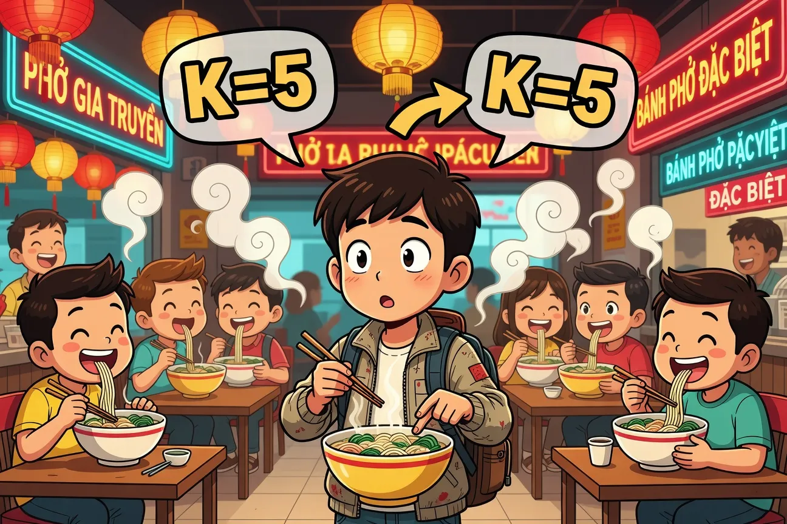
*饥饿、迷路，然后意外成了一个 1951 年算法的发明者。*

这就是整个概念。其他全是工程。

KNN 做分类时，会取出距离最近的 K 个已存点的标签，然后投票。KNN 做回归时，会取出这些值并求平均。没有训练。没有神经网络。没有任何你体育老师会认可的那种“学习”。只有记忆、距离和民主。

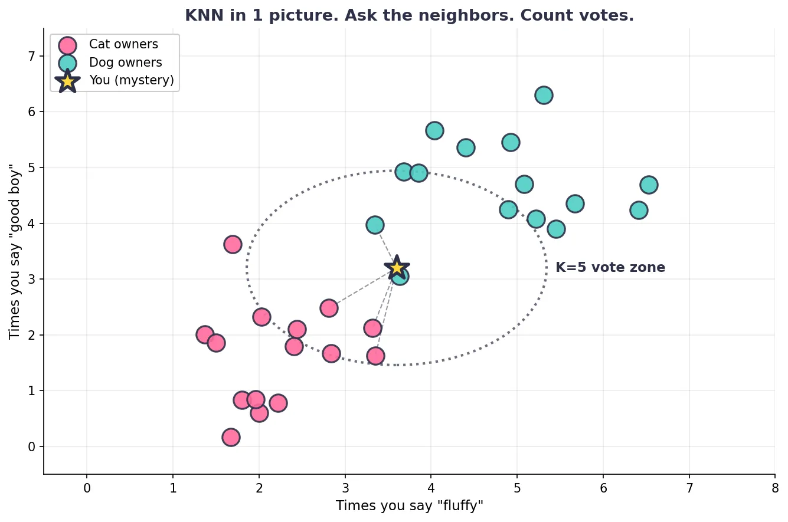

## 为什么这东西叫“懒惰学习器”，以及为什么这是夸奖

大多数 ML 模型在训练时努力工作，在预测时休息。

Linear regression 在 fit 阶段花时间做矩阵数学。Random forests 会提前建好数百棵树。Neural networks 会连续耗电数小时，有时数天，有时耗掉一个小国的 GDP。然后到了 inference 阶段，它们乘几个数，几毫秒内给出答案。

KNN 把这笔交易反过来了。

训练只是存储数据。算法说：“收到了，这些是我的点。”这部分花费的时间，就是你的硬盘记住东西所需的时间。很快。昂贵的是预测阶段，因为 KNN 可能要计算到每一个已存点的距离。

人们称它为“lazy learner”。这是个圈内玩笑。KNN 并不懒。KNN 很有耐心。它拒绝做那些还不知道是否必要的工作。它是算法里的项目经理。

为什么这很重要？如果你有 5000 万个训练点，在没有帮助的情况下，每次预测都需要 5000 万次距离计算。这对原型验证没问题。对生产环境不行。本文后面会讲那些让它在规模化场景中可用的提速技巧（KD trees、ball trees、HNSW、IVF）。现在只要记住，KNN 的账单是在 predict 时到来的，不是在 fit 时。


*训练过程。它在学习。看它多努力学习。*

## 藏在明处的 KNN 快速巡礼

你这周已经用过 KNN。很可能今天早上用过。也可能就在过去十分钟内用过。

当你打开 TikTok，For You 页面不知怎么就知道你这个月迷上了木工视频，那是基于用户 embeddings 的 approximate KNN。当你在 Spotify Discover Weekly 里找到一首比你曲库里任何歌都更带劲的歌，那是基于歌曲 embeddings 的 KNN（Spotify 多年前开源过他们的 Annoy 库）。当你用 PlantNet 扫描一片叶子，两秒后它告诉你物种时，模型先用 CNN 编码照片，然后让 KNN 去找最近的已知植物。

当 Hinge 把那个完美得有点可疑的个人资料推到最前面时，KNN 正在根据你已经喜欢过的人做相似候选过滤。当你的银行标记出凌晨 4 点、发生在你从未去过的州的一笔加油站消费时，欺诈系统用了 KNN 风格的 anomaly detection，发现这笔交易在 feature space 里离你平常的邻居远得离谱。当 Shazam 第三次尝试终于识别出自助洗衣店里正在播放的那首歌时，它是在用 nearest-neighbor lookup 匹配音频指纹。当 Google 反向图片搜索吐回你从 Pinterest 偷来的那张精确库存图时，那是基于 image embeddings 的 ANN。

注意到了吗？

几乎所有你会形容为“聪明”的消费级应用，本质上都是披着自信外套的相似度查找。

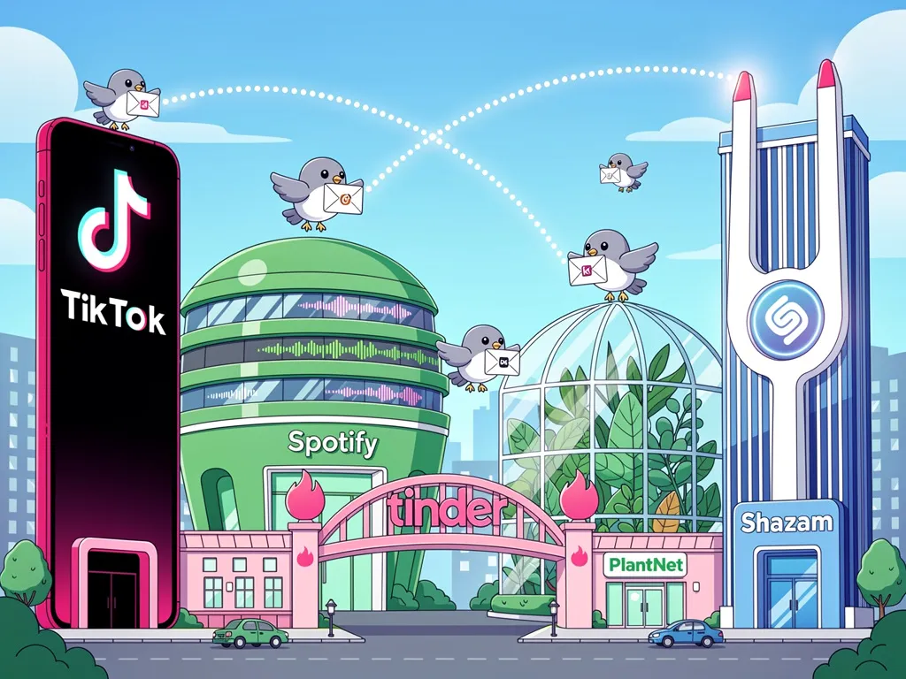
*这就是你的手机。每一条发光线都是同一个算法。*

有趣的转折是，这些生产系统没有一个使用朴素 KNN。它们使用 approximate nearest neighbor 方法（HNSW、IVF、LSH、ScaNN），因为在十亿个点上做 exact KNN 会等到天荒地老。但核心没变。你在 Hanoi 粉店里做的数学，就是刚刚让你笑出来的推荐背后的数学。

## 你真正会用到的五种距离度量

多数初学者就是在这里脸朝下摔倒的。KNN 的质量由你的距离度量决定。选错了，模型就错。选对了，模型好得可疑。度量不是细节。度量就是整场对话。

值得知道的度量有五种。我台面上半融化的黄油说，我们这一节应该走快一点。

1.  EUCLIDEAN (L2)。直线。

distance = square\_root( sum over each feature of (x\_i — y\_i) squared )

这是你从学校里记得的 Pythagoras。乌鸦飞行路线。两个点，一条对角线。它是 scikit-learn 里的默认值，对于尺度相近、干净的数值特征，几乎总是够用。

它什么时候发光。连续数值数据，低到中等维度，特征之间确实可比较。

它什么时候背叛你。高维。没有标准化的混合尺度。任何方向比大小更重要的场景。

有个故事。我第一次在 768 维 sentence embeddings 上使用 Euclidean 时，查询 “I love dogs” 的“nearest neighbor” 竟然是一条关于停车罚单的 tweet。我坐在那里盯着显示器眨眼，整整一分钟。窗外卡在树上的塑料袋横着飘。然后我换成了 cosine。下一个 nearest neighbor 是关于 golden retrievers 的 tweet。教训收到了。

1.  MANHATTAN (L1)。出租车。

distance = sum over each feature of absolute\_value(x\_i — y\_i)

你不能在 Manhattan 里穿楼飞行。出租车沿着网格走。你的距离是横向街区加上纵向街区的总和。没有捷径。

它什么时候发光。容易出现 outlier 的数据（Manhattan 对 outlier 的惩罚比 Euclidean 小，因为平方会放大大的差异）。网格数据。有时也适合高维空间（后面会讲）。

它什么时候背叛你。当你的特征表示某种弯曲或方向性的东西，而 L 形路径在几何上很荒唐时。

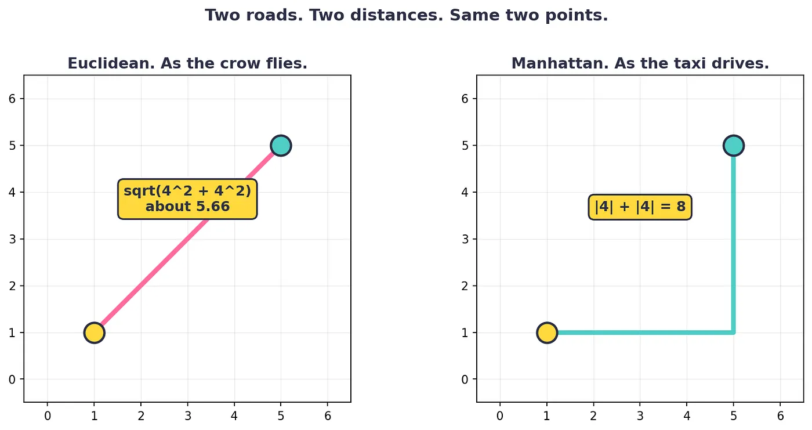
*同样两个点。两种度量。一个模型决策之后，你的准确率可能上升 8%，也可能下降 12%。*

1.  MINKOWSKI。父类。

distance = ( sum over each feature of absolute\_value(x\_i — y\_i) raised to p ) raised to (1 divided by p)

Minkowski 是总公式。p=1 时得到 Manhattan。p=2 时得到 Euclidean。p=infinity 时得到 Chebyshev（最大差异，用于国际象棋里的国王走法和仓库路径规划）。

为什么这很重要。scikit-learn 的 KNN 默认使用 p=2 的 Minkowski。所以当你在文档里看到 metric=’minkowski’，那只是参数化的通用形式。有时 fractional p（比如 p=1.5）会在奇怪的数据集上有帮助，但我职业生涯里只见过两次这种情况，而且两次那个工程师都是研究论文型的人。

1.  COSINE。角度。

*cosine\_similarity = ( A dot B ) divided by ( magnitude\_of\_A times magnitude\_of\_B ) cosine\_distance = 1 — cosine\_similarity*

Cosine 衡量两个向量之间的角度。它丢掉 magnitude。只要两个向量指向同一个方向，即使其中一个长得多，它们也相似。

它什么时候发光。Text embeddings。Sentence transformers。Word2Vec。OpenAI embeddings。Image embeddings。来自任何现代 transformer model 的任何 embedding。任何 magnitude 只是模型副作用、而不是真实信号的场景。

它什么时候背叛你。真实世界的数值特征，并且 magnitude 携带含义，比如价格、计数，或者“还剩多少块饼干”。

Cosine 成为 embeddings 默认选择，部分是历史原因（原始 word2vec 论文用了它），部分是实际原因（随着模型 fine-tuned，embedding magnitudes 会漂移，但方向保持稳定）。如果你关于距离度量只能记住一件事，就记住这一件。它是你将来构建的每一条 RAG pipeline 内部检索所依赖的度量。

1.  HAMMING。字符串计数器。

distance = number of positions where two equal-length strings differ

Hamming 计算两个等长序列中不匹配的位置数。字符串 “1010” 和 “1001” 的 Hamming distance 是 2。“ACTG” 和 “ACGG” 也是。两个产品 SKU 如果在第三和第五个位置不同，也是。

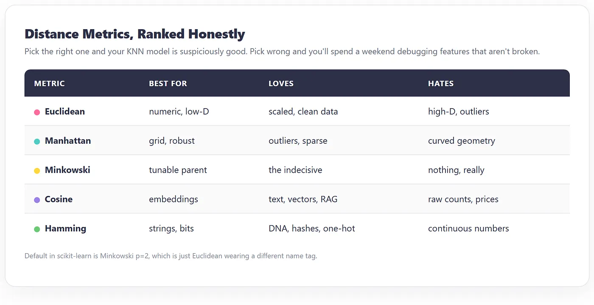

它什么时候发光。二进制特征。DNA 序列（真正的 bioinformatics 工具会用它）。Hash similarity（用于图片去重和抄袭检测）。One-hot encoded categoricals。

它什么时候背叛你。连续数据。不等长字符串（那种情况用 Levenshtein）。混合特征类型。

还有更多度量（Mahalanobis、Jaccard、Hellinger、edit distance、earth mover’s）。大多数都用于特殊场景。上面五个足以应付 95% 的工作。

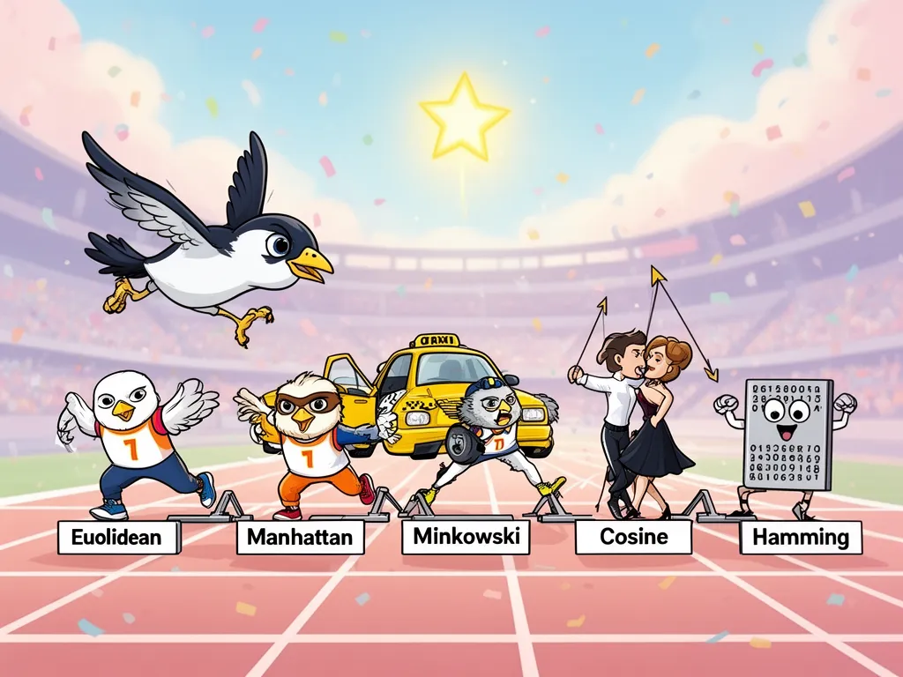
*五种距离度量走进一个模型。最后一个拿到了工作。*

## 选择 K。那个会暗中搞坏你模型的部分。

K 是一个数字。K 也是你这个月会碰到的最危险数字。

把 K 设得太小。你的模型会变成一个偏执的图书管理员。K=1 意味着预测标签完全由最近的单个点决定。一个放错位置的训练样本，一个标错标签的行，一个奇怪的 outlier，都会在周围区域建立自己的小小坏预测王国。决策边界看起来像心率监测仪的读数。

把 K 设得太大。你的模型会变成一个只相信平均值的区域经理。K 等于数据集大小时，每一次预测都是多数类。你用额外步骤和一笔许可费，构建了一个常数函数。

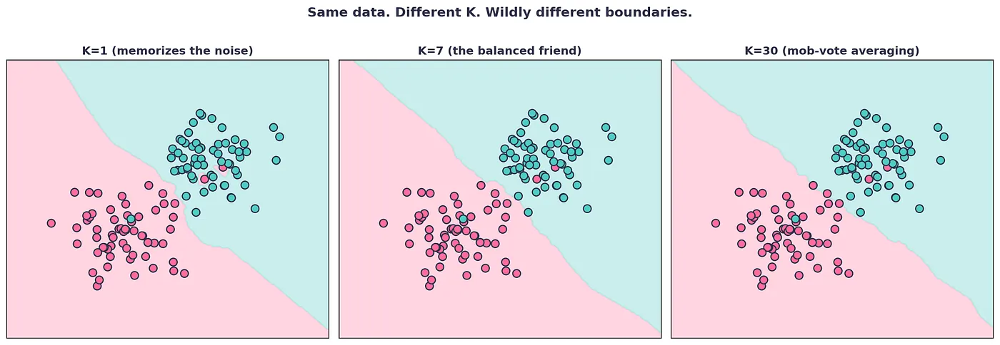
*同样的数据。同样的算法。三个 K 值。三个完全不同的模型。*

如何选择 K，按你对工作的认真程度排序。

餐巾纸规则。K 等于训练点数量的平方根。100 个点，试 K=10。10000 个点，试 K=100。作为起始猜测还行，作为最终答案很糟。

二分类的奇数 K 规则。使用奇数 K，这样投票不会打平。否则 scikit-learn 会通过选择索引更低的类别来打破平局，这在算法上相当于抛一枚你已经粘住的硬币。你不会想要这个。

Bias-variance 方法。小 K 意味着低 bias、高 variance。模型会摇来摇去。大 K 意味着高 bias、低 variance。模型会犯困。选中间的 K，然后调参。

成年人方法。在训练集上做 K-fold cross-validation。遍历从 1 到某个上限的 K 值（我通常停在 sqrt(N) 加 20）。画出 validation error 随 K 的变化。寻找 elbow。选择刚过拐点的 K。

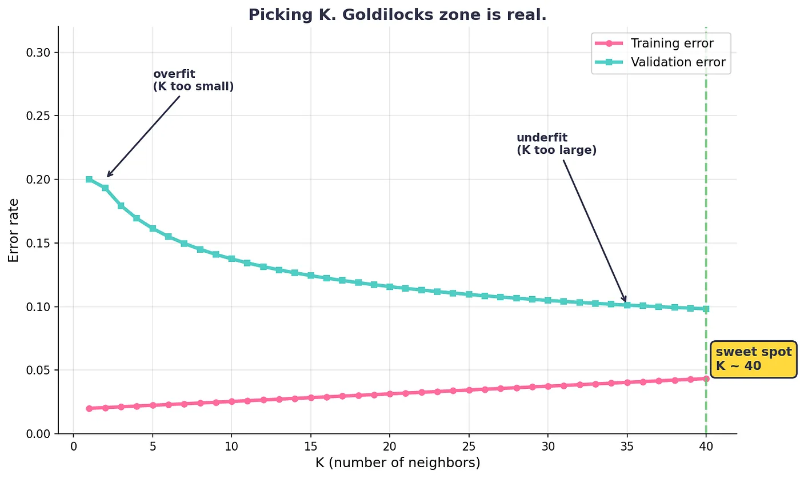
*粉色线是你的训练集在当面骗你。蓝色线说真话。听蓝色线的。*

一个我花了三年才学会的提醒。正确的 K 取决于你的数据、特征、噪声水平和距离度量。不存在通用 K。任何告诉你 K=5 对一切都最优的人，要么一直运气很好，要么实验跑得不够多。

我曾经不小心把 K=2 发到了生产环境。二分类器里 K=2 意味着两票，而在我的数据集中，大约 14% 的时候会打平。系统默认把这些平局判为负类，这悄悄把我的 false negative rate 抬高了，幅度正好触发了下一季度的客户流失分析。产品经理一直没搞明白为什么流失率上升。我没有告诉那个产品经理。TA 已经去了另一家公司。我钱包里那个月的收据还在，已经褪色。

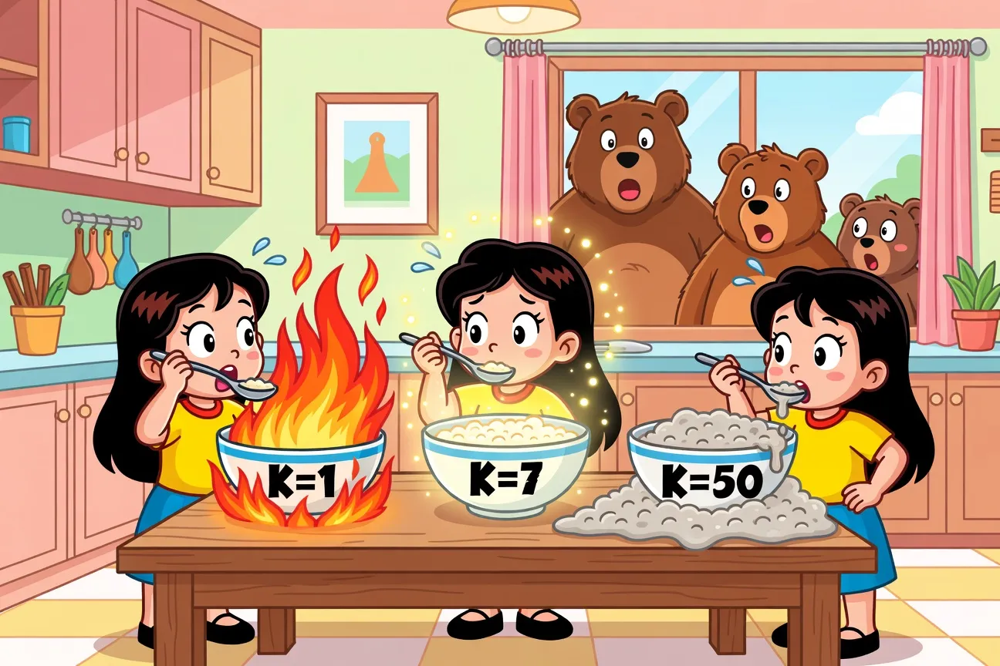
*KNN 调参就是粥工程，只是职业前景更糟。*

## 维度灾难。教科书开始变奇怪的部分。

有件事没人会礼貌地告诉你。

在低维空间里，距离的表现符合你的预期。有些点近，有些点远，你的算法有东西可嚼。简单模式。

在高维空间里，每个点到每个其他点的距离都差不多。这个数学真的很奇怪。单位超立方体的体积会集中到角落附近。高维球体的质量几乎完全存在于靠近表面的一层薄壳里。你的直觉是在三维空间里训练出来的，于是它申请失业了。

实际后果是，“nearest neighbor” 不再意味着任何有用的东西。随着维度增加，你的点之间最大距离与最小距离的比值趋近于 1。所有人都一样远。KNN 之所以存在，是为了问“谁最近”，而这整个问题被拿走了。

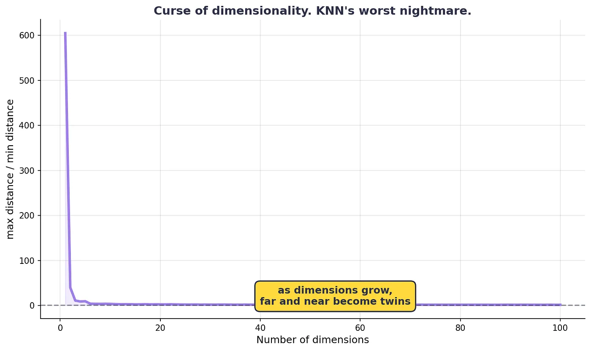
*当你不加思考地不断添加特征时，KNN 直觉跌下去的悬崖。*

有三件事能救你。

第一。在高维里用 cosine。即使 magnitudes 变平，方向仍然有意义。这就是为什么每个 embedding-based search system 都用 cosine。不是因为 cosine 有魔法。而是因为 Euclidean 在那里坏了。

第二。降维。PCA、UMAP、用于可视化的 t-SNE、用于生产环境的 autoencoders。把 2048 维 ResNet vector 降到一个仍然保留结构的 128 维表示。KNN 又能呼吸了。

第三。选择特征。KNN 平等对待每一个特征。一个无用特征不是免费的。它是你距离函数里的一个小泄漏。扔掉累赘。

隔壁的猫已经盯着一个空角落看了十分钟。我觉得她看见了维度灾难，并且正在评判它。很难说。

## 标准化。没人做，直到他们做错才会做的那一步。

KNN 对特征尺度过敏。这是初学者 KNN 代码里最常跳过的一步，也是初学者 KNN 代码通常很差的原因。

想象两个特征。Salary in dollars。Age in years。Salary 范围从 30000 到 200000。Age 范围从 18 到 80。两个人之间的 Euclidean distance 会被 salary 差异主导。Age 简直等于不存在。你的 “nearest neighbor” 搜索已经悄悄变成了 “nearest salary” 搜索，而你没有发现，因为代码运行得很好。

修复只需要一行。先标准化。

StandardScaler 会把每个特征转换成 mean 0、standard deviation 1。现在 salary 和 age 在同一块场地上打架。

如果你的特征有 outliers，RobustScaler 更好（它使用 median 和 IQR，而不是 mean 和 std）。如果你的特征有边界，MinMaxScaler 也可以。选择什么不如“做了这件事”重要。

让人丢工作的规则。只在训练数据上 fit scaler。对测试数据使用 transform，绝不要 fit\_transform。否则你就把测试集信息泄漏进了模型，你报告的准确率就是虚构的。

```python
from sklearn.preprocessing import StandardScalerscaler = StandardScaler()
X_train_scaled = scaler.fit_transform(X_train)
X_test_scaled = scaler.transform(X_test)
```

第二行。记住这个差异。

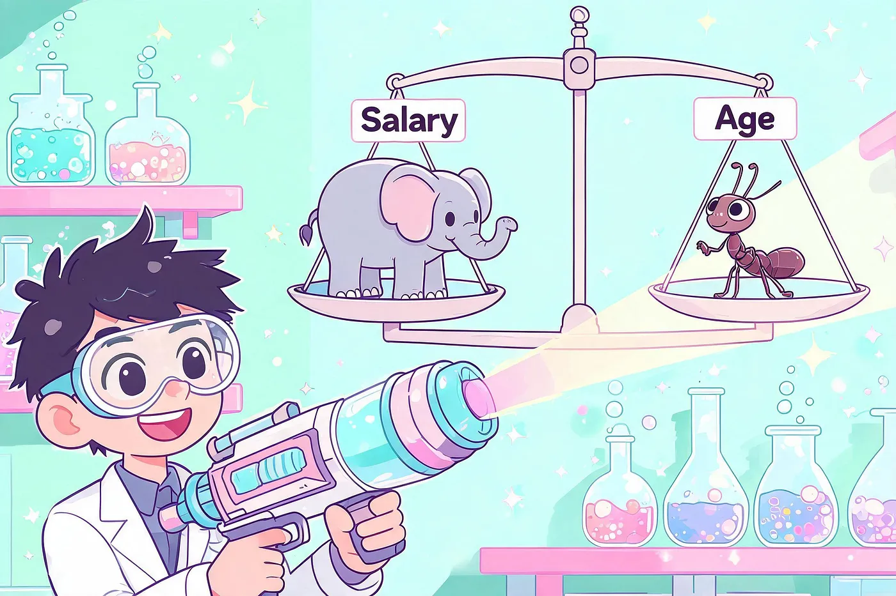
*标准化就是给特征的公平性。让它们用同样音量争论。*

## 代码。正经代码，带诚实注释。

该写真正的代码了。我们会在 Iris dataset（分类里的 “Hello World”，150 行、4 个特征、3 个物种）上构建一个 KNN classifier，然后用 cross-validation 正确选择 K。

如果你还没安装 scikit-learn，先运行 pip install scikit-learn。洗碗机会在安装时运行。两边大概会同时结束。

> numpy 是 Python 里所有数值相关东西的基础。
> 
> pandas 是我想把数据看成表格，而不是嵌套列表时用的。
> 
> matplotlib 是我不得不说服 stakeholder 某件事时用的部分。

```python

import numpy as np
import pandas as pd
import matplotlib.pyplot as plt
from sklearn.datasets import load_iris
from sklearn.model_selection import train_test_split, cross_val_score
from sklearn.preprocessing import StandardScaler
from sklearn.neighbors import KNeighborsClassifier
from sklearn.metrics import accuracy_score, classification_report, confusion_matrix
RNG = 42
iris = load_iris()
X = iris.data
y = iris.target
print("X shape", X.shape)
print("y shape", y.shape)
print("class names", iris.target_names)
X_train, X_test, y_train, y_test = train_test_split(
    X, y, test_size=0.2, random_state=RNG, stratify=y
)

scaler = StandardScaler()
X_train_scaled = scaler.fit_transform(X_train)
X_test_scaled = scaler.transform(X_test)
baseline = KNeighborsClassifier(
    n_neighbors=5,
    weights="uniform",
    metric="minkowski",
    p=2,
)
baseline.fit(X_train_scaled, y_train)
y_pred = baseline.predict(X_test_scaled)
print("Baseline accuracy", round(accuracy_score(y_test, y_pred), 4))
print(classification_report(y_test, y_pred, target_names=iris.target_names))
print(confusion_matrix(y_test, y_pred))
```

```
ks = list(range(1, 31))
cv_scores = []
cv_stds = []for k in ks:
    candidate = KNeighborsClassifier(n_neighbors=k)
    fold_scores = cross_val_score(
        candidate, X_train_scaled, y_train, cv=5, scoring="accuracy"
    )
    cv_scores.append(fold_scores.mean())
    cv_stds.append(fold_scores.std())best_k = ks[int(np.argmax(cv_scores))]
print("Best K via CV", best_k)
print("Best CV accuracy", round(max(cv_scores), 4))final_model = KNeighborsClassifier(n_neighbors=best_k, weights="distance")
final_model.fit(X_train_scaled, y_train)final_acc = accuracy_score(y_test, final_model.predict(X_test_scaled))
print("Final test accuracy", round(final_acc, 4))
```

这段脚本里有几件事值得注意。

模型选择循环从不接触测试集。测试集被留到最后，只做一次诚实的测量。如果你在测试集上调参，那你测的就不是泛化能力。你测的是自己对这个特定测试集拟合得有多好，而这不是同一件事。

我选择 accuracy，是因为 Iris 是平衡的。如果你做的是 fraud detection，而 99.9% 的交易都是 legit，那么 accuracy 毫无意义。永远预测 “legit” 就能拿到 99.9%。这种情况下用 F1 或 recall。真正重要的指标，是会惩罚你实际关心的 failure mode 的那个指标。

最终模型使用 weights=’distance’。更近的邻居获得更多投票权。下一节会解释。


*我的代码第一次顺利跑通，而且那些花也很配合。*

## Weighted KNN。当投票不该平等时。

默认 KNN 给 K 个最近邻中的每一个一张同等票。这很民主。如果你最近的邻居就坐在你身上，而第五近的邻居在另一个时区，那也有点蠢。

Weighted KNN 说，更近的邻居应该算得更重。标准方案是 inverse distance。距离为 1 的邻居权重是 1。距离为 4 的邻居权重是 0.25。投票总和会更偏向本地信息。

在 scikit-learn 里，这就是一个参数。

```
knn = KNeighborsClassifier(n_neighbors=5, weights="distance")
```

为什么这很重要。当你的决策边界弯弯曲曲、很局部时，Weighted KNN 往往能提升 accuracy。它也能缓解轻微的 class imbalance，因为一个小而非常近的 minority-class 邻居簇，可能压过一大群更远的 majority-class 邻居。

什么时候不要用它。当你的距离度量有噪声，或者特征 variance 很高时。Inverse distance 会放大任何最终靠得很近的邻居的影响，包括那些 outlier-close 的邻居。垃圾近，垃圾出。

还有一个更花哨的版本，叫做带 kernel function 的 distance-weighted。Gaussian kernels、Epanechnikov、tricube。它们会让权重更平滑。实践中，‘uniform’ 和 ‘distance’ 覆盖了 95% 的需求。那些异国情调的 kernels 是给学术会议和研究经费依赖它们的人准备的。

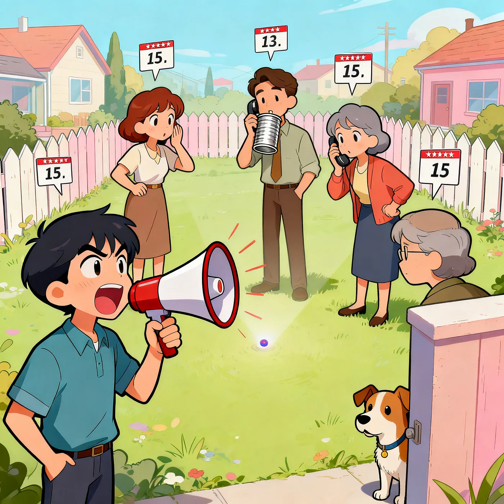
*五个邻居。一个有扩音器。猜猜谁赢。*

## KD Trees、Ball Trees，以及为什么你的 predict 调用很慢

Brute-force KNN 会计算 query point 到每一个 training point 的距离。1000 个训练点，没问题。1000 万个，你会去拿个三明治，回来看到同一个 loading bar。

两种数据结构能显著降低成本。

KD-Tree。沿着坐标轴递归切分 feature space。查询会遍历这棵树，并剪掉那些不可能包含更近点的分支。在低维里，搜索复杂度从 O(N) 降到大约 O(log N)。在大约 20 维以内表现不错。再往后，bounding boxes 会变得太松，无法有效剪枝。

Ball Tree。把空间切分成嵌套的 hyperspheres。在更高维里比 KD-Tree 更好，因为 hyperspheres 比 axis-aligned boxes 更能处理偏斜分布。在性能退化前，大约可用于 30–40 维。

在 scikit-learn 里

```
knn = KNeighborsClassifier(n_neighbors=5, algorithm="ball_tree")
```

或者 ‘kd\_tree’、‘brute’、‘auto’。‘auto’ 选项会让 sklearn 根据你的数据来选，通常是对的。

对于高维数据（想想 100 多维，也就是现代 AI 所处的范围），两种树都救不了你。Bounding-box pruning 会失败，因为在高维里大家距离都差不多。你又回到了 brute force，或者 approximate methods。

这就把我们带到了 vector databases 存在的原因。

## Approximate Nearest Neighbors。现代 AI 背后的技巧。

当你有十亿个向量时（欢迎来到 OpenAI、Anthropic、Pinecone，以及每一个大型 AI 产品），exact KNN 已经死了。即使有树也一样。你需要 approximate KNN，也叫 ANN。

三大算法支撑着向量数据库行业的大部分。

HNSW (Hierarchical Navigable Small World)。当前默认选择。它构建一个多层图，每个节点连接到附近节点，高层连接更稀疏，低层连接更密集。查询从顶部开始，贪心地向目标跳跃，然后逐层下钻。快速、准确、吃内存。Pinecone、Qdrant、Weaviate，以及基本上所有 2018 年后推出的产品都在用。Yury Malkov 的原始 HNSW 论文是 vector search 领域引用最多的论文之一。

IVF (Inverted File Index)。用 k-means 把 vector space 划分成 clusters。查询时只搜索最接近的 K 个 clusters，而不是整个 index。对某些 workloads 来说比 HNSW 更快，但准确率更低。这个技术是 Facebook 的 FAISS 库内部的主力。

LSH (Locality-Sensitive Hashing)。对向量做 hash，让相似向量以高概率落入同一个 bucket。更老、构建更快、准确率更低。Spotify 的 Annoy 库使用一种相关的基于树的方法。Google 的 ScaNN 是另一个知名的生产级 ANN 系统。

这些方法都在回答同一个问题：“给我找出这个 query 的 K 个 nearest neighbors。”它们只是用一些准确率换来了大量速度。


*向量数据库行业，是一场押在 1951 年算法稍快版本上的数十亿美元赌注。孩子们过得挺好。*

为什么这对你重要。下次你读到一篇关于 vector databases 的技术博客，或者看一场一群人把 “embeddings” 说四十遍的 webinar 时，你就知道了。抽象层下面的基本操作是 KNN。其他一切，都是为了让 KNN 快到足以在规模化场景中有用所做的工程。

## KNN 是 RAG 的骨架

Retrieval Augmented Generation。RAG。如果你稍微上网，今年应该已经听过这个缩写 200 次。

真正的流程是这样。

你把文档上传到一个系统。系统把它们切成 chunks（通常每块 200 到 800 tokens，取决于 chunker）。Embedding model（OpenAI 的 text-embedding-3、Cohere 的 embed-v3、BGE、sentence-transformers，随你选）把每个 chunk 转成一个向量。这些向量住在 vector database 里。

你问一个问题。问题以同样的方式被 embedded。Vector database 使用 cosine distance 的 approximate KNN，找到离问题 embedding 最近的 K 个 chunks。这 K 个 chunks 被塞进 LLM 的 prompt 里作为 context。LLM 使用这些 context 回答。

Retrieval-augmented generation 里的 “retrieval” 就是 K-nearest neighbors。从结构和数学上看，它正是我们一直在讨论的东西。

去年有个初级工程师告诉我，TA “从零构建了 RAG”。我问 TA retrieval step 用了什么算法。TA 说 “vector search”。我问 vector search 是什么。TA 说 “你知道的，vector search”。我们沉默地坐着。外面的路灯闪了一下，时机很准。我们一起 Google 了一下。KNN。一直都是 KNN。

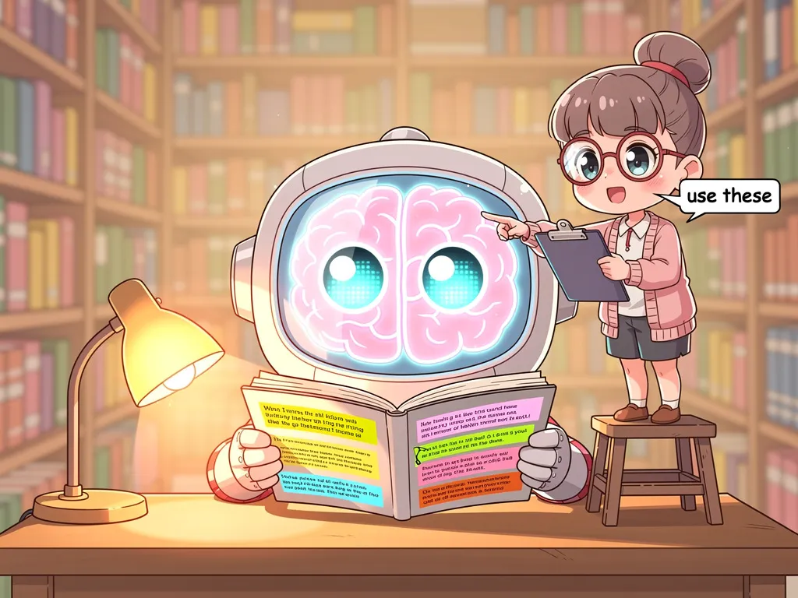
*LLM 是大脑。KNN 是图书管理员。两者都有工资。*

## KNN 做的那些你可能不知道的事

既然我们在聊 KNN 藏在哪里，还有两个被低估的用途。

Imputation。scikit-learn 里的 KNNImputer 会通过平均 K 个 nearest neighbors 的值来填补缺失值。它常常胜过简单的 mean imputation，尤其是在缺失与特征值相关时。我曾在客户数据上用过它，那些数据有整列都残缺不齐。效果比我预期更好。

Anomaly detection。Local Outlier Factor (LOF) 这类算法，会比较某个点周围的 local density 与它 K 个 nearest neighbors 的 local densities。密度显著低于邻居的点会被标记。它大量用于 fraud detection、network intrusion detection，以及制造线上的 quality control。

这里的模式是：KNN 是一个 primitive。像 sort、hash 或 for-loop。一旦看见它，你就会开始在其他算法内部注意到它。

## 什么时候不要用 KNN

我要诚实一点，因为太多教程在崇拜这个算法。

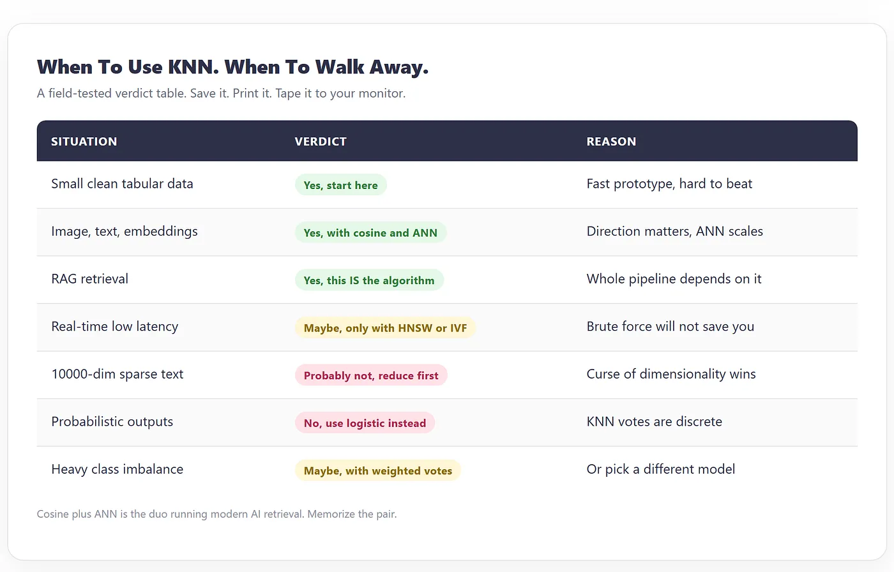

当你的 dataset 很大，而 latency budget 很紧时，跳过 KNN。Brute force 会崩，trees 在高维里帮助有限，你会需要 FAISS 或 hnswlib 这样的 ANN library。到那时，你跑的就不是 KNN 了。你跑的是上面叠了工程的 approximate KNN。

当你的数据超高维，而且你不能降维时，跳过它。维度灾难会赢。

当你有大量无关特征时，跳过它。KNN 平等对待每个特征。十个有用特征加一个胡说八道的特征，意味着每次距离计算里都有 10% 的噪声。Random forests 不在乎。KNN 很在乎。

当你的 dataset 严重不平衡时，跳过它。KNN 会向多数类靠拢。使用 weighted KNN、oversample、undersample，或者换一个模型。

当你需要校准过的 probability estimates 时，跳过它。KNN 给你的是投票比例，而不是真正的概率。它们是离散且嘈杂的。你想要的是 logistic regression，或者一个经过校准的 tree-based model。

当你想快速 prototyping，并且想要一个不用多想也很难击败的 baseline 时，使用 KNN。把它用于 embedding-based search、recommender systems、anomaly detection、image retrieval、semantic search 和 RAG。当 interpretability 重要，并且你可以指着真正驱动某个预测的 actual neighbors 时，使用它。


*有时正确决定是“换个算法”。模型也有感受。*

## 我不断重新学到的教训

一份简短的现场日志，因为我觉得你读完能省下一个周末。

永远缩放你的特征。我至少犯过十一次这个错。有一次花掉了我一个星期天。邻居家的风铃在那整个星期天里听起来像一个小小的手铃合唱团。我没有忘记。

用 cross-validation 选择 K。平方根规则是给餐巾纸用的，不是给 model card 用的。调参。

对 embeddings 使用 cosine。对干净的数值特征使用 Euclidean。别弄混。这是一行差异，却可能让你的准确率翻倍或减半。

KNN 的 predict step 是你的瓶颈，不是 fit step。Profile 它。

当规模达到数百万个点时，从 sklearn 的 KNN 切到 FAISS 或 hnswlib。代码复杂度下降不大。延迟下降巨大。

Distance metrics 不是唯一旋钮。你喂给模型的特征比 metric 更重要。坏特征是你距离函数里的永久泄漏。Standard scaler 修不好坏特征。

KNN 作为 baseline 很惊人。如果你的花哨模型不能以值得增加复杂度的幅度击败 KNN，那就发布 KNN。我用这种方式杀掉过两个 neural network projects。没人注意到。奖金准时到了。

永远查看真正的 nearest neighbors。不只是 predicted label。为一些 test queries 拉出 K 个 nearest training points，然后读它们。KNN-based systems 里一半 bug，会在你看邻居的瞬间显形。另一半会在你看特征的瞬间显形。

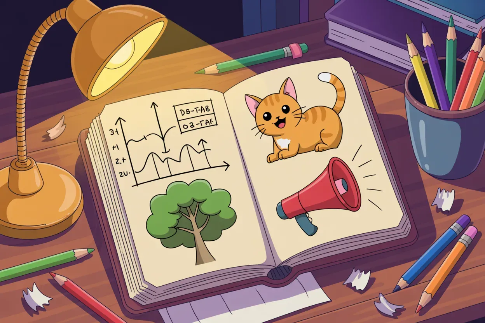
*一份没人要求的现场日志。欢迎来到这里。*

## 为什么 KNN 在 2026 年仍然重要

关于现代 AI，有一个实践真相。

你使用的最大、最响亮的 AI 产品，是把 LLMs 包在 retrieval pipelines 外面。那些 retrieval pipelines 是 KNN-shaped。Vector databases 是一个数十亿美元行业，围绕着把 “find K nearest” 在行星级规模上做快而建立。每个向你售卖花哨 AI 产品的人，在他们的技术栈某处，都有一个略微升级版的算法。Evelyn Fix 和 Joseph Hodges 在 1951 年一份题为 “Discriminatory Analysis” 的美国空军技术报告里勾勒出了它。根据你如何解读，这要么是个笑点，要么是一个恰如其分的谦逊起源故事。

为什么会这样？

因为应用层的智能大多是 retrieval 和 ranking。看起来聪明的模型，通常是在检索相关事物，并按匹配程度给它们排序。KNN 是“给我相关东西”最简单、最直接的表达。其他一切都是管道、扩展和品牌。

如果你一生只学一个经典机器学习算法，就学这个。当你理解了 embeddings 上的 KNN，你就理解了 RAG。当你理解了 RAG，你就理解了大多数现代 AI 产品实际如何工作。当你理解了大多数现代 AI 产品实际如何工作，这个领域就不再像魔法，而开始像可以搭建的东西。这是一扇单向门。你无法再看不见它。

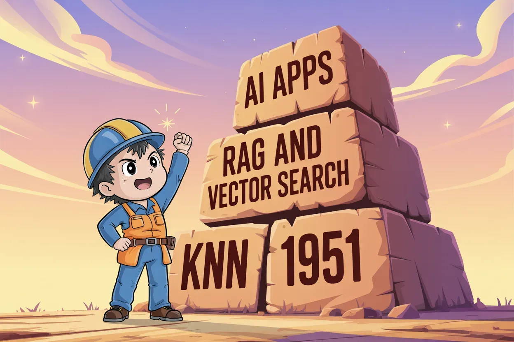
*每个花哨 AI 工具都坐在这座金字塔上。底层方块是在彩色电视出现前刻出来的。*

## 人们总是问我的几个问题

KNN 是 supervised 还是 unsupervised？Supervised。你需要 labels。有个 unsupervised 表亲叫 k-means，它是 clustering algorithm，完全是另一种东西。K 这个字母只是巧合。

KNN 能做 regression 吗？能。scikit-learn 里的 KNeighborsRegressor 会预测 K 个 nearest training values 的均值，而不是对类别投票。

KNN 里的 K 和 k-means 里的 K 有什么区别？KNN 的 K 是 neighbors 的数量。K-means 的 K 是 clusters 的数量。同一个字母，不同算法，不同 mental model。命名很难。Computer science 里满是糟糕名字。

我能用 KNN 做 time series 吗？算是可以。你可以把它用在 lagged features 上，但它会忽略 temporal order。当时间很重要时，用尊重时间的模型。

KNN 需要 GPU 吗？几乎从不。对大多数 workloads 来说，KNN 是 CPU-bound。FAISS 有面向巨大 indices 的 GPU mode。正常 datasets 下，笔记本跑 KNN 很好。

为什么 scikit-learn 的 KNN 这么好？因为这个算法真的就这么简单。复杂性在选择里，不在数学里。Scikit-learn 是那个已经帮你写好无聊部分的朋友。

Cover-Hart bound 真的吗？真的。这是一个经典的 1967 年结果。当你的 dataset 趋近无穷大时，1-NN 的 asymptotic error rate 至多是 Bayes error rate（这个问题理论上可能达到的最优错误率）的两倍。翻译一下：在极限情况下，KNN 震惊地接近最优。只要数据足够多，你这辈子能构建的最聪明模型，最多也就比 KNN 好两倍。

## 临别一击

KNN 活过了七十年、四个 AI winters、三轮 hype cycles，以及全球对 deep learning 的痴迷。它活下来，是因为它有效、可理解、模块化，而且数学诚实。没有隐藏状态。没有黑箱。你可以在三分钟内向祖母解释 KNN。你可以在两分钟内向 CTO 解释它。


*发布文章。去摸草。打开你最喜欢的应用，看一个 1951 年的算法为你决定今晚。*
