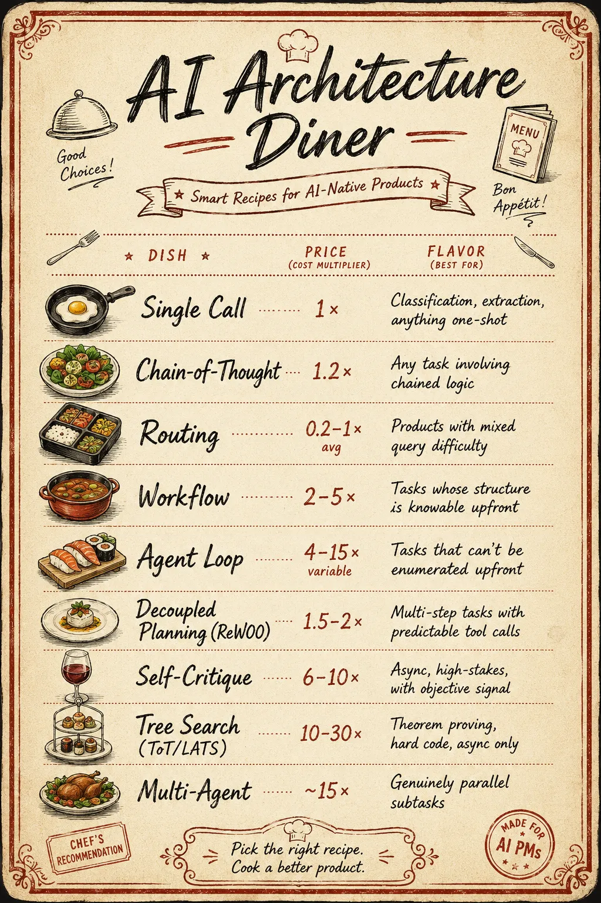
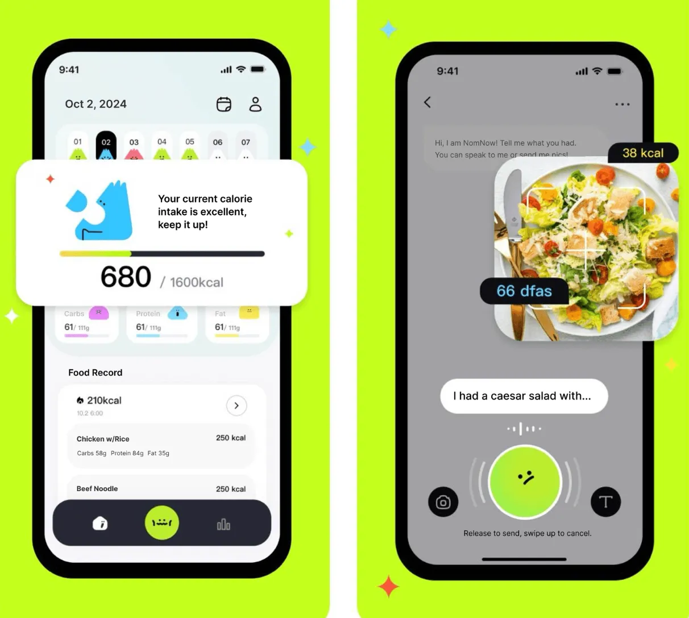
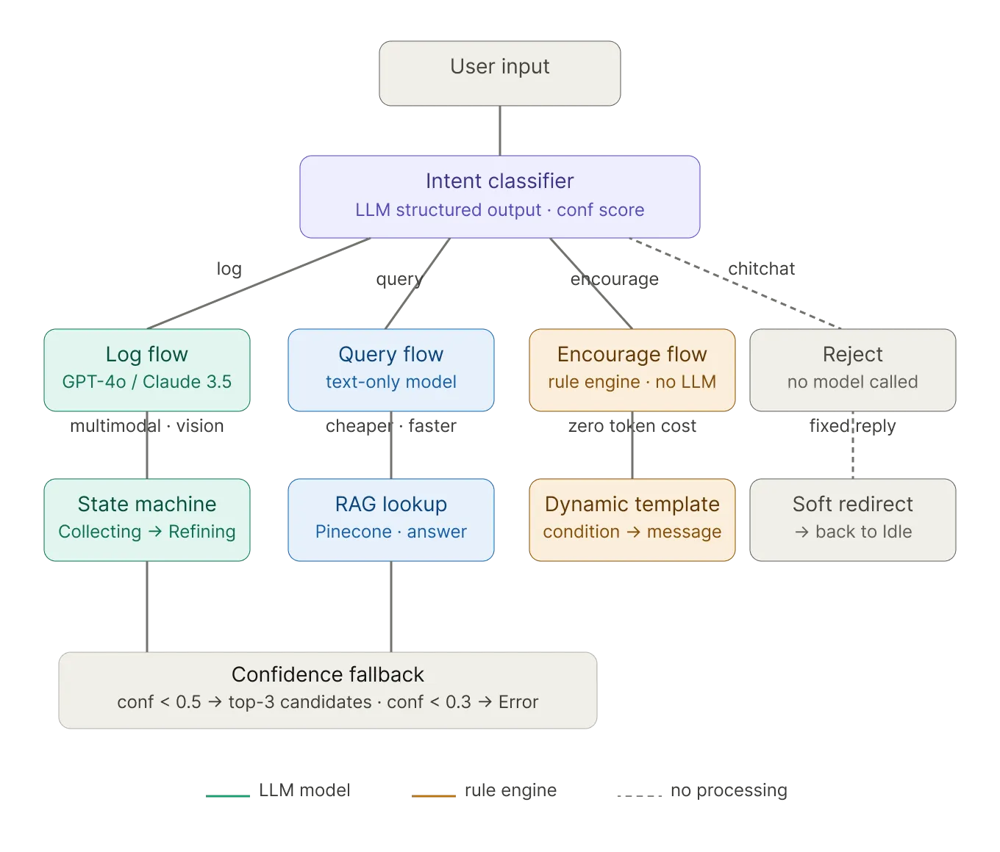
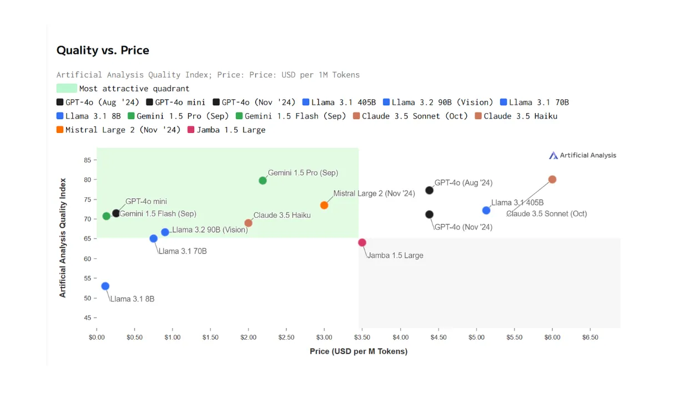
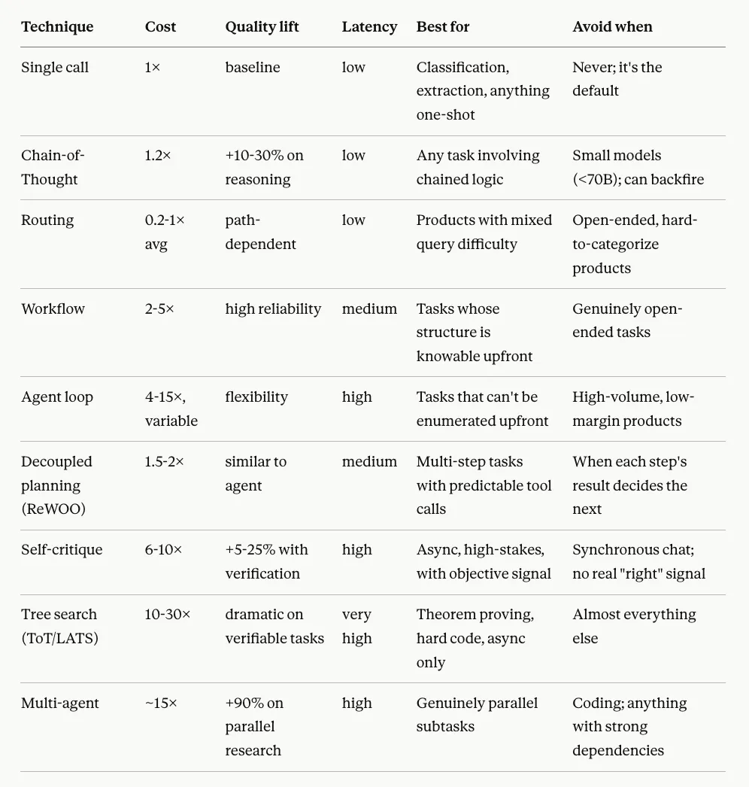
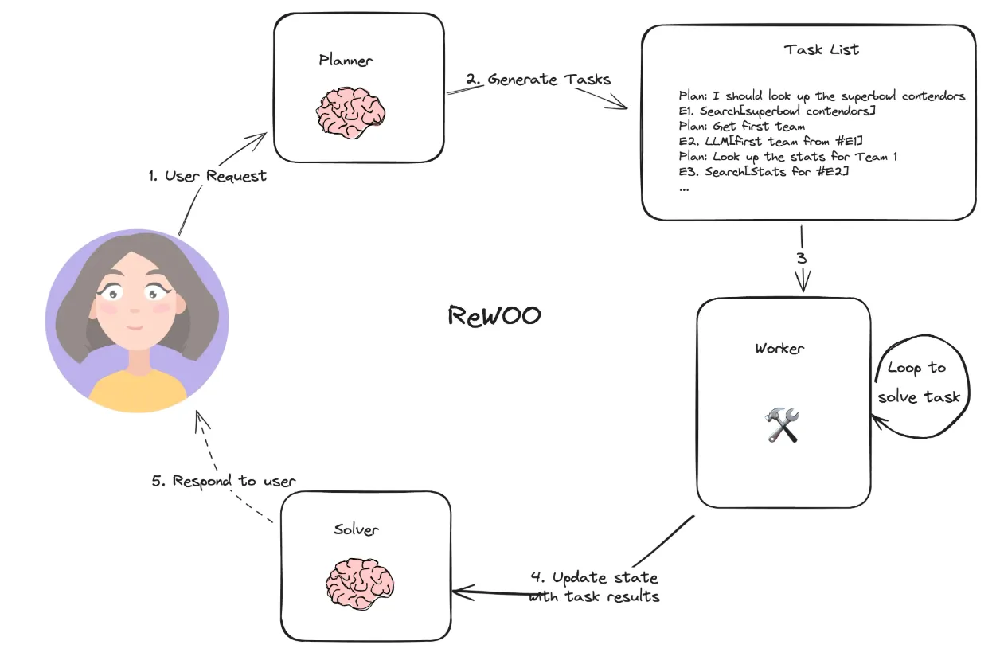
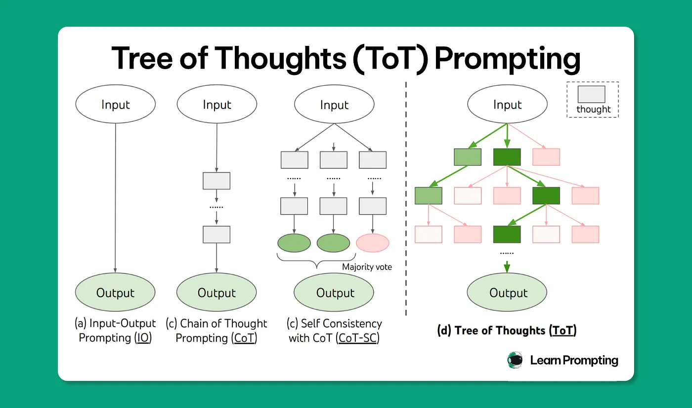

# AI PM 的菜单：成本-质量权衡实战手册

*一份给 AI PM 用的菜单，用来更慎重地构建 AI 原生产品 :)*

我经营一家创业公司。打造 NomNow——一款已经上线 App Store 的多模态 AI 营养师——教会了我很多事，但如果只能挑一条让年轻版的自己读到，我会挑这条：**对一家基于 LLM 的创业公司来说，成本纪律不是优化，是生死。**

在传统 SaaS 里，每用户的边际成本接近于零。你可以马虎很长一段时间，问题都不会浮上来。换成 LLM，边际成本就是你设计架构那一刻定下的——而且不小。一个把每条消息都转发给最强前沿模型的消费级 AI 应用，每个活跃用户每天可能花掉 0.5 到 2 美元。一旦上到任何像样的规模，这就是你整盘生意的全部。

所以在我开始设计 NomNow 时，还没写下一行 agent 代码，我就先定下了一件事：**这个 routing graph 长什么样？**

诱惑当然是把一切都丢给 GPT-4o。多模态记录在它上面表现极佳——午夜一张炸酱面的照片、一段含糊不清的语音备忘、一句"我吃的还是昨天那个"。但把简单的也一股脑送过去——"我达成目标了！"那种鼓励语、"豆腐里有多少蛋白质？"那种问答、跑题的闲聊——意味着你在用前沿模型的价格，去解决一个规则引擎就能搞定的问题。

*左：鼓励语走规则引擎。右：多模态记录走 GPT-4o（当时的 SOTA）。*

所以我做了 routing。多模态记录走 GPT-4o（当时的 SOTA）；纯文本的营养问答走一个更便宜的模型加 retrieval；鼓励语走规则引擎——零 token；跑题的话题走"软拒绝"，也是零 token。同样的用户体验。平均成本大约低一个数量级。

那个决定——以及它之后的几十个类似决定——就是这篇文章的主题。**对 AI 产品而言，成本不是 PMF 之后才回头来修的东西。它是产品的一部分，必须从第一天起就被设计进去。**

## 为什么这是一个产品决策，而不是工程决策

两个理由。

第一，不同实现之间的成本差距巨大。同一个功能，两种做法的 token 成本可能差 30 倍、50 倍。这不叫"优化"——这叫"做得起还是做不起"。事后再怎么折腾，都填不上这道沟。

第二，每一个成本旋钮，同时也是一个产品旋钮。带自我批评的重试？用户能感受到的延迟会上涨。路由到一个更小的模型？语气和准确率会变。把开放 agent 换成固定 workflow？产品*能做什么*跟着变。这些不是后端决策，这些是穿着工程外衣的产品决策。

所以谁拥有产品 UX，谁就同时得拥有"成本形态"。默认"哪里都用最好的模型"是一种决策；默认"工程那边会想办法"也是一种决策。以我的经验来看，两种通常都错。

下面这张图——这个领域大家都熟，最早由 Artificial Analysis 整理、被 [Zilliz 介绍 RouteLLM 的文章](https://medium.com/@zilliz_learn/routellm-an-open-source-framework-for-navigating-cost-quality-trade-offs-in-llm-deployment-7c4ee2158835) 转引——一帧画面就把局势讲清楚了。没有所谓"最好"的模型。有的是一条前沿曲线，你的工作是想清楚：你产品的每一块功能，应该落在那条曲线的哪个点上。

*图：不同 LLM 之间的成本-质量对比。来源。*

## 菜单

下面是我自己挑选这些技术时真实的思考方式。八种技术，每一种都附上它要花多少、它擅长解什么、以及哪里要小心。

***TLDR 对比表。值得存下来。***

*TLDR 对比表。值得存下来。*

技术 成本 质量提升 延迟 最适合 不要用在 Single call 1× 基线 低 分类、抽取、任何一次完成的任务 永远别避开；这是默认 Chain-of-Thought 1.2× 推理类 +10–30% 低 涉及链式推理的任何任务 小模型（<70B）；可能反而变差 Routing 0.2–1× 平均 路径相关 低 难度参差不齐的产品 开放、难分类的产品 Workflow 2–5× 高可靠 中 结构能事先想清楚的任务 真正开放式的任务 Agent loop 4–15×，浮动大 灵活 高 没法事先穷举的任务 高流量、低毛利的产品 Decoupled planning (ReWOO) 1.5–2× 接近 agent 中 工具调用次序可预测的多步任务 每一步结果决定下一步走向时 Self-critique 6–10× 在有验证信号时 +5–25% 高 异步、高利害、有客观信号的场景 同步聊天；没有真正的"对错"信号时 Tree search (ToT/LATS) 10–30× 可验证任务上极大 极高 定理证明、难解的代码题、仅限异步 几乎其他所有场景 Multi-agent ~15× 并行 research 任务 +90% 高 真正可并行的独立子任务 写代码；任何依赖关系很强的事

## Single call

默认。一个 prompt，一个回答。如果任务能用一句话讲清、答案能装进一段，就别给它穿戏服。"那就把它做成 agent 吧" 这种本能，是很多产品开始变糟的起点。

## Chain-of-Thought

让模型在给出答案之前先一步一步想。要多花 20% 的 token，换来推理类任务 10–30% 的准确率提升。**菜单上唯一的免费午餐。** 只要你的任务有任何链式逻辑，这一项就该打开。注意：在小模型（<70B）上，它可能反而把事情搞砸——模型会生成读起来很流畅、但根本对不上底层逻辑的"推理"。先做测试，再决定信不信它。

## Routing

先对请求做分类，然后让它走能处理它的最便宜路径。这是我在 NomNow 用得最重的一招。学术上的直觉也站得住脚：UC Berkeley 2024 年的 RouteLLM 论文显示，即便是一个简单的二元路由器，也能用低 2.5 倍的成本保住强弱模型之间 80% 的质量差距；或者用低 3.6 倍的成本保住 50% 的差距。如果你把每一个查询都打给你最好的模型，你就是在为大多数查询用不到的能力支付溢价。

routing 有三个值得跟踪的指标，全部来自那篇论文：**走最贵路径的请求占比**（应该很小，并且你要清楚为什么是这个数）、**performance gap recovered**（你的路由器恢复了多少质量差距——完美是 1.0，随机是 0.5 左右）、**call-performance threshold**（给定一个质量目标，至少需要多少比例的昂贵调用？）。这些指标能告诉你，你的 routing 是真的在干活，还是只是在加复杂度。

**routing 最大的限制：好坏取决于你定的桶。** 用户不会按你的桶说话。他们会写"我吃了两个苹果，那一共多少糖？"（记录 + 查询同时来）。他们会写"今天很糟"（闲聊？记录？情绪？）。他们会发菜谱请求、天气问题，偶尔来一次 prompt injection。一个生产级别的 routing 系统需要四类兜底：一个**置信度阈值**，低于它系统就要求用户澄清，而不是硬猜；**多意图处理**，对跨桶的查询走一个小 workflow；一条**超出范围路径**，礼貌地告诉用户哪些事它帮不了；以及一条**安全覆盖**通道，处理 prompt injection 和敏感话题。没有这四样，routing 是 demo，不是产品。再往深一层：**routing 是当你的产品边界清晰时正确的模式。** 对 NomNow 来说，"帮用户记录和理解他们的食物"是一个有界问题。对一个开放式的助手来说，routing 会崩——桶越分越多，分类器越来越糟，这时候你大概应该去用 agent。

## Workflow

你定义步骤，模型在每一步里把活做完。整条流程能画在白板上。比 agent 更便宜、更可靠、更容易调。**Anthropic 公开的建议——我也同意——是：如果一件事能用 workflow 解决，就该用 workflow 解决。** 大多数本该是 workflow 的产品，正在被做成 agent，只因为 agent 听起来更酷。这些 agent 的表现往往更差。

## Agent loop

模型在每一步自己决定下一步要做什么。事先没法在白板上画清流程。在任务真的开放式时威力很大，在任务并不开放式时既贵又难以预测。成本方差才是真正的杀手：同一个查询，周二可能比周一贵 5 倍，因为模型决定"多试几次"。对一家创业公司来说，这种方差是产品问题，不只是财务问题。

## Decoupled planning（ReWOO 这一类）

agent 的一种变体：先一次性把整套工具调用的次序规划好，然后（通常并行地）把工具都执行了，最后再合成结果。比标准的 agent loop 便宜约 5 倍——*前提是计划是可预测的*。在结构化的 research 任务上（"对比这三家公司过去四个季度的财报"）跑得很好；在每一步结果决定下一步走向时就崩。

*图：ReWOO 怎么跑。来源*

## Self-critique 和重试

模型先生成 → 另一个调用做批评 → 再一次调用做修订。如此重复。成本 6–10 倍，准确率提升 5–25%——**但只在你有一个"对错"的客观信号时才成立**（测试通过、规则引擎校验、引用核对得上）。没有这个信号，"批评者"只是另一个在瞎猜的模型，迭代下去甚至可能比第一稿更糟。另外，延迟也是 6–10 倍。别把它塞进同步聊天的 UX 里。

## Tree search（Tree of Thoughts、LATS）

每一步生成多个候选，给它们打分，搜索一棵树。在窄而可验证的任务上（数学、有测试的代码）效果惊人。成本是 10–30 倍。我没有在消费级产品里上线过这一招，并且我对任何说自己上线过的人都持怀疑态度。它属于异步、高价值、强可验证的任务。

*图：Tree of Thoughts（ToT），来源*

## Multi-agent

由一个 orchestrator 协调多个专门化的模型。Anthropic 公开过的数据：成本 15 倍，研究类任务 +90% 的质量。它的正确使用场景很窄：**真正可并行、互不依赖的子任务。** Cognition（Devin 团队）2025 年发过一篇《Don't Build Multi-Agents》，在写代码这件事上是反过来的——他们在写代码这件事上是对的，Anthropic 在 research 这件事上也是对的。在伸手去拿这个工具之前先问自己：*这些子任务，真的能在不共享上下文的前提下并行做完吗？* 能就也许；如果它们必须不停回头互相对账，你会得到一个比"一个设计良好的单 agent"更贵也更不可靠的东西。

## 我每周真正在想的事

知道菜单是必要的，但不够。更难的部分是培养"从菜单里挑"的判断力。我自己一次又一次回到几条原则上——这些原则在 NomNow 一连串决策里始终站得住脚。

**第一条：workflow 几乎总是正确的起点。** 不是因为 agent 没用——它们有用，NomNow 自己也有 agent 组件——而是因为"该用 agent 时用错"的代价，比"该用 workflow 时用错"的代价高得多。一个最后发现需要 agent 灵活性的 workflow，可以扩展上去；一个最后发现是过度设计的 agent 却很难往回走，因为等你意识到的时候，你已经发布了一个单位经济模型不成立、失败模式自己也搞不清楚的东西。Anthropic 给过一个粗略的判据——0.10 美元/任务的预算大约能买 30–50K token，够用一个 workflow，但对一个 agent 来说很紧——这是个不错的直觉检查。如果你的产品一年要跑一百万个任务，而你把它设计成 agent 而 workflow 本来就够用，那你可能在白白烧七位数。

**第二条：通常有一些"免费的"质量提升你还没用。** Chain-of-Thought 是最明显的一个——多花 20% 的 token，换推理类两位数的准确率提升，这种买卖每次都该接。但还有别的。tool description 是被严重低估的一项：Anthropic 的团队公布过数据，光是重写 tool description——同一个模型、同一份代码、同一个成本——就能把任务成功率提升 5–20%。prompt 里的 few-shot 例子是另一项。一个普遍规律是：**prompt 层面带来的质量提升，几乎总是比架构层面带来的质量提升更便宜，而且是 PM 可以直接贡献的东西。** 在你伸手去拿 self-critique 或者 multi-agent 之前，先确认你真的把 prompt 优化过了。

**第三条：真正重要的是生产环境里的表现，不是 benchmark 上的表现。** 一个在 benchmark 上能加 25% 准确率的技术，在生产里可能加 0%——只要你的查询和 benchmark 的查询长得不一样。我自己培养直觉的办法是去读真实的用户 trace——每周从生产里拉 20 条真实会话，读 agent 真的做了什么、在哪里栽跟头、又在哪里"用错误的理由蒙对了"。这件事一点都不光鲜，大多数也不会出现在 dashboard 上。但它是我做的事情里杠杆最高的一件。

**第四条，我现在把它当作一种叫做"缓存纪律"的东西。** 这件事更像工程问题，但它有值得 PM 理解的产品含义。现代 LLM 服务系统会在 prompt 前缀相同的调用之间复用计算——也就是 KV-cache。命中率高，延迟和成本都会大幅下降；命中率低，两者都会大幅上升。Manus 团队公开过一份非常出色的复盘文章，他们的观点是：KV-cache 命中率是 AI agent 最重要的单一生产指标。对 PM 来说的现实含义是：不停改 prompt、动态修改 tool 定义、每一轮重新组织 agent 的上下文——这些在产品层看起来都无害的动作，可能正在悄悄毁掉你的单位经济模型，因为它们把 cache 砸碎了。解决办法是：保持 prompt 前缀稳定，扩展 context 时用 append 而不是 rewrite，把"改 prompt 结构"当成一件真有代价的事。

**第五条：要监控的是你的 routing，而不只是你的模型。** 跟踪"模型的输出有多好"是容易的；跟踪"你有多高效地在用这个模型"更难，但更重要。RouteLLM 论文里那三个指标——昂贵路径的请求占比、performance gap recovered、call-performance threshold——是一个不错的起点。但底层的道理比 routing 更宽：**你做的每一个架构决策，都在某处增加了成本；问题是这些成本是不是真的换回了什么。** 如果你说不清自己的重试循环或者 multi-agent 在质量上具体回收了什么，那你就是在为一套并不真正干活的架构付钱。用你审视一个外部供应商营销话术时同样的怀疑，来审视你自己的架构。

**第六条，也是我最想多花一点篇幅讲的：加架构很少能补救模型层面的问题。**

这是 PM（包括我自己）学得最慢的一课。当模型的输出不够好时，本能反应是在它周围加结构。把它包进一个重试循环。加一个 critic。搭一个 multi-agent。用 tree search。每一个都是有合法使用场景的正经技术——但没有一个能替代"模型本身能不能干这活"。

我的发现是：当底层模型能干这活时，哪怕架构很简单，也能产出可靠结果；当底层模型干不了这活时，加架构只是产出一个失败方式更隐蔽的复杂系统——而隐蔽地失败比明显地失败更糟，因为它在 QA 里抓不到，会一路漏到生产。一个比你需要的稍微差一点点的模型，被裹进 self-critique 循环，会产出看起来很周到、其实自信地错的输出。一个真正能干这活的模型，配一个好 prompt 单次调用，输出就是单纯的对的。

所以我最后定下的次序是：先挑能完成这件事的最便宜技术，在真实数据上测试，只在你有证据说明"复杂度正在解决一个真问题"时才加复杂度。**复杂度应该跟着失败走，而不是抢在失败前面。**

这是一种比"我们先把 agent 架构定下来"慢得多、也无聊得多的做法。它产出的产品，会真的跑得动、真的赚钱。

## 这把我带到哪里——以及接下来要写什么

前沿模型每个季度都更强、更便宜。AI 产品之间的差异，将不会再来自"你用的是哪个模型"——明年所有人都能以相近的价格用上一样的模型。差异会来自模型之上的那一层：你 routing 做得多用心、你的工具设计得多好、你的 prompt 结构有多干净、你对"只在挣到了的时候才加复杂度"有多自律。

那一层就是 AI PM 真正花时间的地方。它同时也是大部分成本决策实际发生的地方——不管有没有人意识到。对一家创业公司而言，那些决策决定你的现金跑道，和你的招聘计划一样直接。

**但有一个明显的问题我还没回答：你怎么知道一个技术是不是真的在起作用？**

这篇文章里每一条建议——"Chain-of-Thought 加 10–30%"、"routing 恢复 80% 的质量差距"、"有验证信号时 self-critique 给 5–25%"——都假设你能在自己产品上度量出这些数字。在实际工作里，大多数团队做不到。他们改一个 prompt，然后凭"感觉对不对"上线。他们换一个模型，盯着客服工单看。他们加一个重试循环，因为"感觉更稳"。

那就是我接下来想写的主题。**和"成本是一种产品决策"配套的，是"evals 也是一种产品决策"。** 没有一套评估系统，上面这份菜单只是一组词汇——你说不清哪一项技术在帮你、哪一项在烧钱，也说不清一次"看上去不错"的模型升级是不是悄悄把 5% 用户的体验弄坏了。评估系统才是把这份菜单从理论变成"一件你能真正在上面导航的事情"的那一步。

那是下一篇。如果这一篇引起了共鸣，下一篇会让它变得可操作。

*参考资料：*

-   *Zilliz，《RouteLLM》（Medium，2024 年 12 月）——成本-质量对比图，PGR/CPT 指标。论文：Ong et al., arXiv:2406.18665。*
-   *Anthropic，《Building Effective Agents》（2024 年 12 月）。*
-   *Anthropic，《How We Built Our Multi-Agent Research System》（2025 年 6 月）。*
-   *Cognition，《Don't Build Multi-Agents》（2025 年 6 月）。*
-   *Manus，《Context Engineering for AI Agents》（2025 年 7 月）。*

本文发布于 [Generative AI](https://generativeai.pub/)。在 [LinkedIn](https://www.linkedin.com/company/generative-ai-publication) 上联系我们，并关注 [Zeniteq](https://www.zeniteq.com/) 以获取最新 AI 故事。

订阅我们的 [newsletter](https://www.generativeaipub.com/) 和 [YouTube](https://www.youtube.com/@generativeaipub) 频道，及时获取生成式 AI 的最新新闻与更新。让我们一起塑造 AI 的未来！

