# 用 250 行 Python 造一个本地的浏览网页 LLM agent

## *把 Camofox-browser、MCP 与 Ollama 串到一起——加上服务端的结构化抽取，以及"搜索 + 浏览"的组合。*

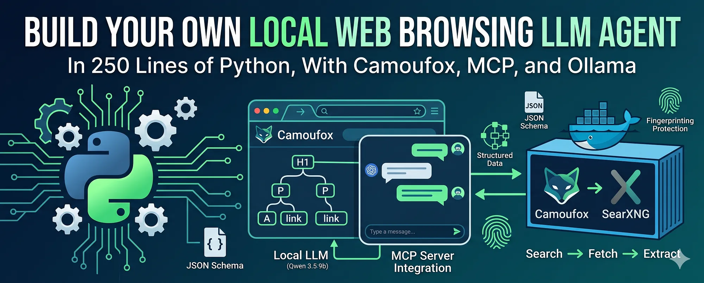

这篇文章里，我会演示如何给本地的 LLM agent 装上一个真正的网页浏览器。读完之后，agent 就能拿到一个问题、上网搜一篇相关页面、在隐身浏览器里打开它、读它的内容，并基于它真正看到的东西作答。

这是一个系列的第 4 部分。在[第 3 部分里我用本地 SearXNG 实例包了一层 MCP 服务器，给 agent 加上了网页搜索](https://medium.com/generative-ai/build-your-own-local-web-search-agent-in-220-lines-of-python-a4eac8bdf5ec)。这相当于给 LLM agent 装上了能看到网页的眼睛，但只到搜索摘要这一层：一个标题、一个 URL、一两句话。摘要常常不够用。如果你问 "google.com 用的是哪些 nameserver"，摘要里不会告诉你。必须把页面打开。

所以自然的下一步，就是让 agent 去抓取并阅读真正的页面。浏览这块要用的工具是 [camofox-browser](https://github.com/jo-inc/camofox-browser)，一个搭在 [Camoufox](https://github.com/daijro/camoufox) 之上的隐身浏览器服务器，Camoufox 是一个在 C++ 层面做指纹欺骗的 Firefox 分支。它跑在 Docker 里，暴露一个小巧的 REST API，把页面以可访问性树（accessibility tree）快照的形式返回，比原始 HTML 体积小约 90%。当你要把页面喂给一个上下文窗口有限的模型时，这点非常关键。

最后做出来的是一个自包含项目。在 Docker 里起两个服务，把浏览器包成 MCP 服务器，再把[第 3 部分的搜索服务器](https://medium.com/generative-ai/build-your-own-local-web-search-agent-in-220-lines-of-python-a4eac8bdf5ec)和新的浏览器服务器一起连到 agent。agent 自己就会把它们组合起来。MCP 在第 3 部分已经详细讲过了，所以这一部分协议层着墨较少，重心放在新能力上。

全程使用的是 `qwen3.5:9b` 模型。请确保你已装好 Ollama 并拉好这个模型，或者改一下配置指向另一个支持工具调用的模型。还需要 Docker，因为 camofox-browser 和 SearXNG 都跑在容器里。

下面会经过五个阶段：

-   Stage 1：把 camofox-browser 和 SearXNG 跑在 Docker 里。
-   Stage 2：用 MCP 服务器和一个 `fetch` 工具把浏览器包起来。
-   Stage 3：把浏览器服务器接到 agent。
-   Stage 4：把搜索和浏览组合成一条流水线。
-   Stage 5：加一个结构化的 `extract` 工具。

那么我们开始。

## 安装

完整代码放在 GitHub 上：[local-LLM-agent-mcp-search-n-browse](https://github.com/jfjensen/local-LLM-agent-mcp-search-n-browse)。每个阶段单独有一个子目录，通过 `pyproject.toml` 暴露成命令行脚本，所以装一次就能按名字跑任意一个阶段。

先克隆仓库，并以可编辑模式安装：

```bash
git clone https://github.com/jfjensen/local-LLM-agent-mcp-search-n-browse.git
cd local-LLM-agent-mcp-search-n-browse
python -m venv .venv

source .venv/bin/activate

.\.venv\Scripts\Activate.ps1
pip install -e .
```

这一步会拉入 `mcp`、`ollama` 和 `httpx`，并注册一批命令行脚本：`mcp-browser-stage2` 到 `mcp-browser-stage5`、`mcp-agent-stage3` 到 `mcp-agent-stage5`、搜索服务器 `mcp-search-part3`，以及一个小工具 `mcp-config-show`。每个脚本都会从当前工作目录启动对应阶段。

Windows 上要注意一点。如果你在 Windows，并且看到 agent 启动 MCP 服务器时报 `FileNotFoundError: [WinError 2]`，说明你的虚拟环境没激活。agent 是按命令行脚本名作为子进程来启动 MCP 服务器的，只有虚拟环境激活时这些名字才在 `PATH` 上。所以先激活它。

## 配置

所有可调设置都集中在仓库根目录的 `config.toml` 里。所以你想换模型、把服务指到别的端口、改快照尺寸，只需要改这一个文件。看当前生效的配置：

```
mcp-config-show
```

```
Config source: /path/to/local-LLM-agent-mcp-search-n-browse/config.toml
  model:                   qwen3.5:9b
  model.temperature:       0.1
  model.thinking:          False
  searxng.url:             http://localhost:8090
  camofox.url:             http://localhost:9500
  browser.max_snapshot:    30000
  browser.settle_seconds:  1.5
  agent.history_dir:       history
  agent.max_tool_result:   30000
  logging.level:           DEBUG
```

有一个小加载器 `mcp_browser_config` 包，在 import 时一次性读取这份文件，把值暴露为普通常量。每个阶段都从它 import，而不是各自硬编码自己的模型名或 URL。加载器会优先在当前工作目录找 `config.toml`，找不到再回落到仓库自带的那一份。所以你想在新建文件夹里跑某个阶段并用自己的设置，只要把一个 `config.toml` 丢在旁边即可。

加载配置时还会一并配置好日志，这点值得说一下，因为你就是靠它来观察 agent 的思考过程。仓库里默认级别是 `DEBUG`，会在每一轮打印模型调用了哪个工具、传了哪些参数，以及返回内容的预览。日志设置只对我们自己的包生效。`httpcore`、`httpx` 这类第三方库会被锁在 `WARNING`，否则打开 `DEBUG` 会刷出一堆没用的 HTTP 传输噪声。这样你能看到 agent 的决策，又不会被噪声淹没。

安装铺垫完了，下面挨个走流程。

## Stage 1：把 camofox-browser 和 SearXNG 跑在 Docker 里

这个阶段没什么 Python 要写。我们只是把 agent 后面要对话的两个服务跑起来：camofox-browser 负责抓页面，SearXNG 负责搜索。两者都跑在 Docker 里，一条 `docker compose` 就能拉起来。

camofox-browser 的镜像稍微有点尴尬。这个项目没有把镜像发到 Docker Hub，它默认的 `Dockerfile` 期望你把 Camoufox 二进制提前下到一个 `dist/` 文件夹里，而仓库里并不带这个目录。好在有一份 `Dockerfile.ci`，会在构建时把需要的东西都下载下来。用这一份：

```bash
git clone https://github.com/jo-inc/camofox-browser
cd camofox-browser
docker build -f Dockerfile.ci -t camofox-browser:latest .
cd ..
```

首次构建要等一会儿，大约 5 到 10 分钟，因为 Camoufox 二进制大约 300 MB，会被烤进镜像。之后就走缓存了。

`stage1/` 下的 `docker-compose.yml` 会把两个服务都拉起来：

```yaml
services:
  camofox:
    image: camofox-browser:latest
    container_name: camofox
    ports:
      - "9500:9500"
    environment:
      - NODE_ENV=production
      - CAMOFOX_PORT=9500
    restart: unless-stopped
    healthcheck:
      test: ["CMD-SHELL", "curl -f http://localhost:9500/health || exit 1"]
      interval: 30s
      timeout: 10s
      start_period: 15s
      retries: 3  searxng:
    image: searxng/searxng:latest
    container_name: searxng-mcp
    ports:
      - "8090:8080"
    volumes:
      - ./searxng/settings.yml:/etc/searxng/settings.yml:ro
    environment:
      - SEARXNG_BASE_URL=http://localhost:8090/
    restart: unless-stopped
```

几点说明：

-   **camofox 服务**映射的是 9500 端口，也就是 REST API 端口。healthcheck 打 `/health`，这样 Docker 能告诉你浏览器是不是真的起来了，而不是只看到容器在跑。
-   **searxng 服务**把宿主机 8090 端口映射到容器的 8080。我本地用 8090 跑 SearXNG，配置文件也指向这里。要换端口的话，把这一处映射和 `config.toml` 里的 `searxng.url` 一起改掉。
-   **bind-mount** 把我们自己的 `settings.yml` 装进 SearXNG 容器。这是首次启动 JSON API 能用的原因。SearXNG 默认只返回 HTML，意味着像我们 MCP 服务器这样请求 JSON 的客户端会拿到 403。我们的 settings 文件开了 JSON 并关掉请求限流器，免去启动容器后再改自动生成的配置、再重启的来回折腾。

`searxng/settings.yml` 很短，因为我们继承了 SearXNG 默认值，只覆盖必要部分：

```yaml
use_default_settings: truegeneral:
  instance_name: "SearXNG (Part 4 local)"search:
  formats:
    - html
    - json
  safe_search: 0
  autocomplete: ""server:
  limiter: false
  secret_key: "change-me-for-anything-public-facing-this-is-only-local"
```

两行重要：`formats` 加上 `json`，让 API 能回我们的客户端；`limiter: false`，关掉按客户端的速率限制器。限流器存在的意义是挡那些猛打 API 的客户端——LLM 干的恰恰就是这件事。所以对我们这个用例必须关。

在 `stage1/` 目录下把两个服务都起起来：

```bash
cd stage1
docker compose up -d
docker compose logs -f
```

等待 camofox 打印出服务器已启动、浏览器已预热，以及 SearXNG 打印出自己的启动日志。然后退出日志视图即可。

我们可以在 Docker Desktop 看到 SearXNG 和 Camofox 都在运行：

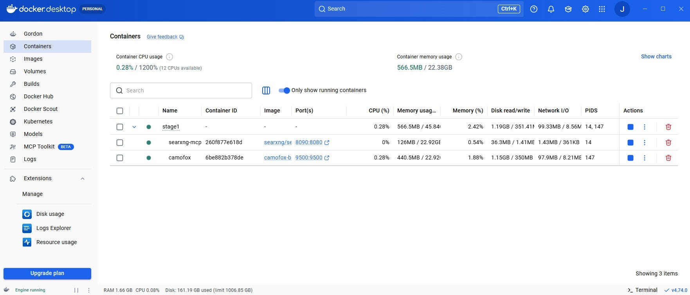
*图片来源：Windows 上 Docker Desktop 的截图，显示 SearXNG 和 Camofox 都在运行。*

确认两个服务都能应答：

```bash
curl "http://localhost:9500/health"
curl "http://localhost:8090/search?q=ollama&format=json"
```

第一条返回一个小的 JSON 健康对象。

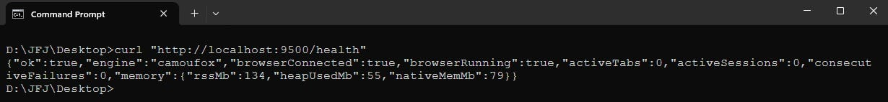
*图片来源：Windows 命令行下 JSON 健康对象的截图。*

第二条返回一个 JSON 搜索结果。

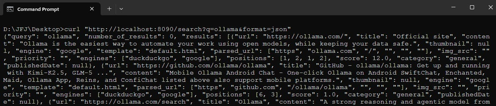
*图片来源：Windows 命令行下 SearXNG 的 JSON 响应前 10 行的截图。*

如果 SearXNG 返回的是 HTML 而不是 JSON，说明 settings 的 bind-mount 没生效，检查一下 `./searxng/settings.yml` 是否存在。

为了感受一下 camofox 返回的内容，本阶段附带了一个小探测脚本 `test_camofox.py`，它会在 `example.com` 打开一个标签页、抓取可访问性快照、打印出来。`example.com` 的快照看起来是这样：

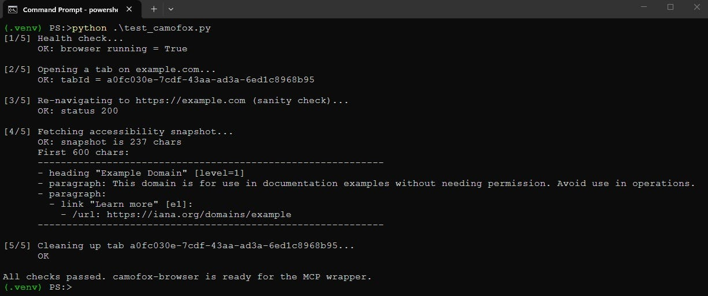
*图片来源：Windows 命令行下运行 test_camofox.py 的截图。*

整篇文章都建立在这种格式之上，所以值得花点时间理解它。它是一棵类 YAML 的可访问性树。标题带着自己的层级，段落带着文本，链接同时带着 label 和目标 URL。`[e1]` 是一个元素引用，camofox 给每个可交互元素分配的稳定句柄。本文不会用到这些 ref，但如果你以后扩展浏览器服务器去点击或输入，就用它们。对我们来说关键是这种表达很紧凑：`example.com` 整页在这里是 237 个字符，对应大约 1300 个字符的原始 HTML。

还有个 `test_camofox_multi.py`，会在一组真实站点上跑同样的探测。我跑的时候，它干净地抓到了 8 个站，其中包括一个 Cloudflare 防护的页面——这种页面对裸 HTTP 客户端来说通常会被拦下来。所以 camofox 的隐身部分确实在干活。

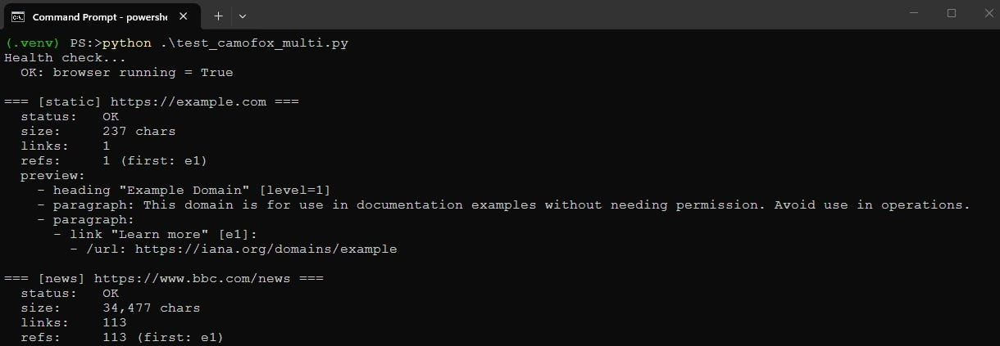
*图片来源：Windows 命令行下运行 test_camofox_multi.py 的前 20 行截图。*

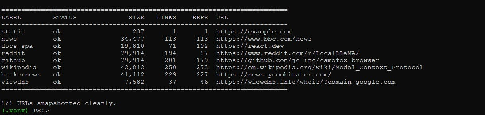
*图片来源：Windows 命令行下运行 test_camofox_multi.py 的最后几行截图。*

两个服务都跑起来了，下面就有东西可以包了。来写 MCP 服务器。

## Stage 2：用 MCP 服务器和一个 `fetch` 工具把浏览器包起来

agent 不直接跟 camofox 对话。它跟一个 MCP 服务器对话，由这个 MCP 服务器通过 REST 跟 camofox 对话。这跟第 3 部分的 SearXNG 服务器是同一种结构，所以 FastMCP 那一套你应该有熟悉感。新的内容都在工具体里，而不在协议里。

服务器只暴露一个工具 `fetch`，接收一个 URL，在 camofox 里打开一个标签页，给页面拍快照，关掉标签页，再返回快照。下面是跟 camofox 通信的几个辅助函数：

```python
import uuid
import time
import logging
import httpx
from mcp.server.fastmcp import FastMCPfrom mcp_browser_config import CAMOFOX_URL, MAX_SNAPSHOT_CHARS, SETTLE_SECONDSlog = logging.getLogger(__name__)mcp = FastMCP("browser-server")def _open_tab(client: httpx.Client, user_id: str, url: str) -> str:
    """Open a new tab on the camofox server. Returns the tabId."""
    r = client.post(
        f"{CAMOFOX_URL}/tabs/open",
        json={"userId": user_id, "url": url},
        timeout=60.0,
    )
    r.raise_for_status()
    body = r.json()
    tab_id = body.get("tabId") or body.get("id")
    if not tab_id:
        raise RuntimeError(f"camofox returned no tabId: {body}")
    return tab_iddef _get_snapshot(client: httpx.Client, user_id: str, tab_id: str) -> str:
    """Fetch the accessibility snapshot for a tab."""
    r = client.get(
        f"{CAMOFOX_URL}/tabs/{tab_id}/snapshot",
        params={"userId": user_id},
        timeout=30.0,
    )
    r.raise_for_status()
    ct = r.headers.get("content-type", "")
    if "application/json" in ct:
        data = r.json()
        return (
            data.get("snapshot")
            or data.get("aria")
            or data.get("text")
            or str(data)
        )
    return r.textdef _close_tab(client: httpx.Client, user_id: str, tab_id: str) -> None:
    """Best-effort tab close. Never raises."""
    try:
        client.delete(
            f"{CAMOFOX_URL}/tabs/{tab_id}",
            params={"userId": user_id},
            timeout=10.0,
        )
    except Exception:
        pass
```

上面这段代码的逐步说明：

-   **`_open_tab` 辅助函数** 向 camofox 的 `/tabs/open` 端点 POST 一个用户 ID 和要打开的 URL。camofox 有一个更简单的 `/tabs/open` 和一个需要 session key 的更复杂的 `/tabs` 端点，我们用简单的。它返回 tab ID，后续抓快照和清理都要用。60 秒的超时是有意放宽的，因为第一次打开标签页要启动浏览器，会慢。
-   **`_get_snapshot` 辅助函数** 抓取某个标签页的可访问性快照。camofox 不同版本可能把快照以纯文本返回，也可能包在 JSON 对象里，所以两种都处理：先试几个可能的 key，再回落到原始文本。
-   **`_close_tab` 辅助函数** 删除标签页。它是 best-effort 的、绝不抛异常，因为清理失败不应该让一个本来已经完成的 fetch 跟着失败。camofox 自己也会在几分钟空闲后自动关掉浏览器，所以漏掉一次清理也不致命。

太长的页面要在喂给模型之前先削短，所以还有一个截断辅助函数：

```python
def _truncate(snapshot: str) -> str:
    """If the snapshot is too long, keep the first and last halves of the
    budget and drop the middle ..."""
    if len(snapshot) <= MAX_SNAPSHOT_CHARS:
        return snapshot
    half = MAX_SNAPSHOT_CHARS // 2 - 100  
    head = snapshot[:half]
    tail = snapshot[-half:]
    marker = f"\n\n...[TRUNCATED {len(snapshot) - len(head) - len(tail)} chars]...\n\n"
    return head + marker + tail
```

预算是 `MAX_SNAPSHOT_CHARS`，默认 30000。当快照超预算时，保留预算的前一半和后一半，把中间丢掉，留一个标记让模型知道有东西被裁掉了。理由是：页面的中段通常是正文内容，而头部和尾部承载标题、导航和页脚，这些有助于模型判断它在看的是什么样的页面。这是个粗略的启发式，对我们来说够用了，它的局限我会在 Stage 5 回来谈。

工具本身：

```python
@mcp.tool()
def fetch(url: str, user_id: str = "") -> str:
    """
    Fetch a webpage and return its accessibility-tree snapshot.    Use this tool whenever you need to read the actual contents of a URL,
    for example after a web search returns a promising link, or when the
    user asks you to read or summarize a specific page.    The snapshot is an LLM-friendly representation of the page's structure
    (headings, paragraphs, links, buttons, forms) with element references
    like [e1], [e2] that can be used later for clicking and typing.    Args:
        url: The full URL to fetch (must include http:// or https://).
        user_id: Optional. If set to a stable string, the camofox server
            will reuse a browser context across calls (faster, but the
            caller is responsible for cleanup). If empty (default), each
            call uses a one-shot tab that is closed immediately after
            the snapshot is taken.    Returns:
        The page's accessibility snapshot. May be truncated to keep the
        context window manageable; truncation is marked inline.
    """
    if not url.startswith(("http://", "https://")):
        return f"Error: URL must start with http:// or https://; got {url!r}"    log.info("fetch %s", url)    one_shot = not user_id
    if one_shot:
        user_id = f"oneshot-{uuid.uuid4().hex[:8]}"    with httpx.Client() as client:
        try:
            tab_id = _open_tab(client, user_id, url)
        except httpx.HTTPError as e:
            log.warning("opening tab failed: %s", e)
            return f"Error opening tab on camofox: {e}"
        except Exception as e:
            log.warning("opening tab failed: %s", e)
            return f"Error opening tab: {e}"        time.sleep(SETTLE_SECONDS)        try:
            snapshot = _get_snapshot(client, user_id, tab_id)
        except httpx.HTTPError as e:
            _close_tab(client, user_id, tab_id)
            log.warning("snapshot fetch failed: %s", e)
            return f"Error fetching snapshot from camofox: {e}"        if one_shot:
            _close_tab(client, user_id, tab_id)    log.debug("snapshot is %d chars (before truncation)", len(snapshot))
    return _truncate(snapshot)def chat():
    """Entry-point for the console script."""
    mcp.run(transport="stdio")
```

上面这段代码里有几点值得注意：

-   **工具的 docstring 就是它对模型的接口。** MCP 服务器会把 docstring 当成工具描述交给 agent，agent 据此决定何时调用 `fetch`。所以 docstring 明确写出了什么时候该用它：搜索返回链接之后，或者用户指名某个页面时。
-   **有两种生命周期模式。** 默认情况下不传 `user_id`，每次 fetch 都会用一个随机 ID 创建一个一次性标签页，并在拍完快照后立刻关掉。这种方式简单、不留痕。若调用方传一个稳定的 `user_id`，camofox 会跨多次调用复用浏览器上下文，对反复抓取相关页面的场景更快，但清理责任就落到调用方身上。对 LLM agent 来说，一次性模式是合理的默认值。
-   **打开标签页与拍快照之间有一段稳定延迟** `SETTLE_SECONDS`，默认 1.5。重 JavaScript 的页面需要一会儿才能渲染好，快照才有意义。静态页用不到，但代价很小，安全感很值得。
-   **错误是以字符串返回，而不是抛出。** 工具失败时，agent 应该看到一段可读、可推理的消息，而不是让这一轮崩掉的 stack trace。所以每条失败路径都返回一段简短描述。

不用经过 agent 也能直接探测服务器，用仓库里自带的 `inspect_any.py` 脚本即可。它是一个对 npx 版 MCP Inspector 的小型替代——后者在 Windows 上我用着不太稳。列出服务器的工具列表：

```
python inspect_any.py mcp_browser_02.main
```

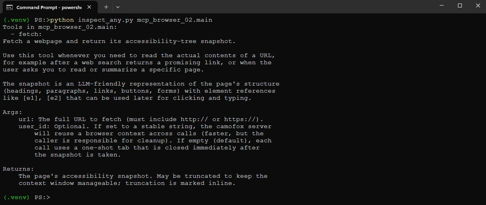
*图片来源：Windows 命令行下用 inspect_any.py 调 Camofox 浏览器 MCP 的截图。*

实际调用 `fetch`：

```
python inspect_any.py mcp_browser_02.main fetch --kv url=https://example.com
```

应该会打印出 Stage 1 里看到的同一份 `example.com` 快照，只不过这次是经过 MCP 一层返回的。所以服务器跑通了。下面把它接到 agent 上。

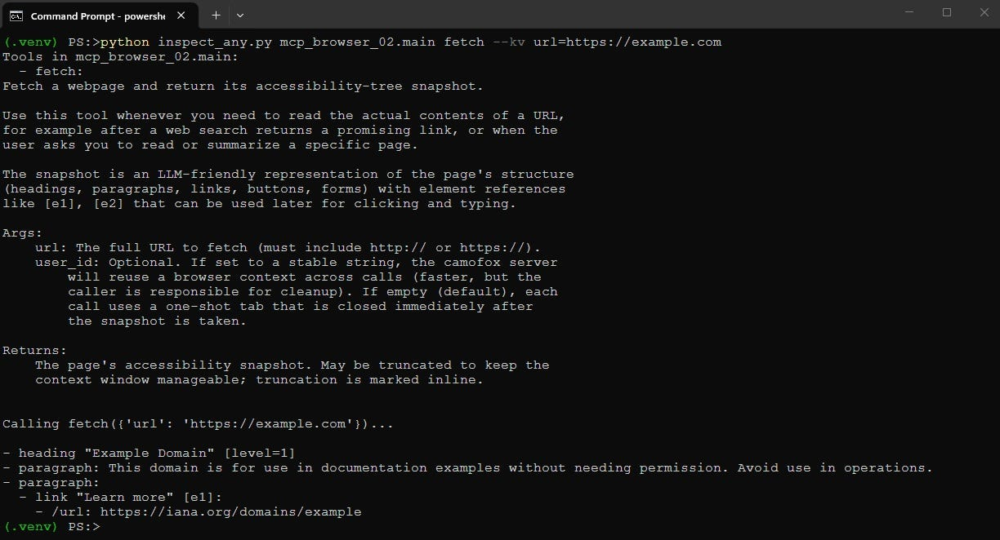
*图片来源：Windows 命令行下用 inspect_any.py 调 Camofox 浏览器 MCP 加上 URL 的截图。*

## Stage 3：把浏览器服务器接到 agent

这是第一个端到端阶段。我们拿来第 3 部分的多服务器 agent（连同它的可靠性微调），把它指向浏览器服务器。agent 就拿到了一个工具 `fetch`，你可以贴一个 URL 让它读这个页面。

agent 类沿用第 3 部分的实现，所以不全部重复。值得看的部分是系统 prompt（告诉模型何时使用工具），以及 `handle_tools` 方法（工具调用循环就住在这里）。

系统 prompt 简短直接：

```
SYSTEM_PROMPT = """You are an assistant with access to a web browser via an MCP server.You have one tool available:
- `browser-server_fetch`: given a URL, returns the accessibility-tree
  snapshot of the page. Use this to read or summarize specific URLs.You MUST use `fetch` whenever the user gives you a URL to read, asks you
to look at a specific page, or asks about the contents of a website you
have not yet fetched in this conversation. Do not answer from memory
when the user has pointed you at a URL.For purely timeless questions (math, definitions, syntax, well-established
historical facts), answer directly without using a tool.
"""
```

注意 prompt 里的工具名是 `browser-server_fetch`，不是单纯的 `fetch`。agent 连接 MCP 服务器时会取一个名字，这里是 `browser-server`，然后给每个工具加上这个前缀，避免来自不同服务器的工具撞名。这一点到 Stage 4 有两个服务器时更要紧，但从一开始就保持一致是值得的。

agent 的核心是 `handle_tools`。它执行模型要求的工具调用，把结果喂回去，再问模型下一步怎么办：

```
async def handle_tools(self, tool_calls) -> dict:
    for tool in tool_calls:
        prefixed_name = tool.function.name
        args = tool.function.arguments or {}        server_name = self._tool_to_server.get(prefixed_name)
        if not server_name:
            text = f"Unknown tool: {prefixed_name}"
        else:
            real_name = prefixed_name[len(server_name) + 1:]
            session = self.mcp_sessions[server_name]
            try:
                result = await session.call_tool(real_name, args)
                text = ""
                for block in result.content:
                    if hasattr(block, "text"):
                        text += block.text
            except Exception as e:
                text = f"Tool error on {server_name}: {e}"        if len(text) > MAX_TOOL_RESULT_CHARS:
            head = MAX_TOOL_RESULT_CHARS // 2 - 100
            text = text[:head] + "\n...[TRUNCATED]...\n" + text[-head:]
        log.debug("tool result (%d chars): %s",
                  len(text),
                  text[:300].replace("\n", " ") + ("..." if len(text) > 300 else ""))
        self.messages.append({"role": "tool", "content": text})    
    
    resp = ollama.chat(
        model=MODEL_NAME,
        messages=self.build_messages_for_model(),
        tools=self.ollama_tools,
        options={"temperature": MODEL_TEMPERATURE},
        think=MODEL_THINKING,
    )
    msg = resp["message"]    
    
    
    
    if hasattr(msg, "tool_calls") and msg.tool_calls:
        for tc in msg.tool_calls:
            log.debug("chained tool call: %s(%s)",
                      tc.function.name, tc.function.arguments)
        self.messages.append({"role": "assistant", "tool_calls": msg.tool_calls})
        return await self.handle_tools(msg.tool_calls)    content = msg.get("content", "") if isinstance(msg, dict) else getattr(msg, "content", "")    
    
    log.debug("post-tool content preview: %r", content[:200])
    if not content.strip():
        log.debug("empty response after tool; nudging the model")
        self.messages.append({
            "role": "user",
            "content": "Based on the tool result above, either call another tool to continue, or give the user a final answer. Do not respond with empty text.",
        })
        resp = ollama.chat(
            model=MODEL_NAME,
            messages=self.build_messages_for_model(),
            tools=self.ollama_tools,
            options={"temperature": MODEL_TEMPERATURE},
            think=MODEL_THINKING,
        )
        msg = resp["message"]
        if hasattr(msg, "tool_calls") and msg.tool_calls:
            self.messages.append({"role": "assistant", "tool_calls": msg.tool_calls})
            return await self.handle_tools(msg.tool_calls)
        content = msg.get("content", "") if isinstance(msg, dict) else getattr(msg, "content", "")    return {"role": "assistant", "content": content}
```

上面这段代码的逐步说明：

-   **顶部的工具执行循环** 把每个加前缀的工具名映射回拥有它的服务器，剥掉前缀拿到真正的工具名，通过 MCP 调它，并从结果里收集文本。任何异常都被转成可读字符串，而不是让这一轮崩掉。
-   **结果会被截断**到 `MAX_TOOL_RESULT_CHARS` 并记日志。这里的 `DEBUG` 日志正是让你能用 300 字符预览的形式看到每个工具返回内容的那一行。
-   **递归才是关键。** 工具跑完之后，我们再问模型下一步怎么办。如果它又给出工具调用，就递归回到 `handle_tools`。这就是让 agent 能链式调用工具的关键：先搜，再 fetch，可能再 fetch 一次。没有这层递归，agent 每个问题就只能调一次工具，下一阶段的"搜索-fetch"流水线根本无从谈起。
-   **这个 nudge 处理的是小模型的一个小怪癖。** 偶尔模型在工具返回之后会回一个完全空的轮次，既无内容也没下一步工具调用。出现这种情况时，我们追加一条短小的用户消息，让它要么继续、要么给最终答案，然后再问一次。不够优雅，但能稳稳地把一个 9B 模型从卡壳里拽出来。

agent 在初始化里连接到这唯一的浏览器服务器：

```
await agent.connect("browser-server", "mcp-browser-stage3", [])
agent.rebuild_ollama_tools()
```

所以跑这一阶段：

```
mcp-agent-stage3
```

然后让它读一个页面。

```
 Read https://example.com and tell me what it says.
```

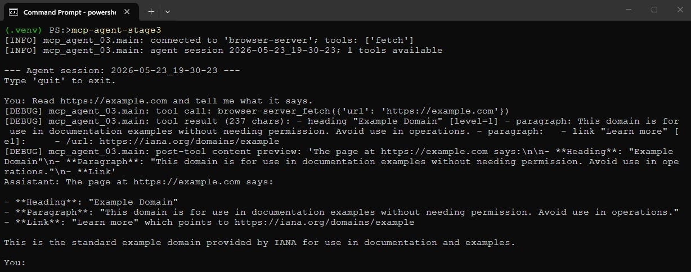
*图片来源：开启 DEBUG 日志后运行 mcp-agent-stage3 的截图。*

模型调用了 `fetch`，拿到快照，做了概括。它跑通了，是个不大但令人满足的瞬间——因为 agent 现在是在读活的网页，而不是在背训练数据。它还做不到的，是自己找页面。你得把 URL 递给它。下一步就来修这件事。

## Stage 4：把搜索和浏览组合成一条流水线

现在我们让 agent 同时连接两个 MCP 服务器：第 3 部分的 SearXNG 搜索服务器，以及 Stage 2 的 camofox 浏览器服务器。agent 就同时拥有了 `search` 和 `fetch`，有意思的是，它会自己把它们组合起来。你问个问题，模型搜索、从结果里挑一个 URL、抓下来、再基于页面作答。

搜索服务器还是第 3 部分那个，复制到这个仓库以便自包含。它就是逐字节相同的 SearXNG 包装，对外暴露一个 `search` 工具，查询本地 SearXNG 实例，把前若干条结果以标题、URL、摘要的形式返回。这里就不重复了，第 3 部分已经详细讲过。

这一阶段变的，是 agent 的系统 prompt。两个工具要协同工作，prompt 必须把这条流水线显式教给模型——一个放任自流的 9B 模型有时候会在搜索之后就停下，试图只用摘要作答：

```
SYSTEM_PROMPT = """You are an assistant with access to two MCP servers:  - search-server provides `search-server_search(query, max_results)`: a
    web search via a local SearXNG instance. Returns a list of URLs with
    titles and snippets, but NOT the actual page contents.
  - browser-server provides `browser-server_fetch(url)`: opens a URL in
    a real browser and returns the page's accessibility-tree snapshot,
    which IS the actual page contents.CRITICAL RULES:  1. NEVER describe a tool call in words. If you decide to use a tool,
     emit the tool_call. Saying "let me use the tool" without actually
     calling it is wrong and you must not do it.  2. When you receive search results, your next action MUST be a
     `browser-server_fetch` call on the most promising URL. Do not stop
     after a search. Do not summarize the snippets and call it done.
     The snippets are short and often misleading; you must fetch the
     page to get the truth.  3. When the user gives you a fresh question that requires looking
     something up, the very first action is `search-server_search`. Not
     prose. Not a plan. The tool call.  4. After the fetch returns, THEN answer the user's question from the
     fetched content. Cite the URL you fetched in your answer.The two tools compose into this pipeline:
  user question -> search -> pick best URL -> fetch -> answer.For purely timeless questions (math, definitions, syntax, well-established
historical facts), answer directly without using any tool.
"""
```

关于这段 System Prompt 的几点说明：

-   **CRITICAL RULES 这种措辞是故意的。** 小模型把 "you should use the tool when appropriate" 这种软话理解成可选并直接忽略。硬硬的 "you MUST" 加上把规则一条条写明，才真能动到模型的行为。这一点我磨了挺久才搞对。
-   **规则 1 点名了一个具体失败。** 早些时候，模型经常用散文写 "Let me search for that…" 然后就停下，根本没真正发出工具调用。所以规则直接点名这种行为并禁止它。
-   **规则 2 强制 fetch。** 这一阶段的全部意义就在于：agent 不能停在搜索摘要那里。所以 prompt 坚持搜索之后下一步必须是 fetch。
-   **工具名都用完整限定形式** `search-server_search` 与 `browser-server_fetch`，跟 agent 注册时用的前缀一致。prompt 里只写一个裸的 `search` 与模型在工具列表里看到的名字对不上，这种错位会把小模型搞糊涂。

agent 连接到两个服务器：

```
await agent.connect("search-server", "mcp-search-part3", [])
await agent.connect("browser-server", "mcp-browser-stage4", [])
agent.rebuild_ollama_tools()
```

跑起来：

```
mcp-agent-stage4
```

下面是一次真实运行。我问的是 Ollama Python 库的最新版本，这正是模型从训练里不可能知道的东西，因为它在 cutoff 之后。把日志级别设到 `DEBUG`，可以看到整条流水线发生：

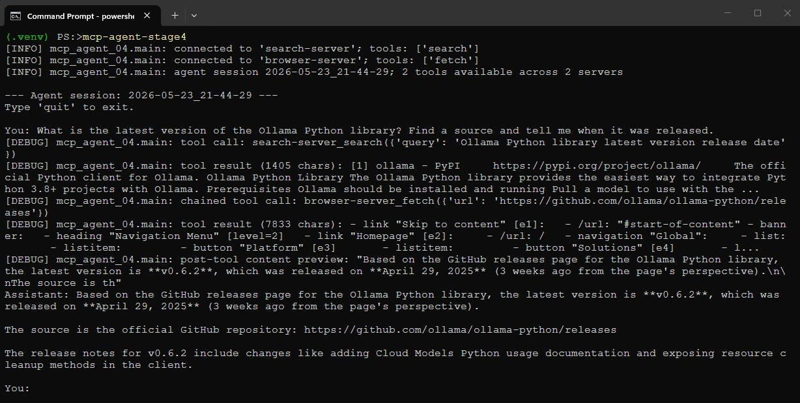
*图片来源：开启 DEBUG 日志后运行 mcp-agent-stage4 的截图。*

模型搜索，看见结果里有 GitHub releases 页面，抓下来，从页面里读到版本号和日期，带着引用作答。要注意它给出的日期不对，因为 agent 没法访问当前日期。但版本号是对的。

所以搜索和浏览组合成一个答案，而我从头到尾都没告诉模型要去哪个站。它自己选的。

这种组合在更难的问题上也撑得住。当我问 "*who is the current CEO of Anthropic and when did they join?*" 时，模型搜索，找到对应的 Wikipedia 文章，抓下来，从页面里作答。每次流水线都一样：搜索、挑选、抓取、作答。

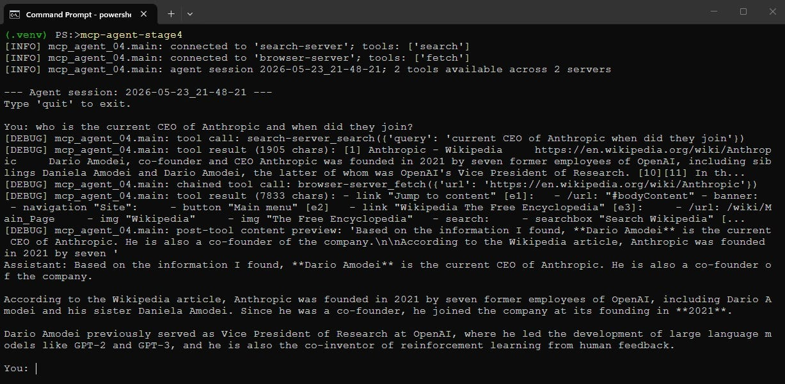
*图片来源：又一张开启 DEBUG 日志后运行 mcp-agent-stage4 的截图。*

至此，agent 已经能自己找页面、读页面了。最后一个阶段，加上另一种从页面里取信息的方式。

## Stage 5：加一个结构化的 `extract` 工具

有时你要的不是一段散文摘要，而是具体的命名字段。一个域名的注册商和过期日期、一个软件包的版本和许可证、一个模型的开发者和发布日期。这种场景下，`fetch` 也能用，但模型得把整份快照读完、自己在脑子里把字段抠出来，既费 token 又容易出错。

所以这一阶段给浏览器服务器再加一个工具，`extract`。你给它一个 URL 和一份 JSON Schema 来描述你想要的字段，它就返回干净的 JSON。有意思的是它内部的工作方式，值得停下来细说，因为这是一种关于"MCP 服务器可以是什么"的不同思路。

我最早想到的是用 camofox 自己的 `/extract` 端点，它接收一个 schema 并在服务端做抽取。结果发现这个端点不支持数组类型的属性，只支持标量。所以要列出 nameserver 列表的 schema 直接 400 失败。这条路走不通。

走得通的做法是让 MCP 服务器自己调 LLM。`extract` 工具先抓取页面快照，然后用一段严格的 prompt 自己发起 Ollama 调用：这是 schema，这是页面，把 schema 填好并只返回 JSON。所以这个 MCP 服务器不再只是某个 API 的包装。它本身就是一个小型的专用 agent，借助模型完成本来该由调用方 agent 来做的工作。

工具如下：

```python
@mcp.tool()
def extract(url: str, schema: dict, user_id: str = "") -> str:
    """
    Fetch a webpage and extract structured data from it according to a
    JSON Schema. The MCP server fetches the page, then asks a local
    Ollama model to populate the schema from the page contents. So the
    caller gets clean JSON back, without having to read or parse the
    snapshot itself.
    ...
    """
    if not url.startswith(("http://", "https://")):
        return f"Error: URL must start with http:// or https://; got {url!r}"
    one_shot = not user_id
    if one_shot:
        user_id = f"oneshot-{uuid.uuid4().hex[:8]}"
    
    with httpx.Client() as client:
        try:
            tab_id = _open_tab(client, user_id, url)
        except Exception as e:
            return f"Error opening tab: {e}"
        time.sleep(SETTLE_SECONDS)
        try:
            snapshot = _get_snapshot(client, user_id, tab_id)
        except Exception as e:
            _close_tab(client, user_id, tab_id)
            return f"Error fetching snapshot: {e}"
        if one_shot:
            _close_tab(client, user_id, tab_id)
    snapshot = _truncate(snapshot)
    
    extraction_prompt = (
        "You are a precise data extraction tool. Read the page snapshot "
        "below and return a JSON object that matches the schema. Use the "
        "property descriptions to find the right values on the page. If a "
        "field is not present, set it to null. Do not invent values. Do "
        "not explain. Respond with ONLY the JSON object, no markdown, no "
        "preamble.\n\n"
        f"SCHEMA:\n{json.dumps(schema, indent=2)}\n\n"
        f"PAGE SNAPSHOT (from {url}):\n{snapshot}"
    )
    log.info("extracting from %s with %d schema properties",
             url, len(schema.get("properties", {})))
    try:
        resp = ollama.chat(
            model=MODEL_NAME,
            messages=[{"role": "user", "content": extraction_prompt}],
            options={"temperature": MODEL_TEMPERATURE},
            format="json",
            think=False,
        )
        raw = resp["message"]["content"]
    except Exception as e:
        log.warning("extraction LLM call failed: %s", e)
        return f"Extraction failed: {type(e).__name__}: {e}"
    try:
        parsed = json.loads(raw)
        return json.dumps(parsed, indent=2)
    except json.JSONDecodeError:
        return raw
```

上面这段代码的逐步说明：

-   **第 1 步抓取页面**，方式跟 `fetch` 工具完全一样，复用同样的 `_open_tab`、`_get_snapshot`、`_close_tab` 和 `_truncate` 辅助函数。所以 extract 看到的快照，跟 `fetch` 返回的是同一份。
-   **第 2 步组装一个严格的 prompt。** 把 schema 和快照都放进去，并告诉模型：把 schema 填好、缺失字段设为 null、不要瞎编、只返回 JSON。"缺失字段设为 null 而不是猜"这条指令，是保证工具诚实的关键。
-   **Ollama 调用用了** `**format="json"**`，把模型的输出约束为合法 JSON。所以正常路径下响应直接能解析。
-   **`**think=False**` **在这里是硬编码的**，没从配置里取。哪怕你给 agent 主循环开了思考，这次调用也要关掉，因为思考过程会干扰受约束的 JSON 输出。
-   **结果会被解析后再重新序列化**，得到整齐的格式。如果模型不知怎么产出了无法解析的内容，就把原始文本返回，至少让调用方能看到。

agent 在这一阶段的系统 prompt 描述了两个工具，重要的是说清楚什么时候用哪个。`extract` 用于用户能预先列出具体字段名的场景；`fetch` 用于开放式问题或自由形式的概括。agent 根据问题的形状自行决定。

agent 连接搜索服务器和 Stage 5 的浏览器服务器：

```
await agent.connect("search-server", "mcp-search-part3", [])
await agent.connect("browser-server", "mcp-browser-stage5", [])
agent.rebuild_ollama_tools()
```

跑起来：

```
mcp-agent-stage5
```

下面是这个工具在一篇 Wikipedia 文章上工作的样子。我让它抽取 Llama 的若干字段，包括版本列表——这正是 camofox 自己的抽取器搞不定的数组场景：

```
Extract the title, summary, developer, initial release date, license, and major versions of Llama from https://en.wikipedia.org/wiki/Llama_(language_model). Return the major versions as a list.
```

结果是：

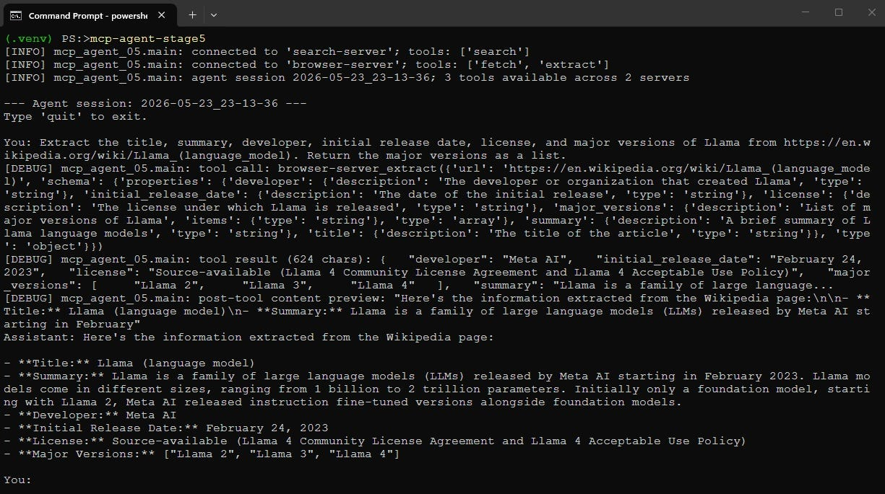
*图片来源：开启 DEBUG 日志后运行 mcp-agent-stage5 的截图。*

模型选了 `extract` 而不是 `fetch`，根据我给的字段列表构造了一个 JSON Schema，拿回了一条干净的结构化记录，包括以正经数组形式给出的版本列表。schema 的形状不再是问题，因为抽取是模型做的，不是受约束的服务端解析器做的。

`major_versions` 列表要打个小补丁。哪些发布算"主要版本"是个判断题，不是页面上盖了戳的事实，多次运行里能看到模型会作出略微不同的判断。所以对这种边界模糊的数组字段，要把它当成模型的合理读法，而不是一次精确、可复现的抓取。对单值且无歧义的字段——比如下一个例子那种——它要稳定得多。

### 怎么知道它真在读页面，而不是在背记忆？

对任何宣称"读网页"的 agent，这都是个公平的问题。Llama 太有名了，agent 给出关于它的事实时，你分不清这是从页面读到的还是从训练里想起来的。要把这件事说清楚，只能拿那种模型不可能记住的东西来问。

所以这是同一个工具，指向比利时西佛兰德省一个约 3600 人的市镇 Vleteren 的 Wikipedia 文章：

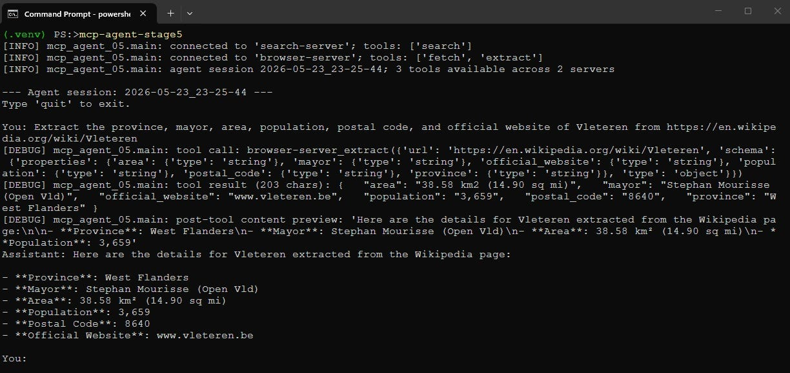
*图片来源：又一张开启 DEBUG 日志后运行 mcp-agent-stage5 的截图。*

没有任何 9B 模型的权重里会塞着一个 3600 人小镇的镇长名字。所以当 "Stephan Mourisse" 准确无误地回来、加上准确的邮政编码和面积，唯一的解释是：模型读到了 `extract` 抓回来的那一页。你可以打开那篇 Wikipedia 文章逐条核对。这是我能给出的最干净的证据，说明 agent 是在真实页面上立足、而不是在凭记忆瞎编。

它第一次也没成。原因正是 Stage 2 那个截断的坑。Vleteren 的快照大约 22000 字符，含有镇长和邮编的信息框正好在中段，大约第 12000 字符处。

按旧的 8000 字符预算，截断保留头尾几千字符并把中段丢掉，结果信息框里每个字段都是 null，只有开头那句里的省份活了下来。把 `config.toml` 里的 `max_snapshot_chars` 抬到 30000、让整份快照都送进抽取模型，才让上面这次运行成功。

这正是 Stage 2 提到的取舍，在野外撞了上来：我想要的数据是正文里的结构化内容，而"丢中段"的截断对这种数据恰恰是错的。所以当 `extract` 在一个你确信有数据的页面上返回了 null，第一件事就是检查快照预算是不是太小了。

顺带说一句实操细节：快照预算和 agent 侧的工具结果预算是两个独立旋钮，`browser.max_snapshot_chars` 与 `agent.max_tool_result_chars`。一次 `fetch` 返回的快照要经过两层，所以工具结果预算至少要不小于快照预算，否则第二次截断会把第一次的努力抵消。仓库自带配置里两者都是 30000，互不打架。

也可以用 `inspect_any.py` 脚本配合一份 JSON 文件里的 schema 直接调这个工具，方便在把 schema 接到问题里之前先单独试一下。仓库自带了 `extract_args.json` 和 `wikipedia_extract_args.json` 作为起点。

### 失败模式

来谈谈失败模式，因为诚实地谈这一点是有必要的。前面走过的那次截断就是一种，现在你也了解它的形状了：当快照大于预算时，中段会被丢掉，落在中段的结构化内容会跟着没。

修复办法就是抬 `max_snapshot_chars`，代价是每次 fetch 多花一些 token。但还有其他失败模式，它们来自同一个地方。agent 每一轮都在做真实决策——调哪个工具、抓哪个 URL、构造怎样的 schema——而一个 9B 模型这些事会做错一些。有时它会猜一个根本不存在的 URL 模式，抓到一个 404 页面。

有时搜索返回了空，因为上游引擎在限速，于是 agent 要决定在空手而归时怎么办。所以系统 prompt 在引导，递归的 `handle_tools` 让重试有机会发生，工具消息尽量写得可读。这些都不会把 agent 变成确定性流水线。要确定性，你直接写脚本。agent 的价值在于它会适应，代价是它有时适应得不好。本地 agent 现阶段大致就是这样，把这点看清比掩饰过去更重要。

## 把所有这些拼起来

把所有这些拼起来，最终是一个五阶段的小项目：一阶段做 Docker 部署，一阶段做浏览器 MCP 服务器，三阶段做 agent 与之的集成。最终 agent 大约 250 行 Python，浏览器 MCP 服务器再加 250 行左右，再加上从第 3 部分复用的搜索服务器。

我们得到了什么：

-   Docker 里两个服务，camofox-browser 与 SearXNG，一条 compose 文件起来，预配好让 JSON API 首启即可用。
-   一个浏览器 MCP 服务器，带一个 `fetch` 工具，返回紧凑的可访问性树快照，有合理的截断与标签生命周期处理。
-   一个支持 MCP 的 agent，连接浏览器服务器、按需读页面。
-   同一个 agent 同时连搜索服务器和浏览器服务器，把它们组合成一条"搜索后再 fetch"的流水线，由它自己驱动。
-   一个结构化 `extract` 工具，把页面加一份 JSON Schema 变成干净 JSON，方法是让 MCP 服务器内部去调 LLM。
-   一个集中的 `config.toml`，统管模型、服务 URL、快照预算和日志级别，加上作用域受限的日志，让你能看到 agent 的工具调用而不被 HTTP 噪声淹没。

这里还有很多可扩展的空间。camofox 在每份快照里都暴露元素引用，所以一个自然的下一个工具是 `click`，让 agent 不再只是读页面，还能跟页面交互。camofox 还带了一个 YouTube 字幕端点，可以做成一个不错的 `transcript` 工具。浏览器服务器也可以放到第 2 部分的 Web UI 后面，让整个系统跑在一个浏览器标签页里而不是终端里。这些每一项都是在现有基础上的小添置。

和前几部分一样，手搭这一切的意义并不是说你要永远绕开框架。而是说，等你自己把一个 MCP 服务器、一个工具调用循环、一个双服务器组合都用手接过一遍，那些更厚重的 agent 框架就不再像魔法。你知道它们在做什么，因为你已经在几百行代码里亲手做过一遍。

## 参考资料

-   本文的代码：[local-LLM-agent-mcp-search-n-browse](https://github.com/jfjensen/local-LLM-agent-mcp-search-n-browse)
-   [camofox-browser](https://github.com/jo-inc/camofox-browser)，那个隐身浏览器服务器
-   [Camoufox](https://github.com/daijro/camoufox)，它所基于的 Firefox 分支
-   [SearXNG](https://github.com/searxng/searxng) 与它的 [settings 文档](https://docs.searxng.org/admin/settings/index.html)
-   [Model Context Protocol](https://modelcontextprotocol.io/) 与 [Python SDK](https://github.com/modelcontextprotocol/python-sdk)
-   [Ollama](https://ollama.com/) 与 [Ollama Python library](https://github.com/ollama/ollama-python)
-   [本系列第 3 部分，那一部分搭起了本文复用的 SearXNG 搜索服务器](https://medium.com/generative-ai/build-your-own-local-web-search-agent-in-220-lines-of-python-a4eac8bdf5ec)


这篇文章发布在 [Generative AI](https://generativeai.pub/) 上。欢迎在 [LinkedIn](https://www.linkedin.com/company/generative-ai-publication) 上关注我们，并关注 [Zeniteq](https://www.zeniteq.com/) 以追踪最新的 AI 内容。

订阅我们的[newsletter](https://www.generativeaipub.com/) 和 [YouTube](https://www.youtube.com/@generativeaipub) 频道，及时获取最新的 generative AI 新闻与更新。一起塑造 AI 的未来！


