# DS-STAR：Google 是怎么造出一个真正能用的数据科学 agent 的

## Google 的七模块流水线，凭什么能比裸跑的 Gemini 高出 32 个百分点——这件事又对所有想造数据科学 agent 的人意味着什么。

agentic coding 工具我已经用了大约两年（Claude Code 已经认真且持续地用了一年）。在通用工程任务上确实让人眼前一亮。但每当我把它推向真正的数据科学场景时，就总能撞上同一个摩擦点：Claude 的分析基本停留在算几个平均值——这些数字本身有用，但缺少一个数据科学家应有的纵深（分布对比、p 值、置信区间、数据质量等等）。

感觉就像让一个通才去做专家活，能用，但谈不上一流。于是我去找方案。这周，我终于看到了那篇等待已久的论文。

[DS-STAR is a Data Science Agent for Solving Diverse Tasks by Google](https://arxiv.org/pdf/2509.21825)。论文的核心论点是：能力来自框架与系统设计，而不是来自新一代的前沿模型。先放个开胃菜：

-   Gemini 2.5 Pro 单跑，在 DABStep 的 hard 级任务上拿 12.70%。
-   DS-STAR 配 Gemini 2.5 Pro，拿 45.24%。
-   整整 32 个百分点的跃升。
-   模型没换。**变的是它外面那套系统。**

这种论调正中我下怀。Claude Code 比其他 AI coding 工具强，并不是因为它总用着最强的前沿模型，而是因为系统怎么接线。DS-STAR 把同样的逻辑搬到了数据科学这边。所以我想把这套系统真正深挖一遍，下面就给你拆开讲。

## 论文在哪里看？

[DS-STAR: Data Science Agent for Solving Diverse Tasks across Heterogeneous Formats and Open-Ended Queries](https://arxiv.org/pdf/2509.21825)

这篇论文 2025 年 9 月提交到 arXiv，2026 年 2 月修订到 v4。作者是 Jaehyun Nam（KAIST）、Jinsung Yoon、Jiefeng Chen、Raj Sinha 和 Tomas Pfister（Google Cloud）。想看精简版的话，[Google 也发布了一个网页](https://research.google/blog/ds-star-a-state-of-the-art-versatile-data-science-agent/)。

论文里 DS-STAR 被定义为一个数据科学 *"agent designed to (1) seamlessly process and integrate data across diverse, heterogeneous formats, and (2) move beyond simple QA to generate comprehensive research reports for open-ended queries."*

## 这篇博客会覆盖哪些内容？

-   **论文的目标**——DS-STAR 想解决什么问题，以及现有的单遍式方案在真实数据科学任务上为什么会失败
-   **DS-STAR 是怎么组织的**——两件套架构：DS-STAR 处理良定义问题，DS-STAR+ 处理开放式研究
-   **DS-STAR 深拆**——七个模块、它们的公式、以及完整的迭代算法
-   **DS-STAR+ 深拆**——分解、写作、精修循环是怎样把内核引擎扩展成能产出结构化报告的
-   **agent 背后的 prompt**——Google 在 Appendix L 里实际公开了什么，以及这些设计选择透露出什么
-   **消融实验**——是哪个组件贡献了那 32 个百分点的性能增益
-   **越难的问题轮数越多**——迭代次数如何随任务复杂度扩展
-   **Google 给的示例报告**——DS-STAR+ 在一个真实支付数据集上跑出来是什么样
-   **局限**——没有官方实现、开放的集成问题、以及其他若干点

## 论文的目标

声明的目标很大：**造一个能回答*任意*数据科学问题的系统，覆盖异构数据格式与开放式查询。**

之所以在实践中很难，根子在数据。真实的数据科学工作几乎不会只有一份干净 CSV 加一个明确问题。它涉及[多份结构化数据集、需要多步推理](https://huggingface.co/blog/dabstep)、各种领域知识嵌在规则里、以及那种一次代码生成就搞不定的问题。Adyen 与 Hugging Face 出的 DABStep 基准对此抓得很准：450 道题，72 道 easy（单数据集、上下文知识极少），378 道 hard（多数据集、需要领域知识、不存在一击解决方案）。[KramaBench](https://arxiv.org/abs/2506.06541) 还更进一步：104 个挑战，覆盖 1700 个文件、24 个数据源、6 个领域，agent 必须自己发现哪些文件才是相关的。

这两个基准的设计意图都是要把"写一个代码块然后交答案"的套路打掉。而这正是 DS-STAR 要替换的套路。

哪怕你实际的用例更窄——一个内部数据库、一个良定义问题——这里的架构选择依然成立。一个能处理异构混乱场景的系统，处理干净数据当然不在话下；反过来则不成立。

## DS-STAR 这个数据科学 agent 是怎么组织的

DS-STAR 实际上是两件套，一个搭在另一个上面。

从架构上看，DS-STAR 是 DS-STAR+ 的内核引擎。

-   DS-STAR+ 把开放式查询分解成一组聚焦的子问题，逐个交给 DS-STAR 处理。
-   再用一个 writer agent 把答案综合成一份报告。
-   还有一个评估器，决定要不要再开几轮分析。

下面这张图非常粗略地展示了 DS-STAR+ 和 DS-STAR 是怎么互动的。

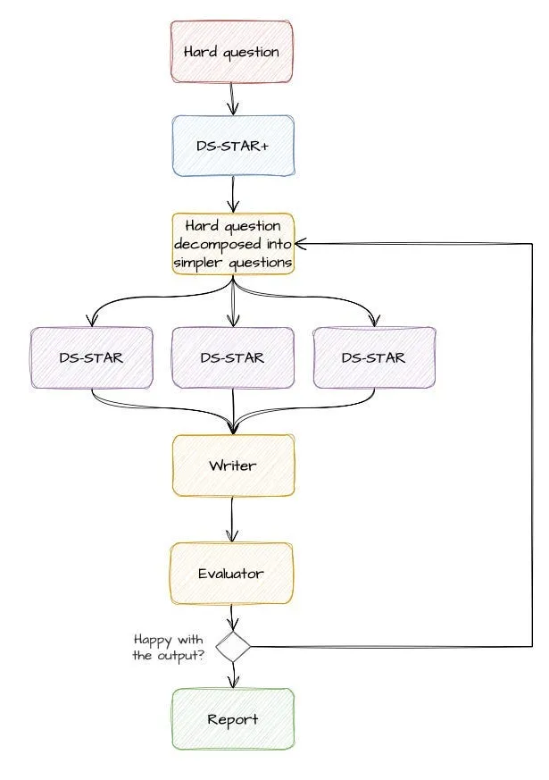

## DS-STAR 深拆

论文里那张图已经不错了，但我感觉漏了几个组件，没法很顺地跟着算法的执行顺序读下来。下面是我自己改进的版本。

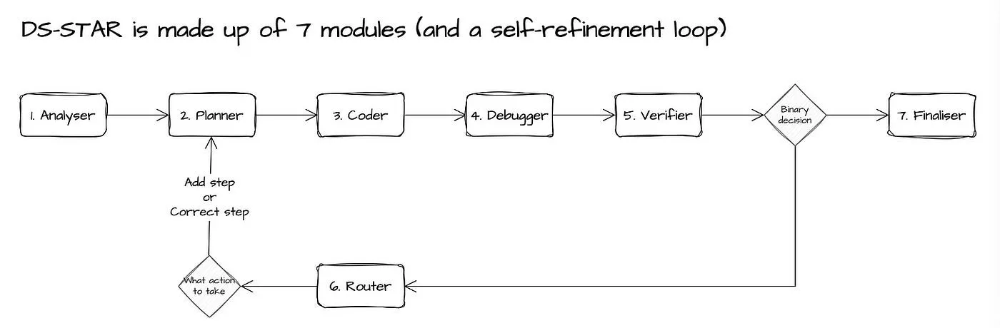

## 3.1. 七个模块

DS-STAR 由七个命名 agent 组成。按流水线顺序走一遍，整个系统就清楚了。

### 模块 1. ANALYSER（分析器）

DS-STAR 做任何规划之前的第一件事，是**给每一份数据文件做画像**。它会为每个文件生成一段 Python 脚本、执行它，并把打印出的输出当作结构化描述存起来。可以把它想成一个索引器，或者一个小型 RAG。

我还觉得挺有意思的一点是：这份描述是确定性地由 Python 生成的，而不是让 LLM 决定要怎么分析文件。下面两张截图：(1) 用于分析 json 文件的样例 Python 代码；(2) 该脚本在样例文件上的输出。

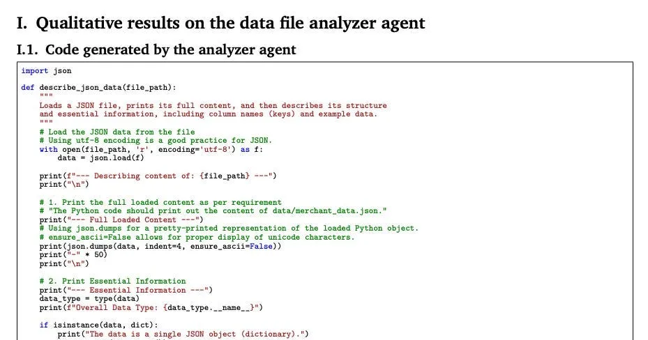
*图片来源：论文第 50 页。用于分析 json 文件的样例 Python 脚本。*

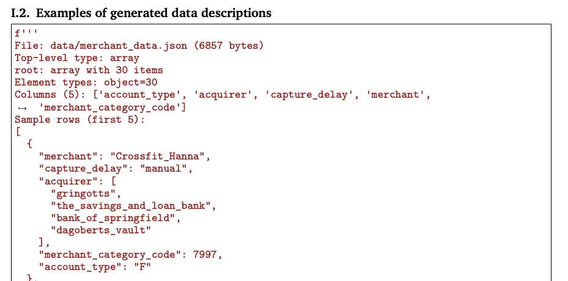
*图片来源：论文第 51 页。样例 Python 脚本分析 json 文件后输出的结果。*

Google 也很慷慨地分享了每个模块的 prompt，这是分析器模块的 prompt。

```
You are an expert data analysist.
Generate a Python code that loads and describes the content of {filename}.# Requirement
- The file can both unstructured or structured data.
- If there are too many structured data, print out just few examples.
- Print out essential informations. For example, print out all the column names.
- The Python code should print out the content of {filename}.
- The code should be a single-file Python program that is self-contained and can be
executed as-is.
- Your response should only contain a single code block.
- Important: You should not include dummy contents since we will debug if error occurs.
- Do not use try: and except: to prevent error. I will debug it later.
```

### 模块 2. PLANNER（规划器）

拿到数据描述和用户问题之后，Planner 会生成执行计划的第一步。**不是一次性把整个计划摊出来，而是*只规划一步***。

Planner 有两种模式：`planner_init`（第一步，没有先前计划上下文）和 `planner_next`（后续步骤，给定当前计划和之前的执行结果）。

下面是初始化计划的 prompt：

```
You are an expert data analysist.
In order to answer factoid questions based on the given data, you have to first plan 
effectively.# Question
{question}# Given data: {filenames}
{filenames #1}
{summaries #1}
...
{filenames #N}
{summaries #N}# Your task
- Suggest your very first step to answer the question above.
- Your first step does not need to be sufficient to answer the question.
- Just propose a very simple initial step, which can act as a good starting point to
answer the question.
- Your response should only contain an initial step.
```

当系统已经过了初始计划阶段、要规划下一步时，prompt 就调整成这样。这里特别有意思的是，prompt 会把之前的步骤计划以及上一步结果一并放进来。这是给系统注入记忆、让它有更深上下文的方式。

```
You are an expert data analysist.
In order to answer factoid questions based on the given data, you have to first plan 
effectively.Your task is to suggest next plan to do to answer the question.# Question
{question}# Given data: {filenames}
{filenames #1}
{summaries #1}
...
{filenames #N}
{summaries #N}# Current plans
1. {Step 1}
...
k. {Step k}# Obtained results from the current plans:
{result}# Your task
- Suggest your next step to answer the question above.
- Your next step does not need to be sufficient to answer the question, but if it 
requires only final simple last step you may suggest it.
- Just propose a very simple next step, which can act as a good intermediate point to
answer the question.
- Of course your response can be a plan which could directly answer the question.
- Your response should only contain an next step without any explanation.
```

### 模块 3. CODER（编码器）

接过当前的计划步骤，生成一段可执行的 Python 代码来落实它。和 Planner 一样，它也有两种模式：`coder_init`（第一段代码块）和 `coder_next`（后续代码块，并感知之前的结果）。代码会生成为单文件、可独立运行的脚本。

初始 coder 的 prompt 如下：

```
# Given data: 
{filenames}
{filenames #1}
{summaries #1}
...
{filenames #N}
{summaries #N}# Plan
{plan}# Your task
- Implement the plan with the given data.
- Your response should be a single markdown Python code (wrapped in ```).
- There should be no additional headings or text in your response.
```

后续动作的 coder prompt 如下。

```
You are an expert data analysist.
Your task is to implement the next plan with the given data.# Given data: 
{filenames}
{filenames #1}
{summaries #1}
...
{filenames #N}
{summaries #N}# Base code
```python
{base_code}
```# Previous plans
1. {Step 1}
...
k. {Step k}# Current plan to implement
{Step k+1}# Your task
- Implement the current plan with the given data.
- The implementation should be done based on the base code.
- The base code is an implementation of the previous plans.
- Your response should be a single markdown Python code (wrapped in ```).
- There should be no additional headings or text in your response.
```

### 模块 4. DEBUGGER（调试器）

Coder 的输出会真正跑在数据文件上。

如果执行失败（语法错误、缺列、类型不匹配），Debugger 就启动。它接过失败的代码、错误信息，生成一份修正后的脚本。

Debugger 在论文 Figure 1 里没有被显眼地画出来，但它在算法里是存在的：它夹在 Coder 和 Verifier 之间，在执行失败甚至还没走到 plan 评估之前就把它处理掉。这也是我特意把它加进自己那张图的原因。

Debugger 有 2 个 prompt：

1.  一个 prompt 用来概括错误（毕竟我们都知道 traceback 能有多长）。
2.  一个 prompt 真正去修这个 bug。

下面两个都贴出来。

```
# --> PROMPT TO SUMMARISE THE ERROR
# Error report
{bug}# Your task
- Remove all unnecessary parts of the above error report.
- We are now running {filename}.py. Do not remove where the error occurred.
```

```
# --> PROMPT TO FIX THE ERROR
# Code with an error:
```python
{code}
```# Error:
{bug}# Your task
- Please revise the code to fix the error.
- Provide the improved, self-contained Python script again.
- There should be no additional headings or text in your response.
- Do not include dummy contents since we will debug if error occurs.
- All files/documents are in `data/` directory.
```

### 模块 5. VERIFIER（验证器）

代码顺利跑完之后，Verifier 来评估当前计划够不够回答原始问题。

判定 `v` 是二元的：`sufficient`（足够）或 `insufficient`（不够）。

评估依据是累计的计划、用户的查询、解题代码（作为累计计划的实现），以及它的执行结果，使用下面这个 prompt。

```
You are an expert data analysist.
Your task is to check whether the current plan and its code implementation is enough to
answer the question.# Plan
1. {Step 1}
...
k. {Step k}# Code
```python
{code}
```# Execution result of code
{result}# Question
{question}# Your task
- Verify whether the current plan and its code implementation is enough to answer the
question.
- Your response should be one of 'Yes' or 'No'.
- If it is enough to answer the question, please answer 'Yes'.
- Otherwise, please answer 'No'.
```

### 模块 6. ROUTER（路由器）

只有当 Verifier 返回 `insufficient` 时才会触发。

Router 看一眼当前计划、问题、执行结果，做一个二元决策：

-   选项 1：在计划末尾加一步新的（"Add Step"）？
-   选项 2：还是要修正现有计划里的某一步（"Replace Step K"，其中 K 是步骤索引）？

选项 1 很合逻辑，因为有可能是问题本身还没问完。但更重要的是，因为我们一步一步走，选项 2 让系统可以轻松地只修一步，而不用把*整个*计划从头重写一遍。

```
You are an expert data analysist.
Since current plan is insufficient to answer the question, your task is to decide how to
refine the plan to answer the question.# Question
{question}# Given data: 
{filenames}
{filenames #1}
{summaries #1}
...
{filenames #N}
{summaries #N}# Current plans
1. {Step 1}
...
k. {Step k}# Obtained results from the current plans:
{result}# Your task
- If you think one of the steps of current plans is wrong, answer among the following
options: Step 1, Step 2, ..., Step K.
- If you think we should perform new NEXT step, answer as 'Add Step'.
- Your response should only be Step 1 - Step K or Add Step.
```

### 模块 7. FINALISER（终结器）

当 Verifier 返回 `sufficient` 时，Finaliser 把所有执行输出综合成最终答案。它从累积的执行历史里提取相关结果，并按原始问题所需的形式输出。

```
You are an expert data analysist.
You will answer factoid question by loading and referencing the files/documents listed
below. You also have a reference code.Your task is to make solution code to print out the answer of the question following the
given guideline.# Given data: {filenames}
{filenames #1}
{summaries #1}
...
{filenames #N}
{summaries #N}# Reference code
```python{code}
```
# Execution result of reference code
{result}# Question
{question}# Guidelines
{guidelines}# Your task
- Modify the solution code to print out answer to follow the give guidelines.
- If the answer can be obtained from the execution result of the reference code, just
generate a Python code that prints out the desired answer.
- The code should be a single-file Python program that is self-contained and can be
executed as-is.
- Your response should only contain a single code block.
- Do not include dummy contents since we will debug if error occurs.
- Do not use try: and except: to prevent error. I will debug it later.
- All files/documents are in `data/` directory.
```

### 重要提示

**这条流水线是顺序的**，不是并行的。

每个 agent 的输出都是下一个 agent 的输入。改动任何一个，下一个看到的输入也就变了。

## 3.2. 公式

论文里有一点特别有意思：Google 把整个算法用公式参数化了。这不是那种 "*因为我们是聪明的人，所以我们想明白了这些 prompt 怎么一起协作*" 的叙述。更像是 "*嘿，这个系统有一套逻辑步骤，可以用公式清楚地刻画出来*"。

这些公式可以帮 Google 的人去调每条 prompt、每个 Python 模板、每段脚本，从而微调性能。论文里没明说，但我猜，最终的 DS-STAR 系统设计就是这样借助公式打磨出来的。

我们先把公式过一遍，再把它对回到流程图上。

**问题设定。**

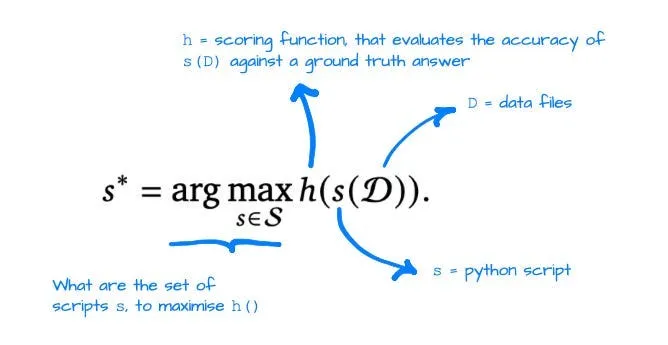

**分析器。**

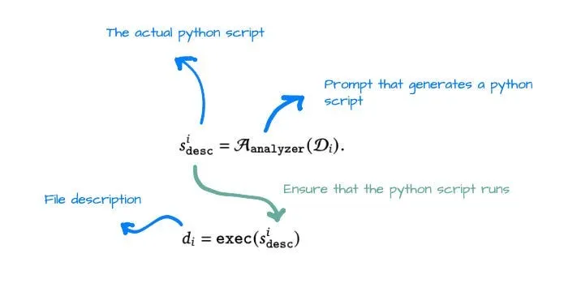

**规划器。**

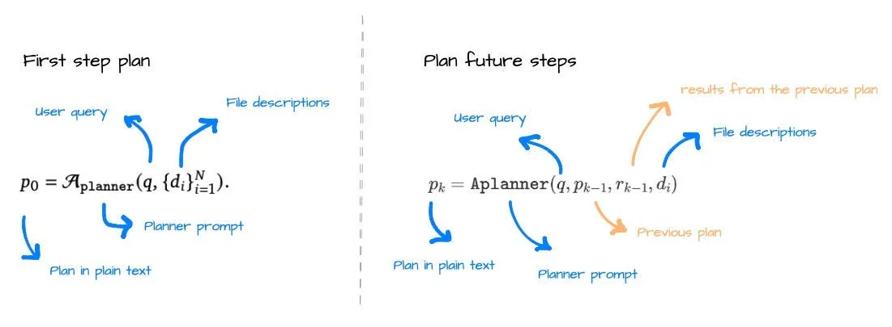

**编码器。**

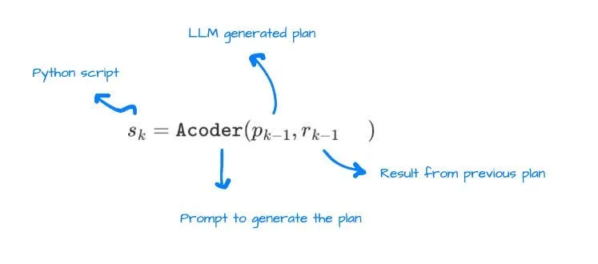

**调试器。** 没有公式，因为这只是捕获调试问题并修复它们的简单步骤。不影响"输出是一段能跑通的 Python 代码"这个事实。

**验证器。**

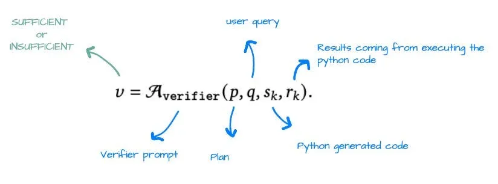

**路由器。**

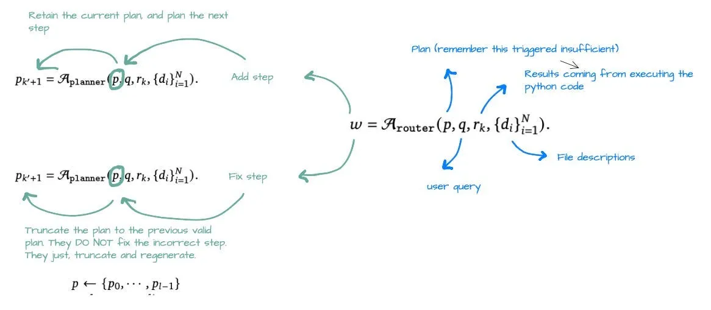

**终结器。** 同样，没什么公式可展示。这一步就是用一个 prompt 给详细问题写最终答案（比如一张表，或一个数字，又或者是一份汇总报告）。

## 3.3. 算法

最后，想覆盖一下整个 DS-STAR 流程的伪代码。如果你已经读了前面那些模块和公式，Algorithm 1 读起来就很直接。

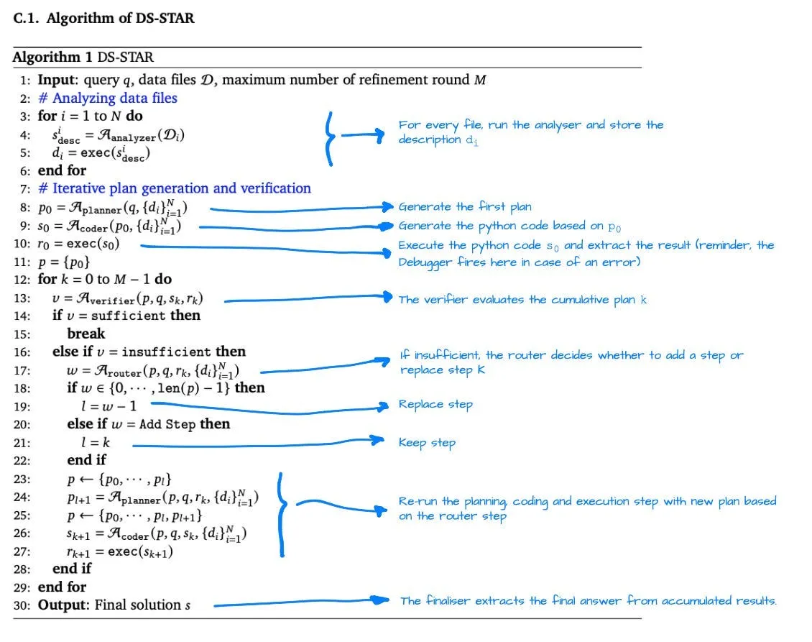

用简化的话讲，大致是这样。

**阶段 1——数据画像。** 对 `D` 中每个文件运行 Analyzer，存下描述 `d_i`。这是后面一切的地基。

**阶段 2——迭代式计划生成。**

1.  Planner 根据问题和数据描述生成第一步计划。
2.  Coder 为这一步生成代码。
3.  Executor 运行它。如果失败，Debugger 修正代码并重跑。
4.  Verifier 用执行输出来评估累计计划。如果 `sufficient`，跳到第 6 步。
5.  如果 `insufficient`，Router 决定要新加一步还是替换 Step K。带着更新后的上下文返回第 1 步（Planner）。最多重复到设定的迭代上限。
6.  Finalyzer 从累积结果里抽出最终答案。

这套算法读起来像一个反馈控制回路（我是做机器人工程出身的，所以总会想到 PID 控制器）。

-   Verifier 是传感器。
-   Router 是控制器。
-   Planner 和 Coder 是执行器。
-   当传感器发出"已完成"信号时，循环终止。

## DS-STAR+ 深拆

如前所述，DS-STAR+ 拿到一个开放式查询，会基于它产出一份结构化报告。下面这张图展示了这套增强系统的运行方式。这次官方的图我觉得已经足够细致，直接拿来用就行，不必自己再画一张。

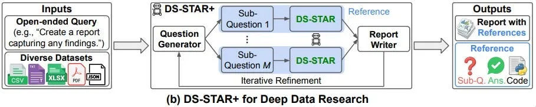

把图拆开看：

1.  **第一个问题是分解。** 一个模糊的查询不能直接喂给 DS-STAR。DS-STAR+ 加了一个 GENERATOR agent，它读这个查询和数据描述，产出一组聚焦的子问题 `{f_i}`。每个子问题都能被 DS-STAR 回答：它有明确的问法，并指向相关数据。DS-STAR 独立地处理每一个，并返回答案 `{a_i}`。
2.  **接下来 WRITER agent 把这些子问题/答案对综合成一份结构化报告** `R`。prompt 要求 Writer 把每条断言都引用回支撑它的子问题（也就是通过让每句话都能追溯到一条已执行的数据查询，来尽量防止幻觉）。
3.  **精修循环和 DS-STAR 类似。** Generator 会再看一遍当前的报告草稿和数据描述，针对缺失或浅薄的地方生成一组新的子问题。

## 4.2. 算法

DS-STAR+ 的记号是在 DS-STAR 链路之上加了一层分解。这里不打算把论文里的公式逐一过完，直接跳到算法部分，看循环怎么运行、输入是如何流转的。

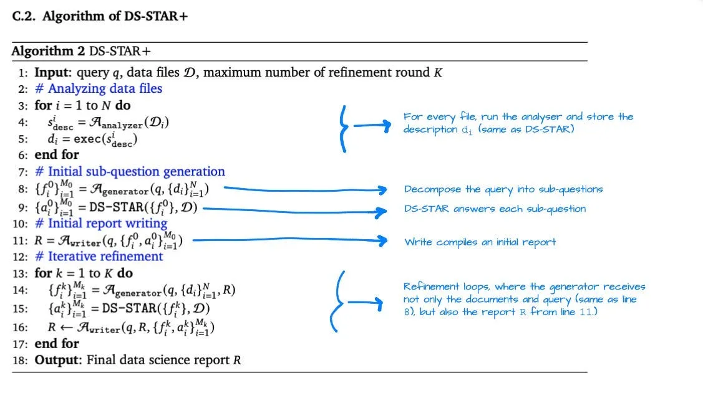

## 4.3. DS-STAR+ 背后的 prompt

相关的 DS-STAR prompt 已经在上一节配合公式分解一并覆盖过了。DS-STAR+ 的公式没单独讲，但这一层用到的 prompt 还是想分享出来。

**子问题生成 agent（首轮）**

```
You are an expert data analysist.
Your task is to write a comprehensive data science report to the given question by using 
the files/documents listed below.
In order to do this, you have to first suggest multiple data analysis questions that 
should be answered to write the report.# Given data: {filenames}
{filenames #1}
{summaries #1}
...
{filenames #N}
{summaries #N}# Question
{question}# Your task
- Suggest multiple factoid data analysis questions that are required to write the report
really well.
- All the questions should be well-answered using the given data.
- All questions should be answered independently.
- Generate as much as you can.
- Return in valid JSON format:
Questions = {'question': str}
Return: list[Questions]
```

**子问题生成 agent（精修轮）**

```
You are an expert data analysist.
Your task is to complement the given data science report of the given question.
In order to do this, you have to suggest supplementary multiple data analysis questions 
that can strengthen to the report.# Given data: {filenames}
{filenames #1}
{summaries #1}
...
{filenames #N}
{summaries #N}# Given data science report:
{report}# Question
{question}# Your task
- Suggest multiple factoid data analysis questions that are required to complement the 
report.
- All questions should contain new information that is not included in the report.
- All the questions should be well-answered using the given data.
- All questions should be answered independently.
- Return in valid JSON format:
Questions = {'question': str}
Return: list[Questions]
```

**Writer agent（首版生成报告）**

```
You are an expert data analysist.
Your task is to write a **comprehensive data science report** to the given question by 
using the data and some relevant informations listed below.# Relevant informations:
{Sub-Question #1}
{Answer #1}
...
{Sub-Question #M_0}
{Answer #M_0}# Question that you have to write a comprehensive data science report:
{question}# Your task:
- The report should be grounded to the given relevant informations.
- For the citation, use the Sub-Question number as a citation number which is in 1 - {len(subquestions)}.
- The data science report should be relevant to given question, should be comprehensive, 
and should be insightful.
- The data science report should have nice structure, good readability, and should be 
professional.
- Write a very comprehensive data science report to the given above question.
```

**Writer agent（精修后的报告）**

```
You are an expert data analysist.
Your task is to complement the given data science report of the given question by using
the some relevant informations listed below.Relevant informations:
{Sub-Question #1}
{Answer #1}
...
{Sub-Question #M_k}
{Answer #M_k}# Given data science report:
{report}# Question that you have to write a comprehensive data science report:
{question}# Your task:
- Do not modify the given report a lot. Just try to add new information.
- The report should be grounded to the given relevant informations.
- Cite with alphabet. For the citation, use the Sub-Question number as a citation
alphabet (e.g., cite with [a] for the Sub-Question 1).
- The data science report should be relevant to given question, should be comprehensive,
and should be insightful.
- The data science report should have nice structure, good readability, and should be
professional.
- Complement the give data science report to the given above question.
```

想要把系统跑起来的读者：[JulesLscx/DS-Star](https://github.com/JulesLscx/DS-Star) 是一个忠实的社区复现（截至本文调研时为 145 star、37 fork）。里面有 `dsstar.py`（完整的 `DS_STAR_Agent` 类）、`prompt.yaml`（所有 prompt 的文本形式）以及 `provider.py`（Gemini、OpenAI、Ollama）。这并非官方发布——Google 没有发——但是论文的精确实现。

讲完系统是怎么运行的，下面想重点谈一下论文里几个评估系统好坏的有趣科学方法。

## 消融实验

论文 Table 4 回答这个问题：哪个组件对 DS-STAR 的性能贡献最大？做法是按移除的方式做消融——拆掉一个组件，测一下掉了多少。

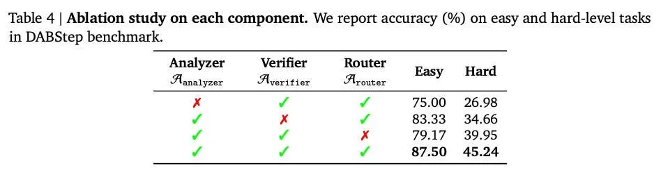

**拆掉 Analyzer。** DABStep hard 级准确率从 45.24% 跌到 26.98%。***这是所有组件移除里跌得最厉害的一个。*** *没有数据描述，Planner 生成的步骤就完全脱离了数据真实包含的内容这个根基。* 性能仍比 12.70% 的基线（非 agentic 框架）要好，说明其他组件还是有贡献，但 Analyzer 是迄今为止承载最重的一个模块。

**拆掉 Router（只让它走 "Add Step"）。** easy 和 hard 任务的表现都掉。Router 能"替换某个有问题的步骤"——而不是只往一个已经走偏的计划后面继续加新步骤——正是这点防止了系统把错误层层累加。少了它，计划（以及里面的错误）会一路堆下去。

**把步进式 VERIFIER 换成"一次生成完整 plan 再执行"。** 这里的基线做法是：一次性把完整计划写出来，跑掉所有代码，只用代码能否执行成功作为验证信号。这种方式比 DS-STAR 的步进式做法表现差。步进式 Verifier 能在每一步的层面就抓出 plan 的问题，避免它扩散到下一步。

数据科学家会立刻认出这种叙述：这就是 agent 系统的特征重要性分析。把每个组件拆出来，测一下下降幅度。

1.  Analyzer 是重要性最高的"特征"。
2.  Router 排第二。
3.  步进式 Verifier 跑赢了完整 plan 的基线。

[Google Research 博客](https://research.google/blog/ds-star-a-state-of-the-art-versatile-data-science-agent/)里还有一个额外观察：DS-STAR 配 GPT-5 在 easy 任务上更好，配 Gemini 2.5 Pro 在 hard 任务上更好。同一套外壳，暴露出不同模型的强项。这并不是反对用强模型——而是证明这套外壳把模型的强项暴露出来，而不是把它们抹平。

## 越难的问题轮数越多

hard 任务平均需要 5.6 次迭代才能跑到一个 sufficient 的计划。easy 任务平均需要 3.0 次。超过 50% 的 easy 任务一轮就搞定。

系统并没有在简单问题上反复折腾。它会根据被问到的问题的复杂度，按比例分配精修轮数。简单问题一次过；那种横跨多份数据集、需要多步推理的难题就跑五六轮。

这点很有实际意义。token 成本和延迟都随迭代次数线性增长。一个在简单任务上能早停、在难任务上能坚持的系统，行为是对的。

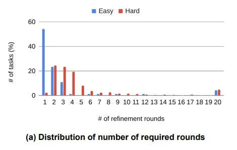

## Google 的示例报告

论文 Appendix G 给了三个 DS-STAR+ 的输出示例。Report 3 是我觉得最有意思的一个，因为它涉及机器学习问题的特征工程。

问题是：*"Generate a comprehensive data preparation report for optimizing payment processing fee calculations. The report should analyze the relationships between merchant characteristics, transaction attributes, and fee structures across multiple datasets. Include analysis of data quality issues, feature engineering for fee calculation, and validation of fee rule applicability."*

输出覆盖了：

1.  围绕费用计算的特征工程决策（要 join 哪些字段，哪些规则在何种条件下适用）
2.  跨数据集发现的数据质量问题（缺失值、不一致的编码、规则适用性的边界情况）
3.  验证手册里那些费用规则能否直接套用到给定数据上
4.  每个小节都引用了支撑它的子问题与代码执行结果

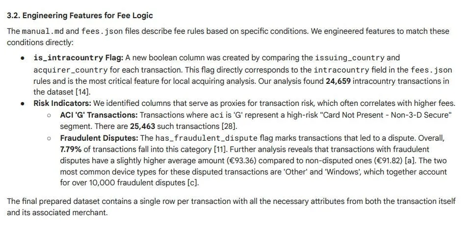
*图片来源：报告某一节的示例截图（第 37 页）。作为数据科学家，这种报告会大幅帮我深挖数据的具体方面。*

## 9. 局限

我个人觉得有 3 条局限值得点名。

1.  **没有官方开源发布。** Google 没有放出官方实现。[JulesLscx/DS-Star](https://github.com/JulesLscx/DS-Star) 是一个社区复现——忠实且文档良好，但不是论文作者维护的。
2.  **与 Claude Code 集成是开放问题。** Claude Code 用户最自然的问题就是：DS-STAR 的模式能不能搬到 Claude Code 工作流里？[MCP 文档](https://docs.anthropic.com/en/docs/claude-code/mcp)表明，Claude Code 可以通过 Model Context Protocol 服务器连接外部数据源。原则上，DS-STAR 风格的外壳完全可以实现为一组 skill 或 agent。但目前还没有人把这件事做成公开的、生产环境验证过的形态。
3.  **Analyzer 强但基础。** 当前的 Analyzer 生成一段 Python 脚本并跑它——本质上就是一个程序化的 `describe()`。像 `ydata-profiling`（前身是 `pandas-profiling`）这类工具能产出丰富得多的数据质量摘要：分布图、相关矩阵、缺失值热图、分类编码告警。一个更丰富的 Analyzer 上下文是否能把性能再推一程，是论文没回答的真问题。
4.  **命名稍有误导。** 从这个 agent 系统产出的东西看，它更像一个产品数据科学 agent。我看不出它能围绕某个目标指标产出机器学习方案并不断迭代。我倒是能想到其他开源方案，比如 [Karpathy 的 autoresearch 工具](https://github.com/karpathy/autoresearch)，更聚焦于那种问题。

## 结语

DS-STAR 之所以能跑通，靠的是它的外壳。

它先给数据做画像、再做规划，每次只规划一步，每一步都拿执行输出来验证，并且能精修出错的那一步，而不是装作没看见继续往前走。七个聚焦的 agent，每个只做一件事，每个都被一段简短而具体的 prompt 约束着。

让我印象最深的是关于 Analyzer 的消融结果。最大的性能下滑出现在拆掉"生成数据文件描述"这一步。不是验证器，不是路由器。就是描述本身。在做任何规划之前，DS-STAR 先读数据、给它建一个模型。之后的一切都基于这个模型。跳过这一步，后面整条流水线就是在黑灯瞎火里规划。

对任何想在 LLM 之上造出更可靠数据科学工作流的人：教训不是给一个 agent 再加能力，而是把任务拆成更小、可验证的步骤，并且保证第一步就是理解数据。

## 现在，想听听你的看法

-   你有没有尝试过让 LLM agent 做真正的数据科学工作——不只是探索性分析，而是推断、验证、质量评估？它哪里出了错？
-   消融结果把 Analyzer 摆在了首要位置。这是否与你对"agentic 数据科学系统在哪里失败"的直觉一致？
-   如果让你给 DS-STAR 现有的七个模块之外再加一个模块，你会加什么？

## 参考资料

1.  Nam, J., Yoon, J., Chen, J., Sinha, R., & Pfister, T. (2025). [DS-STAR: Data Science Agent for Solving Diverse Tasks across Heterogeneous Formats and Open-Ended Queries](https://arxiv.org/abs/2509.21825). arXiv:2509.21825v4.
2.  Yoon, J., & Nam, J. (2025). [DS-STAR: A state-of-the-art versatile data science agent](https://research.google/blog/ds-star-a-state-of-the-art-versatile-data-science-agent/). Google Research Blog.
3.  Martin Iglesias et al. (2025). [DABStep: Data Agent Benchmark for Multi-step Reasoning](https://huggingface.co/blog/dabstep). Hugging Face Blog.
4.  Lai et al. (2025). [KramaBench: A Benchmark for AI Systems on Data-to-Insight Pipelines over Data Lakes](https://arxiv.org/abs/2506.06541). arXiv:2506.06541.

## 延伸阅读

感谢阅读这篇文章！如果你对我的其他内容感兴趣，我整理过一篇按主题分类的合集：数据科学团队与项目管理、数据叙事、Marketing & bidding science，以及机器学习与建模。

## 保持关注

如果你想在我发新内容时收到通知，欢迎在 Medium 上关注我。另外，[也很乐意在 LinkedIn 上聊](https://medium.com/data-science-collective/www.linkedin.com/in/joseparrenogarcia)！
