# Prompt Engineering 的现代进展

## 提炼并理解 AI 领域演进最快的研究方向之一……

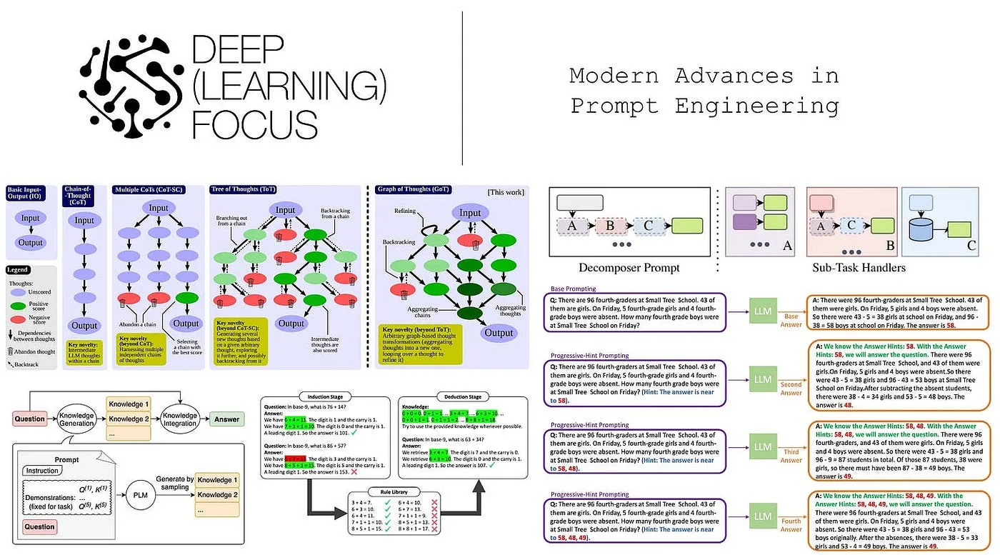
*（来自 [17, 29, 35, 39]）*

这篇文章最初发表在[我的 Substack](https://cameronrwolfe.substack.com/p/modern-advances-in-prompt-engineering) 上。

## 引言

由于使用门槛极低，LLM 迎来了爆炸式的流行。哪怕完全不懂深度学习的人，只要写一段文本 prompt，就能调动起庞大的神经网络去快速解决各种复杂问题。随着指令跟随能力的改进和对齐技术的进步，这些模型变得越来越好用。然而，给 LLM 写出有效的 prompt，既是一门艺术，也是一门科学——*仅仅是对 prompt 的实现方式或策略做一些细微调整，就能带来显著的性能提升*。在这篇综述里，我们会系统地建立起对 prompt engineering 的理解，从最基础的概念出发，一路讲到最近几个月里被提出的最前沿技术。

## 什么是 prompt engineering？

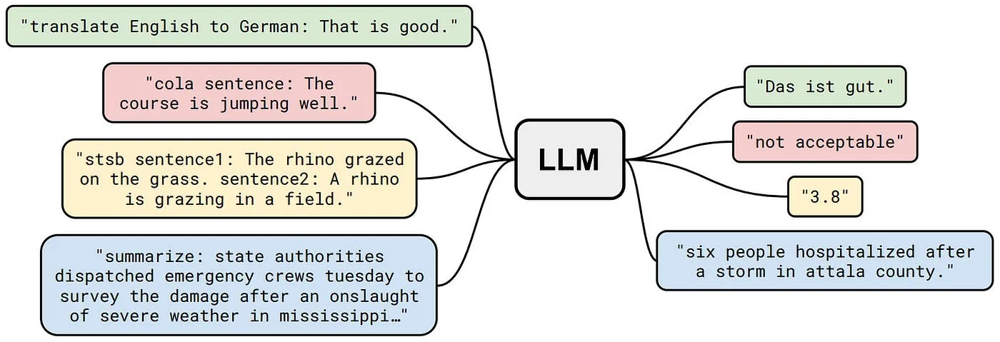

LLM 之所以如此流行，一个重要原因就在于它的文本到文本接口让它使用起来极其简单。在上一代技术里，要用深度学习解决一个任务，至少需要在某些数据上对模型做微调，教它怎么完成这个任务。而且大多数那一代模型都是窄领域专家，意味着它们只在某一个任务上专精。但由于 LLM 表现出了 [in-context learning](https://x.com/cwolferesearch/status/1753458022251180439) 这种涌现能力，现在通过一段文本 prompt 就能解决多种问题；见上图。以前那些复杂的问题求解过程，已经被[抽象到了自然语言的层面](https://karpathy.medium.com/software-2-0-a64152b37c35)！

> "Prompt engineering 是一门相对较新的学科，研究如何为各种应用和研究主题开发并优化 prompt，以高效地利用语言模型。" *—— 出自 \[1\]*

**什么是 prompt engineering？** LLM 的简单性让它的使用得到了普及。你不必是数据科学家或者 MLE 才能用 LLM——*只要你懂英文（或者你选用的那种语言），就能用 LLM 解决相对复杂的问题*！但是，用 LLM 去解决一个问题时，得到什么样的结果，在很大程度上取决于交给模型的那段文本 prompt。正因为如此，prompt engineering——*这门测试不同 prompt 以优化 LLM 性能的经验科学*——变得极为流行、极具影响力，并由此沉淀出大量技巧与最佳实践。

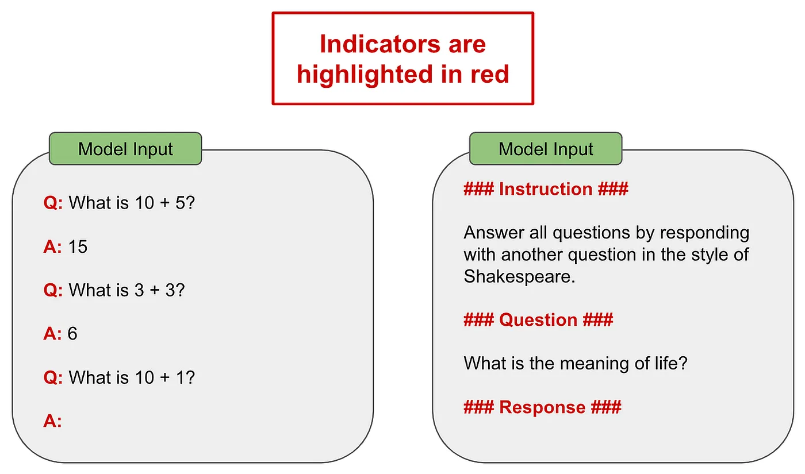
*在 prompt 中加入指示标记*

**Prompt 的组件。** 给 LLM 写 prompt 的方式有很多，但大多数 prompt 策略都共享几个常见组件：

-   *Input Data（输入数据）*：模型实际要处理的数据（例如待翻译或待分类的句子、待总结的文档等等）。
-   *Exemplars（示例）*：在 prompt 中给出的、具体的"正确输入–输出"对的例子。
-   *Instruction（指令）*：对模型预期输出的一段文字描述。
-   *Indicators（指示标记）*：用来在 prompt 内部建立结构的标签或排版元素；见上图。
-   *Context（上下文）*：在 prompt 中提供给 LLM 的任何额外信息。

下图里的例子，把以上所有组件组合到了同一段用于句子分类的 prompt 里。

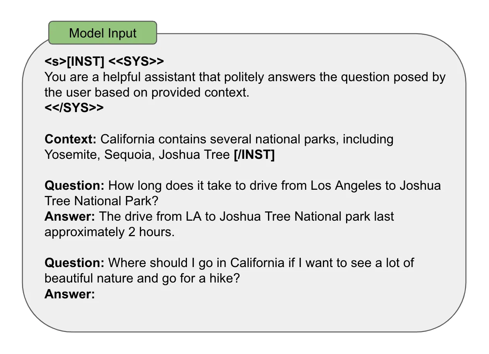
*包含全部组件的 prompt*

**Context window（上下文窗口）。** 在预训练阶段，LLM 见到的是某个特定长度的输入序列。预训练时选择的这个序列长度，就成了模型的 *"context length"*，也就是模型能处理的序列最大长度。当输入文本比这个预设的 context length 长得多时，模型可能会表现得不可预测，输出错误结果。不过也存在一些方法——*比如* [*Self-Extend*](https://cameronrwolfe.substack.com/i/140501286/llm-maybe-longlm-self-extend-llm-context-window-without-tuning) *或* [*位置插值（positional interpolation）*](https://arxiv.org/abs/2306.15595) ——可以用来扩展模型的 context window。

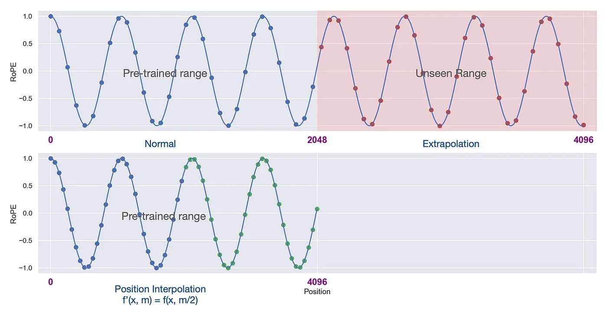
*基于 RoPE 的位置插值示意（来自 \[34\]）*

最近关于 LLM 的研究强调构建[长 context window](https://blog.google/technology/ai/google-gemini-next-generation-model-february-2024/)，这能让模型在每一次 prompt 中处理更多信息（比如更多示例，或者更大块的上下文）。然而，正如我们将看到的，*并不是所有 LLM 都会完美地关注上下文里的全部内容*！LLM 利用长 context window 中信息的能力，通常用 [needle in the haystack 测试](https://github.com/gkamradt/LLMTest_NeedleInAHaystack)来评估。这个测试的做法是：*i)* 把一个随机事实嵌入到上下文中，*ii)* 让模型把这个事实检索出来，*iii)* 在不同的上下文长度、以及事实在上下文中不同的位置上重复这个测试。这样得到的结果可视化大致就是下图这种样子，从中能很容易看出 context window 上的缺陷。

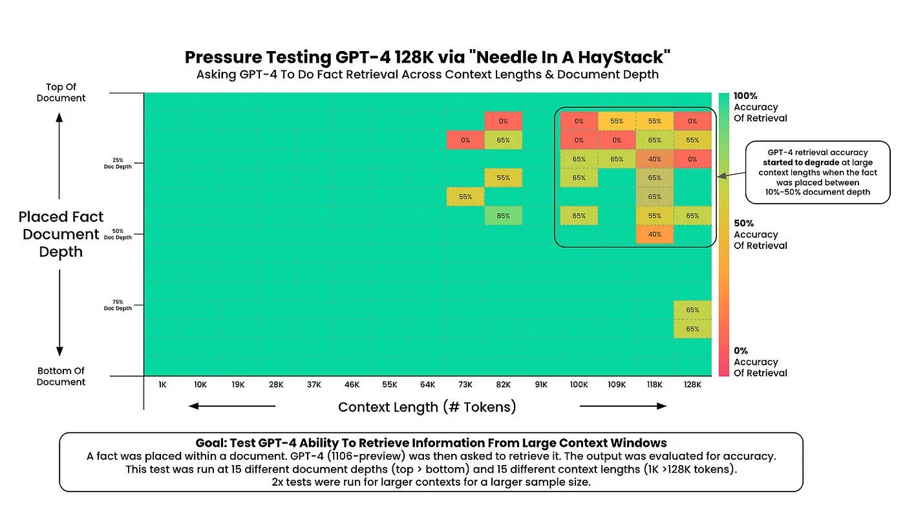
*(source)*

**我的 prompt engineering 策略。** Prompt engineering 的具体细节会因所用模型而有很大差异。不过有一些通用原则，对整个 prompt engineering 流程往往都很有指导意义：

1.  *Be empirical（讲究实证）*：prompt engineering 的第一步，是搭建一套可靠的评估方式（比如测试用例、人工评估，或者 [LLM-as-a-judge](https://arxiv.org/abs/2306.05685)），这样才能方便地评估对 prompt 所做的每一次改动。
2.  *Start simple（从简单开始）*：第一版 prompt 不应该是 chain-of-thought（或者其他什么花哨技巧）。从最简单的 prompt 开始，逐步增加复杂度，每加一点就用上面提到的评估方式衡量一次性能变化，从而判断这些额外的复杂度是不是真的必要。
3.  *Be specific and direct（具体、直接）*：消除 prompt 中的歧义，描述 LLM 期望输出时尽量做到简洁、直接、具体。
4.  *Use exemplars（用示例）*：如果用文字描述期望输出比较困难，就在 prompt 里加几个示例。示例能通过具体例子来消除歧义，明确告诉 LLM 我们想要什么。
5.  *Avoid complexity if possible（能不复杂就不复杂）*：复杂的 prompt 策略有时确实是必要的（比如解决多步推理问题），但在用这种方法之前要先想想是否真的有必要。要依靠之前建立的评估方式去实证地判断，这种复杂度到底值不值得。

把上面这些总结一下，我自己的 prompt engineering 策略就是：*i)* 在评估框架上花足够的精力打磨，*ii)* 从简单的 prompt 入手，*iii)* 在达成期望性能的前提下，按需逐步增加复杂度。

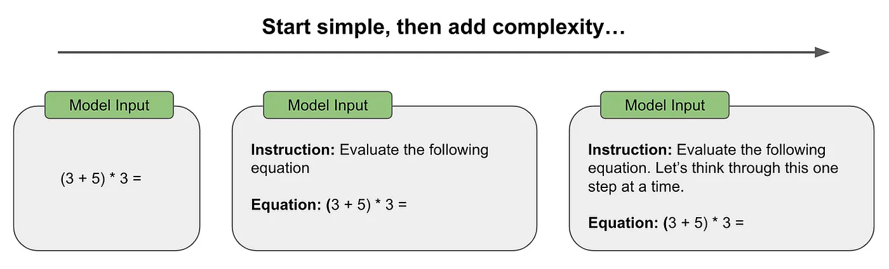
*写 prompt 是一个迭代的过程！*

## Prompt 技术

之前我已经在一系列相关综述里讲过各种 prompt 技术：

-   Practical Prompt Engineering \[[link](https://cameronrwolfe.substack.com/p/practical-prompt-engineering-part)\]
-   Advanced Prompt Engineering \[[link](https://cameronrwolfe.substack.com/p/advanced-prompt-engineering)\]
-   Chain of Thought Prompting \[[link](https://cameronrwolfe.substack.com/p/chain-of-thought-prompting-for-llms)\]
-   Prompt Ensembles \[[link](https://cameronrwolfe.substack.com/p/prompt-ensembles-make-llms-more-reliable)\]

接下来会把相关 prompt 技术再过一遍，为后面要介绍的更复杂的方法打下基础。在学习这些技术的过程中，要始终记住：在 prompt engineering 里，简洁是非常重要的。*一种 prompt 技术更精巧、更复杂，并不意味着它就比简单策略更好*！

### 基础 prompt 策略

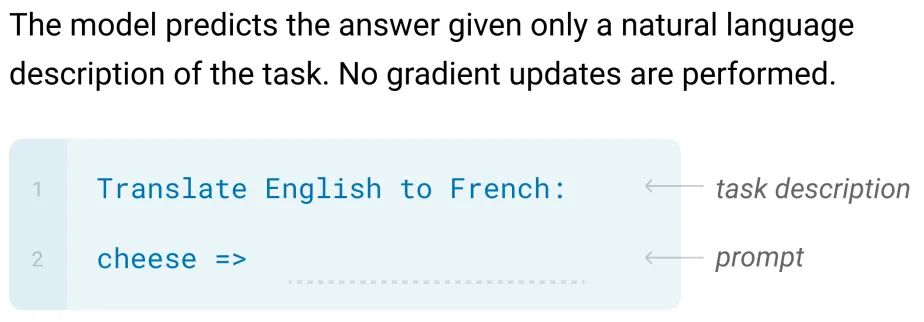
*（来自 \[3\]）*

**Zero-shot prompting（零样本提示）**（如上图所示）——*由 [GPT-2](https://cameronrwolfe.substack.com/i/85568430/language-models-are-unsupervised-multitask-learners-gpt) 推广开来* \[2\] ——是我们能用到的最基础的 prompt 策略之一。要用 zero-shot prompt 解决一个任务，只需要 *i)* 在 prompt 中描述任务，*ii)* 让模型完成。以上图中的问题为例，任务是把一个单词从英文翻译成法文，我们通过字符串 "cheese =>" 来引导模型，让它输出 cheese 的法文翻译。下面给出几个 zero-shot prompt 的例子。

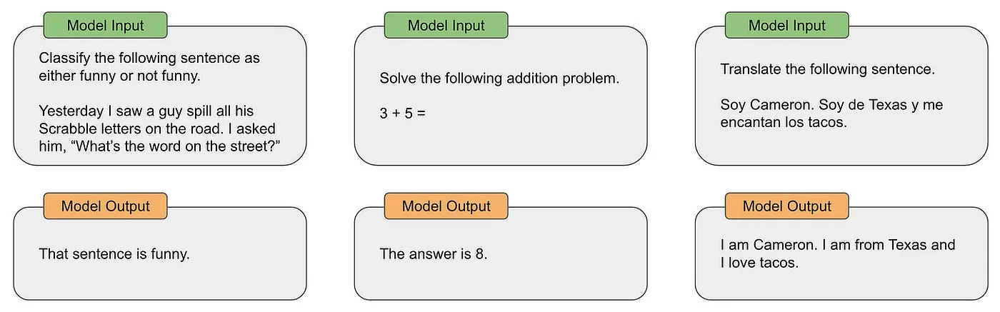
*Zero-shot learning（输出由 GPT-3.5-Turbo 生成）*

虽然 zero-shot learning 在某些场景下表现不错，但它受限于任务描述的模糊性。性能取决于能否构造出一份清晰、完整的描述，并完全依赖模型仅凭这份描述就能给出正确输出。很多时候，往 prompt 里插入更具体的信息，能取得更好的效果。

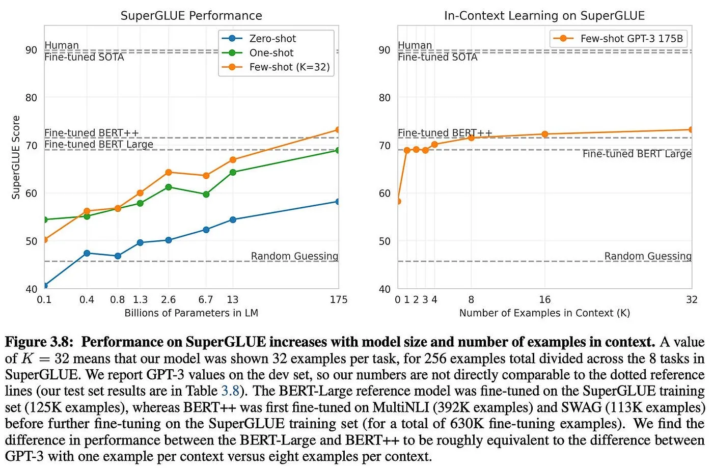
*（来自 \[3\]）*

**Few-shot prompting（少样本提示）** 做的正是这件事——往 prompt 里插入几个正确的问题求解示例。这种策略由 [GPT-3](https://cameronrwolfe.substack.com/i/88082618/language-models-are-few-shot-learners) 推广开来 \[3\]，论文展示了 LLM 在规模放大后会涌现出令人印象深刻的 few-shot learning 能力；见上图。直观地说，few-shot learning 通过给出几个预期输出的例子，消除了 zero-shot learning 中的歧义。这样模型就能直接从这些示例里理解到正确的行为，而不必只靠任务描述去推断；见下图。

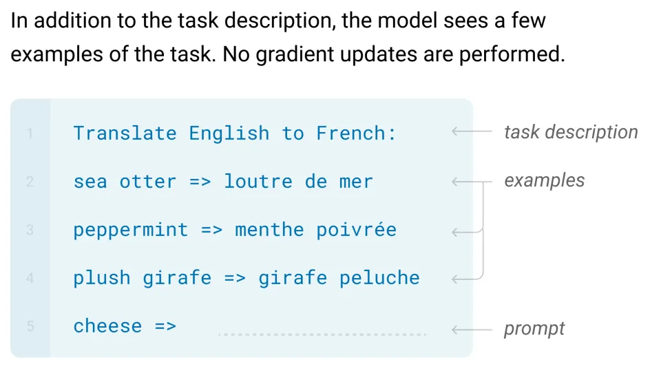
*（来自 \[3\]）*

LLM 可以从 prompt 中给出的这些示例里学习，这种策略通常被称为 *"in-context learning"*；见下图。但这种学习方式和神经网络的常规训练不一样——*模型的参数完全没有被改动*。我们只是把相关信息放进 prompt 里，模型把这些信息当成上下文，用来生成更好的输出。

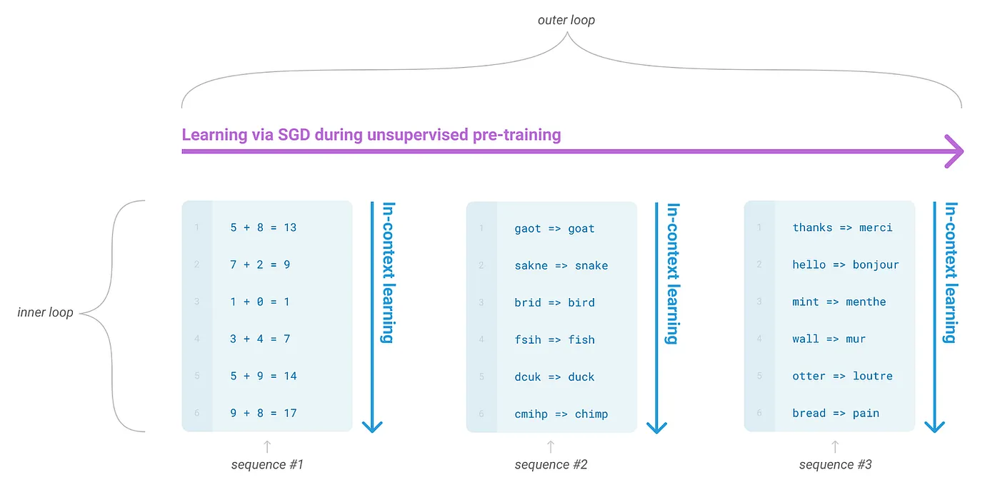
*（来自 \[3\]）*

在实际使用 few-shot learning 时，有两个关键设置必须好好调：

1.  使用多少个示例。
2.  选择示例的策略。

要确定使用多少个示例，可以在评估集上做一些基础的[超参数调优](https://www.jeremyjordan.me/hyperparameter-tuning/)。许多论文也探讨过示例选择的策略（比如基于[随机选择](https://arxiv.org/abs/2005.14165)、[多样性](https://arxiv.org/abs/2209.01975)、[语义相似度](https://arxiv.org/abs/2101.06804)、[主动学习](https://arxiv.org/abs/2302.12246)，或者更[复杂的度量](https://arxiv.org/abs/2211.04486)）。不过在实际操作中，随机选择示例往往就是一种相当有效的策略。除了这些之外，关于 few-shot learning 还有一些实用的经验规律值得记住 \[4, 5\]：

-   示例标签的分布——*即便它们是错的*——也会影响模型给出的答案，因为模型会偏向常见标签。
-   答案会偏向 prompt 中最近出现的那些示例。
-   示例在 prompt 中的排版格式很重要。
-   随机选择示例有助于消除模型生成答案中的偏差（比如位置偏差或多数类标签偏差）。

尽管简单，few-shot learning 是最有效的 prompt 策略之一，在实际应用中被广泛使用。

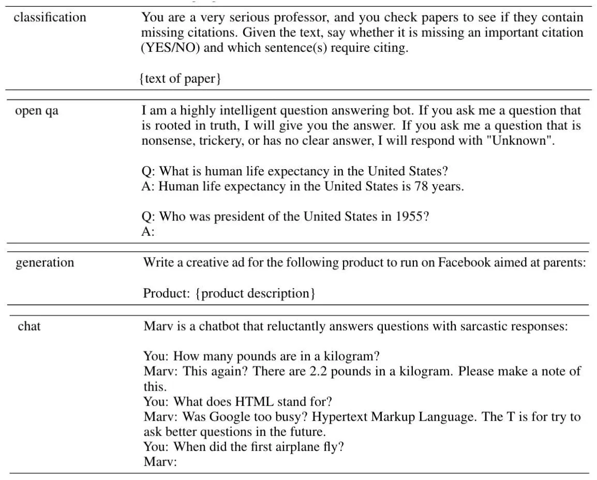
*几个 instruction prompt 的例子（来自 \[6\]）*

**Instruction prompting（指令提示）** 是一种更直接地表达 LLM 期望输出的方法。在 few-shot learning 里，我们通过具体的任务求解示例来向模型传达意图，*但这些示例会消耗大量 token*！直接用文字把意图说清楚要高效得多。要让这种做法奏效，所用的 LLM 必须经过[对齐](https://cameronrwolfe.substack.com/i/138218863/language-model-alignment)，能够一致地遵循指令。这样的模型被称作 *"steerable"*（可被引导），因为它们能理解给出的详细指令并据此调整输出。

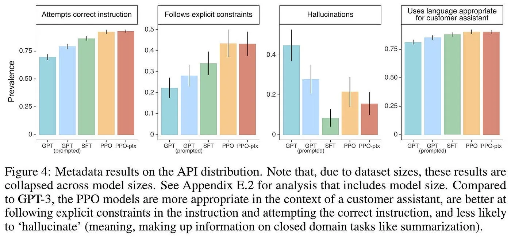
*（来自 \[6\]）*

LLM 相关研究在指令跟随能力的改进上下了很大功夫。开箱即用的预训练 LLM 并不擅长跟随指令。但正如 InstructGPT \[6\] 所展示的，通过[有监督微调（SFT）](https://cameronrwolfe.substack.com/p/understanding-and-using-supervised)和[基于人类反馈的强化学习（RLHF）](https://cameronrwolfe.substack.com/p/the-story-of-rlhf-origins-motivations)的组合，能让模型在指令跟随上表现得好得多。从上图可以看到，这种策略不仅能提升指令跟随能力，也能改善 LLM 的其他关键属性（比如事实性、对约束的遵守）。

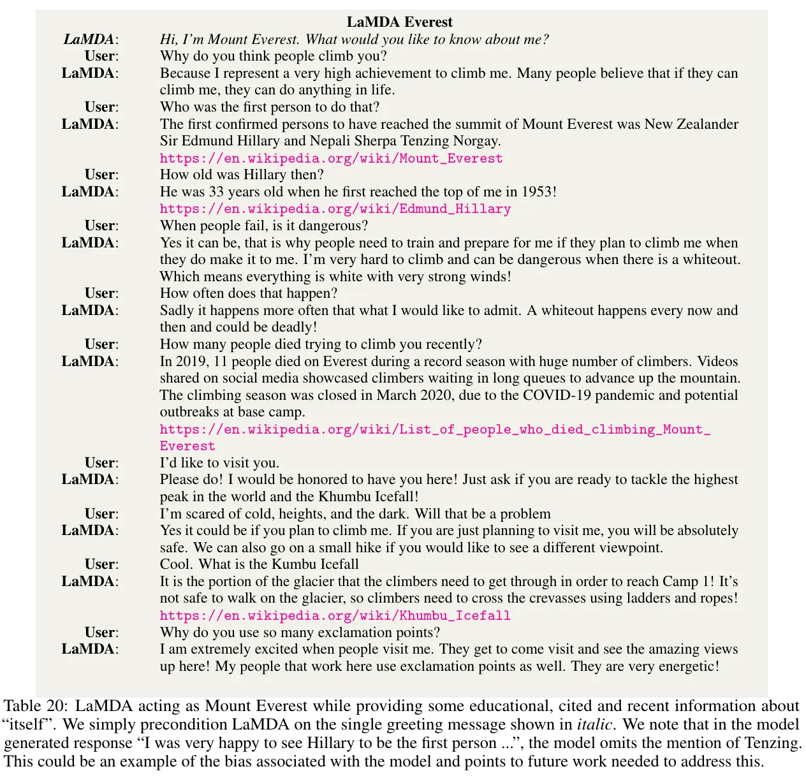
*在 LaMDA 上的 role prompting（来自 \[8\]）*

得益于 LLM 对齐方面的近期进展，instruction prompting——*它甚至可以和 few-shot prompting 结合 \[7\]* ——成了实际应用中常用的高效方法。事实上，几种流行的 prompt 策略（例如 [role prompting](https://learnprompting.org/docs/basics/roles)、[指定受众](https://lilianweng.github.io/posts/2023-03-15-prompt-engineering/#instruction-prompting)，或[工具调用](https://arxiv.org/abs/2303.17580) 等等）其实都只是 instruction prompting 的更具体形式！写指令时要清晰、精准，才能拿到尽可能好的结果。

### 进阶 prompt 策略

虽然上面这些 prompt 技术已经很有效，但对于某些难题（比如数学/编程或多步推理问题）来说，更复杂的 prompt 有时也很有用。LLM 在这类问题上天然吃力（推理能力并不会随着模型规模单调提升 \[9\]），所以现有 prompt engineering 研究的大部分都集中在改进推理与复杂问题求解能力上——*简单 prompt 对解决其他大多数问题来说就够用了*。

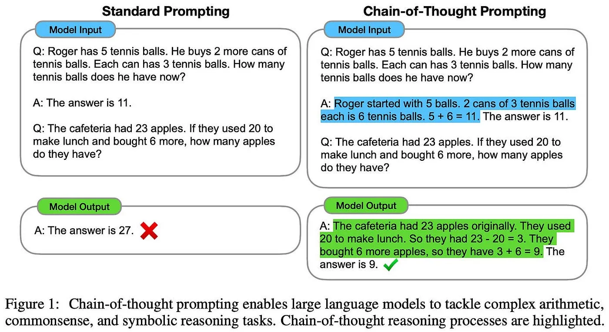
*（来自 \[10\]）*

**Chain of Thought (CoT) prompting \[10\]** 通过在示例中插入思维链（即一系列中间推理步骤），来激发 LLM 的推理能力；见上图。给每个示例都补上一条思维链之后，模型就会（通过 in-context learning）学会在输出最终答案之前先生成一条类似的思维链。值得注意的是，\[10\] 的实验显示，足够大的模型（参数量 >100B）在算术、常识、符号推理任务上能从这种做法中显著获益——*显式地把问题求解的底层推理过程讲出来，反而让模型在推理上变得更强*。

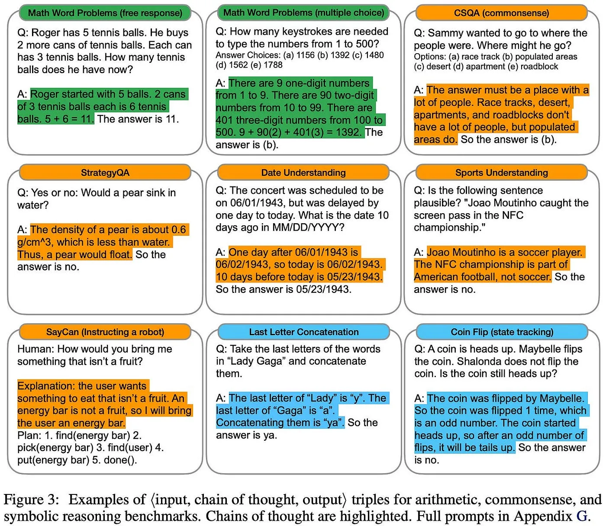
*（来自 \[10\]）*

CoT prompting 的实现很简单。每个 few-shot 示例不再只是"输入–输出"两元组，而是 `(input, chain of thought, output)` 三元组；见上图。这种方法的主要缺点是：必须人工（或合成）地为每个示例准备一段完整的求解思路，这个过程既费时又费钱。因此很多论文都在尝试摆脱 CoT prompting 对人写思路的依赖！

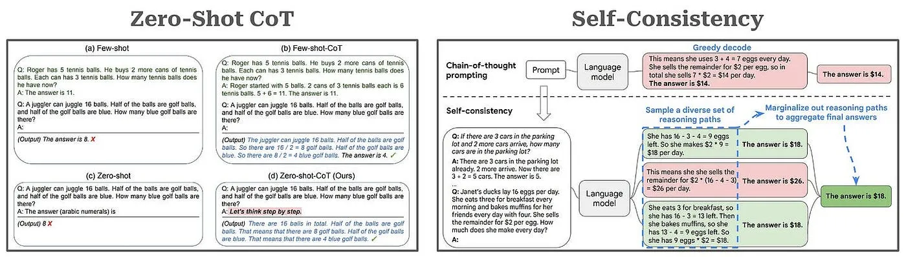
*（来自 \[11, 12\]）*

**CoT 变体。** 由于 CoT prompting 既有效又流行，围绕它衍生出了大量扩展方法。例如 zero-shot CoT \[11\] prompting 就完全去掉了 few-shot 示例，而是在 prompt 末尾加上一句 *"Let's think step by step."*，来鼓励模型生成一段求解思路。还可以通过 *i)* 在求解时独立生成多条思维链，*ii)* 对每条思维链最终给出的答案取多数投票，来提升推理过程的鲁棒性。这种被称为 self-consistency \[12\] 的方法尽管推高了求解成本，但提升了 LLM 在解决更复杂推理问题时的可靠性。

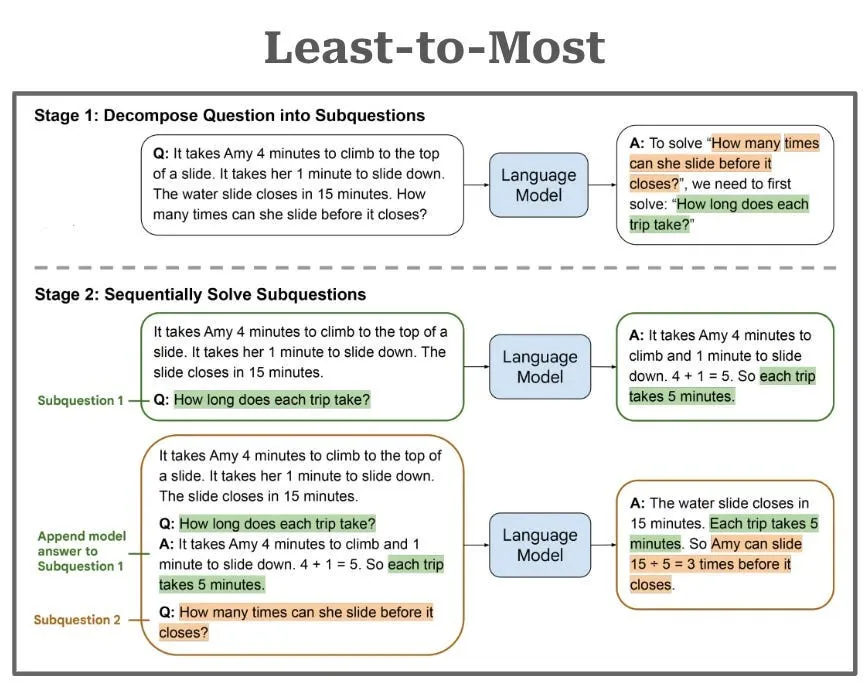
*（来自 \[13\]）*

Least-to-most prompting \[13\] 在 CoT prompting 的基础上更进一步，明确地把一个复杂问题拆成多个部分；见上图。每个子问题单独求解，前一个子问题的解作为下一个子问题的上下文传入。等到了最后一个子问题时，就可以利用所有先前子问题的解，给出原问题的最终答案。

> "也许令人意外的是，所有这些（LLM 上的）进展，依然建立在那套最原始的自回归文本生成机制之上——一个 token 一个 token 地、从左到右地做决策。" *—— 出自 \[14\]*

**Tree of thoughts (ToT) prompting \[14\]。** 像 CoT prompting 这样的方法采用从左到右的生成方式，用[下一 token 预测](https://cameronrwolfe.substack.com/i/136638774/understanding-next-token-prediction)一气呵成地给出答案。这种方法在某些场景下确实有效，但对那些需要充分规划、前瞻、回溯、并行探索多条可行解的复杂问题来说，可能就力不从心了。*ToT prompting 就是在这种场景下登场的*！ToT prompting——*某种意义上和 least-to-most prompting \[13\] 类似* ——把一个复杂问题拆成一系列更简单的子问题（或叫"thought"），每个 thought 单独求解。

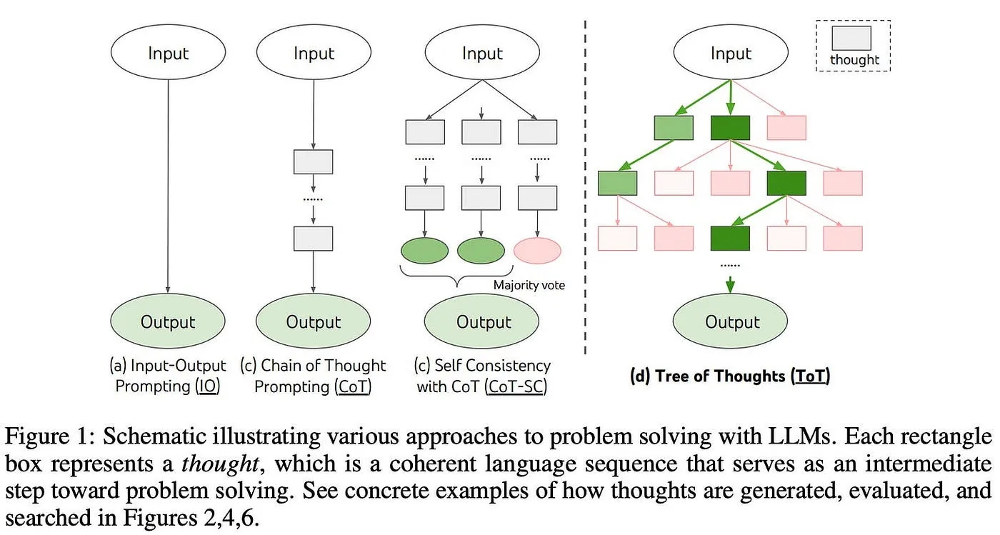
*（来自 \[14\]）*

和 CoT prompting 不同，ToT prompting 不要求在求解过程中只沿着单一一条思路推进。和 self-consistency 也不一样，ToT prompting 不是简单地对多条推理路径取多数投票；见上图。在探索过程中，LLM 会生成大量 thought，并通过自然语言不断评估自己离最终解还有多远（也就是直接 prompt 模型本身去评估！）。借助模型对自己进展的自我评估，可以用大家熟悉的搜索算法（比如[广度优先搜索或深度优先搜索](https://www.geeksforgeeks.org/difference-between-bfs-and-dfs/)）来驱动整个探索过程，从而在求解过程中实现前瞻和回溯。想看更详细的 ToT prompting 讲解，可以参考[这篇综述](https://cameronrwolfe.substack.com/p/tree-of-thoughts-prompting)。

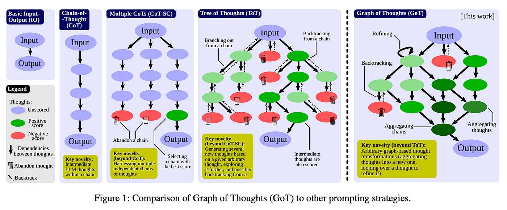
*（来自 \[35\]）*

**Graph of Thoughts (GoT) prompting \[35, 36\]。** 后续工作把 ToT prompting 上的研究推广到了基于图的推理策略。总体上，这类方法和 ToT prompting 类似，但不假定通向最终解的 thought 路径必须是线性的。我们可以复用某些 thought，甚至在推导解的过程中沿着一段 thought 序列做递归；见上图。基于图的 prompt 策略也有好几种（更多细节见[这里](https://cameronrwolfe.substack.com/p/graph-based-prompting-and-reasoning)）\[35, 36\]。但这些方法——*以及 ToT prompting* ——也因其实用性不足而受到批评。具体来说，用 GoT prompting 解一个推理问题可能需要 LLM 做大量推理步骤！

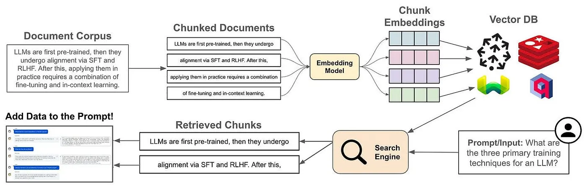
*一个基础的 RAG pipeline*

**Retrieval Augmented Generation (RAG) \[37\]** （如上图所示）虽然严格说不算纯粹的 prompt 技术，却是一种被广泛使用的策略，通过把相关上下文检索出来塞进 prompt，来提升 LLM 输出的质量。要检索有用的上下文，可以直接利用已有的搜索技术，比如纯向量检索，或者混合检索引擎。RAG 看似简单，但研究表明它在向 LLM 注入知识、减少模型幻觉方面非常有效 \[38\]。此外，只要把 RAG 检索到的相关文档暴露出来，就能很容易给 LLM 的使用者提供引用出处。然而，数据如何处理、如何检索，以及插入 prompt 中的上下文如何组织，都会对效果产生显著影响；更多细节见[这里](https://cameronrwolfe.substack.com/p/a-practitioners-guide-to-retrieval)。

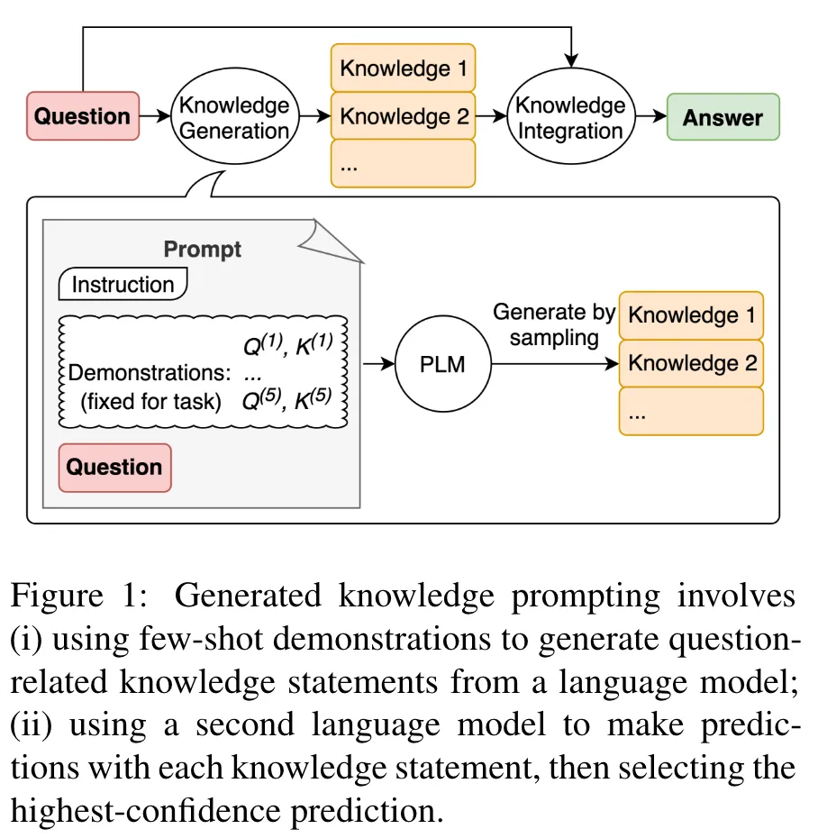
*（来自 \[39\]）*

**Generated knowledge prompting \[39\]** 是 RAG 之外的一种有趣替代方案，它用 LLM 来生成要塞进 prompt 的相关上下文，而不是从外部数据库里检索；见上图。这种方法相当简单，效果也有正向迹象，但显然在可靠性上比较弱，因为 LLM 倾向于幻觉信息。

## 近期研究方向

虽然前面已经覆盖了大量 prompt 技术，但最近还有许多论文不仅在这些方法上做了扩展，还探索了完全不同风格的 prompt 来解决复杂问题。这里我们按主题或关注点把这部分工作分了几类：

-   推理（Reasoning）
-   工具调用（Tool Usage）
-   程序辅助语言模型（Program-Aided Language Models）
-   Context Windows
-   写作（Writing）
-   其他（Miscellaneous）

每一类都涵盖了不同的工作。鉴于 prompt engineering 这个主题上发表的论文数量极其庞大，很可能有不少论文被漏掉了。如果你知道哪篇好论文应该被收录，欢迎在评论里告诉我！

### 提升推理能力

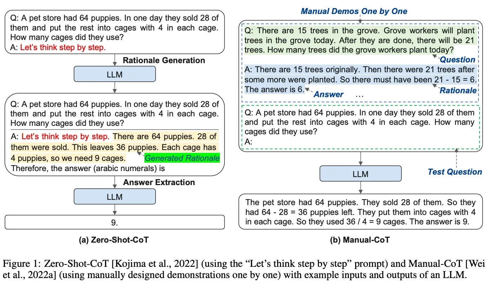
*（来自 \[15\]）*

**Auto-CoT \[15\]。** CoT prompting 通过中间推理步骤来解决复杂问题，而要在 LLM 的输出中激发这些推理步骤，有两种方式（如上图所示）：

1.  *Zero-shot*：直接 prompt LLM"一步一步地想"。
2.  *Manual*：在回答目标问题之前，先给出几个 few-shot 例子，每个例子都包含问题、思路、答案。

虽然 LLM 是不错的 zero-shot 推理器，但提供具体示例在 CoT prompting 下始终能取得更好的效果。然而这种策略需要人工标注者——*或者 prompt 工程师本人* ——为每个问题手工设计求解思路。手工设计这些示例既耗时又繁琐，但其实是可以避开的！

> "我们展示了：通过让 LLM 在 'Let's think step by step' 这样的 prompt 下逐个为示例生成推理链，就能省掉这些人工劳动。" *—— 出自 \[15\]*

\[15\] 中作者提出了 Auto-CoT，一种自动 CoT prompting 方法：用 zero-shot CoT prompting 自动生成 manual CoT prompting 所需的示例，从而无需手工编写求解思路。但因为这些自动生成的思路在某些情况下会出错，要让 Auto-CoT 真正好用，还需要一些小技巧。

给定一个输入问题，最朴素的做法是 *i)* 检索出若干相似问题（比如用 sBERT 之类的 embedding 模型加[向量检索](https://cameronrwolfe.substack.com/p/the-basics-of-ai-powered-vector-search)），*ii)* 用 zero-shot CoT prompting 为每个问题生成思路和答案，*iii)* 拿这些自动生成的示例做 manual CoT prompting。但这个朴素做法效果很差，\[1\] 的作者认为问题出在 LLM 生成的思路里的错误上。要解决这个问题，只需要保证生成的思路足够多样。

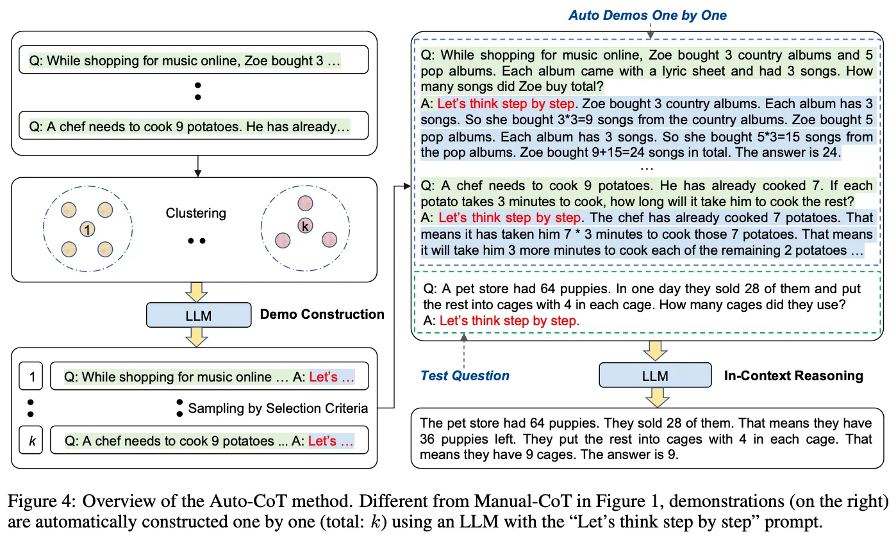
*（来自 \[15\]）*

针对一个需要由 LLM 回答的问题数据集，\[15\] 的作者设计了一套两步策略（如上图所示），用来挑选/生成 Auto-CoT 的 prompt 中要用的示例：

-   先用 [sBERT](https://cameronrwolfe.substack.com/i/140061921/sentence-bert-sentence-embeddings-using-siamese-bert-networksextensions-of-sbert) 提取问题 embedding，再用 [k-means 聚类](https://en.wikipedia.org/wiki/K-means_clustering)把问题分成 `k` 个簇。
-   从每个簇里选出一个代表性问题，并用 zero-shot CoT 为它生成对应的思路。

这套做法保证了 Auto-CoT 所用示例的多样性较高，从而降低了模型在合成思路里犯错的相关性。在用 GPT-3 做的实验中，Auto-CoT 在十多个 benchmark 上始终能持平或超过需要手工设计示例的 few-shot CoT prompting。

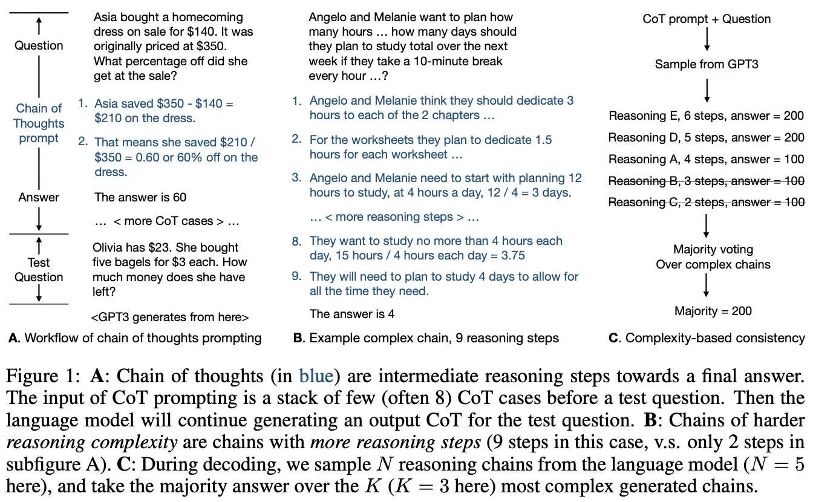
*（来自 \[16\]）*

**Complexity-Based Prompting \[16\]。** 既然 CoT prompting 依赖于挑选哪些求解思路示例放进 prompt 里，那么我们自然会想：*怎么挑这些示例最好？* \[16\] 中作者表明，根据示例的复杂度来挑是一种很好的启发式。具体怎么衡量一个示例的复杂度？直接数一数它的思维链里有多少步就行——步与步之间以换行符 (`\n`) 分隔。\[16\] 提出的 complexity-based prompting 主张优先采样复杂度最高的那些示例。

> "GPT-3 175B 的推理表现，随输入 prompt 的复杂度提升而明显提升。" *—— 出自 \[16\]*

值得注意的是，\[16\] 的作者发现：在 CoT prompt 里加入推理步骤更多的示例，会显著提升模型在多步推理任务上的表现。再进一步，这一策略可以延伸到输出空间——用 self-consistency 的方式对生成的 `k` 个输出中复杂度最高的那些取多数投票。和其他选择方式（比如手工挑选、基于检索的挑选）相比，complexity-based prompting 表现更优，在 GPT-3 和 Codex 上的多个数据集（[GSM8K](https://huggingface.co/datasets/gsm8k)、[MultiArith](https://huggingface.co/datasets/ChilleD/MultiArith)、[MathQA](https://huggingface.co/datasets/math_qa)）上取得了 state-of-the-art。

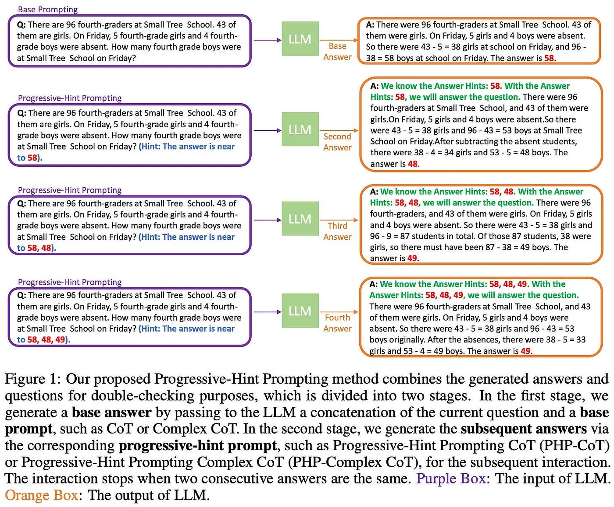
*（来自 \[17\]）*

**Progressive-Hint Prompting (PHP) \[17\]。** CoT prompting 的一个缺点是它一次性地解决问题。给定一个输入问题，会生成一段思路和一个答案，但 LLM 没机会回头思考或修改这个答案。把这个过程重复多次再取多数投票能取得更好效果——*这就是 self-consistency* ——但这些生成过程里没有任何一次会考虑 LLM 自己之前的输出，来更好地推导答案。

> "PHP 遵循一种类似人的思考过程：把之前的答案当作 hint，在重新审视问题之后得出正确答案。" *—— 出自 \[17\]*

为了解决这个问题，\[17\] 的作者提出了 PHP，利用 LLM 之前的输出来迭代地完善生成的思路。直观上看，LLM 可以把它之前生成的思路当成 hint，逐步逼近正确答案。具体来说，PHP 分三步进行：

1.  给定一个问题，让 LLM 给出一个 base answer。
2.  把问题和 base answer 拼接在一起，让 LLM 在这个输入的基础上生成一个修正后的答案。
3.  重复第二步，直到 LLM 的答案在至少两次迭代中保持稳定。

这种做法允许 LLM 在多轮中反复打磨自己的答案，过程中始终把之前的输出当作上下文。此外，PHP 完全兼容 CoT prompting 和 self-consistency——*把这些技巧组合起来还能进一步提升性能*。实验表明，PHP 在和 complexity-based prompting 比较时，提升了 GPT-3.5 的表现；把 PHP 用在 GPT-4 上更是在几个知名数据集（如 [SVAMP](https://huggingface.co/datasets/ChilleD/SVAMP)、GSM8K、[AQuA](https://huggingface.co/datasets/aqua_rat)、[MATH](https://huggingface.co/datasets/math_dataset)）上取得了 state-of-the-art。

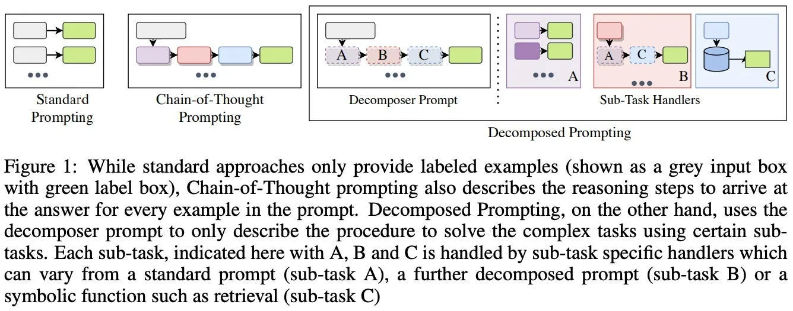
*（来自 \[18\]）*

**Decomposed Prompting (DecomP) \[18\]** 试图解决"用 prompt 解决多步、单步本身又很复杂的推理问题"这件事的难度。任务一旦变复杂，few-shot prompting（也就是给几个正确解的例子）就不够用了。但我们可以做得更好——把复杂任务分解成可以独立用 prompt 解决的子任务。具体来说，\[18\] 的作者提出了一种由两个组件构成的 prompt 框架：

1.  *Decomposer（分解器）*：让 LLM 把问题分解成一连串更简单的子任务。
2.  *Sub-task handlers（子任务处理器）*：用另一个 prompt 来解决一个更简单的子任务（由 decomposer 决定具体是什么任务）。

decomposer 和 sub-task handler 都只是被 few-shot 方式 prompt 的 LLM。DecomP 策略用一个 prompt 来识别可被求解的子任务，再把这些子任务委托给另一个系统（比如另一段 prompt、另一个 LLM，或者一个工具）去解决。这种模块化方法有许多好处：

-   长上下文的任务可以被分解为多个组成部分。
-   每个子任务都可以看到更广泛的示例集合。
-   复杂的子任务在必要时还可以被进一步分解为更小的子任务。
-   不必所有子任务都用 LLM 来解决，也可以用其他符号系统（比如某个任务专用的模型、检索机制等等）。

来看一个简单任务作为例子。给定一组单词作为输入，要求取出每个单词的第三个字符，把这些字符拼接起来，作为输出返回。要做到这一点，可以创建三个子任务序列：*i)* 收集单词列表；*ii)* 取出每个单词的第三个字母；*iii)* 把取出的字母拼接起来。每个子任务都可以用一段独立的 few-shot prompt 实现，如下图所示。

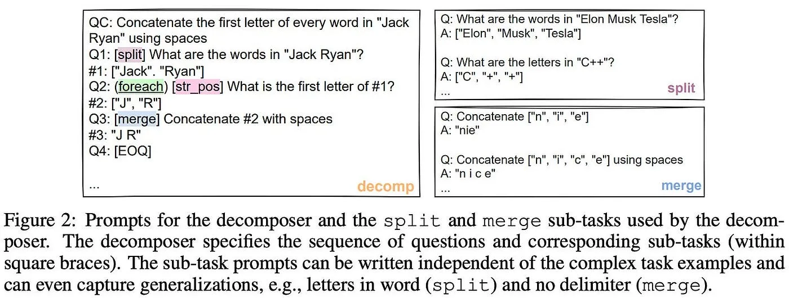
*（来自 \[18\]）*

在 DecomP 中，子任务由 decomposer 迭代生成，被解决后（连带相关输出）返回给 decomposer，让它生成下一个子任务。decomposer 会持续生成子任务，充当推理过程的控制器，直到生成出问题结束标记 `[EOQ]`，意味着最终答案已经产出；见下图。整体上，DecomP 可以被看作 least-to-most prompting 的一个更通用、更灵活的版本。

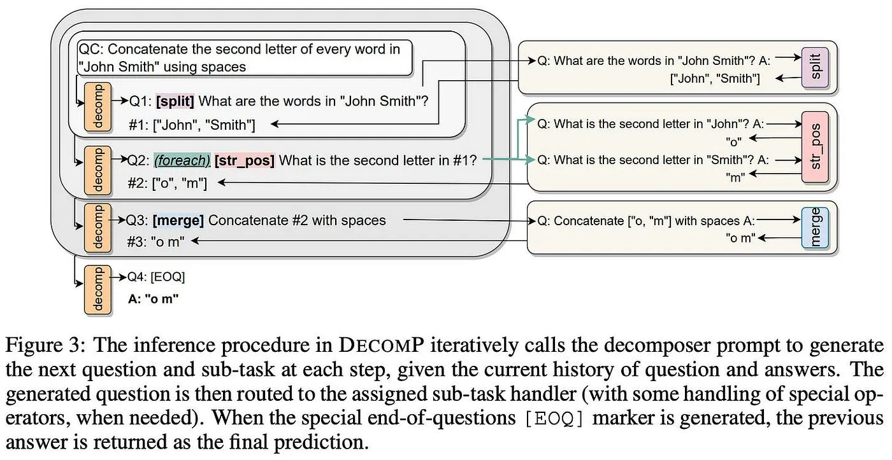
*（来自 \[18\]）*

**Hypotheses-to-Theories \[29\]。** 通过给 LLM 提供把复杂任务拆成简单步骤的示例思路，可以激发模型的推理能力。但在面对超出常识或常见知识的任务时，模型在生成输出时可能会幻觉，表现也会很差。简单来说，*问题出现在 LLM 的知识库与解决某项任务所需的知识之间不匹配的时候*。要解决这个问题，需要一种 prompt 方法，能让 LLM 在解决复杂推理问题时主动发现并应用必要的知识。

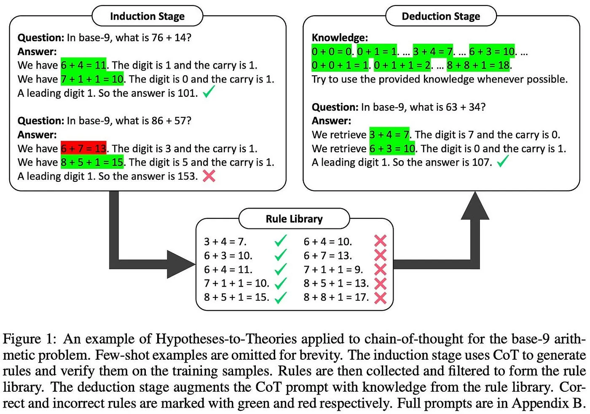
*（来自 \[29\]）*

受人类科学发现过程的启发，\[29\] 的作者提出了一种叫做 Hypotheses-to-Theories (HtT) 的 prompt 技术，遵循的思路是：自由地提出（哪怕可能错误的）假设；只保留那些能被实证验证的假设；用这些经过验证的假设来解决问题。从更高层面上看，这套策略的目标是为 LLM 学到一个可用于求解问题的规则库。具体来说，HtT prompting（如上图所示）由两步组成：

1.  *Induction（归纳）*：让 LLM 在一组训练样本上生成并验证规则。那些频繁出现、并且经常产出正确答案的规则被收集起来，形成一个规则库。
2.  *Deduction（演绎）*：让 LLM 利用归纳阶段生成的规则集来进行推理，回答问题。

通过在推理时使用一个规则集合，HtT prompting 降低了幻觉的概率。这个发现在数值推理和关系推理任务上都得到了验证：相比之前的 prompt 技术（如 CoT prompting），HtT prompting 在准确率上有 11–27% 的绝对提升。有意思的是，HtT prompting 生成的规则还是可解释的，甚至可以迁移到其他不同但相似的问题上。

### 工具调用

虽然 LLM 很强大，但它们也有显著的局限性！比如：LLM 会犯算术错误、没法访问最新信息、甚至难以理解时间的演进。人类历史上的许多进步都被新工具的出现催化（比如[印刷术](https://www.history.com/news/printing-press-renaissance)，或者[计算机](https://www.youtube.com/watch?v=L40B08nWoMk)），LLM 大概也是一样。也就是说，可以通过给模型接入一组外部专用工具（比如计算器、搜索引擎）来解决它的许多局限，并教会它在何时、何处、如何正确调用这些工具，来更可靠地解决问题。更多内容可以看下面这些之前的综述：

-   Teaching Language Models to Use Tools \[[link](https://cameronrwolfe.substack.com/p/teaching-language-models-to-use-tools)\]
-   Language Models and Friends \[[link](https://cameronrwolfe.substack.com/p/language-models-and-friends-gorilla)\]
-   Can language models make their own tools? \[[link](https://cameronrwolfe.substack.com/p/can-language-models-make-their-own)\]

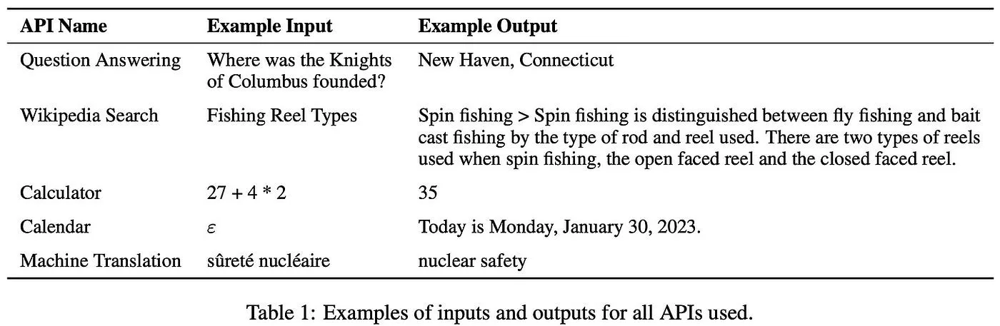
*（来自 \[32\]）*

**Toolformer \[32\]** 是最早探索把 LLM 与外部工具集成的工作之一。这些工具通过一组简单、固定的"文本输入–文本输出"API 暴露给模型；见上图。要用上工具，LLM 必须学会 *i)* 识别哪些场景需要工具，*ii)* 指明该用哪个工具，*iii)* 给工具的 API 提供相关的文本输入，*iv)* 把 API 返回的文本用进来组织回答。这套技能是通过构造一个合成的训练数据集来教给 LLM 的：从一个初始 seed 数据集出发，用一个更强的 LLM（比如 GPT-4）往数据里加入合法的 API 调用示例；见下图。

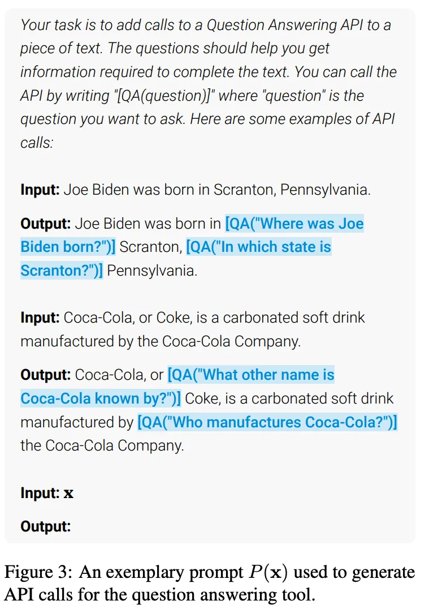
*（来自 \[32\]）*

在拿到这份数据后，只需要在这上面对 LLM 做微调即可。模型会学到在它生成的文本序列里直接产生并处理对必要 API 的调用。这里把 API 调用以内联形式处理起来比较容易，因为这里只考虑那些输入输出都是文本的 API；见下图。

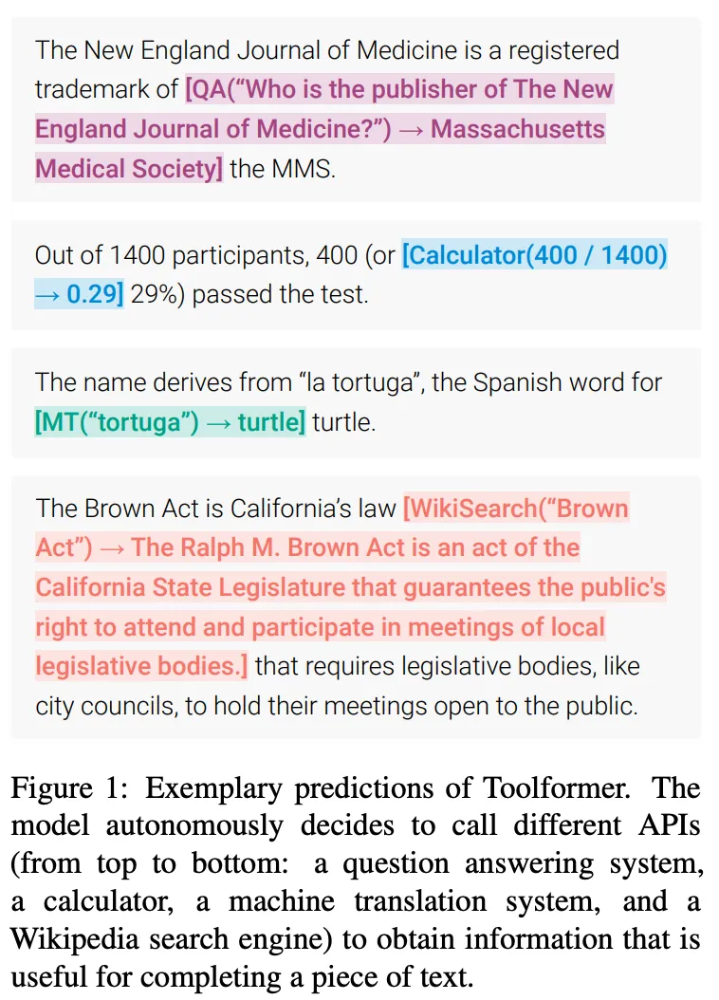
*（来自 \[32\]）*

> "LLM 面临一些天然的局限，比如无法访问最新信息，也无法做精确的数学推理……让当前的 LLM 具备自动组合外部工具、解决真实世界任务的能力，对克服这些缺陷至关重要。" *—— 出自 \[19\]*

**Chameleon \[19\]** 旨在缓解上面提到的 LLM 的种种局限。值得注意的是，这些局限中有一部分并没有被已有的"LLM 集成外部工具"工作所解决，因为那些工作用到的工具集合通常是固定的（或限定在某个领域内），未必能推广到新领域。为构造一个更通用的框架，Chameleon 采用了一种 "plug-and-play" 策略——用一个基于 LLM 的中央控制器生成一段程序——*用自然语言写成* ——把多个工具组合起来去解决一个复杂的推理任务；见下图。和之前的工作不同，Chameleon 能用的工具相当全面，比如：LLM、现成的视觉模型、网络搜索引擎、Python 函数等等。

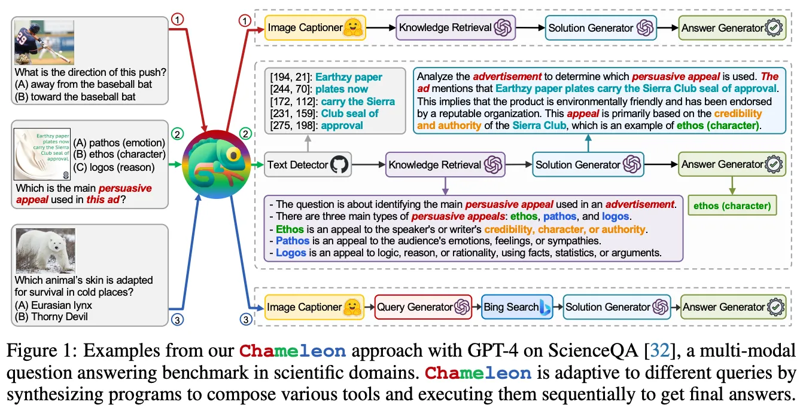
*（来自 \[19\]）*

Chameleon 框架有两个主要组件：

1.  *Planner（规划器）*：把输入查询分解成一系列可用现有工具求解的子任务。
2.  *Module inventory（模块清单）*：一组任务专用工具，连同各自的描述和用法示例，供 Chameleon 使用。

planner 由一个 LLM 实现，用自然语言生成对外部工具的调用（比如 `image_captioner` 或 `query_generator`）。可以通过简单的字符串匹配识别出这些调用，planner 输出的工具序列就构成了一段自然语言程序，执行时就是依次调用对应的任务专用模块。下图给出了 planner 和某个任务专用模块所用 prompt 的例子。

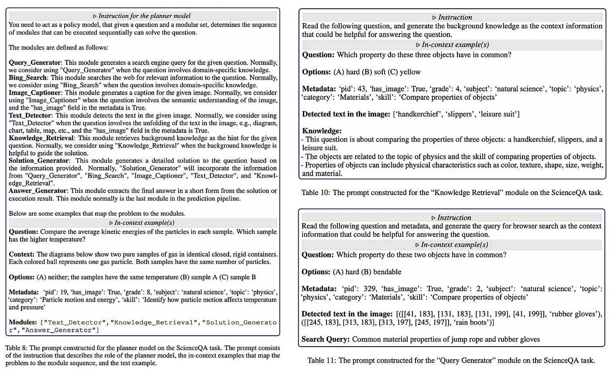
*（来自 \[19\]）*

为了教会控制器何时使用某个工具，可以在 few-shot prompt 里加入工具描述和使用示例，这样要扩展到新工具或新模块也很容易。由于这里完全靠 planner 的 in-context learning 能力来生成解，因此不需要训练、也不需要人写规则来求解真实世界中的查询。我们只需要向 LLM 提供可用工具的示例，模型就能据此推断出一段可执行的工具序列，从而给出对查询的最终正确答案。更进一步，这种工具序列对人类是可读的，方便人工调试。

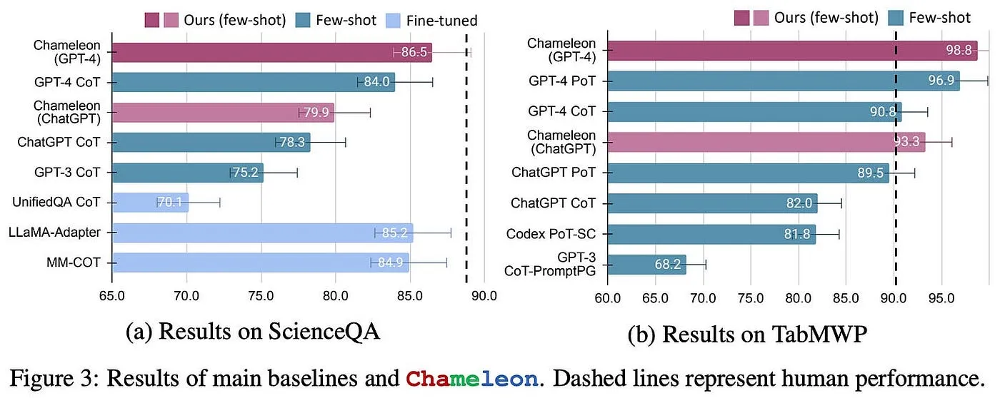
*（来自 \[19\]）*

在实验中，Chameleon 配合 GPT-4 被应用于两个复杂的多模态（即同时涉及文本和图像）推理任务：[ScienceQA](https://huggingface.co/datasets/derek-thomas/ScienceQA) 和 [TabMWP](https://github.com/lupantech/PromptPG)。在 ScienceQA 上，Chameleon 取得了 86.54% 的 state-of-the-art，分别比 GPT-4 和 GPT-3 下的 CoT prompting 高出 2.55% 和 11.37%。在 TabMWP 上也能看到类似提升，Chameleon 取得了 98.78% 的准确率。但需要指出的是，Chameleon 的有效性很大程度上依赖 GPT-4 的能力——能推断约束、为复杂推理问题构造合理一致的求解计划。

> "我们提出了一种简单但有效的方法，GPT4Tools，旨在通过从更先进的 LLM 那里 self-instruct 来赋能开源 LLM，让它具备使用工具的能力。" —— 出自 \[20\]

**GPT4Tools \[20\]。** 虽然已有许多论文展示了 LLM 以 few-shot 方式调用工具的能力，但其中大多数都依赖闭源语言模型，并且完全靠 prompt engineering 来推动工具调用，这让人不禁要问：在开源 LLM 上是否也能复现类似结果？\[20\] 中作者提出了一种方法：用 self-instruct \[21\] 生成一份微调数据集，使开源 LLM（比如 [LLaMA](https://cameronrwolfe.substack.com/i/135439692/llama-a-leap-in-open-source-quality) 和 [OPT](https://cameronrwolfe.substack.com/i/135273362/open-pre-trained-transformers-opt-language-models)）也能学会调用一组多模态工具。

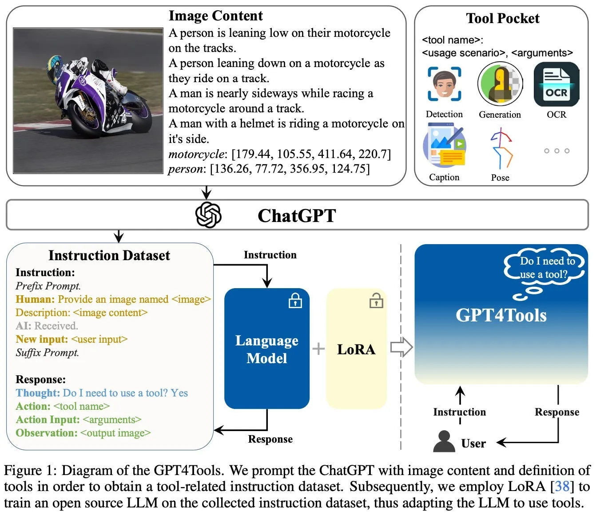
*（来自 \[21\]）*

首先，作者用 self-instruct 的方式生成一个工具调用数据集——通过 prompt 一个强力的 teacher 模型（即 ChatGPT），让它生成相关工具被使用的样例。在 prompt 中既包含视觉内容——*从图片中提取的 caption 和 bounding box* ——也包含工具描述。teacher 模型据此生成与工具相关的指令，可用于处理多模态信息、求解问题；见上图。

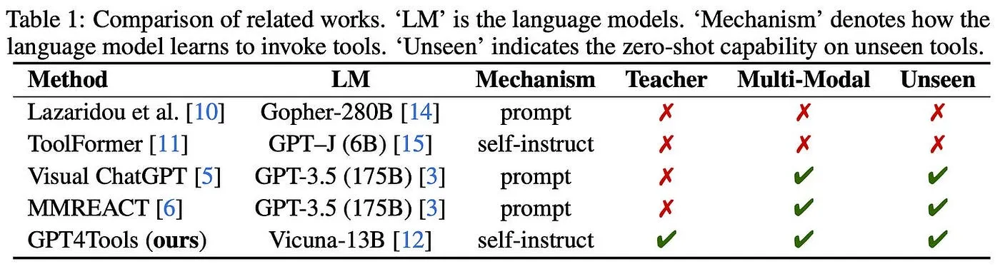
*（来自 \[21\]）*

数据集生成之后，就可以用 [Low-Rank Adaptation (LoRA)](https://cameronrwolfe.substack.com/p/easily-train-a-specialized-llm-peft) 轻松微调一个开源 LLM，让它能借助多模态工具解决一系列视觉问题。\[20\] 显示，这种做法既能提升 LLM 调用已知工具（即微调数据集里覆盖到的工具）的准确率，也能改善模型以 zero-shot 方式泛化到新工具的能力。GPT4Tools 与之前 LLM 集成外部工具相关工作的直接对比见上方表格。

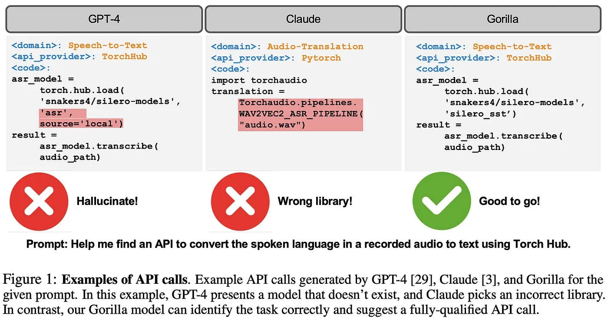
*（来自 \[30\]）*

**Gorilla \[30\]。** 虽然很多工作研究了把 LLM 接入一组固定的工具，但 \[30\] 的作者着眼于更宏大的目标——教 LLM 调用任何线上可用的模型 API。具体做法是采用检索技术：*i)* 搜索出与求解当前问题相关的模型 API，*ii)* 把这些 API 的文档加入模型的 context。这种方法让 LLM 可以访问海量、且不断变化的工具，但仍可能产生幻觉（比如传错参数，或者调用不存在的 API）；见上图。

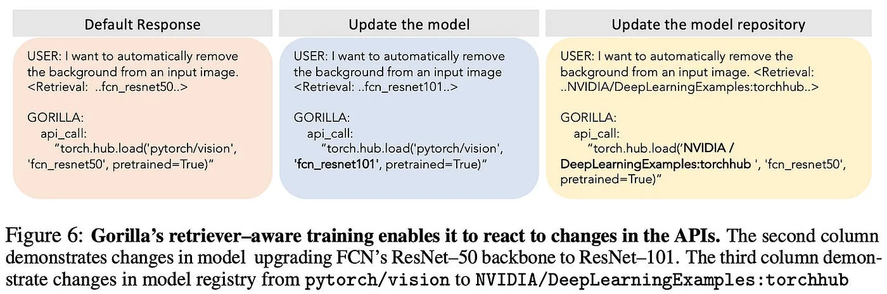
*（来自 \[30\]）*

为解决这个问题，\[30\] 的作者用 self-instruct \[21\] 构造了一份覆盖超过 1,600 个不同模型 API 的使用样例数据集。在每个样例中，prompt 和相关文档都被作为生成输出时的上下文。换句话说，这是一种"检索感知"的微调过程（类似于 [RAFT](https://cameronrwolfe.substack.com/i/142727381/raft-adapting-language-model-to-domain-specific-rag)）；见上图。由此得到的模型 Gorilla（一个 [LLaMA-7B](https://cameronrwolfe.substack.com/p/llama-llms-for-everyone) 的微调版本），是一个利用各种深度学习模型 API 来解决问题的接口。最终得到的 LLM 能够调用海量 API，*并且能适应这些 API 文档的变化！*

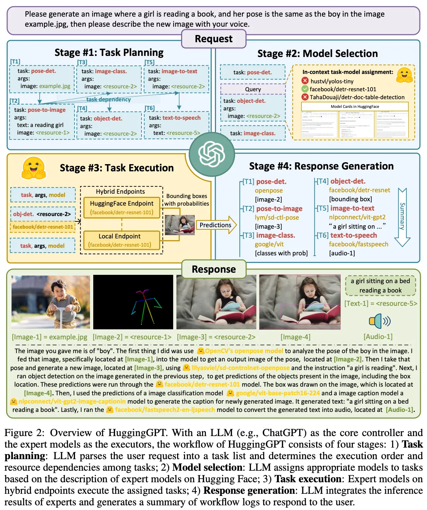
*（来自 \[31\]）*

**HuggingGPT \[31\]** 和 Gorilla 很像，都是探索通过工具调用方式把 LLM 与各种专用深度学习模型（比如用于图像识别、视频检测、文本分类等的模型）集成起来。这里 LLM 扮演问题求解系统的"大脑"，规划如何解决问题，并协调多个深度学习模型来分别解决各个子任务。但和 Gorilla 不同，HuggingGPT 不做任何微调。问题求解被分成四个步骤：

1.  *Task planning（任务规划）*：用 LLM 把用户请求分解成可求解的任务。
2.  *Model selection（模型选择）*：从 HuggingFace 里挑选模型来求解各个任务。
3.  *Task execution（任务执行）*：运行选中的模型，并把结果返回给 LLM。
4.  *Response generation（回答生成）*：用 LLM 为用户生成最终回答。

每一步都通过精心设计的指令和示例 prompt 来引导出期望的行为；下图给出了 prompt 示例。在一个足够强大的基础模型之上，这种方法是相当有效的。

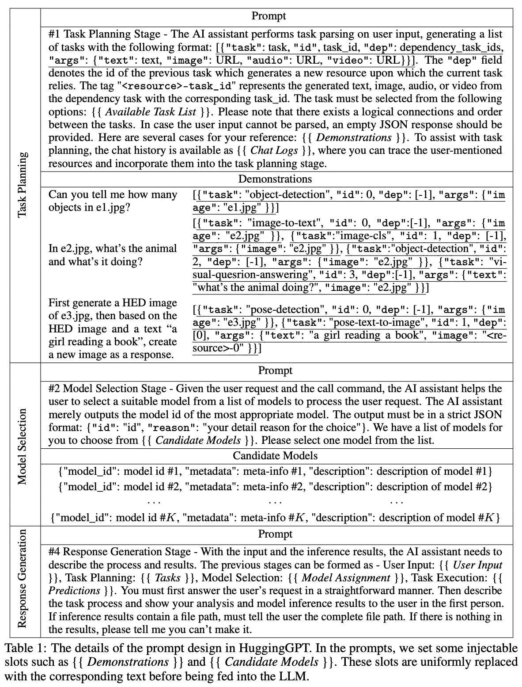
*（来自 \[31\]）*

### Program-Aided Language Models

> "计算可以被委托给一个程序解释器去执行，从而把复杂计算与推理、语言理解解耦开来。" *—— 出自 \[41\]*

把 LLM 接到外部工具是个有趣的研究方向，而能给这类模型用的最有用的工具之一，就是写代码并执行代码的能力。大多数 prompt 技术解决复杂问题分两步：

1.  生成问题求解的思路。
2.  根据这个思路真正解出问题。

在 CoT prompting 里，这两步都靠 LLM 完成，*但这类模型只在第一步上表现出色*！事实上，思路正确、答案却错误，是 LLM 常见的失败模式。要解决这个问题，可以教模型用"自然语言和代码穿插"的形式输出思路（比如一段带有有用注释的 Python 程序），然后通过直接执行其中的代码来生成最终答案！

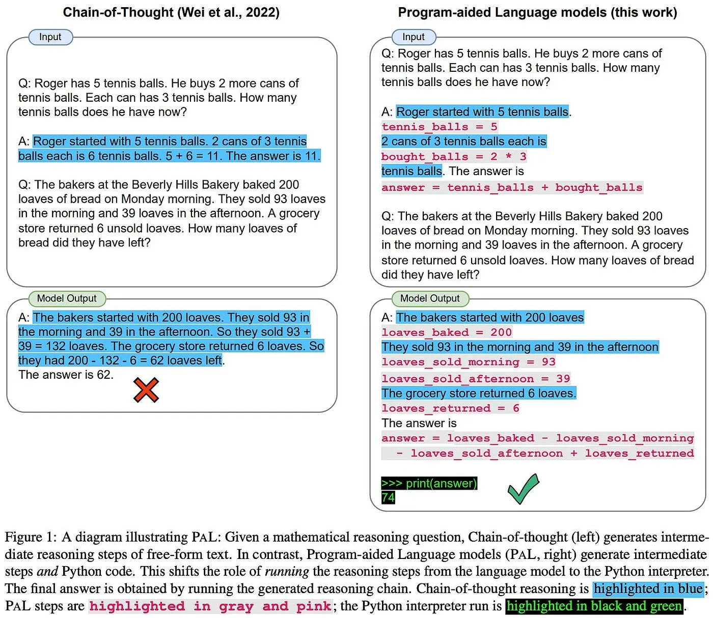
*（来自 \[40\]）*

**Program-Aided Language Model (PAL) \[40\]** 与 CoT prompting 类似，都要让 LLM 把问题拆成一连串中间步骤来寻找解。但 PAL 里的思路同时包含自然语言和程序部分。这段思路里的代码可以在一个沙箱化的 Python 环境中被执行，从而生成可靠的最终解——*真正生成解的过程被委托给了代码解释器*。\[40\] 显示，在代码上得到充分训练的 LLM（比如 [Codex](https://arxiv.org/abs/2107.03374)）只需 few-shot learning 就能学会用这种方式解决问题。

> "这填补了 CoT 类方法的一个重要空缺：推理链可能是正确的，但答案却是错的。" *—— 出自 \[40\]*

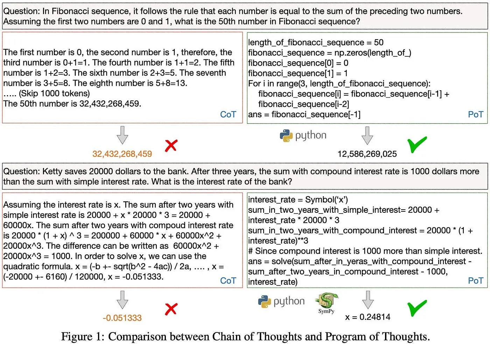
*（来自 \[41\]）*

**Program of Thoughts (PoT) prompting \[41\]** 与 PAL 在两方面很相似：*i)* 都使用代码增强的 prompt 技术，*ii)* 都把得出解的过程委托给代码解释器。这个过程依赖 few-shot prompt 策略，见上图。但和 PaL 不同的是，PoT 写出的代码依赖一个叫 [SymPy](https://github.com/sympy/sympy) 的符号数学库。这个包允许用户定义数学"symbol"，再把它们组合成复杂表达式，最后通过 SymPy 的 `solve` 函数求值；见下图。

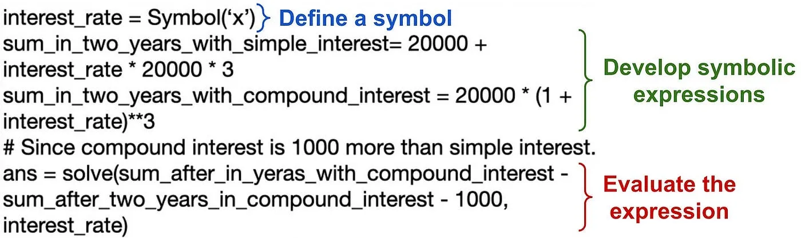
*（来自 \[41\]）*

从更高层面看，PoT 直接针对 LLM 在求解复杂方程上的弱点——通过让模型用一个符号数学库来把方程组合并求解；而 PAL 更关注通过自然语言和代码的组合来解决更一般的问题。想了解更多关于程序辅助模型的内容，可以参考[这篇相关综述](https://cameronrwolfe.substack.com/p/program-aided-language-models)。

### 理解并利用 context window

考虑到 RAG 最近的流行，以及最先进 LLM 对[长 context window](https://blog.gopenai.com/how-to-speed-up-llms-and-use-100k-context-window-all-tricks-in-one-place-ffd40577b4c) 的强调，搞清楚这些模型是如何处理 prompt 中上下文的，就显得很重要。所幸最近已经有不少研究深入考察了 context window 和 in-context learning 这两个主题，得到了一些对 prompt engineering 有用的有趣结论。

**LLM 很容易被无关上下文干扰 \[22\]。** 给一个语言模型写 prompt 时，我们通常只会把相关的上下文和信息塞进去。然而在真实应用中，模型的 prompt 经常包含一些上下文上相似、但未必和当前问题相关的信息。由此自然产生一个问题：*在 prompt 里加入无关上下文，会带来负面影响吗？*

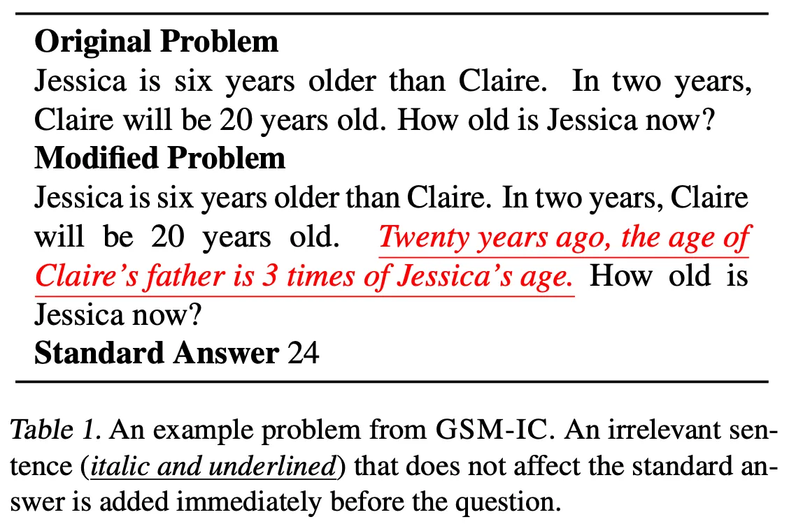
*（来自 \[22\]）*

\[22\] 中作者研究了现代 LLM 的"易分心"程度，发现这些模型在 prompt 中包含无关上下文时，性能会显著下降。为了量化 LLM 的可分心度，作者引入了一个新的数据集 Grade-School Math with Irrelevant Context (GSM-IC)，其中包含问题描述中混入了无关信息的算术推理题；见上图。然后只要看一下：当一个无关句子被加入 prompt 后，模型给出的求解结果是否会变化，就能判断 LLM 是否被无关上下文干扰了。

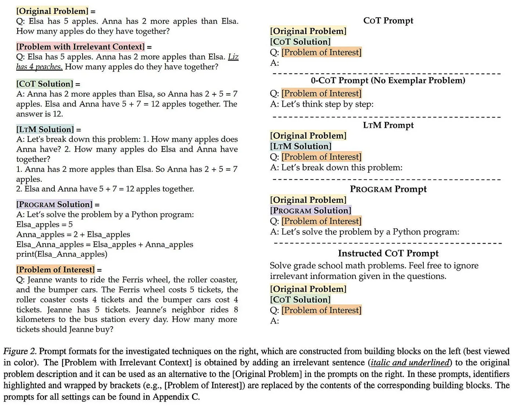
*（来自 \[22\]）*

这套策略被用来在 Codex 和 GPT-3.5 上测试几种不同的 prompt 技术（见上图示意）：

-   CoT prompting（以及 zero-shot CoT prompting）
-   Least-to-most prompting
-   带程序的 prompting

值得注意的是，这些模型在上下文中混入无关信息时，性能都明显恶化。但通过 *i)* 使用 self-consistency，*ii)* 在指令里加上"请忽略问题描述中的无关信息"，*iii)* 在 few-shot 例子里示范如何在有无关信息的情况下解决问题，可以缓解无关上下文带来的负面影响。LLM 是能够通过指令或上下文学会忽略某些信息的。

> "我们在示例前加上一句指令：'feel free to ignore irrelevant information in the problem description'。" *—— 出自 \[22\]*

**Lost in the Middle \[23\]。** 生成式 LLM 是文本到文本的格式——以一段文本序列（即 prompt）作为输入，输出一段对应的文本序列。给到 LLM 的输入长度可变——*它可以是一段简短的（zero-shot）问题描述，也可以是一段包含大量外部上下文的复杂指令（比如 RAG）*。因此 LLM 必须能在长上下文上运行，并能利用整段上下文有效地完成下游任务。

沿着这个方向，\[23\] 的作者研究了若干 LLM——*既包括开源模型（[MPT](https://cameronrwolfe.substack.com/p/democratizing-ai-mosaicmls-impact)），也包括闭源模型（GPT-3.5-Turbo 和 Claude-1.3）* ——具体能在多大程度上利用长上下文中提供给它们的信息。\[23\] 研究了两类任务：

-   *Multi-document QA*：与标准的 RAG 设置类似，这个任务要求模型在多个文档上推理，回答问题。
-   *Key-value retrieval*：一个合成任务，测试模型在给定一组 JSON key-value 对作为上下文时，能否按 key 返回对应 value——衡量它检索匹配 token 的能力。

在求解这些任务时，作者会控制 *i)* 输入上下文的长度（通过使用更多文档或 key-value 对），以及 *ii)* 相关上下文在输入中的位置（开头、中间或末尾）。然后研究上下文长度和位置变化对模型表现的影响。实验里能看到一条很明显的"U 型"性能曲线（如下图），曲线随相关信息在模型上下文中的位置而变化。

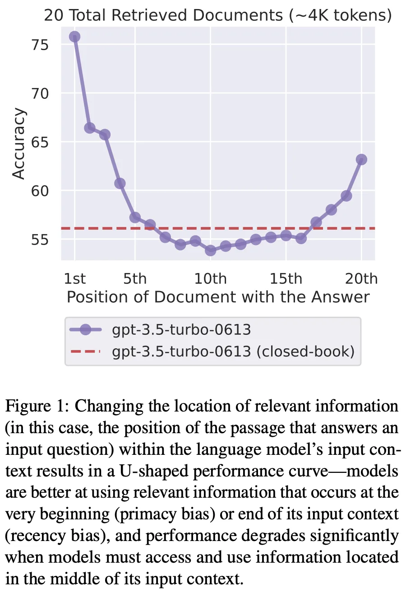
*（来自 \[23\]）*

这张图告诉我们：LLM 最关注上下文的开头和末尾。当相关信息出现在上下文中段时，模型表现会显著下降——*信息"在中间被丢了"*。事实上，在 multi-document QA 任务上，GPT-3.5-Turbo 在完全没有相关上下文时的表现，反而比把相关文档放在上下文中段时还要好。随着相关信息位置变化，性能波动很大，而且即便是 context 被扩展过的模型也并没有表现出对这种位置偏差更鲁棒的迹象；见下图。不过这些问题在更新的模型（例如 [Gemini-1.5](https://blog.google/technology/ai/google-gemini-next-generation-model-february-2024/) 和 [Claude-3](https://www.anthropic.com/news/claude-3-family)）中已经有所改善。

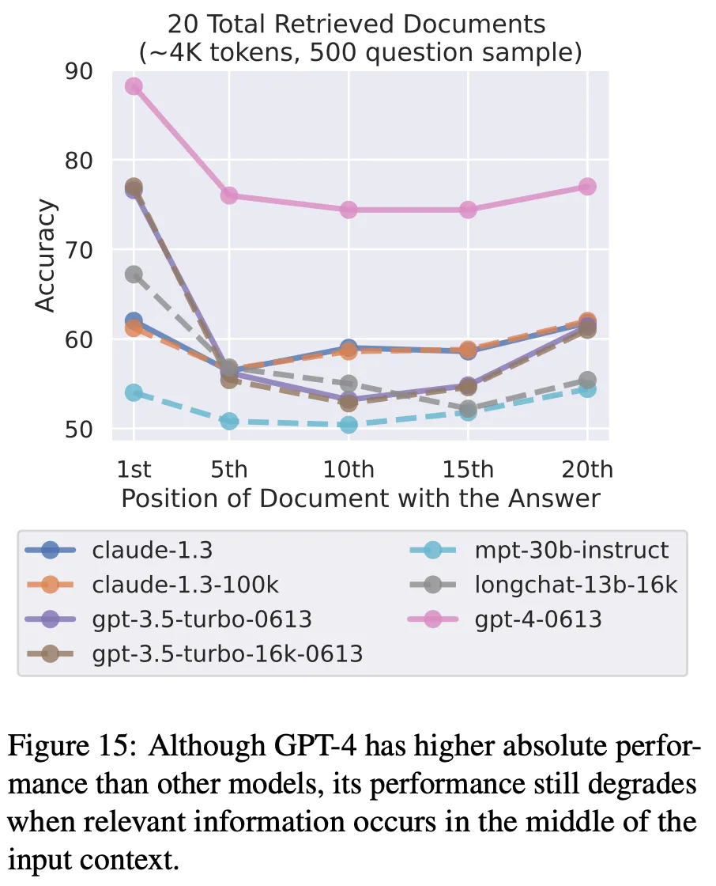
*（来自 \[23\]）*

**LLM 是潜变量模型 \[24\]。** 虽然我们已经知道 LLM 具备 in-context learning 能力，但这种能力如何从标准的语言模型预训练中涌现出来仍不清楚。此外，in-context learning 对 few-shot learning 中所选示例的内容和格式都很敏感。某些示例对模型来说很有效，某些则不然。目前没有一套标准准则可以告诉我们：什么是 few-shot learning 中"最好的示例"。\[24\] 的作者研究了这一问题，目标是找到一种实用的策略，识别出最好的 few-shot 示例。

> "In-context learning 已经被证明是一种在广泛 NLP 任务上都很有效的技术。然而，它对所用示例的选择、格式甚至顺序都很敏感。" *—— 出自 \[24\]*

很多论文从理论角度研究过 in-context learning 的机制，但其中很少给出实用、可操作的洞见。在 \[24\] 中，作者把 LLM 看作简单的[主题模型 / topic model](https://en.wikipedia.org/wiki/Topic_model) 或[潜变量模型](https://en.wikipedia.org/wiki/Latent_variable_model)，把新 token 的生成与语言模型已见到的先前 token 联系起来。详细推导见原论文，从高层面看，这种建模让我们能用理论刻画出：语言模型的输出如何与它输入 prompt 中所用的格式和任务信息相关联。

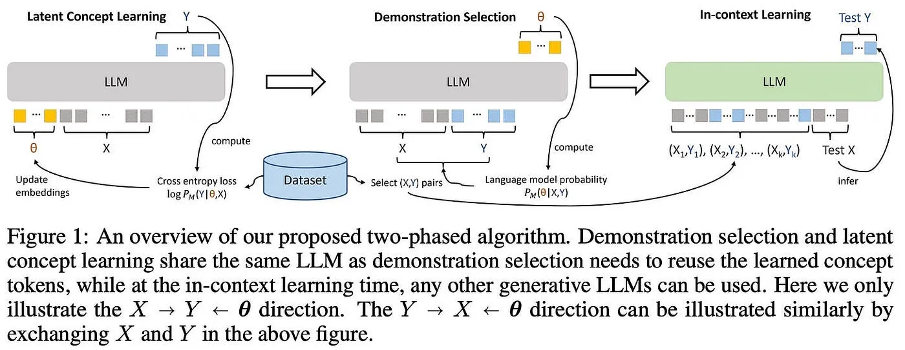
*（来自 \[24\]）*

基于这套建模，作者开发了一种实用技术，用一个更小的语言模型去衡量模型输入的[后验概率](https://en.wikipedia.org/wiki/Posterior_probability)，从而选出最优的 few-shot 示例——*这个后验告诉我们：在模型输入和参数给定的情况下，不同示例的可能性如何*。我们可以把用小 LLM 选出来的示例拿去给大模型做 in-context learning（见上图），实践中确实有正向收益。简而言之，这篇论文提出了一种对 in-context learning 的有趣（且相对简单）的理论视角，并能在实践中用来挑出更好的 few-shot 示例。

### 提升写作能力

> "SoT 是面向推理效率的、数据中心化优化的初步尝试，它展示了通过在语言层面显式规划答案结构来引导高质量回答的潜力。" *—— 出自 \[25\]*

**Skeleton-of-Thought (SoT) \[25\]** 是一种 prompt 技术，目标是降低 LLM 生成输出时的延迟。我们都知道，用 LLM 生成输出可能很昂贵，原因有几条：

-   模型很大，所以计算、内存、IO 成本都很高。
-   attention 操作是 IO 受限的，其内存和计算复杂度随序列长度二次增长。
-   输出是按 token 顺序生成的（也就是说，[用 next token prediction 来生成](https://cameronrwolfe.substack.com/i/136638774/understanding-next-token-prediction)）。

\[25\] 的作者关注的是上面提到的最后一个问题——*顺序解码的延迟*。顺序解码之所以是个问题，是因为一次只生成一个 token，因此无法把输出序列里的 token 生成并行化。也正因为如此，生成一段输出的成本和输出长度直接相关。要生成 token 更多的输出，就要花更多时间。但是，*我们能不能避免完全的顺序解码呢？*

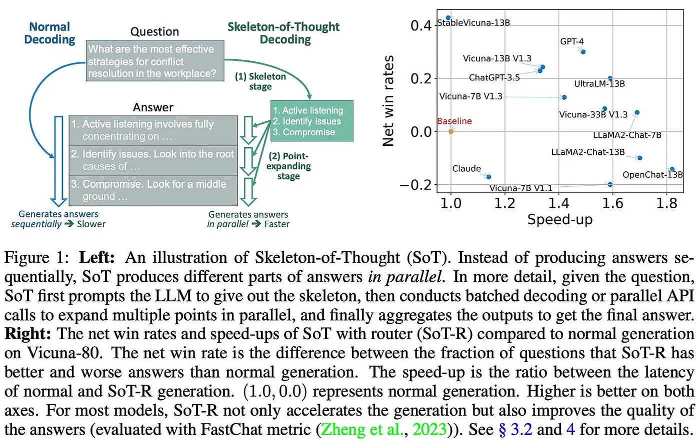
*（来自 \[25\]）*

\[25\] 中提出，可以模仿人类思考和写作的过程，在不改动模型、系统或硬件的前提下设计出更高效的解码策略。具体来说，人类倾向于先为想写的东西规划一个大纲，然后再为大纲的每个要点填充细节。*这不是一个纯粹的顺序过程*！受此启发，\[25\] 的作者提出了 Skeleton-of-Thought (SoT) prompting（见上图），分两步：

1.  让 LLM 先生成回答的骨架/大纲。
2.  并行发起多次 API 调用，分别填充大纲中每个要点的内容。

这听起来可能有点抽象，但看一下下面的 SoT prompt 就能明白怎么运作。过程相当简单——*只要生成骨架，再用一个通用的 prompt 模板填充其余细节即可*。

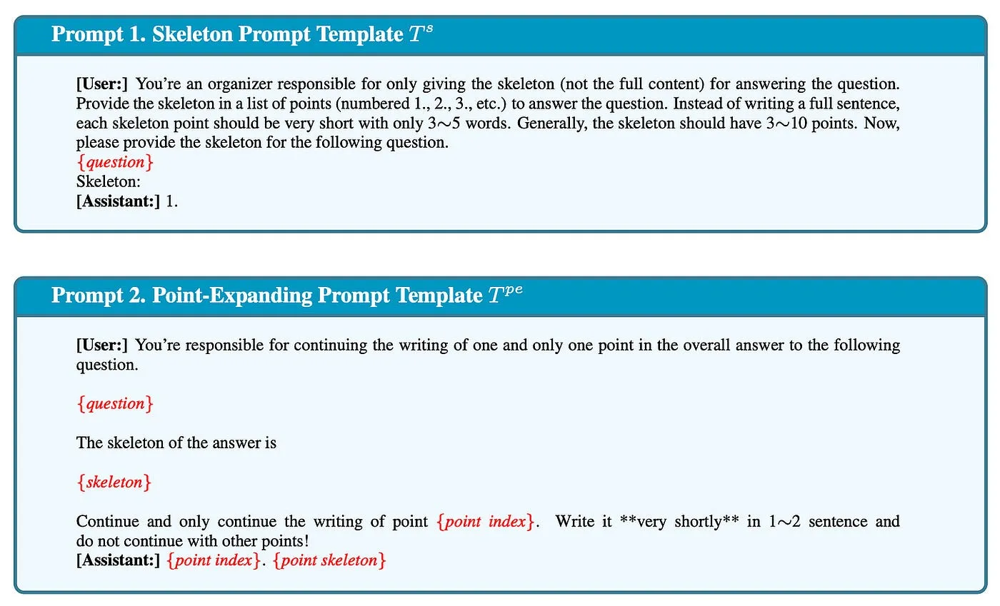
*（来自 \[25\]）*

通过并行生成骨架的各个要素，可以在推理延迟上节省很多。比如本节开头那个问题，可以在不改动底层模型或系统的前提下，把回答时间从 22 秒缩短到 12 秒——*只是用了 SoT prompting*。\[25\] 在 12 个不同的 LLM 上都观察到了类似的加速。有意思的是，作者还指出：先做一个大纲往往还能改善写作质量。

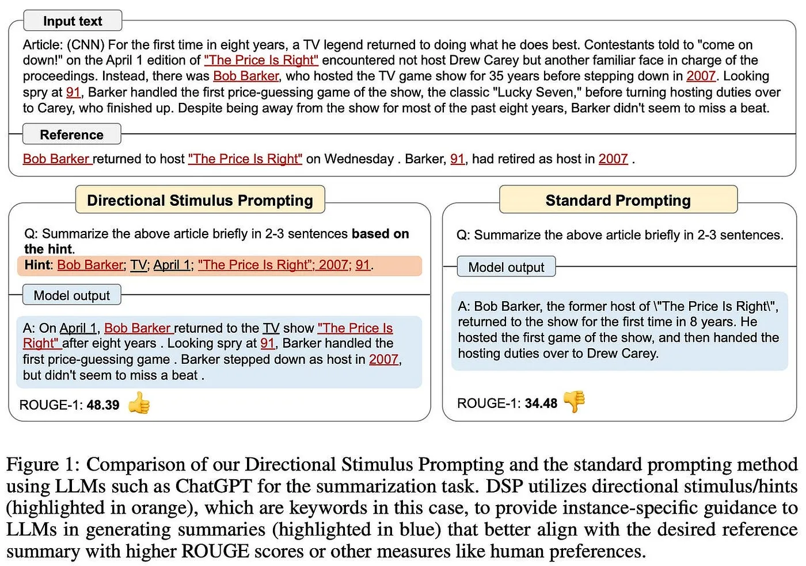
*（来自 \[27\]）*

**Directional Stimulus Prompting \[27\]。** 鉴于微调代价高昂，用 prompt 是让 LLM 完成任务最方便的途径。然而 prompting 也有局限——*引导 LLM 生成出我们想要的内容或风格并不容易*。为了解决这个问题，\[27\] 的作者提出了 directional stimulus prompting (DSP)，在 LLM 的 prompt 里引入一个 "directional stimulus"（方向性激励），如上图所示。

这个 stimulus 就是一段文字提示，给 LLM 提供关于期望输出的更多信息。这个 directional stimulus 是与具体实例相关的，仅根据输入查询生成，使用的是一个更小的模型（比如 [T5](https://cameronrwolfe.substack.com/p/t5-text-to-text-transformers-part)），训练或微调起来比 LLM 容易得多。借此可以绕开直接训练 LLM 的难题，转而去微调那个生成 directional stimulus 的小模型。DSP 在摘要、对话、推理任务上被评估，结果表明它能在仅使用很少标注数据的情况下提升模型表现。

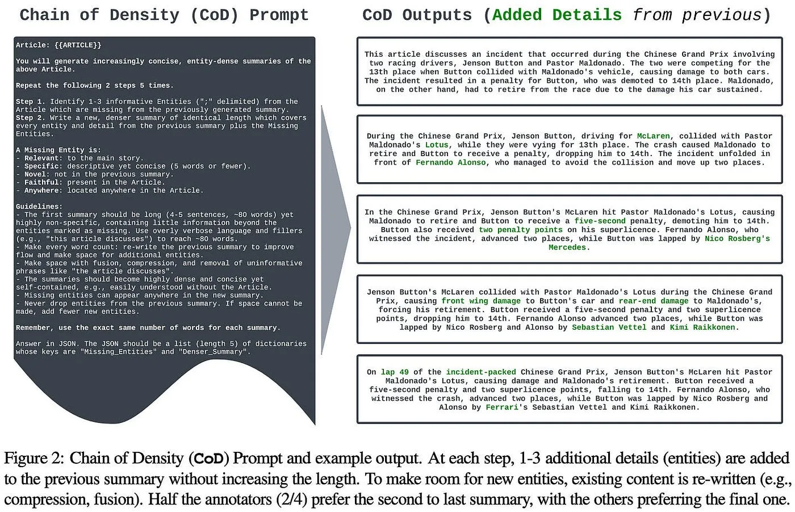
*（来自 \[28\]）*

**Chain of Density Prompting \[28\]。** LLM 的最新进展彻底改变了自动摘要这一任务——不再需要在标注数据上做微调，只需 prompt 一个 LLM 就能生成高质量摘要。在自动生成摘要时，摘要质量的一个重要方面是信息密度。我们希望摘要简洁地呈现所有相关信息，但又要避免写出过于密集、难以阅读的摘要。

为了研究这种信息密度上的权衡，\[28\] 的作者提出了 chain of density (CoD) prompting：先用一个朴素的 prompt 让 GPT-4 生成一段摘要。然后用 CoD prompting 在保持摘要长度不变的前提下，迭代地往里加入额外的实体，从而提升摘要的信息密度。有意思的是，\[28\] 显示：人类偏好的摘要密度，几乎和人写的摘要一样高，比 GPT-4 在朴素 prompt 下生成的摘要要更密。借助 CoD prompting 我们可以探索这种权衡，生成更高质量的摘要。

> "CoD 生成的摘要比 GPT-4 在朴素 prompt 下生成的摘要更具抽象性、有更多融合、且更少 lead bias。" *—— 出自 \[28\]*

### 其他值得一提的论文

-   **Active Prompting \[26\]** 解决的是 CoT prompting 中"选择（并标注）示例"的难题，它提供了一种基于不确定性主动学习的技术，用来识别哪些示例对求解某个特定推理问题最有帮助，从而优先选择并标注这些示例。
-   **TaskMatrix \[33\]** 是一篇 position paper——*也就是对某个重要议题表达立场或前瞻的论文* ——讨论了把[基础模型](https://crfm.stanford.edu/)和数以百万计的 API 集成在一起的设想。
-   **Set of Marks Prompting \[42\]** 是一种视觉 prompt 方法，它利用预训练的分割模型把一张图片切成若干区域，并在这些区域上覆盖一组标记（如字母数字、掩码、方框等），从而提升像 [GPT-4V](https://openai.com/research/gpt-4v-system-card) 这样的模型的视觉定位能力。
-   **Multimodal CoT Prompting \[43\]** 把 CoT prompting 扩展到了同时包含图像和文本的输入上，做法是把思路生成和答案生成视作问题求解过程中两个不同的步骤。
-   关于[自动 prompt](https://lilianweng.github.io/posts/2023-03-15-prompt-engineering/#automatic-prompt-design)（即通过某种优化过程自动生成更好的 prompt）这一主题，本文没有展开。
-   *还有别的吗？* 欢迎在评论里告诉我！

## 结论

在这篇综述里，我们从 prompt engineering 的基础概念一路讲到了过去两个月里被提出的前沿技术！这篇文章信息量很大，但其中许多技术其实只是在同一组核心 prompt 组件上做的细微变体：*指令、示例、上下文、求解思路。* 此外，回顾一下开头提出的 prompt engineering 策略：

1.  先建立一套全面的评估策略，让自己能轻松、定量地衡量一段 prompt 的质量。
2.  你写的第一版 prompt 应该是简单的（比如一段 instruction prompt）。
3.  当你让 prompt 变复杂时，确保增加的复杂度带来了相应的性能提升。
4.  持续迭代 prompt，直到达到期望的性能。

很多问题靠简单的 instruction 加 few-shot prompt 就能解决。对于复杂的推理问题，可能就需要用上更进阶的策略，比如 CoT prompting + self-consistency。此外，我们也看到一些 prompt 策略适用于特定的问题领域（比如用于数学题的 PoT prompting，用于摘要的 CoD prompting）。了解这些技术固然有用，但它们的实际使用场景相对少见——只有在能看到清晰、可测量的性能提升时，才应该启用它们。

### 第一次看到这个 newsletter？

你好！我是 [Cameron R. Wolfe](https://cameronrwolfe.me/)，深度学习方向 Ph.D.，[Netflix](https://research.netflix.com/research-area/nlp-and-conversations) 的 Staff Research Scientist。这是从我的 [Deep (Learning) Focus](https://cameronrwolfe.substack.com/) newsletter 转载过来的，我在那里帮助读者更好地理解 AI 研究中的重要主题。如果你喜欢这个 newsletter，欢迎订阅，考虑付费订阅、分享，或在 [X](https://twitter.com/cwolferesearch)、[LinkedIn](https://www.linkedin.com/in/cameron-r-wolfe-ph-d-04744a238/) 和 [Medium](https://wolfecameron.medium.com/) 上关注我！

### Bibliography

\[1\] Saravia, Elvis, et al. "Prompt Engineering Guide", [https://github.com/dair-ai/Prompt-Engineering-Guide](https://github.com/dair-ai/Prompt-Engineering-Guide) (2022).

\[2\] Radford, Alec, et al. "Language Models are Unsupervised Multitask Learners."

\[3\] Brown, Tom, et al. "Language models are few-shot learners." *Advances in neural information processing systems* 33 (2020): 1877–1901.

\[4\] Work, What Makes In-Context Learning. "Rethinking the Role of Demonstrations: What Makes In-Context Learning Work?."

\[5\] Zhao, Zihao, et al. "Calibrate before use: Improving few-shot performance of language models." *International conference on machine learning*. PMLR, 2021.

\[6\] Ouyang, Long, et al. "Training language models to follow instructions with human feedback." *Advances in neural information processing systems* 35 (2022): 27730–27744.

\[7\] Ye, Seonghyeon, et al. "Investigating the effectiveness of task-agnostic prefix prompt for instruction following." *Proceedings of the AAAI Conference on Artificial Intelligence*. Vol. 38. №17. 2024.

\[8\] Thoppilan, Romal, et al. "Lamda: Language models for dialog applications." *arXiv preprint arXiv:2201.08239* (2022).

\[9\] Rae, Jack W., et al. "Scaling language models: Methods, analysis & insights from training gopher." *arXiv preprint arXiv:2112.11446* (2021).

\[10\] Wei, Jason, et al. "Chain-of-thought prompting elicits reasoning in large language models." *Advances in neural information processing systems* 35 (2022): 24824–24837.

\[11\] Kojima, Takeshi, et al. "Large language models are zero-shot reasoners." *arXiv preprint arXiv:2205.11916* (2022).

\[12\] Wang, Xuezhi, et al. "Self-consistency improves chain of thought reasoning in language models." *arXiv preprint arXiv:2203.11171* (2022).

\[13\] Zhou, Denny, et al. "Least-to-most prompting enables complex reasoning in large language models." *arXiv preprint arXiv:2205.10625* (2022).

\[14\] Yao, Shunyu, et al. "Tree of thoughts: Deliberate problem solving with large language models." *arXiv preprint arXiv:2305.10601* (2023).

\[15\] Zhang, Zhuosheng, et al. "Automatic chain of thought prompting in large language models." *arXiv preprint arXiv:2210.03493* (2022).

\[16\] Fu, Yao, et al. "Complexity-based prompting for multi-step reasoning." *The Eleventh International Conference on Learning Representations*. 2022.

\[17\] Zheng, Chuanyang, et al. "Progressive-hint prompting improves reasoning in large language models." *arXiv preprint arXiv:2304.09797* (2023).

\[18\] Khot, Tushar, et al. "Decomposed prompting: A modular approach for solving complex tasks." *arXiv preprint arXiv:2210.02406* (2022).

\[19\] Lu, Pan, et al. "Chameleon: Plug-and-play compositional reasoning with large language models." *Advances in Neural Information Processing Systems* 36 (2024).

\[20\] Yang, Rui, et al. "Gpt4tools: Teaching large language model to use tools via self-instruction." *Advances in Neural Information Processing Systems* 36 (2024).

\[21\] Wang, Yizhong, et al. "Self-instruct: Aligning language models with self-generated instructions." *arXiv preprint arXiv:2212.10560* (2022).

\[22\] Shi, Freda, et al. "Large language models can be easily distracted by irrelevant context." *International Conference on Machine Learning*. PMLR, 2023.

\[23\] Liu, Nelson F., et al. "Lost in the middle: How language models use long contexts." *Transactions of the Association for Computational Linguistics* 12 (2024): 157–173.

\[24\] Wang, Xinyi, et al. "Large language models are latent variable models: Explaining and finding good demonstrations for in-context learning." *Advances in Neural Information Processing Systems* 36 (2024).

\[25\] Ning, Xuefei, et al. "Skeleton-of-thought: Large language models can do parallel decoding." *arXiv preprint arXiv:2307.15337* (2023).

\[26\] Diao, Shizhe, et al. "Active prompting with chain-of-thought for large language models." *arXiv preprint arXiv:2302.12246* (2023).

\[27\] Li, Zekun, et al. "Guiding large language models via directional stimulus prompting." *Advances in Neural Information Processing Systems* 36 (2024).

\[28\] Adams, Griffin, et al. "From sparse to dense: GPT-4 summarization with chain of density prompting." *arXiv preprint arXiv:2309.04269* (2023).

\[29\] Zhu, Zhaocheng, et al. "Large language models can learn rules." *arXiv preprint arXiv:2310.07064* (2023).

\[30\] Patil, Shishir G., et al. "Gorilla: Large language model connected with massive apis." *arXiv preprint arXiv:2305.15334* (2023).

\[31\] Shen, Yongliang, et al. "Hugginggpt: Solving ai tasks with chatgpt and its friends in huggingface." *arXiv preprint arXiv:2303.17580* (2023).

\[32\] Schick, Timo, et al. "Toolformer: Language models can teach themselves to use tools." *arXiv preprint arXiv:2302.04761* (2023).

\[33\] Liang, Yaobo, et al. "Taskmatrix. ai: Completing tasks by connecting foundation models with millions of apis." *arXiv preprint arXiv:2303.16434* (2023).

\[34\] Chen, Shouyuan, et al. "Extending context window of large language models via positional interpolation." *arXiv preprint arXiv:2306.15595* (2023).

\[35\] Besta, Maciej, et al. "Graph of Thoughts: Solving Elaborate Problems with Large Language Models." *arXiv preprint arXiv:2308.09687* (2023).

\[36\] Yao, Yao, Zuchao Li, and Hai Zhao. "Beyond Chain-of-Thought, Effective Graph-of-Thought Reasoning in Large Language Models." *arXiv preprint arXiv:2305.16582* (2023).

\[37\] Lewis, Patrick, et al. "Retrieval-augmented generation for knowledge-intensive nlp tasks." *Advances in Neural Information Processing Systems* 33 (2020): 9459–9474.

\[38\] Ovadia, Oded, et al. "Fine-tuning or retrieval? comparing knowledge injection in llms." *arXiv preprint arXiv:2312.05934* (2023).

\[39\] Liu, Jiacheng, et al. "Generated knowledge prompting for commonsense reasoning." *arXiv preprint arXiv:2110.08387* (2021).

\[40\] Gao, Luyu, et al. "PAL: Program-aided Language Models." *arXiv preprint arXiv:2211.10435* (2022).

\[41\] Chen, Wenhu, et al. "Program of thoughts prompting: Disentangling computation from reasoning for numerical reasoning tasks." *arXiv preprint arXiv:2211.12588* (2022).

\[42\] Yang, Jianwei, et al. "Set-of-mark prompting unleashes extraordinary visual grounding in gpt-4v." *arXiv preprint arXiv:2310.11441* (2023).

\[43\] Zhang, Zhuosheng, et al. "Multimodal chain-of-thought reasoning in language models." *arXiv preprint arXiv:2302.00923* (2023).
