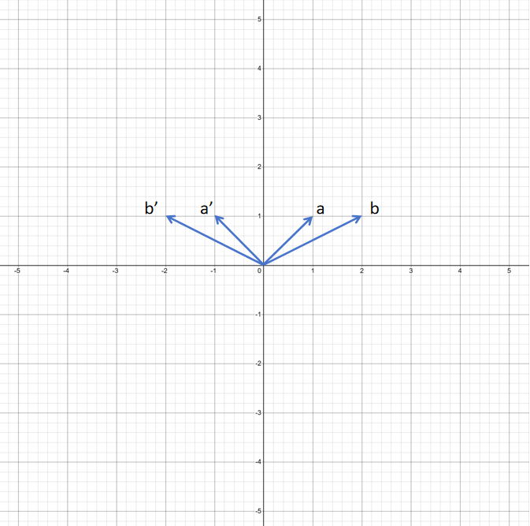
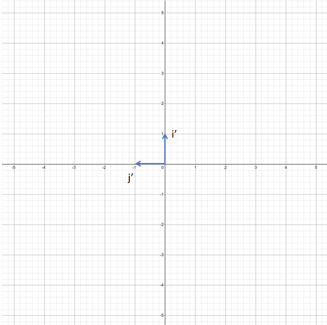
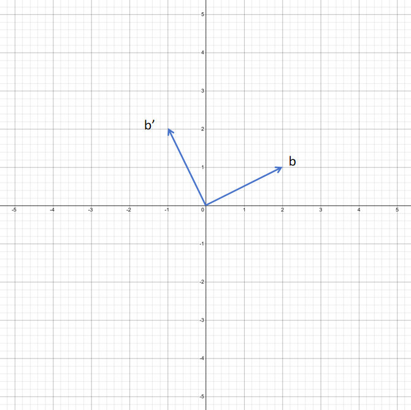

# 线性变换和矩阵

# 2.3 线性变换和矩阵

线性代数里主要研究的是向量，以及对向量的操作。并且对于向量来说，基本操作就只有两个：**数乘**和**向量加法**。今天我们来学习对向量进行线性变换和矩阵。

## 2.3.1 线性变换

你可以将线性变换理解成对向量的一个函数，输入是一个向量，输出还是一个向量。但是这个函数必须满足对数乘和向量加法的封闭性：

**加法封闭性**：对于任意两个向量**u**和**v**，线性变换**T**满足:

T(u+v)\=T(u)+T(v)T(u+v)=T(u)+T(v)T(u+v)\=T(u)+T(v)

**数乘封闭性**：对于任意向量**v**和标量**c**，线性变换**T**满足：

T(cv)\=cT(v)T(cv)=cT(v)T(cv)\=cT(v)

为什么线性变换必须满足加法封闭性和数乘封闭性呢？

首先因为向量的基本操作就两个：一个是数乘，一个是向量加法。

如果映射前向量**a,b,c,d**有以下关系：

c\=a+bc=a+bc\=a+b

c\=0.4dc=0.4dc\=0.4d

**a,b,c,d**经过一个线性变换后，得到a′,b′,c′,d′{a}',{b}',{c}',{d}'a′,b′,c′,d′。我们希望以下关系还成立：

c′\=a′+b′{c}'={a}'+{b}'c′\=a′+b′

c′\=0.4d′{c}'=0.4{d}'c′\=0.4d′

加法封闭性和数乘封闭性就保证了这样性质的成立。保证了线性变换后向量之间的关系不发生变化。线性变换有两个非常好的性质：

**直线保持**：线性变换前多个终点在一条线上的向量，经过线性变换后，这些向量的终点仍在一条直线上。

**原点不变**：线性变换后原点仍然在原点位置。

通过线性变换，可以把一个向量进行拉伸，旋转，翻转等。那如何用数字准确表述这种线性变化呢？比如上图中向量**a,b**经过线性变换为**a',b'**,线性变换的规则是对于二维空间的向量，x坐标取负值，y坐标不变，也就是沿y轴镜像。我们需要一个数学的方式来描述这个线性变换。

**线性变换的表示** 之前我们讲过一个向量和基的关系，我们再来复习一下。一个向量可以理解为用它的各个分量对标准基里的对应向量进行缩放，再将缩放后的基向量相加。 我们只需要记录标准基里的向量(i,j)经过线性变换后的向量(i',j')。原始向量各个分量对变换后的基向量的线性组合就是对该向量的线性变换后的向量。按照这样规则生成的向量就保证了线性变换对向量加法和数乘的封闭性。我们举一个例子： 还是以上图沿y轴镜像的线性变换的例子来说，用这个变换规则来对二维向量空间的标准基向量 **i** 和 **j** 进行变换。

i′\=\[−10\]j′\=\[01\]\\mathbf{i'} =\\begin{bmatrix}-1 \\\\0 \\end{bmatrix}\\mathbf{j'} =\\begin{bmatrix}0 \\\\1\\end{bmatrix}i′\=\[−10​\]j′\=\[01​\]

原始向量b为：

b\=\[21\]\\mathbf{b} =\\begin{bmatrix}2 \\\\1 \\end{bmatrix}b\=\[21​\]

对b进行相同线性变换时，只需要用b的各个分量对 **i'** 和 **j'** 进行缩放再相加就可以。

b′\=2i′+1j′\=2\[−10\]+1\[01\]\=\[−21\]\\mathbf{b'} =2i'+1j'=2\\begin{bmatrix}-1 \\\\0 \\end{bmatrix} + 1\\begin{bmatrix}0 \\\\1 \\end{bmatrix} = \\begin{bmatrix}-2 \\\\1 \\end{bmatrix}b′\=2i′+1j′\=2\[−10​\]+1\[01​\]\=\[−21​\]

也就是说只需要记录标准基经过线性变换后的基就可以表示这个线性变换了。

## 2.3.2 矩阵

矩阵就是对向量进行线性变换的函数。矩阵就是由线性变换后的基构成的。还是上边以y轴为镜像的例子，我们把线性变换后的 **i'** 和 **j'** 放在一起就构成了一个矩阵AAA。

A\=\[−1001\]A=\\begin{bmatrix} -1&0 \\\\ 0&1 \\end{bmatrix}A\=\[−10​01​\]

这个矩阵就表示对一个向量按Y轴进行镜像的线性转换。它对向量**b**的计算法则如下：

b\=\[21\]b=\\begin{bmatrix} 2\\\\ 1 \\end{bmatrix}b\=\[21​\]

Ab\=2\[−10\]+1\[01\]\=\[−21\]Ab=2\\begin{bmatrix}-1 \\\\0 \\end{bmatrix} + 1\\begin{bmatrix}0 \\\\1 \\end{bmatrix} = \\begin{bmatrix}-2 \\\\1 \\end{bmatrix}Ab\=2\[−10​\]+1\[01​\]\=\[−21​\]

我们可以再定义二维空间里向量逆时针旋转90°的线性变换来试一下。二维空间的标准基向量**i,j**，经过逆时针90°旋转后如下图，旋转后的向量为：

i′\=\[01\]j′\=\[−10\]\\mathbf{i'} =\\begin{bmatrix}0 \\\\1 \\end{bmatrix}\\mathbf{j'} =\\begin{bmatrix}-1 \\\\0\\end{bmatrix}i′\=\[01​\]j′\=\[−10​\]

 接下来我们用 **i'** 和 **j'** 构成矩阵AAA：

A\=\[0−110\]A=\\begin{bmatrix} 0&-1 \\\\ 1&0 \\end{bmatrix}A\=\[01​−10​\]

我们尝试对向量**b**进行线性变换，看是否可以对向量**b**逆时针旋转90°。

b\=\[21\]\\mathbf{b} =\\begin{bmatrix}2 \\\\1 \\end{bmatrix}b\=\[21​\]

b′\=Ab\=\[0−110\]\[21\]\=2\[01\]+1\[−10\]\=\[−12\]\\mathbf{b'} =Ab=\\begin{bmatrix} 0&-1 \\\\ 1&0 \\end{bmatrix}\\begin{bmatrix}2 \\\\1 \\end{bmatrix}=2\\begin{bmatrix}0 \\\\1 \\end{bmatrix} + 1\\begin{bmatrix}-1 \\\\0 \\end{bmatrix} = \\begin{bmatrix}-1 \\\\2 \\end{bmatrix}b′\=Ab\=\[01​−10​\]\[21​\]\=2\[01​\]+1\[−10​\]\=\[−12​\]

 可以看到矩阵AAA确实可以对向量bbb进行逆时针旋转90°的线性变换。 **单位矩阵** 标准基向量构成的矩阵就是一个单位矩阵，单位矩阵对向量进行线性变换后还是向量本身。单位矩阵里的行数和列数相等，只有对角线上元素为1，其他位置元素为0。比如3维单位矩阵为：

I\=\[100010001\]I=\\begin{bmatrix} 1&0&0 \\\\ 0&1&0 \\\\ 0&0&1 \\end{bmatrix}I\=⎣⎢⎡​100​010​001​⎦⎥⎤​

单位矩阵对于一个向量的线性变换，还是这个向量本身。比如：

v\=\[123\]v =\\begin{bmatrix} 1 \\\\ 2 \\\\ 3 \\end{bmatrix}v\=⎣⎢⎡​123​⎦⎥⎤​

Iv\=\[100010001\]\[123\]\=1\[100\]+2\[010\]+3\[001\]\=\[123\]Iv =\\begin{bmatrix} 1&0&0 \\\\ 0&1&0 \\\\ 0&0&1 \\end{bmatrix}\\begin{bmatrix} 1 \\\\ 2 \\\\ 3 \\end{bmatrix}=1\\begin{bmatrix} 1 \\\\ 0 \\\\ 0 \\end{bmatrix}+2\\begin{bmatrix} 0 \\\\ 1 \\\\ 0 \\end{bmatrix}+3\\begin{bmatrix} 0 \\\\ 0 \\\\ 1 \\end{bmatrix}=\\begin{bmatrix} 1 \\\\ 2 \\\\ 3 \\end{bmatrix}Iv\=⎣⎢⎡​100​010​001​⎦⎥⎤​⎣⎢⎡​123​⎦⎥⎤​\=1⎣⎢⎡​100​⎦⎥⎤​+2⎣⎢⎡​010​⎦⎥⎤​+3⎣⎢⎡​001​⎦⎥⎤​\=⎣⎢⎡​123​⎦⎥⎤​

**矩阵的行和列** 上边我们讲的矩阵的行数和列数都是相等的，它们叫做**方阵**。但矩阵的行数和列数可以不相等。比如下边这个矩阵$C$，它就是一个3行2列的矩阵。

C\=\[0−11021\]C=\\begin{bmatrix} 0&-1 \\\\ 1&0 \\\\ 2&1 \\end{bmatrix}C\=⎣⎢⎡​012​−101​⎦⎥⎤​

矩阵CCC也代表一个线性变换，矩阵CCC里的第一列是把二维向量空间里的 iii 向量通过这个线性变换得到的3维向量。矩阵CCC里的第二列是把二维向量空间里的 jjj 向量通过这个线性变换得到的3维向量。所以矩阵CCC是一个可以把2维向量映射到3维向量的线性变换。矩阵CCC对于向量bbb进行向量变换如下：

b\=\[21\]\\mathbf{b} =\\begin{bmatrix}2 \\\\1 \\end{bmatrix}b\=\[21​\]

b′\=Cb\=\[0−11021\]\[21\]\=2\[012\]+1\[−101\]\=\[−125\]\\mathbf{b'} =Cb=\\begin{bmatrix} 0&-1 \\\\ 1&0 \\\\ 2&1 \\end{bmatrix}\\begin{bmatrix}2 \\\\1 \\end{bmatrix}=2\\begin{bmatrix}0 \\\\1\\\\2 \\end{bmatrix} + 1\\begin{bmatrix}-1 \\\\0 \\\\1\\end{bmatrix} = \\begin{bmatrix}-1 \\\\2\\\\5 \\end{bmatrix}b′\=Cb\=⎣⎢⎡​012​−101​⎦⎥⎤​\[21​\]\=2⎣⎢⎡​012​⎦⎥⎤​+1⎣⎢⎡​−101​⎦⎥⎤​\=⎣⎢⎡​−125​⎦⎥⎤​

所以，不是方阵的矩阵进行的线性变换，会给进行变换的向量带来维度上的变换。上边的例子，是把一个2维向量变换为3维向量。下边我们看一个把3维向量变换为2维向量的例子。比如下边矩阵D，它是一个2行3列的矩阵，它就可以把3维向量线性变换为2维向量。

D\=\[0−11102\]D=\\begin{bmatrix} 0&-1&1 \\\\ 1&0&2 \\end{bmatrix}D\=\[01​−10​12​\]

c\=\[211\]\\mathbf{c} =\\begin{bmatrix}2 \\\\1\\\\1 \\end{bmatrix}c\=⎣⎢⎡​211​⎦⎥⎤​

c′\=Dc\=\[0−11102\]\[211\]\=2\[01\]+1\[−10\]+1\[12\]\=\[04\]\\mathbf{c'} =Dc=\\begin{bmatrix} 0&-1&1 \\\\ 1&0&2 \\end{bmatrix}\\begin{bmatrix}2 \\\\1\\\\1\\end{bmatrix}=2\\begin{bmatrix}0 \\\\1 \\end{bmatrix} + 1\\begin{bmatrix}-1 \\\\0\\end{bmatrix} + 1\\begin{bmatrix}1 \\\\2\\end{bmatrix}= \\begin{bmatrix}0 \\\\4 \\end{bmatrix}c′\=Dc\=\[01​−10​12​\]⎣⎢⎡​211​⎦⎥⎤​\=2\[01​\]+1\[−10​\]+1\[12​\]\=\[04​\]

**矩阵乘法** 比如代表逆时针旋转90°的矩阵AAA,可以同时对3个向量进行旋转。

A\=\[0−110\]A=\\begin{bmatrix} 0&-1 \\\\ 1&0 \\end{bmatrix}A\=\[01​−10​\]

a\=\[01\]b\=\[11\]c\=\[−11\]\\mathbf{a} =\\begin{bmatrix}0 \\\\1 \\end{bmatrix}\\mathbf{b} =\\begin{bmatrix}1 \\\\1 \\end{bmatrix}\\mathbf{c} =\\begin{bmatrix}-1 \\\\1 \\end{bmatrix}a\=\[01​\]b\=\[11​\]c\=\[−11​\]

可以把**a,b,c**组成一个矩阵BBB：

B\=\[01−1111\]B=\\begin{bmatrix} 0&1&-1 \\\\ 1&1&1 \\end{bmatrix}B\=\[01​11​−11​\]

AB\=\[0−110\]\[01−1111\]AB=\\begin{bmatrix} 0&-1 \\\\ 1&0 \\end{bmatrix}\\begin{bmatrix} 0&1&-1 \\\\ 1&1&1 \\end{bmatrix}AB\=\[01​−10​\]\[01​11​−11​\]

这就变成了矩阵之间的乘法，它的计算法则就是先取BBB矩阵的第一列，用AAA进行线性变换。

\[0−110\]\[01\]\=\[−10\]\\begin{bmatrix} 0&-1 \\\\ 1&0 \\end{bmatrix}\\begin{bmatrix}0 \\\\1 \\end{bmatrix}=\\begin{bmatrix}-1 \\\\0 \\end{bmatrix}\[01​−10​\]\[01​\]\=\[−10​\]

然后取$B$矩阵的第二列，用A进行线性变换。

\[0−110\]\[11\]\=\[−11\]\\begin{bmatrix} 0&-1 \\\\ 1&0 \\end{bmatrix}\\begin{bmatrix}1 \\\\1 \\end{bmatrix}=\\begin{bmatrix}-1 \\\\1 \\end{bmatrix}\[01​−10​\]\[11​\]\=\[−11​\]

最后取$B$矩阵的第三列，用A进行线性变换。

\[0−110\]\[−11\]\=\[−1−1\]\\begin{bmatrix} 0&-1 \\\\ 1&0 \\end{bmatrix}\\begin{bmatrix}-1 \\\\1 \\end{bmatrix}=\\begin{bmatrix}-1 \\\\-1 \\end{bmatrix}\[01​−10​\]\[−11​\]\=\[−1−1​\]

最后把三个向量经过线性变换后的向量组成最终的结果矩阵：

\[−1−1−101−1\]\\begin{bmatrix} -1&-1&-1 \\\\ 0&1&-1 \\end{bmatrix}\[−10​−11​−1−1​\]

所以，完整的矩阵乘法就为：

AB\=\[0−110\]\[01−1111\]\=\[−1−1−101−1\]AB=\\begin{bmatrix} 0&-1 \\\\ 1&0 \\end{bmatrix}\\begin{bmatrix} 0&1&-1 \\\\ 1&1&1 \\end{bmatrix}=\\begin{bmatrix} -1&-1&-1 \\\\ 0&1&-1 \\end{bmatrix}AB\=\[01​−10​\]\[01​11​−11​\]\=\[−10​−11​−1−1​\]

通过上边的不同计算，可以发现矩阵乘法有以下规则： 若矩阵AAA的维度是m×nm\\times nm×n，矩阵BBB的维度是n×pn\\times pn×p，那么矩阵AAA和矩阵BBB的乘积ABABAB的维度是m×pm\\times pm×p。

**矩阵的转置** 对一个矩阵AAA，维度为m×nm\\times nm×n，即AAA有m行，n列。矩阵AAA的转置，记作ATA^{T}AT 。ATA^{T}AT维度为n×mn\\times mn×m。 其中ATA^{T}AT的第iii行第jjj列的元素是AAA的第jjj行第iii列的元素。 也就是说如果用aija\_{ij}aij​表示AAA中的第 iii 行，第 jjj 列。那么它等于ATA^{T}AT中的元素ajia\_{ji}aji​。 比如：

A\=\[123456\]AT\=\[142536\] A=\\begin{bmatrix} 1 & 2 & 3 \\\\ 4 & 5 & 6 \\end{bmatrix}\\quad A^T=\\begin{bmatrix} 1 & 4 \\\\ 2 & 5 \\\\ 3 & 6 \\end{bmatrix} A\=\[14​25​36​\]AT\=⎣⎢⎡​123​456​⎦⎥⎤​

**矩阵乘法的两种理解**

之前我们都是列向量视角，比如对二维空间里对向量进行逆时针旋转90°的线性变换。对标准基向量**i**和**j**进行逆时针旋转90°操作，得到**i'**和**j'**。然后将**i'**和**j'**合并为一个矩阵**A**，这个矩阵就可以对二维空间里的任意列向量进行逆时针旋转90°的操作。

b\=\[21\]\\mathbf{b} =\\begin{bmatrix}2 \\\\1 \\end{bmatrix}b\=\[21​\]

b′\=Ab\=\[0−110\]\[21\]\=2\[01\]+1\[−10\]\=\[−12\]\\mathbf{b'} =Ab=\\begin{bmatrix} 0&-1 \\\\ 1&0 \\end{bmatrix}\\begin{bmatrix}2 \\\\1 \\end{bmatrix}=2\\begin{bmatrix}0 \\\\1 \\end{bmatrix} + 1\\begin{bmatrix}-1 \\\\0 \\end{bmatrix} = \\begin{bmatrix}-1 \\\\2 \\end{bmatrix}b′\=Ab\=\[01​−10​\]\[21​\]\=2\[01​\]+1\[−10​\]\=\[−12​\]

上边矩阵**A**对列向量**b**的线性变换，可以理解为用**b**的第一个分量2缩放矩阵A的第一个列向量，1缩放矩阵A的第二个列向量，再将两个列向量相加，得到最终结果。

行向量视角下，二维空间的标准基向量**i** ，**j**是行向量。

i\=\[10\]j\=\[01\] i=\\begin{bmatrix} 1 & 0 \\end{bmatrix}\\quad j=\\begin{bmatrix} 0 & 1 \\end{bmatrix} i\=\[1​0​\]j\=\[0​1​\]

对**i** ，**j**逆时针旋转90°，得到**i'**和**j'**，也是两个行向量。

i′\=\[01\]j′\=\[−10\] i'=\\begin{bmatrix} 0 & 1 \\end{bmatrix}\\quad j'=\\begin{bmatrix} -1 & 0 \\end{bmatrix} i′\=\[0​1​\]j′\=\[−1​0​\]

将这两个行向量合并，得到矩阵A。

\[01\] \\begin{bmatrix} 0 & 1 \\end{bmatrix} \[0​1​\]

这个矩阵A可以对二维空间里的任意行向量进行逆时针旋转90°的操作。

比如:

b′\=bA\=\[21\]\[01−10\]\=2\[01\]+1\[−10\]\=\[−12\]\\mathbf{b'} =bA=\\begin{bmatrix} 2&1 \\end{bmatrix}\\begin{bmatrix}0&1 \\\\-1&0 \\end{bmatrix}=2\\begin{bmatrix}0 &1 \\end{bmatrix} + 1\\begin{bmatrix}-1 &0 \\end{bmatrix} = \\begin{bmatrix}-1 &2 \\end{bmatrix}b′\=bA\=\[2​1​\]\[0−1​10​\]\=2\[0​1​\]+1\[−1​0​\]\=\[−1​2​\]

对于行向量**b**，矩阵A对**b**进行线性变换时，行向量**b**在矩阵**A**的左边。因为**b**实际就是一个一行两列的矩阵，必须满足矩阵乘法的原则，也就是**b**的列数必须等于**A**的行数。进行线性变换时，用**b**的第一个分量2，缩放矩阵**A**的第一个行向量，1缩放矩阵**A**的第二个行向量，再将两个行向量相加，得到最终结果。结果为\[-1,2\]，和列向量视角下的向量元素值都一样，只不过一个是行向量一个是列向量。

对于

AB\=\[0−110\]\[01−1111\]\=\[−1−1−101−1\]AB=\\begin{bmatrix} 0&-1 \\\\ 1&0 \\end{bmatrix}\\begin{bmatrix} 0&1&-1 \\\\ 1&1&1 \\end{bmatrix}=\\begin{bmatrix} -1&-1&-1 \\\\ 0&1&-1 \\end{bmatrix}AB\=\[01​−10​\]\[01​11​−11​\]\=\[−10​−11​−1−1​\]

观察我们上边的矩阵乘法，矩阵AAA代表线性变换，类似函数。矩阵BBB是一组列向量的组合，类似函数的输入。矩阵乘法的结果就是函数的输出。这种理解就是用B里的列向量的分量对A里的列向量进行线性组合。也就是从列向量的角度去理解矩阵乘法。

另一种不同的视角是行向量视角。在深度学习行向量视角更常用。行向量视角下，A是待变换的行向量的集合，B是线性变换的函数。用A里行向量的每个维度的分量，对B里的行向量进行线性组合

## 2.3.3 深度学习里的矩阵

矩阵在深度学习里有两种作用，一种是存储数据向量，比如你收集的学生的年龄，身高，体重。\[12,154, 52\]。可以理解为它是函数的输入。 一种是存储参数，可以理解为它是一个函数，对输入向量进行线性变化。
