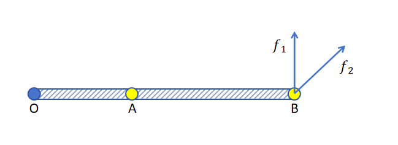
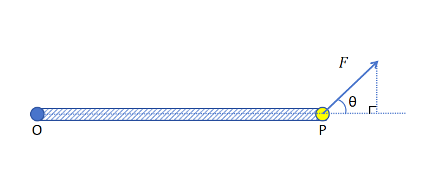
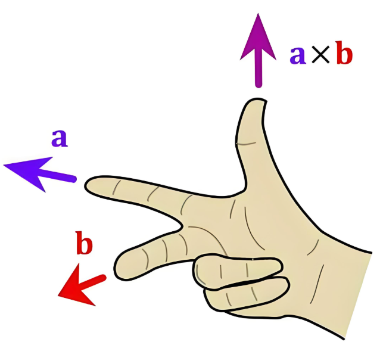
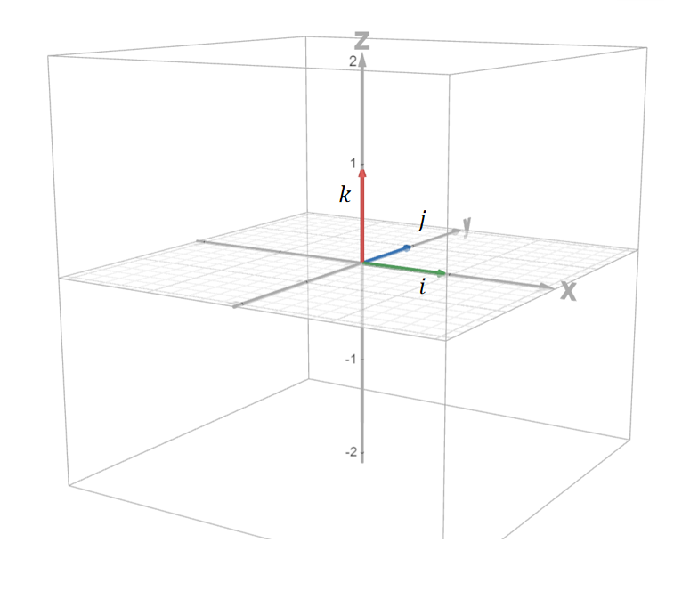

# 向量的叉乘

## 2.5 向量叉乘

### 2.5.1 力矩

我们从一个物理概念来引入向量的叉乘。那就是**力矩**。

比如上图中，木棍的一端O固定，你要施加一个力来让这个木棍旋转，是A点更容易还是B点更容易呢？有生活经验的你肯定会选择B点。以同样大的力气，沿f1f\_1f1​方向让木棍旋转更容易还是沿f2f\_2f2​方向让木棍旋转更容易呢？相信你会选择沿f1f\_1f1​方向。

物理中描述这种**“更容易旋转”**的物理量就叫做力矩。力矩与3个因素相关。

**力臂的大小** 力臂的大小就是旋转点O到力的作用点P之间的长度。相同条件下，力臂越长，力矩越大。旋转越容易。

**力的大小** 只要力不平行于力臂的方向，相同条件下，力越大，力矩越大。旋转越容易。

**力和力臂的角度** 力臂大小和力的大小不变的情况下，力和力臂的夹角越接近90°，力矩越大。旋转越容易。而sinθ正好描述了这一关系。sin 0°为0，sin 90°为1。

**力矩的定义** 所以力矩M的公式为向量P的模长乘以向量F的模长，乘以两个向量夹角的sin值。

M\=∣P∣∣F∣sinθ M=|P||F|sin \\theta M\=∣P∣∣F∣sinθ

### 2.5.2 向量的叉乘

在线性代数里，我们把类似于力矩这种运算叫做叉乘（叉积，向量积）。用符号×\\times×表示。

a×b\=∣a∣∣b∣sinθ a \\times b = |a||b|sin \\theta a×b\=∣a∣∣b∣sinθ

**叉乘的方向** 力矩是一个向量，它不光有大小，还有方向。因为力矩描述的是使物体旋转的容易程度。但是旋转有可能是顺指针方向，也有可能是逆时针方向。叉乘也是一个向量，有自己的方向。怎么确定这个方向呢？这就要用的右手法则了。

### 2.5.3 叉乘的计算法则

根据右手法则，a×ba \\times ba×b 和b×ab \\times ab×a的方向是不同的。所以叉乘不满足交换律。

**分配率**

(a+b)×c\=a×c+b×c (a+b) \\times c = a \\times c + b \\times c (a+b)×c\=a×c+b×c

c×(a+b)\=c×a+c×b c \\times (a+b) = c \\times a + c \\times b c×(a+b)\=c×a+c×b

用力矩可以帮助你理解，两个力在同一个力臂上产生的力矩的和等于它们和力的力矩。

**数乘结合率**

(λa)×b\=a×(λb)\=λ(a×b) (\\lambda a) \\times b = a \\times (\\lambda b) = \\lambda (a \\times b) (λa)×b\=a×(λb)\=λ(a×b)

以力矩来理解，不论力或者力臂变为原来的λ倍，力矩也会变为原来的λ倍。

### 2.5.4 叉乘的计算公式

有了叉乘的计算法则，我们可以把向量**a**和**b**用标准基向量加和的方式来表示，推导出叉乘的计算公式。

a\=axi+ayj+azk,b\=bxi+byj+bzk a = a\_xi+a\_yj+a\_zk, b=b\_xi+b\_yj+b\_zk a\=ax​i+ay​j+az​k,b\=bx​i+by​j+bz​k

a×b\=(axi+ayj+azk)×(bxi+byj+bzk) a \\times b=( a\_xi+a\_yj+a\_zk) \\times (b\_xi+b\_yj+b\_zk) a×b\=(ax​i+ay​j+az​k)×(bx​i+by​j+bz​k)

利用叉乘分配率有：

a×b\=axi×(bxi+byj+bzk)+ayj×(bxi+byj+bzk)+azk×(bxi+byj+bzk) a \\times b=a\_xi \\times (b\_xi+b\_yj+b\_zk) + a\_yj \\times (b\_xi+b\_yj+b\_zk) + a\_zk \\times (b\_xi+b\_yj+b\_zk) a×b\=ax​i×(bx​i+by​j+bz​k)+ay​j×(bx​i+by​j+bz​k)+az​k×(bx​i+by​j+bz​k)

上式中ax,ay,az,bx,by,bza\_x,a\_y,a\_z,b\_x,b\_y,b\_zax​,ay​,az​,bx​,by​,bz​都为标量，**i,j,k**为标准基向量。利用数乘结合律有：

a×b\=axbx(i×i)+axby(i×j)+axbz(i×k)+aybx(j×i)+ayby(i×j)+a \\times b= a\_xb\_x(i \\times i)+a\_xb\_y(i \\times j)+a\_xb\_z(i \\times k)+a\_yb\_x(j \\times i)+a\_yb\_y(i \\times j)+a×b\=ax​bx​(i×i)+ax​by​(i×j)+ax​bz​(i×k)+ay​bx​(j×i)+ay​by​(i×j)+

aybz(j×k)+azbx(k×i)+azby(k×j)+azbz(k×k)a\_yb\_z(j \\times k)+a\_zb\_x( k \\times i)+a\_zb\_y(k \\times j)+a\_zb\_z(k \\times k)ay​bz​(j×k)+az​bx​(k×i)+az​by​(k×j)+az​bz​(k×k)

根据叉乘的定义，标准基向量和自身叉乘为0，因为sin 0°为0。也就是：

i×i\=0 i \\times i = 0 i×i\=0

j×j\=0 j \\times j = 0 j×j\=0

k×k\=0 k \\times k = 0 k×k\=0

另外，根据叉乘的定义，叉乘的结果为向量，结果向量模长为原始两个向量模长的乘积再乘以它们之间夹角的sin值。方向按照右手法则来确定，垂直于原始两个向量构成的平面。

i×j\=k i \\times j = k i×j\=k

j×i\=−k j \\times i= -k j×i\=−k

j×k\=i j \\times k = i j×k\=i

k×j\=−i k \\times j = -i k×j\=−i

k×i\=j k \\times i = j k×i\=j

i×k\=−j i \\times k = -j i×k\=−j

带入上式，最终得到的结果为：

a×b\=(aybz−azby)i+(azbx−axbz)j+(axby−aybx)k a \\times b = (a\_yb\_z-a\_zb\_y)i+(a\_zb\_x-a\_xb\_z)j+(a\_xb\_y-a\_yb\_x)k a×b\=(ay​bz​−az​by​)i+(az​bx​−ax​bz​)j+(ax​by​−ay​bx​)k

可以看到，最终的结果为一个向量。

### 2.5.5 叉乘的作用

利用两个向量的叉乘可以方便的找到一个同时垂直于这两个向量的向量。后边我们会用到。
