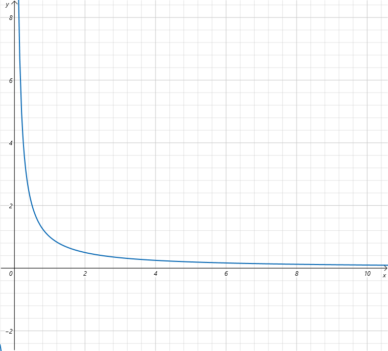
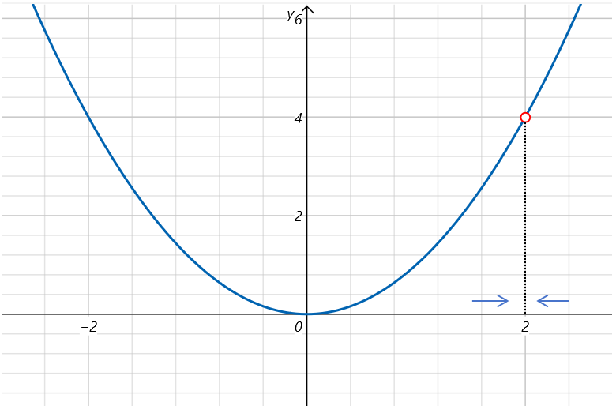

# 函数的极限

## 3.1 函数的极限

### 3.1.1 宇宙是无穷大的

我第一次得知宇宙是无穷大，是在我初中的一堂课上。老师告诉我们说：“什么是无穷大？无穷大就是不论你认为宇宙多大，它比你想的还要大！” 这句话对当时的我造成了很大的震撼。一方面是宇宙竟然没有边。另一方面是老师这种对无穷大的奇妙表达方式。以至于到现在我还清楚的记得这句话。

### 3.1.2 函数趋于无穷大的极限

对于如下函数用数学语言如何定义在自变量趋于正无穷大时它的极限：

f(x)\=1x f(x)=\\frac{1}{x} f(x)\=x1​

存在实数AAA，对于任取ε\>0\\varepsilon >0ε\>0，定义域内都存在x0x\_0x0​，使得x\>x0x>x\_0x\>x0​时，

∣f(x)−A∣<ε |f(x) -A|<\\varepsilon ∣f(x)−A∣<ε

则称x→+∞x \\to +\\inftyx→+∞时，f(x)f(x)f(x)的极限为A，记作：

lim⁡x→+∞f(x)\=A \\lim\_{x \\to +\\infty}f(x)=A x→+∞lim​f(x)\=A

为了帮助你理解，用我初中老师的话来说就是，存在一个数AAA，不论你想到一个数ε\>0\\varepsilon >0ε\>0多小，总存在一个x0x\_0x0​,f(x)f(x)f(x)在自变量x\>x0x>x\_0x\>x0​时的值与AAA之间的绝对差值，比你想的还要小。那么A就是函数f(x)f(x)f(x)趋于正无穷大时的极限。

函数趋于负无穷大时与正无穷大类似，我们不再赘述。

### 3.1.3函数趋于一点时的极限

还是以上边讨论的函数f(x)\=x2f(x)=x^2f(x)\=x2为例，但是我们规定x的定义域x∈R;x≠2x \\in R ;x\\ne 2x∈R;x​\=2。当x趋于2时，f(x)f(x)f(x)的极限是怎么定义呢？

设f(x)f(x)f(x)在某去心邻域有定义，存在A∈RA \\in RA∈R，对于任取ε\>0\\varepsilon >0ε\>0，都存在 δ\>0\\delta>0δ\>0，使得0<∣x−x0∣<δ0<|x-x\_0|<\\delta0<∣x−x0​∣<δ时有：

∣f(x)−A∣<ε |f(x)-A|<\\varepsilon ∣f(x)−A∣<ε

则称x→x0x \\to x\_0x→x0​时，f(x)f(x)f(x)的极限为A，记作：

lim⁡x→x0f(x)\=A \\lim\_{x \\to x\_0}f(x)=A x→x0​lim​f(x)\=A

### 3.1.3 无穷小和高阶无穷小

**无穷小**

无穷小是指在某个极限过程中趋于0，但不等于0的量。 例如：

lim⁡x→0x\=0 \\lim\_{x \\to 0}x=0 x→0lim​x\=0

当x趋于0时，x是无穷小。

lim⁡x→0x2\=0 \\lim\_{x \\to 0}x^2=0 x→0lim​x2\=0

当x趋于0时，x2x^2x2也是无穷小。

**高阶无穷小** 当多个无穷小进行比较时，我们可以通过“趋近于零的速度”来判断他们的“阶”：

若f(x)f(x)f(x)和g(x)g(x)g(x)都是无穷小，且：

lim⁡x→0f(x)g(x)\=0 \\lim\_{x \\to 0} \\frac{f(x)}{g(x)}=0 x→0lim​g(x)f(x)​\=0

则说f(x)f(x)f(x)是比g(x)g(x)g(x)高阶的无穷小。

如果f(x)\=3x,g(x)\=x,h(x)\=x2f(x)=3x,\\quad g(x)=x,\\quad h(x)=x^2f(x)\=3x,g(x)\=x,h(x)\=x2,当x→0x\\to 0x→0时，f(x),g(x),h(x)f(x),g(x),h(x)f(x),g(x),h(x)都是无穷小。那f(x)f(x)f(x)是g(x)g(x)g(x)的高阶无穷小吗？

lim⁡x→03xx\=lim⁡x→03\=3 \\lim\_{x \\to 0} \\frac{3x}{x}=\\lim\_{x \\to 0} 3=3 x→0lim​x3x​\=x→0lim​3\=3

可以看到当x→0x\\to 0x→0时，f(x)g(x)\=3\\frac{f(x)}{g(x)}=3g(x)f(x)​\=3，所以f(x)f(x)f(x)不是g(x)g(x)g(x)的高阶无穷小，它们是同阶无穷小。

那h(x)h(x)h(x)是g(x)g(x)g(x)的高阶无穷小吗？

lim⁡x→0x2x\=lim⁡x→0x\=0 \\lim\_{x \\to 0} \\frac{x^2}{x}=\\lim\_{x \\to 0} x=0 x→0lim​xx2​\=x→0lim​x\=0

根据结果可知，h(x)h(x)h(x)是g(x)g(x)g(x)的高阶无穷小。换句话说就是：当x趋于0时， x2x^2x2比xxx更快的趋于0。一般用符号O(x)O(x)O(x)表示x的高阶无穷小。
