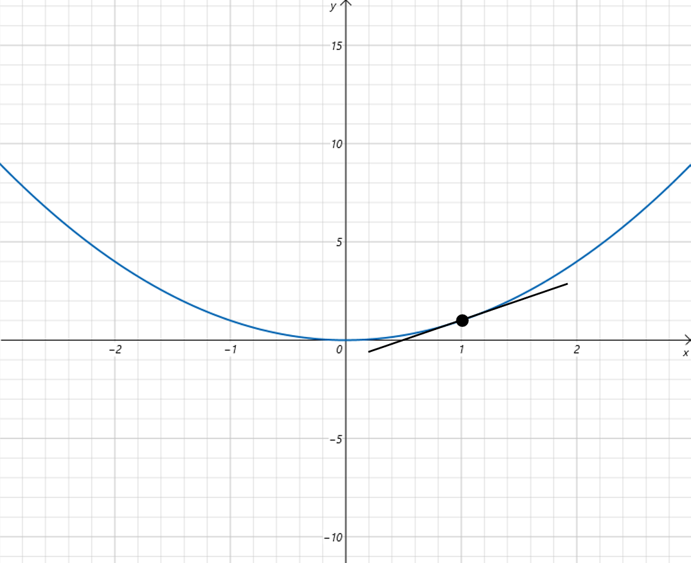
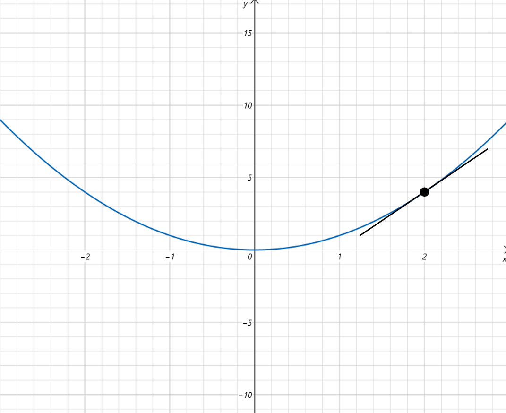

# 一元函数微分

## 3.5 一元函数微分

### 3.5.1 微分的由来

首先我们看函数：y\=f(x)\=2xy=f(x)=2xy\=f(x)\=2x，在x0x\_0x0​处有：

△y\=f(x0+△x)−f(x0)\=2(x0+△x)−2x0\=2△x\\triangle y =f(x\_0+\\triangle x)-f(x\_0)=2(x\_0+\\triangle x) - 2x\_0 = 2 \\triangle x△y\=f(x0​+△x)−f(x0​)\=2(x0​+△x)−2x0​\=2△x

可以看到在x0x\_0x0​处，y的增量等于x的增量的2倍。

接着看函数：y\=x2y=x^2y\=x2, 在x0x\_0x0​处有：

△y\=(x0+△x)2−x02\=2x0△x+(△x)2\\triangle y = (x\_0+\\triangle x)^2-{x\_0}^2=2x\_0\\triangle x+(\\triangle x)^2△y\=(x0​+△x)2−x0​2\=2x0​△x+(△x)2

lim⁡△x→0△y△x\=lim⁡△x→02x0△x+(△x)2△x\\lim\_{\\triangle x \\to 0}\\frac{\\triangle y}{\\triangle x}=\\lim\_{\\triangle x \\to 0}\\frac{2x\_0\\triangle x+(\\triangle x)^2}{\\triangle x}lim△x→0​△x△y​\=lim△x→0​△x2x0​△x+(△x)2​

lim⁡△x→0△y△x\=2x0\\lim\_{\\triangle x \\to 0}\\frac{\\triangle y}{\\triangle x}=2x\_0lim△x→0​△x△y​\=2x0​

可以看到在x0x\_0x0​处，y的增量由两部分构成，第一部分可以看做一个常数2x02x\_02x0​与x的增量△x\\triangle x△x的乘积，这部分△x\\triangle x△x和△y\\triangle y△y满足线性关系。第二部分，当△x\\triangle x△x趋于0时，(△x)2(\\triangle x)^2(△x)2可以看做是△x\\triangle x△x的高阶无穷小。所以当△x\\triangle x△x趋于0时，可以忽略高阶无穷小部分。原本x和y不是线性关系，但是x和y的增量部分，△y\\triangle y△y就可以用△x\\triangle x△x线性表示。所以当△x\\triangle x△x变化很小时，就可以用简单的线性估算出△y\\triangle y△y。

最后我们再看一个函数：y\=x3y=x^3y\=x3, 在x0x\_0x0​处有：

△y\=(x0+△x)3−x03\=3x02△x+3x0(△x)2+(△x)3\\triangle y = (x\_0+\\triangle x)^3-{x\_0}^3=3{x\_0}^2\\triangle x +3x\_0(\\triangle x)^2 +(\\triangle x)^3△y\=(x0​+△x)3−x0​3\=3x0​2△x+3x0​(△x)2+(△x)3

lim⁡△x→0△y△x\=lim⁡△x→03x02△x+3x0(△x)2+(△x)3△x\\lim\_{\\triangle x \\to 0}\\frac{\\triangle y}{\\triangle x}=\\lim\_{\\triangle x \\to 0}\\frac{3{x\_0}^2\\triangle x +3x\_0(\\triangle x)^2 +(\\triangle x)^3}{\\triangle x}lim△x→0​△x△y​\=lim△x→0​△x3x0​2△x+3x0​(△x)2+(△x)3​

lim⁡△x→0△y△x\=lim⁡△x→03x02△x+O(△x)△x\\lim\_{\\triangle x \\to 0}\\frac{\\triangle y}{\\triangle x}=\\lim\_{\\triangle x \\to 0}\\frac{3{x\_0}^2\\triangle x +O(\\triangle x)}{\\triangle x}lim△x→0​△x△y​\=lim△x→0​△x3x0​2△x+O(△x)​

lim⁡△x→0△y△x\=3x02\\lim\_{\\triangle x \\to 0}\\frac{\\triangle y}{\\triangle x}=3{x\_0}^2lim△x→0​△x△y​\=3x0​2

当△x\\triangle x△x趋于0时，△y\\triangle y△y也可以由△x\\triangle x△x的线性部分3x02△x3{x\_0}^2\\triangle x3x0​2△x和△x\\triangle x△x的高阶无穷小部分3x0(△x)2+(△x)33x\_0(\\triangle x)^2 +(\\triangle x)^3 3x0​(△x)2+(△x)3构成。所以当△x\\triangle x△x趋于0时，△y\\triangle y△y和△x\\triangle x△x之间也满足线性关系。进而当△x\\triangle x△x很小时，我们根据x的变化量也可以通过线性关系估算y的变化量。当x变化越小这个估算越准。

### 3.5.2 微分的定义

通过上边3个函数我们发现，当△x\\triangle x△x趋于0时，△y\\triangle y△y可以表示为一个常数A与△x\\triangle x△x的乘积加上一个△x\\triangle x△x的高阶无穷小。

△y\=A△x+O(△x);(△x→0)\\triangle y = A \\triangle x + O(\\triangle x);(\\triangle x \\to 0)△y\=A△x+O(△x);(△x→0)

则称y\=f(x)y=f(x)y\=f(x)在x0x\_0x0​处可微。A△xA \\triangle xA△x为线性主部（线性关系的主要部分）。记作：

dy\=Adx\\mathrm{d}y = A \\mathrm{d}xdy\=Adx

dx\\mathrm{d}xdx和dy\\mathrm{d}ydy分别是x和y的微分。

可微描述的是△x\\triangle x△x和△y\\triangle y△y之间的类线性关系。

### 3.5.3微分和导数的关系

dy\=Adx\\mathrm{d}y = A \\mathrm{d}xdy\=Adx 中的A等于f′(x0)f'(x\_0)f′(x0​)。

通过3.5.1节的几个例子，你可以发现：

对于y\=2xy=2xy\=2x，A等于2。

对于y\=x2y=x^2y\=x2，A等于2x02x\_02x0​。

对于y\=x3y=x^3y\=x3，A等于3(x0)23(x\_0)^23(x0​)2。

A都等于在x0x\_0x0​处的导数。

下边给出证明：

根据微分定义

△y\=A△x+O(△x);(△x→0)\\triangle y = A \\triangle x + O(\\triangle x);(\\triangle x \\to 0)△y\=A△x+O(△x);(△x→0)

则有：

lim⁡△x→0△y△x\=lim⁡△x→0(A+O(△x)△x)\=A\\lim\_{\\triangle x \\to 0} \\frac{\\triangle y}{\\triangle x}=\\lim\_{\\triangle x \\to 0}(A+\\frac{O( \\triangle x)}{\\triangle x})=Alim△x→0​△x△y​\=lim△x→0​(A+△xO(△x)​)\=A

lim⁡△x→0f(x0+△x)−f(x0)△x\=A\\lim\_{\\triangle x \\to 0} \\frac{f(x\_0+\\triangle x)-f(x\_0)}{\\triangle x}=Alim△x→0​△xf(x0​+△x)−f(x0​)​\=A

所以f′(x0)\=Af'(x\_0)=Af′(x0​)\=A

在一元函数里，可微和可导是等价的。可微必可导，可导必可微。

### 3.5.4微分的几何意义

微分的几何意义就是以直代曲。用直线代替曲线。比如函数y\=x2y=x^2y\=x2，它的导数dydx\=2x\\frac{\\mathrm{d}y}{\\mathrm{d}x}=2xdxdy​\=2x。

在x等于1附近，x发生微小变化时，y的变化可以用dy\=2dx\\mathrm{d}y = 2 \\mathrm{d}xdy\=2dx这个线性变化来近似。

同样的y\=x2y=x^2y\=x2在x等于2附近，x发生微小变化时，y的变化可以用dy\=4dx\\mathrm{d}y = 4 \\mathrm{d}xdy\=4dx这个线性变化来近似。

