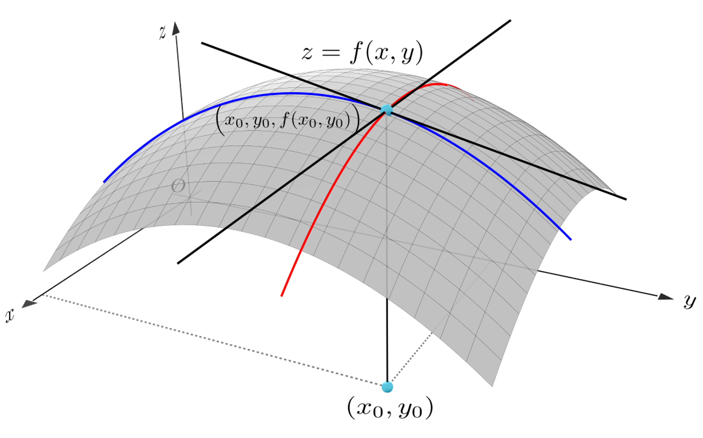

# 偏导数

## 3.6 偏导数

### 3.6.1 一元函数的导数

之前我们讲过一元函数的导数，函数在自变量某一点x0x\_0x0​的导数，表示当自变量的变化量△x→0\\triangle x \\to 0△x→0时，因变量关于自变量的变化率。

f′(x0)\=lim⁡△x→0△y△x\=lim⁡△x→0f(x0+△x)−f(x0)△x f'(x\_0)=\\lim\_{\\triangle x \\to 0} \\frac{\\triangle y}{\\triangle x}=\\lim\_{\\triangle x \\to 0} \\frac{f(x\_0+\\triangle x)-f(x\_0)}{\\triangle x} f′(x0​)\=△x→0lim​△x△y​\=△x→0lim​△xf(x0​+△x)−f(x0​)​

### 3.6.2 多元函数的偏导数

对于多元函数，比如：

z\=f(x,y) z=f(x,y) z\=f(x,y)

我们想要求函数在点(x0,y0)(x\_0,y\_0)(x0​,y0​)处的导数时，情况就变得复杂。因为对于一元函数而言，自变量只有一个，但是对多元函数，自变量有两个。为了简化我们的研究，每次可以只让自变量里的一个变量变化，而其他变量保持不变，这时对多元函数的求导，就转化为对一元函数的求导了，我们把这种导数，叫做偏导数。

比如对于上边自变量包含x和y的多元函数，在点(x0,y0)(x\_0,y\_0)(x0​,y0​)处，固定y\=y0y=y\_0y\=y0​，对x求偏导：

fx(x0,y0)\=lim⁡△x→0△zx△x\=lim⁡△x→0f(x0+△x,y0)−f(x0,y0)△x f\_x(x\_0,y\_0)=\\lim\_{\\triangle x \\to 0} \\frac{\\triangle z\_x}{\\triangle x}=\\lim\_{\\triangle x \\to 0} \\frac{f(x\_0+\\triangle x,y\_0)-f(x\_0,y\_0)}{\\triangle x} fx​(x0​,y0​)\=△x→0lim​△x△zx​​\=△x→0lim​△xf(x0​+△x,y0​)−f(x0​,y0​)​

在点(x0,y0)(x\_0,y\_0)(x0​,y0​)处，固定x\=x0x=x\_0x\=x0​，对y求偏导：

fy(x0,y0)\=lim⁡△y→0△zy△y\=lim⁡△y→0f(x0,y0+△y)−f(x0,y0)△y f\_y(x\_0,y\_0)=\\lim\_{\\triangle y \\to 0} \\frac{\\triangle z\_y}{\\triangle y}=\\lim\_{\\triangle y \\to 0} \\frac{f(x\_0,y\_0+\\triangle y)-f(x\_0,y\_0)}{\\triangle y} fy​(x0​,y0​)\=△y→0lim​△y△zy​​\=△y→0lim​△yf(x0​,y0​+△y)−f(x0​,y0​)​

偏导数也可以用另一种形式表示，比如z对x求偏导，可以表示为：

∂z∂x \\frac{\\partial z}{\\partial x} ∂x∂z​

### 3.6.2 一个例子

我们看一个二元函数：

f(x,y)\=x2y+3xy2 f(x,y)=x^2y+3xy^2 f(x,y)\=x2y+3xy2

我们分别求它对xxx和yyy的偏导数。

**对x求偏导**

当求x的偏导时，把y看做常数。

∂z∂x\=2xy+3y2 \\frac{\\partial z }{\\partial x}=2xy+3y^2 ∂x∂z​\=2xy+3y2

**对y求偏导** 当求y的偏导时，把x看做常数。

∂z∂y\=x2+6xy \\frac{\\partial z }{\\partial y}=x^2+6xy ∂y∂z​\=x2+6xy

**计算一个具体的点**

比如在点x=1，y=2处：

∂z∂x\=2xy+3y2\=16 \\frac{\\partial z }{\\partial x}=2xy+3y^2=16 ∂x∂z​\=2xy+3y2\=16

∂z∂y\=x2+6xy\=13 \\frac{\\partial z }{\\partial y}=x^2+6xy=13 ∂y∂z​\=x2+6xy\=13

### 3.6.3 偏导数的几何意义

根据上图可以看出，多元函数的偏导数也和一元函数的导数一样，都是表示切线斜率。

对于偏导数fx(x0,y0)f\_x(x\_0,y\_0)fx​(x0​,y0​)表示的是平面y\=y0y=y\_0y\=y0​与曲面z\=f(x,y)z=f(x,y)z\=f(x,y)的交线在x\=x0x=x\_0x\=x0​处，z对于x的变化率。

对于偏导数fy(x0,y0)f\_y(x\_0,y\_0)fy​(x0​,y0​)表示的是平面x\=x0x=x\_0x\=x0​与曲面z\=f(x,y)z=f(x,y)z\=f(x,y)的交线在y\=y0y=y\_0y\=y0​处，z对于y的变化率。
