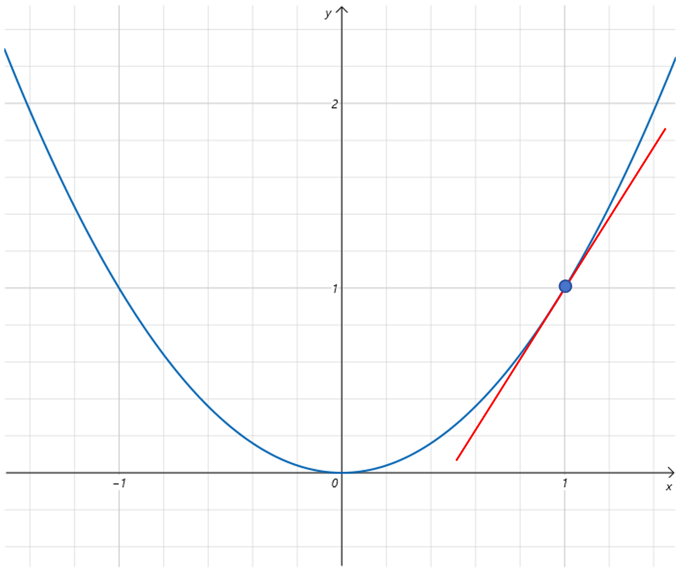
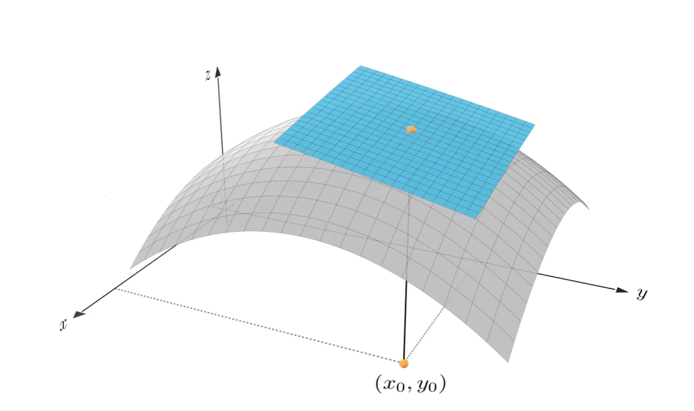

# 全微分

## 3.7 全微分

一句话概括微分研究的是如何**以直代曲**。将复杂的问题简单化，将非线性问题线性化。寻找因变量的微小增量与自变量微小增量之间的线性关系。

### 3.7.1 一元函数微分

在一元函数微分里，我们学到一元函数在某处可微，指的是因变量的增量△y\\triangle y△y 可以表示为一个常数AAA与自变量在该点的增量△x\\triangle x△x的乘积与一个△x\\triangle x△x的高阶无穷小的和。

△y\=A△x+O(△x);(△x→0) \\triangle y=A\\triangle x+O(\\triangle x);(\\triangle x \\to 0) △y\=A△x+O(△x);(△x→0)

也可以写作：

dy\=Adx \\mathrm{d}y = A \\mathrm{d}x dy\=Adx

其中A就是f′(x0)f'(x\_0)f′(x0​)  其几何意义就是用某点处的切线代替某点处的曲线。

### 3.7.2 多元函数微分

 对于多元函数而言，以二元函数z\=f(x,y)z=f(x,y)z\=f(x,y)为例，在点(x0,y0)(x\_0,y\_0)(x0​,y0​)处的微分叫做**全微分**，思想也是以直代曲，用该点处的切平面代替该点附近的曲面。

全微分可以用下边的式子表示：

△z\=A△x+B△y+O((△x)2+(△y)2);((△x)2+(△y)2→0) \\triangle z=A\\triangle x+B\\triangle y+O(\\sqrt {(\\triangle x)^2+(\\triangle y)^2});(\\sqrt {(\\triangle x)^2+(\\triangle y)^2} \\to 0) △z\=A△x+B△y+O((△x)2+(△y)2​);((△x)2+(△y)2​→0)

也可以写作：

dz\=Adx+Bdy \\mathrm{d}z = A \\mathrm{d}x+B \\mathrm{d}y dz\=Adx+Bdy

可以看到因变量z的变化部分△z\\triangle z△z和x的变化部分△x\\triangle x△x以及y的变化部分△y\\triangle y△y都是线性关系。(△x)2+(△y)2\\sqrt {(\\triangle x)^2+(\\triangle y)^2}(△x)2+(△y)2​表示移动的点与(x0,y0)(x\_0,y\_0)(x0​,y0​)之间的距离。当这个距离接近0时，上式成立。多元函数的微分是研究因变量的微小增量与自变量微小增量之间的线性关系。我们想要寻找这样一个线性关系，下边就是求出A，B这样系数的具体值是什么。

函数z\=f(x,y)z=f(x,y)z\=f(x,y)在点(x0,y0,z0)(x\_0,y\_0,z\_0)(x0​,y0​,z0​)处全微分也可以用下边的式子表示：

(z−z0)\=A(x−x0)+B(y−y0) (z-z\_0)=A(x-x\_0)+B(y-y\_0) (z−z0​)\=A(x−x0​)+B(y−y0​)

经过变换为：

A(x−x0)+B(y−y0)−(z−z0)\=0 A(x-x\_0)+B(y-y\_0)-(z-z\_0)=0 A(x−x0​)+B(y−y0​)−(z−z0​)\=0

这个式子就是经过点(x0,y0,z0)(x\_0,y\_0,z\_0)(x0​,y0​,z0​)且与向量\[A,B,-1\]垂直的平面方程。也就是\[A,B,-1\]为平面的法向量。为什么呢？

平面上的任何一个点与(x0,y0,z0)(x\_0,y\_0,z\_0)(x0​,y0​,z0​)构成的向量可以表示为(x−x0,y−y0,z−z0)(x-x\_0,y-y\_0,z-z\_0)(x−x0​,y−y0​,z−z0​), 这个向量与\[A,B,-1\]的点乘为0，则证明两根线夹角的cos值为0，也就是说平面上的任何一根线都与向量\[A,B,-1\]的夹角为90°，所以\[A,B,-1\]为平面的法向量。

两条直线就可以确定一个平面，之前我们在求偏导数时，实际上已经找到两个切线，他们分别是经过(x0,y0,z0)(x\_0,y\_0,z\_0)(x0​,y0​,z0​)点，与x轴平行的切线，和与y轴平行的切线。

这两个切线就可以决定这个切平面。我们现在要求的是这个切平面的法线。同时垂直于这两个切线的线就是切平面的法线。怎么找到同时垂直也这两个切线的向量表示呢？之前我们学过向量的叉积。两个向量的叉积就可以产生一个同时垂直于两个向量的新向量。叉乘的计算公式为：

a×b\=(aybz−azby)i+(azbx−axbz)j+(axby−aybx)k a \\times b = (a\_yb\_z-a\_zb\_y)i+(a\_zb\_x-a\_xb\_z)j+(a\_xb\_y-a\_yb\_x)k a×b\=(ay​bz​−az​by​)i+(az​bx​−ax​bz​)j+(ax​by​−ay​bx​)k

fx(x0,y0)f\_x(x\_0,y\_0)fx​(x0​,y0​)决定的平行于x轴的切线向量为\[1,0,fx(x0,y0)\]\[1,0,f\_x(x\_0,y\_0)\]\[1,0,fx​(x0​,y0​)\]，为什么呢？以(x0,y0,z0)(x\_0,y\_0,z\_0)(x0​,y0​,z0​)为新的原点，沿着与x轴平行的切线，x轴方向增加1，x变为1，因为垂直于y轴，所以y值不变，保持0。根据偏导数的定义，则z值会变为fx(x0,y0)f\_x(x\_0,y\_0)fx​(x0​,y0​)。所以我们在以(x0,y0,z0)(x\_0,y\_0,z\_0)(x0​,y0​,z0​)为原点的坐标系里，找到一个与x轴平行的切线：\[1,0,fx(x0,y0)\]\[1,0,f\_x(x\_0,y\_0)\]\[1,0,fx​(x0​,y0​)\]

fy(x0,y0)f\_y(x\_0,y\_0)fy​(x0​,y0​)决定的平行于y轴的切线向量为\[0,1,fy(x0,y0)\]\[0,1,f\_y(x\_0,y\_0)\]\[0,1,fy​(x0​,y0​)\]

根据叉乘公式，可以求得法向量为\[−fx(x0,y0),−fy(x0,y0),1\]\[-f\_x(x\_0,y\_0),-f\_y(x\_0,y\_0),1\]\[−fx​(x0​,y0​),−fy​(x0​,y0​),1\]，法向量有两个方向，对求得的法向量乘以-1，同样是法向量。所以\[fx(x0,y0),fy(x0,y0),−1\]\[f\_x(x\_0,y\_0),f\_y(x\_0,y\_0),-1\]\[fx​(x0​,y0​),fy​(x0​,y0​),−1\]是切平面的法向量。

再看全微分表达式：

A(x−x0)+B(y−y0)−(z−z0)\=0 A(x-x\_0)+B(y-y\_0)-(z-z\_0)=0 A(x−x0​)+B(y−y0​)−(z−z0​)\=0

\[A,B,−1\]\[A,B,-1\]\[A,B,−1\]是法向量，\[fx(x0,y0),fy(x0,y0),−1\]\[f\_x(x\_0,y\_0),f\_y(x\_0,y\_0),-1\]\[fx​(x0​,y0​),fy​(x0​,y0​),−1\]是我们求出来的法向量。 所以A的值就为fx(x0,y0)f\_x(x\_0,y\_0)fx​(x0​,y0​),也就是z在(x0,y0)(x\_0,y\_0)(x0​,y0​)点对x的偏导值。B的值就为fy(x0,y0)f\_y(x\_0,y\_0)fy​(x0​,y0​),也就是z在(x0,y0)(x\_0,y\_0)(x0​,y0​)点对y的偏导值。

最终，我们得到二元函数的全微分表达式：

dz\=fxdx+fydy\\mathrm{d}z=f\_x\\mathrm{d}x+f\_y\\mathrm{d}ydz\=fx​dx+fy​dy

同理，对于多元函数的全微分表达式为：

dz\=fx1dx1+fx2dx2+⋅⋅⋅+fxndxn\\mathrm{d}z=f\_{x\_1}\\mathrm{d}x\_1+f\_{x\_2}\\mathrm{d}x\_2+\\cdot \\cdot \\cdot+f\_{x\_n}\\mathrm{d}x\_ndz\=fx1​​dx1​+fx2​​dx2​+⋅⋅⋅+fxn​​dxn​

所以，对于多元函数而言，在某一点附近，因变量的变化量可以用各个自变量的变化量乘以函数针对各个自变量的偏导数进行累加来近似。
