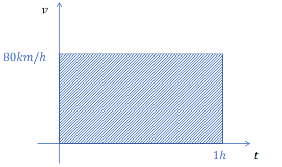
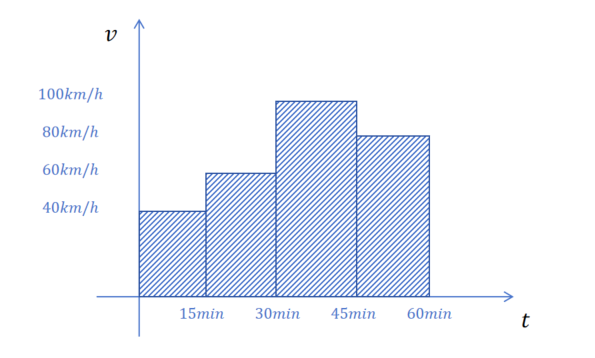
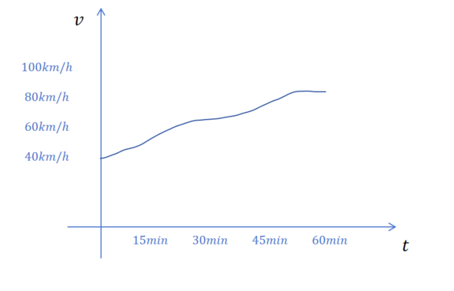
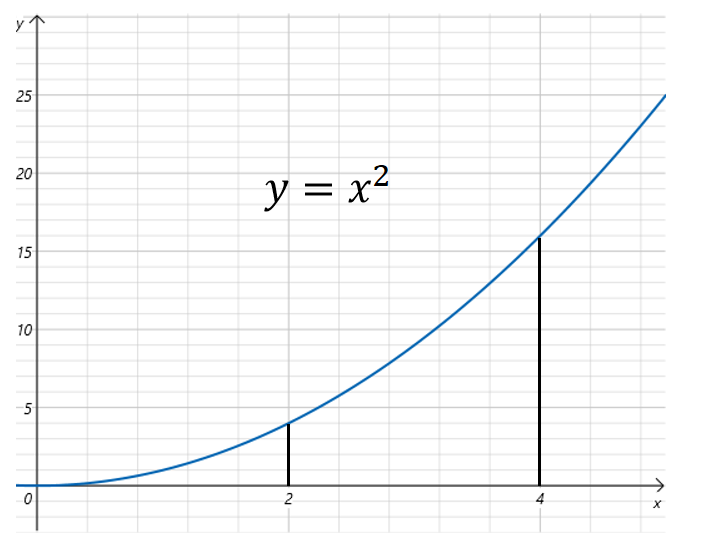

# 定积分

## 3.9 定积分

### 3.9.1 定积分的由来

假如你开着一辆车，以80千米每小时的速度匀速前进，开了1个小时，那么你行驶的路程是多少？ 答案是：

  
  

80×1\=8080\\times1=8080×1\=80千米

  
  

一直以相同速度行驶，实在无聊。前15分钟你以40千米每小时行驶，接下来15分钟以60千米每小时行驶，接下来15分钟以100千米每小时行驶，最后15分钟以80千米每小时行驶，那总共行驶的路程是多少？

答案也不难计算：  
  

0.25×40+0.25×60+0.25×80+0.25×100\=700.25\\times40+0.25\\times60+0.25\\times80+0.25\\times100=700.25×40+0.25×60+0.25×80+0.25×100\=70千米

  
  
更现实的情况是，你行驶了一个小时，但是行驶的速度一直在变化，那该怎么计算呢？

还是利用微积分里的重要思想，以直代曲。把这一个小时划分成无数个时间片段，每个时间片段里选取任一时刻的速度作为这个时间片段的平均速度。然后用时段平均速度乘以时段时间，就代表这个时段行驶的路程。最终把所有时段行驶路程加起来就是总共行驶的路程。可以想象，时间片段划分的越小，这个估算越准确，当所有划分的时间片段里最大的时间片段都趋于0时，就可以得到真实的行驶路程了。

上边这个思想就是定积分的思想。

### 3.9.2 定积分的概念

把上边对可变速度看做由一个函数f(x)f(x)f(x)来决定，x是时刻，f(x)f(x)f(x)是时刻x时的速度。用标准的数学语言描述积分就为：

设f(x)f(x)f(x)在\[a,b\]上有界，在\[a,b\]中插入若干个分点：  
  

a\=x0<x1<⋅⋅⋅<xn\=ba=x\_0<x\_1<\\cdot\\cdot\\cdot<x\_n=ba\=x0​<x1​<⋅⋅⋅<xn​\=b

  
  
把区间\[a,b\]分成n个小区间，各个小区间的长度依次为：  
  

△xi\=xi−xi−1(i\=1,2,...)\\triangle x\_i=x\_i-x\_{i-1}(i=1,2,...)△xi​\=xi​−xi−1​(i\=1,2,...)

  
  
在个小区间上任取一点ξi(ξi∈\[xi−1,xi\])\\xi\_i(\\xi\_i\\in\[x\_{i-1},x\_i\])ξi​(ξi​∈\[xi−1​,xi​\])，作乘积f(ξi)△xi(i\=1,2,...)f(\\xi\_i)\\triangle x\_i(i=1,2,...)f(ξi​)△xi​(i\=1,2,...)，并求和  
  

S\=∑i\=1nf(ξi)△xiS=\\sum\_{i=1}^{n} f(\\xi\_i)\\triangle x\_iS\=∑i\=1n​f(ξi​)△xi​

  
  
记λ\=max{△x1,△x2,...,△xn}\\lambda = max\\left \\{ \\triangle x\_1,\\triangle x\_2,...,\\triangle x\_n \\right \\} λ\=max{△x1​,△x2​,...,△xn​}，不论对\[a,b\]怎么划分，也不论在小区间\[xi−1,xi\]\[x\_{i-1},x\_i\]\[xi−1​,xi​\]上的点ξi\\xi\_iξi​怎么选取。只要当λ→0\\lambda \\to 0λ→0时，和SSS总是趋向于特定的极限III,我们称这个III为函数f(x)f(x)f(x)在区间\[a,b\]上的定积分，记作：  
  

∫abf(x)dx\\int\_{a}^{b} f(x) \\mathrm{d}x ∫ab​f(x)dx

  
  
即：  
  

∫abf(x)dx\=I\=lim⁡λ→0∑i\=1nf(ξi)△xi\\int\_{a}^{b} f(x) \\mathrm{d}x =I = \\lim\_{\\lambda \\to 0} \\sum\_{i=1}^{n} f(\\xi\_i)\\triangle x\_i∫ab​f(x)dx\=I\=limλ→0​∑i\=1n​f(ξi​)△xi​

  
  

我们再来理解一下定积分公式的含义，一个函数在定义域区间a,b内，函数值是有界的，我们如何求这个区间的面积呢？可以利用极限的思想，将a和b之间的区间分成无数的小的区间，将这些小的区间的面积的加和来估算f(x)f(x)f(x)在\[a,b\]\[a,b\]\[a,b\]区间的面积。小区间的面积就等于区间的长度，乘以这个区间上任一点f(x)f(x)f(x)的值。如何让这个估算准确呢？那就是让我们分成的这些小区间中最大的那个趋于0。最大的趋于0，那所有的区间大小都趋于0，在这个所划分的小区间都趋于0的过程中，这些小区间面积加和值的极限就等于f(x)f(x)f(x)在\[a,b\]\[a,b\]\[a,b\]区间的面积。

### 3.9.3 定积分的计算

假设汽车的行驶速度y(km/h)满足方程y\=x2y=x^2y\=x2,x为小时。那么问汽车在第2小时到第4小时之间行驶过的路程怎么算？

根据定积分的定义，这就是求  
  

∫24x2dx\\int\_{2}^{4} x^2 \\mathrm{d}x ∫24​x2dx

  
  
根据积分的定义，很难算出结果。我们换个思路来考虑，我们可以用汽车在第4小时行驶的总里程减去汽车在第2小时行驶的总里程来计算，这样就简单了很多。

但问题是我们目前只知道汽车瞬时速度随时间变化的函数，不知道路程随时间变化的函数。没有关系，根据我们之前学过的导数的定义，我们知道**瞬时速度是路程对时间的导数**。

那我们只需要找到哪个函数的导函数是速度函数f(x)\=x2f(x)=x^2f(x)\=x2，那样就得到路程随时间变化的函数了（称它为导函数的原函数）。不难得到原函数为：

  
  

g(x)\=13x3+Cg(x)=\\frac{1}{3}x^3+Cg(x)\=31​x3+C C为一个常数，这里就是汽车在0时的里程数。

  
  

g′(x)\=f(x)\=x2g'(x)=f(x)=x^2g′(x)\=f(x)\=x2

  
  
有了汽车里程随时间变化的函数，我们用4时的里程减去2时的里程，就得到了积分的结果：  
  

1343+C−1323−C\=563\\frac{1}{3}4^3+C-\\frac{1}{3}2^3-C=\\frac{56}{3}31​43+C−31​23−C\=356​

  
  
通过这道题，我们可以得到计算定积分的公式（牛顿-莱布尼茨公式）：

如果函数F(x)F(x)F(x)是连续函数f(x)f(x)f(x)在区间\[a,b\]上的一个原函数，则：  
  

∫abf(x)dx\=F(b)−F(a)\\int\_{a}^{b} f(x) \\mathrm{d}x=F(b)-F(a)∫ab​f(x)dx\=F(b)−F(a)
