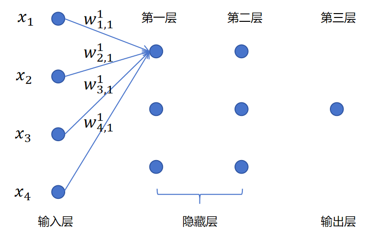
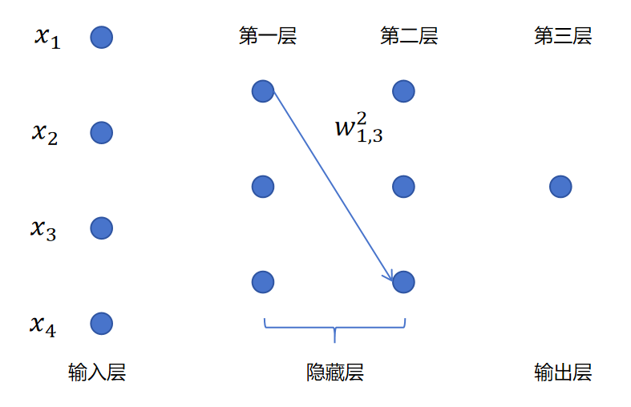
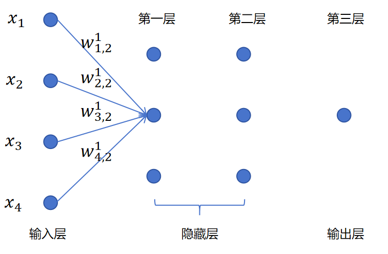
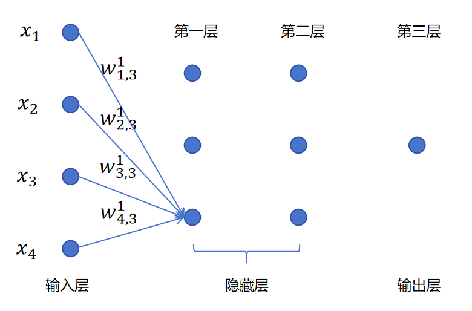

# 神经网络与矩阵运算

## 8.3神经网络与矩阵计算

神经网络之所以能够独步天下，成为当今最重要的机器学习算法。与它可以将计算转化为高效的矩阵计算密不可分。再加上GPU硬件专门针对矩阵运算进行了优化。让神经网络的训练速度大幅提高，也加快了神经网络的推广。

### 8.3.1 一个例子

对上图这样一个3层的神经网络。我们关注第一层的第一个神经元的计算。其中x1,x2,x3,x4x\_1,x\_2,x\_3,x\_4x1​,x2​,x3​,x4​是一个样本的4个特征值，也就是输入层的输入。 其中w1,11w\_{1,1}^1w1,11​表示一个权重值。上标1，表示这是第一层的参数。下标(1,1)，第一个1表示这是针对第一个输入的权重。第二个1表示这是第一层的第1个神经元。所以w1,11w\_{1,1}^1w1,11​表示第一层的第一个神经元对第一个输入的权重参数。

类似的对于w1,32w\_{1,3}^2w1,32​，就表示第2层的第3个神经元对第1个输入的权重参数。如下图所示：

我们回到第一层第一个神经元的线性回归计算，暂时不考虑偏置和激活函数。则它的计算式为：

z11\=\[x1,x2,x3,x4\]\[w1,11w2,11w3,11w4,11\]z\_1^1=\[x\_1,x\_2,x\_3,x\_4\]\\begin{bmatrix}w\_{1,1}^1\\\\w\_{2,1}^1\\\\w\_{3,1}^1\\\\w\_{4,1}^1\\end{bmatrix}z11​\=\[x1​,x2​,x3​,x4​\]⎣⎢⎢⎢⎡​w1,11​w2,11​w3,11​w4,11​​⎦⎥⎥⎥⎤​

其中z11z\_1^1z11​表示线性回归的结果，上标1表示第1层，下标1表示第一个神经元。

同理，我们可以得到：

z21\=\[x1,x2,x3,x4\]\[w1,21w2,21w3,21w4,21\]z\_2^1=\[x\_1,x\_2,x\_3,x\_4\]\\begin{bmatrix}w\_{1,2}^1\\\\w\_{2,2}^1\\\\w\_{3,2}^1\\\\w\_{4,2}^1\\end{bmatrix}z21​\=\[x1​,x2​,x3​,x4​\]⎣⎢⎢⎢⎡​w1,21​w2,21​w3,21​w4,21​​⎦⎥⎥⎥⎤​

z31\=\[x1,x2,x3,x4\]\[w1,31w2,31w3,31w4,31\]z\_3^1=\[x\_1,x\_2,x\_3,x\_4\]\\begin{bmatrix}w\_{1,3}^1\\\\w\_{2,3}^1\\\\w\_{3,3}^1\\\\w\_{4,3}^1\\end{bmatrix}z31​\=\[x1​,x2​,x3​,x4​\]⎣⎢⎢⎢⎡​w1,31​w2,31​w3,31​w4,31​​⎦⎥⎥⎥⎤​

上边是分别对z11,z21,z31z\_1^1,z\_2^1,z\_3^1z11​,z21​,z31​进行计算。我们可以换成更高效的矩阵计算方式，对z1z^1z1一次性进行计算。

z1\=\[z11,z21,z31\]\=\[x1,x2,x3,x4\]\[w1,11w1,21w1,31w2,11w2,21w2,31w3,11w3,21w3,31w4,11w4,21w4,31\]z^1=\[z\_1^1,z\_2^1,z\_3^1\]=\[x\_1,x\_2,x\_3,x\_4\]\\begin{bmatrix}w\_{1,1}^1&w\_{1,2}^1&w\_{1,3}^1\\\\w\_{2,1}^1&w\_{2,2}^1&w\_{2,3}^1\\\\w\_{3,1}^1&w\_{3,2}^1&w\_{3,3}^1\\\\w\_{4,1}^1&w\_{4,2}^1&w\_{4,3}^1\\end{bmatrix}z1\=\[z11​,z21​,z31​\]\=\[x1​,x2​,x3​,x4​\]⎣⎢⎢⎢⎡​w1,11​w2,11​w3,11​w4,11​​w1,21​w2,21​w3,21​w4,21​​w1,31​w2,31​w3,31​w4,31​​⎦⎥⎥⎥⎤​

这是对一个样本的4个特征进行计算，我们可以对多个样本进行计算，这样就变成两个矩阵相乘。 x1,2x\_{1,2}x1,2​表示第1个样本的第2个特征。

\[x11x12x13x14x21x22x23x24\]\[w1,11w1,21w1,31w2,11w2,21w2,31w3,11w3,21w3,31w4,11w4,21w4,31\]\\begin{bmatrix}x\_{11}&x\_{12}&x\_{13}&x\_{14}\\\\x\_{21}&x\_{22}&x\_{23}&x\_{24}\\end{bmatrix}\\begin{bmatrix}w\_{1,1}^1&w\_{1,2}^1&w\_{1,3}^1\\\\w\_{2,1}^1&w\_{2,2}^1&w\_{2,3}^1\\\\w\_{3,1}^1&w\_{3,2}^1&w\_{3,3}^1\\\\w\_{4,1}^1&w\_{4,2}^1&w\_{4,3}^1\\end{bmatrix}\[x11​x21​​x12​x22​​x13​x23​​x14​x24​​\]⎣⎢⎢⎢⎡​w1,11​w2,11​w3,11​w4,11​​w1,21​w2,21​w3,21​w4,21​​w1,31​w2,31​w3,31​w4,31​​⎦⎥⎥⎥⎤​

对于每一层都是类似的，我们可以对批量输入数据和多个神经元的线性回归进行矩阵运算。这大大加速了神经网络的计算，特别是在GPU上。

当我们计算出了z1\=\[z11,z21,z31\]z^1=\[z\_1^1,z\_2^1,z\_3^1\]z1\=\[z11​,z21​,z31​\]可以给线性回归结果加上偏置值\[b11,b21,b31\]\[b\_1^1,b\_2^1,b\_3^1\]\[b11​,b21​,b31​\]。b21b\_2^1b21​表示第一层第二个神经元的偏置值。

z1\=\[z11,z21,z31\]+\[b11,b21,b31\]z^1=\[z\_1^1,z\_2^1,z\_3^1\]+\[b\_1^1,b\_2^1,b\_3^1\]z1\=\[z11​,z21​,z31​\]+\[b11​,b21​,b31​\]

然后对每个元素应用sigmoid函数就得到了第1层的激活值：

a1\=sigmoid(\[z11,z21,z31\])a^1=sigmoid(\[z\_1^1,z\_2^1,z\_3^1\])a1\=sigmoid(\[z11​,z21​,z31​\])

接下来a1a\_1a1​就成为神经网络第二层的输入，同样第二层的计算也可以用矩阵运算完成。比如：

z2\=\[z12,z22,z32\]\=\[a11,a21,a31\]\[w1,12w1,22w1,32w2,12w2,22w2,32w3,12w3,22w3,32\]z^2=\[z\_1^2,z\_2^2,z\_3^2\]=\[a\_1^1,a\_2^1,a\_3^1\]\\begin{bmatrix}w\_{1,1}^2&w\_{1,2}^2&w\_{1,3}^2\\\\w\_{2,1}^2&w\_{2,2}^2&w\_{2,3}^2\\\\w\_{3,1}^2&w\_{3,2}^2&w\_{3,3}^2\\end{bmatrix}z2\=\[z12​,z22​,z32​\]\=\[a11​,a21​,a31​\]⎣⎢⎡​w1,12​w2,12​w3,12​​w1,22​w2,22​w3,22​​w1,32​w2,32​w3,32​​⎦⎥⎤​

在神经网络进行反向传播，计算梯度时，同样可以利用矩阵运算进行加速，后边我们会详细讲解。

### 8.3.2为什么GPU适合做矩阵运算

GPU与CPU最大的不同是GPU拥有大量的上千个计算核心，这些核心可以同时处理大量简单的计算任务。而矩阵运算本质就是大量相同的操作（如乘法和加法），非常适合并行化。进行矩阵乘法时，每个结果矩阵的元素可以由不同的GPU核心并行进行计算，彼此并不影响。

GPU最初是为了图像处理而设计的，而图像也是一种矩阵（像素的二维矩阵）。GPU天生就优化了对矩阵、向量的处理能力。另外，随着人工智能的兴起，GPU也专门加强了GPU在人工智能领域的计算能力，从硬件层面做出优化，比如Tensor Core，它就是专门为了矩阵乘法设计的硬件单元。
