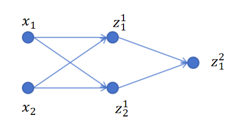
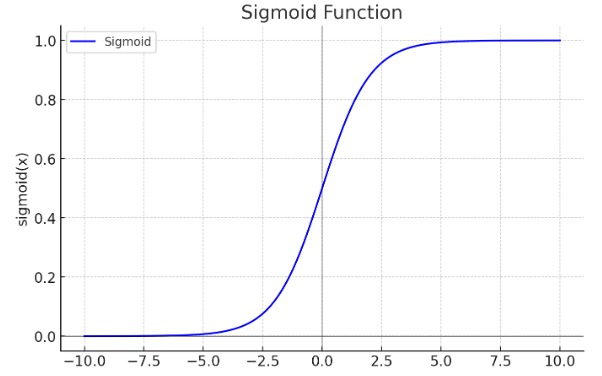
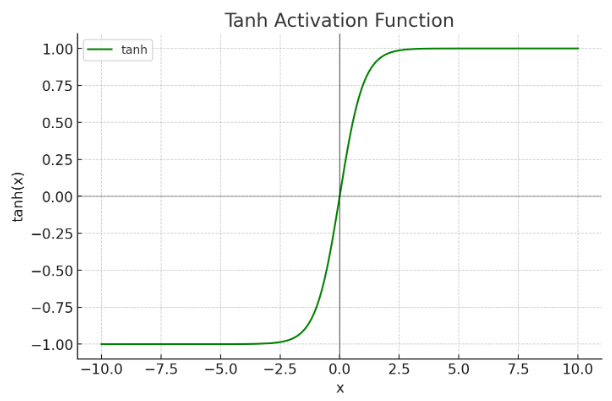
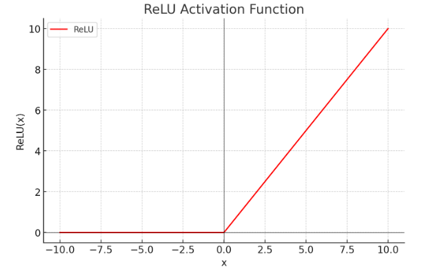
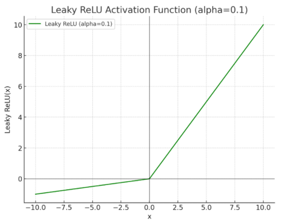

# 激活函数

## 8.4激活函数

激活函数在神经网络里很重要。如果没有激活函数，不论几层的神经网络都是一个线性回归。激活函数的作用是引入非线性。

### 8.4.1引入非线性

以上边1个隐藏层，一个输出层的简单神经网络为例，如果没有激活函数，只进行线性回归。那么第一个隐藏层输出为：

z11\=x1w111+x2w211+b11z\_1^1=x\_1w\_{11}^1+x\_2w\_{21}^1+b\_1^1z11​\=x1​w111​+x2​w211​+b11​

z21\=x1w121+x2w221+b21z\_2^1=x\_1w\_{12}^1+x\_2w\_{22}^1+b\_2^1z21​\=x1​w121​+x2​w221​+b21​

输出层的输出为：

z12\=z11w112+z21w212+b12z\_1^2=z\_1^1w\_{11}^2+z\_2^1w\_{21}^2+b\_1^2z12​\=z11​w112​+z21​w212​+b12​

联立并带入上式，可以得到：

z12\=(w111w121+w121w212)x1+(w211w112+w221w212)x2+b11w112+b21w212+b12z\_1^2=(w\_{11}^1w\_{12}^1+w\_{12}^1w\_{21}^2)x\_1+(w\_{21}^1w\_{11}^2+w\_{22}^1w\_{21}^2)x\_2+b\_1^1w\_{11}^2+b\_2^1w\_{21}^2+b\_1^2z12​\=(w111​w121​+w121​w212​)x1​+(w211​w112​+w221​w212​)x2​+b11​w112​+b21​w212​+b12​

可以将参数w和b的组合看成是一个新的参数。最终输出z12z\_1^2z12​还是输入x1x\_1x1​和x2x\_2x2​的一个线性组合。

这说明，如果没有激活函数，不论有几层线性回归，最终都等价于一层的线性回归。

正是因为引入激活函数，模拟了大脑神经元里的抑制和激活。才让神经网络可以拟合任意函数。下边我们就来看一下常见的激活函数。

### 8.4.2Sigmoid

我们之前讲过Simgoid函数，它的公式为：

sigmoid(x)\=11+e−xsigmoid(x)=\\frac{1}{1+e^{-x}}sigmoid(x)\=1+e−x1​

函数图像为：

它可以将x映射到0到1之间。这样有一个好处是0-1自然映射到概率值范围。它非常适合作为二分类问题的神经网络的最后一层唯一神经元的激活函数。

### 8.4.3Tanh

下边我们接着介绍另一种常用的激活函数。

它的函数公式为：

tanh(x)\=ex−e−xex+e−xtanh(x) = \\frac{e^x - e^{-x}}{e^x + e^{-x}}tanh(x)\=ex+e−xex−e−x​

函数图像为：

可以看到tanh函数的值域是-1到1之间。

### 8.4.4Relu

ReLU函数是目前深度学习里最常用的激活函数。它的函数形式非常简单：

ReLU(x)\=max(x,0)ReLU(x)=max(x,0)ReLU(x)\=max(x,0)

也就是说，当输入当x>0 时，输出为 x；当输入 x≤0 时，输出为 0。 它的函数图像为：

为什么ReLU会成为深度学习里默认的激活函数呢？后边我们会详细介绍。

### 8.4.5Leaky ReLU

ReLU函数有个问题，就是当x小于0时，ReLU(x)值为0，它的梯度为0，参数无法更新。所有人们提出了Leaky ReLU：

当x大于0时：

LeakyReLU(x)\=xLeakyReLU(x)=xLeakyReLU(x)\=x

当x小于等于0时：

LeakyReLU(x)\=αxLeakyReLU(x)=\\alpha xLeakyReLU(x)\=αx

其中α\\alphaα一般取小于1的数，比如0.1。这样当x取负值是也会有一个微小的梯度，可以更新参数。它的函数图像为：

