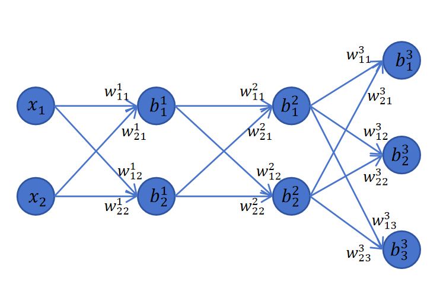

# 多分类神经网络的反向传播

## 8.6多分类神经网络的反向传播

虽然在PyTorch里你只需要定义模型的前向传播过程并给出损失函数。PyTorch框架会帮你在后向传播时自动计算梯度并使用优化器更新参数。但是我们还是需要自己推导一次神经网络反向传播的梯度计算。这将帮助你彻底了解神经网络的训练原理，消除它的神秘感。而且了解反向传播的具体过程也可以帮助我们理解后边一系列神经网络的训练优化技术。

这一节是我们这个课程里数学含量最高的一节，请你给自己倒一杯咖啡，拿出纸和笔。我们一起来推导一次神经网络的反向传播过程。相信我，这个过程对你会非常有意义。我现在还能清楚的回忆起自己当年第一次推导完成整个神经网络反向传播过程，然后通过简洁的代码实现，训练模型，最终模型可以实现手写数字识别时自己的欣喜。

如果这里你这里实在没有学懂，也完全没有关系，神经网络对参数求梯度PyTorch已经帮我们实现好了，你实际工作中从来都不需要手动来计算梯度。你可以跳过这一节继续学习。不要以此为借口停止对深度学习技术的探索。你完全可以在学完本门课程后有空时再来看这一部分。

### 8.6.1网络结构

 我们以上边这个图里展示的神经网络为例，输入feature维度为2，2个隐藏层，每层的神经元为2个，输出层有3个神经元来支持3分类任务。

### 8.6.2前向传播过程

我们先写出前向传播过程。 输入：

\[x1x2\]\\begin{bmatrix} x\_1& x\_2 \\end{bmatrix}\[x1​​x2​​\]

第一个隐藏层的logits：

\[z11z21\]\=\[x1x2\]\[w111w121w211w221\]+\[b11b21\]\\begin{bmatrix}z\_1^1& z\_2^1 \\end{bmatrix}=\\begin{bmatrix}x\_1& x\_2 \\end{bmatrix}\\begin{bmatrix} w\_{11}^1 & w\_{12}^1\\\\ w\_{21}^1 & w\_{22}^1\\end{bmatrix}+\\begin{bmatrix} b\_1^1& b\_2^1 \\end{bmatrix}\[z11​​z21​​\]\=\[x1​​x2​​\]\[w111​w211​​w121​w221​​\]+\[b11​​b21​​\]

第一个隐藏层的输出如下。其中act()是激活函数，对logits的值逐个应用激活函数：

\[a11a21\]\=\[act(z11)act(z21)\]\\begin{bmatrix}a\_1^1& a\_2^1 \\end{bmatrix}=\\begin{bmatrix} act(z\_1^1)& act(z\_2^1) \\end{bmatrix}\[a11​​a21​​\]\=\[act(z11​)​act(z21​)​\]

第一个隐藏层的输出作为第二个隐藏层的输入，则第二个隐藏层的logits为：

\[z12z22\]\=\[a11a21\]\[w112w122w212w222\]+\[b12b22\]\\begin{bmatrix}z\_1^2& z\_2^2 \\end{bmatrix}=\\begin{bmatrix}a\_1^1& a\_2^1 \\end{bmatrix}\\begin{bmatrix} w\_{11}^2 & w\_{12}^2\\\\ w\_{21}^2 & w\_{22}^2\\end{bmatrix}+\\begin{bmatrix} b\_1^2& b\_2^2 \\end{bmatrix}\[z12​​z22​​\]\=\[a11​​a21​​\]\[w112​w212​​w122​w222​​\]+\[b12​​b22​​\]

第二个隐藏层的输出：

\[a12a22\]\=\[act(z12)act(z22)\]\\begin{bmatrix}a\_1^2& a\_2^2 \\end{bmatrix}=\\begin{bmatrix} act(z\_1^2)& act(z\_2^2) \\end{bmatrix}\[a12​​a22​​\]\=\[act(z12​)​act(z22​)​\]

输出层的logits：

\[z13z23z33\]\=\[a12a22\]\[w113w123w133w213w223w233\]+\[b13b23b33\]\\begin{bmatrix}z\_1^3& z\_2^3 & z\_3^3 \\end{bmatrix}=\\begin{bmatrix}a\_1^2& a\_2^2 \\end{bmatrix}\\begin{bmatrix} w\_{11}^3 & w\_{12}^3& w\_{13}^3\\\\ w\_{21}^3 & w\_{22}^3 & w\_{23}^3\\end{bmatrix}+\\begin{bmatrix} b\_1^3& b\_2^3 & b\_3^3\\end{bmatrix}\[z13​​z23​​z33​​\]\=\[a12​​a22​​\]\[w113​w213​​w123​w223​​w133​w233​​\]+\[b13​​b23​​b33​​\]

输出层经过softmax得到神经网络的输出：

a3\=\[a13a23a33\],ai3\=ezi3∑j\=13ezj3a^3 = \\begin{bmatrix}a\_1^3& a\_2^3 & a\_3^3 \\end{bmatrix},a\_i^3=\\frac{e^{z\_i^3}}{\\sum\_{j=1}^{3}e^{z\_j^3}}a3\=\[a13​​a23​​a33​​\],ai3​\=∑j\=13​ezj3​ezi3​​

网络输出结果和标签值利用交叉熵损失函数来计算loss： 真实标签用一维的one-hot向量表示：

y\=\[y1y2y3\]y=\\begin{bmatrix} y\_1& y\_2 & y\_3 \\end{bmatrix}y\=\[y1​​y2​​y3​​\]

其中向量yyy的元素中只有一个元素为1，其余元素为0。 则交叉熵loss公式为：

loss\=−(y1lna13+y2lna23+y3lna33)loss=-(y\_1lna\_1^3+y\_2lna\_2^3+y\_3lna\_3^3)loss\=−(y1​lna13​+y2​lna23​+y3​lna33​)

### 8.6.3反向传播过程

神经网络里每层的权重和偏置都可以看成是一个由多个参数构成的矩阵。反向传播时需要计算每个权重和偏置的梯度，实际上就是用最终的loss值对每一个参数求导，这些对单个参数的求导计算可以通过矩阵运算进行加速。后边我们会详细来解释。如果你不理解其中的过程，你可以从最终的loss对单个参数利用链式法则进行求导。你会发现和我下边讲的结果是一致的。推导的过程可能有些麻烦，但是一旦你完成一次，神经网络对你而言，就不再神秘了。

#### 8.6.3.1 loss对logits求导

首先我们来求解loss对模型输出的logits z3z^3z3的偏导数。它等于loss对z13,z23,z33z\_1^3,z\_2^3,z\_3^3z13​,z23​,z33​分别求导，我们以loss对z13z\_1^3z13​求导为例来求解。这是一个复合函数求导，要用到链式法则。

z13z\_1^3z13​通过softmax函数，参与了a13,a23,a33a\_1^3,a\_2^3,a\_3^3a13​,a23​,a33​的计算。然后a13,a23,a33a\_1^3,a\_2^3,a\_3^3a13​,a23​,a33​参与了最终loss的计算。所以loss对z3z^3z3的求导，就是loss先对a13,a23,a33a\_1^3,a\_2^3,a\_3^3a13​,a23​,a33​求导，然后乘以a13,a23,a33a\_1^3,a\_2^3,a\_3^3a13​,a23​,a33​对z3z^3z3求导。

又因为最终loss表达式可以看作是−y1lna13,−y1lna13,−y3lna33\-y\_1lna\_1^3,-y\_1lna\_1^3,-y\_3lna\_3^3−y1​lna13​,−y1​lna13​,−y3​lna33​三个表达式加和的形式。所以最终loss对z13的求导，也是三个复合函数求导结果的加和形式。具体公式如下：

∂loss∂z13\=∂loss∂a13⋅∂a13∂z13+∂loss∂a23⋅∂a23∂z13+∂loss∂a33⋅∂a33∂z13\\frac{\\partial loss}{\\partial z\_1^3}=\\frac{\\partial loss}{\\partial a\_1^3}\\cdot\\frac{\\partial a\_1^3}{\\partial z\_1^3}+\\frac{\\partial loss}{\\partial a\_2^3}\\cdot\\frac{\\partial a\_2^3}{\\partial z\_1^3}+\\frac{\\partial loss}{\\partial a\_3^3}\\cdot\\frac{\\partial a\_3^3}{\\partial z\_1^3}∂z13​∂loss​\=∂a13​∂loss​⋅∂z13​∂a13​​+∂a23​∂loss​⋅∂z13​∂a23​​+∂a33​∂loss​⋅∂z13​∂a33​​

\=−y1a13⋅∂a13∂z13+−y2a23⋅∂a23∂z13+−y3a33⋅∂a33∂z13\=\\frac{-y\_1}{a\_1^3}\\cdot\\frac{\\partial a\_1^3}{\\partial z\_1^3}+\\frac{-y\_2}{a\_2^3}\\cdot\\frac{\\partial a\_2^3}{\\partial z\_1^3}+\\frac{-y\_3}{a\_3^3}\\cdot\\frac{\\partial a\_3^3}{\\partial z\_1^3}\=a13​−y1​​⋅∂z13​∂a13​​+a23​−y2​​⋅∂z13​∂a23​​+a33​−y3​​⋅∂z13​∂a33​​ (式8-1)

接下来，我们分两种情况进行讨论：

**第一种情况**

这个样本分类结果就是第一类，这时label为：y1\=1,y2\=0,y3\=0y\_1=1,y\_2=0,y\_3=0y1​\=1,y2​\=0,y3​\=0,可以化简上式为： ∂loss∂z13\=−y1a13⋅∂a13∂z13\\frac{\\partial loss}{\\partial z\_1^3}=\\frac{-y\_1}{a\_1^3}\\cdot\\frac{\\partial a\_1^3}{\\partial z\_1^3}∂z13​∂loss​\=a13​−y1​​⋅∂z13​∂a13​​

继续求导：

∂loss∂z13\=−y1a13⋅ez13∑j\=13ezj3−(ez13)2(∑j\=13ezj3)2\\frac{\\partial loss}{\\partial z\_1^3}=\\frac{-y\_1}{a\_1^3}\\cdot\\frac{e^{z\_1^3}\\sum\_{j=1}^{3}e^{z\_j^3}-(e^{z\_1^3})^2}{(\\sum\_{j=1}^{3}e^{z\_j^3})^2}∂z13​∂loss​\=a13​−y1​​⋅(∑j\=13​ezj3​)2ez13​∑j\=13​ezj3​−(ez13​)2​

带入以下a13a\_1^3a13​的公式进行化简：

a13\=ez13∑j\=13ezj3a\_1^3=\\frac{e^{z\_1^3}}{\\sum\_{j=1}^{3}e^{z\_j^3}}a13​\=∑j\=13​ezj3​ez13​​

化简后的结果为：

∂loss∂z13\=−y1a13⋅(a13−(a13)2)\\frac{\\partial loss}{\\partial z\_1^3}=\\frac{-y\_1}{a\_1^3}\\cdot (a\_1^3-(a\_1^3)^2)∂z13​∂loss​\=a13​−y1​​⋅(a13​−(a13​)2)

继续化简：

∂loss∂z13\=a13y1−y1\\frac{\\partial loss}{\\partial z\_1^3}=a\_1^3y\_1-y\_1∂z13​∂loss​\=a13​y1​−y1​

因为y1\=1y\_1=1y1​\=1,所以：

∂loss∂z13\=a13−y1\\frac{\\partial loss}{\\partial z\_1^3}=a\_1^3-y\_1∂z13​∂loss​\=a13​−y1​

**第二种情况**

这个样本分类结果不是第一类： 假设类别为k，k不是第一类。 则化简式8-1为：

∂loss∂z13\=−ykak3⋅∂ak3∂z13\\frac{\\partial loss}{\\partial z\_1^3}=\\frac{-y\_k}{a\_k^3}\\cdot\\frac{\\partial a\_k^3}{\\partial z\_1^3}∂z13​∂loss​\=ak3​−yk​​⋅∂z13​∂ak3​​

继续求导：（因为k不等于1，所以z13z\_1^3z13​仅出现在softmax的分母里。）

∂loss∂z13\=−ykak3⋅−ezk3ez13(∑j\=13ezj3)2\\frac{\\partial loss}{\\partial z\_1^3}=\\frac{-y\_k}{a\_k^3}\\cdot\\frac{-e^{z\_k^3}e^{z\_1^3}}{(\\sum\_{j=1}^{3}e^{z\_j^3})^2}∂z13​∂loss​\=ak3​−yk​​⋅(∑j\=13​ezj3​)2−ezk3​ez13​​

同样，根据softmax公式进行化简：

∂loss∂z13\=−ykak3⋅−a13ak3\=yka13\\frac{\\partial loss}{\\partial z\_1^3}=\\frac{-y\_k}{a\_k^3}\\cdot-a\_1^3a\_k^3=y\_ka\_1^3∂z13​∂loss​\=ak3​−yk​​⋅−a13​ak3​\=yk​a13​

此时，yk\=1,y1\=0y\_k=1,y\_1=0yk​\=1,y1​\=0，所以可以改写为：

∂loss∂z13\=a13−y1\\frac{\\partial loss}{\\partial z\_1^3}=a\_1^3-y\_1∂z13​∂loss​\=a13​−y1​

可以看到，两种情况都可以得到同一个结果。上边是loss对z13z\_1^3z13​求导。不失一般性，loss对zi3z\_i^3zi3​求导公式为：

∂loss∂zi3\=ai3−yi  (i\=1,2,3)\\frac{\\partial loss}{\\partial z\_i^3}=a\_i^3-y\_i\\;(i=1,2,3)∂zi3​∂loss​\=ai3​−yi​(i\=1,2,3)

我们把loss对第三层的logits的导数记作：

δ3\=\[a13−y1a23−y2a33−y3\]\\delta^3=\\begin{bmatrix}a\_1^3-y\_1& a\_2^3-y\_2 & a\_3^3-y\_3 \\end{bmatrix}δ3\=\[a13​−y1​​a23​−y2​​a33​−y3​​\]

#### 8.6.3.1 输出层的梯度

输出层的logits计算公式如下：

\[z13z23z33\]\=\[a12a22\]\[w113w123w133w213w223w233\]+\[b13b23b33\]\\begin{bmatrix}z\_1^3& z\_2^3 & z\_3^3 \\end{bmatrix}=\\begin{bmatrix}a\_1^2& a\_2^2 \\end{bmatrix}\\begin{bmatrix} w\_{11}^3 & w\_{12}^3& w\_{13}^3\\\\ w\_{21}^3 & w\_{22}^3 & w\_{23}^3\\end{bmatrix}+\\begin{bmatrix} b\_1^3& b\_2^3 & b\_3^3\\end{bmatrix}\[z13​​z23​​z33​​\]\=\[a12​​a22​​\]\[w113​w213​​w123​w223​​w133​w233​​\]+\[b13​​b23​​b33​​\]

而且上边我们已经求得了loss对输出层logits的导数。我们下边分别求loss对每一个 wij3w\_{ij}^3wij3​的梯度。

我们以loss对w113w\_{11}^3w113​的偏导数为例：

∂loss∂w113\=∂loss∂z13⋅∂z13∂w113+∂loss∂z23⋅∂z23∂w113+∂loss∂z33⋅∂z33∂w113\\frac{\\partial loss}{\\partial w\_{11}^3}=\\frac{\\partial loss}{\\partial z\_1^3}\\cdot\\frac{\\partial z\_1^3}{\\partial w\_{11}^3}+\\frac{\\partial loss}{\\partial z\_2^3}\\cdot\\frac{\\partial z\_2^3}{\\partial w\_{11}^3}+\\frac{\\partial loss}{\\partial z\_3^3}\\cdot\\frac{\\partial z\_3^3}{\\partial w\_{11}^3}∂w113​∂loss​\=∂z13​∂loss​⋅∂w113​∂z13​​+∂z23​∂loss​⋅∂w113​∂z23​​+∂z33​∂loss​⋅∂w113​∂z33​​

因为其中只有z13z\_1^3z13​和w113w\_{11}^3w113​有关，上边连加表达式的后两项z23,z33z\_2^3,z\_3^3z23​,z33​对w113w\_{11}^3w113​求导都为0，所以有：

∂loss∂w113\=∂loss∂z13⋅∂z13∂w113\\frac{\\partial loss}{\\partial w\_{11}^3}=\\frac{\\partial loss}{\\partial z\_1^3}\\cdot\\frac{\\partial z\_1^3}{\\partial w\_{11}^3}∂w113​∂loss​\=∂z13​∂loss​⋅∂w113​∂z13​​

其中∂loss∂z13\\frac{\\partial loss}{\\partial z\_1^3}∂z13​∂loss​等于δ13\\delta\_1^3δ13​，而z13\=a12×w113+a22×w213+b13z\_1^3=a\_1^2 \\times w\_{11}^3 + a\_2^2 \\times w\_{21}^3+b\_1^3z13​\=a12​×w113​+a22​×w213​+b13​，所以∂z13∂w113\\frac{\\partial z\_1^3}{\\partial w\_{11}^3}∂w113​∂z13​​的结果为a12a\_1^2a12​。最终结果为:

∂loss∂w113\=δ13a12\\frac{\\partial loss}{\\partial w\_{11}^3}=\\delta\_1^3a\_1^2∂w113​∂loss​\=δ13​a12​

依次类推，我们可以求出每个wij3w\_{ij}^3wij3​的梯度：

\[δ13a12δ23a12δ33a12δ13a22δ23a22δ33a22\]\\begin{bmatrix} \\delta\_1^3a\_1^2 & \\delta\_2^3a\_1^2& \\delta\_3^3a\_1^2\\\\ \\delta\_1^3a\_2^2 & \\delta\_2^3a\_2^2 & \\delta\_3^3a\_2^2\\end{bmatrix}\[δ13​a12​δ13​a22​​δ23​a12​δ23​a22​​δ33​a12​δ33​a22​​\]

可以用矩阵运算表示如下：

∂loss∂w3\=(a2)Tδ3\=\[a12a22\]\[δ13δ23δ33\]\\frac{\\partial loss}{\\partial w^3}={(a^2)}^T\\delta^3=\\begin{bmatrix}a\_1^2\\\\ a\_2^2 \\end{bmatrix}\\begin{bmatrix}\\delta\_1^3 & \\delta\_2^3 & \\delta\_3^3\\end{bmatrix}∂w3∂loss​\=(a2)Tδ3\=\[a12​a22​​\]\[δ13​​δ23​​δ33​​\]

下边我们来考虑偏置的梯度值。以loss对b13b\_1^3b13​的偏导为例：

loss对b13b\_1^3b13​求偏导，因为只有b13b\_1^3b13​只和z13z\_1^3z13​有关，所以:

∂loss∂b13\=∂loss∂z13⋅∂z13∂b13\\frac{\\partial loss}{\\partial b\_1^3}=\\frac{\\partial loss}{\\partial z\_1^3}\\cdot\\frac{\\partial z\_1^3}{\\partial b\_1^3}∂b13​∂loss​\=∂z13​∂loss​⋅∂b13​∂z13​​

其中∂loss∂z13\\frac{\\partial loss}{\\partial z\_1^3}∂z13​∂loss​为δ13\\delta\_1^3δ13​，又因为z13\=a12×w113+a22×w213+b13z\_1^3=a\_1^2 \\times w\_{11}^3 + a\_2^2 \\times w\_{21}^3+b\_1^3z13​\=a12​×w113​+a22​×w213​+b13​，所以∂z13∂b13\\frac{\\partial z\_1^3}{\\partial b\_1^3}∂b13​∂z13​​就等于1。最终结果为:

∂loss∂b13\=∂loss∂z13⋅∂z13∂b13\=δ13\\frac{\\partial loss}{\\partial b\_1^3}=\\frac{\\partial loss}{\\partial z\_1^3}\\cdot\\frac{\\partial z\_1^3}{\\partial b\_1^3}=\\delta\_1^3∂b13​∂loss​\=∂z13​∂loss​⋅∂b13​∂z13​​\=δ13​

同理，loss对b23,b33b\_2^3,b\_3^3b23​,b33​的偏导为：δ23,δ33\\delta\_2^3,\\delta\_3^3δ23​,δ33​，所以loss对于第三层偏置的偏导就等于δ3\\delta^3δ3。

因为接下来我们要计算loss对于第二层参数的偏导数，这里利用链式法则，通过a2a^2a2进行传递，所以下边我们先计算loss对于a2a^2a2的偏导数。

我们以loss对a12a\_1^2a12​为例：

∂loss∂a12\=∂loss∂z13⋅∂z13∂a12+∂loss∂z23⋅∂z23∂a12+∂loss∂z33⋅∂z33∂a12\\frac{\\partial loss}{\\partial a\_1^2}=\\frac{\\partial loss}{\\partial z\_1^3}\\cdot\\frac{\\partial z\_1^3}{\\partial a\_1^2}+\\frac{\\partial loss}{\\partial z\_2^3}\\cdot\\frac{\\partial z\_2^3}{\\partial a\_1^2}+\\frac{\\partial loss}{\\partial z\_3^3}\\cdot\\frac{\\partial z\_3^3}{\\partial a\_1^2}∂a12​∂loss​\=∂z13​∂loss​⋅∂a12​∂z13​​+∂z23​∂loss​⋅∂a12​∂z23​​+∂z33​∂loss​⋅∂a12​∂z33​​

\=δ13w113+δ23w123+δ33w133\=\\delta\_1^3w\_{11}^3+\\delta\_2^3w\_{12}^3+\\delta\_3^3w\_{13}^3\=δ13​w113​+δ23​w123​+δ33​w133​

同理，可以得到：

∂loss∂a22\=δ13w213+δ23w223+δ33w233\\frac{\\partial loss}{\\partial a\_2^2}=\\delta\_1^3w\_{21}^3+\\delta\_2^3w\_{22}^3+\\delta\_3^3w\_{23}^3∂a22​∂loss​\=δ13​w213​+δ23​w223​+δ33​w233​

改为矩阵表示loss对第二层激活值的偏导为：

∂loss∂a2\=δ3(w3)T\=\[δ13δ23δ33\]\[w113w213w123w223w133w233\]\\frac{\\partial loss}{\\partial a^2}=\\delta^3(w^3)^T=\\begin{bmatrix}\\delta\_1^3 & \\delta\_2^3 & \\delta\_3^3\\end{bmatrix}\\begin{bmatrix}w\_{11}^3& w\_{21}^3\\\\w\_{12}^3&w\_{22}^3\\\\w\_{13}^3&w\_{23}^3\\end{bmatrix}∂a2∂loss​\=δ3(w3)T\=\[δ13​​δ23​​δ33​​\]⎣⎢⎡​w113​w123​w133​​w213​w223​w233​​⎦⎥⎤​

接着，我们求loss对第二层logits值的偏导：

δ2\=∂loss∂z2\=∂loss∂a2⋅∂a2∂z2\=δ3(w3)T⊙act′(z2)\\delta^2=\\frac{\\partial loss}{\\partial z^2}=\\frac{\\partial loss}{\\partial a^2}\\cdot \\frac{\\partial a^2}{\\partial z^2}=\\delta^3(w^3)^T\\odot act'(z^2)δ2\=∂z2∂loss​\=∂a2∂loss​⋅∂z2∂a2​\=δ3(w3)T⊙act′(z2)

其中⊙\\odot⊙是矩阵对应元素相乘，因为激活函数是对每个z值单独应用的，所以这里求导也是逐个元素应用的。

#### 8.6.3.2 第二层的梯度

与上边对输出层的权重和偏置的求导方法一样，我们可以得到：

∂loss∂w2\=(a1)Tδ2\\frac{\\partial loss}{\\partial w^2}={(a^1)}^T\\delta^2∂w2∂loss​\=(a1)Tδ2

loss对于第二层偏置的偏导就等于δ2\\delta^2δ2。

loss对于第一层logits值的偏导为：

δ1\=δ2(w2)T⊙act′(z1)\\delta^1=\\delta^2(w^2)^T\\odot act'(z^1)δ1\=δ2(w2)T⊙act′(z1)

#### 8.6.3.3 第一层的梯度

loss对于第一层权重的偏导为：

∂loss∂w1\=xTδ1\\frac{\\partial loss}{\\partial w^1}={x}^T\\delta^1∂w1∂loss​\=xTδ1

loss对于第一层偏置的偏导就等于δ1\\delta^1δ1

### 8.6.4 各层的梯度

其中δi\\delta^iδi表示loss对第iii层logits的偏导数。

δ3\=\[a13−y1a23−y2a33−y3\]\\delta^3=\\begin{bmatrix}a\_1^3-y\_1& a\_2^3-y\_2 & a\_3^3-y\_3 \\end{bmatrix}δ3\=\[a13​−y1​​a23​−y2​​a33​−y3​​\]

∂loss∂w3\=(a2)Tδ3\\frac{\\partial loss}{\\partial w^3}={(a^2)}^T\\delta^3∂w3∂loss​\=(a2)Tδ3

∂loss∂b3\=δ3\\frac{\\partial loss}{\\partial b^3}=\\delta^3∂b3∂loss​\=δ3

δ2\=δ3(w3)T⊙act′(z2)\\delta^2=\\delta^3(w^3)^T\\odot act'(z^2)δ2\=δ3(w3)T⊙act′(z2)

∂loss∂w2\=(a1)Tδ2\\frac{\\partial loss}{\\partial w^2}={(a^1)}^T\\delta^2∂w2∂loss​\=(a1)Tδ2

∂loss∂b2\=δ2\\frac{\\partial loss}{\\partial b^2}=\\delta^2∂b2∂loss​\=δ2

δ1\=δ2(w2)T⊙act′(z1)\\delta^1=\\delta^2(w^2)^T\\odot act'(z^1)δ1\=δ2(w2)T⊙act′(z1)

∂loss∂w1\=xTδ1\\frac{\\partial loss}{\\partial w^1}={x}^T\\delta^1∂w1∂loss​\=xTδ1

∂loss∂b1\=δ1\\frac{\\partial loss}{\\partial b^1}=\\delta^1∂b1∂loss​\=δ1

通过上边的推导，你应该已经可以看出来了每一层参数和偏置求导的规律。 假设这个神经网络一共有n层，第n层是输出层。x是输入向量，y是one-hot的label向量。 则:

δn\=an−y\\delta^n=a^n-yδn\=an−y

对于第i层而言：

δi\=δi+1(wi+1)T⊙act′(zi)\\delta^i=\\delta^{i+1}(w^{i+1})^T\\odot act'(z^i)δi\=δi+1(wi+1)T⊙act′(zi)

∂loss∂wi\=(ai−1)Tδi\\frac{\\partial loss}{\\partial w^i}={(a^{i-1})}^T\\delta^i∂wi∂loss​\=(ai−1)Tδi

∂loss∂bi\=δi\\frac{\\partial loss}{\\partial b^i}=\\delta^i∂bi∂loss​\=δi

第一层的输入是x：

a0\=xa^0=xa0\=x

### 8.6.5 批量数据支持

上边我们的推导是针对一条数据的，但是我们实际训练神经网络时都是用一个batch的数据进行训练的。

同样以上边的网络结构为例：

按行输入三条数据，batch size是3：

\[x11x12x21x22x31x32\]\\begin{bmatrix} x\_{11}& x\_{12}\\\\ x\_{21}& x\_{22}\\\\ x\_{31}& x\_{32}\\end{bmatrix}⎣⎢⎡​x11​x21​x31​​x12​x22​x32​​⎦⎥⎤​

第一个隐藏层的logits：

\[z111z121z211z221z311z321\]\=\[x11x12x21x22x31x32\]\[w111w121w211w221\]+\[b11b21b11b21b11b21\]\\begin{bmatrix}z\_{11}^1& z\_{12}^1 \\\\z\_{21}^1& z\_{22}^1\\\\z\_{31}^1& z\_{32}^1\\end{bmatrix}=\\begin{bmatrix} x\_{11}& x\_{12}\\\\ x\_{21}& x\_{22}\\\\ x\_{31}& x\_{32}\\end{bmatrix}\\begin{bmatrix} w\_{11}^1 & w\_{12}^1\\\\ w\_{21}^1 & w\_{22}^1\\end{bmatrix}+\\begin{bmatrix} b\_1^1& b\_2^1\\\\ b\_1^1& b\_2^1 \\\\ b\_1^1& b\_2^1\\end{bmatrix}⎣⎢⎡​z111​z211​z311​​z121​z221​z321​​⎦⎥⎤​\=⎣⎢⎡​x11​x21​x31​​x12​x22​x32​​⎦⎥⎤​\[w111​w211​​w121​w221​​\]+⎣⎢⎡​b11​b11​b11​​b21​b21​b21​​⎦⎥⎤​

注意上边的偏置参数矩阵，它的三行是相同的参数。这是因为需要对每条记录的计算结果都增加偏置，所以将偏置复制了3行，这里的3是BatchSize。权重参数矩阵不变。

忽略第二个隐藏层，我们看输出层的logits：

\[z113z123z133z213z223z233z313z323z333\]\=\[a112a122a212a222a312a322\]\[w113w123w133w213w223w233\]+\[b13b23b33b13b23b33b13b23b33\]\\begin{bmatrix}z\_{11}^3& z\_{12}^3 & z\_{13}^3 \\\\z\_{21}^3& z\_{22}^3 & z\_{23}^3\\\\z\_{31}^3& z\_{32}^3 & z\_{33}^3 \\end{bmatrix}=\\begin{bmatrix}a\_{11}^2& a\_{12}^2 \\\\a\_{21}^2& a\_{22}^2\\\\a\_{31}^2& a\_{32}^2 \\end{bmatrix}\\begin{bmatrix} w\_{11}^3 & w\_{12}^3& w\_{13}^3\\\\ w\_{21}^3 & w\_{22}^3 & w\_{23}^3\\end{bmatrix}+\\begin{bmatrix} b\_1^3& b\_2^3 & b\_3^3\\\\b\_1^3& b\_2^3 & b\_3^3\\\\b\_1^3& b\_2^3 & b\_3^3\\end{bmatrix}⎣⎢⎡​z113​z213​z313​​z123​z223​z323​​z133​z233​z333​​⎦⎥⎤​\=⎣⎢⎡​a112​a212​a312​​a122​a222​a322​​⎦⎥⎤​\[w113​w213​​w123​w223​​w133​w233​​\]+⎣⎢⎡​b13​b13​b13​​b23​b23​b23​​b33​b33​b33​​⎦⎥⎤​

输出层对每一行应用softmax，得到：

a3\=\[a113a123a133a213a223a233a313a323a333\]a^3 = \\begin{bmatrix}a\_{11}^3& a\_{12}^3 & a\_{13}^3 \\\\a\_{21}^3& a\_{22}^3 & a\_{23}^3\\\\a\_{31}^3& a\_{32}^3 & a\_{33}^3 \\end{bmatrix}a3\=⎣⎢⎡​a113​a213​a313​​a123​a223​a323​​a133​a233​a333​​⎦⎥⎤​

label为：

y\=\[y11y12y13y21y22y23y31y32y33\]y=\\begin{bmatrix} y\_{11}& y\_{12} & y\_{13}\\\\y\_{21}& y\_{22} & y\_{23}\\\\y\_{31}& y\_{32} & y\_{33}\\end{bmatrix}y\=⎣⎢⎡​y11​y21​y31​​y12​y22​y32​​y13​y23​y33​​⎦⎥⎤​

其中y的每一行都是one-hot编码的，也就是每行只有一个元素是1，其余为0。

loss函数为：

loss\=−13∑i\=13(yi1lnai13+yi2lnai23+yi3lnai33)loss=-\\frac{1}{3}\\sum\_{i=1}^{3} (y\_{i1}lna\_{i1}^3+y\_{i2}lna\_{i2}^3+y\_{i3}lna\_{i3}^3)loss\=−31​∑i\=13​(yi1​lnai13​+yi2​lnai23​+yi3​lnai33​)

因为softmax是按行计算，loss计算也是按行进行计算，最终再对loss求平均，其他行的数据并不会对当前行的计算造成影响。所以3行的∂loss∂z3\\frac{\\partial loss}{\\partial z^3}∂z3∂loss​和只有一行的唯一区别就是前边多了个13\\frac{1}{3}31​。所以：

δ3\=13\[a113−y11a123−y12a133−y13a213−y21a223−y22a233−y23a313−y31a323−y32a333−y33\]\\delta^3=\\frac{1}{3}\\begin{bmatrix}a\_{11}^3-y\_{11}& a\_{12}^3-y\_{12} & a\_{13}^3-y\_{13} \\\\a\_{21}^3-y\_{21}& a\_{22}^3-y\_{22} & a\_{23}^3-y\_{23} \\\\a\_{31}^3-y\_{31}& a\_{32}^3-y\_{32} & a\_{33}^3-y\_{33} \\end{bmatrix}δ3\=31​⎣⎢⎡​a113​−y11​a213​−y21​a313​−y31​​a123​−y12​a223​−y22​a323​−y32​​a133​−y13​a233​−y23​a333​−y33​​⎦⎥⎤​

接下来我们分析loss对输出层权重的偏导数。以w113w\_{11}^3w113​为例，因为w113w\_{11}^3w113​参与了batch内3条数据，在输出层第一个神经元的z113,z213,z313z\_{11}^3,z\_{21}^3,z\_{31}^3z113​,z213​,z313​的计算。所以loss对w113w\_{11}^3w113​的偏导，需要通过对z113,z213,z313z\_{11}^3,z\_{21}^3,z\_{31}^3z113​,z213​,z313​求偏导，然后对w113w\_{11}^3w113​求偏导的链式计算得到：

∂loss∂w113\=∂loss∂z113⋅∂z113∂w113+∂loss∂z213⋅∂z213∂w113+∂loss∂z313⋅∂z313∂w113\\frac{\\partial loss}{\\partial w\_{11}^3}=\\frac{\\partial loss}{\\partial z\_{11}^3}\\cdot\\frac{\\partial z\_{11}^3}{\\partial w\_{11}^3}+\\frac{\\partial loss}{\\partial z\_{21}^3}\\cdot\\frac{\\partial z\_{21}^3}{\\partial w\_{11}^3}+\\frac{\\partial loss}{\\partial z\_{31}^3}\\cdot\\frac{\\partial z\_{31}^3}{\\partial w\_{11}^3}∂w113​∂loss​\=∂z113​∂loss​⋅∂w113​∂z113​​+∂z213​∂loss​⋅∂w113​∂z213​​+∂z313​∂loss​⋅∂w113​∂z313​​

\=δ113a112+δ213a212+δ313a312\=\\delta\_{11}^3a\_{11}^2+\\delta\_{21}^3a\_{21}^2+\\delta\_{31}^3a\_{31}^2\=δ113​a112​+δ213​a212​+δ313​a312​

你可以求出其他第三层权重的偏导数，你会发现它和只有一行输入的情况下，没有变化，依然是：

∂loss∂w3\=(a2)Tδ3\\frac{\\partial loss}{\\partial w^3}={(a^2)}^T\\delta^3∂w3∂loss​\=(a2)Tδ3

接下来我们分析loss对输出层偏置的偏导数，以b13b\_1^3b13​为例，因为b13b\_1^3b13​参与了batch内3条数据，在输出层第一个神经元的z113,z213,z313z\_{11}^3,z\_{21}^3,z\_{31}^3z113​,z213​,z313​的计算，所以通过链式法则计算如下：

∂loss∂b13\=∂loss∂z113⋅∂z113∂b13+∂loss∂z213⋅∂z213∂b13+∂loss∂z313⋅∂z313∂b13\\frac{\\partial loss}{\\partial b\_1^3}=\\frac{\\partial loss}{\\partial z\_{11}^3}\\cdot\\frac{\\partial z\_{11}^3}{\\partial b\_1^3}+\\frac{\\partial loss}{\\partial z\_{21}^3}\\cdot\\frac{\\partial z\_{21}^3}{\\partial b\_1^3}+\\frac{\\partial loss}{\\partial z\_{31}^3}\\cdot\\frac{\\partial z\_{31}^3}{\\partial b\_1^3}∂b13​∂loss​\=∂z113​∂loss​⋅∂b13​∂z113​​+∂z213​∂loss​⋅∂b13​∂z213​​+∂z313​∂loss​⋅∂b13​∂z313​​

\=∂loss∂z113+∂loss∂z213+∂loss∂z313\=\\frac{\\partial loss}{\\partial z\_{11}^3}+\\frac{\\partial loss}{\\partial z\_{21}^3}+\\frac{\\partial loss}{\\partial z\_{31}^3}\=∂z113​∂loss​+∂z213​∂loss​+∂z313​∂loss​

\=δ113+δ213+δ313\=\\delta\_{11}^3+\\delta\_{21}^3+\\delta\_{31}^3\=δ113​+δ213​+δ313​

同理可以得到：

∂loss∂b23\=δ123+δ223+δ323\\frac{\\partial loss}{\\partial b\_2^3}=\\delta\_{12}^3+\\delta\_{22}^3+\\delta\_{32}^3∂b23​∂loss​\=δ123​+δ223​+δ323​

∂loss∂b33\=δ133+δ233+δ333\\frac{\\partial loss}{\\partial b\_3^3}=\\delta\_{13}^3+\\delta\_{23}^3+\\delta\_{33}^3∂b33​∂loss​\=δ133​+δ233​+δ333​

注意，可以看到这里loss对b3b^3b3求偏导的结果和单个样本的结果不同。之前只有一个样本，δ3\\delta^3δ3也只有一行，loss对b3b^3b3求偏导就直接是δ3\\delta^3δ3。但是当BatchSize为3的时候，截距被复制到3行，对每一个样本都起作用。δ3\\delta^3δ3也有3行。loss对b3b^3b3求偏导就是δ3\\delta^3δ3的三行相加。

loss对于下一层logits的偏导和权重类似，都不受BatchSize的影响，依然为：

δi\=δi+1(wi+1)T⊙act′(zi)\\delta^i=\\delta^{i+1}(w^{i+1})^T\\odot act'(z^i)δi\=δi+1(wi+1)T⊙act′(zi)

最终我们得到针对BatchSize为N的批量数据的梯度公式如下：

δn\=1N(an−y)\\delta^n=\\frac{1}{N}(a^n-y)δn\=N1​(an−y)

对于第i层而言：

δi\=δi+1(wi+1)T⊙act′(zi)\\delta^i=\\delta^{i+1}(w^{i+1})^T\\odot act'(z^i)δi\=δi+1(wi+1)T⊙act′(zi)

∂loss∂wi\=(ai−1)Tδi\\frac{\\partial loss}{\\partial w^i}={(a^{i-1})}^T\\delta^i∂wi∂loss​\=(ai−1)Tδi

∂loss∂bji\=∑k\=1Nδkji\\frac{\\partial loss}{\\partial b\_j^i}=\\sum\_{k=1}^{N}\\delta\_{kj}^i∂bji​∂loss​\=∑k\=1N​δkji​

第一层的输入是x：

a0\=xa^0=xa0\=x

好了，我们终于算出了所有的梯度值，后边我们会利用这些我们推导出的公式来手动实现一个神经网络的训练。再强调一遍，如果这里你没有学懂，没有关系，神经网络对参数求梯度PyTorch已经帮我们实现好了，你实际工作中不需要手动来计算梯度。你可以完全没有心里负担的跳过这一节，继续进行下边章节的学习。

* * *

如果你学懂了这一节，扫码请作者喝一杯咖啡来分享你的喜悦。

