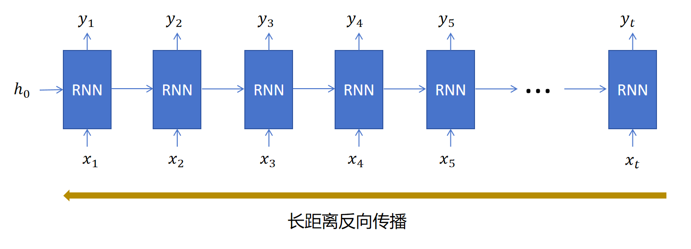
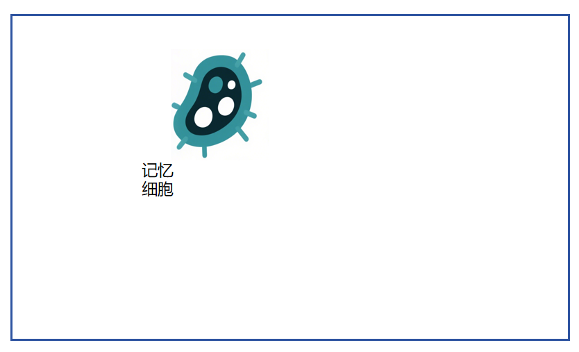
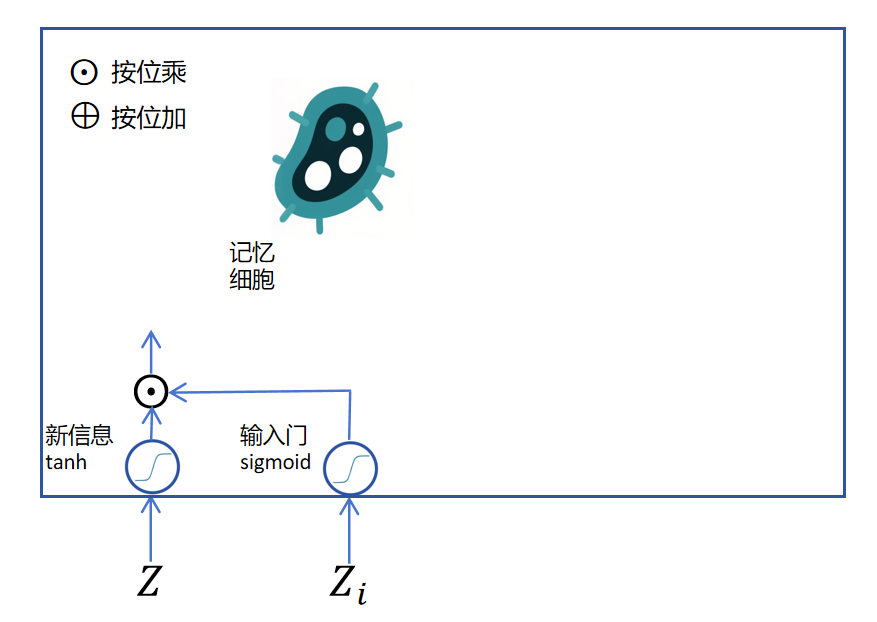
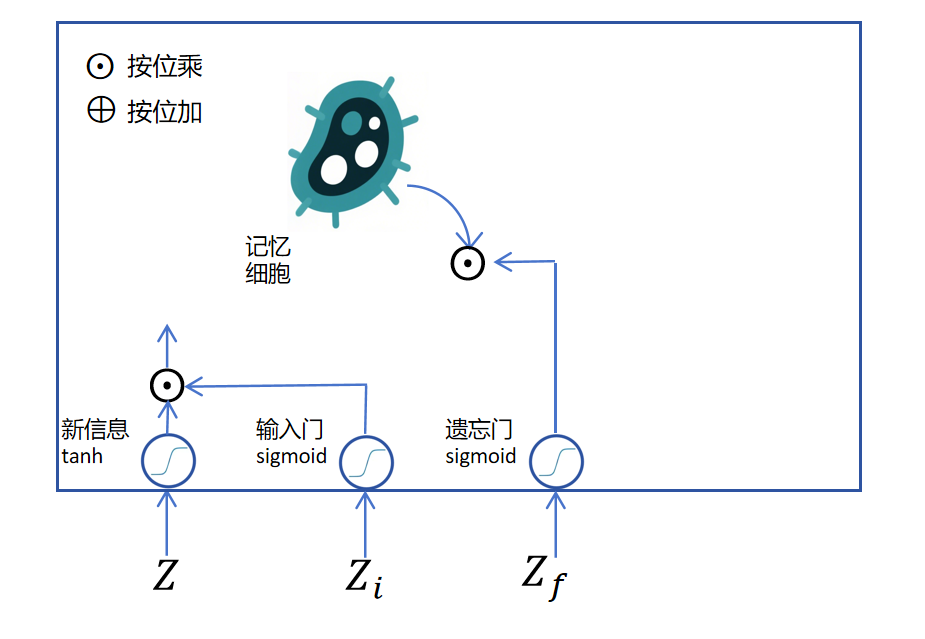
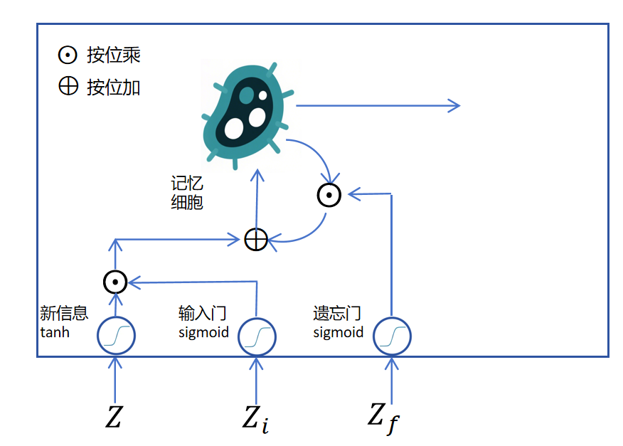
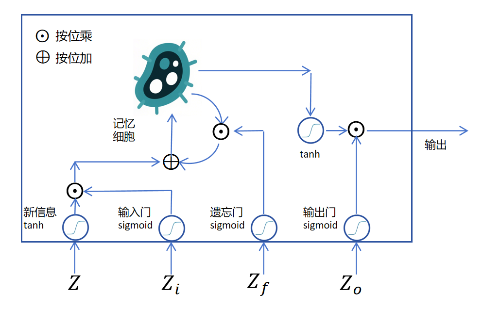
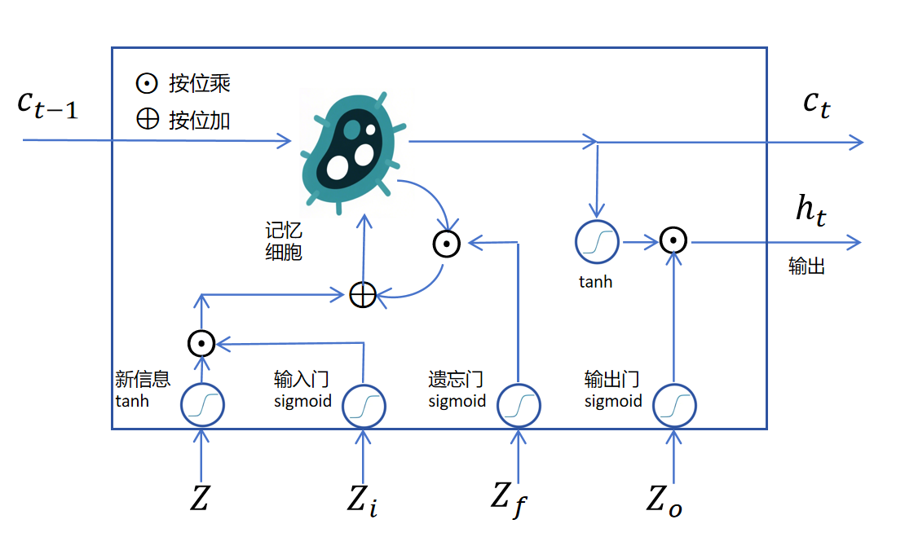
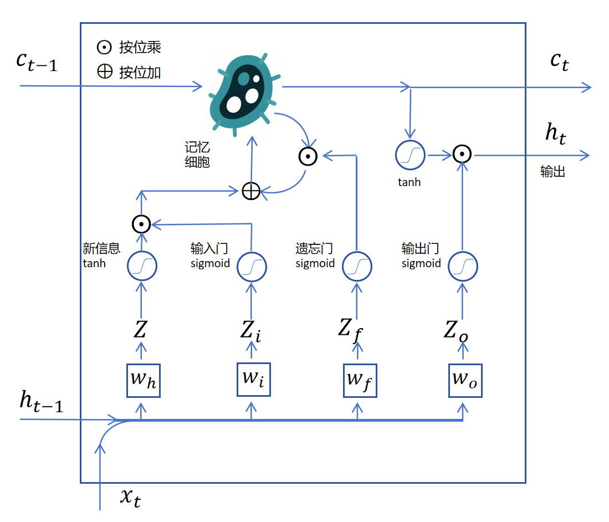
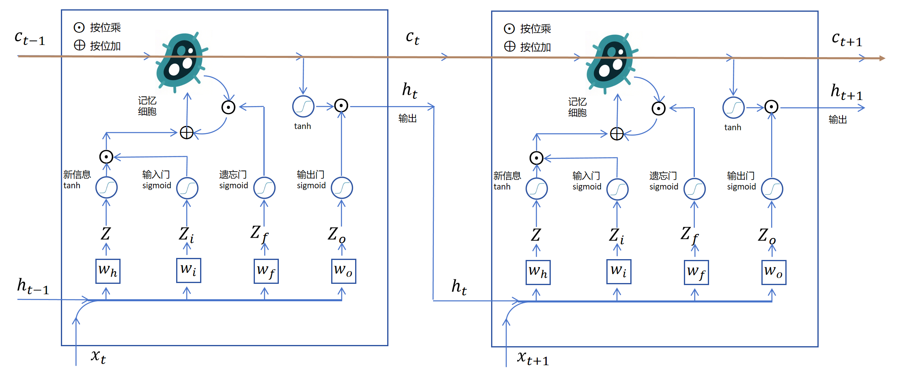

# LSTM

## 13.3 LSTM

这一节我们先来了解RNN中存在的问题，然后来看解决办法。

### 13.3.1 RNN中的问题

我们看下边这句话：

“**小强**是一个爱学习，有礼貌，每次考试成绩都很好，同时又热爱各种体育活动，对人热情大方的好学生。老师们都很喜欢**他**。”

可以看到这句话前边的token“小强”，影响最后一个token是“他”，而不是“她”。自然语言中存在大量的这种长期依赖，但是RNN的记忆一般是都是短期的，很难保留很长的时间步。

从前向传播来看，虽然每个时间步的RNN都通过隐状态向下一时间步传递信息，但是隐状态和当前步的输入一起进入线性层，激活函数。复杂的线性变化和激活函数，让隐状态很难经过多个时间步后还能完整的保留之前的记忆信息。所以隐状态本身传递的是一种短期记忆（Short-Term Memory）。

再从后向传播角度看，以上边的“小明”对应“他”的例子，如果训练时模型错误的输出为“她”，这个错误信息计算loss，生成模型在输入为“小强”时刻的参数的梯度，需要经过大量的时间步向后传递，大量小数值的梯度值相乘，会出现梯度消失的问题。这和深度神经网络梯度很难传递到网络靠前的层是一样的。

所以我们需要想办法解决RNN中长距离记忆传递，以及梯度消失的问题。

### 13.3.2 LSTM网络结构

LSTM（Long Short-Term Memory）长短期记忆网络就是被用来解决RNN没有长期记忆的问题的。

 如上图所示，LSTM是通过给RNN里增加一个记忆细胞来实现长期记忆的。  如上图所示，假如我们来了一个新的信息，它是一个神经网络的输出logits，用ZZZ表示，它是一个向量，里边有多个维度。经过激活函数`tanh`后为将要写入记忆细胞的记忆。这里它不能直接写入，要不然它就完全覆盖了老的记忆，达不到长期记忆的效果。解决办法就是我们通过一个门函数来控制当前新信息里的哪些维度可以写入到长期记忆里，这里的门函数是`sigmoid`，它输出的也是一个向量，取值是0到1，对新信息里的每个维度进行独立控制。因为sigmoid在大部分定义域都接近0或者1，所以它可以看做是允许某些维度的新信息进入长期记忆，某些维度的新信息不能进入长期记忆。如果是在0到1之间的值，就代表部分可以进入长期记忆，我们把这个门叫做输入门。

接下来我们看经过输入门筛选的新信息如何进入长期记忆。首先要取出记忆细胞内的长期记忆，取出长期记忆时，需要通过一个sigmoid的遗忘门，来遗忘长期记忆里某些维度的信息，如下图所示：

接下来把经过筛选的新信息和经过遗忘的长期记忆按位相加，然后经过一个`tanh`激活，作为当前记忆细胞待输出的记忆。如下图所示： 

目前的待输出信息是这个时间步更新后的长期记忆，需要经过一个`tanh`激活函数，进行转化，同时还要再加一个`sigmoid`的输出门来控制一下哪些值适合在当前时间步输出。这里的输出就对应之前RNN的隐状态。

LSTM通过输入门、遗忘门来控制对长期记忆的更新，通过输出门来控制隐状态的输出。上边描述的都是循环层，如果每个时间步需要输出，则对隐状态的输出增加普通层即可。

那记忆细胞的状态如何在多个时间步进行传递呢？原来的RNN在多个时间步之间传递一个隐状态hhh，现在就再多传递一个记忆细胞状态ccc。

之前我们还没有说上图中下边的四个向量Z,Zi,Zf,ZoZ,Z\_i,Z\_f,Z\_oZ,Zi​,Zf​,Zo​是怎么来的，它们实际上都是上一个状态的ht−1h\_{t-1}ht−1​和当前时刻的xtx\_txt​拼接后作为输入，分别做4个线性回归得到的logits值。这4个线性回归对应的权重分别为wh,wi,wf,wow\_h,w\_i,w\_f,w\_owh​,wi​,wf​,wo​。如下图所示：

我们把两个时刻的LSTM循环层连接起来：  此时你会发现记忆细胞的长期记忆有一个直接连接的通道，这条通道上没有线性回归，没有激活函数。长期记忆容易保持，反向传递时，梯度也更容易传递到前边的时间步。

### 13.3.3 公式化表达

上边我们通过图形化方式对LSTM进行了理解，下边我们用公式来定义每个向量的计算：

新信息的logits：

Z\=\[ht−1∣xt\]wh+bhZ = \[h\_{t-1}|x\_t\]w\_h+b\_hZ\=\[ht−1​∣xt​\]wh​+bh​

输入门：

Zi\=\[ht−1∣xt\]wi+biZ\_i = \[h\_{t-1}|x\_t\]w\_i+b\_iZi​\=\[ht−1​∣xt​\]wi​+bi​

Gi\=sigmoid(Zi)G\_i = sigmoid(Z\_i)Gi​\=sigmoid(Zi​)

遗忘门：

Zf\=\[ht−1∣xt\]wf+bfZ\_f = \[h\_{t-1}|x\_t\]w\_f+b\_fZf​\=\[ht−1​∣xt​\]wf​+bf​

Gf\=sigmoid(Zf)G\_f = sigmoid(Z\_f)Gf​\=sigmoid(Zf​)

输出门：

Zo\=\[ht−1∣xt\]wo+boZ\_o = \[h\_{t-1}|x\_t\]w\_o+b\_oZo​\=\[ht−1​∣xt​\]wo​+bo​

Go\=sigmoid(Zo)G\_o = sigmoid(Z\_o)Go​\=sigmoid(Zo​)

记忆细胞状态：

ct\=ct−1⊙Gf+tanh(Z)⊙Gic\_t = c\_{t-1}\\odot G\_f+ tanh(Z)\\odot G\_ict​\=ct−1​⊙Gf​+tanh(Z)⊙Gi​

隐状态：

ht\=tanh(ct)⊙Goh\_t = tanh(c\_t)\\odot G\_oht​\=tanh(ct​)⊙Go​

### 13.3.4 我的看法

我第一次学完LSTM，觉得这实在太复杂了，但是它的效果确实不错，在Transformer架构之前，它是解决序列问题最好的网络架构。如果你一次看不懂没有关系，多看几遍慢慢就理解了。我当年学习时也是反复多次才搞清楚的。

* * *

恭喜你，你已经掌握了RNN里最复杂的LSTM模型！

扫码请作者喝一杯咖啡来分享你的喜悦吧!

